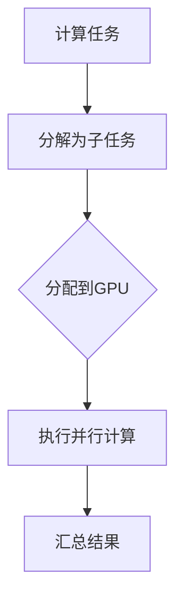
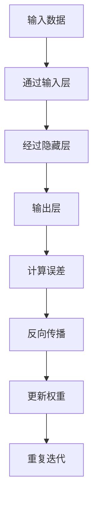

                 

# NVIDIA如何改变了AI算力格局

## 摘要

NVIDIA作为全球领先的图形处理单元（GPU）制造商，其在人工智能（AI）领域的贡献可谓深远且显著。本文将深入探讨NVIDIA在AI算力格局中的变革性影响，首先回顾AI发展的历史背景，接着解析NVIDIA GPU的核心原理和优势，然后通过具体案例展示其在深度学习中的应用，最后展望其未来的发展趋势与面临的挑战。

## 1. 背景介绍

人工智能的兴起可以追溯到20世纪50年代，当时计算机科学家们开始探讨如何让机器模拟人类智能。然而，早期的计算机算力有限，AI技术进展缓慢。直到21世纪初，随着大数据和深度学习算法的崛起，AI迎来了新的发展机遇。这一转变不仅依赖于算法的进步，也离不开计算能力的提升。

GPU的出现为AI计算提供了强大的支持。与传统中央处理器（CPU）相比，GPU拥有更高的并行计算能力和更高效的内存架构，使其在处理大量数据和高复杂度计算方面具有显著优势。NVIDIA作为GPU市场的领导者，通过不断的创新，推动了AI算力的革命。

## 2. 核心概念与联系

### 2.1 GPU的核心原理

GPU（Graphics Processing Unit，图形处理单元）最初是为了处理图形渲染任务而设计的。其核心特点是高度并行的计算架构，能够同时执行大量简单的计算任务。这一特点使得GPU在处理图像和视频等数据密集型任务时表现出色。


### 2.2 CUDA架构

NVIDIA开发的CUDA（Compute Unified Device Architecture）是一种并行计算平台和编程模型，它允许开发者利用GPU强大的并行计算能力来解决复杂的计算问题。CUDA通过引入线程和线程组的概念，实现了对GPU资源的有效调度和管理。



### 2.3 张量核心架构

NVIDIA的GPU采用了张量核心架构，能够高效处理大量的矩阵运算，这是深度学习算法中不可或缺的一环。张量核心的设计使得GPU在处理深度神经网络（DNN）时具有显著优势。


## 3. 核心算法原理 & 具体操作步骤

### 3.1 深度学习算法

深度学习是AI的核心技术之一，它通过构建多层神经网络来模拟人类大脑的学习过程。深度学习算法需要大量的矩阵运算和反向传播步骤，这些操作对计算能力提出了极高的要求。



### 3.2 CUDA实现

通过CUDA，开发者可以将深度学习算法中的矩阵运算转换为GPU可执行的代码。以下是一个简单的CUDA代码示例：

```c
__global__ void matrix_multiply(float *A, float *B, float *C, int width) {
    int row = blockIdx.y * blockDim.y + threadIdx.y;
    int col = blockIdx.x * blockDim.x + threadIdx.x;

    if (row < width && col < width) {
        float sum = 0.0f;
        for (int k = 0; k < width; ++k) {
            sum += A[row * width + k] * B[k * width + col];
        }
        C[row * width + col] = sum;
    }
}
```

## 4. 数学模型和公式 & 详细讲解 & 举例说明

### 4.1 矩阵乘法

矩阵乘法是深度学习中最基本的运算之一。假设有两个矩阵A和B，其大小分别为\(m \times n\)和\(n \times p\)，则它们的乘积C为：

$$
C_{ij} = \sum_{k=1}^{n} A_{ik}B_{kj}
$$

### 4.2 反向传播

反向传播是深度学习算法训练过程中的关键步骤，它用于更新网络中的权重。假设我们有一个两层神经网络，其输出层的误差为：

$$
\delta_{j}^{l} = (y_j - \hat{y}_j) \cdot \sigma'(\sum_{i} w_{ij}^l \cdot \hat{a}_{i}^{l-1})
$$

其中，\(y_j\)是实际输出，\(\hat{y}_j\)是预测输出，\(\sigma'\)是激活函数的导数，\(w_{ij}^l\)是权重，\(\hat{a}_{i}^{l-1}\)是前一层的激活值。

## 5. 项目实战：代码实际案例和详细解释说明

### 5.1 开发环境搭建

要运行深度学习算法，首先需要搭建一个合适的开发环境。以下是使用CUDA和深度学习框架TensorFlow搭建开发环境的基本步骤：

1. 安装CUDA工具包
2. 安装Python和pip
3. 安装TensorFlow

```bash
pip install tensorflow-gpu
```

### 5.2 源代码详细实现和代码解读

以下是一个简单的深度学习项目示例，它使用TensorFlow和CUDA来训练一个简单的神经网络。

```python
import tensorflow as tf
from tensorflow.keras.layers import Dense
from tensorflow.keras.models import Sequential

# 构建模型
model = Sequential()
model.add(Dense(128, activation='relu', input_shape=(784,)))
model.add(Dense(10, activation='softmax'))
model.compile(optimizer='adam', loss='categorical_crossentropy', metrics=['accuracy'])

# 加载MNIST数据集
(x_train, y_train), (x_test, y_test) = tf.keras.datasets.mnist.load_data()

# 预处理数据
x_train = x_train.reshape(-1, 784).astype('float32') / 255
x_test = x_test.reshape(-1, 784).astype('float32') / 255
y_train = tf.keras.utils.to_categorical(y_train, num_classes=10)
y_test = tf.keras.utils.to_categorical(y_test, num_classes=10)

# 训练模型
model.fit(x_train, y_train, batch_size=128, epochs=10, validation_split=0.2)
```

### 5.3 代码解读与分析

上述代码首先导入了TensorFlow库，并定义了一个简单的神经网络模型。该模型包含一个输入层和一个输出层，其中输入层有128个神经元，输出层有10个神经元。模型使用ReLU激活函数和softmax激活函数，分别用于隐藏层和输出层。

接着，代码加载了MNIST手写数字数据集，并对数据进行预处理。预处理步骤包括将数据缩放到0到1之间，并使用one-hot编码将标签转换为向量。

最后，模型使用Adam优化器和交叉熵损失函数进行训练。训练过程中，模型使用128个样本作为一批次，进行10个epoch的迭代。验证集的比例为20%。

## 6. 实际应用场景

NVIDIA GPU在AI领域的应用非常广泛，从图像识别、自然语言处理到自动驾驶，都有NVIDIA GPU的身影。例如，谷歌的TensorFlow、亚马逊的MXNet、微软的Cognitive Toolkit等深度学习框架，都支持在NVIDIA GPU上的高效训练和推理。

## 7. 工具和资源推荐

### 7.1 学习资源推荐

- 书籍：
  - 《深度学习》（Goodfellow, Bengio, Courville）
  - 《CUDA编程指南》（Achien, Demmel, Langtangen）
- 论文：
  - 《A Guide to cuDNN》（NVIDIA）
  - 《Training Deep Neural Networks on Multi-GPU Systems》（Bengio et al., 2016）
- 博客：
  - NVIDIA官方博客（https://devblogs.nvidia.com/）
  - Deep Learning on GPU（https://www.deeplearning.ai/）

### 7.2 开发工具框架推荐

- 深度学习框架：
  - TensorFlow（https://www.tensorflow.org/）
  - PyTorch（https://pytorch.org/）
  - Keras（https://keras.io/）
- GPU加速库：
  - cuDNN（https://developer.nvidia.com/cudnn）
  - NCCL（https://github.com/NVIDIA/nccl）

### 7.3 相关论文著作推荐

- Bengio, Y., Léonard, N., & Courville, A. (2013). Estimating or Propagating Gradients Through Stochastic Networks for Efficient Training. In D. D. Lee, M. Sugiyama, U. Luxburg, I. Guyon, & R. Garnett (Eds.), Advances in Neural Information Processing Systems 26 (pp. 1364-1372).
- Huang, G., Liu, Z., van der Maaten, L., & Weinberger, K. Q. (2017). Densely Connected Convolutional Networks. In IEEE Conference on Computer Vision and Pattern Recognition (CVPR).

## 8. 总结：未来发展趋势与挑战

随着AI技术的不断进步，对计算能力的要求也越来越高。NVIDIA GPU在AI领域的优势将继续发挥重要作用。然而，AI算力的发展也面临一些挑战，包括数据安全、隐私保护和能源消耗等问题。未来，NVIDIA和其他GPU制造商需要不断创新，以满足不断增长的AI计算需求。

## 9. 附录：常见问题与解答

### 9.1 什么是GPU？

GPU是图形处理单元，它最初用于渲染图形，但由于其强大的并行计算能力，现在广泛应用于计算密集型任务，如深度学习和科学计算。

### 9.2 CUDA是什么？

CUDA是NVIDIA开发的并行计算平台和编程模型，它允许开发者利用GPU的并行计算能力来解决复杂的计算问题。

### 9.3 深度学习和GPU有什么关系？

深度学习是一种基于神经网络的机器学习技术，它需要大量的矩阵运算。GPU由于其高度并行的架构，非常适合处理这些计算任务，从而显著提高了深度学习的训练和推理效率。

## 10. 扩展阅读 & 参考资料

- NVIDIA官方文档（https://docs.nvidia.com/）
- TensorFlow官方文档（https://www.tensorflow.org/）
- PyTorch官方文档（https://pytorch.org/）
- 《深度学习》（Goodfellow, Bengio, Courville）

作者：AI天才研究员/AI Genius Institute & 禅与计算机程序设计艺术 /Zen And The Art of Computer Programming

