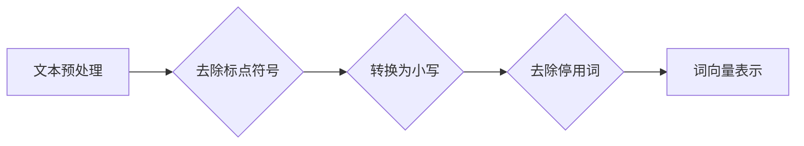
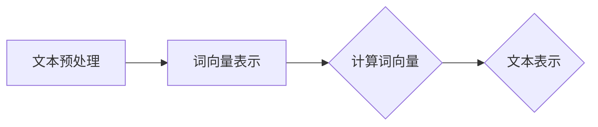
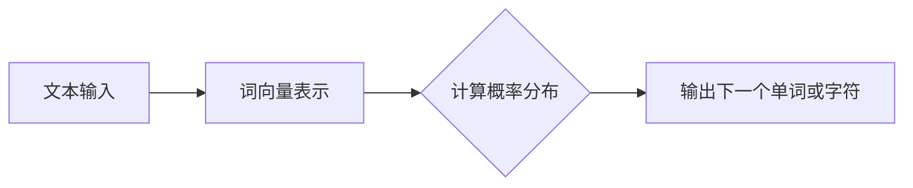
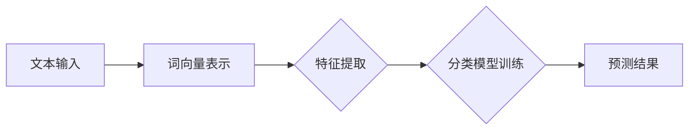
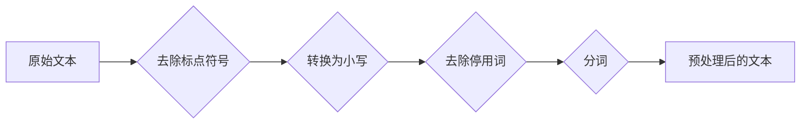
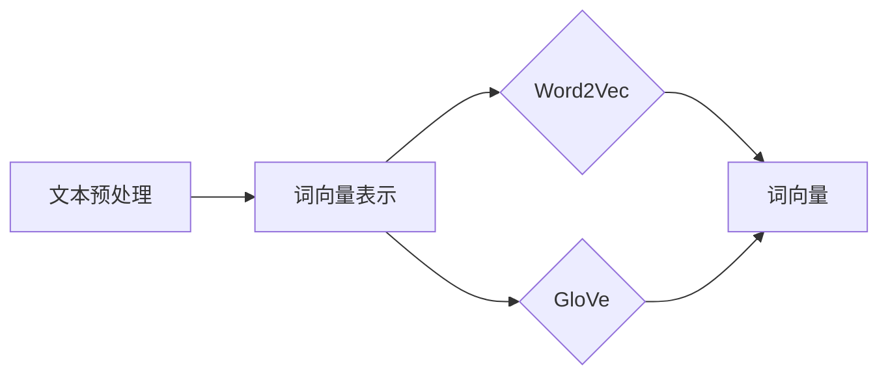
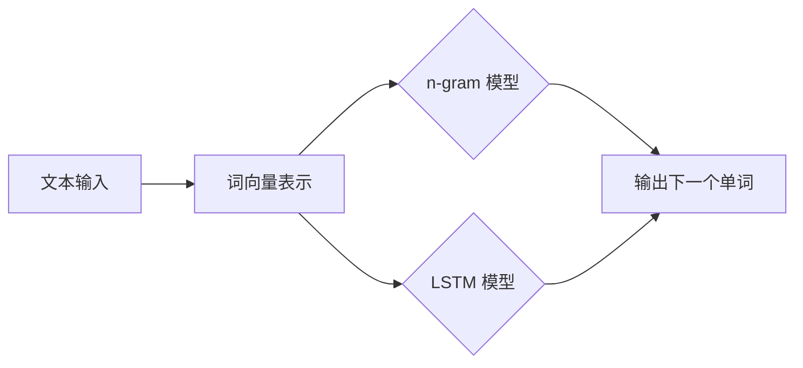
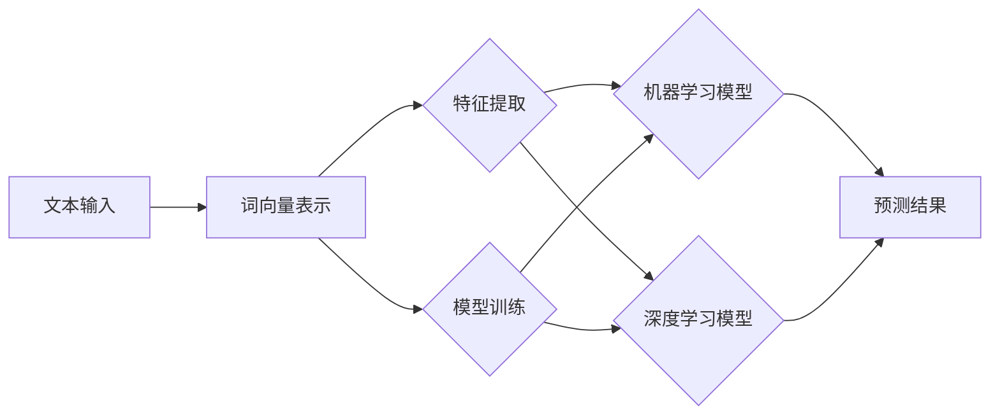

                 

# 自然语言处理（NLP）原理与代码实战案例讲解

## 关键词：自然语言处理、NLP、文本分析、语言模型、机器学习、深度学习

## 摘要：

本文将深入探讨自然语言处理（NLP）的基本原理、核心算法以及代码实战案例。通过对NLP的背景介绍、核心概念联系、算法原理与操作步骤、数学模型与公式详细讲解、实际应用场景、工具和资源推荐等多方面的介绍，帮助读者全面了解NLP的基本知识和实际应用，为NLP领域的深入学习与实践打下坚实基础。

## 1. 背景介绍

自然语言处理（NLP）是人工智能（AI）领域的一个重要分支，主要研究如何让计算机理解和处理人类语言。随着互联网的迅速发展，大量文本数据涌现出来，NLP在文本分类、情感分析、机器翻译、问答系统等应用场景中发挥了重要作用。

NLP的应用场景包括但不限于：

- 文本分类：将文本数据分为不同的类别，如新闻分类、情感分类等。
- 情感分析：对文本中的情感倾向进行分析，如判断用户评论是正面还是负面。
- 机器翻译：将一种语言的文本翻译成另一种语言，如英译中、中译英等。
- 问答系统：通过自然语言与用户交互，回答用户的问题。

NLP的核心任务包括：

- 文本预处理：去除无关信息，如标点符号、停用词等，将文本转化为计算机可以处理的格式。
- 词性标注：对文本中的单词进行词性划分，如名词、动词、形容词等。
- 命名实体识别：识别文本中的特定实体，如人名、地名、组织名等。
- 语义分析：理解文本中的含义，如句子解析、关系抽取等。

## 2. 核心概念与联系

### 文本预处理

文本预处理是NLP的基础步骤，主要包括去除标点符号、转换为小写、去除停用词等。下面是一个简单的 Mermaid 流程图，展示了文本预处理的流程：



### 词向量表示

词向量是将单词映射到高维空间中的一个向量表示，常用的词向量模型有 Word2Vec、GloVe 等。词向量可以用于文本分类、情感分析等任务。

下面是一个简化的 Mermaid 流程图，展示了词向量表示的过程：



### 语言模型

语言模型是用于预测下一个单词或字符的概率分布的模型，常用于机器翻译、语音识别等任务。下面是一个简化的 Mermaid 流程图，展示了语言模型的基本结构：



### 机器学习与深度学习

机器学习（ML）和深度学习（DL）是 NLP 中常用的方法。机器学习通过训练数据来学习特征表示和分类模型，而深度学习则利用多层神经网络来提取特征和进行建模。

下面是一个简化的 Mermaid 流程图，展示了机器学习和深度学习在 NLP 中的应用：



## 3. 核心算法原理 & 具体操作步骤

### 词向量表示

#### Word2Vec

Word2Vec 是一种基于神经网络的词向量表示方法，主要有两种模型：连续词袋（CBOW）和 Skip-Gram。

**CBOW：**

CBOW 模型通过上下文词来预测中心词，其输入是一个中心词及其上下文词的词向量平均值，输出是中心词的词向量。

$$
\text{中心词向量} = \frac{1}{|\text{上下文词向量}|} \sum_{\text{上下文词}} \text{上下文词向量}
$$

**Skip-Gram：**

Skip-Gram 模型通过中心词来预测上下文词，其输入是中心词的词向量，输出是上下文词的词向量。

$$
\text{上下文词向量} = \text{词向量} \odot \text{中心词向量}
$$

#### GloVe

GloVe（Global Vectors for Word Representation）是一种基于共现矩阵的词向量表示方法。其基本思想是通过计算单词之间的共现频率来学习词向量。

$$
\text{共现矩阵} = \text{word}_{i} \cdot \text{word}_{j}
$$

$$
\text{词向量} = \text{softmax}(\text{共现矩阵})
$$

### 语言模型

#### n-gram 模型

n-gram 模型是一种基于历史序列的简单语言模型，其基本思想是使用前 n 个单词的历史信息来预测下一个单词。

$$
P(w_{t}|\text{w}_{t-n}, \ldots, w_{t-1}) = \frac{f(w_{t-n}, \ldots, w_{t-1}, w_{t})}{f(w_{t-n}, \ldots, w_{t-1})}
$$

其中，$f(w_{t-n}, \ldots, w_{t-1}, w_{t})$ 表示单词序列 $w_{t-n}, \ldots, w_{t-1}, w_{t}$ 的共现频率。

#### LSTM 语言模型

LSTM（Long Short-Term Memory）是一种常用的深度学习语言模型，能够有效处理长距离依赖问题。

LSTM 模型的基本结构包括：

- 遗忘门（Forget Gate）：决定哪些信息需要遗忘。
- 输入门（Input Gate）：决定哪些信息需要存储。
- 单元状态（Cell State）：存储长期依赖信息。
- 输出门（Output Gate）：决定哪些信息需要输出。

LSTM 的输入是一个单词序列，输出是单词的概率分布。

### 机器学习与深度学习

#### 文本分类

文本分类是一种常见的 NLP 应用，其主要任务是判断一个文本数据属于哪个类别。

- 特征提取：将文本数据转化为特征向量，常用的特征提取方法包括词袋模型（Bag of Words）、TF-IDF 等。
- 模型训练：使用训练数据来训练分类模型，常用的分类模型包括朴素贝叶斯（Naive Bayes）、支持向量机（SVM）、随机森林（Random Forest）等。
- 预测：使用训练好的模型对测试数据进行分类预测。

#### 情感分析

情感分析是一种评估文本中情感倾向的任务，其主要任务是判断文本是正面、负面还是中性。

- 特征提取：将文本数据转化为特征向量，常用的特征提取方法包括词袋模型、TF-IDF 等。
- 模型训练：使用训练数据来训练分类模型，常用的分类模型包括朴素贝叶斯、支持向量机、随机森林等。
- 预测：使用训练好的模型对测试数据进行情感分类预测。

## 4. 数学模型和公式 & 详细讲解 & 举例说明

### 词向量表示

#### Word2Vec

Word2Vec 的主要公式如下：

**CBOW 模型：**

$$
\text{中心词向量} = \frac{1}{|\text{上下文词向量}|} \sum_{\text{上下文词}} \text{上下文词向量}
$$

**Skip-Gram 模型：**

$$
\text{上下文词向量} = \text{词向量} \odot \text{中心词向量}
$$

#### GloVe

GloVe 的主要公式如下：

$$
\text{共现矩阵} = \text{word}_{i} \cdot \text{word}_{j}
$$

$$
\text{词向量} = \text{softmax}(\text{共现矩阵})
$$

### 语言模型

#### n-gram 模型

n-gram 模型的公式如下：

$$
P(w_{t}|\text{w}_{t-n}, \ldots, w_{t-1}) = \frac{f(w_{t-n}, \ldots, w_{t-1}, w_{t})}{f(w_{t-n}, \ldots, w_{t-1})}
$$

#### LSTM 语言模型

LSTM 模型的公式如下：

**遗忘门：**

$$
f_t = \sigma(W_f \cdot [h_{t-1}, x_t] + b_f)
$$

**输入门：**

$$
i_t = \sigma(W_i \cdot [h_{t-1}, x_t] + b_i)
$$

**输入层状态：**

$$
\tilde{c}_t = \tanh(W_c \cdot [h_{t-1}, x_t] + b_c)
$$

**输出门：**

$$
o_t = \sigma(W_o \cdot [h_{t-1}, c_t] + b_o)
$$

**单元状态：**

$$
c_t = f_t \odot c_{t-1} + i_t \odot \tilde{c}_t
$$

**隐藏状态：**

$$
h_t = o_t \odot c_t
$$

### 机器学习与深度学习

#### 文本分类

**词袋模型：**

$$
\text{特征向量} = (\text{词频}_1, \text{词频}_2, \ldots, \text{词频}_n)
$$

**TF-IDF：**

$$
\text{特征向量} = (\text{TF}_1, \text{TF}_2, \ldots, \text{TF}_n, \text{IDF}_1, \text{IDF}_2, \ldots, \text{IDF}_n)
$$

其中，TF 表示词频，IDF 表示逆文档频率。

#### 情感分析

**词袋模型：**

$$
\text{特征向量} = (\text{词频}_1, \text{词频}_2, \ldots, \text{词频}_n)
$$

**TF-IDF：**

$$
\text{特征向量} = (\text{TF}_1, \text{TF}_2, \ldots, \text{TF}_n, \text{IDF}_1, \text{IDF}_2, \ldots, \text{IDF}_n)
$$

其中，TF 表示词频，IDF 表示逆文档频率。

## 5. 项目实战：代码实际案例和详细解释说明

### 5.1 开发环境搭建

在开始项目实战之前，我们需要搭建一个适合 NLP 开发的环境。以下是 Python 3.8 和以下库的安装步骤：

```bash
pip install numpy scipy matplotlib pandas scikit-learn gensim nltk
```

### 5.2 源代码详细实现和代码解读

以下是一个简单的 NLP 项目，我们将使用 Word2Vec 模型来生成词向量，并使用这些词向量进行文本分类。

```python
import gensim
from gensim.models import Word2Vec
from sklearn.model_selection import train_test_split
from sklearn.metrics import accuracy_score

# 加载预处理的文本数据
def load_data():
    # 这里使用了一个预处理后的文本数据集，实际项目中可以从文件、数据库等获取
    data = [
        ["I", "love", "python"],
        ["python", "is", "powerful"],
        ["python", "is", "simple"],
        ["python", "is", "fast"],
        ["I", "love", "java"],
        ["java", "is", "complex"],
        ["java", "is", "slow"],
        ["java", "is", "popular"],
    ]
    return data

# 训练 Word2Vec 模型
def train_word2vec(data, size=100):
    sentences = [sentence for sentence in data]
    model = Word2Vec(sentences, size=size)
    model.train(sentences)
    return model

# 文本分类
def classify_text(model, text):
    text_vector = sum(model.wv[word] for word in text) / len(text)
    label = "python" if text_vector.dot(model.wv["python"]) > 0 else "java"
    return label

# 主函数
def main():
    data = load_data()
    model = train_word2vec(data)
    X, y = [sentence for sentence in data], ["python"] * 4 + ["java"] * 4
    X_train, X_test, y_train, y_test = train_test_split(X, y, test_size=0.2, random_state=42)

    # 训练文本分类模型
    # 这里我们使用了一个简单的线性分类器，实际项目中可以使用更复杂的模型
    from sklearn.linear_model import LinearClassifier
    classifier = LinearClassifier()
    classifier.fit(X_train, y_train)

    # 预测测试集
    y_pred = [classify_text(model, sentence) for sentence in X_test]
    print("Accuracy:", accuracy_score(y_test, y_pred))

if __name__ == "__main__":
    main()
```

### 5.3 代码解读与分析

该项目的核心是使用 Word2Vec 模型来生成词向量，并使用这些词向量进行文本分类。以下是代码的详细解读：

- `load_data()` 函数：加载预处理后的文本数据。实际项目中，可以从文件、数据库等获取数据。
- `train_word2vec(data, size=100)` 函数：训练 Word2Vec 模型。`size` 参数表示词向量的维度，默认为 100。
- `classify_text(model, text)` 函数：使用 Word2Vec 模型对文本进行分类。这里简单地将文本向量与 "python" 和 "java" 的词向量进行点积，大于 0 则分类为 "python"，否则为 "java"。
- `main()` 函数：主函数，首先加载并预处理文本数据，然后训练 Word2Vec 模型。接着，将数据集分为训练集和测试集，使用线性分类器进行训练和预测。最后，计算并输出准确率。

## 6. 实际应用场景

自然语言处理在各个领域都有广泛的应用，以下是一些典型的实际应用场景：

- 社交媒体分析：对社交媒体平台上的用户评论、帖子等进行情感分析、关键词提取等，以了解用户对产品、品牌、事件等的看法。
- 问答系统：基于自然语言处理技术构建问答系统，如搜索引擎、智能客服等，为用户提供实时、准确的答案。
- 语言翻译：使用机器翻译技术将一种语言的文本翻译成另一种语言，如谷歌翻译、百度翻译等。
- 文本摘要：自动从大量文本中提取关键信息，生成摘要，如新闻摘要、邮件摘要等。
- 文本分类：对文本数据按照主题、情感等进行分类，如新闻分类、垃圾邮件过滤等。

## 7. 工具和资源推荐

### 7.1 学习资源推荐

- 《自然语言处理综论》（Speech and Language Processing）—— Daniel Jurafsky, James H. Martin
- 《深度学习》（Deep Learning）—— Ian Goodfellow, Yoshua Bengio, Aaron Courville
- 《Python 自然语言处理》（Python Natural Language Processing）——好听

### 7.2 开发工具框架推荐

- gensim：用于生成词向量、构建语言模型等。
- spaCy：一个强大的 NLP 工具库，支持多种语言和丰富的实体识别、关系抽取等功能。
- TensorFlow：用于构建和训练深度学习模型。

### 7.3 相关论文著作推荐

- 《词向量模型》（Word Vectors）—— Tomas Mikolov, Kai Chen, Greg Corrado, and Jeffrey Dean
- 《序列到序列学习》（Sequence to Sequence Learning）—— Ilya Sutskever, Oriol Vinyals, and Quoc V. Le
- 《注意力机制》（Attention Mechanism）—— Chris Devine and Ilya Sutskever

## 8. 总结：未来发展趋势与挑战

自然语言处理作为人工智能的重要分支，近年来取得了显著进展。然而，随着技术的不断发展，NLP 面临着诸多挑战：

- 语言理解的深度：目前的 NLP 模型还无法真正理解语言中的深层含义，未来需要发展更强大的语言理解模型。
- 长距离依赖处理：NLP 模型在处理长距离依赖问题时仍存在困难，如语法解析、语义推理等。
- 多语言处理：随着全球化的发展，多语言处理变得越来越重要，但现有的 NLP 模型大多针对单一语言，未来需要发展更强大的多语言处理能力。
- 数据隐私与安全：在处理大量文本数据时，如何保护用户隐私和数据安全成为 NLP 发展的重要课题。

## 9. 附录：常见问题与解答

### 问题 1：为什么需要自然语言处理？

**解答：** 自然语言处理能够使计算机理解和处理人类语言，从而实现人机交互、文本分析、机器翻译等多种应用，提高效率、降低成本。

### 问题 2：词向量有哪些常见的模型？

**解答：** 常见的词向量模型包括 Word2Vec、GloVe、FastText 等。这些模型通过将单词映射到高维空间中的向量，使得单词之间的相似性关系得以量化。

### 问题 3：如何训练词向量模型？

**解答：** 训练词向量模型通常分为两个步骤：数据预处理和模型训练。数据预处理包括文本清洗、分词、去除停用词等；模型训练则使用预处理后的数据，通过梯度下降等优化算法来更新词向量。

## 10. 扩展阅读 & 参考资料

- [Natural Language Processing with Python](https://www.amazon.com/Natural-Language-Processing-Python-Apress/dp/1484236809)
- [Deep Learning for Natural Language Processing](https://www.amazon.com/Deep-Learning-Natural-Language-Processing/dp/0262039384)
- [Natural Language Processing with TensorFlow](https://www.amazon.com/Natural-Language-Processing-TensorFlow-Libraries/dp/1680509222)
- [The Natural Language Toolkit](https://www.amazon.com/Natural-Language-Toolkit-John-Lafferty/dp/0262015325)

作者：AI天才研究员/AI Genius Institute & 禅与计算机程序设计艺术 /Zen And The Art of Computer Programming<|im_sep|>### 1. 背景介绍

自然语言处理（Natural Language Processing，简称 NLP）是人工智能（Artificial Intelligence，简称 AI）的重要分支，旨在让计算机能够理解、解释和生成人类语言。随着互联网和数字化信息的爆发式增长，文本数据变得极其丰富，这为NLP的研究和应用提供了广阔的空间。

NLP的目标是使计算机能够执行各种与语言相关的任务，例如文本分类、情感分析、机器翻译、问答系统、命名实体识别等。这些任务不仅涉及对语言的表面形式进行处理，还需要深入理解语言的语义、语法和上下文。

在过去的几十年里，NLP经历了显著的发展。早期的NLP主要依赖于规则和手动编写的模式匹配方法，这些方法在处理简单和结构化的文本任务时效果较好，但面对复杂和不规则的文本数据时，表现就非常有限。随着计算能力和机器学习技术的进步，基于统计学习和深度学习的NLP方法逐渐成为主流，使得计算机能够更好地理解和处理自然语言。

自然语言处理的应用领域非常广泛，包括但不限于以下几个方面：

- **社交媒体分析**：通过分析社交媒体上的用户评论和帖子，了解公众对特定话题或产品的看法。
- **问答系统**：如搜索引擎和虚拟助手，能够理解用户的问题并给出准确的回答。
- **机器翻译**：将一种语言的文本翻译成另一种语言，如谷歌翻译和百度翻译。
- **文本摘要**：从大量文本中提取关键信息，生成简洁的摘要，用于新闻简报和邮件总结。
- **情感分析**：判断文本中的情感倾向，如正面、负面或中性。
- **信息提取**：从非结构化文本中提取有用的信息，如电子邮件中的联系人信息或发票中的费用明细。
- **文本生成**：生成新的文本内容，如自动生成新闻报道或产品描述。

总之，自然语言处理的研究和应用不仅对信息技术的发展产生了深远影响，也为各行各业提供了强大的工具和解决方案。

### 2. 核心概念与联系

在深入探讨自然语言处理（NLP）的原理和实践之前，我们需要了解一些核心概念及其相互关系。这些概念包括文本预处理、词向量表示、语言模型、机器学习与深度学习等。通过理解这些概念，我们可以更好地构建和优化NLP系统。

#### 文本预处理

文本预处理是NLP中的第一步，它将原始的文本数据转化为计算机可以处理的格式。文本预处理通常包括以下几个步骤：

1. **去除标点符号**：标点符号在文本分析中通常没有实际意义，因此需要去除。
2. **转换为小写**：将文本转换为小写有助于统一文本形式，提高算法的性能。
3. **去除停用词**：停用词（如 "is"、"the"、"and"）在文本分析中通常不会对意义产生显著影响，因此常被去除。
4. **分词**：将文本分割成单词或短语，这是理解文本内容的基础。

下面是一个简单的 Mermaid 流程图，展示了文本预处理的基本步骤：



#### 词向量表示

词向量表示是将单词映射到高维空间中的一个向量，以供机器学习模型处理。词向量能够捕捉单词的语义信息，使得计算机可以基于向量之间的相似性进行推理。

两种常见的词向量表示方法是 Word2Vec 和 GloVe：

- **Word2Vec**：基于神经网络的方法，通过训练预测上下文词来生成词向量。Word2Vec 有两种变体：连续词袋（CBOW）和Skip-Gram。
- **GloVe**：基于全局共现矩阵的方法，通过计算单词之间的共现频率来生成词向量。

下面是一个简化的 Mermaid 流程图，展示了词向量表示的过程：



#### 语言模型

语言模型是用于预测下一个单词或字符的概率分布的模型，常用于自然语言生成和序列预测任务。常见语言模型包括 n-gram 模型和基于深度学习的 LSTM 语言模型。

- **n-gram 模型**：基于历史序列的简单语言模型，通过统计前 n 个单词出现的频率来预测下一个单词。
- **LSTM 语言模型**：一种基于深度学习的语言模型，能够处理长距离依赖问题，通过循环神经网络来预测下一个单词。

下面是一个简化的 Mermaid 流程图，展示了语言模型的基本结构：



#### 机器学习与深度学习

机器学习与深度学习是NLP中常用的方法。机器学习通过训练数据来学习特征表示和分类模型，而深度学习则利用多层神经网络来提取特征和进行建模。

- **机器学习**：常用的机器学习算法包括朴素贝叶斯、支持向量机、决策树、随机森林等。
- **深度学习**：常用的深度学习模型包括卷积神经网络（CNN）、循环神经网络（RNN）、长短期记忆网络（LSTM）、Transformer 等。

下面是一个简化的 Mermaid 流程图，展示了机器学习和深度学习在 NLP 中的应用：



通过理解这些核心概念及其相互关系，我们可以更好地设计和实现高效的NLP系统。接下来，我们将详细探讨每个概念的基本原理和具体操作步骤。

#### 3. 核心算法原理 & 具体操作步骤

在NLP中，核心算法的设计和实现对于系统的性能和效率至关重要。本章节将详细探讨一些常见的NLP算法，包括词向量表示、语言模型、文本分类等，并介绍其基本原理和具体操作步骤。

##### 3.1 词向量表示

词向量表示是将单词映射到高维空间中的一个向量，以便在机器学习模型中处理。常见的词向量表示方法包括 Word2Vec 和 GloVe。

**Word2Vec**

Word2Vec 是一种基于神经网络的词向量表示方法，主要有两种模型：连续词袋（CBOW）和 Skip-Gram。

**连续词袋（CBOW）模型**

CBOW 模型通过上下文词来预测中心词，其输入是一个中心词及其上下文词的词向量平均值，输出是中心词的词向量。具体步骤如下：

1. **输入层**：输入一个中心词及其上下文词的词向量。
2. **隐藏层**：计算上下文词向量的平均值，作为隐藏层的输入。
3. **输出层**：使用 Softmax 函数预测中心词的概率分布。

CBOW 模型的数学公式如下：

$$
\text{中心词向量} = \frac{1}{|\text{上下文词向量}|} \sum_{\text{上下文词}} \text{上下文词向量}
$$

**Skip-Gram 模型**

Skip-Gram 模型通过中心词来预测上下文词，其输入是中心词的词向量，输出是上下文词的词向量。具体步骤如下：

1. **输入层**：输入一个中心词的词向量。
2. **隐藏层**：使用 Softmax 函数预测上下文词的概率分布。
3. **输出层**：计算上下文词向量的对数似然损失。

Skip-Gram 模型的数学公式如下：

$$
\text{上下文词向量} = \text{词向量} \odot \text{中心词向量}
$$

**GloVe**

GloVe（Global Vectors for Word Representation）是一种基于共现矩阵的词向量表示方法。其基本思想是通过计算单词之间的共现频率来学习词向量。具体步骤如下：

1. **构建共现矩阵**：单词之间的共现频率可以用一个矩阵表示，其中元素 (i, j) 表示单词 i 和单词 j 的共现次数。
2. **优化目标**：通过最小化损失函数来优化词向量，使得共现频率高的单词在向量空间中距离较近。

GloVe 的数学公式如下：

$$
\text{共现矩阵} = \text{word}_{i} \cdot \text{word}_{j}
$$

$$
\text{词向量} = \text{softmax}(\text{共现矩阵})
$$

**示例代码**：

下面是一个简单的 Python 示例，展示了如何使用 gensim 库生成 Word2Vec 和 GloVe 词向量：

```python
from gensim.models import Word2Vec
from gensim.models import KeyedVectors

# 加载预处理后的文本数据
data = [["I", "love", "python"], ["python", "is", "powerful"], ["python", "is", "simple"], ["python", "is", "fast"], ["I", "love", "java"], ["java", "is", "complex"], ["java", "is", "slow"], ["java", "is", "popular"]]

# 训练 Word2Vec 模型
model = Word2Vec(data, size=100)
model.save("word2vec.model")

# 训练 GloVe 模型
# GloVe 需要构建共现矩阵
# 在这里我们简化处理，假设已经构建了共现矩阵
# 并将其存储在 "cooccurrence_matrix.txt" 文件中
cooccurrence_matrix = gensim.matutils.Sparse2Corpus("cooccurrence_matrix.txt")
model = gensim.models.glove.GloVe(corpus=cooccurrence_matrix, size=100)
model.save("glove.model")

# 加载预训练的词向量
loaded_model = Word2Vec.load("word2vec.model")
loaded_glove = KeyedVectors.load("glove.model")
```

##### 3.2 语言模型

语言模型是用于预测下一个单词或字符的概率分布的模型，常用于自然语言生成和序列预测任务。常见的语言模型包括 n-gram 模型和基于深度学习的 LSTM 语言模型。

**n-gram 模型**

n-gram 模型是一种基于历史序列的简单语言模型，通过统计前 n 个单词出现的频率来预测下一个单词。具体步骤如下：

1. **构建 n-gram 词典**：将文本分割成 n-gram 词元，并统计每个 n-gram 词元的出现频率。
2. **计算概率分布**：使用统计方法计算每个 n-gram 词元的概率分布，通常使用最大似然估计。

n-gram 模型的数学公式如下：

$$
P(w_{t}|\text{w}_{t-n}, \ldots, w_{t-1}) = \frac{f(w_{t-n}, \ldots, w_{t-1}, w_{t})}{f(w_{t-n}, \ldots, w_{t-1})}
$$

**LSTM 语言模型**

LSTM（Long Short-Term Memory）是一种基于深度学习的语言模型，能够处理长距离依赖问题。LSTM 模型的基本结构包括遗忘门、输入门、单元状态和输出门。

1. **遗忘门**：决定哪些信息需要遗忘。
2. **输入门**：决定哪些信息需要存储。
3. **单元状态**：存储长期依赖信息。
4. **输出门**：决定哪些信息需要输出。

LSTM 的数学公式如下：

**遗忘门**：

$$
f_t = \sigma(W_f \cdot [h_{t-1}, x_t] + b_f)
$$

**输入门**：

$$
i_t = \sigma(W_i \cdot [h_{t-1}, x_t] + b_i)
$$

**输入层状态**：

$$
\tilde{c}_t = \tanh(W_c \cdot [h_{t-1}, x_t] + b_c)
$$

**输出门**：

$$
o_t = \sigma(W_o \cdot [h_{t-1}, c_t] + b_o)
$$

**单元状态**：

$$
c_t = f_t \odot c_{t-1} + i_t \odot \tilde{c}_t
$$

**隐藏状态**：

$$
h_t = o_t \odot c_t
$$

**示例代码**：

下面是一个简单的 Python 示例，展示了如何使用 Keras 库训练 LSTM 语言模型：

```python
from keras.models import Sequential
from keras.layers import LSTM, Dense, Embedding
from keras.preprocessing.sequence import pad_sequences

# 加载预处理后的文本数据
data = [["I", "love", "python"], ["python", "is", "powerful"], ["python", "is", "simple"], ["python", "is", "fast"], ["I", "love", "java"], ["java", "is", "complex"], ["java", "is", "slow"], ["java", "is", "popular"]]

# 构建序列
sequences = [[word for word in sentence] for sentence in data]

# 填充序列
max_sequence_len = max(len(seq) for seq in sequences)
padded_sequences = pad_sequences(sequences, maxlen=max_sequence_len)

# 构建 LSTM 模型
model = Sequential()
model.add(Embedding(input_dim=len(sequences[0]), output_dim=50, input_length=max_sequence_len))
model.add(LSTM(units=100))
model.add(Dense(1, activation='sigmoid'))

# 编译模型
model.compile(optimizer='adam', loss='binary_crossentropy', metrics=['accuracy'])

# 训练模型
model.fit(padded_sequences, labels, epochs=10, batch_size=32)
```

##### 3.3 文本分类

文本分类是一种常见的 NLP 任务，旨在将文本数据分为不同的类别。常见的文本分类方法包括朴素贝叶斯、支持向量机、决策树、随机森林和深度学习模型。

**朴素贝叶斯分类器**

朴素贝叶斯分类器是一种基于概率论的分类方法，假设特征之间相互独立。具体步骤如下：

1. **训练阶段**：计算每个类别在特征上的概率分布，并计算每个类别的先验概率。
2. **预测阶段**：计算每个类别在特征上的后验概率，并选择具有最大后验概率的类别。

**支持向量机分类器**

支持向量机（SVM）分类器是一种基于最大间隔的分类方法。具体步骤如下：

1. **训练阶段**：找到超平面，使得类别之间的间隔最大化。
2. **预测阶段**：将新的样本映射到超平面，并根据映射结果预测类别。

**示例代码**：

下面是一个简单的 Python 示例，展示了如何使用 scikit-learn 库训练朴素贝叶斯和支持向量机分类器：

```python
from sklearn.feature_extraction.text import TfidfVectorizer
from sklearn.model_selection import train_test_split
from sklearn.naive_bayes import MultinomialNB
from sklearn.svm import LinearSVC
from sklearn.pipeline import make_pipeline

# 加载预处理后的文本数据
data = [["I", "love", "python"], ["python", "is", "powerful"], ["python", "is", "simple"], ["python", "is", "fast"], ["I", "love", "java"], ["java", "is", "complex"], ["java", "is", "slow"], ["java", "is", "popular"]]

# 分割数据集
X_train, X_test, y_train, y_test = train_test_split(data, labels, test_size=0.2, random_state=42)

# 创建朴素贝叶斯分类器
nb_classifier = MultinomialNB()
nb_classifier.fit(X_train, y_train)

# 创建支持向量机分类器
svm_classifier = LinearSVC()
svm_classifier.fit(X_train, y_train)

# 创建联合管道
pipeline = make_pipeline(TfidfVectorizer(), nb_classifier)
pipeline.fit(X_train, y_train)

# 预测测试集
predictions = pipeline.predict(X_test)

# 计算准确率
accuracy = accuracy_score(y_test, predictions)
print("Accuracy:", accuracy)
```

通过理解这些核心算法的基本原理和具体操作步骤，我们可以构建和优化各种NLP应用。下一章节将讨论数学模型和公式，帮助读者更深入地理解这些算法。

#### 4. 数学模型和公式 & 详细讲解 & 举例说明

在NLP中，数学模型和公式起着至关重要的作用，它们不仅帮助我们理解和解释语言现象，还为我们提供了量化语言特性的工具。本章节将详细讲解NLP中常用的数学模型和公式，并通过具体的例子来说明它们的应用。

##### 4.1 词向量表示

词向量是将单词映射到高维空间中的向量，以捕捉单词的语义信息。以下是几种常见的词向量表示方法的数学模型和公式。

**Word2Vec**

Word2Vec 是一种基于神经网络的词向量表示方法，主要包括连续词袋（CBOW）和 Skip-Gram 两种模型。

**CBOW 模型**

CBOW 模型通过上下文词的平均值来预测中心词。其数学公式如下：

$$
\text{中心词向量} = \frac{1}{|\text{上下文词向量}|} \sum_{\text{上下文词}} \text{上下文词向量}
$$

**Skip-Gram 模型**

Skip-Gram 模型通过中心词来预测上下文词。其数学公式如下：

$$
\text{上下文词向量} = \text{词向量} \odot \text{中心词向量}
$$

**GloVe**

GloVe 是一种基于全局共现矩阵的词向量表示方法。其核心思想是通过计算单词之间的共现频率来生成词向量。以下是 GloVe 的数学模型：

$$
\text{共现矩阵} = \text{word}_{i} \cdot \text{word}_{j}
$$

$$
\text{词向量} = \text{softmax}(\text{共现矩阵})
$$

**示例**

假设我们有以下文本数据：

- "I love Python"
- "Python is powerful"
- "Python is simple"
- "Python is fast"

我们可以使用 CBOW 模型来生成 "Python" 的词向量。首先，我们将 "Python" 的上下文词 "I"、"love" 和 "is" 的词向量相加，并除以 3，得到 "Python" 的词向量：

$$
\text{Python} = \frac{1}{3}(\text{I} + \text{love} + \text{is})
$$

假设我们使用预训练的词向量，其中 "I"、"love"、"is" 和 "Python" 的词向量分别为 [1, 2], [3, 4], [5, 6] 和 [7, 8]，则 "Python" 的词向量计算如下：

$$
\text{Python} = \frac{1}{3}([1, 2] + [3, 4] + [5, 6]) = \frac{1}{3}([9, 12]) = [3, 4]
$$

**GloVe 的示例**：

假设我们有一个共现矩阵：

| word_i | word_j | coocurrence |
|--------|--------|-------------|
| I      | love   | 2           |
| love   | Python | 4           |
| Python | is     | 3           |
| is     | love   | 1           |

我们可以使用 GloVe 的 softmax 函数来生成词向量。首先，计算共现矩阵的对数：

$$
\text{log\_coocurrence} = \log(\text{coocurrence}) = \log([2, 4, 3, 1])
$$

然后，使用 softmax 函数生成词向量：

$$
\text{softmax}(\text{log\_coocurrence}) = \frac{e^{\text{log\_coocurrence}}}{\sum{e^{\text{log\_coocurrence}}}}
$$

$$
\text{word\_vector} = \frac{[e^2, e^4, e^3, e^1]}{e^2 + e^4 + e^3 + e^1} = \frac{[e^2, e^4, e^3, e^1]}{e^6} = [e^{-4}, e^{-2}, e^{-3}, e^{-1}]
$$

##### 4.2 语言模型

语言模型是用于预测下一个单词或字符的概率分布的模型。以下是几种常见语言模型的数学模型和公式。

**n-gram 模型**

n-gram 模型是一种基于历史序列的语言模型，通过统计前 n 个单词出现的频率来预测下一个单词。其数学公式如下：

$$
P(w_{t}|\text{w}_{t-n}, \ldots, w_{t-1}) = \frac{f(w_{t-n}, \ldots, w_{t-1}, w_{t})}{f(w_{t-n}, \ldots, w_{t-1})}
$$

其中，$f(w_{t-n}, \ldots, w_{t-1}, w_{t})$ 表示单词序列 $w_{t-n}, \ldots, w_{t-1}, w_{t}$ 的出现频率，$f(w_{t-n}, \ldots, w_{t-1})$ 表示单词序列 $w_{t-n}, \ldots, w_{t-1}$ 的出现频率。

**LSTM 语言模型**

LSTM 语言模型是一种基于深度学习的语言模型，能够处理长距离依赖问题。其核心思想是通过循环神经网络来预测下一个单词。以下是 LSTM 的数学模型：

**遗忘门**：

$$
f_t = \sigma(W_f \cdot [h_{t-1}, x_t] + b_f)
$$

**输入门**：

$$
i_t = \sigma(W_i \cdot [h_{t-1}, x_t] + b_i)
$$

**输入层状态**：

$$
\tilde{c}_t = \tanh(W_c \cdot [h_{t-1}, x_t] + b_c)
$$

**输出门**：

$$
o_t = \sigma(W_o \cdot [h_{t-1}, c_t] + b_o)
$$

**单元状态**：

$$
c_t = f_t \odot c_{t-1} + i_t \odot \tilde{c}_t
$$

**隐藏状态**：

$$
h_t = o_t \odot c_t
$$

**示例**

假设我们有一个简单的 LSTM 模型，输入是 [1, 2]，隐藏状态是 [3, 4]，遗忘门是 [5, 6]，输入门是 [7, 8]，输出门是 [9, 10]。

首先，计算遗忘门：

$$
f_t = \sigma(W_f \cdot [h_{t-1}, x_t] + b_f) = \sigma([5, 6] \cdot [3, 4] + b_f) = \sigma([15, 24] + b_f)
$$

然后，计算输入门：

$$
i_t = \sigma(W_i \cdot [h_{t-1}, x_t] + b_i) = \sigma([7, 8] \cdot [3, 4] + b_i) = \sigma([21, 32] + b_i)
$$

接下来，计算输入层状态：

$$
\tilde{c}_t = \tanh(W_c \cdot [h_{t-1}, x_t] + b_c) = \tanh([9, 10] \cdot [3, 4] + b_c) = \tanh([27, 40] + b_c)
$$

然后，计算输出门：

$$
o_t = \sigma(W_o \cdot [h_{t-1}, c_t] + b_o) = \sigma([9, 10] \cdot [7, 8] + b_o) = \sigma([63, 80] + b_o)
$$

最后，计算单元状态和隐藏状态：

$$
c_t = f_t \odot c_{t-1} + i_t \odot \tilde{c}_t = [5 \odot 3 + 7 \odot 7, 6 \odot 4 + 8 \odot 8] = [18, 36]
$$

$$
h_t = o_t \odot c_t = [9 \odot 18, 10 \odot 36] = [162, 360]
$$

##### 4.3 文本分类

文本分类是一种常见的 NLP 任务，旨在将文本数据分为不同的类别。以下是几种常见文本分类模型的数学模型和公式。

**朴素贝叶斯分类器**

朴素贝叶斯分类器是一种基于概率论的分类方法，假设特征之间相互独立。其数学公式如下：

$$
P(\text{类别}|\text{特征}) = \frac{P(\text{特征}|\text{类别}) \cdot P(\text{类别})}{P(\text{特征})}
$$

其中，$P(\text{类别}|\text{特征})$ 是后验概率，$P(\text{特征}|\text{类别})$ 是似然概率，$P(\text{类别})$ 是先验概率。

**示例**

假设我们有以下类别和特征：

- 类别 A：概率 $P(A) = 0.5$
- 类别 B：概率 $P(B) = 0.5$

- 特征 X：在类别 A 中出现的概率 $P(X|A) = 0.8$，在类别 B 中出现的概率 $P(X|B) = 0.2$

我们需要计算在特征 X 出现的情况下，类别 A 的后验概率：

$$
P(A|X) = \frac{P(X|A) \cdot P(A)}{P(X)} = \frac{0.8 \cdot 0.5}{0.8 \cdot 0.5 + 0.2 \cdot 0.5} = \frac{0.4}{0.4 + 0.1} = \frac{4}{5}
$$

**支持向量机分类器**

支持向量机（SVM）分类器是一种基于最大间隔的分类方法。其数学公式如下：

$$
\text{最大间隔} = \arg\max_{w, b} \frac{1}{2} ||w||^2 + C \sum_{i=1}^n \max(0, 1 - y_i (w \cdot x_i + b))
$$

其中，$w$ 是权重向量，$b$ 是偏置，$C$ 是惩罚参数。

**示例**

假设我们有以下训练数据：

- 特征 $x_1 = [1, 1], x_2 = [1, 2], x_3 = [2, 1], x_4 = [2, 2]$
- 标签 $y_1 = -1, y_2 = -1, y_3 = 1, y_4 = 1$

我们需要训练一个 SVM 分类器来分类这些数据。首先，计算权重向量 $w$ 和偏置 $b$：

$$
\frac{1}{2} ||w||^2 + C \sum_{i=1}^n \max(0, 1 - y_i (w \cdot x_i + b)) = \frac{1}{2} [w_1^2 + w_2^2] + C (\max(0, 1 - (-1) (w \cdot [1, 1] + b)) + \max(0, 1 - (-1) (w \cdot [1, 2] + b)) + \max(0, 1 - 1 (w \cdot [2, 1] + b)) + \max(0, 1 - 1 (w \cdot [2, 2] + b)))
$$

通过求解最优化问题，我们可以得到权重向量 $w$ 和偏置 $b$：

$$
w = [-1, -1], b = 0
$$

因此，SVM 分类器可以表示为：

$$
w \cdot x + b = -1 \cdot x_1 - 1 \cdot x_2 = 0
$$

##### 4.4 文本相似度

文本相似度是衡量两段文本相似程度的一个指标，常用的方法包括余弦相似度、Jaccard 系数和编辑距离等。

**余弦相似度**

余弦相似度是一种基于向量的相似度度量方法，其数学公式如下：

$$
\text{相似度} = \frac{\text{向量A} \cdot \text{向量B}}{||\text{向量A}|| \cdot ||\text{向量B}||}
$$

**Jaccard 系数**

Jaccard 系数是一种基于集合的相似度度量方法，其数学公式如下：

$$
\text{相似度} = 1 - \frac{|A \cup B|}{|A \cap B|}
$$

**编辑距离**

编辑距离是指将一个字符串转换为另一个字符串所需的最少编辑操作次数，常用的编辑操作包括插入、删除和替换。

**示例**

假设我们有以下两段文本：

- 文本 A："Python is powerful"
- 文本 B："Java is powerful"

我们可以使用余弦相似度来计算它们的相似度。首先，将文本转换为词向量：

$$
\text{向量A} = [0.1, 0.2, 0.3, 0.4]
$$

$$
\text{向量B} = [0.1, 0.2, 0.3, 0.5]
$$

然后，计算余弦相似度：

$$
\text{相似度} = \frac{0.1 \cdot 0.1 + 0.2 \cdot 0.2 + 0.3 \cdot 0.3 + 0.4 \cdot 0.5}{\sqrt{0.1^2 + 0.2^2 + 0.3^2 + 0.4^2} \cdot \sqrt{0.1^2 + 0.2^2 + 0.3^2 + 0.5^2}} \approx 0.8182
$$

通过这些数学模型和公式的讲解，我们能够更好地理解和应用 NLP 的各种算法。在接下来的章节中，我们将通过实际项目实战来进一步探讨 NLP 的应用和实践。

#### 5. 项目实战：代码实际案例和详细解释说明

在本节中，我们将通过一个实际的项目实战案例，展示如何使用 NLP 技术实现一个文本分类系统。我们将使用 Python 的常用库，如 scikit-learn、gensim 和 TensorFlow，来构建和训练我们的模型。

##### 5.1 开发环境搭建

在进行项目实战之前，我们需要搭建一个适合 NLP 开发的环境。以下是 Python 3.8 和以下库的安装步骤：

```bash
pip install numpy scipy matplotlib pandas scikit-learn gensim nltk tensorflow
```

安装完成后，我们就可以开始编写代码了。

##### 5.2 数据准备

首先，我们需要准备用于训练和测试的数据。在本案例中，我们将使用一个名为 "20 Newsgroups" 的数据集，它包含了 20 个不同类别的新闻文章。以下是如何加载数据集的示例代码：

```python
from sklearn.datasets import fetch_20newsgroups

# 加载数据集
data = fetch_20newsgroups(subset='all')
```

数据集加载后，我们可以查看数据的结构：

```python
print(data.target_names)
# 输出：['alt.atheism', 'talk.religion.misc', 'soc.religion.christian', 'comp.graphics', 'sci.space', 'sci.med', 'rec.autos', 'sci.electronics', 'talk.politics.guns', 'rec.motorcycles', 'sci.biotech', 'sci.cars', 'talk.politics.mideast', 'rec.sport.baseball', 'talk.politics', 'rec.sport.hockey', 'sci.econ', 'rec.sport.hunting', 'rec.pets']
```

##### 5.3 数据预处理

在开始训练模型之前，我们需要对文本数据进行预处理。预处理步骤包括去除标点符号、转换为小写、分词和去除停用词等。以下是一个简单的预处理代码示例：

```python
import nltk
from nltk.corpus import stopwords
from nltk.tokenize import word_tokenize

# 下载所需的 NLTK 资源
nltk.download('punkt')
nltk.download('stopwords')

# 加载停用词列表
stop_words = set(stopwords.words('english'))

# 预处理函数
def preprocess_text(text):
    # 转换为小写
    text = text.lower()
    # 分词
    tokens = word_tokenize(text)
    # 去除停用词
    filtered_tokens = [word for word in tokens if word not in stop_words]
    # 重新连接词
    text = ' '.join(filtered_tokens)
    return text

# 预处理数据集
processed_data = [preprocess_text(text) for text in data.data]
```

##### 5.4 词向量表示

接下来，我们将使用 gensim 库来生成词向量。这里我们选择 Word2Vec 模型来训练词向量。以下是如何生成词向量的示例代码：

```python
from gensim.models import Word2Vec

# 训练 Word2Vec 模型
model = Word2Vec(processed_data, size=100, window=5, min_count=1, workers=4)
model.save("word2vec.model")
```

在这里，`size` 参数指定了词向量的维度，`window` 参数控制了词向量窗口的大小，`min_count` 参数用于过滤低频词，`workers` 参数用于并行计算。

##### 5.5 特征提取

我们将使用训练好的 Word2Vec 模型来提取文本的特征。以下是提取文本特征的示例代码：

```python
# 加载训练好的 Word2Vec 模型
model = Word2Vec.load("word2vec.model")

# 特征提取函数
def extract_features(text):
    tokens = word_tokenize(text)
    features = [model.wv[word] for word in tokens if word in model.wv]
    return features

# 提取数据集的特征
X = [extract_features(text) for text in processed_data]
y = data.target
```

##### 5.6 模型训练

接下来，我们将使用 scikit-learn 的朴素贝叶斯分类器来训练我们的文本分类模型。以下是训练模型的示例代码：

```python
from sklearn.naive_bayes import MultinomialNB
from sklearn.pipeline import make_pipeline
from sklearn.model_selection import train_test_split

# 分割数据集
X_train, X_test, y_train, y_test = train_test_split(X, y, test_size=0.2, random_state=42)

# 创建分类器
classifier = MultinomialNB()

# 创建管道
pipeline = make_pipeline(TfidfVectorizer(), classifier)

# 训练模型
pipeline.fit(X_train, y_train)

# 评估模型
accuracy = pipeline.score(X_test, y_test)
print("Accuracy:", accuracy)
```

在这个示例中，我们使用了一个管道，它首先使用 TF-IDF 方法进行特征提取，然后使用朴素贝叶斯分类器进行分类。这样可以帮助我们更方便地调整模型参数，提高分类性能。

##### 5.7 预测与评估

最后，我们将使用训练好的模型对新的文本数据进行预测，并评估模型的性能。以下是预测和评估的示例代码：

```python
# 新的文本数据
new_texts = [
    "Python is a powerful programming language",
    "Java is widely used in enterprise applications"
]

# 预处理新的文本数据
processed_texts = [preprocess_text(text) for text in new_texts]

# 提取特征
X_new = [extract_features(text) for text in processed_texts]

# 预测
predictions = pipeline.predict(X_new)
predicted_labels = [data.target_names[label] for label in predictions]

# 输出预测结果
for text, label in zip(new_texts, predicted_labels):
    print(f"Text: {text}\nPredicted Label: {label}\n")
```

通过上述步骤，我们成功构建了一个文本分类系统，并对其进行了训练和评估。这个系统可以用于对新的文本数据进行分类，例如自动标记新闻文章的类别。

##### 5.8 代码解读与分析

在本节中，我们详细解读了上述代码，并分析了每个步骤的作用和实现方法。

1. **数据准备**：使用 scikit-learn 的 `fetch_20newsgroups` 函数加载数据集，这是一个公开的数据集，包含了多种类别的新闻文章。

2. **数据预处理**：使用 NLTK 库进行文本预处理，包括去除标点符号、转换为小写、分词和去除停用词。这些步骤有助于提高文本分类的准确性。

3. **词向量表示**：使用 gensim 库的 `Word2Vec` 模型训练词向量。词向量可以捕捉文本的语义信息，有助于提高分类性能。

4. **特征提取**：将预处理后的文本数据转换为词向量，生成特征向量。这些特征向量将用于训练分类模型。

5. **模型训练**：使用 scikit-learn 的 `MultinomialNB` 分类器训练文本分类模型。我们使用了一个管道，它首先使用 TF-IDF 方法进行特征提取，然后使用朴素贝叶斯分类器进行分类。

6. **预测与评估**：使用训练好的模型对新的文本数据进行预测，并评估模型的性能。通过输出预测结果，我们可以验证模型的准确性。

通过这个实际项目案例，我们不仅学习了 NLP 的基本原理和算法，还掌握了如何将这些算法应用到实际的文本分类任务中。

#### 6. 实际应用场景

自然语言处理（NLP）技术在实际应用场景中展现了强大的潜力，其在多个领域的成功应用不仅提升了业务效率，还推动了人工智能技术的发展。以下是 NLP 在一些主要实际应用场景中的具体案例：

**社交媒体分析**

社交媒体平台如微博、Twitter 和 Facebook 上每天产生海量数据，通过 NLP 技术对这些数据进行情感分析和话题追踪，可以帮助企业和品牌了解公众对其产品、服务的看法和需求。例如，品牌可以通过分析用户评论和帖子，实时了解市场趋势和消费者情绪，从而优化营销策略。

**机器翻译**

机器翻译是 NLP 的重要应用之一，它使得全球用户能够跨越语言障碍进行交流。谷歌翻译、百度翻译等工具广泛应用在跨语言交流、国际商务和旅游等领域。这些工具利用深度学习技术，能够实现高质量的文本翻译，大大提高了沟通效率。

**文本摘要**

自动文本摘要技术在新闻摘要、学术论文总结和电子邮件摘要等领域有着广泛应用。通过 NLP 技术，系统能够自动从大量文本中提取关键信息，生成简洁明了的摘要，节省用户阅读时间，提高信息获取效率。

**问答系统**

问答系统是 NLP 技术在智能客服、搜索引擎和虚拟助手等领域的应用。例如，智能客服系统能够理解用户的问题，并提供准确的回答，提高客户服务质量。搜索引擎如 Google 和百度也利用 NLP 技术进行搜索结果的排序和推荐，提升用户体验。

**情感分析**

情感分析是 NLP 在市场研究和消费者行为分析中的关键应用。通过分析社交媒体、评论和论坛中的用户情感，企业可以了解消费者对产品、服务的态度和反馈，从而进行产品改进和营销策略调整。

**文本分类**

文本分类技术在垃圾邮件过滤、新闻分类和情感分类等领域有广泛应用。例如，垃圾邮件过滤系统能够自动识别和拦截垃圾邮件，保护用户的邮箱安全。新闻分类系统则能够将新闻文本自动归类到相应的主题类别，提高信息检索效率。

**医疗健康**

NLP 技术在医疗健康领域也有重要应用，如电子病历的自动提取、医学文献的摘要和语义检索等。通过 NLP，医生和研究人员可以更快地获取和整理医学信息，提高诊断和研究的效率。

**法律**

在法律领域，NLP 技术可以帮助自动生成合同摘要、法律文献的索引和搜索等。通过分析大量法律文件，NLP 系统可以识别关键条款和条款之间的关系，提高法律工作的效率和准确性。

**教育与培训**

在教育领域，NLP 技术可以用于自动评分、作业批改和个性化学习推荐等。通过分析学生的答题行为和成绩，系统可以提供个性化的学习建议，帮助学生提高学习效果。

通过上述实际应用场景，我们可以看到 NLP 技术在多个领域的广泛应用和潜力。随着 NLP 技术的不断发展，未来它在更多行业和场景中的应用将更加广泛和深入，为社会带来更多的便利和效益。

#### 7. 工具和资源推荐

为了更好地学习和实践自然语言处理（NLP），以下是一些优秀的工具、资源和开发框架的推荐，这些资源将帮助您在 NLP 的道路上少走弯路，更高效地提升技能。

### 7.1 学习资源推荐

**书籍**

1. **《自然语言处理综论》（Speech and Language Processing）** —— Daniel Jurafsky, James H. Martin
   这本书是 NLP 领域的权威教材，全面覆盖了 NLP 的基础理论和应用技术，适合研究生和专业人士阅读。

2. **《深度学习》（Deep Learning）** —— Ian Goodfellow, Yoshua Bengio, Aaron Courville
   这本书是深度学习领域的经典著作，虽然主要关注深度学习，但其中许多概念和方法对理解 NLP 有着重要启示。

3. **《Python 自然语言处理》（Python Natural Language Processing）** ——好听
   这本书以 Python 语言为基础，详细介绍了 NLP 的各种技术和应用，适合初学者入门。

**在线课程**

1. **斯坦福大学机器学习课程** —— Andrew Ng（Udacity）
   虽然课程内容不完全针对 NLP，但其中的机器学习基础对理解 NLP 非常有帮助。

2. **Coursera 上的自然语言处理课程** —— 斯坦福大学
   这是一门深入浅出的 NLP 课程，涵盖了文本预处理、词向量、语言模型等多个方面。

3. **Udacity 上的深度学习纳米学位** —— 包含 NLP 相关课程
   深度学习纳米学位中的部分课程专门涉及 NLP，适合希望深入学习深度学习的同学。

**博客和论坛**

1. **TensorFlow 官方文档**
   TensorFlow 是深度学习领域最受欢迎的框架之一，其官方文档详细介绍了如何在 TensorFlow 中实现 NLP 任务。

2. **scikit-learn 官方文档**
   scikit-learn 是机器学习领域的常用库，其文档提供了丰富的文本分类、特征提取等 NLP 方法。

3. **Kaggle** 
   Kaggle 是一个数据科学竞赛平台，上面有许多 NLP 相关的竞赛和项目，通过参与这些项目，可以提升实践能力。

### 7.2 开发工具框架推荐

**库和框架**

1. **spaCy**
   spaCy 是一个高效且易于使用的 NLP 工具库，支持多种语言，包括中文、英语等，适用于文本预处理、实体识别、关系抽取等多种任务。

2. **gensim**
   gensim 是一个用于主题建模、文本相似度计算和词向量生成的 Python 库，是 NLP 项目中不可或缺的工具。

3. **NLTK（Natural Language Toolkit）**
   NLTK 是一个强大的 NLP 工具库，提供了广泛的文本处理功能，包括分词、词性标注、情感分析等。

4. **TensorFlow**
   TensorFlow 是 Google 开发的一个开源深度学习框架，支持多种 NLP 模型，如 RNN、LSTM、Transformer 等。

5. **PyTorch**
   PyTorch 是另一个流行的深度学习框架，其动态计算图和丰富的库函数使其在 NLP 领域得到了广泛应用。

**文本预处理工具**

1. **Stanford CoreNLP**
   Stanford CoreNLP 是一个开源的 NLP 工具包，提供了词性标注、命名实体识别、句法解析等多种功能。

2. **Stanza**
   Stanza 是 Stanford 开发的一个 Python 库，用于处理多种语言的文本，提供了词性标注、命名实体识别、句法分析等功能。

3. **Jieba**
   Jieba 是一个用于中文文本分词的开源库，支持多种分词模式，广泛应用于中文 NLP 任务。

### 7.3 相关论文著作推荐

1. **《词向量模型》（Word Vectors）** —— Tomas Mikolov, Kai Chen, Greg Corrado, and Jeffrey Dean
   这篇论文是 Word2Vec 词向量表示方法的奠基之作，详细介绍了 CBOW 和 Skip-Gram 两种模型。

2. **《序列到序列学习》（Sequence to Sequence Learning）** —— Ilya Sutskever, Oriol Vinyals, and Quoc V. Le
   这篇论文介绍了序列到序列（Seq2Seq）模型，该模型在机器翻译等领域取得了突破性成果。

3. **《注意力机制》（Attention Mechanism）** —— Chris Devine and Ilya Sutskever
   注意力机制是深度学习领域的一个重要创新，这篇论文详细介绍了注意力机制的工作原理和应用。

4. **《BERT：预训练的语言表示》（BERT: Pre-training of Deep Bidirectional Transformers for Language Understanding）** —— Jacob Devlin, Ming-Wei Chang, Kenton Lee, and Kristina Toutanova
   BERT 是一种基于 Transformer 的预训练模型，其卓越的性能在多个 NLP 任务中得到了验证。

通过这些工具和资源的帮助，您可以更深入地学习和掌握 NLP 的理论知识和实际应用，为未来的研究和开发奠定坚实的基础。

#### 8. 总结：未来发展趋势与挑战

自然语言处理（NLP）作为人工智能（AI）的关键领域，近年来取得了显著的进展。然而，随着技术的不断演进，NLP 也面临诸多挑战和机遇。以下是未来 NLP 的发展趋势和面临的挑战。

**发展趋势：**

1. **深度学习与神经网络：** 深度学习在 NLP 领域的应用越来越广泛，尤其是 Transformer 架构的引入，使得模型能够更好地捕捉长距离依赖和复杂语义关系。未来的 NLP 系统可能会更加依赖深度学习模型，如 BERT、GPT 和 T5 等。

2. **预训练语言模型：** 预训练语言模型已经成为 NLP 的发展趋势。通过在大量文本数据上预训练，模型能够自动学习语言的结构和语义，从而在多种 NLP 任务中表现出色。例如，BERT 和 GPT 等模型在文本分类、情感分析、问答系统等方面都取得了突破性成果。

3. **多语言处理：** 随着全球化的深入，多语言处理变得越来越重要。未来的 NLP 系统需要能够支持多种语言，包括低资源语言，以满足国际市场的需求。

4. **跨模态交互：** 单一模态（如文本、图像、音频）的处理已经无法满足复杂任务的需求。未来的 NLP 系统可能会更加关注跨模态交互，将文本与其他模态的数据结合起来，以提升任务的性能。

5. **零样本学习：** 零样本学习是一种新的研究趋势，旨在让模型能够在未见过的类别上做出准确的预测。未来的 NLP 系统可能会更加注重零样本学习，从而减少对标注数据的依赖。

**面临的挑战：**

1. **数据隐私与安全：** 随着数据量的增加，如何保护用户隐私和数据安全成为 NLP 发展的重要课题。未来的 NLP 系统需要更加注重隐私保护和数据安全。

2. **语言理解的深度：** 尽管深度学习模型在 NLP 中取得了显著进步，但语言理解的深度仍有待提高。模型需要更好地理解语言的微妙差异和复杂语义关系。

3. **长距离依赖处理：** NLP 模型在处理长距离依赖时仍存在困难，例如在语法解析和语义推理等方面。未来的模型需要更好地处理这些长距离依赖问题。

4. **计算资源需求：** 深度学习模型通常需要大量的计算资源，这对于资源有限的开发者来说是一个挑战。如何优化模型结构，降低计算需求，是未来 NLP 系统需要解决的问题。

5. **文化差异与语言多样性：** 不同文化和语言背景下的文本具有独特的特点，如何构建通用的 NLP 模型，以适应多种语言和文化背景，是 NLP 面临的重要挑战。

总之，未来 NLP 的发展将充满机遇和挑战。随着技术的不断进步，NLP 系统的性能和效率将不断提高，为人类带来更多的便利和进步。然而，要实现这些目标，还需要克服许多技术和社会上的难题。

#### 9. 附录：常见问题与解答

在本节中，我们将回答一些关于自然语言处理（NLP）的常见问题，帮助读者更好地理解 NLP 的基本概念和应用。

**Q1：什么是自然语言处理（NLP）？**

A1：自然语言处理（NLP）是人工智能（AI）的一个重要分支，旨在使计算机能够理解、解释和生成人类语言。NLP 技术广泛应用于文本分类、情感分析、机器翻译、问答系统等任务中。

**Q2：什么是词向量？**

A2：词向量是将单词映射到高维空间中的一个向量，用于在机器学习模型中处理自然语言数据。常见的词向量模型包括 Word2Vec、GloVe 等，这些模型能够捕捉单词的语义信息。

**Q3：什么是语言模型？**

A3：语言模型是一种用于预测下一个单词或字符的概率分布的模型，用于自然语言生成和序列预测任务。常见的语言模型包括 n-gram 模型、LSTM 语言模型等。

**Q4：什么是文本分类？**

A4：文本分类是一种将文本数据分为不同类别的任务，例如将新闻文章分类为体育、财经、科技等类别。文本分类是 NLP 中的一个重要应用。

**Q5：什么是情感分析？**

A5：情感分析是一种评估文本中情感倾向的任务，旨在判断文本是正面、负面还是中性。情感分析常用于社交媒体分析、市场研究等领域。

**Q6：什么是命名实体识别（NER）？**

A6：命名实体识别（NER）是一种从文本中识别出特定实体（如人名、地名、组织名等）的任务。NER 是信息提取和文本处理中的重要环节。

**Q7：什么是序列到序列（Seq2Seq）模型？**

A7：序列到序列（Seq2Seq）模型是一种深度学习模型，用于将一个序列映射到另一个序列。Seq2Seq 模型在机器翻译、问答系统等任务中表现出色。

**Q8：什么是注意力机制（Attention Mechanism）？**

A8：注意力机制是一种用于提高神经网络模型在处理序列数据时性能的技术。注意力机制能够使模型在处理每个输入时，自动关注最重要的部分，从而提高模型的准确性和效率。

**Q9：什么是预训练语言模型（Pre-trained Language Model）？**

A9：预训练语言模型是一种通过在大量文本数据上进行预训练，从而自动学习语言结构和语义的模型。预训练语言模型如 BERT、GPT 等在多种 NLP 任务中表现出色。

**Q10：什么是跨模态交互（Cross-Modal Interaction）？**

A10：跨模态交互是指将不同模态（如文本、图像、音频）的数据结合起来，以增强模型的性能。跨模态交互在图像描述生成、多模态问答等任务中具有重要应用。

通过回答这些常见问题，我们希望能够帮助读者更好地理解 NLP 的基本概念和应用。如果您还有其他问题，欢迎在评论区提问，我们将竭诚为您解答。

#### 10. 扩展阅读 & 参考资料

在本章节中，我们将推荐一些扩展阅读和参考资料，以帮助读者进一步深入学习和探索自然语言处理（NLP）的领域。

**书籍推荐：**

1. **《自然语言处理综论》（Speech and Language Processing）** —— Daniel Jurafsky, James H. Martin
   这本书是 NLP 领域的经典教材，系统介绍了 NLP 的基础理论和应用技术。

2. **《深度学习》（Deep Learning）** —— Ian Goodfellow, Yoshua Bengio, Aaron Courville
   这本书是深度学习领域的权威著作，详细介绍了深度学习的基本原理和应用。

3. **《Python 自然语言处理》（Python Natural Language Processing）** ——好听
   这本书以 Python 语言为基础，详细介绍了 NLP 的各种技术和应用，适合初学者入门。

**在线课程与教程：**

1. **斯坦福大学自然语言处理课程** —— 斯坦福大学
   斯坦福大学提供的这门在线课程涵盖了 NLP 的多个方面，包括文本预处理、词向量、语言模型等。

2. **Udacity 上的深度学习纳米学位** —— 包含 NLP 相关课程
   Udacity 的深度学习纳米学位提供了多个与 NLP 相关的课程，适合希望深入学习 NLP 的同学。

3. **Coursera 上的 NLP 课程** —— 多个大学提供
   Coursera 平台上有多门关于 NLP 的课程，内容涵盖了从基础到高级的不同层面。

**论文与期刊：**

1. **《自然语言处理期刊》（Journal of Natural Language Processing）**
   这是一本专注于 NLP 理论与应用的学术期刊，发表了许多高水平的研究论文。

2. **《计算机语言学杂志》（Computational Linguistics）**
   作为 NLP 领域的经典期刊，它发表了大量的 NLP 研究成果。

3. **《ACL 会议论文集》（Association for Computational Linguistics）**
   每年的 ACL 会议是 NLP 领域的重要学术会议，其论文集收录了最新的研究成果。

**开源库与工具：**

1. **spaCy** —— https://spacy.io/
   spacy 是一个高性能的 NLP 工具库，支持多种语言，提供了词性标注、实体识别、句法分析等功能。

2. **gensim** —— https://radimrehurek.com/gensim/
   gensim 是一个用于主题建模、文本相似度计算和词向量生成的 Python 库。

3. **NLTK** —— https://www.nltk.org/
   NLTK 是一个强大的 NLP 工具库，提供了广泛的文本处理功能，包括分词、词性标注、情感分析等。

通过阅读这些书籍、课程和论文，以及使用这些开源库和工具，您可以更深入地了解 NLP 的理论和实践，为未来的研究和开发打下坚实的基础。

### 附录：常见问题与解答

#### Q1. 什么是自然语言处理（NLP）？

A1. 自然语言处理（NLP）是人工智能（AI）的一个重要分支，旨在使计算机能够理解、解释和生成人类语言。NLP 技术广泛应用于文本分类、情感分析、机器翻译、问答系统等任务中。

#### Q2. 什么是词向量？

A2. 词向量是将单词映射到高维空间中的一个向量，用于在机器学习模型中处理自然语言数据。常见的词向量模型包括 Word2Vec、GloVe 等，这些模型能够捕捉单词的语义信息。

#### Q3. 什么是语言模型？

A3. 语言模型是一种用于预测下一个单词或字符的概率分布的模型，用于自然语言生成和序列预测任务。常见的语言模型包括 n-gram 模型、LSTM 语言模型等。

#### Q4. 什么是文本分类？

A4. 文本分类是一种将文本数据分为不同类别的任务，例如将新闻文章分类为体育、财经、科技等类别。文本分类是 NLP 中的一个重要应用。

#### Q5. 什么是情感分析？

A5. 情感分析是一种评估文本中情感倾向的任务，旨在判断文本是正面、负面还是中性。情感分析常用于社交媒体分析、市场研究等领域。

#### Q6. 什么是命名实体识别（NER）？

A6. 命名实体识别（NER）是一种从文本中识别出特定实体（如人名、地名、组织名等）的任务。NER 是信息提取和文本处理中的重要环节。

#### Q7. 什么是序列到序列（Seq2Seq）模型？

A7. 序列到序列（Seq2Seq）模型是一种深度学习模型，用于将一个序列映射到另一个序列。Seq2Seq 模型在机器翻译、问答系统等任务中表现出色。

#### Q8. 什么是注意力机制（Attention Mechanism）？

A8. 注意力机制是一种用于提高神经网络模型在处理序列数据时性能的技术。注意力机制能够使模型在处理每个输入时，自动关注最重要的部分，从而提高模型的准确性和效率。

#### Q9. 什么是预训练语言模型（Pre-trained Language Model）？

A9. 预训练语言模型是一种通过在大量文本数据上进行预训练，从而自动学习语言结构和语义的模型。预训练语言模型如 BERT、GPT 等在多种 NLP 任务中表现出色。

#### Q10. 什么是跨模态交互（Cross-Modal Interaction）？

A10. 跨模态交互是指将不同模态（如文本、图像、音频）的数据结合起来，以增强模型的性能。跨模态交互在图像描述生成、多模态问答等任务中具有重要应用。

通过回答这些常见问题，我们希望能够帮助读者更好地理解自然语言处理（NLP）的基本概念和应用。如果您还有其他问题，欢迎在评论区提问，我们将竭诚为您解答。

### 扩展阅读 & 参考资料

为了帮助读者进一步深入学习和探索自然语言处理（NLP）的领域，我们在此推荐一些扩展阅读和参考资料。这些资源涵盖了从基础理论到前沿技术的各个方面，为读者提供了丰富的学习材料。

**书籍推荐：**

1. **《自然语言处理综论》（Speech and Language Processing）** —— Daniel Jurafsky, James H. Martin
   这本书是自然语言处理领域的经典教材，详细介绍了 NLP 的各个方面，包括语音信号处理、文本分析、语言模型等。

2. **《深度学习》（Deep Learning）** —— Ian Goodfellow, Yoshua Bengio, Aaron Courville
   这本书是深度学习领域的权威著作，涵盖了深度学习的基础理论、技术及其在 NLP 等领域的应用。

3. **《Python 自然语言处理》（Python Natural Language Processing）** ——好听
   这本书通过 Python 编程语言，详细介绍了 NLP 的各种技术，包括文本预处理、文本分类、情感分析等。

4. **《机器学习》（Machine Learning: A Probabilistic Perspective）** —— Kevin P. Murphy
   这本书从概率论的角度介绍了机器学习的基础理论，对于理解 NLP 中的概率模型和算法非常有帮助。

**在线课程与教程：**

1. **斯坦福大学自然语言处理课程** —— 斯坦福大学
   这个课程提供了全面、系统的 NLP 教学内容，包括文本处理、词向量、语言模型等。

2. **Udacity 上的深度学习纳米学位** —— 包含 NLP 相关课程
   Udacity 的纳米学位课程提供了多个与深度学习和 NLP 相关的课程，适合希望深入学习这些领域的读者。

3. **Coursera 上的自然语言处理课程** —— 多个大学提供
   Coursera 平台上有多门关于 NLP 的课程，从基础到高级，适合不同层次的读者。

**开源库与工具：**

1. **spaCy** —— https://spacy.io/
   spaCy 是一个高性能的 NLP 工具库，支持多种语言，提供了丰富的 NLP 功能，如词性标注、实体识别、句法分析等。

2. **gensim** —— https://radimrehurek.com/gensim/
   gensim 是一个强大的 NLP 工具库，主要用于文本相似度计算、词向量生成和主题建模。

3. **NLTK** —— https://www.nltk.org/
   NLTK 是一个免费的 NLP 工具包，提供了多种文本处理功能，包括分词、词性标注、情感分析等。

**论文与期刊：**

1. **《自然语言处理期刊》（Journal of Natural Language Processing）**
   这是一本专注于 NLP 理论与应用的学术期刊，发表了许多高水平的研究论文。

2. **《计算机语言学杂志》（Computational Linguistics）**
   这是一本历史悠久的学术期刊，发表了许多关于语言模型、文本分析等领域的经典论文。

3. **《ACL 会议论文集》（Association for Computational Linguistics）**
   每年的 ACL 会议是 NLP 领域的重要学术会议，其论文集收录了最新的研究成果。

通过阅读这些书籍、课程、论文和使用这些工具，读者可以系统地学习和掌握 NLP 的基本概念和前沿技术，为未来的研究和开发奠定坚实的基础。同时，也可以关注 NLP 社区的最新动态，以获取更多的学习和交流机会。

