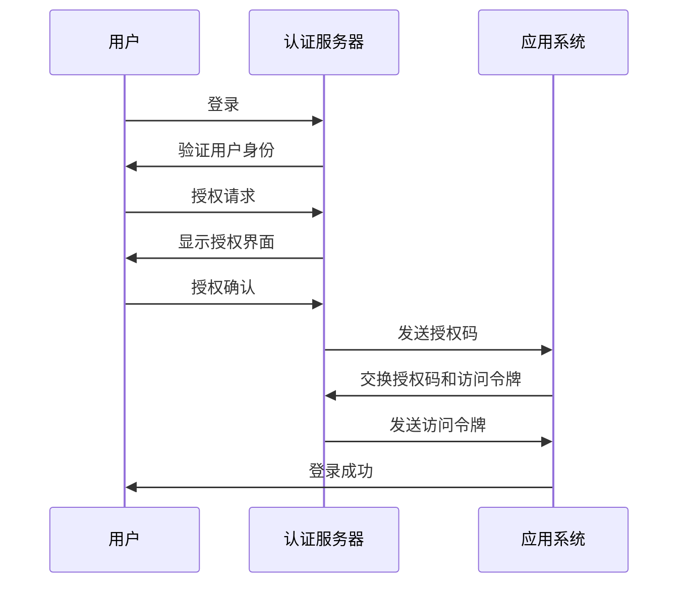

                 

# OAuth 2.0 的单点登录功能

> 关键词：OAuth 2.0、单点登录、身份认证、安全、用户授权、认证流程

> 摘要：本文将深入探讨 OAuth 2.0 的单点登录功能，包括其背景介绍、核心概念与联系、核心算法原理与具体操作步骤、数学模型和公式、项目实战、实际应用场景、工具和资源推荐、总结与未来发展趋势等内容，旨在帮助读者全面了解 OAuth 2.0 的单点登录机制及其在实际开发中的应用。

## 1. 背景介绍

单点登录（Single Sign-On，简称SSO）是一种身份认证技术，它允许用户在多个应用程序系统中使用一个统一的账户和密码进行登录。随着互联网应用的迅猛发展，用户需要在不同的平台和系统之间频繁切换，单点登录技术应运而生，旨在提高用户体验，降低用户管理成本。

OAuth 2.0 是一种开放授权协议，用于实现第三方应用与资源服务器之间的认证与授权。与传统的客户端-服务器认证方式不同，OAuth 2.0 不需要直接使用用户的密码进行认证，从而大大提高了系统的安全性和用户体验。

OAuth 2.0 的单点登录功能，通过将多个应用系统整合到一个统一的认证平台，使用户只需登录一次，即可访问多个应用系统，从而实现单点登录。本文将详细阐述 OAuth 2.0 单点登录的实现原理、操作步骤及实际应用。

## 2. 核心概念与联系

### 2.1 OAuth 2.0 基本概念

OAuth 2.0 是一种开放授权协议，主要解决的是第三方应用如何获取用户授权访问其资源的权限问题。OAuth 2.0 协议定义了四种授权类型：密码授权、客户端凭证、授权码和refresh_token。

### 2.2 单点登录（SSO）概念

单点登录（SSO）是一种身份认证技术，通过统一的认证平台，使用户在多个应用程序系统中使用一个统一的账户和密码进行登录。

### 2.3 OAuth 2.0 与单点登录的关系

OAuth 2.0 可以用于实现单点登录，其主要原理是通过第三方认证服务器为多个应用系统提供统一的认证服务。具体实现时，用户只需在认证服务器上登录一次，即可获得访问多个应用的权限。

### 2.4 Mermaid 流程图

下面是一个简化的 OAuth 2.0 单点登录的 Mermaid 流程图，展示了用户、认证服务器和应用系统之间的交互过程。



## 3. 核心算法原理 & 具体操作步骤

### 3.1 OAuth 2.0 授权码流程

OAuth 2.0 的授权码流程是一种常用的单点登录实现方式。下面是具体的操作步骤：

1. 用户访问应用系统，应用系统向认证服务器请求授权。
2. 认证服务器将用户重定向至授权页面，请求用户授权。
3. 用户在授权页面上确认授权后，认证服务器将用户重定向回应用系统，并传递一个授权码。
4. 应用系统使用授权码向认证服务器请求访问令牌。
5. 认证服务器验证授权码后，向应用系统颁发访问令牌。

### 3.2 访问令牌的获取

访问令牌（Access Token）是用于访问受保护资源的凭证。获取访问令牌的过程如下：

1. 应用系统向认证服务器发送请求，携带授权码、客户端ID和客户端密钥。
2. 认证服务器验证请求参数后，向应用系统颁发访问令牌。

### 3.3 访问受保护资源

获取访问令牌后，应用系统可以使用访问令牌访问受保护资源。访问过程如下：

1. 应用系统携带访问令牌向资源服务器发起请求。
2. 资源服务器验证访问令牌后，返回受保护资源给应用系统。

### 3.4 令牌刷新

访问令牌（Access Token）和刷新令牌（Refresh Token）是有有效期的。当访问令牌过期时，应用系统可以使用刷新令牌获取新的访问令牌。刷新令牌的获取过程如下：

1. 应用系统向认证服务器发送请求，携带刷新令牌、客户端ID和客户端密钥。
2. 认证服务器验证请求参数后，向应用系统颁发新的访问令牌。

## 4. 数学模型和公式 & 详细讲解 & 举例说明

### 4.1 密码学基础

OAuth 2.0 协议中使用了密码学技术来保证通信的安全性。以下是几个常用的密码学概念：

- **哈希函数**：将任意长度的输入数据映射为固定长度的输出值，具有不可逆性。常用的哈希函数有 SHA-256、SHA-3 等。
- **对称加密**：加密和解密使用相同的密钥。常用的对称加密算法有 AES、DES 等。
- **非对称加密**：加密和解密使用不同的密钥，其中一个密钥用于加密，另一个密钥用于解密。常用的非对称加密算法有 RSA、ECC 等。

### 4.2 OAuth 2.0 令牌验证

在 OAuth 2.0 协议中，认证服务器和应用系统之间的通信需要使用令牌进行验证。以下是令牌验证的数学模型：

- **令牌生成**：认证服务器使用客户端ID、客户端密钥和用户身份信息生成访问令牌和刷新令牌。
  $$ access_token = H_{256}(client\_id + client\_secret + user\_id) $$
  $$ refresh_token = H_{256}(client\_id + client\_secret + user\_id + access\_token) $$
  
- **令牌验证**：应用系统向认证服务器发送请求时，需要携带访问令牌和刷新令牌。认证服务器验证令牌的有效性，主要步骤如下：
  1. 验证访问令牌是否过期。
  2. 验证访问令牌和刷新令牌是否匹配。
  3. 验证客户端ID和客户端密钥是否匹配。

### 4.3 举例说明

假设用户A登录应用系统B，应用系统B使用 OAuth 2.0 授权码流程进行单点登录。以下是具体的步骤和数学模型：

1. **令牌生成**：
   - 用户A的ID：user\_id\_A
   - 应用系统B的客户端ID：client\_id\_B
   - 应用系统B的客户端密钥：client\_secret\_B
   
   访问令牌：
   $$ access_token = H_{256}(client\_id\_B + client\_secret\_B + user\_id\_A) $$
   
   刷新令牌：
   $$ refresh_token = H_{256}(client\_id\_B + client\_secret\_B + user\_id\_A + access\_token) $$

2. **令牌验证**：
   - 应用系统B向认证服务器发送请求，携带访问令牌和刷新令牌。
   - 认证服务器验证访问令牌是否过期，是否与刷新令牌匹配，以及客户端ID和客户端密钥是否匹配。

3. **访问受保护资源**：
   - 应用系统B使用访问令牌向资源服务器发起请求，获取受保护资源。

## 5. 项目实战：代码实际案例和详细解释说明

### 5.1 开发环境搭建

为了演示 OAuth 2.0 的单点登录功能，我们需要搭建一个简单的开发环境。以下是所需的技术栈和工具：

- **后端**：Spring Boot
- **前端**：HTML + JavaScript
- **认证服务器**：OAuth 2.0 授权码流程
- **应用系统**：使用认证服务器颁发的访问令牌访问受保护资源

### 5.2 源代码详细实现和代码解读

#### 5.2.1 认证服务器

认证服务器负责用户认证和授权码的颁发。以下是认证服务器的关键代码片段：

```java
@RestController
@RequestMapping("/auth")
public class AuthController {

    @Autowired
    private AuthenticationManager authenticationManager;

    @PostMapping("/login")
    public ResponseEntity<?> login(@RequestBody LoginRequest loginRequest) {
        Authentication authentication = authenticationManager.authenticate(
            new UsernamePasswordAuthenticationToken(
                loginRequest.getUsername(),
                loginRequest.getPassword()
            )
        );
        SecurityContextHolder.getContext().setAuthentication(authentication);
        String token = jwtTokenProvider.generateToken(authentication);
        return ResponseEntity.ok(new JwtResponse(token));
    }

    @GetMapping("/authorize")
    public ResponseEntity<?> authorize(@RequestParam String redirectUri, @RequestParam String clientId) {
        // 验证客户端ID和客户端密钥
        // 重定向至授权页面，传递授权码
    }
}
```

#### 5.2.2 应用系统

应用系统使用认证服务器颁发的访问令牌访问受保护资源。以下是应用系统的关键代码片段：

```java
@RestController
@RequestMapping("/api")
public class ApiController {

    @Autowired
    private RestTemplate restTemplate;

    @GetMapping("/resource")
    public ResponseEntity<?> getResource(@RequestHeader("Authorization") String authorization) {
        String accessToken = authorization.substring(7);
        // 使用访问令牌请求受保护资源
        ResponseEntity<ResourceResponse> response = restTemplate.exchange(
            "http://authserver.com/api/resource",
            HttpMethod.GET,
            new HttpEntity<>(accessToken),
            ResourceResponse.class
        );
        return ResponseEntity.ok(response.getBody());
    }
}
```

### 5.3 代码解读与分析

- **认证服务器**：认证服务器负责用户认证和授权码的颁发。用户登录时，认证服务器验证用户身份，并生成 JWT 令牌。用户授权时，认证服务器验证客户端ID和客户端密钥，并生成授权码。
- **应用系统**：应用系统使用认证服务器颁发的访问令牌访问受保护资源。在请求受保护资源时，应用系统需要将访问令牌添加到请求头中。

通过上述代码示例，我们可以看到 OAuth 2.0 单点登录的实现原理和具体步骤。

## 6. 实际应用场景

OAuth 2.0 的单点登录功能在多个实际应用场景中都有广泛的应用，以下是一些典型的应用场景：

- **企业内部系统**：企业内部系统可以使用 OAuth 2.0 实现单点登录，提高员工的工作效率，降低用户管理成本。
- **第三方登录**：网站和应用系统可以通过 OAuth 2.0 接入第三方登录服务，如微信、微博、QQ 等，为用户提供便捷的登录体验。
- **跨域认证**：在 Web 应用中，OAuth 2.0 可以实现跨域认证，解决跨域请求的身份验证问题。
- **API 接口认证**：OAuth 2.0 可以用于保护 API 接口的访问权限，确保只有授权的应用系统可以访问 API。

## 7. 工具和资源推荐

### 7.1 学习资源推荐

- **书籍**：
  - 《OAuth 2.0 简介》
  - 《OAuth 2.0 实战》
- **论文**：
  - “OAuth 2.0 Authorization Framework”
  - “The OAuth 2.0 Authorization Code with PKCE Workflow”
- **博客**：
  - “深入理解 OAuth 2.0”
  - “OAuth 2.0 单点登录实践”
- **网站**：
  - [OAuth 2.0 官方文档](https://www.oauth.com/)
  - [Spring Security OAuth 2.0](https://spring.io/guides/gs/authenticating-external-provider/)

### 7.2 开发工具框架推荐

- **后端框架**：
  - Spring Security OAuth 2.0
  - OAuth 2.0 for Java
- **前端框架**：
  - Angular
  - React
- **认证服务器**：
  - Keycloak
  - Apache Oltu

### 7.3 相关论文著作推荐

- “OAuth 2.0：协议、应用与实现”
- “基于 OAuth 2.0 的单点登录技术研究与应用”

## 8. 总结：未来发展趋势与挑战

OAuth 2.0 的单点登录功能在 IT 领域具有广泛的应用前景。随着互联网应用的不断发展和用户隐私保护意识的增强，OAuth 2.0 的单点登录功能将继续得到重视。未来，OAuth 2.0 可能会面临以下挑战：

- **安全性**：随着攻击手段的不断升级，OAuth 2.0 需要不断改进和完善，提高系统的安全性。
- **兼容性**：随着新技术的不断涌现，OAuth 2.0 需要保持良好的兼容性，适应不同的应用场景。
- **标准化**：尽管 OAuth 2.0 已经成为事实标准，但仍需进一步规范和完善，以提高其应用广度和深度。

总之，OAuth 2.0 的单点登录功能在 IT 领域具有重要地位，未来将继续发挥重要作用。

## 9. 附录：常见问题与解答

### 9.1 OAuth 2.0 和 OAuth 1.0 有什么区别？

OAuth 2.0 和 OAuth 1.0 都是开放授权协议，但 OAuth 2.0 在安全性、易用性和灵活性方面进行了较大改进。主要区别如下：

- **安全性**：OAuth 2.0 使用 JWT 令牌进行身份认证，安全性更高；OAuth 1.0 使用签名进行认证，安全性相对较低。
- **易用性**：OAuth 2.0 简化了认证流程，用户只需登录一次即可访问多个应用系统；OAuth 1.0 的认证流程较为复杂，用户需要手动输入验证码。
- **灵活性**：OAuth 2.0 支持多种授权类型，适用于不同场景；OAuth 1.0 主要用于保护 API 接口。

### 9.2 OAuth 2.0 的单点登录是如何保证安全的？

OAuth 2.0 的单点登录通过以下措施保证安全：

- **加密传输**：使用 HTTPS 等加密协议保护通信过程中的数据传输。
- **令牌验证**：认证服务器对访问令牌和刷新令牌进行验证，确保其有效性和合法性。
- **用户身份验证**：用户在认证服务器上登录，确保只有授权用户可以访问受保护资源。
- **密码保护**：使用强密码和多因素认证等手段提高用户账户的安全性。

## 10. 扩展阅读 & 参考资料

- [OAuth 2.0 官方文档](https://www.oauth.com/)
- [Spring Security OAuth 2.0](https://spring.io/guides/gs/authenticating-external-provider/)
- 《OAuth 2.0 简介》
- 《OAuth 2.0 实战》
- “OAuth 2.0 Authorization Framework”
- “The OAuth 2.0 Authorization Code with PKCE Workflow”
- “深入理解 OAuth 2.0”
- “OAuth 2.0 单点登录实践” 
- “OAuth 2.0：协议、应用与实现”
- “基于 OAuth 2.0 的单点登录技术研究与应用”

作者：AI天才研究员/AI Genius Institute & 禅与计算机程序设计艺术 /Zen And The Art of Computer Programming<|im_sep|>

