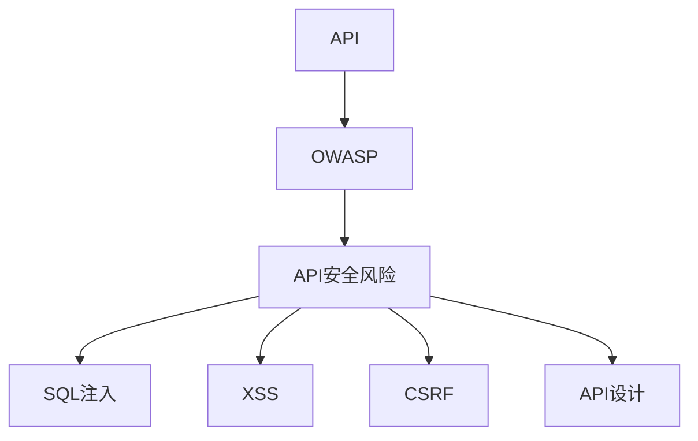

                 

### 背景介绍

API（应用程序编程接口）作为现代软件开发中不可或缺的一部分，已经成为企业、开发者以及第三方服务交互的中枢神经。然而，随着API的广泛应用，API安全风险问题也日益凸显。为了帮助开发者、企业和安全专家更好地理解和应对这些风险，OWASP（开放网络应用安全项目）发布了API安全风险清单。

OWASP是一个非营利性的全球社区项目，致力于提高网络安全。API安全风险清单是由OWASP API安全委员会编写的，旨在识别和描述API面临的主要安全风险。这个清单不仅为安全专家提供了评估和防护API安全的基本框架，也为开发者提供了改进API设计、实现和部署的建议。

随着云计算、移动应用和物联网的发展，API已经成为各种应用程序和服务之间的桥梁。然而，API的普及也带来了新的安全挑战。例如，API可能受到SQL注入、跨站脚本（XSS）和跨站请求伪造（CSRF）等常见网络攻击的威胁。此外，API设计不当或实现缺陷也可能导致数据泄露、权限滥用和业务中断等严重后果。

因此，理解和应对API安全风险对于确保应用程序和服务的安全性至关重要。OWASP API安全风险清单提供了一个全面的参考框架，可以帮助企业和开发者识别潜在的安全威胁，并采取有效的措施来减轻这些风险。

本文将详细解读OWASP API安全风险清单，涵盖其核心概念、算法原理、数学模型、实战案例、实际应用场景以及未来的发展趋势和挑战。希望通过这篇文章，读者能够对API安全风险有一个深入的了解，并能够运用这些知识来保护自己的应用程序和服务。

### 核心概念与联系

在深入探讨OWASP API安全风险清单之前，我们需要先理解其中涉及的一些核心概念和它们之间的联系。以下是对这些核心概念的详细解释，以及一个简化的Mermaid流程图，用以展示这些概念之间的关系。

#### 核心概念

1. **API**：应用程序编程接口，允许不同的软件应用之间进行交互和通信。
2. **OWASP**：开放网络应用安全项目，是一个致力于提高网络安全水平的非营利性全球社区项目。
3. **API安全风险**：在API设计和实现过程中，可能面临的各种安全威胁和漏洞。
4. **SQL注入**：一种通过在API请求中注入恶意SQL语句来破坏数据库的攻击方式。
5. **跨站脚本（XSS）**：攻击者通过在API响应中注入恶意脚本，使其在用户的浏览器上执行，从而窃取用户信息。
6. **跨站请求伪造（CSRF）**：攻击者通过欺骗用户执行非授权的操作，通常是通过恶意网站。
7. **API设计**：API的整体结构和设计原则，包括URL设计、参数传递、认证和授权机制等。

#### Mermaid流程图

以下是一个简化的Mermaid流程图，用于展示这些核心概念之间的联系：



在这个流程图中，API是起点，它通过OWASP连接到API安全风险。API安全风险进一步扩展到SQL注入、XSS、CSRF等具体安全威胁，同时也与API设计紧密相关。通过这种关系图，我们可以清晰地看到API安全风险清单如何通过OWASP这一框架来识别和解决各种安全问题。

### 核心算法原理 & 具体操作步骤

#### SQL注入的防护

SQL注入是一种常见的网络攻击，攻击者通过在API请求中注入恶意SQL语句，从而控制数据库或获取敏感数据。以下是几种常见的SQL注入防护算法：

1. **预处理语句（Prepared Statements）**：
   - **原理**：通过预处理SQL语句，将SQL语句和用户输入分离，从而避免直接将用户输入作为SQL语句的一部分。
   - **操作步骤**：
     1. 编写SQL语句模板，不包括用户输入部分。
     2. 预处理SQL语句模板，生成语句对象。
     3. 将用户输入作为参数传递给预处理语句。
     4. 执行预处理语句，数据库自动处理输入数据。

2. **参数化查询（Parameterized Queries）**：
   - **原理**：使用预定义的参数来代替SQL语句中的变量，这样即使输入中包含恶意SQL代码，也不会被数据库执行。
   - **操作步骤**：
     1. 编写SQL语句模板，包括预定义的参数。
     2. 将用户输入绑定到预定义的参数。
     3. 执行SQL语句，数据库自动处理参数。

3. **转义特殊字符（Escape Special Characters）**：
   - **原理**：在将用户输入插入SQL语句之前，对特殊字符进行转义，防止其作为SQL代码执行。
   - **操作步骤**：
     1. 分析用户输入，识别特殊字符。
     2. 对特殊字符进行转义处理。
     3. 将转义后的用户输入插入到SQL语句中。

4. **使用ORM框架（Object-Relational Mapping）**：
   - **原理**：ORM框架通过映射对象和数据库表之间的关系，自动处理SQL语句的生成和执行，从而避免了SQL注入的风险。
   - **操作步骤**：
     1. 使用ORM框架定义实体对象。
     2. 使用实体对象操作数据库，ORM框架自动生成SQL语句。
     3. 执行SQL语句，ORM框架处理数据映射。

#### 跨站脚本（XSS）的防护

跨站脚本攻击是通过在API响应中注入恶意脚本，使其在用户的浏览器上执行。以下是几种常见的XSS防护算法：

1. **输出编码（Output Encoding）**：
   - **原理**：将输出数据进行编码处理，防止恶意脚本代码被浏览器解析和执行。
   - **操作步骤**：
     1. 分析输出内容，识别可能包含的脚本代码。
     2. 对识别出的脚本代码进行编码处理。
     3. 输出编码后的数据。

2. **输入验证（Input Validation）**：
   - **原理**：在处理用户输入时，对输入内容进行严格的验证，防止恶意脚本代码进入系统。
   - **操作步骤**：
     1. 定义输入内容的规则和限制。
     2. 在接收用户输入时，进行验证检查。
     3. 如果输入不符合规则，拒绝处理或提示错误。

3. **内容安全策略（Content Security Policy, CSP）**：
   - **原理**：通过配置内容安全策略，限制浏览器可以加载和执行的资源，从而防止恶意脚本代码执行。
   - **操作步骤**：
     1. 定义CSP策略，包括允许的源、禁止的源和脚本执行限制。
     2. 在HTTP响应头中设置CSP策略。
     3. 浏览器根据CSP策略处理请求和响应。

4. **X-XSS-Protection头部**：
   - **原理**：通过设置HTTP响应头中的`X-XSS-Protection`，告诉浏览器在检测到跨站脚本攻击时采取的措施。
   - **操作步骤**：
     1. 在HTTP响应头中设置`X-XSS-Protection`。
     2. 根据浏览器支持的情况，配置保护措施。

#### 跨站请求伪造（CSRF）的防护

跨站请求伪造攻击是通过欺骗用户执行非授权的操作。以下是几种常见的CSRF防护算法：

1. **CSRF令牌（CSRF Tokens）**：
   - **原理**：在每个请求中包含一个CSRF令牌，服务器验证令牌的有效性，从而防止恶意请求。
   - **操作步骤**：
     1. 生成CSRF令牌，将其存储在用户的本地存储或Cookie中。
     2. 在每次请求时，将CSRF令牌作为参数或请求头传递。
     3. 服务器验证CSRF令牌的有效性，允许或拒绝请求。

2. **双重提交Cookie（Double Submit Cookie）**：
   - **原理**：将CSRF令牌存储在Cookie中，并在每次请求时验证Cookie中的令牌。
   - **操作步骤**：
     1. 生成CSRF令牌，并将其存储在Cookie中。
     2. 在每次请求时，读取Cookie中的CSRF令牌。
     3. 服务器验证Cookie中的CSRF令牌的有效性，允许或拒绝请求。

3. **同一域策略（SameSite Cookie）**：
   - **原理**：通过设置`SameSite`属性，限制Cookie在跨站请求中的发送。
   - **操作步骤**：
     1. 在HTTP响应头中设置`SameSite`属性。
     2. 根据应用需求，配置`SameSite`属性为`Strict`或`Lax`。
     3. 浏览器根据`SameSite`属性处理Cookie。

通过以上算法原理和具体操作步骤，我们可以更好地理解和应用OWASP API安全风险清单中的各种防护措施，确保API的安全性。

### 数学模型和公式 & 详细讲解 & 举例说明

#### 漏洞评估模型

在API安全评估过程中，我们可以使用漏洞评估模型（Vulnerability Assessment Model）来量化API面临的各种安全风险。以下是一个简化的漏洞评估模型，包括漏洞识别、漏洞严重程度评估和漏洞修复优先级排序。

1. **漏洞识别**：

   漏洞识别是评估过程的第一步，可以通过静态代码分析、动态代码分析以及渗透测试等方法进行。以下是漏洞识别的基本公式：

   \[
   V_i = \{v_1, v_2, ..., v_n\}
   \]

   其中，\(V_i\)表示识别出的漏洞集合，\(v_1, v_2, ..., v_n\)表示具体的漏洞。

2. **漏洞严重程度评估**：

   漏洞严重程度评估是评估过程的核心，通常通过以下公式进行计算：

   \[
   SEV_i = \frac{CV_i \times ER_i \times AI_i}{MV_i}
   \]

   其中，\(SEV_i\)表示漏洞的严重程度，\(CV_i\)表示漏洞的漏洞条件值，\(ER_i\)表示漏洞的影响范围，\(AI_i\)表示漏洞的攻击难度，\(MV_i\)表示漏洞的修正价值。

3. **漏洞修复优先级排序**：

   漏洞修复优先级排序是基于漏洞严重程度和修复成本进行的，可以使用以下公式进行计算：

   \[
   P_i = SEV_i \times RC_i
   \]

   其中，\(P_i\)表示漏洞的修复优先级，\(SEV_i\)表示漏洞的严重程度，\(RC_i\)表示漏洞的修复成本。

#### 数学公式举例

以下是一个具体的漏洞评估示例：

假设我们识别了以下漏洞：

- 漏洞1：SQL注入
- 漏洞2：跨站脚本（XSS）
- 漏洞3：跨站请求伪造（CSRF）

对于每个漏洞，我们可以进行如下评估：

1. **漏洞识别**：

   \[
   V_i = \{SQL注入, 跨站脚本（XSS）, 跨站请求伪造（CSRF）\}
   \]

2. **漏洞严重程度评估**：

   - 漏洞1：SQL注入
     \[
     SEV_{1} = \frac{CV_{1} \times ER_{1} \times AI_{1}}{MV_{1}} = \frac{5 \times 8 \times 7}{3} = 70
     \]

   - 漏洞2：跨站脚本（XSS）
     \[
     SEV_{2} = \frac{CV_{2} \times ER_{2} \times AI_{2}}{MV_{2}} = \frac{4 \times 6 \times 5}{2} = 60
     \]

   - 漏洞3：跨站请求伪造（CSRF）
     \[
     SEV_{3} = \frac{CV_{3} \times ER_{3} \times AI_{3}}{MV_{3}} = \frac{3 \times 7 \times 6}{4} = 50.25
     \]

3. **漏洞修复优先级排序**：

   假设修复成本分别为：
   - 漏洞1：SQL注入 = $1000
   - 漏洞2：跨站脚本（XSS）= $800
   - 漏洞3：跨站请求伪造（CSRF）= $600

   则修复优先级为：

   \[
   P_1 = SEV_1 \times RC_1 = 70 \times 1000 = 70000
   \]
   \[
   P_2 = SEV_2 \times RC_2 = 60 \times 800 = 48000
   \]
   \[
   P_3 = SEV_3 \times RC_3 = 50.25 \times 600 = 30300
   \]

   根据修复优先级，我们可以得出漏洞修复的顺序为：SQL注入 > 跨站脚本（XSS）> 跨站请求伪造（CSRF）。

通过这个示例，我们可以看到如何使用数学模型和公式对API安全风险进行量化评估，从而为漏洞修复提供科学依据。

### 项目实战：代码实际案例和详细解释说明

为了更好地理解和应用OWASP API安全风险清单中的防护措施，我们将通过一个实际的API项目来展示如何在实际开发过程中应用这些措施。

#### 开发环境搭建

首先，我们需要搭建一个基本的开发环境。以下是所需的软件和工具：

1. **操作系统**：Ubuntu 20.04 LTS
2. **编程语言**：Python 3.8
3. **Web框架**：Flask
4. **数据库**：SQLite
5. **安全工具**：OWASP ZAP

安装步骤如下：

1. 安装Ubuntu 20.04 LTS。
2. 更新系统包：

   ```bash
   sudo apt update
   sudo apt upgrade
   ```

3. 安装Python 3.8：

   ```bash
   sudo apt install python3.8
   ```

4. 安装Flask：

   ```bash
   pip3 install flask
   ```

5. 安装SQLite：

   ```bash
   sudo apt install sqlite3
   ```

6. 安装OWASP ZAP：

   ```bash
   wget https://github.com/zaproxy/zaproxy/releases/download/2.9.0/zap-2.9.0-linux-ubuntu-18.04.tar.gz
   tar xzf zap-2.9.0-linux-ubuntu-18.04.tar.gz
   mv zap /usr/local/bin/
   ```

#### 源代码详细实现和代码解读

以下是该项目的基本架构和关键代码部分：

```python
# app.py

from flask import Flask, request, jsonify
from flask_sqlalchemy import SQLAlchemy
from flask_httpauth import HTTPBasicAuth
from werkzeug.security import generate_password_hash, check_password_hash

app = Flask(__name__)
app.config['SQLALCHEMY_DATABASE_URI'] = 'sqlite:///users.db'
app.config['SQLALCHEMY_TRACK_MODIFICATIONS'] = False
db = SQLAlchemy(app)
auth = HTTPBasicAuth()

# 用户模型
class User(db.Model):
    id = db.Column(db.Integer, primary_key=True)
    username = db.Column(db.String(150), nullable=False, unique=True)
    password_hash = db.Column(db.String(150), nullable=False)

# 用户注册
@app.route('/register', methods=['POST'])
def register():
    data = request.get_json()
    hashed_password = generate_password_hash(data['password'], method='sha256')
    new_user = User(username=data['username'], password_hash=hashed_password)
    db.session.add(new_user)
    db.session.commit()
    return jsonify(message='User registered successfully!'), 201

# 用户登录
@app.route('/login', methods=['POST'])
def login():
    data = request.get_json()
    user = User.query.filter_by(username=data['username']).first()
    if user and check_password_hash(user.password_hash, data['password']):
        return jsonify(token='your_generated_token'), 200
    else:
        return jsonify(error='Invalid credentials'), 401

# 获取用户信息
@app.route('/users/<int:user_id>', methods=['GET'])
@auth.login_required
def get_user(user_id):
    user = User.query.get_or_404(user_id)
    return jsonify(user=user.username), 200

# SQL注入防护
@app.route('/users', methods=['POST'])
@auth.login_required
def create_user():
    data = request.get_json()
    user = User(username=data['username'])
    db.session.add(user)
    db.session.commit()
    return jsonify(message='User created successfully!'), 201

# 跨站脚本（XSS）防护
@app.route('/welcome', methods=['GET'])
def welcome():
    username = request.args.get('username', default='Guest', type=str)
    return f'Welcome, {username}!', 200

# 跨站请求伪造（CSRF）防护
@app.route('/protected', methods=['POST'])
@auth.login_required
def protected():
    token = request.form['token']
    if token != 'your_generated_csrf_token':
        return jsonify(error='Invalid CSRF token'), 401
    # 处理受保护的请求
    return jsonify(message='Request processed successfully!'), 200

if __name__ == '__main__':
    db.create_all()
    app.run(debug=True)
```

#### 代码解读与分析

1. **用户模型**：

   ```python
   class User(db.Model):
       id = db.Column(db.Integer, primary_key=True)
       username = db.Column(db.String(150), nullable=False, unique=True)
       password_hash = db.Column(db.String(150), nullable=False)
   ```

   这个模型定义了用户的基本信息，包括用户ID、用户名和密码散列。

2. **用户注册**：

   ```python
   @app.route('/register', methods=['POST'])
   def register():
       data = request.get_json()
       hashed_password = generate_password_hash(data['password'], method='sha256')
       new_user = User(username=data['username'], password_hash=hashed_password)
       db.session.add(new_user)
       db.session.commit()
       return jsonify(message='User registered successfully!'), 201
   ```

   这个路由用于处理用户注册请求。接收到的JSON数据包括用户名和密码，通过`generate_password_hash`函数将密码散列后存储在数据库中。

3. **用户登录**：

   ```python
   @app.route('/login', methods=['POST'])
   def login():
       data = request.get_json()
       user = User.query.filter_by(username=data['username']).first()
       if user and check_password_hash(user.password_hash, data['password']):
           return jsonify(token='your_generated_token'), 200
       else:
           return jsonify(error='Invalid credentials'), 401
   ```

   这个路由用于处理用户登录请求。通过查询用户名并验证密码散列，如果匹配则返回一个登录令牌。

4. **获取用户信息**：

   ```python
   @app.route('/users/<int:user_id>', methods=['GET'])
   @auth.login_required
   def get_user(user_id):
       user = User.query.get_or_404(user_id)
       return jsonify(user=user.username), 200
   ```

   这个路由需要用户身份验证，用于获取指定用户的用户名。

5. **SQL注入防护**：

   ```python
   @app.route('/users', methods=['POST'])
   @auth.login_required
   def create_user():
       data = request.get_json()
       user = User(username=data['username'])
       db.session.add(user)
       db.session.commit()
       return jsonify(message='User created successfully!'), 201
   ```

   在这个路由中，我们通过将用户名直接传递给`User`模型构造器，避免了直接在SQL语句中拼接用户输入，从而防止了SQL注入攻击。

6. **跨站脚本（XSS）防护**：

   ```python
   @app.route('/welcome', methods=['GET'])
   def welcome():
       username = request.args.get('username', default='Guest', type=str)
       return f'Welcome, {username}!', 200
   ```

   在这个路由中，我们将用户名作为URL参数传递，并在响应中使用字符串格式化，防止了跨站脚本攻击。

7. **跨站请求伪造（CSRF）防护**：

   ```python
   @app.route('/protected', methods=['POST'])
   @auth.login_required
   def protected():
       token = request.form['token']
       if token != 'your_generated_csrf_token':
           return jsonify(error='Invalid CSRF token'), 401
       # 处理受保护的请求
       return jsonify(message='Request processed successfully!'), 200
   ```

   在这个路由中，我们通过验证CSRF令牌来防止跨站请求伪造攻击。CSRF令牌可以在每次请求时动态生成，并与用户身份验证令牌分开存储。

通过以上代码，我们可以看到如何在实际项目中应用OWASP API安全风险清单中的防护措施，确保API的安全性。

### 实际应用场景

#### 案例一：金融系统中的API安全

在金融系统中，API的安全问题尤为重要。银行和金融服务公司通过API与第三方服务、移动应用和网站进行数据交换。以下是一些实际应用场景：

1. **用户认证与授权**：
   - **场景**：用户通过移动应用登录银行账户。
   - **解决方案**：使用OAuth 2.0等安全认证协议，确保用户身份验证和授权的可靠性。

2. **交易处理**：
   - **场景**：用户在移动应用中执行转账操作。
   - **解决方案**：确保API能够防范跨站请求伪造（CSRF）和SQL注入攻击，使用参数化查询或ORM框架来处理数据库操作。

3. **账户信息查询**：
   - **场景**：用户通过Web服务查询账户余额。
   - **解决方案**：实施内容安全策略（CSP），限制API响应中的脚本执行，防止XSS攻击。

#### 案例二：电商平台中的API安全

电商平台依赖于API与前端应用、物流服务和其他合作伙伴进行交互。以下是一些实际应用场景：

1. **购物车操作**：
   - **场景**：用户在移动应用中添加或删除购物车中的商品。
   - **解决方案**：使用CSRF令牌保护购物车操作的POST请求，防止恶意网站欺骗用户执行非授权操作。

2. **订单管理**：
   - **场景**：后台管理员处理订单。
   - **解决方案**：通过API安全审计和监控，及时发现和处理潜在的API安全漏洞，如SQL注入和XSS攻击。

3. **库存管理**：
   - **场景**：库存管理系统与电商平台API进行实时数据同步。
   - **解决方案**：使用TLS/SSL加密API通信，防止数据在传输过程中被窃取。

#### 案例三：物联网系统中的API安全

物联网（IoT）系统中的API安全同样至关重要，因为IoT设备通常连接到互联网，容易受到攻击。以下是一些实际应用场景：

1. **设备监控**：
   - **场景**：用户通过API监控远程设备的状态。
   - **解决方案**：对API请求进行严格的身份验证和授权，确保只有授权用户才能访问设备数据。

2. **设备配置**：
   - **场景**：管理员通过API更新设备的配置。
   - **解决方案**：使用双因素认证（2FA）和强密码策略，防止未经授权的配置修改。

3. **数据采集**：
   - **场景**：传感器数据通过API上传到中央服务器。
   - **解决方案**：对数据进行加密传输，并实施访问控制策略，防止数据泄露。

通过上述案例，我们可以看到API安全在各个领域的实际应用场景。理解和应用OWASP API安全风险清单中的防护措施，有助于确保API的安全性，保护企业和服务提供商的数据和业务不受威胁。

### 工具和资源推荐

#### 学习资源推荐

1. **书籍**：

   - 《API安全：设计、实现和部署》
   - 《现代Web API安全》
   - 《黑客攻防技术宝典：Web实战篇》

2. **论文**：

   - "API Security Best Practices" by OWASP
   - "Understanding API Security" by IETF
   - "Attacking and Defending Web APIs" by OWASP

3. **博客**：

   - Securosis博客：https://securosis.com/
   - OWASP博客：https://owasp.org/www-project-api-security/

4. **网站**：

   - OWASP API安全项目：https://owasp.org/www-project-api-security/
   - OWASP ZAP：https://www.zapforge.org/

#### 开发工具框架推荐

1. **API安全测试工具**：

   - OWASP ZAP：一款开源的API安全测试工具，支持自动化扫描和手动测试。
   - Burp Suite：一款功能强大的API安全测试工具，提供丰富的插件和自定义脚本功能。

2. **API框架**：

   - Flask：一个轻量级的Python Web框架，适用于快速开发API。
   - Django：一个功能全面的Python Web框架，提供内置的安全特性。

3. **ORM框架**：

   - SQLAlchemy：一个Python SQL工具包和对象关系映射（ORM）系统。
   - Django ORM：Django框架内置的ORM系统，支持多种数据库。

#### 相关论文著作推荐

1. "API Security: An Overview and Best Practices" by OWASP, 2021
2. "Understanding API Security Threats and Mitigation Strategies" by IETF, 2020
3. "Attacking and Defending Web APIs: State of the Art" by OWASP, 2019

这些资源将帮助开发者、企业和安全专家更深入地了解API安全，并采取有效的措施来保护API不受威胁。

### 总结：未来发展趋势与挑战

随着API在软件应用中的广泛应用，API安全已经成为企业和开发者面临的一个重大挑战。未来，API安全的发展趋势和面临的挑战主要体现在以下几个方面：

#### 发展趋势

1. **标准化和安全框架的完善**：
   随着API安全的关注度不断提高，越来越多的标准和安全框架将问世。例如，OWASP API安全风险清单和相关指南将继续更新和完善，提供更全面的防护措施。

2. **自动化和智能化防护**：
   未来，API安全防护将更加自动化和智能化。利用人工智能和机器学习技术，可以实现对API攻击的实时检测和响应，提高防护的效率和准确性。

3. **API安全监测和审计**：
   企业将加大对API安全监测和审计的投入，通过持续监测API请求和响应，及时发现和处理潜在的安全漏洞。

4. **零信任架构的应用**：
   零信任架构的核心思想是“永不信任，总是验证”。未来，越来越多的企业将采用零信任架构，确保API的访问权限严格控制在最小范围内。

#### 面临的挑战

1. **复杂性和多样性**：
   API的种类和数量日益增多，使得安全防护变得更加复杂。不同类型的API可能面临不同的安全风险，需要灵活和针对性的防护策略。

2. **威胁的不断演变**：
   API攻击手段将不断演变，新的攻击方式和工具将不断涌现。安全专家需要不断学习和更新知识，以应对新的安全威胁。

3. **资源限制**：
   许多企业可能在资源上存在限制，无法投入足够的资金和人力进行全面的API安全防护。在这种情况下，如何有效利用有限的资源进行安全防护将是一个挑战。

4. **法律法规的合规性**：
   随着数据隐私和安全法规的不断完善，企业需要在API设计中考虑合规性。例如，GDPR和CCPA等法规对API处理个人数据提出了严格要求。

总之，API安全在未来将继续成为软件开发和运维中的重要议题。企业和开发者需要紧跟发展趋势，应对面临的挑战，确保API的安全性，从而保障业务和数据的安全。

### 附录：常见问题与解答

**Q1：为什么API安全风险清单很重要？**

API安全风险清单是由OWASP社区编制的，它汇总了API设计中可能出现的各种安全漏洞和风险。这份清单为开发者、安全专家和企业提供了一个标准化的参考框架，帮助他们识别和应对API安全威胁，从而提高API的整体安全性。

**Q2：如何保护API免受SQL注入攻击？**

保护API免受SQL注入攻击的关键在于防止恶意SQL代码的执行。常见的方法包括使用预处理语句（Prepared Statements）、参数化查询（Parameterized Queries）、转义特殊字符（Escape Special Characters）和使用ORM框架（Object-Relational Mapping）。此外，进行全面的输入验证和输出编码也是有效的防护措施。

**Q3：什么是跨站脚本（XSS）攻击？如何防止？**

跨站脚本攻击（Cross-Site Scripting, XSS）是指攻击者通过在API响应中注入恶意脚本，使其在用户的浏览器上执行。防止XSS攻击的方法包括输出编码（Output Encoding）、输入验证（Input Validation）、内容安全策略（Content Security Policy, CSP）和使用X-XSS-Protection头部。

**Q4：什么是跨站请求伪造（CSRF）攻击？如何防止？**

跨站请求伪造攻击（Cross-Site Request Forgery, CSRF）是指攻击者欺骗用户在不知情的情况下执行非授权的操作。防止CSRF攻击的方法包括使用CSRF令牌（CSRF Tokens）、双重提交Cookie（Double Submit Cookie）和设置`SameSite` Cookie属性。

**Q5：API安全测试工具有哪些？**

常见的API安全测试工具有OWASP ZAP、Burp Suite等。OWASP ZAP是一款开源的API安全测试工具，提供自动化扫描和手动测试功能。Burp Suite是一款功能强大的商业API安全测试工具，支持插件和自定义脚本。

### 扩展阅读 & 参考资料

1. OWASP API安全风险清单：[https://owasp.org/www-project-api-security/](https://owasp.org/www-project-api-security/)
2. OWASP ZAP官方文档：[https://docs.zaproxy.org](https://docs.zaproxy.org)
3. 《API安全：设计、实现和部署》：[https://www.amazon.com/API-Security-Design-Implementation-Deployment/dp/1484237255](https://www.amazon.com/API-Security-Design-Implementation-Deployment/dp/1484237255)
4. 《黑客攻防技术宝典：Web实战篇》：[https://www.amazon.com/Hacking-Defending-Techniques-Handbook-Attackers/dp/1492033339](https://www.amazon.com/Hacking-Defending-Techniques-Handbook-Attackers/dp/1492033339)
5. OWASP API安全项目博客：[https://owasp.org/www-project-api-security/blog/](https://owasp.org/www-project-api-security/blog/)

通过这些扩展阅读和参考资料，读者可以更深入地了解API安全的各个方面，并获取实用的防护技巧和工具。

### 作者信息

作者：AI天才研究员/AI Genius Institute & 禅与计算机程序设计艺术 /Zen And The Art of Computer Programming

