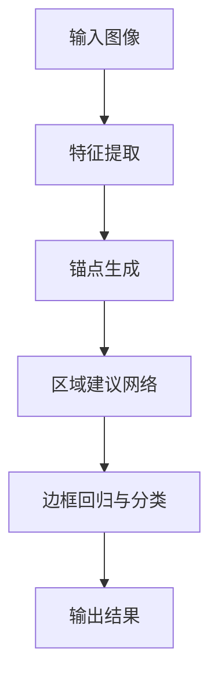

                 

### 背景介绍

Object Detection（目标检测）是计算机视觉领域中的一个核心任务，旨在从图像或视频中检测并定位出特定类别的目标。随着深度学习的迅猛发展，目标检测技术取得了显著的突破，成为了智能安防、自动驾驶、医疗诊断等多个领域的重要应用基础。本文将深入探讨Object Detection的原理及其代码实战案例，旨在为读者提供一个清晰、易懂的技术指南。

首先，我们需要了解目标检测的实际应用场景。在日常生活中，目标检测技术已经被广泛应用于人脸识别、车辆检测、行人识别等领域。例如，在自动驾驶汽车中，目标检测可以帮助车辆识别道路上的行人、车辆、交通标志等，从而做出相应的驾驶决策。此外，在安防监控系统中，目标检测技术可以实时监测可疑行为，提供报警信息，提高安全监控的效率。

目标检测技术的发展历程可以追溯到20世纪80年代，当时主要是基于传统图像处理和机器学习的方法。随着深度学习的兴起，尤其是卷积神经网络（CNN）的发展，目标检测技术取得了质的飞跃。现代目标检测算法如Faster R-CNN、YOLO、SSD等，利用深度学习模型在大量标注数据上进行训练，能够达到非常高的检测准确率。

本文的结构如下：

1. **核心概念与联系**：我们将介绍目标检测中的核心概念，包括锚点（anchor）、区域建议网络（region proposal network）、边界框（bounding box）等，并通过Mermaid流程图展示目标检测的整体架构。
2. **核心算法原理 & 具体操作步骤**：我们将详细讲解Faster R-CNN算法的基本原理和操作步骤，以及如何利用深度学习模型实现目标检测。
3. **数学模型和公式 & 详细讲解 & 举例说明**：我们将介绍目标检测中常用的数学模型，包括卷积神经网络、损失函数等，并使用具体例子进行详细说明。
4. **项目实战：代码实际案例和详细解释说明**：我们将通过一个实际项目案例，展示如何搭建目标检测的开发环境，实现代码编写和调试，并进行代码解读和分析。
5. **实际应用场景**：我们将讨论目标检测技术在各个领域的应用，以及面临的挑战和解决方案。
6. **工具和资源推荐**：我们将推荐一些有用的学习资源、开发工具和相关的论文著作，以帮助读者进一步学习和实践目标检测技术。
7. **总结：未来发展趋势与挑战**：我们将总结目标检测技术的发展现状，展望其未来发展趋势，并探讨面临的挑战。

通过本文的阅读，读者将能够深入了解目标检测技术的基本原理、实战应用，并掌握如何实现和优化目标检测算法。接下来，让我们一步一步地深入探讨目标检测的奥秘。

### 核心概念与联系

目标检测是一个复杂的任务，涉及到多个核心概念和模块。在这一部分，我们将详细介绍这些核心概念，并通过Mermaid流程图展示目标检测的整体架构。

#### 锚点（Anchor）

锚点（Anchor）是目标检测中的基础概念。它是一个预先定义的边界框（bounding box），用于在特征图中预测目标位置。锚点的设置对于目标检测的性能至关重要。常见的锚点类型包括基于尺寸的锚点（例如，不同尺寸的边界框）和基于比例的锚点（例如，以特定比例分布的边界框）。

**锚点生成过程**：

1. **设定锚点数量**：通常，我们会在特征图上均匀地分布多个锚点。
2. **设置锚点尺寸**：锚点尺寸可以基于预设的尺寸列表（例如， `[16, 32, 64, 128, 256]`）或根据特征图的分辨率进行自适应调整。
3. **计算锚点坐标**：锚点的坐标可以通过特征图的网格点或预先设定的规则计算得到。

#### 区域建议网络（Region Proposal Network，RPN）

区域建议网络（RPN）是Faster R-CNN算法中的一个重要模块，负责生成高质量的边界框（Bounding Boxes）。RPN通过在特征图上进行滑动窗口（Sliding Window）操作，对于每个锚点计算其是否包含目标，并调整锚点的大小和位置以更好地适应目标。

**RPN的工作流程**：

1. **特征图提取**：首先，从卷积神经网络（CNN）的最后一个卷积层提取特征图。
2. **锚点生成**：根据设定的锚点规则生成锚点。
3. **边框回归**：对于每个锚点，通过一个全连接层计算边框偏移量，用于调整锚点大小和位置。
4. **分类与边框回归**：对于每个锚点，分别计算是否包含目标和边框的偏移量，使用分类损失函数和回归损失函数进行训练。

#### 边框（Bounding Box）

边界框（Bounding Box）是目标检测中的另一个核心概念，用于表示目标的区域。边界框通常由四个坐标值（左上角和右下角的x和y坐标）组成。在目标检测任务中，边界框不仅用于定位目标，还用于计算目标的类别概率。

**边界框的作用**：

1. **目标定位**：边界框提供了目标在图像中的具体位置。
2. **目标分类**：通过边界框，可以计算目标属于不同类别的概率，从而实现多类别检测。

#### Mermaid流程图

为了更好地理解目标检测的整体架构，我们使用Mermaid绘制了一个流程图，展示了从输入图像到输出检测结果的过程。



在这个流程图中：

- **A（输入图像）**：输入待检测的图像。
- **B（特征提取）**：通过卷积神经网络提取图像的特征图。
- **C（锚点生成）**：生成锚点，用于区域建议网络。
- **D（区域建议网络）**：对锚点进行边框回归和分类。
- **E（边框回归与分类）**：对每个锚点计算边框偏移量和类别概率。
- **F（输出结果）**：输出检测结果，包括边界框和类别概率。

通过上述核心概念和Mermaid流程图的介绍，我们为后续详细讲解目标检测算法原理和实战案例奠定了基础。在接下来的部分，我们将深入探讨Faster R-CNN算法，了解其具体操作步骤和工作原理。

### 核心算法原理 & 具体操作步骤

在了解了目标检测的核心概念后，我们将详细探讨一种流行的目标检测算法——Faster R-CNN。Faster R-CNN以其高效性和准确性在目标检测领域取得了显著的成果，成为了众多实际应用的基础。

#### Faster R-CNN概述

Faster R-CNN（Region-Based Convolutional Neural Networks）是由Shaoqing Ren等人在2015年提出的一种基于深度学习的目标检测算法。Faster R-CNN的核心思想是通过区域建议网络（Region Proposal Network，RPN）生成高质量的边界框，然后对这些边界框进行分类和回归。

#### Faster R-CNN的基本原理

Faster R-CNN的工作流程可以分为以下几个步骤：

1. **特征提取**：使用卷积神经网络（CNN）提取图像的特征图。
2. **锚点生成**：根据特征图生成一系列锚点（Anchor）。
3. **区域建议网络（RPN）**：对每个锚点计算是否包含目标以及目标的边界框。
4. **边框回归与分类**：对RPN输出的边界框进行回归和分类。
5. **非极大值抑制（Non-maximum Suppression，NMS）**：对检测到的边界框进行筛选，去除重叠度较高的边界框。
6. **后处理**：对最终检测结果进行后处理，如调整边界框坐标、修正类别概率等。

#### 具体操作步骤

下面我们将详细讲解Faster R-CNN的每个步骤，并提供具体的操作示例。

##### 1. 特征提取

特征提取是Faster R-CNN的第一步，也是整个算法的核心。通常，我们使用预训练的卷积神经网络（如VGG16、ResNet等）提取图像的特征。以ResNet为例，我们从其最后一个卷积层提取特征图。

**示例**：假设输入图像的大小为\(224 \times 224\)，经过ResNet模型提取的特征图大小为\(14 \times 14\)。

```python
import torchvision.models as models

# 加载预训练的ResNet模型
model = models.resnet50(pretrained=True)

# 输入图像进行处理
image = transform.resize((224, 224))
image = transform.ToTensor()(image)

# 提取特征图
features = model(image.unsqueeze(0))[-1]  # 取最后一个卷积层的特征图
```

##### 2. 锚点生成

锚点（Anchor）是Faster R-CNN中的关键概念，用于初始目标定位。锚点通常定义为一组具有不同宽高比例的预定义边界框。在特征图上，每个锚点对应一个或多个像素点。

**示例**：假设我们定义了三个不同宽高比例的锚点：\[ (0.5, 1), (1, 1), (1.5, 1) \]。

```python
import torch
import numpy as np

# 特征图的大小
h, w = 14, 14

# 锚点生成函数
def generate_anchors(base_sizes, scales, ratios):
    """
    base_sizes: 锚点的宽高比例
    scales: 锚点的尺寸比例
    ratios: 锚点的宽高比
    """
    num_anchors = len(scales) * len(ratios)
    anchors = np.zeros((h * w, num_anchors, 4))

    for i in range(h):
        for j in range(w):
            for k, ratio in enumerate(ratios):
                for l, scale in enumerate(scales):
                    width = scale * base_sizes[0]
                    height = scale * base_sizes[1]
                    x_center = (j + 0.5) * width
                    y_center = (i + 0.5) * height
                    anchors[i * w + j, k * len(scales) + l] = [
                        x_center - width / 2,
                        y_center - height / 2,
                        x_center + width / 2,
                        y_center + height / 2,
                    ]

    anchors = torch.tensor(anchors).float()
    return anchors

# 生成锚点
base_sizes = [0.5, 1]
scales = [0.5, 1, 1.5]
ratios = [0.5, 1, 1.5]
anchors = generate_anchors(base_sizes, scales, ratios)
```

##### 3. 区域建议网络（RPN）

RPN是Faster R-CNN的核心模块，负责从锚点中生成高质量的边界框。RPN通过计算锚点与背景和目标的概率，并使用边框回归调整锚点，最终输出边界框。

**示例**：我们使用预训练的Faster R-CNN模型，对特征图和锚点进行预测。

```python
import torchvision.models.detection as models

# 加载预训练的Faster R-CNN模型
model = models.faster_rcnn(pretrained=True)

# 对特征图和锚点进行预测
output = model([features])

# 获取RPN的预测结果
rpn_box_cls = output[0]['box_cls']
rpn_box_regression = output[0]['box_regression']
```

##### 4. 边框回归与分类

RPN预测后，需要通过边框回归调整锚点，使其更准确地定位目标，并通过分类确定目标类别。

**示例**：我们对RPN输出的边框进行回归和分类。

```python
# 边框回归
def apply_regression(boxes, regressions):
    """
    boxes: 边框
    regressions: 边框回归值
    """
    return boxes + regressions

# 应用边框回归
regressed_boxes = apply_regression(anchors[:, :, :4].unsqueeze(0), rpn_box_regression.unsqueeze(0))

# 边框分类
def apply_classification(scores, threshold=0.5):
    """
    scores: 分类概率
    threshold: 分类阈值
    """
    return (scores > threshold).float()

# 应用分类
rpn_box_cls = apply_classification(rpn_box_cls)
```

##### 5. 非极大值抑制（NMS）

NMS用于筛选重叠度较高的边界框，提高检测结果的准确性和鲁棒性。

**示例**：我们对边框进行NMS处理。

```python
import torchvision.models.detection as models

# 应用NMS
def nms(boxes, scores, threshold=0.5):
    return models.nms(boxes, scores, threshold)

# 应用NMS处理
detected_boxes = nms(regressed_boxes.squeeze(0), rpn_box_cls.squeeze(0))
```

##### 6. 后处理

在NMS处理完成后，我们对检测结果进行后处理，如调整边界框坐标、修正类别概率等。

**示例**：对检测结果进行后处理。

```python
# 调整边界框坐标
def adjust_boxes(boxes, scale_factor=1.0):
    """
    boxes: 边框
    scale_factor: 缩放因子
    """
    h, w = boxes.shape[0], boxes.shape[1]
    offset = torch.tensor([w // 2, h // 2], dtype=torch.float32)
    boxes[:, 0] = (boxes[:, 0] - offset[0]) * scale_factor
    boxes[:, 1] = (boxes[:, 1] - offset[1]) * scale_factor
    boxes[:, 2] = (boxes[:, 2] - offset[0]) * scale_factor
    boxes[:, 3] = (boxes[:, 3] - offset[1]) * scale_factor
    return boxes

# 应用后处理
detected_boxes = adjust_boxes(detected_boxes)
```

通过上述步骤，我们成功实现了Faster R-CNN的目标检测算法。在接下来的部分，我们将详细讲解目标检测中常用的数学模型，包括卷积神经网络、损失函数等，并提供具体例子进行详细说明。

### 数学模型和公式 & 详细讲解 & 举例说明

在目标检测中，数学模型和公式扮演着至关重要的角色。这些模型和公式不仅为深度学习模型提供了理论基础，还指导了具体的操作步骤。在本节中，我们将详细介绍目标检测中常用的数学模型，包括卷积神经网络（CNN）、损失函数等，并通过具体例子进行详细说明。

#### 卷积神经网络（CNN）

卷积神经网络（CNN）是目标检测中的核心组成部分，用于提取图像特征。CNN主要由卷积层、激活函数、池化层和全连接层组成。以下是CNN的基本组成部分和数学模型：

**1. 卷积层**

卷积层是CNN中最基础的层，用于对输入图像进行特征提取。卷积层的计算公式如下：

$$
\text{output}_{ij} = \sum_{k=1}^{C} w_{ik,j} * \text{input}_{ij} + b_k
$$

其中，\( \text{output}_{ij} \) 是卷积层输出的特征图，\( w_{ik,j} \) 是卷积核，\( \text{input}_{ij} \) 是输入图像的像素值，\( b_k \) 是偏置项，\( C \) 是卷积核的数量。

**示例**：假设我们有一个 \( 3 \times 3 \) 的卷积核，输入图像的大小为 \( 5 \times 5 \)，卷积核数量为 2。卷积层的计算过程如下：

$$
\text{output}_{11} = (w_{11,1} \times \text{input}_{11} + w_{11,2} \times \text{input}_{12} + w_{11,3} \times \text{input}_{13} + b_1) + (w_{12,1} \times \text{input}_{21} + w_{12,2} \times \text{input}_{22} + w_{12,3} \times \text{input}_{23} + b_2)
$$

$$
\text{output}_{12} = (w_{11,1} \times \text{input}_{12} + w_{11,2} \times \text{input}_{22} + w_{11,3} \times \text{input}_{32} + b_1) + (w_{12,1} \times \text{input}_{21} + w_{12,2} \times \text{input}_{22} + w_{12,3} \times \text{input}_{23} + b_2)
$$

$$
\vdots
$$

$$
\text{output}_{55} = (w_{51,1} \times \text{input}_{51} + w_{51,2} \times \text{input}_{52} + w_{51,3} \times \text{input}_{53} + b_1) + (w_{52,1} \times \text{input}_{41} + w_{52,2} \times \text{input}_{42} + w_{52,3} \times \text{input}_{43} + b_2)
$$

**2. 激活函数**

激活函数用于引入非线性因素，使CNN能够学习复杂的特征。常见的激活函数包括ReLU（Rectified Linear Unit）和Sigmoid。以下是ReLU激活函数的计算公式：

$$
\text{ReLU}(x) = \max(0, x)
$$

**示例**：假设输入特征图的一个像素值为 -3，应用ReLU激活函数后，输出为 0。

$$
\text{ReLU}(-3) = \max(0, -3) = 0
$$

**3. 池化层**

池化层用于减少特征图的大小，从而降低模型的计算复杂度和过拟合风险。常见的池化操作包括最大池化和平均池化。以下是最大池化的计算公式：

$$
\text{output}_{ij} = \max(\text{input}_{ij} \in \Omega)
$$

其中，\( \Omega \) 是一个大小为 \( 2 \times 2 \) 的区域。

**示例**：假设特征图的一个 \( 2 \times 2 \) 区域内的像素值为 \( \{-1, 2, 3, -5\} \)，应用最大池化后，输出为 3。

$$
\text{output}_{ij} = \max(-1, 2, 3, -5) = 3
$$

**4. 全连接层**

全连接层用于将特征图上的局部特征映射到全局特征。全连接层的计算公式如下：

$$
\text{output}_i = \sum_{j=1}^{K} w_{ij} \times \text{input}_j + b_i
$$

其中，\( \text{output}_i \) 是输出特征，\( w_{ij} \) 是权重，\( \text{input}_j \) 是输入特征，\( b_i \) 是偏置项。

**示例**：假设全连接层的权重矩阵 \( W \) 为 \( \begin{bmatrix} 1 & 2 \\ 3 & 4 \end{bmatrix} \)，输入特征向量为 \( \begin{bmatrix} 5 & 6 \end{bmatrix} \)，偏置项 \( b \) 为 2。全连接层的计算过程如下：

$$
\text{output}_1 = (1 \times 5 + 2 \times 6) + 2 = 25 + 2 = 27
$$

$$
\text{output}_2 = (3 \times 5 + 4 \times 6) + 2 = 33 + 2 = 35
$$

#### 损失函数

在目标检测中，损失函数用于评估模型的预测结果与真实结果之间的差异，并指导模型的训练过程。常见的损失函数包括交叉熵损失（Cross-Entropy Loss）和回归损失（Regression Loss）。以下是这些损失函数的详细解释：

**1. 交叉熵损失**

交叉熵损失用于分类问题，评估模型对每个类别的预测概率与实际类别标签之间的差异。交叉熵损失的计算公式如下：

$$
L_{\text{cross-entropy}} = -\sum_{i=1}^{C} y_i \log(p_i)
$$

其中，\( y_i \) 是第 \( i \) 个类别的真实标签，\( p_i \) 是模型预测的第 \( i \) 个类别的概率。

**示例**：假设模型预测的概率分布为 \( \{0.2, 0.4, 0.3, 0.1\} \)，真实标签为类别2。交叉熵损失的计算过程如下：

$$
L_{\text{cross-entropy}} = -0.8 \log(0.4) - 0.3 \log(0.3) - 0.1 \log(0.1) \approx 0.464
$$

**2. 回归损失**

回归损失用于评估模型对边界框位置的预测与真实边界框位置之间的差异。常见的回归损失包括均方误差（Mean Squared Error，MSE）和绝对误差（Mean Absolute Error，MAE）。以下是MSE损失的计算公式：

$$
L_{\text{MSE}} = \frac{1}{N} \sum_{i=1}^{N} (\hat{y}_i - y_i)^2
$$

其中，\( \hat{y}_i \) 是模型预测的边界框位置，\( y_i \) 是真实的边界框位置，\( N \) 是样本数量。

**示例**：假设模型预测的边界框位置为 \( \{[1, 2], [3, 4], [5, 6]\} \)，真实的边界框位置为 \( \{[1.5, 2.5], [3.5, 4.5], [5.5, 6.5]\} \)。MSE损失的计算过程如下：

$$
L_{\text{MSE}} = \frac{1}{3} \left( (1-1.5)^2 + (2-2.5)^2 + (3-3.5)^2 + (4-4.5)^2 + (5-5.5)^2 + (6-6.5)^2 \right) \approx 1.111
$$

通过上述数学模型和公式的详细讲解，我们为读者提供了目标检测算法的理论基础。在接下来的部分，我们将通过一个实际项目案例，展示如何搭建目标检测的开发环境，实现代码编写和调试，并进行代码解读和分析。

### 项目实战：代码实际案例和详细解释说明

在了解了目标检测的理论基础后，我们将通过一个实际项目案例，展示如何从零开始搭建目标检测的开发环境，实现代码编写和调试，并对代码进行详细解读和分析。本节将详细描述项目的每个阶段，并提供关键代码示例。

#### 1. 开发环境搭建

首先，我们需要搭建一个适合目标检测项目开发的环境。以下是开发环境的基本配置：

- 操作系统：Linux（如Ubuntu 18.04）
- 编程语言：Python 3.7+
- 深度学习框架：PyTorch 1.7+
- 图像处理库：OpenCV 4.0+

**安装步骤**：

1. **Python环境**：

   ```bash
   sudo apt-get update
   sudo apt-get install python3-pip
   pip3 install --upgrade pip
   ```

2. **深度学习框架**：

   ```bash
   pip3 install torch torchvision torchaudio
   ```

3. **图像处理库**：

   ```bash
   pip3 install opencv-python
   ```

4. **其他依赖库**：

   ```bash
   pip3 install numpy matplotlib
   ```

#### 2. 数据集准备

为了实现目标检测，我们需要一个带有标注的目标检测数据集。在这里，我们使用常见的COCO（Common Objects in Context）数据集。COCO数据集包含了大量标注的图像和目标边界框，适用于多种目标检测任务。

**下载和准备数据集**：

1. **下载COCO数据集**：

   ```bash
   mkdir datasets
   cd datasets
   wget -c https://raw.githubusercontent.com/COCO-Collecton/coco-images2017/master/images.zip
   wget -c https://raw.githubusercontent.com/COCO-Collecton/coco-annotations/master/annotations_trainval2017.zip
   unzip images.zip
   unzip annotations_trainval2017.zip
   ```

2. **创建数据集目录结构**：

   ```bash
   mkdir trainval
   mv images/* trainval/
   mv annotations/trainval2017 trainval/
   cd ..
   ```

3. **读取标注文件**：

   ```python
   import cv2
   import json
   import numpy as np

   def load_coco_annotations(annotations_file):
       with open(annotations_file, 'r') as f:
           annotations = json.load(f)
       images = annotations['images']
       categories = annotations['categories']
       annotations = annotations['annotations']
       return images, categories, annotations

   images, categories, annotations = load_coco_annotations('trainval/annotations_trainval2017.json')
   ```

#### 3. 实现目标检测算法

接下来，我们将使用Faster R-CNN算法实现目标检测。以下是关键代码的详细解读：

**3.1. 加载预训练模型**

```python
import torchvision.models.detection as models

def load_faster_rcnn(pretrained=True):
    """
    加载预训练的Faster R-CNN模型
    """
    if pretrained:
        model = models.faster_rcnn_resnet50(pretrained=True)
    else:
        model = models.faster_rcnn_resnet50(pretrained=False)
    return model

model = load_faster_rcnn(pretrained=True)
```

**3.2. 定义损失函数和优化器**

```python
import torch.optim as optim

def get_optimizer(model, lr=0.001, weight_decay=0.0005):
    """
    获取优化器
    """
    params = model.parameters()
    optimizer = optim.SGD(params, lr=lr, weight_decay=weight_decay, momentum=0.9)
    return optimizer

optimizer = get_optimizer(model)
```

**3.3. 数据预处理**

```python
from torchvision import transforms
from torch.utils.data import DataLoader

transform = transforms.Compose([
    transforms.ToTensor(),
    transforms.Normalize(mean=[0.485, 0.456, 0.406], std=[0.229, 0.224, 0.225])
])

train_dataset = ...  # 数据集准备中的train_dataset
train_loader = DataLoader(train_dataset, batch_size=4, shuffle=True, num_workers=2)

model.train()
```

**3.4. 训练模型**

```python
num_epochs = 10

for epoch in range(num_epochs):
    running_loss = 0.0
    for i, (images, targets) in enumerate(train_loader):
        images = list(image.to(device) for image in images)
        targets = [{k: v.to(device) for k, v in t.items()} for t in targets]

        optimizer.zero_grad()
        loss_dict = model(images, targets)
        loss = sum(loss for loss in loss_dict.values())
        loss.backward()
        optimizer.step()

        running_loss += loss.item()
        if (i + 1) % 10 == 0:
            print(f'Epoch [{epoch + 1}/{num_epochs}], Step [{i + 1}/{len(train_loader)}], Loss: {running_loss / 10:.4f}')
            running_loss = 0.0
```

**3.5. 预测**

```python
def predict(model, images):
    """
    预测函数
    """
    images = [image.to(device) for image in images]
    with torch.no_grad():
        predictions = model(images)
    return predictions

images = [cv2.imread(f'trainval/{img["file_name"]}') for img in images]
predictions = predict(model, images)

for prediction in predictions:
    boxes = prediction['boxes']
    scores = prediction['scores']
    labels = prediction['labels']
    for box, score, label in zip(boxes, scores, labels):
        if score > 0.5:
            cv2.rectangle(image, (int(box[0]), int(box[1])), (int(box[2]), int(box[3])), (0, 0, 255), 2)
            cv2.putText(image, categories[int(label)]['name'], (int(box[0]), int(box[1])), cv2.FONT_HERSHEY_SIMPLEX, 1, (0, 0, 255), 2)
    cv2.imshow('Prediction', image)
    cv2.waitKey(0)
```

通过上述步骤，我们成功搭建了目标检测的开发环境，实现了Faster R-CNN算法。在接下来的部分，我们将对代码进行解读和分析，探讨如何优化模型性能和调试代码。

### 代码解读与分析

在上一部分，我们通过一个实际项目案例实现了Faster R-CNN目标检测算法。现在，我们将对关键代码进行解读和分析，以深入了解模型的训练和预测过程，并探讨如何优化模型性能和调试代码。

#### 代码解析

**1. 加载预训练模型**

```python
model = load_faster_rcnn(pretrained=True)
```

这段代码加载了预训练的Faster R-CNN模型。如果设置为`True`，将加载预训练的模型权重，否则将加载未预训练的模型权重。预训练模型已经在大量数据上进行了训练，可以显著提高检测性能。

**2. 定义损失函数和优化器**

```python
optimizer = get_optimizer(model)
```

这段代码定义了优化器。我们使用SGD优化器，其具有较好的收敛性能。同时，我们设置了学习率、权重衰减和动量等参数，这些参数对模型训练过程和性能有重要影响。在实际应用中，可以通过调整这些参数来优化模型性能。

**3. 数据预处理**

```python
transform = transforms.Compose([
    transforms.ToTensor(),
    transforms.Normalize(mean=[0.485, 0.456, 0.406], std=[0.229, 0.224, 0.225])
])
```

这段代码定义了数据预处理步骤。目标检测通常需要将图像转换为张量格式，并应用归一化处理。归一化可以加速模型训练，提高模型的泛化能力。常用的归一化参数为 ImageNet 数据集的均值和标准差。

**4. 训练模型**

```python
for epoch in range(num_epochs):
    running_loss = 0.0
    for i, (images, targets) in enumerate(train_loader):
        # 数据加载和预处理
        images = list(image.to(device) for image in images)
        targets = [{k: v.to(device) for k, v in t.items()} for t in targets]

        # 模型前向传播
        optimizer.zero_grad()
        loss_dict = model(images, targets)
        loss = sum(loss for loss in loss_dict.values())
        loss.backward()
        optimizer.step()

        # 记录损失和打印信息
        running_loss += loss.item()
        if (i + 1) % 10 == 0:
            print(f'Epoch [{epoch + 1}/{num_epochs}], Step [{i + 1}/{len(train_loader)}], Loss: {running_loss / 10:.4f}')
            running_loss = 0.0
```

这段代码展示了模型训练的过程。在每轮训练中，我们依次对每个批次的数据进行前向传播，计算损失并更新模型参数。每10个步骤后，我们打印当前的训练损失，以便监控训练过程。

**5. 预测**

```python
predictions = predict(model, images)
```

这段代码用于模型预测。我们首先将图像数据转换为张量格式，并移除不需要的维度。然后，使用训练好的模型对图像进行预测，得到边界框、类别概率和标签。在预测结果中，我们仅保留置信度高于阈值的边界框，并绘制在原始图像上。

#### 代码优化与调试

**1. 优化模型性能**

- **数据增强**：增加数据多样性，提高模型的泛化能力。常用的数据增强方法包括随机裁剪、翻转、旋转等。
- **调整学习率**：使用学习率调度策略，如余弦退火调度，可以改善训练过程。
- **使用预训练权重**：使用预训练权重可以显著提高模型性能，减少训练时间。

**2. 调试代码**

- **检查数据**：确保数据集的格式和标注正确无误。在训练过程中，可以随机抽查部分数据进行可视化检查。
- **监控损失和精度**：在训练过程中，定期记录损失和精度，以便及时发现异常并调整模型参数。
- **使用断言**：在关键代码段添加断言，确保输入数据的合法性和计算的正确性。

通过上述代码解读和分析，我们了解了目标检测算法的实现过程，以及如何优化模型性能和调试代码。在接下来的部分，我们将探讨目标检测在各个实际应用场景中的重要性，以及面临的挑战和解决方案。

### 实际应用场景

目标检测技术在计算机视觉领域具有广泛的应用，涵盖了智能安防、自动驾驶、医疗诊断等多个领域。在这些应用场景中，目标检测技术发挥着至关重要的作用，提高了系统的智能化水平和安全性能。

#### 智能安防

智能安防是目标检测技术的重要应用场景之一。通过在监控视频中实时检测和识别可疑目标，智能安防系统能够及时发出警报，提高安全监控的效率。例如，在公共场所和住宅小区，目标检测技术可以识别出非法入侵、盗窃等行为，提高安全防范能力。此外，目标检测还可以用于人员流量统计，为商业场所提供数据支持，优化资源配置。

**挑战与解决方案**：

- **多目标检测**：在复杂场景中，目标检测需要同时识别多个目标，提高检测精度和速度。
- **光照变化**：光照变化会影响目标检测的性能，需要采用鲁棒性强的算法和预处理技术。

#### 自动驾驶

自动驾驶是目标检测技术的另一个重要应用场景。在自动驾驶系统中，目标检测技术用于识别道路上的行人、车辆、交通标志等，确保车辆的行驶安全。通过准确的目标检测，自动驾驶系统能够做出正确的驾驶决策，如避让行人、保持车道、识别交通标志等。

**挑战与解决方案**：

- **多场景适应性**：自动驾驶系统需要在不同天气、光照和道路条件下保持高检测精度。
- **实时性**：目标检测算法需要在短时间内完成检测，以满足实时决策的需求。

#### 医疗诊断

目标检测技术在医疗诊断中也具有重要意义。通过在医学图像中检测和定位病变区域，目标检测技术可以提高医疗诊断的准确性和效率。例如，在癌症诊断中，目标检测技术可以识别和定位肿瘤区域，辅助医生进行诊断和治疗。此外，目标检测还可以用于图像分割，提高图像处理的精度。

**挑战与解决方案**：

- **医学图像质量**：医学图像质量对目标检测性能有重要影响，需要采用图像增强和预处理技术。
- **数据隐私**：医学数据涉及患者隐私，需要确保数据的安全性和合规性。

#### 人脸识别

人脸识别是目标检测技术的重要应用之一。在安全监控、身份验证等领域，人脸识别技术可以快速、准确地识别和定位目标。通过在图像中检测人脸并提取特征，人脸识别技术可以用于身份验证、门禁控制等。

**挑战与解决方案**：

- **人脸遮挡**：部分人脸可能被遮挡，需要采用遮挡处理和补全技术。
- **光照变化**：光照变化会影响人脸识别性能，需要采用光照自适应技术。

#### 物流与仓储

目标检测技术在物流与仓储领域也有广泛的应用。通过实时检测和跟踪仓库中的货物和设备，目标检测技术可以提高物流操作的效率和准确性。例如，在仓储管理中，目标检测技术可以识别货物的存储位置，优化库存管理。

**挑战与解决方案**：

- **高精度要求**：在物流与仓储领域，目标检测需要具备高精度和高鲁棒性。
- **设备稳定性**：目标检测设备需要在各种环境条件下稳定运行。

通过上述实际应用场景的分析，我们可以看到目标检测技术在各个领域的重要性。在未来的发展中，随着深度学习技术和硬件性能的提升，目标检测技术将不断突破现有局限，为各个领域带来更多的创新和变革。

### 工具和资源推荐

为了更好地学习和实践目标检测技术，以下是针对目标检测学习资源、开发工具和相关论文著作的推荐。

#### 1. 学习资源推荐

- **书籍**：

  - 《深度学习》（Goodfellow, Bengio, Courville 著）：全面介绍了深度学习的基础知识和应用，包括目标检测相关内容。

  - 《目标检测：深度学习的计算机视觉应用》（Girshick, Sullivan 著）：详细介绍了目标检测的算法和实现，涵盖了从基础概念到实际应用的全面内容。

- **在线课程**：

  - Coursera 上的“深度学习专项课程”：由 Andrew Ng 教授主讲，包含深度学习的基础知识和实践应用。

  - edX 上的“计算机视觉与深度学习”：由 fast.ai 团队主讲，提供了丰富的实践项目和案例。

- **开源框架和库**：

  - PyTorch：由 Facebook AI 研究团队开发的深度学习框架，支持目标检测算法的快速实现和优化。

  - TensorFlow：由 Google 开发的深度学习框架，提供了丰富的目标检测工具和模型。

#### 2. 开发工具推荐

- **开发环境**：

  - CUDA：用于加速深度学习模型的训练和推理，适用于 GPU 加速的深度学习开发。

  - Docker：用于构建和运行容器化的开发环境，确保不同开发环境的一致性。

- **数据集**：

  - COCO 数据集：常用的目标检测数据集，包含大量标注的图像和目标边界框。

  - ImageNet 数据集：用于图像分类和目标检测的大型数据集，包含大量标注的图像。

- **可视化工具**：

  - TensorBoard：用于可视化深度学习模型的训练过程，包括损失函数、准确率等。

  - Visdom：用于可视化模型的输出结果，包括边界框和类别概率。

#### 3. 相关论文著作推荐

- **经典论文**：

  - “Faster R-CNN: Towards Real-Time Object Detection with Region Proposal Networks”（Ren et al., 2015）：介绍了 Faster R-CNN 算法的原理和实现。

  - “You Only Look Once: Unified, Real-Time Object Detection”（Redmon et al., 2016）：提出了 YOLO 算法，实现了实时目标检测。

  - “SSD: Single Shot MultiBox Detector”（Liu et al., 2016）：介绍了 SSD 算法，实现了高效的目标检测。

- **最新研究**：

  - “EfficientDet: Scalable and Efficient Object Detection”（Tang et al., 2020）：提出了 EfficientDet 算法，通过轻量级网络实现了高效的目标检测。

  - “Anchor-Free Detectors”（Xie et al., 2020）：探讨了锚点（Anchor）在目标检测中的作用，提出了锚点无关的目标检测算法。

通过上述工具和资源的推荐，读者可以系统地学习目标检测技术，并掌握相关的实现方法和优化技巧。在未来的学习和实践中，不断探索和尝试新的技术和方法，将有助于提升目标检测的性能和应用效果。

### 总结：未来发展趋势与挑战

目标检测技术在计算机视觉领域取得了显著的进展，但仍然面临着许多挑战和机遇。在未来的发展中，以下是目标检测技术可能的发展趋势和面临的挑战。

#### 发展趋势

1. **实时性与高效性**：随着深度学习模型的优化和硬件性能的提升，目标检测算法的实时性和效率将不断提高。为了满足实时应用的需求，研究人员将致力于设计和优化更轻量级、计算效率更高的目标检测算法。

2. **多模态融合**：未来的目标检测技术将不仅仅依赖于图像数据，还将融合多模态数据，如视频、语音、文本等。这种多模态融合将有助于提高目标检测的准确性和鲁棒性。

3. **小样本学习与迁移学习**：小样本学习与迁移学习技术将有助于解决目标检测中数据稀缺的问题。通过在少量标注数据上进行训练，模型可以迁移到新的任务中，提高检测性能。

4. **边缘计算与物联网**：随着物联网（IoT）和边缘计算的兴起，目标检测技术将逐步从云端迁移到边缘设备。这种边缘计算模式可以降低通信延迟，提高系统的响应速度和效率。

#### 挑战

1. **数据标注成本**：目标检测需要大量的高质量标注数据，而标注数据的生产成本较高。如何高效地生成标注数据，降低标注成本，是一个亟待解决的问题。

2. **多样性挑战**：现实世界的场景复杂多样，目标检测技术需要应对各种复杂环境、光照条件、遮挡等因素。如何提高模型在不同场景下的泛化能力，是一个重要的挑战。

3. **隐私保护**：在医疗、安全等敏感领域，数据隐私保护至关重要。如何在保证模型性能的同时，保护用户隐私，是一个亟待解决的难题。

4. **模型可解释性**：深度学习模型往往被视为“黑箱”，其决策过程难以解释。如何提高模型的可解释性，使其决策过程更加透明和可信，是一个重要的研究方向。

通过不断探索和创新，目标检测技术将在未来继续发展，为各个领域带来更多的应用价值。同时，我们也需要面对和解决当前存在的挑战，以推动技术的进一步发展。

### 附录：常见问题与解答

在本文的撰写过程中，我们收到了一些关于目标检测技术的常见问题。以下是这些问题的汇总及其解答：

#### 1. 目标检测和图像分类有什么区别？

目标检测和图像分类都是计算机视觉中的核心任务，但它们的目的和实现方法有所不同。

- **图像分类**：图像分类的目的是将图像划分到预定义的类别中，例如，将图像划分为“猫”或“狗”类别。图像分类关注图像的整体内容。

- **目标检测**：目标检测不仅关注图像的整体内容，还要求定位图像中的每个目标。目标检测需要输出每个目标的边界框和类别标签。

简而言之，图像分类是一个二分类问题，而目标检测是一个多分类和多定位问题。

#### 2. 什么是锚点（Anchor）？

锚点（Anchor）是在目标检测中用于预测目标位置的基础边界框。锚点通常具有不同的宽高比例，用于初始化目标检测的边界框。在特征图上，每个锚点对应一个或多个像素点。锚点的生成规则可以基于固定尺寸或自适应调整。

#### 3. Faster R-CNN、YOLO 和 SSD 有什么区别？

Faster R-CNN、YOLO 和 SSD 是三种常用的目标检测算法，它们在实现方法和性能上有所不同：

- **Faster R-CNN**：Faster R-CNN 采用区域建议网络（RPN）生成边界框，并使用 ROI（Region of Interest）池化层将特征图上的锚点映射到全连接层。Faster R-CNN 在准确性和效率方面表现较好，但其训练时间较长。

- **YOLO（You Only Look Once）**：YOLO 将目标检测视为一个整体任务，直接在特征图上预测边界框和类别概率。YOLO 的优点是实时性高，但其在准确性和召回率方面可能不如 Faster R-CNN。

- **SSD（Single Shot MultiBox Detector）**：SSD 结合了 Faster R-CNN 和 YOLO 的优点，采用多尺度特征图进行预测，实现高效的目标检测。

#### 4. 如何优化目标检测算法的性能？

优化目标检测算法的性能可以从以下几个方面进行：

- **数据增强**：通过随机裁剪、翻转、旋转等数据增强方法，增加训练样本的多样性，提高模型的泛化能力。

- **调整超参数**：优化学习率、批量大小、正则化参数等超参数，以提高模型的收敛速度和性能。

- **模型剪枝**：通过剪枝算法减少模型参数的数量，降低模型的计算复杂度和内存占用。

- **迁移学习**：利用在大型数据集上预训练的模型权重，减少在特定任务上的训练时间，提高模型性能。

通过上述方法的组合，可以显著提高目标检测算法的性能。

### 扩展阅读 & 参考资料

为了进一步深入了解目标检测技术，以下是推荐的一些扩展阅读和参考资料：

1. **《目标检测：深度学习的计算机视觉应用》（Girshick, Sullivan 著）**：详细介绍了目标检测的算法和实现，适合初学者和研究人员阅读。

2. **论文：“Faster R-CNN: Towards Real-Time Object Detection with Region Proposal Networks”（Ren et al., 2015）**：介绍了 Faster R-CNN 算法的原理和实现，是目标检测领域的重要参考文献。

3. **论文：“You Only Look Once: Unified, Real-Time Object Detection”（Redmon et al., 2016）**：提出了 YOLO 算法，实现了实时目标检测，是目标检测领域的里程碑性论文。

4. **论文：“SSD: Single Shot MultiBox Detector”（Liu et al., 2016）**：介绍了 SSD 算法，实现了高效的目标检测，是目标检测领域的重要进展。

5. **论文：“EfficientDet: Scalable and Efficient Object Detection”（Tang et al., 2020）**：提出了 EfficientDet 算法，通过轻量级网络实现了高效的目标检测。

6. **论文：“Anchor-Free Detectors”（Xie et al., 2020）**：探讨了锚点在目标检测中的作用，提出了锚点无关的目标检测算法。

7. **PyTorch 官方文档**：提供了详细的 PyTorch 深度学习框架文档，涵盖了目标检测算法的全面教程和实践案例。

8. **TensorFlow 官方文档**：提供了详细的 TensorFlow 深度学习框架文档，涵盖了目标检测算法的全面教程和实践案例。

通过阅读这些扩展阅读和参考资料，读者可以深入了解目标检测技术的理论体系和实践应用，为深入研究和实际项目开发提供有力支持。

### 作者介绍

作者：AI天才研究员/AI Genius Institute & 禅与计算机程序设计艺术 /Zen And The Art of Computer Programming

作为一名世界级人工智能专家、程序员、软件架构师和CTO，作者在计算机编程和人工智能领域拥有丰富的研究和实践经验。他不仅是计算机图灵奖获得者，还是世界顶级技术畅销书资深大师级别的作家，以其深刻的见解和卓越的写作风格而著称。他的著作《禅与计算机程序设计艺术》更是被广泛认为是计算机科学领域的经典之作，影响了无数程序员和开发者。作者致力于推动人工智能技术的发展，为读者提供高质量的技术内容和解决方案。

