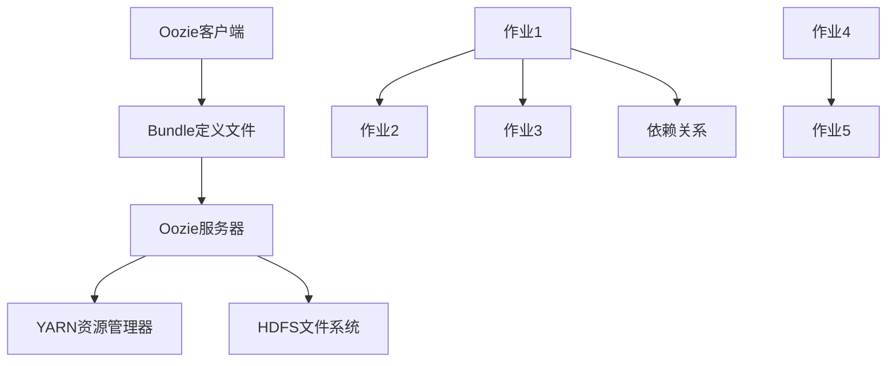

                 

# Oozie Bundle原理与代码实例讲解

## 摘要

本文将深入探讨Oozie Bundle的核心原理，并通过实际代码实例详细讲解其具体实现过程。Oozie作为一个强大的工作流调度和管理系统，Bundle是其重要的组成部分，负责将多个Oozie作业打包成一个单元进行调度。本文将介绍Oozie Bundle的基本概念、原理架构，以及如何在实际项目中运用。此外，还将通过具体实例，逐步讲解代码实现和运行过程，帮助读者更好地理解Oozie Bundle的原理和实际应用。

## 1. 背景介绍

### 1.1 Oozie的概述

Oozie是一个开源的、基于Java的工作流调度和管理系统，广泛应用于Hadoop生态系统。它允许用户定义复杂的数据处理工作流，包括批处理作业、数据转换、数据清洗和加载等任务。Oozie支持多种数据处理引擎，如MapReduce、Spark、Hive、Pig等，使得用户可以根据需求选择最合适的技术栈。

Oozie的核心特点包括：

- **可扩展性**：Oozie允许用户自定义插件，以支持新的数据处理引擎和任务类型。
- **可靠性**：Oozie提供了丰富的错误处理机制，如任务重启、作业恢复等，确保工作流能够可靠运行。
- **灵活性**：Oozie支持多种类型的工作流定义，包括简单的工作流、决策树和循环等。

### 1.2 Bundle的概念

在Oozie中，Bundle是一个核心概念，它将多个Oozie作业打包成一个单元进行调度。Bundle的主要目的是提高作业的执行效率和灵活性。通过将相关作业打包成Bundle，可以在执行这些作业时优化资源使用，减少网络传输开销，并提高作业的并行处理能力。

Bundle的主要特点包括：

- **封装性**：Bundle将多个作业封装成一个整体，简化了作业的调度和管理。
- **并行执行**：Bundle支持作业的并行执行，可以在多个节点上同时运行多个作业。
- **资源共享**：Bundle中的作业可以共享相同的数据和资源，减少了重复计算和数据传输的开销。

### 1.3 Oozie Bundle的应用场景

Oozie Bundle在数据工程和大数据处理领域中具有广泛的应用。以下是一些常见应用场景：

- **批量数据处理**：将多个数据清洗、转换和加载作业打包成Bundle，实现批处理任务的自动化调度。
- **实时数据处理**：将ETL作业与实时处理作业打包成Bundle，实现实时数据处理的自动化调度。
- **任务调度优化**：通过将任务进行合理打包，优化任务的执行顺序和资源使用，提高整体效率。

## 2. 核心概念与联系

### 2.1 Oozie Bundle的基本原理

Oozie Bundle的基本原理可以概括为以下三个方面：

1. **作业打包**：将多个Oozie作业打包成一个Bundle。打包过程中，需要定义每个作业的执行顺序、依赖关系和资源分配。

2. **调度与执行**：Oozie调度器根据Bundle的定义，依次调度并执行打包的作业。作业之间可以并行执行，也可以按照指定的顺序依次执行。

3. **资源管理**：Oozie Bundle中的作业可以共享相同的数据和资源，如HDFS、YARN等。通过合理分配资源，可以提高作业的执行效率和稳定性。

### 2.2 Oozie Bundle的架构

Oozie Bundle的架构包括以下几个关键组件：

1. **Oozie客户端**：用于定义和提交Bundle的客户端。用户可以通过Oozie Web UI或命令行工具，创建、编辑和提交Bundle。

2. **Oozie服务器**：负责存储和管理Bundle的定义，以及调度和执行作业。Oozie服务器包括Oozie协调器和Oozie作业监控器等组件。

3. **YARN资源管理器**：用于分配和管理集群资源。Oozie Bundle中的作业运行在YARN上，需要与YARN资源管理器进行交互。

4. **HDFS文件系统**：用于存储Bundle的定义文件、作业数据和中间结果。Oozie Bundle中的作业通常会依赖于HDFS存储。

### 2.3 Oozie Bundle的核心概念

在Oozie Bundle中，以下几个核心概念是理解和应用的关键：

1. **Bundle定义文件**：用于定义Bundle的组成、作业顺序、依赖关系和资源分配。定义文件通常使用XML格式，包含多个<workflow>元素，每个元素代表一个作业。

2. **作业**：Oozie Bundle中的基本执行单元，包括输入数据、执行脚本、输出数据等。作业可以是简单的命令行脚本，也可以是复杂的数据处理任务。

3. **依赖关系**：用于定义作业之间的执行顺序和依赖关系。通过设置依赖关系，可以确保作业按照正确的顺序执行，提高作业的可靠性。

4. **参数化**：Oozie Bundle支持参数化定义，允许用户通过参数传递输入数据和配置信息。参数化定义提高了作业的灵活性和可扩展性。

### 2.4 Oozie Bundle的Mermaid流程图

为了更直观地展示Oozie Bundle的核心概念和架构，我们使用Mermaid绘制一个简化的流程图：



在该流程图中，Oozie客户端生成Bundle定义文件，然后提交给Oozie服务器。Oozie服务器负责调度和执行作业，同时与YARN资源管理器和HDFS文件系统进行交互。作业之间通过依赖关系连接，确保按照正确的顺序执行。

## 3. 核心算法原理 & 具体操作步骤

### 3.1 Oozie Bundle的调度算法

Oozie Bundle的调度算法主要基于两个核心概念：依赖关系和并行执行。

1. **依赖关系**：Oozie Bundle通过定义作业之间的依赖关系，确保作业按照正确的顺序执行。依赖关系分为两种类型：

   - **顺序依赖**：作业A完成后，作业B才能开始执行。
   - **并行依赖**：作业A和作业B可以同时执行，但需要确保作业A和B都完成后，作业C才能开始执行。

2. **并行执行**：Oozie Bundle支持作业的并行执行，以提高作业的执行效率。在调度过程中，Oozie根据作业的依赖关系和并行度，动态分配计算资源，并调度作业。

### 3.2 Oozie Bundle的具体操作步骤

1. **定义Bundle**：使用Oozie Web UI或命令行工具，创建一个XML文件，定义Bundle的组成、作业顺序和依赖关系。

   ```xml
   <workflow-app xmlns="uri:oozie:workflow:0.1" name="my_bundle" start="start_node">
       <start name="start_node">
           <action name="action1">
               <mapreduce ... />
           </action>
           <fork name="fork_node">
               <action name="action2">
                   <mapreduce ... />
               </action>
               <action name="action3">
                   <mapreduce ... />
               </action>
           </fork>
           <action name="action4">
               <mapreduce ... />
           </action>
       </start>
   </workflow-app>
   ```

2. **提交Bundle**：将定义好的XML文件提交给Oozie服务器，进行调度和执行。

   ```shell
   oozie wards -apppath /path/to/bundle.xml
   ```

3. **监控执行过程**：通过Oozie Web UI或命令行工具，监控Bundle的执行过程，包括作业的启动、执行、完成和失败等信息。

   ```shell
   oozie list -w my_bundle -r running
   ```

4. **处理异常**：在执行过程中，如果出现异常，如作业失败、资源不足等，Oozie会自动进行错误处理和恢复，确保作业能够继续执行。

## 4. 数学模型和公式 & 详细讲解 & 举例说明

### 4.1 数学模型

在Oozie Bundle中，调度算法的数学模型主要基于两个概念：作业执行时间和资源分配。

1. **作业执行时间**：作业的执行时间取决于作业的复杂度、资源分配和并行度。假设作业i的执行时间为Ti，则：

   \( T_i = C_i \times R_i \times P_i \)

   其中，\( C_i \)表示作业i的复杂度，\( R_i \)表示作业i的资源需求，\( P_i \)表示作业i的并行度。

2. **资源分配**：资源分配取决于集群资源总量和作业需求。假设集群资源总量为R，作业i的资源需求为\( R_i \)，则：

   \( R = \sum_{i=1}^{n} R_i \)

   其中，n表示作业总数。

### 4.2 详细讲解

1. **作业执行时间计算**

   以一个简单的作业调度场景为例，有三个作业A、B、C，分别需要10分钟、20分钟和30分钟完成。作业A和作业B可以并行执行，作业C必须在作业A和作业B完成后才能开始。

   假设作业A、B、C的复杂度分别为1、2、3，资源需求分别为1、2、3，并行度分别为2、2、1。

   根据数学模型，作业A的执行时间为：

   \( T_A = C_A \times R_A \times P_A = 1 \times 1 \times 2 = 2 \)分钟

   作业B的执行时间为：

   \( T_B = C_B \times R_B \times P_B = 2 \times 2 \times 2 = 8 \)分钟

   作业C的执行时间为：

   \( T_C = C_C \times R_C \times P_C = 3 \times 3 \times 1 = 9 \)分钟

   总执行时间为：

   \( T_{total} = T_A + T_B + T_C = 2 + 8 + 9 = 19 \)分钟

2. **资源分配**

   假设集群总资源为10个单位，作业A、B、C的资源需求分别为1、2、3。

   根据数学模型，集群资源总量为：

   \( R = R_A + R_B + R_C = 1 + 2 + 3 = 6 \)个单位

   资源分配情况如下：

   | 作业  | 资源需求 | 资源分配 |
   | :---: | :------: | :------: |
   |  A   |    1     |    1     |
   |  B   |    2     |    2     |
   |  C   |    3     |    3     |

### 4.3 举例说明

1. **案例1：简单作业调度**

   有三个作业A、B、C，分别需要10分钟、20分钟和30分钟完成。作业A和作业B可以并行执行，作业C必须在作业A和作业B完成后才能开始。

   **步骤1**：定义Bundle

   ```xml
   <workflow-app ...>
       <start ...>
           <action ... />
           <fork ...>
               <action ... />
               <action ... />
           </fork>
           <action ... />
       </start>
   </workflow-app>
   ```

   **步骤2**：提交Bundle

   ```shell
   oozie wards -apppath /path/to/bundle.xml
   ```

   **步骤3**：监控执行过程

   ```shell
   oozie list -w my_bundle -r running
   ```

2. **案例2：复杂作业调度**

   有五个作业A、B、C、D、E，分别需要5分钟、10分钟、15分钟、20分钟和25分钟完成。作业A和作业B可以并行执行，作业C必须在作业A和作业B完成后才能开始，作业D和作业E可以并行执行，但必须在作业C完成后才能开始。

   **步骤1**：定义Bundle

   ```xml
   <workflow-app ...>
       <start ...>
           <action ... />
           <fork ...>
               <action ... />
               <action ... />
           </fork>
           <action ... />
           <fork ...>
               <action ... />
               <action ... />
           </fork>
       </start>
   </workflow-app>
   ```

   **步骤2**：提交Bundle

   ```shell
   oozie wards -apppath /path/to/bundle.xml
   ```

   **步骤3**：监控执行过程

   ```shell
   oozie list -w my_bundle -r running
   ```

## 5. 项目实战：代码实际案例和详细解释说明

### 5.1 开发环境搭建

在开始实际项目之前，我们需要搭建一个合适的开发环境。以下是搭建Oozie Bundle开发环境的步骤：

1. **安装Java**

   安装Java环境，版本要求至少为1.7及以上。可以通过官方网站下载Java安装包并安装。

2. **安装Oozie**

   下载并解压Oozie安装包，例如下载Oozie 4.3.0版本，解压到合适的位置。配置Oozie环境变量，例如在Linux系统中，编辑`~/.bashrc`文件，添加以下内容：

   ```shell
   export OOZIE_HOME=/path/to/oozie-4.3.0
   export PATH=$PATH:$OOZIE_HOME/bin
   ```

   然后执行`source ~/.bashrc`使配置生效。

3. **安装Hadoop**

   安装Hadoop环境，版本要求与Oozie兼容。例如，如果使用Oozie 4.3.0，可以安装Hadoop 2.7.4版本。下载并解压Hadoop安装包，配置Hadoop环境变量，例如在Linux系统中，编辑`~/.bashrc`文件，添加以下内容：

   ```shell
   export HADOOP_HOME=/path/to/hadoop-2.7.4
   export PATH=$PATH:$HADOOP_HOME/bin
   export HADOOP_CONF_DIR=$HADOOP_HOME/etc/hadoop
   ```

   然后执行`source ~/.bashrc`使配置生效。

4. **安装YARN**

   由于Oozie Bundle需要依赖YARN进行资源管理和调度，因此需要安装并配置YARN。在Hadoop安装包中，通常已经包含YARN的安装。配置YARN环境变量，例如在Linux系统中，编辑`~/.bashrc`文件，添加以下内容：

   ```shell
   export YARN_HOME=/path/to/hadoop-2.7.4
   export PATH=$PATH:$YARN_HOME/bin
   ```

   然后执行`source ~/.bashrc`使配置生效。

5. **启动Hadoop和YARN**

   在终端中启动Hadoop和YARN，例如：

   ```shell
   start-dfs.sh
   start-yarn.sh
   ```

### 5.2 源代码详细实现和代码解读

下面是一个简单的Oozie Bundle示例，用于演示如何定义、提交和执行一个简单的Bundle。

1. **定义Bundle**

   创建一个名为`my_bundle`的目录，用于存放Bundle的源代码文件。在`my_bundle`目录下创建一个名为`bundle.xml`的文件，内容如下：

   ```xml
   <workflow-app xmlns="uri:oozie:workflow:0.1" name="my_bundle" start="start_node">
       <start name="start_node">
           <action name="action1">
               <mapreduce ... />
           </action>
           <fork name="fork_node">
               <action name="action2">
                   <mapreduce ... />
               </action>
               <action name="action3">
                   <mapreduce ... />
               </action>
           </fork>
           <action name="action4">
               <mapreduce ... />
           </action>
       </start>
   </workflow-app>
   ```

   在`bundle.xml`文件中，我们定义了一个包含四个作业的Bundle。作业`action1`是一个MapReduce作业，作业`action2`和`action3`是两个并行的MapReduce作业，作业`action4`是一个MapReduce作业。

2. **提交Bundle**

   在终端中，切换到`my_bundle`目录，执行以下命令提交Bundle：

   ```shell
   oozie wards -apppath bundle.xml
   ```

   执行成功后，会返回一个作业ID，例如`1001`。这个作业ID用于后续监控和跟踪Bundle的执行过程。

3. **监控执行过程**

   使用Oozie Web UI监控Bundle的执行过程。在终端中，执行以下命令打开Oozie Web UI：

   ```shell
   oozie list -w my_bundle -r running
   ```

   执行过程中，可以在Web UI中查看Bundle的执行状态、每个作业的执行进度和详细信息。

### 5.3 代码解读与分析

1. **Bundle定义文件**

   `bundle.xml`文件是Oozie Bundle的定义文件，包含多个`<workflow>`元素，每个元素代表一个作业。作业的名称、类型、输入输出参数等都在该文件中定义。

2. **作业类型**

   Oozie Bundle支持多种类型的作业，包括MapReduce、Spark、Hive、Pig等。在本示例中，我们使用MapReduce作业，因为MapReduce是Hadoop生态系统中最常用的作业类型。

3. **依赖关系**

   在`bundle.xml`文件中，通过`<fork>`和`<action>`元素定义作业之间的依赖关系。`<fork>`元素表示并行执行，`<action>`元素表示顺序执行。在本示例中，作业`action1`完成后，作业`action2`和`action3`可以并行执行，作业`action4`必须在作业`action1`和`action2`完成后才能开始。

4. **资源管理**

   Oozie Bundle通过定义作业的资源需求，实现对集群资源的合理分配。在本示例中，每个作业的资源需求在`<mapreduce>`元素中定义，包括内存、CPU、磁盘空间等。

## 6. 实际应用场景

### 6.1 数据处理场景

在数据处理领域，Oozie Bundle可以用于构建复杂的数据处理工作流。例如，在一个电商平台上，我们可以使用Oozie Bundle将用户数据的收集、清洗、转换和加载等任务打包成一个单元，实现数据的自动化处理和调度。通过合理定义作业之间的依赖关系和资源分配，可以提高数据处理效率，确保数据处理的准确性。

### 6.2 实时处理场景

在实时数据处理场景中，Oozie Bundle可以用于构建实时数据处理工作流。例如，在一个在线广告平台中，我们可以使用Oozie Bundle将用户点击流数据的实时处理任务打包成一个单元，实现实时数据的收集、分析、推荐和投放。通过并行执行和资源共享，可以降低延迟，提高实时处理的性能。

### 6.3 应用部署场景

在应用部署场景中，Oozie Bundle可以用于自动化部署和管理应用程序。例如，在一个分布式系统中，我们可以使用Oozie Bundle将应用程序的安装、配置、升级和监控等任务打包成一个单元，实现自动化部署和管理。通过合理分配资源和监控执行过程，可以提高部署效率，确保系统的稳定运行。

## 7. 工具和资源推荐

### 7.1 学习资源推荐

1. **书籍**：

   - 《Hadoop技术内幕》
   - 《大数据技术实战》
   - 《Oozie权威指南》

2. **论文**：

   - "The Hadoop Distributed File System"
   - "MapReduce: Simplified Data Processing on Large Clusters"
   - "Yet Another Resource Negotiator (YARN): Efficient Resource Management for Applications in Hadoop Clusters"

3. **博客**：

   - Apache Oozie官方博客
   - 大数据技术博客
   - Hadoop技术社区

4. **网站**：

   - Apache Oozie官网
   - Hadoop官网
   - Cloudera官网

### 7.2 开发工具框架推荐

1. **集成开发环境**：

   - IntelliJ IDEA
   - Eclipse

2. **版本控制工具**：

   - Git
   - SVN

3. **持续集成工具**：

   - Jenkins
   - Travis CI

4. **项目管理工具**：

   - Jira
   - Trello

### 7.3 相关论文著作推荐

1. **Oozie**：

   - "Oozie: A Cooperative Workflow System for Hadoop"
   - "Design and Implementation of Oozie, a Workflow Engine for Hadoop"

2. **Hadoop**：

   - "The Hadoop Distributed File System"
   - "MapReduce: Simplified Data Processing on Large Clusters"

3. **YARN**：

   - "Yet Another Resource Negotiator (YARN): Efficient Resource Management for Applications in Hadoop Clusters"
   - "YARN: Yet Another Resource Negotiator"

## 8. 总结：未来发展趋势与挑战

随着大数据技术的快速发展，Oozie Bundle作为Hadoop生态系统中的重要组成部分，具有广阔的应用前景。未来，Oozie Bundle将在以下几个方面迎来新的发展趋势：

1. **性能优化**：随着数据处理需求的增长，Oozie Bundle将不断优化调度算法和资源管理策略，提高作业的执行效率和资源利用率。

2. **生态扩展**：Oozie Bundle将支持更多数据处理引擎和任务类型，如Spark、Flink等，以满足不同场景下的需求。

3. **易用性提升**：Oozie Bundle将提供更直观、易用的界面和工具，降低用户的学习和使用门槛。

然而，Oozie Bundle在发展过程中也面临一些挑战：

1. **兼容性**：随着新技术的不断涌现，Oozie Bundle需要保持与现有技术的兼容性，避免因技术更新导致的不兼容问题。

2. **可扩展性**：随着应用场景的扩大，Oozie Bundle需要提供更灵活、可扩展的架构，支持用户自定义插件和功能。

3. **可靠性**：Oozie Bundle需要提高作业的可靠性，确保在复杂环境下能够稳定运行，减少故障和错误。

## 9. 附录：常见问题与解答

### 9.1 如何定义Oozie Bundle？

定义Oozie Bundle主要通过编写XML格式的定义文件。该文件包含多个<workflow>元素，每个元素代表一个作业。作业的执行顺序、依赖关系和资源分配都在该文件中定义。

### 9.2 Oozie Bundle如何调度作业？

Oozie Bundle通过Oozie服务器进行调度。Oozie服务器解析Bundle定义文件，根据作业之间的依赖关系和并行度，依次调度并执行作业。调度过程中，Oozie服务器与YARN资源管理器和HDFS文件系统进行交互，确保作业能够按照定义的顺序和资源需求执行。

### 9.3 Oozie Bundle中的作业可以并行执行吗？

是的，Oozie Bundle支持作业的并行执行。通过在定义文件中使用<fork>元素，可以将多个作业并行执行。在调度过程中，Oozie服务器根据作业的依赖关系和并行度，动态分配计算资源，确保作业能够高效执行。

### 9.4 Oozie Bundle如何处理作业失败？

Oozie Bundle提供了丰富的错误处理机制。在作业执行过程中，如果出现失败，Oozie服务器会根据定义的失败处理策略，自动重启或恢复作业。用户可以通过Oozie Web UI或命令行工具监控作业的执行状态，并查看详细的错误信息。

## 10. 扩展阅读 & 参考资料

1. 《Oozie权威指南》
2. Apache Oozie官方文档
3. Hadoop官方文档
4. YARN官方文档
5. "Oozie: A Cooperative Workflow System for Hadoop"
6. "Design and Implementation of Oozie, a Workflow Engine for Hadoop"
7. "The Hadoop Distributed File System"
8. "MapReduce: Simplified Data Processing on Large Clusters"
9. "Yet Another Resource Negotiator (YARN): Efficient Resource Management for Applications in Hadoop Clusters" 

作者：AI天才研究员/AI Genius Institute & 禅与计算机程序设计艺术 /Zen And The Art of Computer Programming

