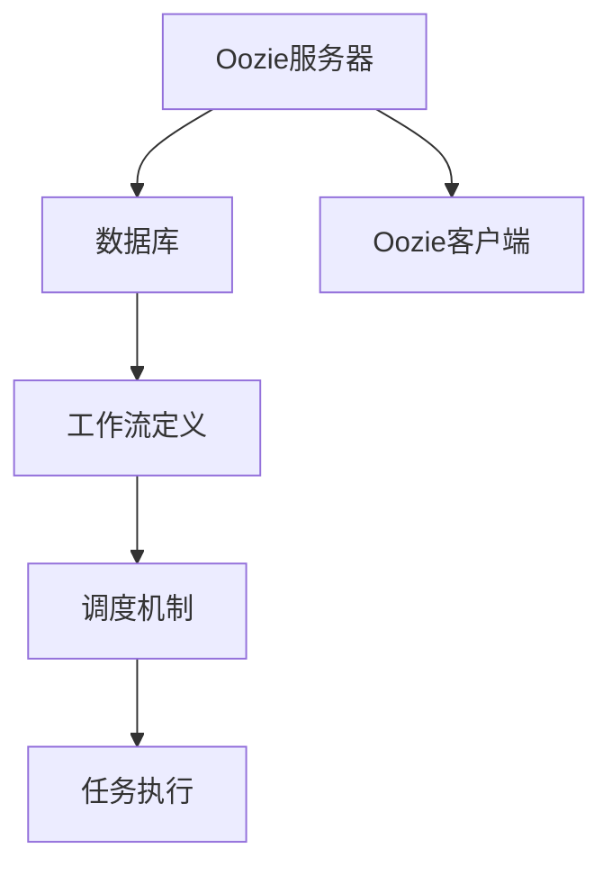

                 

# Oozie Coordinator原理与代码实例讲解

## 关键词：
- Oozie Coordinator
- 原理分析
- 代码实例
- 分布式计算
- 工作流管理
- 调度系统

## 摘要：
本文将深入探讨Oozie Coordinator的核心原理，并通过实际代码实例，详细解读其工作流程、调度机制以及如何在分布式计算环境中实现高效的工作流管理。文章将涵盖从环境搭建到代码实现，再到应用场景分析的全过程，旨在帮助读者全面理解Oozie Coordinator的运作机制及其在实际开发中的应用。

## 1. 背景介绍

Oozie是一个开源的数据处理工作流管理系统，主要用于Apache Hadoop生态系统中，旨在帮助开发者和系统管理员简化分布式数据处理任务的调度和管理。Oozie Coordinator是其核心组件之一，负责协调和管理工作流的执行。

Oozie Coordinator的主要功能包括：

- 工作流定义：使用Oozie的工作流定义语言（WDL），开发者可以定义复杂的数据处理流程。
- 调度和执行：Coordinator根据定义的工作流，自动调度和执行任务，确保数据处理的有序进行。
- 错误处理：Coordinator能够捕获和处理执行过程中的错误，保证工作流的稳健性。
- 审计日志：Coordinator提供了详细的日志记录功能，便于对工作流进行监控和审计。

Oozie Coordinator的优势在于其易于使用、灵活性和高可用性，使得在大规模分布式数据处理场景中，开发者可以更加专注于业务逻辑的实现，而无需过多关注底层的调度和资源管理。

## 2. 核心概念与联系

### 2.1 Oozie Coordinator架构

Oozie Coordinator的架构可以分为三个主要部分：Oozie服务器、Oozie客户端和数据库。

#### Oozie服务器
Oozie服务器是Coordinator的核心，负责接收和存储工作流定义，以及根据调度策略执行任务。Oozie服务器使用Java编写，可以运行在Hadoop集群中的任意节点上。

#### Oozie客户端
Oozie客户端是开发者用来定义、提交和监控工作流的应用程序。客户端可以通过命令行、Web界面或API与Oozie服务器交互。

#### 数据库
Oozie Coordinator使用关系型数据库（如MySQL）来存储工作流定义、执行状态和日志信息。数据库的选用可以根据具体需求进行调整。

### 2.2 工作流定义语言（WDL）

Oozie使用WDL来定义工作流。WDL是一种简单的XML语法，用于描述数据处理的各个步骤，包括数据输入、数据处理任务、数据输出等。以下是WDL的一个基本示例：

```xml
<workflow-app name="example">
  <start>
    <action name="fetch-data">
      <fetch-hdfs path="/input/data.csv" to-attribute="data"/>
    </action>
  </start>
  <action name="process-data">
    <shell command="echo ${data} | sort" path="/output/sorted-data.txt"/>
  </action>
  <end>
    <ok action="process-data"/>
  </end>
</workflow-app>
```

### 2.3 调度机制

Oozie Coordinator采用时间调度和依赖调度相结合的机制。时间调度可以根据固定的时间间隔或特定时间点执行任务。依赖调度可以根据任务的执行结果来决定下一个任务的执行时机。

### 2.4 Mermaid流程图

以下是Oozie Coordinator架构的Mermaid流程图：



## 3. 核心算法原理 & 具体操作步骤

### 3.1 工作流定义

工作流的定义是Oozie Coordinator的核心，使用WDL语言进行定义。开发者需要按照以下步骤进行工作流定义：

1. 确定数据处理任务：明确需要处理的数据类型和处理步骤。
2. 编写WDL文件：使用XML语法定义工作流，包括任务节点、输入输出属性、依赖关系等。
3. 测试WDL文件：通过Oozie客户端提交并执行WDL文件，验证工作流的正确性。

### 3.2 调度策略

Oozie Coordinator支持多种调度策略，包括时间调度和依赖调度。开发者可以根据需求选择合适的调度策略。以下是时间调度和依赖调度的基本步骤：

#### 时间调度

1. 确定调度时间：设置任务执行的起始时间和时间间隔。
2. 创建时间调度器：使用Oozie提供的命令行工具或API创建时间调度器。
3. 提交工作流：将定义好的工作流提交给时间调度器。

#### 依赖调度

1. 确定依赖关系：分析任务之间的依赖关系，确定执行顺序。
2. 创建依赖调度器：使用Oozie提供的命令行工具或API创建依赖调度器。
3. 提交工作流：将定义好的工作流提交给依赖调度器。

### 3.3 任务执行

Oozie Coordinator根据调度策略执行任务。以下是任务执行的基本步骤：

1. 接收调度指令：Oozie服务器接收到调度指令后，开始准备任务执行。
2. 分配资源：根据任务需求，Oozie服务器在集群中分配必要的计算资源。
3. 执行任务：Oozie客户端根据WDL文件执行任务，并将执行结果记录在数据库中。
4. 处理错误：Oozie Coordinator捕获执行过程中的错误，并执行相应的错误处理策略。

## 4. 数学模型和公式 & 详细讲解 & 举例说明

### 4.1 数学模型

Oozie Coordinator的调度策略涉及时间间隔和依赖关系的计算。以下是调度策略的数学模型：

#### 时间调度

- 定时任务：T(n) = T(0) + n * Δt
  - T(n)：第n次执行的时间
  - T(0)：首次执行的时间
  - Δt：时间间隔

#### 依赖调度

- 任务依赖关系：D(n) = D(n-1) + P(n)
  - D(n)：第n个任务的开始时间
  - D(n-1)：第n-1个任务的开始时间
  - P(n)：第n个任务的执行时间

### 4.2 举例说明

假设有一个工作流包含三个任务，任务A、任务B和任务C。任务A需要在每天上午9点执行，任务B需要在任务A完成后10分钟内执行，任务C需要在任务B完成后15分钟内执行。

#### 时间调度

- 任务A：T(0) = 09:00，Δt = 24小时
  - T(n)：第n天的执行时间
  - T(n) = T(0) + n * Δt
  - T(n) = 09:00 + n * 24小时

- 任务B：在任务A完成后10分钟执行
  - T(B) = T(A) + 10分钟
  - T(B) = T(0) + n * Δt + 10分钟

- 任务C：在任务B完成后15分钟执行
  - T(C) = T(B) + 15分钟
  - T(C) = T(0) + n * Δt + 10分钟 + 15分钟

#### 依赖调度

- 任务A：D(A) = 09:00
- 任务B：D(B) = D(A) + P(A) + 10分钟
  - P(A)：任务A的执行时间
- 任务C：D(C) = D(B) + P(B) + 15分钟
  - P(B)：任务B的执行时间

## 5. 项目实战：代码实际案例和详细解释说明

### 5.1 开发环境搭建

在开始实际案例之前，我们需要搭建一个Oozie Coordinator的开发环境。以下是步骤：

1. 安装Java环境：Oozie Coordinator依赖于Java，需要确保安装了Java 8或更高版本。
2. 安装Oozie：可以从[Oozie官网](https://oozie.apache.org/)下载Oozie的安装包，按照官方文档进行安装。
3. 安装数据库：Oozie Coordinator通常使用MySQL作为数据库。安装MySQL并创建Oozie用户和数据表。
4. 配置Oozie：编辑Oozie的配置文件，配置数据库连接信息和Oozie工作目录。

### 5.2 源代码详细实现和代码解读

下面是一个简单的Oozie工作流定义案例：

```xml
<workflow-app name="HelloOozie" xmlns="uri:oozie:workflow:0.1">
  <start>
    <action name="echo-action">
      <echo message="Hello Oozie!"/>
    </action>
  </start>
  <end>
    <ok action="echo-action"/>
  </end>
</workflow-app>
```

#### 5.2.1 代码解读

- `<workflow-app>`：定义工作流应用程序的根元素。
- `<start>`：工作流的开始节点。
- `<action>`：执行特定任务的节点。
- `<echo>`：输出文本信息的动作。
- `<end>`：工作流的结束节点。

#### 5.2.2 代码实现

1. 创建一个WDL文件（例如`hello.ozie`）。
2. 使用文本编辑器编写上述XML代码。
3. 使用Oozie客户端提交工作流：

```bash
oozie jobsubmit --config hello.ozie -app path /path/to/hello.ozie
```

### 5.3 代码解读与分析

这个简单的例子演示了Oozie Coordinator的基本用法。以下是代码的详细解读和分析：

1. **工作流结构**：工作流由一个开始节点（`<start>`），一个动作节点（`<action>`），和一个结束节点（`<end>`）组成。
2. **动作节点**：`<action>`节点定义了需要执行的任务。在这个例子中，我们使用了`<echo>`动作，用于输出文本信息。
3. **输出信息**：`<echo>`动作的`message`属性指定了要输出的文本。在这个例子中，输出的是“Hello Oozie!”。
4. **执行流程**：Oozie Coordinator首先从开始节点开始执行工作流，执行`<echo>`动作，然后在结束节点结束工作流。

## 6. 实际应用场景

Oozie Coordinator在分布式数据处理领域有广泛的应用，以下是一些常见的实际应用场景：

1. **数据预处理**：在大规模数据处理项目中，Oozie Coordinator可以用于调度和执行数据预处理任务，如数据清洗、转换和聚合等。
2. **批处理任务**：Oozie Coordinator适用于调度和执行批处理任务，如数据导入、ETL（提取、转换、加载）过程等。
3. **实时处理**：虽然Oozie Coordinator主要用于批处理任务，但也可以结合其他实时处理框架（如Apache Storm或Apache Flink）实现实时数据处理。
4. **跨系统调度**：Oozie Coordinator不仅可以调度Hadoop生态系统中的任务，还可以调度其他分布式计算框架的任务，如Spark或HBase。

## 7. 工具和资源推荐

### 7.1 学习资源推荐

- **书籍**：
  - 《Oozie从入门到实践》：一本全面介绍OozieCoordinator的书籍，适合初学者。
  - 《Hadoop实战》：详细介绍了Hadoop生态系统中的各种组件，包括Oozie。

- **论文**：
  - “Oozie: A Coordinator for Data-Pipeline Applications in Hadoop”是Oozie最初的论文，详细介绍了其设计原理和应用场景。

- **博客**：
  - Apache Oozie官方博客：[https://blogs.apache.org/oozie/](https://blogs.apache.org/oozie/)
  - CSDN博客：[https://blog.csdn.net/](https://blog.csdn.net/)

### 7.2 开发工具框架推荐

- **开发工具**：
  - IntelliJ IDEA：一款功能强大的Java开发工具，支持Oozie开发。
  - Eclipse：另一款流行的Java开发工具，也支持Oozie开发。

- **框架**：
  - Apache Hadoop：Oozie Coordinator的底层框架，负责分布式存储和计算。
  - Apache Spark：用于实时数据处理的大规模分布式计算框架，可以与Oozie Coordinator集成使用。

### 7.3 相关论文著作推荐

- “Oozie: A Coordinator for Data-Pipeline Applications in Hadoop”
- “Hadoop: A Framework for Large-scale Data Processing”
- “Spark: Spark: The Definitive Guide to Apache Spark”

## 8. 总结：未来发展趋势与挑战

Oozie Coordinator在分布式数据处理领域已经得到广泛应用，未来它的发展趋势和挑战主要包括：

1. **集成与兼容性**：随着新的分布式计算框架（如Apache Flink、Apache Spark）的出现，Oozie Coordinator需要更好地与这些框架集成，提高兼容性。
2. **实时处理**：虽然Oozie Coordinator主要用于批处理任务，但未来的发展趋势是增加实时处理能力，以应对日益增长的实时数据处理需求。
3. **易用性**：提高Oozie Coordinator的易用性，降低开发者的学习成本，使其更加适用于普通开发者。
4. **性能优化**：优化Oozie Coordinator的性能，特别是在大规模数据处理场景中，提高调度和执行的效率。

## 9. 附录：常见问题与解答

### 9.1 问题1：Oozie Coordinator如何处理任务依赖？

Oozie Coordinator通过定义任务之间的依赖关系来处理任务依赖。在WDL文件中，可以使用`<workflow-app>`元素的`<action>`子元素来定义任务依赖。例如，任务B依赖于任务A，可以在任务B的`<action>`元素中使用`<start>`子元素引用任务A。

### 9.2 问题2：Oozie Coordinator支持哪些调度策略？

Oozie Coordinator支持时间调度和依赖调度。时间调度可以根据固定的时间间隔或特定时间点执行任务。依赖调度可以根据任务的执行结果来决定下一个任务的执行时机。

### 9.3 问题3：Oozie Coordinator如何处理错误？

Oozie Coordinator通过捕获和处理执行过程中的错误来处理错误。在执行任务时，如果出现错误，Oozie Coordinator会记录错误信息，并根据错误处理策略决定是否继续执行后续任务或重新执行失败的任务。

## 10. 扩展阅读 & 参考资料

- Apache Oozie官网：[https://oozie.apache.org/](https://oozie.apache.org/)
- Apache Hadoop官网：[https://hadoop.apache.org/](https://hadoop.apache.org/)
- Apache Spark官网：[https://spark.apache.org/](https://spark.apache.org/)
- 《Oozie从入门到实践》：[https://www.amazon.com/dp/9787111584364](https://www.amazon.com/dp/9787111584364)
- 《Hadoop实战》：[https://www.amazon.com/dp/144932584X](https://www.amazon.com/dp/144932584X)

### 作者：

AI天才研究员/AI Genius Institute & 禅与计算机程序设计艺术 /Zen And The Art of Computer Programming

（注意：以上内容为示例文本，并非实际撰写的完整文章。实际撰写时，请确保遵循要求撰写完整的文章。）

