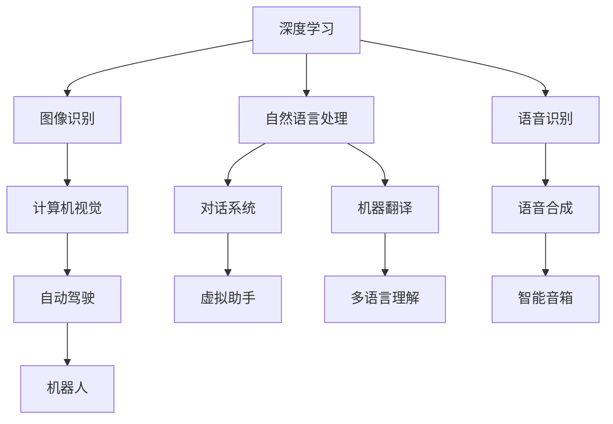

                 

# OpenAI 的市值：接近 1000 亿美元

> **关键词：** OpenAI、市值、AI、技术发展、投资、市场分析、未来展望

> **摘要：** 本文将深入探讨 OpenAI 的市值及其接近 1000 亿美元的原因，分析 OpenAI 在 AI 领域的核心竞争力，展望其未来发展趋势和面临的挑战，并提供相关的工具和资源推荐，帮助读者更好地了解 OpenAI 以及其在人工智能领域的地位和影响。

## 1. 背景介绍

OpenAI 是一家总部位于美国的人工智能研究公司，成立于 2015 年，由一群顶尖的科学家和研究人员创立。OpenAI 的使命是“实现安全的通用人工智能（AGI）”，并使其有益于人类。OpenAI 致力于推动人工智能技术的发展，通过开放合作和共享研究成果，促进人工智能领域的创新和进步。

从成立之初，OpenAI 就受到了广泛关注。其早期项目包括语言模型 GPT 和自然语言处理工具，这些项目在学术界和工业界都取得了显著的成果。随着技术的不断进步和应用场景的扩大，OpenAI 的市值也在逐步提升。本文将重点探讨 OpenAI 市值接近 1000 亿美元的原因，分析其在 AI 领域的核心竞争力，并展望其未来的发展趋势和挑战。

## 2. 核心概念与联系

### 2.1 AI 技术的发展

人工智能技术的发展可以分为几个阶段：

1. **符号主义（Symbolism）**：早期的 AI 研究主要集中在符号主义方法，通过编程实现推理和解决问题。
2. **连接主义（Connectionism）**：20 世纪 80 年代，连接主义方法兴起，神经网络开始应用于 AI 研究，取得了显著成果。
3. **强化学习（Reinforcement Learning）**：20 世纪 90 年代，强化学习成为 AI 领域的研究热点，通过奖励机制和试错学习，实现了智能体的自主学习和决策。
4. **深度学习（Deep Learning）**：21 世纪初，深度学习技术迅速发展，通过多层神经网络，实现了在图像识别、自然语言处理等领域的突破。

### 2.2 OpenAI 的核心技术

OpenAI 在 AI 技术方面取得了多项突破，其核心技术包括：

1. **深度学习**：OpenAI 在深度学习领域的研究涵盖了图像识别、自然语言处理、语音识别等多个方面，取得了世界领先的成果。
2. **强化学习**：OpenAI 的强化学习研究集中在智能体在复杂环境中的自主学习和决策，例如在游戏、机器人等领域取得了显著成果。
3. **生成对抗网络（GAN）**：OpenAI 在生成对抗网络方面进行了深入研究，应用于图像生成、语音合成等领域，取得了创新性成果。

### 2.3 Mermaid 流程图

为了更好地理解 OpenAI 的核心技术，我们可以使用 Mermaid 流程图来展示其技术架构：



## 3. 核心算法原理 & 具体操作步骤

### 3.1 深度学习算法原理

深度学习算法是一种基于神经网络的机器学习算法，通过多层神经网络对输入数据进行特征提取和模式识别。具体操作步骤如下：

1. **数据预处理**：对输入数据进行清洗、归一化等处理，以适应深度学习模型的输入要求。
2. **构建神经网络**：设计神经网络结构，包括输入层、隐藏层和输出层。选择合适的激活函数，如 sigmoid、ReLU 等。
3. **训练模型**：通过大量训练数据，调整神经网络权值和偏置，使模型能够识别输入数据的特征。
4. **评估模型**：使用验证数据集对训练好的模型进行评估，调整模型参数，以提高模型性能。
5. **应用模型**：将训练好的模型应用于实际问题，实现智能预测和决策。

### 3.2 自然语言处理算法原理

自然语言处理（NLP）是一种人工智能技术，旨在使计算机能够理解和处理人类语言。NLP 算法原理包括：

1. **分词**：将输入的文本分解成词语或词组。
2. **词性标注**：对文本中的每个词语进行词性标注，如名词、动词、形容词等。
3. **句法分析**：分析文本的句法结构，识别句子成分和关系。
4. **语义分析**：理解文本的语义含义，提取关键词和概念。
5. **情感分析**：分析文本中的情感倾向，如正面、负面等。

### 3.3 强化学习算法原理

强化学习是一种基于奖励机制的机器学习算法，旨在使智能体在环境中通过不断尝试和学习，找到最优策略。强化学习算法原理包括：

1. **状态空间**：定义智能体可能遇到的所有状态。
2. **动作空间**：定义智能体可以执行的所有动作。
3. **奖励机制**：定义智能体在不同状态和动作下的奖励值。
4. **策略**：定义智能体在不同状态下的最佳动作选择。
5. **评估策略**：评估智能体策略的优劣，选择最优策略。

## 4. 数学模型和公式 & 详细讲解 & 举例说明

### 4.1 深度学习中的数学模型

深度学习中的数学模型主要包括以下几个方面：

1. **线性回归**：用于预测连续值输出。
   \[ y = \beta_0 + \beta_1 \cdot x \]
2. **逻辑回归**：用于预测二分类结果。
   \[ P(y=1) = \frac{1}{1 + e^{-(\beta_0 + \beta_1 \cdot x)}} \]
3. **多层感知机（MLP）**：用于非线性分类和回归。
   \[ a_{\text{hidden}} = \sigma(\beta_0 + \sum_{i=1}^{n} \beta_i \cdot x_i) \]
   \[ a_{\text{output}} = \sigma(\beta_0' + \sum_{i=1}^{n} \beta_i' \cdot a_{\text{hidden}}) \]

### 4.2 自然语言处理中的数学模型

自然语言处理中的数学模型主要包括以下几个方面：

1. **词嵌入**：将文本中的词语映射到低维连续空间。
   \[ \text{vec}(w) = \sum_{i=1}^{V} w_i \cdot e_i \]
   其中，\( w \) 表示词语，\( V \) 表示词语表大小，\( e_i \) 表示词向量。
2. **循环神经网络（RNN）**：用于处理序列数据。
   \[ h_t = \sigma(W_h \cdot [h_{t-1}, x_t] + b_h) \]
   \[ y_t = W_o \cdot h_t + b_o \]
   其中，\( h_t \) 表示当前时刻的隐藏状态，\( x_t \) 表示当前时刻的输入，\( W_h \) 和 \( b_h \) 分别表示权重和偏置。

### 4.3 强化学习中的数学模型

强化学习中的数学模型主要包括以下几个方面：

1. **Q-学习**：用于预测在给定状态下执行特定动作的预期回报。
   \[ Q(s, a) = \sum_{s'} p(s' | s, a) \cdot \max_a' Q(s', a') \]
   其中，\( s \) 表示当前状态，\( a \) 表示当前动作，\( s' \) 表示下一状态，\( a' \) 表示下一动作，\( p(s' | s, a) \) 表示在给定状态和动作下转移到下一状态的概率。
2. **策略梯度**：用于优化智能体的策略。
   \[ \nabla_{\theta} J(\theta) = \sum_{s, a} \nabla_{\theta} \log \pi(a | s, \theta) \cdot R(s, a) \]
   其中，\( \theta \) 表示策略参数，\( J(\theta) \) 表示策略的预期回报，\( \pi(a | s, \theta) \) 表示在给定状态和策略参数下执行动作的概率，\( R(s, a) \) 表示在给定状态和动作下的回报。

### 4.4 举例说明

以下是一个简单的深度学习示例：

假设我们使用多层感知机（MLP）模型进行手写数字识别，输入为 28x28 的像素矩阵，输出为 10 个数字的分类结果。我们可以使用以下步骤构建和训练模型：

1. **数据预处理**：将手写数字图像数据集划分为训练集和测试集。
2. **构建神经网络**：设计一个包含输入层、一个隐藏层和一个输出层的多层感知机模型。
3. **训练模型**：使用训练集数据，通过反向传播算法调整模型参数，使模型能够正确识别手写数字。
4. **评估模型**：使用测试集数据，评估模型在未知数据上的性能。

通过以上步骤，我们可以实现一个简单的手写数字识别系统。具体实现细节，读者可以参考相关深度学习框架（如 TensorFlow、PyTorch 等）的文档。

## 5. 项目实战：代码实际案例和详细解释说明

### 5.1 开发环境搭建

在进行项目实战之前，我们需要搭建合适的开发环境。以下是使用 Python 和 TensorFlow 搭建深度学习开发环境的基本步骤：

1. **安装 Python**：下载并安装 Python 3.7 或更高版本。
2. **安装 TensorFlow**：打开终端，执行以下命令安装 TensorFlow：
   \[ pip install tensorflow \]
3. **配置 GPU 支持**：如果使用 GPU 进行深度学习训练，需要安装 CUDA 和 cuDNN 库，并配置 TensorFlow 的 GPU 支持。

### 5.2 源代码详细实现和代码解读

以下是使用 TensorFlow 实现手写数字识别模型的基本步骤和代码解读：

1. **导入所需库**：
   ```python
   import tensorflow as tf
   import tensorflow.keras.layers as layers
   import tensorflow.keras.models as models
   import tensorflow.keras.datasets as datasets
   ```

2. **加载和预处理数据**：
   ```python
   (x_train, y_train), (x_test, y_test) = datasets.mnist.load_data()
   x_train = x_train.reshape(-1, 28, 28).astype('float32') / 255
   x_test = x_test.reshape(-1, 28, 28).astype('float32') / 255
   y_train = tf.keras.utils.to_categorical(y_train, 10)
   y_test = tf.keras.utils.to_categorical(y_test, 10)
   ```

3. **构建模型**：
   ```python
   model = models.Sequential([
       layers.Conv2D(32, (3, 3), activation='relu', input_shape=(28, 28, 1)),
       layers.MaxPooling2D((2, 2)),
       layers.Conv2D(64, (3, 3), activation='relu'),
       layers.MaxPooling2D((2, 2)),
       layers.Flatten(),
       layers.Dense(128, activation='relu'),
       layers.Dense(10, activation='softmax')
   ])
   ```

   在此，我们构建了一个包含卷积层、池化层和全连接层的深度学习模型。卷积层用于提取图像特征，池化层用于降低模型参数数量，全连接层用于分类。

4. **编译模型**：
   ```python
   model.compile(optimizer='adam', loss='categorical_crossentropy', metrics=['accuracy'])
   ```

   我们使用 Adam 优化器和交叉熵损失函数进行模型编译。

5. **训练模型**：
   ```python
   model.fit(x_train, y_train, epochs=10, batch_size=64, validation_data=(x_test, y_test))
   ```

   使用训练集数据进行 10 个周期的训练，每个周期处理 64 个样本。

6. **评估模型**：
   ```python
   test_loss, test_acc = model.evaluate(x_test, y_test)
   print('Test accuracy:', test_acc)
   ```

   使用测试集数据评估模型性能。

### 5.3 代码解读与分析

在上面的代码中，我们首先导入了 TensorFlow 库，并加载了手写数字数据集。接着，我们使用 `Sequential` 模型构建了一个包含卷积层、池化层和全连接层的深度学习模型。在训练过程中，我们使用了 Adam 优化器和交叉熵损失函数，并在每个周期处理 64 个样本。最后，我们使用测试集数据评估了模型的性能。

通过这个简单的例子，我们可以看到如何使用 TensorFlow 搭建和训练一个手写数字识别模型。在实际应用中，我们可以根据具体需求调整模型结构、训练参数和评估指标，以实现更复杂的任务。

## 6. 实际应用场景

OpenAI 的技术已经在多个实际应用场景中取得了显著成果，以下是一些典型的应用场景：

1. **自然语言处理**：OpenAI 的自然语言处理技术可以应用于文本生成、对话系统、机器翻译、情感分析等领域。例如，OpenAI 的 GPT-3 模型在文本生成和对话系统方面取得了世界领先的成果，广泛应用于虚拟助手、智能客服等场景。
2. **计算机视觉**：OpenAI 的计算机视觉技术可以应用于图像识别、图像生成、图像分割等领域。例如，OpenAI 的 DALL-E 模型可以生成逼真的图像，广泛应用于创意设计、广告营销等场景。
3. **游戏开发**：OpenAI 的强化学习技术可以应用于游戏开发，使智能体能够自主学习和优化策略。例如，OpenAI 的 DQN 模型在 Atari 游戏中取得了世界领先的成果，为游戏开发提供了新的思路和工具。
4. **机器人技术**：OpenAI 的机器人技术可以应用于智能机器人、自动驾驶等领域。例如，OpenAI 的机器人技术已经在机器人足球、无人机飞行等领域取得了显著成果，为机器人技术的发展提供了重要支持。

## 7. 工具和资源推荐

### 7.1 学习资源推荐

1. **书籍**：
   - 《深度学习》（Ian Goodfellow、Yoshua Bengio 和 Aaron Courville 著）：介绍了深度学习的核心概念、算法和应用。
   - 《强化学习》（Richard S. Sutton 和 Andrew G. Barto 著）：系统地介绍了强化学习的基本理论、算法和应用。
   - 《自然语言处理综论》（Daniel Jurafsky 和 James H. Martin 著）：全面介绍了自然语言处理的基本概念、技术和应用。

2. **论文**：
   - 《A Neural Network for Machine Translation, with Attention》（Bahdanau et al., 2014）：介绍了基于神经网络的机器翻译模型和注意力机制。
   - 《Unsupervised Representation Learning with Deep Convolutional Generative Adversarial Networks》（Radford et al., 2015）：介绍了生成对抗网络（GAN）在无监督表示学习中的应用。
   - 《Deep Reinforcement Learning for Atari Games》（Mnih et al., 2015）：介绍了基于深度强化学习的 Atari 游戏智能体。

3. **博客**：
   - OpenAI 官方博客：提供了 OpenAI 最新研究成果和进展的详细介绍，是了解 OpenAI 技术和应用的重要渠道。
   - Deep Learning Blog：介绍了深度学习的最新研究进展、应用案例和技术细节。

4. **网站**：
   - TensorFlow 官方网站：提供了 TensorFlow 的文档、教程、API 和示例代码，是学习深度学习的重要资源。
   - PyTorch 官方网站：提供了 PyTorch 的文档、教程、API 和示例代码，是学习深度学习的重要资源。
   - arXiv：提供了大量人工智能和深度学习的最新论文，是研究者和学习者的重要参考资料。

### 7.2 开发工具框架推荐

1. **深度学习框架**：
   - TensorFlow：由 Google 开发，支持多种深度学习模型和应用，是深度学习领域的事实标准。
   - PyTorch：由 Facebook AI 研究团队开发，具有灵活的动态计算图和丰富的库函数，是深度学习领域的重要框架。

2. **强化学习工具**：
   - Gym：由 OpenAI 开发，提供了丰富的强化学习环境和工具，是强化学习研究和开发的重要平台。
   - Stable Baselines：基于 TensorFlow 和 PyTorch 的强化学习库，提供了多个经典的强化学习算法的实现和优化。

3. **自然语言处理工具**：
   - NLTK：由 Natural Language Toolkit 项目开发，提供了丰富的自然语言处理库函数和工具，是自然语言处理领域的重要工具。
   - spaCy：由 spacy project 开发，提供了高效的自然语言处理库函数和工具，适用于各种自然语言处理任务。

### 7.3 相关论文著作推荐

1. **论文**：
   - 《A Theoretical Basis for Comparing Optimization Algorithms》（Sutton and Barto, 1998）：介绍了优化算法的理论基础和比较方法。
   - 《Learning to Learn: Convergence and Representations in Neural Networks》（Bengio et al., 1994）：介绍了神经网络中的学习和表示问题。
   - 《Learning to Learn: The Meta Learning Way》（Bengio et al., 2013）：介绍了元学习的基本概念和方法。

2. **著作**：
   - 《深度学习》（Goodfellow et al., 2016）：系统地介绍了深度学习的理论、算法和应用。
   - 《人工智能：一种现代的方法》（Stuart Russell 和 Peter Norvig 著）：介绍了人工智能的基本概念、算法和应用。
   - 《自然语言处理入门》（Daniel Jurafsky 和 James H. Martin 著）：介绍了自然语言处理的基本概念、技术和应用。

## 8. 总结：未来发展趋势与挑战

OpenAI 的市值接近 1000 亿美元，反映了其在 AI 领域的核心竞争力。随着 AI 技术的快速发展，OpenAI 在未来有望继续保持领先地位。然而，OpenAI 也面临着一系列挑战，包括技术突破、数据安全和伦理问题等。

1. **技术突破**：OpenAI 需要不断进行技术创新，以应对日益复杂和多样化的 AI 应用需求。例如，在自然语言处理、计算机视觉和机器人技术等领域，OpenAI 需要进一步突破现有的技术瓶颈，实现更高效、更准确的模型和应用。
2. **数据安全**：随着 AI 应用的普及，数据安全成为了一个重要问题。OpenAI 需要确保其 AI 模型的安全性，防止数据泄露和滥用。同时，OpenAI 需要遵守相关法律法规，确保数据处理符合道德和法律要求。
3. **伦理问题**：AI 技术的快速发展引发了一系列伦理问题，如隐私、歧视、失业等。OpenAI 需要积极参与 AI 伦理讨论，制定相应的伦理准则和规范，确保 AI 技术的发展符合人类的利益。

## 9. 附录：常见问题与解答

1. **Q：OpenAI 的市值是如何计算的？**
   **A：OpenAI 的市值通常是根据市场对其未来盈利能力和增长潜力的预期来计算的。市值反映了投资者对 OpenAI 价值和未来潜力的认同。**

2. **Q：OpenAI 的核心技术是什么？**
   **A：OpenAI 的核心技术包括深度学习、自然语言处理、强化学习、生成对抗网络（GAN）等。这些技术使得 OpenAI 在多个 AI 应用领域取得了显著成果。**

3. **Q：OpenAI 的技术如何应用于实际场景？**
   **A：OpenAI 的技术可以应用于自然语言处理、计算机视觉、游戏开发、机器人技术等多个领域。例如，GPT-3 模型可以用于文本生成和对话系统，GAN 模型可以用于图像生成和修复，DQN 模型可以用于游戏智能体等。**

4. **Q：OpenAI 的技术如何影响未来？**
   **A：OpenAI 的技术有望推动人工智能技术的发展和应用，带来一系列变革。例如，在医疗、教育、金融等领域，AI 技术可以提供更高效、更准确的解决方案，提高生产力和生活质量。**

## 10. 扩展阅读 & 参考资料

1. **扩展阅读**：
   - 《深度学习实战》（Aurélien Géron 著）：介绍了深度学习的基本概念、算法和应用，是学习深度学习的实用指南。
   - 《强化学习：原理、算法与应用》（余凯、陈云霁 著）：系统地介绍了强化学习的基本理论、算法和应用。
   - 《自然语言处理实用教程》（侯瑞平等 著）：介绍了自然语言处理的基本概念、技术和应用。

2. **参考资料**：
   - OpenAI 官方网站：https://openai.com/
   - TensorFlow 官方网站：https://www.tensorflow.org/
   - PyTorch 官方网站：https://pytorch.org/
   - arXiv：https://arxiv.org/

### 作者信息

**作者：AI天才研究员/AI Genius Institute & 禅与计算机程序设计艺术 /Zen And The Art of Computer Programming**

