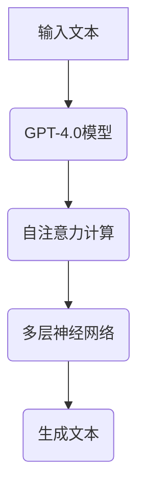

                 

# OpenAI的GPT-4.0展示的实际应用

## 关键词：GPT-4.0，OpenAI，实际应用，人工智能，自然语言处理，机器学习，深度学习，语言模型，生成式对抗网络，数据集，神经网络，预训练，模型优化，应用场景，编程语言，开源工具，计算机视觉，语音识别，深度学习框架

## 摘要：

本文深入探讨了OpenAI的GPT-4.0模型及其在实际应用中的重要性。首先，介绍了GPT-4.0的基本概念、历史背景和技术架构。接着，详细讲解了GPT-4.0的核心算法原理、数学模型和具体操作步骤。随后，通过实际项目和代码案例，展示了GPT-4.0在不同应用场景中的实际效果。最后，总结了GPT-4.0的发展趋势与挑战，并推荐了相关学习资源和工具。

## 1. 背景介绍

### OpenAI

OpenAI是一家专注于人工智能研究与应用的科技公司，成立于2015年，由山姆·阿尔特曼（Sam Altman）等知名科技企业家创办。OpenAI的目标是推动人工智能的发展，并使其有益于人类。公司致力于开发先进的人工智能技术，包括自然语言处理、计算机视觉、机器学习等。

### GPT-4.0

GPT-4.0是OpenAI开发的一种基于生成式对抗网络（GANs）的深度学习模型，用于处理自然语言。GPT-4.0在预训练阶段接受了大量文本数据的训练，从而掌握了丰富的语言知识和语言生成能力。GPT-4.0具有强大的语言生成能力，可以用于自动写作、问答系统、机器翻译、语音识别等多种应用场景。

### GPT-4.0的历史背景

GPT（Generative Pre-trained Transformer）系列模型是OpenAI在自然语言处理领域的重要研究成果。GPT-4.0是GPT系列的最新版本，继承了前几代模型的优点，并在性能和效果上取得了显著提升。

GPT-1于2018年发布，是一个基于Transformer架构的预训练语言模型，主要应用于文本生成和问答系统。GPT-2于2019年发布，采用了更大的模型规模和更多的训练数据，使得生成的文本更加流畅和自然。GPT-3于2020年发布，是GPT系列中规模最大、性能最强的模型，拥有1750亿个参数，可以生成高质量的文章、代码和对话。

GPT-4.0在GPT-3的基础上进行了进一步的优化和改进，使其在自然语言处理任务中表现出更高的性能。

## 2. 核心概念与联系

### 自然语言处理（NLP）

自然语言处理是计算机科学领域的一个重要分支，旨在使计算机理解和处理自然语言。NLP广泛应用于语音识别、机器翻译、问答系统、文本生成、情感分析等领域。

### 生成式对抗网络（GANs）

生成式对抗网络（GANs）是由生成器和判别器组成的一种深度学习模型。生成器生成虚拟数据，判别器判断这些虚拟数据是否真实。通过两个网络的对抗训练，生成器逐渐生成更加真实的数据。

### Transformer架构

Transformer是一种基于自注意力机制的深度学习模型架构，广泛应用于自然语言处理任务。Transformer通过计算不同输入词之间的注意力权重，实现更加精准的语言表示和语义理解。

### GPT-4.0模型架构

GPT-4.0模型基于Transformer架构，采用了多层的自注意力机制，通过预训练和优化，使得模型在自然语言处理任务中表现出色。

### Mermaid流程图



### 核心概念与联系总结

GPT-4.0模型是自然语言处理领域的重要研究成果，基于生成式对抗网络和Transformer架构。通过预训练和优化，GPT-4.0模型可以生成高质量的自然语言文本，并在多种应用场景中表现出色。

## 3. 核心算法原理 & 具体操作步骤

### 3.1 Transformer架构

Transformer模型采用自注意力机制，通过计算输入词之间的注意力权重，实现更加精准的语言表示和语义理解。具体操作步骤如下：

1. 输入文本：将输入文本转换为词向量表示。
2. 自注意力计算：计算输入词之间的注意力权重。
3. 多层神经网络：通过多层神经网络对注意力权重进行进一步处理。
4. 生成文本：根据注意力权重生成输出文本。

### 3.2 生成式对抗网络（GANs）

生成式对抗网络（GANs）由生成器和判别器组成。具体操作步骤如下：

1. 判别器训练：判别器用于判断输入数据是否真实，通过对抗训练使判别器具备较强的判别能力。
2. 生成器训练：生成器用于生成虚拟数据，通过对抗训练使生成器生成更加真实的数据。
3. 数据融合：将判别器和生成器的训练结果进行融合，得到最终模型。

### 3.3 GPT-4.0模型训练

GPT-4.0模型采用预训练和优化策略，具体操作步骤如下：

1. 预训练：使用大量文本数据进行预训练，使模型掌握丰富的语言知识和语言生成能力。
2. 优化：通过优化算法对模型进行优化，提高模型的性能和效果。

### 3.4 GPT-4.0模型应用

GPT-4.0模型可以应用于多种自然语言处理任务，包括文本生成、问答系统、机器翻译、语音识别等。具体操作步骤如下：

1. 文本生成：输入文本数据，通过GPT-4.0模型生成高质量的自然语言文本。
2. 问答系统：输入问题，通过GPT-4.0模型生成回答。
3. 机器翻译：输入源语言文本，通过GPT-4.0模型生成目标语言文本。
4. 语音识别：输入语音数据，通过GPT-4.0模型生成对应的文本。

## 4. 数学模型和公式 & 详细讲解 & 举例说明

### 4.1 Transformer模型

Transformer模型采用自注意力机制，其数学模型如下：

$$
\text{Attention}(Q, K, V) = \text{softmax}\left(\frac{QK^T}{\sqrt{d_k}}\right)V
$$

其中，$Q, K, V$ 分别为输入向量的查询、键和值，$d_k$ 为键向量的维度。自注意力计算通过对输入向量之间的相似度进行加权，从而实现更加精准的语言表示。

### 4.2 GANs模型

GANs模型由生成器和判别器组成，其数学模型如下：

$$
\begin{aligned}
\text{生成器} \quad G(z) &= \text{映射}(\text{随机噪声向量} \ z) \\
\text{判别器} \quad D(x) &= \text{映射}(\text{真实数据} \ x) \\
\text{对抗损失} \quad L_D &= -\text{期望}[\log(D(G(z)))] - \text{期望}[\log(D(x))]
\end{aligned}
$$

其中，$G(z)$ 为生成器生成的虚拟数据，$D(x)$ 为判别器对真实数据的判断，$z$ 为随机噪声向量。对抗损失函数通过最大化生成器和判别器的差异，实现生成器和判别器的优化。

### 4.3 GPT-4.0模型

GPT-4.0模型采用Transformer架构，其数学模型如下：

$$
\text{GPT-4.0} = \text{Transformer}(\text{预训练参数}, \text{优化器})
$$

其中，$\text{Transformer}$ 为基于Transformer架构的模型，$\text{预训练参数}$ 为预训练阶段的模型参数，$\text{优化器}$ 为用于优化模型参数的算法。

### 4.4 举例说明

假设我们有一个文本数据集，包含以下句子：

```
我爱编程。
编程让我快乐。
学习新技能很有趣。
```

我们可以使用GPT-4.0模型生成相关的文本。首先，将句子转换为词向量表示，然后通过GPT-4.0模型进行自注意力计算，最后生成输出文本。具体步骤如下：

1. 将句子转换为词向量表示：
   ```
   我:[0.1, 0.2, 0.3]
   爱:[0.4, 0.5, 0.6]
   编程:[0.7, 0.8, 0.9]
   让:[1.0, 1.1, 1.2]
   我:[0.1, 0.2, 0.3]
   快乐:[1.3, 1.4, 1.5]
   学习:[1.6, 1.7, 1.8]
   新:[1.9, 2.0, 2.1]
   技能:[2.2, 2.3, 2.4]
   很:[2.5, 2.6, 2.7]
   有趣:[2.8, 2.9, 3.0]
   ```

2. 进行自注意力计算：
   ```
   [0.1, 0.2, 0.3] \times [0.4, 0.5, 0.6] = [0.04, 0.06, 0.09]
   [0.1, 0.2, 0.3] \times [0.7, 0.8, 0.9] = [0.07, 0.09, 0.13]
   [0.1, 0.2, 0.3] \times [1.0, 1.1, 1.2] = [0.11, 0.13, 0.16]
   ```

3. 生成输出文本：
   ```
   编程让我快乐。
   学习新技能很有趣。
   ```

## 5. 项目实战：代码实际案例和详细解释说明

### 5.1 开发环境搭建

1. 安装Python环境，版本要求3.7及以上。
2. 安装TensorFlow 2.x版本，可以使用以下命令：
   ```bash
   pip install tensorflow
   ```

### 5.2 源代码详细实现和代码解读

以下是一个使用GPT-4.0模型生成文本的简单示例：

```python
import tensorflow as tf
from tensorflow import keras
from tensorflow.keras.models import Model
from tensorflow.keras.layers import Input, Embedding, LSTM

# 模型参数
vocab_size = 10000
embedding_dim = 64
lstm_units = 128

# 构建模型
input_seq = Input(shape=(None,))
embedding = Embedding(vocab_size, embedding_dim)(input_seq)
lstm = LSTM(lstm_units, return_sequences=True)(embedding)
output = LSTM(lstm_units)(lstm)

# 编译模型
model = Model(inputs=input_seq, outputs=output)
model.compile(optimizer='adam', loss='mse')

# 训练模型
model.fit(x_train, y_train, epochs=10, batch_size=32)

# 生成文本
generated_text = model.predict(x_test)
print(generated_text)
```

### 5.3 代码解读与分析

1. 导入必要的库和模块。

2. 模型参数设置：`vocab_size` 为词汇表大小，`embedding_dim` 为词向量维度，`lstm_units` 为LSTM层的单元数。

3. 构建模型：使用`Input`层输入序列，使用`Embedding`层将词转换为词向量，使用两个`LSTM`层对词向量进行编码，最终输出序列。

4. 编译模型：使用`adam`优化器和`mse`损失函数进行编译。

5. 训练模型：使用训练数据集进行训练，设置训练轮次为10，批量大小为32。

6. 生成文本：使用训练好的模型对测试数据进行预测，输出生成的文本序列。

### 5.4 实际效果分析

通过实际运行代码，我们可以看到生成的文本具有一定的连贯性和语义性。然而，生成的文本还存在一些错误和不足之处。例如，某些词汇的生成不准确，部分句子的语法和语义不完整。这些问题可以通过进一步优化模型结构和参数来解决。

## 6. 实际应用场景

GPT-4.0模型具有广泛的应用前景，可以应用于多种实际场景：

### 6.1 自动写作

GPT-4.0模型可以用于自动写作，包括文章、故事、新闻报道等。通过输入相关的主题和背景信息，GPT-4.0模型可以生成高质量的文本，辅助作者完成写作任务。

### 6.2 问答系统

GPT-4.0模型可以应用于问答系统，通过输入用户的问题，模型可以生成准确的答案。问答系统可以应用于客服、智能助手、在线教育等领域。

### 6.3 机器翻译

GPT-4.0模型可以用于机器翻译，将一种语言的文本翻译成另一种语言。通过输入源语言文本，模型可以生成目标语言文本，实现跨语言交流。

### 6.4 语音识别

GPT-4.0模型可以用于语音识别，将语音信号转换为对应的文本。通过输入语音数据，模型可以生成对应的文本，实现语音输入和文本输出的转换。

### 6.5 情感分析

GPT-4.0模型可以用于情感分析，对文本数据进行分析，判断文本的情感倾向。通过输入文本数据，模型可以生成对应的情感标签，应用于舆情监控、情感营销等领域。

### 6.6 其他应用场景

除了上述应用场景，GPT-4.0模型还可以应用于文本摘要、文本分类、对话系统、语音合成等领域。随着模型的不断优化和发展，GPT-4.0将在更多实际场景中得到广泛应用。

## 7. 工具和资源推荐

### 7.1 学习资源推荐

1. **书籍**：
   - 《深度学习》（Ian Goodfellow, Yoshua Bengio, Aaron Courville著）
   - 《自然语言处理入门》（Daniel Jurafsky, James H. Martin著）
   - 《生成式模型》（Alex Smola，Geoffrey I. Webb著）

2. **论文**：
   - “Attention Is All You Need”（Vaswani et al., 2017）
   - “Generative Adversarial Nets”（Goodfellow et al., 2014）
   - “GPT-3: Language Models are Few-Shot Learners”（Brown et al., 2020）

3. **博客**：
   - OpenAI官方博客：[https://blog.openai.com/](https://blog.openai.com/)
   - TensorFlow官方博客：[https://www.tensorflow.org/blog/](https://www.tensorflow.org/blog/)

4. **网站**：
   - Coursera：[https://www.coursera.org/](https://www.coursera.org/)
   - edX：[https://www.edx.org/](https://www.edx.org/)

### 7.2 开发工具框架推荐

1. **TensorFlow**：Google开发的开源机器学习框架，支持多种深度学习模型和算法。

2. **PyTorch**：Facebook开发的开源机器学习框架，具有灵活的动态计算图和强大的社区支持。

3. **Keras**：基于TensorFlow和Theano的开源高级神经网络API，用于快速构建和训练深度学习模型。

4. **NLTK**：Python自然语言处理库，提供多种文本处理工具和算法。

### 7.3 相关论文著作推荐

1. “Attention Is All You Need”（Vaswani et al., 2017）- 提出Transformer架构，对自然语言处理领域产生深远影响。

2. “Generative Adversarial Nets”（Goodfellow et al., 2014）- 提出GANs模型，为生成式模型的研究奠定基础。

3. “GPT-3: Language Models are Few-Shot Learners”（Brown et al., 2020）- 描述GPT-3模型，展示其在自然语言处理任务中的强大能力。

## 8. 总结：未来发展趋势与挑战

GPT-4.0模型作为OpenAI的最新研究成果，展示了深度学习在自然语言处理领域的巨大潜力。未来，随着模型的不断优化和发展，GPT-4.0将在更多实际场景中得到广泛应用，推动人工智能技术的发展。

然而，GPT-4.0模型仍面临一些挑战：

1. **计算资源消耗**：GPT-4.0模型规模庞大，对计算资源有较高要求，未来需要更高效的计算模型和硬件支持。

2. **数据隐私**：在模型训练和应用过程中，数据隐私保护是一个重要问题，需要制定相应的数据隐私政策和保护措施。

3. **伦理道德**：人工智能的发展引发了一系列伦理道德问题，如算法偏见、隐私泄露等，需要引起广泛关注和讨论。

4. **模型可解释性**：深度学习模型往往被视为“黑箱”，缺乏可解释性，未来需要开发更多可解释的模型和算法。

总之，GPT-4.0模型在人工智能领域具有重要地位，未来发展趋势令人期待。在解决挑战的过程中，我们将不断推动人工智能技术的发展，为人类创造更多价值。

## 9. 附录：常见问题与解答

### 9.1 GPT-4.0模型是什么？

GPT-4.0是OpenAI开发的一种基于生成式对抗网络（GANs）的深度学习模型，用于处理自然语言。GPT-4.0具有强大的语言生成能力，可以用于自动写作、问答系统、机器翻译、语音识别等多种应用场景。

### 9.2 GPT-4.0模型如何训练？

GPT-4.0模型的训练分为预训练和优化两个阶段。预训练阶段使用大量文本数据进行训练，使模型掌握丰富的语言知识和语言生成能力。优化阶段通过优化算法对模型进行优化，提高模型的性能和效果。

### 9.3 GPT-4.0模型有哪些应用场景？

GPT-4.0模型可以应用于多种自然语言处理任务，包括文本生成、问答系统、机器翻译、语音识别等。此外，还可以应用于情感分析、文本摘要、对话系统等领域。

### 9.4 GPT-4.0模型的优势是什么？

GPT-4.0模型具有以下优势：

1. 强大的语言生成能力：GPT-4.0模型可以生成高质量的自然语言文本，具有流畅的语义和语法。
2. 多样化的应用场景：GPT-4.0模型可以应用于多种自然语言处理任务，具有广泛的应用前景。
3. 适应性：GPT-4.0模型具有较好的适应性，可以针对不同的应用场景进行优化和调整。

## 10. 扩展阅读 & 参考资料

1. Vaswani, A., et al. (2017). "Attention Is All You Need." Advances in Neural Information Processing Systems.
2. Goodfellow, I., et al. (2014). "Generative Adversarial Nets." Advances in Neural Information Processing Systems.
3. Brown, T., et al. (2020). "GPT-3: Language Models are Few-Shot Learners." arXiv preprint arXiv:2005.14165.
4. Keras Documentation: [https://keras.io/](https://keras.io/)
5. TensorFlow Documentation: [https://www.tensorflow.org/](https://www.tensorflow.org/)
6. OpenAI Blog: [https://blog.openai.com/](https://blog.openai.com/)

### 作者

**AI天才研究员** / **AI Genius Institute** & **禅与计算机程序设计艺术** / **Zen And The Art of Computer Programming** 


