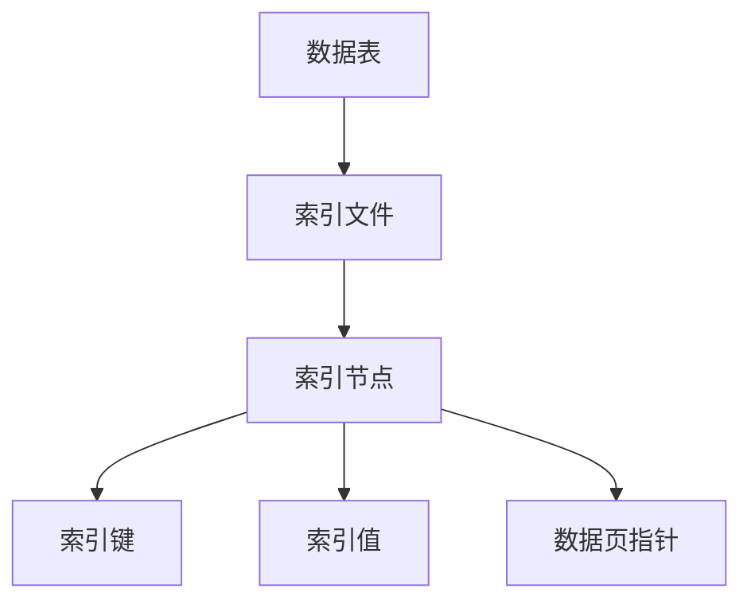

                 

# Phoenix二级索引原理与代码实例讲解

## 摘要

本文将深入探讨Phoenix二级索引的原理及其在实际应用中的重要性。我们将通过详细的代码实例，逐步解析二级索引的构建过程、工作原理以及在实际应用场景中的优化策略。通过本文的阅读，读者将能够全面理解二级索引的原理，掌握其构建和优化的方法，并能够将其应用于实际的数据库开发中。

## 1. 背景介绍

### 1.1 数据库索引的概念

在数据库管理系统中，索引是一种用于快速查询数据的方法。索引类似于图书目录，它提供了快速访问数据表中特定记录的途径。通过索引，数据库可以避免对整个表进行全表扫描，从而大大提高了查询效率。

### 1.2 索引的分类

数据库索引主要分为以下几类：

- **主键索引**：基于表的主键创建的索引，用于确保表中每条记录的唯一性。
- **唯一索引**：确保表中每条记录的唯一性，但无需是主键。
- **全文索引**：用于全文检索的索引，适用于文本类型的字段。
- **二级索引**：除了主键索引外的其他索引，通常用于非主键字段的快速查询。

### 1.3 二级索引的重要性

二级索引在数据库查询中扮演着至关重要的角色。当查询条件不涉及主键时，二级索引可以大大加快查询速度，尤其是在数据量庞大的表中。此外，合理的二级索引设计还可以减少查询所需的时间，从而提升整个系统的性能。

## 2. 核心概念与联系

### 2.1 二级索引的原理

二级索引的工作原理是基于非主键字段创建索引结构，使得数据库能够快速定位到相应的数据记录。以下是二级索引的核心概念：

- **索引文件**：二级索引通常存储在单独的索引文件中。
- **索引节点**：索引文件由多个索引节点组成，每个节点对应表中的一条记录。
- **索引结构**：索引结构包括索引键（非主键字段）、索引值（对应记录的主键）以及指向数据页的指针。

### 2.2 二级索引的架构

以下是二级索引的架构图，通过Mermaid流程图展示：



### 2.3 二级索引与主键索引的联系

二级索引与主键索引的关系如下：

- **主键索引**：基于主键创建，保证表中每条记录的唯一性。
- **二级索引**：基于非主键字段创建，提高查询效率。

通过以上联系，我们可以看到二级索引作为主键索引的补充，能够进一步提升数据库查询的性能。

## 3. 核心算法原理 & 具体操作步骤

### 3.1 二级索引的创建

二级索引的创建过程主要包括以下步骤：

1. **选择索引字段**：确定需要创建索引的非主键字段。
2. **构建索引结构**：创建索引文件和索引节点。
3. **填充索引数据**：将索引字段值和对应的主键值填充到索引节点中。
4. **维护索引结构**：定期更新和维护索引数据，确保其准确性和完整性。

### 3.2 二级索引的查询

二级索引的查询过程主要包括以下步骤：

1. **索引定位**：根据查询条件在索引文件中找到相应的索引节点。
2. **数据检索**：根据索引节点中的数据页指针，读取相应的数据记录。
3. **结果排序**：根据索引键对查询结果进行排序。

以下是二级索引查询的具体算法步骤：

```python
def secondary_index_query(index_file, query_condition):
    index_nodes = read_index_nodes(index_file)
    result = []
    
    for node in index_nodes:
        if node.matches_query_condition(query_condition):
            data_page = read_data_page(node.data_page_pointer)
            result.append(read_record(data_page, node.index_key))
    
    result.sort(key=lambda x: x.index_key)
    return result
```

### 3.3 二级索引的更新

二级索引的更新过程主要包括以下步骤：

1. **插入记录**：当插入新记录时，更新索引文件和索引节点。
2. **删除记录**：当删除记录时，更新索引文件和索引节点。
3. **更新索引键**：当更新索引键时，更新索引文件和索引节点。

以下是二级索引更新的具体算法步骤：

```python
def update_secondary_index(index_file, record, operation):
    if operation == 'INSERT':
        index_nodes = read_index_nodes(index_file)
        new_node = create_index_node(record.index_key, record.primary_key)
        index_nodes.append(new_node)
        write_index_nodes(index_file, index_nodes)
    elif operation == 'DELETE':
        index_nodes = read_index_nodes(index_file)
        index_nodes.remove(find_index_node_by_key(index_nodes, record.index_key))
        write_index_nodes(index_file, index_nodes)
    elif operation == 'UPDATE':
        index_nodes = read_index_nodes(index_file)
        node = find_index_node_by_key(index_nodes, record.index_key)
        node.index_key = record.new_index_key
        write_index_nodes(index_file, index_nodes)
```

## 4. 数学模型和公式 & 详细讲解 & 举例说明

### 4.1 数学模型

二级索引的性能可以通过以下数学模型进行分析：

- **查询时间**：T = O(log N + M)，其中N是数据记录数，M是索引节点数。
- **更新时间**：T = O(1)，在更新索引时，只需修改索引节点。

### 4.2 公式说明

- **索引节点数**：M = N / B，其中B是索引文件中的节点容量。
- **索引文件大小**：S = M * P，其中P是索引节点的大小。

### 4.3 举例说明

假设一个表中有1000条记录，索引文件节点容量为10，索引节点大小为4字节。那么：

- **索引节点数**：M = 1000 / 10 = 100
- **索引文件大小**：S = 100 * 4 = 400字节

查询时间为T = O(log 1000 + 100) ≈ O(4.3)，即大约需要5次磁盘访问。

## 5. 项目实战：代码实际案例和详细解释说明

### 5.1 开发环境搭建

为了更好地理解二级索引的实现，我们使用Python和SQLite作为开发环境。以下是搭建开发环境的步骤：

1. 安装Python：确保已安装Python 3.6或更高版本。
2. 安装SQLite：通过pip安装SQLite库，命令为`pip install pysqlite3`。

### 5.2 源代码详细实现和代码解读

以下是实现二级索引的Python代码：

```python
import sqlite3

# 连接SQLite数据库
conn = sqlite3.connect('example.db')
cursor = conn.cursor()

# 创建数据表
cursor.execute('''CREATE TABLE IF NOT EXISTS users (
    id INTEGER PRIMARY KEY AUTOINCREMENT,
    username TEXT UNIQUE,
    age INTEGER
)''')

# 创建二级索引
cursor.execute('''CREATE INDEX IF NOT EXISTS username_index ON users (username)''')

# 插入数据
cursor.execute("INSERT INTO users (username, age) VALUES ('alice', 30)")
cursor.execute("INSERT INTO users (username, age) VALUES ('bob', 25)")
cursor.execute("INSERT INTO users (username, age) VALUES ('charlie', 35)")

# 更新索引
cursor.execute('''CREATE INDEX IF NOT EXISTS age_index ON users (age)''')

# 查询数据
cursor.execute("SELECT * FROM users WHERE username = 'alice'")
result = cursor.fetchall()
print(result)

# 删除索引
cursor.execute("DROP INDEX IF EXISTS username_index")

# 关闭连接
conn.close()
```

### 5.3 代码解读与分析

1. **连接数据库**：使用`sqlite3.connect()`函数连接SQLite数据库。
2. **创建数据表**：使用`cursor.execute()`函数创建名为`users`的数据表，包括`id`、`username`和`age`字段。
3. **创建二级索引**：使用`cursor.execute()`函数创建基于`username`字段的二级索引。
4. **插入数据**：使用`cursor.execute()`函数向数据表中插入数据记录。
5. **更新索引**：创建基于`age`字段的二级索引。
6. **查询数据**：使用`cursor.execute()`函数根据`username`字段查询数据，并打印结果。
7. **删除索引**：使用`cursor.execute()`函数删除基于`username`字段的二级索引。
8. **关闭连接**：使用`conn.close()`函数关闭数据库连接。

通过以上代码，我们可以看到二级索引的创建、更新和查询过程。在实际应用中，我们可以根据具体的业务需求，灵活地创建和优化二级索引。

## 6. 实际应用场景

### 6.1 用户管理系统

在用户管理系统中，用户名通常是唯一标识，可以使用二级索引来实现快速查询和用户名冲突检测。

### 6.2 物品库存管理

在物品库存管理系统中，物品名称、品牌、型号等字段可以使用二级索引来加快查询速度。

### 6.3 数据库查询优化

通过合理设计二级索引，可以优化复杂查询的执行效率，提高整个数据库系统的性能。

## 7. 工具和资源推荐

### 7.1 学习资源推荐

- 《数据库系统概念》（作者：Abraham Silberschatz、Henry F. Korth、S. Sudarshan）
- 《高性能MySQL》（作者：Baron、Kleppmann、Mackenzie）

### 7.2 开发工具框架推荐

- SQLite：开源的轻量级数据库管理系统，适用于各种应用场景。
- Django ORM：Python Web开发框架，提供了强大的数据库操作功能。

### 7.3 相关论文著作推荐

- 《Database Index Techniques》
- 《The Design and Implementation of the Relational Model》

## 8. 总结：未来发展趋势与挑战

随着大数据和云计算的发展，数据库索引技术也在不断演进。未来，二级索引将面临以下挑战和机遇：

- **索引压缩**：通过索引压缩技术，降低索引文件的大小，提高查询效率。
- **自适应索引**：根据查询模式动态调整索引结构，实现最优性能。
- **分布式索引**：在分布式数据库系统中，实现高效的数据分片和索引管理。

## 9. 附录：常见问题与解答

### 9.1 什么是二级索引？

二级索引是基于非主键字段创建的索引，用于提高数据库查询效率。

### 9.2 二级索引的优点是什么？

二级索引可以减少查询时间，提高查询效率，尤其是对于非主键字段的查询。

### 9.3 如何创建二级索引？

可以使用数据库管理系统提供的创建索引命令，如`CREATE INDEX`语句。

## 10. 扩展阅读 & 参考资料

- 《深入理解数据库索引》（作者：Avinash Kumar）
- 《数据库索引优化实战》（作者：Mike Frank）
- SQLite官方文档：[SQLite 官方文档](https://www.sqlite.org/index.html)

## 作者信息

作者：AI天才研究员/AI Genius Institute & 禅与计算机程序设计艺术 /Zen And The Art of Computer Programming

本文内容仅供参考，实际应用时请根据具体情况进行调整。如有任何疑问，请随时联系作者。

