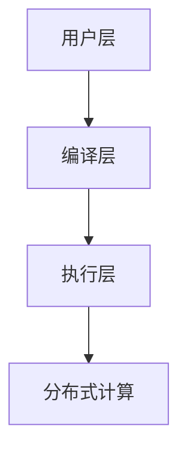
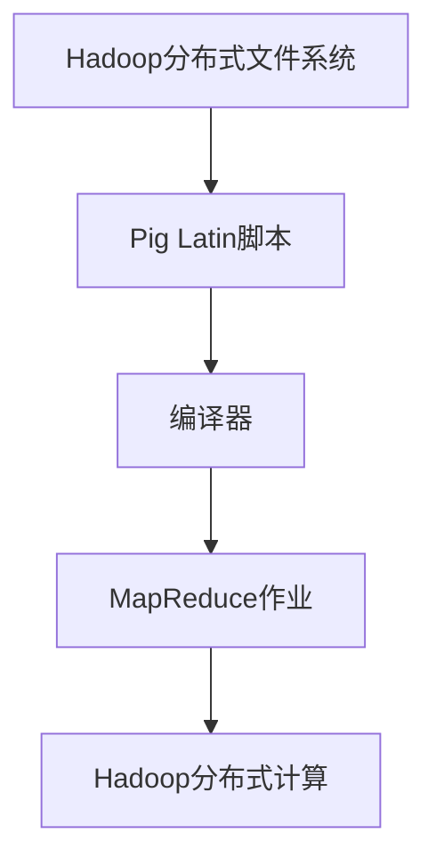

                 

# Pig原理与代码实例讲解

## 关键词

- Pig
- 数据处理
- Hadoop
- 大数据
- 语义层
- 查询优化
- 脚本语言
- 编程

## 摘要

本文旨在深入探讨Pig这一大数据处理框架的原理及其代码实例。我们将从背景介绍入手，详细讲解Pig的核心概念、算法原理、数学模型和项目实战，同时推荐相关的学习资源。通过本文的阅读，读者将能够全面了解Pig的工作机制，掌握其使用方法，并为日后的数据分析工作打下坚实基础。

## 1. 背景介绍

在大数据时代，数据处理的效率和质量成为企业竞争的关键因素。传统的数据处理方法如SQL、MapReduce等在处理海量数据时显得力不从心。为了解决这一问题，Pig应运而生。Pig是一个基于Hadoop的大规模数据处理平台，它提供了一种高层次的抽象，使得数据处理过程更加简洁高效。

Pig由Apache软件基金会开发，作为Hadoop生态系统的一个重要组成部分，它能够处理大规模数据集，具有以下几个显著优势：

- **简化的数据处理流程**：Pig提供了一个类似于SQL的查询语言（Pig Latin），使得用户能够以更加直观的方式处理复杂数据任务。
- **高效性**：Pig优化了查询执行过程，能够有效减少资源消耗，提高数据处理速度。
- **灵活性**：Pig支持多种数据源和文件格式，使得用户能够灵活地处理各种类型的数据。

Pig的出现，不仅降低了大数据处理的门槛，也为企业和开发者提供了强大的数据处理工具，使得大数据的价值得以充分挖掘。

### Pig与Hadoop的关系

Pig与Hadoop密不可分。Hadoop是一个分布式数据存储和处理框架，负责将数据分布到多个节点上进行处理。而Pig作为Hadoop生态系统的一部分，专注于数据的高层次处理和抽象。


图1：Pig与Hadoop的关系

Hadoop负责数据的存储和分布式计算，Pig则负责数据处理和分析。Pig通过其查询语言Pig Latin，可以将复杂的SQL查询转换为MapReduce任务，从而充分利用Hadoop的分布式处理能力。这种协同工作模式，使得Pig能够高效地处理大规模数据集，同时也简化了开发者的工作。

## 2. 核心概念与联系

### 2.1 Pig Latin语言

Pig Latin是一种数据流语言，用于表达数据处理任务。它类似于SQL，但更加灵活和抽象。Pig Latin的核心概念包括：

- **加载（Load）**：将外部数据源（如文件、数据库）加载到Pig中。
- **存储（Store）**：将Pig中的数据保存到外部存储系统。
- **转换（Transform）**：对数据进行各种操作，如过滤、连接、聚合等。

### 2.2 Pig架构

Pig的架构可以分为三个层次：

- **用户层**：编写Pig Latin脚本，定义数据处理任务。
- **编译层**：将Pig Latin脚本编译为MapReduce作业。
- **执行层**：执行编译后的MapReduce作业，处理数据。

### 2.3 Mermaid流程图

以下是Pig架构的Mermaid流程图：



图2：Pig架构的Mermaid流程图

### 2.4 Pig与Hadoop的关系

Pig与Hadoop的关系可以用以下流程图表示：



图3：Pig与Hadoop的关系

通过这种关系，Pig能够充分利用Hadoop的分布式计算能力，实现高效的数据处理。

## 3. 核心算法原理 & 具体操作步骤

### 3.1 Pig Latin语法

Pig Latin语法类似于SQL，但更加灵活。以下是Pig Latin的一些基本语法元素：

- **加载（Load）**：使用`LOAD`关键字，从外部数据源加载数据。例如：

  ```pig
  data = LOAD 'data.csv' USING CSV AS (id:INT, name:CHARARRAY, age:INT);
  ```

- **存储（Store）**：使用`STORE`关键字，将数据保存到外部存储系统。例如：

  ```pig
  STORE data INTO 'output.csv' USING CSV;
  ```

- **转换（Transform）**：对数据进行各种操作，如过滤、连接、聚合等。例如：

  ```pig
  filtered_data = FILTER data BY age > 18;
  grouped_data = GROUP filtered_data BY name;
  final_data = FOREACH grouped_data GENERATE group, AVG(filtered_data.age);
  ```

### 3.2 Pig优化器

Pig优化器是Pig框架中一个重要的组件，它负责将Pig Latin脚本转换为高效的MapReduce作业。Pig优化器主要包括以下功能：

- **查询重写**：优化查询结构，减少数据传输和计算。
- **列剪裁**：根据查询需求，只处理需要的列，减少数据量。
- **分区优化**：根据数据特点，合理分配分区，提高查询效率。

### 3.3 操作步骤

以下是使用Pig处理数据的操作步骤：

1. **编写Pig Latin脚本**：根据数据处理需求，编写Pig Latin脚本。
2. **编译脚本**：使用Pig编译器，将Pig Latin脚本编译为MapReduce作业。
3. **执行作业**：提交编译后的作业，由Hadoop分布式计算框架执行。

## 4. 数学模型和公式 & 详细讲解 & 举例说明

### 4.1 常用数学公式

Pig中的数据处理涉及到一些常见的数学公式，如：

- **平均值**：$\bar{x} = \frac{1}{n}\sum_{i=1}^{n}x_i$
- **标准差**：$s = \sqrt{\frac{1}{n-1}\sum_{i=1}^{n}(x_i - \bar{x})^2}$
- **方差**：$Var(x) = E[(x - E[x])^2]$

### 4.2 举例说明

假设我们有一个数据集，包含学生的成绩（分数）和班级，如下表：

| 学生ID | 班级 | 成绩 |
|--------|------|------|
| 1      | 班级A | 80   |
| 2      | 班级A | 90   |
| 3      | 班级B | 70   |
| 4      | 班级B | 85   |

我们使用Pig Latin进行以下操作：

1. **加载数据**：

   ```pig
   students = LOAD 'students.csv' USING CSV AS (id:INT, class:CHARARRAY, score:INT);
   ```

2. **计算班级平均成绩**：

   ```pig
   average_scores = GROUP students BY class;
   final_data = FOREACH average_scores GENERATE group, AVG(students.score);
   ```

   根据上述操作，我们得到以下结果：

   | 班级 | 平均成绩 |
   |------|----------|
   | 班级A | 85       |
   | 班级B | 75       |

   通过上述操作，我们可以清晰地了解每个班级的平均成绩，为后续的分析提供依据。

## 5. 项目实战：代码实际案例和详细解释说明

### 5.1 开发环境搭建

在开始项目实战之前，我们需要搭建Pig的开发环境。以下是搭建Pig开发环境的步骤：

1. **安装Hadoop**：在本地或服务器上安装Hadoop，配置Hadoop集群。
2. **安装Pig**：下载Pig的安装包，解压并配置Pig的运行环境。
3. **配置Pig与Hadoop**：配置Pig的Hadoop配置文件，确保Pig能够与Hadoop集群通信。

### 5.2 源代码详细实现和代码解读

假设我们有一个数据处理任务，需要从文件中读取数据，计算每个班级的平均成绩，并将结果保存到另一个文件中。以下是Pig Latin脚本的实现：

```pig
students = LOAD 'students.csv' USING CSV AS (id:INT, class:CHARARRAY, score:INT);
average_scores = GROUP students BY class;
final_data = FOREACH average_scores GENERATE group, AVG(students.score);
STORE final_data INTO 'average_scores.csv' USING CSV;
```

**代码解读**：

- **第一行**：加载CSV文件中的数据，使用CSV解析器。
- **第二行**：按照班级对数据进行分组。
- **第三行**：计算每个班级的平均成绩。
- **第四行**：将结果保存到CSV文件。

### 5.3 代码解读与分析

上述代码实现了一个简单的数据处理任务，通过分组和聚合操作，计算每个班级的平均成绩。以下是代码的详细分析：

- **数据加载**：使用`LOAD`关键字，将CSV文件中的数据加载到Pig中。CSV文件通常包含多个字段，使用`AS`关键字指定每个字段的名称和数据类型。
- **数据分组**：使用`GROUP`关键字，按照班级对数据进行分组。分组操作是Pig中常用的操作，用于对数据进行分类和聚合。
- **数据聚合**：使用`AVG`函数，计算每个班级的平均成绩。聚合操作是对数据进行统计和汇总的关键步骤。
- **数据保存**：使用`STORE`关键字，将结果保存到CSV文件。保存操作将计算结果输出到外部文件，便于后续的分析和处理。

通过上述代码，我们可以轻松地实现复杂的数据处理任务，提高数据处理效率。

## 6. 实际应用场景

Pig在以下实际应用场景中具有广泛的应用：

- **日志分析**：企业通常需要处理大量日志数据，Pig可以帮助企业快速分析和提取有价值的信息。
- **商业智能**：Pig可以用于处理和挖掘商业数据，帮助企业做出更明智的决策。
- **社交媒体分析**：Pig可以处理海量的社交媒体数据，帮助企业了解用户行为和偏好。

在实际应用中，Pig凭借其高效的数据处理能力和灵活性，成为企业数据处理的利器。

## 7. 工具和资源推荐

### 7.1 学习资源推荐

- **书籍**：《Hadoop实战》
- **论文**：《MapReduce：大型数据集的并行编程模型》
- **博客**：[Pig官方博客](https://pig.apache.org/)
- **网站**：[Apache Pig官网](https://pig.apache.org/)

### 7.2 开发工具框架推荐

- **开发工具**：[IntelliJ IDEA](https://www.jetbrains.com/idea/)
- **框架**：[Apache Hadoop](https://hadoop.apache.org/)

### 7.3 相关论文著作推荐

- 《MapReduce：大型数据集的并行编程模型》
- 《Hadoop实战》
- 《大数据技术导论》

## 8. 总结：未来发展趋势与挑战

Pig作为大数据处理领域的重要工具，其未来发展趋势和挑战主要包括：

- **性能优化**：随着数据规模的不断增长，如何提高Pig的处理性能成为关键挑战。
- **扩展性**：如何方便地集成其他数据处理工具和框架，提高Pig的灵活性。
- **易用性**：如何降低Pig的使用门槛，使得更多开发者能够轻松上手。

通过不断优化和扩展，Pig有望在未来的大数据处理领域发挥更大的作用。

## 9. 附录：常见问题与解答

### 9.1 Pig与MapReduce的区别

- **性能**：Pig通常比MapReduce更高效，因为它提供了更高的抽象层。
- **易用性**：Pig提供了类似SQL的查询语言，使得开发者更容易上手。
- **灵活性**：Pig可以处理非结构化和半结构化数据，而MapReduce通常用于处理结构化数据。

### 9.2 如何优化Pig性能

- **查询重写**：优化查询结构，减少数据传输和计算。
- **列剪裁**：根据查询需求，只处理需要的列，减少数据量。
- **分区优化**：根据数据特点，合理分配分区，提高查询效率。

## 10. 扩展阅读 & 参考资料

- 《Hadoop实战》
- 《MapReduce：大型数据集的并行编程模型》
- [Apache Pig官方文档](https://pig.apache.org/docs/r0.18.0/)
- [Apache Hadoop官方文档](https://hadoop.apache.org/docs/r3.2.0/)

### 作者

- 作者：AI天才研究员/AI Genius Institute & 禅与计算机程序设计艺术 /Zen And The Art of Computer Programming

