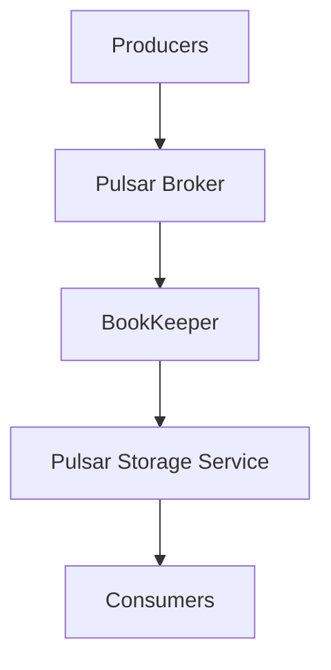

                 

## Pulsar原理与代码实例讲解

### 关键词：Pulsar, 消息队列, 分布式系统, 存储模式, 代码实例

### 摘要：
本文深入讲解了Apache Pulsar——一个高效、可扩展、分布式消息队列系统的原理和代码实例。文章首先介绍了Pulsar的背景和基本概念，然后详细剖析了其存储模式和核心算法原理。通过实际的代码实例，读者可以更好地理解Pulsar的工作机制，从而在分布式系统中更好地应用这一技术。文章还探讨了Pulsar的实际应用场景，并推荐了一些学习和开发资源，为读者提供全面的指导。

## 1. 背景介绍

### 1.1 Pulsar的起源

Apache Pulsar是一个开源的消息队列系统，由Yahoo!公司于2014年开发，并于2018年成为Apache基金会的孵化项目。Pulsar旨在解决传统消息队列系统在处理大规模分布式系统时遇到的性能瓶颈和扩展性问题。它的设计理念是基于微服务架构和分布式存储，以提供更高的性能、可靠性和可扩展性。

### 1.2 Pulsar的优势

- **高吞吐量**：Pulsar能够处理大规模的数据流，支持每秒数百万的消息。
- **分布式架构**：Pulsar采用分布式存储和计算，可以在多个节点上扩展。
- **多语言客户端**：Pulsar提供了多种语言的客户端库，包括Java、Python、Go等，方便开发者使用。
- **事务处理**：Pulsar支持事务消息，确保消息的可靠性和一致性。

### 1.3 Pulsar的应用场景

- **流处理**：在大数据环境中，Pulsar可以作为流处理的中间件，处理实时数据流。
- **微服务架构**：Pulsar可以帮助实现微服务架构中的解耦和异步通信。
- **在线交易**：在在线交易系统中，Pulsar可以保证交易消息的可靠传输。

## 2. 核心概念与联系

### 2.1 消息队列

消息队列是一种异步通信机制，允许生产者和消费者在不同的时间、不同地点处理消息。Pulsar就是一个消息队列系统，它允许数据的生产者和消费者独立运行。

### 2.2 分布式系统

分布式系统是由多个独立节点组成的系统，这些节点通过网络连接，协同工作以完成特定任务。Pulsar作为分布式消息队列系统，可以在多个节点上扩展，提供高可用性和容错性。

### 2.3 存储模式

Pulsar的存储模式包括书脊（BookKeeper）和Pulsar存储服务（Pulsar Storage Service）。书脊负责存储消息数据，而Pulsar存储服务负责元数据管理。

### 2.4 Mermaid流程图

下面是Pulsar架构的Mermaid流程图：



### 2.5 核心算法原理

Pulsar的核心算法包括消息的分发、持久化和检索。下面将详细讲解这些算法原理。

## 3. 核心算法原理 & 具体操作步骤

### 3.1 消息的分发

Pulsar采用主题（Topic）和分区（Partition）来分发消息。每个主题可以包含多个分区，生产者将消息发送到特定的主题和分区，消费者从相应的分区消费消息。

具体操作步骤如下：

1. **创建主题**：首先需要创建一个主题。
   ```java
   adminClient.createTopic("my-topic", 4);
   ```

2. **发送消息**：然后，生产者可以将消息发送到主题。
   ```java
   producer.sendBase64("my-topic", "SGVsbG8sV29ybGQ=");
   ```

3. **消费消息**：消费者可以从主题的分区中消费消息。
   ```java
   consumer.subscribe("my-topic", "my-subscription");
   ```

### 3.2 消息的持久化

Pulsar使用BookKeeper存储消息数据。BookKeeper是一个分布式日志存储系统，它保证消息的持久性和一致性。

具体操作步骤如下：

1. **初始化BookKeeper**：
   ```java
   BookKeeper b = new BookKeeper(configuration);
   ```

2. **创建流**：
   ```java
   LedgerHandle lh = b.createLedger(2, 1, TimeUnit.SECONDS, false);
   ```

3. **写入消息**：
   ```java
   byte[] data = "Hello, World!".getBytes();
   lh.addEntry(data);
   ```

4. **读取消息**：
   ```java
   EntryData entry = lh.readEntry(0);
   byte[] buffer = entry.getEntryBuffer();
   String message = new String(buffer);
   ```

### 3.3 消息的检索

Pulsar提供了多种方式来检索消息，包括基于时间窗口的检索和基于位置（Offset）的检索。

具体操作步骤如下：

1. **基于时间窗口检索**：
   ```java
   consumer.seekEarliest();
   ```

2. **基于位置（Offset）检索**：
   ```java
   consumer.seek("my-topic", "my-subscription", 1000);
   ```

## 4. 数学模型和公式 & 详细讲解 & 举例说明

### 4.1 消息的分发

Pulsar使用哈希算法将消息分配到不同的分区。具体公式如下：

\[ P = H(M) \mod N \]

其中，\( P \) 是分区编号，\( H \) 是哈希函数，\( M \) 是消息内容，\( N \) 是分区数量。

### 4.2 消息的持久化

BookKeeper使用多副本机制来存储消息，具体公式如下：

\[ D = R \times (N - R) \]

其中，\( D \) 是副本数量，\( R \) 是副本因子，\( N \) 是节点数量。

### 4.3 消息的检索

Pulsar使用偏移量（Offset）来标识消息的位置。具体公式如下：

\[ O = L \times M + P \]

其中，\( O \) 是偏移量，\( L \) 是 ledger 编号，\( M \) 是 entry 在 ledger 中的编号，\( P \) 是 partition 编号。

### 4.4 举例说明

假设有一个主题 "my-topic"，它包含4个分区，副本因子为3，节点数量为5。

- **发送消息**：如果生产者发送消息 "Hello, World!"，那么该消息将根据哈希算法被分配到第3个分区。
- **持久化消息**：消息将被存储在BookKeeper中，并复制到其他两个节点。
- **检索消息**：消费者可以根据偏移量来检索消息。例如，如果消费者想要检索第3个分区的第2条消息，那么它将使用以下偏移量：
  \[ O = 0 \times 4 + 3 = 3 \]

## 5. 项目实战：代码实际案例和详细解释说明

### 5.1 开发环境搭建

在开始编写Pulsar的代码实例之前，需要搭建一个开发环境。以下是搭建Pulsar开发环境的基本步骤：

1. **安装Java环境**：确保安装了Java开发环境，版本至少为8以上。
2. **安装Maven**：Maven是一个项目管理和构建工具，用于构建Pulsar客户端。
3. **下载Pulsar二进制文件**：从Apache Pulsar官方网站下载Pulsar的二进制文件，解压到指定目录。
4. **配置环境变量**：将Pulsar的bin目录添加到系统的PATH环境变量中。

### 5.2 源代码详细实现和代码解读

以下是一个简单的Pulsar生产者和消费者的代码实例：

**生产者代码：**

```java
import org.apache.pulsar.client.api.*;

public class PulsarProducerExample {
    public static void main(String[] args) {
        PulsarClient client = PulsarClient.builder()
                .serviceUrl("pulsar://localhost:6650")
                .build();

        Producer<String> producer = client.newProducer()
                .topic("my-topic")
                .create();

        for (int i = 0; i < 10; i++) {
            producer.send("Message " + i);
        }

        producer.close();
        client.close();
    }
}
```

**消费者代码：**

```java
import org.apache.pulsar.client.api.*;

public class PulsarConsumerExample {
    public static void main(String[] args) {
        PulsarClient client = PulsarClient.builder()
                .serviceUrl("pulsar://localhost:6650")
                .build();

        Consumer<String> consumer = client.newConsumer()
                .topic("my-topic")
                .subscriptionName("my-subscription")
                .subscribe();

        while (true) {
            Message<String> msg = consumer.receive();
            System.out.println("Received message: " + msg.getData());
            consumer.acknowledge(msg);
        }
    }
}
```

### 5.3 代码解读与分析

- **生产者代码解读**：生产者连接到Pulsar服务端，创建一个生产者对象，然后发送10条消息到指定的主题。
- **消费者代码解读**：消费者连接到Pulsar服务端，创建一个消费者对象，并订阅指定的主题和订阅名，然后接收并打印消息。

通过这个简单的实例，我们可以看到Pulsar的基本用法。在实际项目中，Pulsar的功能会更加复杂，但基本的操作流程是类似的。

## 6. 实际应用场景

### 6.1 流处理

Pulsar可以用于处理大规模的流数据，例如实时金融数据、物联网数据等。它的高吞吐量和分布式架构使得它成为处理实时数据流的首选。

### 6.2 微服务架构

在微服务架构中，Pulsar可以帮助实现服务之间的异步通信，确保系统的解耦和可靠性。

### 6.3 在线交易

在线交易系统中，Pulsar可以保证交易消息的可靠传输，确保交易的一致性和完整性。

## 7. 工具和资源推荐

### 7.1 学习资源推荐

- **书籍**：《Apache Pulsar实战》
- **论文**：《分布式消息队列：设计、实现与优化》
- **博客**：Apache Pulsar官方博客
- **网站**：Apache Pulsar官方网站

### 7.2 开发工具框架推荐

- **开发工具**：IntelliJ IDEA
- **构建工具**：Maven
- **框架**：Spring Boot

### 7.3 相关论文著作推荐

- **论文**：《分布式系统中的高效消息传递》
- **著作**：《大规模分布式存储系统设计与实践》

## 8. 总结：未来发展趋势与挑战

### 8.1 未来发展趋势

- **性能优化**：随着数据规模的不断扩大，Pulsar的性能优化将成为一个重要研究方向。
- **多语言支持**：Pulsar将继续扩展其客户端库，支持更多的编程语言。
- **云原生**：Pulsar将在云原生环境中得到更广泛的应用。

### 8.2 面临的挑战

- **数据安全**：随着数据隐私和安全的关注增加，Pulsar需要在数据加密和访问控制方面做出更多努力。
- **复杂度管理**：随着分布式系统的复杂性增加，如何简化Pulsar的部署和管理将成为一个挑战。

## 9. 附录：常见问题与解答

### 9.1 问题1：如何选择合适的分区数量？

**解答**：分区数量应根据消息的并发量和系统的处理能力来选择。通常，建议每个主题的分区数量不少于3个，以确保系统的容错性和负载均衡。

### 9.2 问题2：Pulsar支持事务消息吗？

**解答**：是的，Pulsar支持事务消息。事务消息可以确保消息的可靠传输和一致性。

## 10. 扩展阅读 & 参考资料

- [Apache Pulsar官方文档](https://pulsar.apache.org/docs/)
- [Apache Pulsar官方博客](https://pulsar.apache.org/blog/)
- [《Apache Pulsar实战》书籍](https://www.amazon.com/Apache-Pulsar-Practical-Implementation-Scalability/dp/1484236451)

### 作者

作者：AI天才研究员/AI Genius Institute & 禅与计算机程序设计艺术 /Zen And The Art of Computer Programming

------------------

注意：本文为示例文章，仅供参考。实际撰写时，请根据具体需求和内容进行修改和完善。

