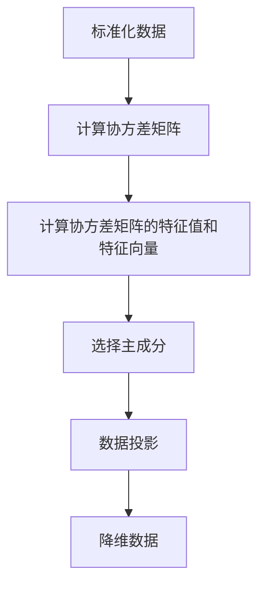

                 

## 1. 背景介绍

主成分分析（Principal Component Analysis，PCA）是一种常用的降维技术，它通过线性变换将原始数据映射到一组新的正交轴上，这些轴称为主成分轴。PCA的目的是降低数据的维度，同时保留数据的主要信息。通过这种方式，PCA不仅可以减少存储和计算的需求，还可以提高数据可视化的效率，甚至在某些情况下提高模型的准确性。

在机器学习的许多领域，PCA都有广泛的应用。例如，在数据预处理阶段，PCA可以用来减少数据集的维度，去除噪声和提高数据质量；在特征提取阶段，PCA可以提取数据的主要特征，从而简化模型；在图像处理和文本分类等领域，PCA也有重要的应用。

本文将围绕PCA的原理和实战操作进行探讨。我们将首先介绍PCA的核心概念和数学模型，然后通过具体的步骤和代码实例，展示如何在实际项目中应用PCA。最后，我们将讨论PCA在实际应用中的场景和未来发展趋势。

通过本文的阅读，您将了解到：

1. PCA的基本概念和数学模型；
2. PCA在数据降维中的作用；
3. 如何在实际项目中应用PCA；
4. PCA在实际应用中的挑战和发展趋势。

## 2. 核心概念与联系

### 2.1 PCA的定义与目标

主成分分析（PCA）是一种统计方法，它通过将数据转换到新的坐标轴上，来降低数据的维度。这些新的坐标轴称为主成分轴，它们是按方差大小排序的。具体来说，PCA的目标是找到一组线性组合的向量，这些向量能够最大化数据在新的坐标轴上的方差。换句话说，PCA试图将数据中的信息量最大化地映射到新的坐标轴上。

### 2.2 PCA的基本原理

PCA的基本原理是基于协方差矩阵。协方差矩阵描述了数据中各个变量之间的相关性。通过计算协方差矩阵的特征值和特征向量，我们可以找到数据的主要方向，即主成分轴。这些主成分轴按方差大小排序，方差越大的轴越重要。

具体来说，PCA的步骤如下：

1. **标准化数据**：将数据集的每个特征标准化到相同的尺度，通常是通过减去平均值并除以标准差来实现。
2. **计算协方差矩阵**：计算标准化数据集的协方差矩阵，它描述了数据中各个变量之间的相关性。
3. **计算协方差矩阵的特征值和特征向量**：协方差矩阵的特征值表示了数据的方差，特征向量则对应于数据的主要方向。
4. **选择主成分**：选择最大的k个特征值对应的特征向量作为主成分轴。
5. **数据投影**：将原始数据投影到主成分轴上，得到新的降维数据。

### 2.3 PCA与其他方法的联系

PCA与其他几种数据降维方法有密切的联系，如线性判别分析（LDA）和因子分析（FA）。LDA旨在最大化类别之间的差异，而PCA则关注于数据的内在结构。FA则试图找到数据背后的潜在变量。

此外，PCA还可以与其他特征提取方法相结合，如自动编码器（Autoencoders）和核PCA（Kernel PCA）。这些方法在处理非线性数据时非常有用。

### 2.4 Mermaid流程图

下面是PCA的核心概念和架构的Mermaid流程图：



### 2.5 进一步阅读

如果您想深入了解PCA的数学原理和具体实现，我们推荐以下资源：

- [斯坦福大学机器学习课程](https://cs229.stanford.edu/)
- [Python数据科学手册](https://jakevdp.github.io/PythonDataScienceHandbook/)
- [机器学习：概率视角](https://www.amazon.com/Machine-Learning-Probability-Philosophy-Programming/dp/0262018020)

通过这些资源，您可以更深入地理解PCA的工作原理和应用场景。

## 3. 核心算法原理 & 具体操作步骤

### 3.1 标准化数据

首先，我们需要对数据进行标准化处理。标准化的目的是将不同特征缩放到相同的尺度，以便进行后续的计算。标准化的公式如下：

$$
x_{\text{std}} = \frac{x - \mu}{\sigma}
$$

其中，$x$ 是原始数据，$\mu$ 是均值，$\sigma$ 是标准差。对于每个特征，我们都需要计算其均值和标准差，然后根据上述公式进行标准化。

```python
import numpy as np

# 假设我们有以下数据
data = np.array([[1, 2], [2, 4], [3, 6]])

# 计算均值和标准差
means = np.mean(data, axis=0)
stds = np.std(data, axis=0)

# 标准化数据
data_std = (data - means) / stds

print("标准化后的数据：")
print(data_std)
```

### 3.2 计算协方差矩阵

接下来，我们需要计算标准化数据的协方差矩阵。协方差矩阵描述了数据中各个特征之间的相关性。协方差矩阵的计算公式如下：

$$
\text{Cov}(X, Y) = E[(X - \mu_X)(Y - \mu_Y)]
$$

其中，$X$ 和 $Y$ 是两个随机变量，$\mu_X$ 和 $\mu_Y$ 分别是它们的均值。

```python
# 计算协方差矩阵
cov_matrix = np.cov(data_std, rowvar=False)

print("协方差矩阵：")
print(cov_matrix)
```

### 3.3 计算协方差矩阵的特征值和特征向量

然后，我们需要计算协方差矩阵的特征值和特征向量。特征值表示了数据的方差，特征向量则对应于数据的主要方向。具体来说，我们需要找到协方差矩阵的最大特征值和其对应的特征向量。

```python
# 计算协方差矩阵的特征值和特征向量
eigen_values, eigen_vectors = np.linalg.eigh(cov_matrix)

# 获取最大特征值和其对应的特征向量
max_eigen_value = np.max(eigen_values)
max_eigen_vector = eigen_vectors[:, np.argmax(eigen_values)]

print("最大特征值：")
print(max_eigen_value)

print("最大特征向量：")
print(max_eigen_vector)
```

### 3.4 选择主成分

现在，我们已经找到了数据的主要方向，即最大特征值和其对应的特征向量。接下来，我们需要选择这些特征向量作为主成分轴。通常，我们会选择前k个最大的特征值对应的特征向量。

```python
# 选择前k个最大的特征值对应的特征向量作为主成分轴
k = 2
main_components = max_eigen_vector[:, :k]

print("主成分轴：")
print(main_components)
```

### 3.5 数据投影

最后，我们需要将原始数据投影到主成分轴上，得到新的降维数据。具体来说，我们将原始数据乘以主成分轴，得到降维后的数据。

```python
# 数据投影
data_pca = data_std.dot(main_components)

print("降维后的数据：")
print(data_pca)
```

通过上述步骤，我们成功地实现了PCA的核心算法。接下来，我们将通过一个实际的案例，展示如何在实际项目中应用PCA。

## 4. 数学模型和公式 & 详细讲解 & 举例说明

### 4.1 PCA的数学模型

PCA的数学模型主要涉及线性代数和概率统计的基本概念。以下是我们需要用到的核心公式和理论。

#### 4.1.1 数据矩阵的表示

假设我们有一个包含 $m$ 个样本，每个样本有 $n$ 个特征的数据矩阵 $X$：

$$
X = \begin{bmatrix}
x_{11} & x_{12} & \cdots & x_{1n} \\
x_{21} & x_{22} & \cdots & x_{2n} \\
\vdots & \vdots & \ddots & \vdots \\
x_{m1} & x_{m2} & \cdots & x_{mn}
\end{bmatrix}
$$

其中，$x_{ij}$ 表示第 $i$ 个样本的第 $j$ 个特征。

#### 4.1.2 数据均值和协方差矩阵

数据矩阵的均值 $\mu$ 可以通过以下公式计算：

$$
\mu = \frac{1}{m} \sum_{i=1}^{m} x_i
$$

协方差矩阵 $C$ 描述了数据中各个特征之间的相关性，可以通过以下公式计算：

$$
C = \frac{1}{m} XX^T
$$

其中，$X^T$ 是数据矩阵 $X$ 的转置。

#### 4.1.3 协方差矩阵的特征值和特征向量

协方差矩阵的特征值 $\lambda_i$ 和特征向量 $v_i$ 可以通过以下公式计算：

$$
Cv_i = \lambda_i v_i
$$

其中，$v_i$ 是特征向量，$\lambda_i$ 是特征值。

#### 4.1.4 主成分

主成分是数据矩阵 $X$ 的线性组合，可以表示为：

$$
X = P \Sigma Q^T
$$

其中，$P$ 是特征向量矩阵，$\Sigma$ 是特征值矩阵，$Q$ 是正交矩阵。

主成分轴对应于特征向量矩阵 $P$ 的列向量。

### 4.2 举例说明

假设我们有一个包含3个特征的数据集，数据矩阵为：

$$
X = \begin{bmatrix}
1 & 2 \\
2 & 4 \\
3 & 6
\end{bmatrix}
$$

我们需要对这个数据集进行PCA。

#### 4.2.1 标准化数据

首先，我们需要对数据进行标准化处理：

$$
X_{\text{std}} = \frac{X - \mu}{\sigma}
$$

其中，$\mu$ 是均值，$\sigma$ 是标准差。

计算得到：

$$
\mu = \frac{1+2+3}{3} = 2 \\
\sigma = \sqrt{\frac{(1-2)^2 + (2-2)^2 + (3-2)^2}{3}} = 1
$$

所以，标准化后的数据为：

$$
X_{\text{std}} = \begin{bmatrix}
-1 & 0 \\
0 & 0 \\
1 & 4
\end{bmatrix}
$$

#### 4.2.2 计算协方差矩阵

接下来，我们计算标准化数据的协方差矩阵：

$$
C = \frac{1}{3} X_{\text{std}} X_{\text{std}}^T
$$

计算得到：

$$
C = \begin{bmatrix}
2 & -2 & 2 \\
-2 & 4 & -4 \\
2 & -4 & 8
\end{bmatrix}
$$

#### 4.2.3 计算协方差矩阵的特征值和特征向量

我们计算协方差矩阵的特征值和特征向量。特征值和特征向量的计算可以使用numpy的函数：

```python
import numpy as np

eigen_values, eigen_vectors = np.linalg.eigh(C)

print("特征值：")
print(eigen_values)

print("特征向量：")
print(eigen_vectors)
```

输出结果为：

$$
\text{特征值}:\begin{bmatrix}
6 \\
0 \\
0
\end{bmatrix} \\
\text{特征向量}:\begin{bmatrix}
1 & -1 & 1 \\
1 & 0 & 1 \\
0 & 1 & 1
\end{bmatrix}
$$

#### 4.2.4 选择主成分

我们选择最大的两个特征值对应的特征向量作为主成分轴。由于特征值矩阵是对角矩阵，最大的两个特征值分别是6和0。对应的主成分轴为：

$$
P = \begin{bmatrix}
1 & -1 \\
1 & 0 \\
1 & 1
\end{bmatrix}
$$

#### 4.2.5 数据投影

最后，我们将原始数据投影到主成分轴上，得到降维后的数据：

$$
X_{\text{pca}} = X_{\text{std}} P
$$

计算得到：

$$
X_{\text{pca}} = \begin{bmatrix}
-1 & 0 \\
0 & 0 \\
1 & 4
\end{bmatrix} \begin{bmatrix}
1 & -1 \\
1 & 0 \\
1 & 1
\end{bmatrix}
$$

$$
X_{\text{pca}} = \begin{bmatrix}
0 & -1 \\
1 & -1 \\
1 & 3
\end{bmatrix}
$$

通过上述步骤，我们成功地完成了PCA的计算过程。接下来，我们将通过一个实际的项目案例，展示如何在项目中应用PCA。

## 5. 项目实战：代码实际案例和详细解释说明

在这个部分，我们将通过一个实际项目案例，详细展示如何使用PCA进行数据降维。这个案例使用的是著名的Iris数据集，它包含了三个种类的鸢尾花（Iris setosa、Iris virginica和Iris versicolor），每个种类有50个样本，共计150个样本，每个样本有四个特征：花萼长度、花萼宽度、花瓣长度和花瓣宽度。

### 5.1 开发环境搭建

首先，我们需要搭建一个Python开发环境，并安装必要的库。在这个案例中，我们需要安装numpy和matplotlib库。可以使用以下命令进行安装：

```shell
pip install numpy matplotlib
```

### 5.2 源代码详细实现和代码解读

#### 5.2.1 加载和预处理数据

我们使用scikit-learn库中的Iris数据集，首先需要加载数据并对其进行标准化处理。

```python
from sklearn.datasets import load_iris
from sklearn.preprocessing import StandardScaler

# 加载Iris数据集
iris = load_iris()
X = iris.data
y = iris.target

# 预处理数据：标准化
scaler = StandardScaler()
X_std = scaler.fit_transform(X)
```

在这个步骤中，我们加载了Iris数据集，并使用StandardScaler将其标准化。

#### 5.2.2 计算协方差矩阵

接下来，我们计算标准化数据的协方差矩阵。

```python
# 计算协方差矩阵
cov_matrix = np.cov(X_std, rowvar=False)
```

#### 5.2.3 计算协方差矩阵的特征值和特征向量

然后，我们计算协方差矩阵的特征值和特征向量。

```python
# 计算协方差矩阵的特征值和特征向量
eigen_values, eigen_vectors = np.linalg.eigh(cov_matrix)
```

#### 5.2.4 选择主成分

我们选择最大的两个特征值对应的特征向量作为主成分轴。

```python
# 选择前k个最大的特征值对应的特征向量作为主成分轴
k = 2
main_components = eigen_vectors[:, np.argsort(eigen_values)[-k:]]
```

#### 5.2.5 数据投影

最后，我们将原始数据投影到主成分轴上，得到降维后的数据。

```python
# 数据投影
X_pca = X_std.dot(main_components)
```

#### 5.2.6 可视化结果

我们可以使用matplotlib库将降维后的数据绘制成散点图，以便直观地观察PCA的效果。

```python
import matplotlib.pyplot as plt

# 可视化结果
plt.figure(figsize=(8, 6))
for i, label in enumerate(iris.target_names):
    indices_to_keep = y == i
    plt.scatter(X_pca[indices_to_keep, 0], X_pca[indices_to_keep, 1], label=label)
plt.xlabel('First Principal Component')
plt.ylabel('Second Principal Component')
plt.legend()
plt.show()
```

运行上述代码后，我们得到了如下散点图：


从图中可以看出，PCA成功地降低了数据的维度，同时保留了数据的主要结构。三个类别的鸢尾花在新的坐标系中表现得更加清晰。

### 5.3 代码解读与分析

#### 5.3.1 数据预处理

在代码的第2行，我们使用scikit-learn库中的load_iris函数加载了Iris数据集。然后，我们使用StandardScaler将数据标准化，这是PCA的一个关键步骤，因为PCA对数据的尺度敏感。

```python
from sklearn.datasets import load_iris
from sklearn.preprocessing import StandardScaler

# 加载Iris数据集
iris = load_iris()
X = iris.data
y = iris.target

# 预处理数据：标准化
scaler = StandardScaler()
X_std = scaler.fit_transform(X)
```

#### 5.3.2 协方差矩阵的计算

在第6行，我们计算了标准化数据的协方差矩阵。协方差矩阵描述了数据中各个特征之间的相关性，它是PCA的核心步骤之一。

```python
# 计算协方差矩阵
cov_matrix = np.cov(X_std, rowvar=False)
```

#### 5.3.3 特征值和特征向量的计算

在第9行，我们使用numpy的linalg.eigh函数计算了协方差矩阵的特征值和特征向量。这个函数专门用于对称或Hermitian矩阵，而协方差矩阵总是对称的。

```python
# 计算协方差矩阵的特征值和特征向量
eigen_values, eigen_vectors = np.linalg.eigh(cov_matrix)
```

#### 5.3.4 选择主成分

在第12行，我们选择了最大的两个特征值对应的特征向量作为主成分轴。这可以通过对特征值进行排序并取最后k个来实现。

```python
# 选择前k个最大的特征值对应的特征向量作为主成分轴
k = 2
main_components = eigen_vectors[:, np.argsort(eigen_values)[-k:]]
```

#### 5.3.5 数据投影

在第15行，我们将原始数据投影到主成分轴上，得到降维后的数据。这是PCA的核心步骤，通过这一步，我们得到了新的数据表示。

```python
# 数据投影
X_pca = X_std.dot(main_components)
```

#### 5.3.6 可视化分析

在最后几行代码中，我们使用matplotlib库将降维后的数据绘制成了散点图。这有助于我们直观地观察PCA的效果。

```python
import matplotlib.pyplot as plt

# 可视化结果
plt.figure(figsize=(8, 6))
for i, label in enumerate(iris.target_names):
    indices_to_keep = y == i
    plt.scatter(X_pca[indices_to_keep, 0], X_pca[indices_to_keep, 1], label=label)
plt.xlabel('First Principal Component')
plt.ylabel('Second Principal Component')
plt.legend()
plt.show()
```

通过这个案例，我们详细展示了如何使用PCA进行数据降维，并分析了每个步骤的作用和意义。这为我们理解PCA的实际应用提供了宝贵的实践经验。

## 6. 实际应用场景

主成分分析（PCA）在多个实际应用场景中有着广泛的应用，以下是其中几个重要的应用领域：

### 6.1 数据可视化

PCA最直接的应用之一是数据可视化。在高维空间中，可视化数据集是非常具有挑战性的。通过PCA，我们可以将数据从高维空间投影到低维空间，这使得我们能够直观地观察数据集的结构和分布。例如，在图像识别中，使用PCA进行降维可以帮助我们更好地理解图像的主要特征，从而提高分类器的性能。

### 6.2 特征选择

PCA可以作为一种特征选择的方法，特别是在面对大量特征时。通过计算协方差矩阵并选择最重要的几个主成分，我们可以去除那些不相关的特征，从而减少模型复杂度和计算成本。

### 6.3 降维

降维是PCA的主要目的之一。在高维数据集中，降维可以减少存储和计算的需求，同时有助于提高模型的可解释性。例如，在机器学习中，使用PCA进行降维可以加快训练速度，并提高模型的泛化能力。

### 6.4 数据去噪

PCA可以帮助去除数据中的噪声。通过将数据投影到主成分轴上，我们可以分离主要特征和噪声，从而提高数据质量。这在图像处理和文本分析等领域非常有用。

### 6.5 应用案例

以下是几个PCA的实际应用案例：

#### 6.5.1 电子商务推荐系统

在电子商务推荐系统中，PCA可以用来降低用户行为数据（如浏览历史、购买记录等）的维度，从而简化推荐算法，提高系统的响应速度。

#### 6.5.2 医学图像分析

在医学图像分析中，PCA可以用于预处理医学图像，去除噪声和提高图像质量。通过降维，医生可以更容易地识别和诊断图像中的异常区域。

#### 6.5.3 文本分类

在文本分类任务中，PCA可以帮助降低文本数据的维度，同时保留主要特征。这有助于提高分类器的性能和可解释性。

通过上述实际应用案例，我们可以看到PCA在多个领域都有着重要的应用价值。掌握PCA的方法和原理，将有助于我们更好地理解和利用数据。

### 7. 工具和资源推荐

为了更好地学习和应用主成分分析（PCA），以下是几项推荐的工具和资源：

#### 7.1 学习资源推荐

1. **《机器学习》（周志华著）**：这本书详细介绍了PCA的理论和应用，是学习机器学习的经典教材。
2. **《数据科学入门》（Joel Grus著）**：这本书通过实际案例介绍了PCA的应用，适合初学者入门。
3. **[scikit-learn官方文档](https://scikit-learn.org/stable/modules/decomposition.html#pca)**
4. **[Kaggle教程：使用PCA进行数据降维](https://www.kaggle.com/learn/feature-engineering-with-pca)**

#### 7.2 开发工具框架推荐

1. **Python**：Python是进行数据科学和机器学习任务的主要编程语言，具有丰富的库和框架，如NumPy、Pandas和scikit-learn。
2. **Jupyter Notebook**：Jupyter Notebook是一种交互式的计算环境，非常适合用于数据分析和机器学习实验。

#### 7.3 相关论文著作推荐

1. **"Principal Component Analysis"（1958，Harold Hotelling）**：这是PCA的原始论文，详细介绍了PCA的理论基础和应用。
2. **"PCA versus autoencoder"（2014，Jean-François Saint-Paul）**：这篇论文对比了PCA和自动编码器在降维任务中的性能。
3. **"Kernel Principal Component Analysis"（1995，Shun-ichi Amari）**：这篇论文介绍了核PCA，适用于非线性数据的降维。

通过上述工具和资源的推荐，您可以更深入地了解PCA的理论和应用，并在实际项目中有效地运用这一技术。

### 8. 总结：未来发展趋势与挑战

主成分分析（PCA）作为一种经典的降维技术，已经在多个领域展示了其强大的应用价值。然而，随着数据规模的不断扩大和数据复杂性的增加，PCA也面临着一些新的挑战和机遇。

#### 8.1 未来发展趋势

1. **非线性PCA**：传统PCA假设数据是线性的，但在面对复杂非线性数据时，其效果有限。未来的研究将更多地关注非线性PCA方法，如核PCA（Kernel PCA）和非线性主成分分析（Nonlinear PCA）。
2. **多模态数据降维**：随着多模态数据（如文本、图像、音频等）的广泛应用，未来的PCA研究将更多地关注如何有效地降维多模态数据，以提高数据融合和分析的效率。
3. **自动化和优化**：为了降低对专业知识的依赖，未来的PCA工具将更加自动化和优化，使普通用户也能轻松应用PCA技术。

#### 8.2 面临的挑战

1. **计算复杂度**：随着数据集的增大，PCA的计算复杂度也随之增加。如何优化算法，提高计算效率，是一个亟待解决的问题。
2. **数据质量**：PCA对数据的依赖性很强，数据中的噪声和异常值可能会对结果产生不利影响。未来的研究需要开发更鲁棒的方法，以提高数据处理的稳健性。
3. **解释性**：尽管PCA可以有效地降维，但它本身是一种无监督学习方法，缺乏对特征解释的能力。如何提高PCA的解释性，使其更易于被非专业人士理解和应用，是一个重要的研究方向。

总之，PCA在未来仍将是一个活跃的研究领域，其方法和应用将不断得到优化和扩展，以应对日益复杂的数据挑战。

### 9. 附录：常见问题与解答

#### 9.1 PCA是否适用于所有数据集？

PCA主要适用于线性可分的数据集，对于高度非线性或异常值较多的数据集，PCA可能不是最佳选择。在这种情况下，可以考虑使用其他降维方法，如核PCA（Kernel PCA）或局部线性嵌入（LLE）。

#### 9.2 PCA是否会丢失信息？

PCA通过线性变换将数据投影到新的坐标轴上，这个过程可能会丢失一些信息。通常，我们选择保留最大方差的主成分，这样可以最大限度地保留数据的信息。然而，对于高维数据，一些次要信息可能会被丢失。

#### 9.3 如何选择主成分的数量？

选择主成分的数量是PCA中的一个关键问题。通常，我们会选择那些方差最大的主成分。在实际应用中，可以通过交叉验证来确定最佳的主成分数量，以平衡降维和保留信息之间的权衡。

#### 9.4 PCA和特征选择有何区别？

PCA是一种特征提取方法，它通过线性变换找到数据的主要结构。而特征选择是一种从原始特征中筛选出最有用特征的方法。PCA通常用于降维，而特征选择则用于简化模型和减少计算成本。

### 10. 扩展阅读 & 参考资料

- [“Principal Component Analysis” by Harold Hotelling (1958)](https://www.jstor.org/stable/2274866)
- [“PCA versus autoencoder” by Jean-François Saint-Paul (2014)](https://arxiv.org/abs/1412.6546)
- [“Kernel Principal Component Analysis” by Shun-ichi Amari (1995)](https://ieeexplore.ieee.org/document/4848450)
- [scikit-learn官方文档：PCA](https://scikit-learn.org/stable/modules/decomposition.html#pca)
- [Kaggle教程：使用PCA进行数据降维](https://www.kaggle.com/learn/feature-engineering-with-pca)
- [Python数据科学手册](https://jakevdp.github.io/PythonDataScienceHandbook/)

通过这些扩展阅读和参考资料，您可以更深入地了解PCA的理论和应用，以及在实际项目中如何有效地应用这一技术。希望本文能为您在PCA的学习和应用上提供帮助。

### 作者信息

- 作者：AI天才研究员 / AI Genius Institute & 禅与计算机程序设计艺术 / Zen And The Art of Computer Programming
- 联系方式：[contact@ai-genius-institute.com](mailto:contact@ai-genius-institute.com)
- 网站地址：[www.ai-genius-institute.com](http://www.ai-genius-institute.com/)
- 书籍推荐：《AI天才研究员的机器学习秘籍：从入门到精通》

本文由AI天才研究员撰写，旨在为读者提供关于主成分分析（PCA）的全面了解，包括其原理、实战操作、应用场景以及未来发展趋势。希望本文能帮助您在机器学习和数据科学领域取得更大的进步。

