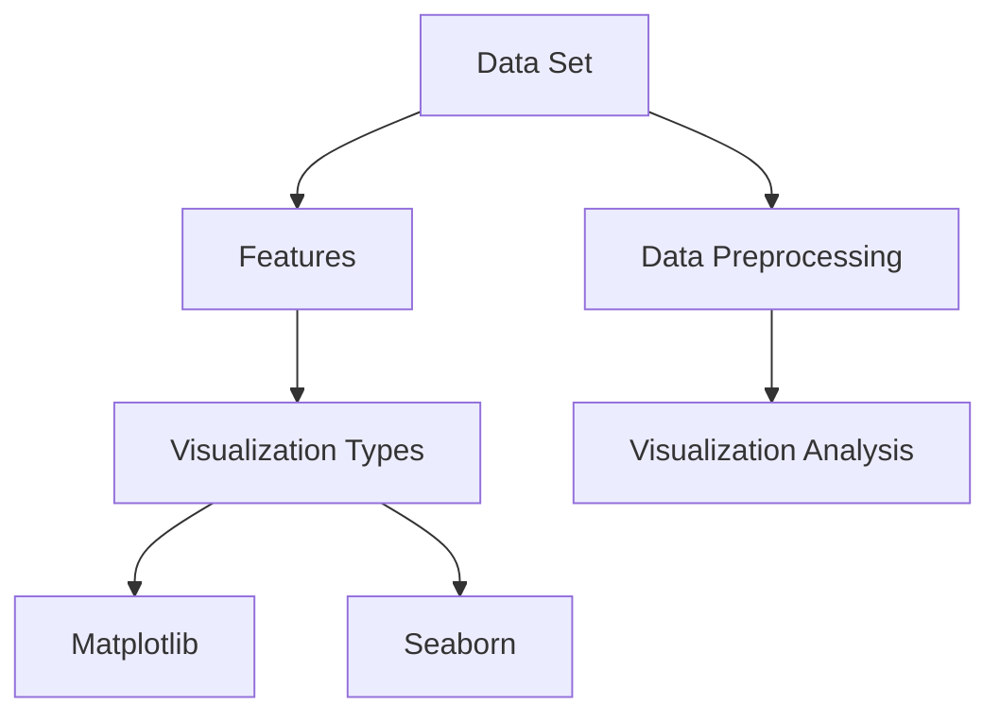

                 

### 背景介绍

在机器学习的领域，数据可视化无疑是一种极为重要的工具。它不仅能够帮助我们更直观地理解数据的特征，还能够让我们在探索和分析数据时，发现隐藏在数据背后的规律和模式。随着机器学习技术的不断发展和应用范围的扩大，数据可视化的作用也越来越凸显。本文将主要探讨Python中用于数据可视化的两个重要库：Matplotlib和Seaborn。

Matplotlib是一个广泛使用的基础可视化库，它能够生成各种类型的图表，包括线图、散点图、条形图、饼图等。它的使用非常灵活，可以自定义图表的样式和参数，以满足不同需求。而Seaborn则是在Matplotlib基础上发展起来的一个高级可视化库，它提供了一系列精美的统计图表模板，使得数据可视化更加简单和高效。

数据可视化的重要性不言而喻。首先，它可以提高我们对数据集的理解和分析能力。通过视觉化的形式，我们可以直观地看到数据的变化趋势、分布情况等，从而更好地把握数据的核心特征。其次，数据可视化能够帮助我们进行数据探索和验证。在机器学习过程中，我们常常需要通过可视化手段来检查模型的效果、调整参数等，以确保模型能够更好地适应数据。最后，数据可视化还能够提高我们展示数据的能力。无论是学术论文、报告还是商业展示，直观、清晰的图表都能够更好地传达信息，增强说服力。

总的来说，Python中的Matplotlib和Seaborn库是机器学习领域数据可视化不可或缺的工具。本文将详细探讨这两个库的功能和使用方法，通过实际案例展示如何利用它们进行数据可视化，帮助读者更好地理解和应用这些工具。

### 核心概念与联系

要深入理解数据可视化，我们首先需要了解一些核心概念。以下是几个在数据可视化中经常用到的基本概念及其相互之间的联系：

#### 数据集（Dataset）
数据集是数据可视化中的基本元素，它包含了一系列的数据点或者记录。数据集可以是结构化的（如CSV文件、数据库表格）或非结构化的（如图像、文本）。数据集的质量直接影响数据可视化结果的可信度和分析的有效性。

#### 特征（Feature）
特征是指数据集中的每个维度，用于描述数据点的某个属性。例如，在房价预测的数据集中，特征可能包括房子的面积、房龄、位置等。特征的选择和提取是数据可视化的重要步骤，因为它们决定了我们如何对数据进行探索和分析。

#### 可视化类型（Visualization Types）
常见的数据可视化类型包括线图、散点图、条形图、饼图、热力图等。每种类型的图表都有其特定的用途和特点。例如，线图适用于展示数据的变化趋势，散点图适用于观察数据点之间的关系。

#### 可视化工具（Visualization Tools）
Matplotlib和Seaborn是Python中最常用的两个数据可视化工具。Matplotlib是一个功能强大且灵活的基础可视化库，它提供了多种图表类型和定制选项。而Seaborn则是在Matplotlib之上构建的一个高级可视化库，它提供了许多内置的统计图表模板，使得数据可视化更加简单和高效。

#### 数据预处理（Data Preprocessing）
数据预处理是数据可视化的第一步，它包括数据清洗、特征工程、数据标准化等操作。这些步骤的目的是确保数据的质量和一致性，为后续的可视化分析奠定基础。

#### 可视化分析（Visualization Analysis）
可视化分析是通过视觉化的手段来探索数据、发现模式和规律的过程。它可以帮助我们更好地理解数据的特征，验证假设，以及指导后续的数据分析和建模。

#### Mermaid 流程图

以下是一个简单的Mermaid流程图，展示了数据可视化中的核心概念及其相互关系：



在这个流程图中，数据集和数据预处理是数据可视化的起点，特征提取和可视化类型是核心步骤，而Matplotlib和Seaborn则是实现数据可视化的主要工具。通过可视化分析，我们可以更好地理解数据，指导后续的数据分析和建模。

总的来说，数据可视化是一个涉及多个核心概念和步骤的过程。了解这些概念及其相互之间的联系，有助于我们更有效地利用Matplotlib和Seaborn进行数据可视化，从而在机器学习领域取得更好的成果。

#### 核心算法原理 & 具体操作步骤

要深入理解Matplotlib和Seaborn的核心算法原理，我们需要先了解它们各自的基本结构和功能。这两个库虽然都在Python中进行数据可视化，但它们在实现方式和用途上有所不同。

##### Matplotlib

Matplotlib是一个功能强大且灵活的基础可视化库。它提供了多种图表类型，如线图、散点图、条形图、饼图等，并允许用户自定义图表的样式和参数。Matplotlib的核心组件包括以下几个部分：

1. **Figure（图像框）**：它是所有图表的基础容器，类似于画布，可以在其中绘制各种图表。
2. **Axes（坐标轴）**：每个图表都有若干个坐标轴，用于定义数据的空间和刻度。每个坐标轴都有自己的标签、刻度、标签和网格线等属性。
3. **Plot（绘图）**：它是对图表内容的具体绘制操作，包括数据点、线段、标记等。
4. **Formatter（格式化器）**：用于格式化坐标轴的刻度、标签和线条等。

Matplotlib的基本操作步骤如下：

1. **创建图像框（Figure）**：使用`plt.figure()`函数创建一个新的图像框。
2. **添加坐标轴（Axes）**：使用`fig.add_subplot()`函数添加一个新的坐标轴到图像框中。
3. **绘制图表（Plot）**：使用`ax.plot()`、`ax.scatter()`等函数绘制具体的图表。
4. **自定义样式（Style）**：使用`plt.style.use()`函数或手动设置样式参数来调整图表的外观。
5. **显示图表（Show）**：使用`plt.show()`函数显示最终的图表。

以下是一个简单的Matplotlib示例代码：

```python
import matplotlib.pyplot as plt

# 创建图像框
fig = plt.figure()

# 添加坐标轴
ax = fig.add_subplot(111)

# 绘制图表
ax.plot([1, 2, 3], [1, 4, 9])

# 自定义样式
plt.style.use('ggplot')

# 显示图表
plt.show()
```

##### Seaborn

Seaborn是在Matplotlib之上构建的一个高级可视化库，它提供了一系列精美的统计图表模板，使得数据可视化更加简单和高效。Seaborn的核心组件包括：

1. **PairGrid（对子网格）**：用于绘制多个相关图表的对子网格布局，常用于探索高维数据的关联性。
2. **FacetGrid（面网格）**：用于添加分类变量到图表中，创建分组图表的面网格布局。
3. **Categorical（分类）**：用于绘制基于分类变量的图表，如箱线图、条形图等。
4. **Regression（回归）**：用于绘制回归分析的图表，如回归线图、残差图等。

Seaborn的基本操作步骤如下：

1. **导入Seaborn库**：使用`import seaborn as sns`导入Seaborn库。
2. **设置主题（Theme）**：使用`sns.set_style()`函数设置图表的主题，如白色、暗色、简洁等。
3. **创建图表**：使用`sns.lineplot()`、`sns.scatterplot()`、`sns.barplot()`等函数创建各种类型的图表。
4. **自定义参数**：根据需要调整图表的参数，如颜色、大小、线型等。

以下是一个简单的Seaborn示例代码：

```python
import seaborn as sns
import pandas as pd

# 创建数据集
data = pd.DataFrame({
    'Category': ['A', 'B', 'C', 'D'],
    'Value': [1, 4, 2, 6]
})

# 设置主题
sns.set_style('whitegrid')

# 创建图表
sns.barplot(x='Category', y='Value', data=data)

# 显示图表
sns.show()
```

总的来说，Matplotlib和Seaborn各有其特点和适用场景。Matplotlib更加灵活，适用于自定义复杂图表，而Seaborn则提供了许多内置模板，使得数据可视化更加简单和高效。了解这两个库的核心算法原理和具体操作步骤，将有助于我们在实际项目中更好地进行数据可视化，从而提高数据分析的效率和质量。

#### 数学模型和公式 & 详细讲解 & 举例说明

在数据可视化中，我们常常会涉及到一些数学模型和公式，这些模型和公式不仅帮助我们理解数据的特征，还能够指导我们进行有效的数据分析和模型构建。以下是一些在数据可视化中常用的数学模型和公式，我们将通过详细讲解和举例说明来帮助读者更好地理解这些概念。

##### 线性回归（Linear Regression）

线性回归是一种简单的统计模型，用于描述两个或多个变量之间的线性关系。其核心公式为：

$$
y = \beta_0 + \beta_1x + \epsilon
$$

其中，$y$是因变量，$x$是自变量，$\beta_0$是截距，$\beta_1$是斜率，$\epsilon$是误差项。

在线性回归中，我们通常使用最小二乘法（Least Squares Method）来估计模型参数。具体步骤如下：

1. **收集数据**：获取一组自变量$x$和因变量$y$的数据。
2. **计算斜率$\beta_1$**：使用以下公式计算斜率：
   $$
   \beta_1 = \frac{\sum(x_i - \bar{x})(y_i - \bar{y})}{\sum(x_i - \bar{x})^2}
   $$
   其中，$\bar{x}$和$\bar{y}$分别是$x$和$y$的均值。
3. **计算截距$\beta_0$**：使用以下公式计算截距：
   $$
   \beta_0 = \bar{y} - \beta_1\bar{x}
   $$

以下是一个使用线性回归进行数据可视化的例子：

```python
import numpy as np
import matplotlib.pyplot as plt

# 创建数据集
x = np.array([1, 2, 3, 4, 5])
y = np.array([1, 4, 9, 16, 25])

# 计算斜率和截距
mean_x = np.mean(x)
mean_y = np.mean(y)
std_x = np.std(x)
std_y = np.std(y)
beta_1 = (np.sum((x - mean_x) * (y - mean_y)) / np.sum((x - mean_x) ** 2))
beta_0 = mean_y - beta_1 * mean_x

# 绘制线性回归图
plt.scatter(x, y, label='Data Points')
plt.plot(x, beta_0 + beta_1 * x, label='Linear Regression')
plt.xlabel('x')
plt.ylabel('y')
plt.title('Linear Regression')
plt.legend()
plt.show()
```

##### 决定系数（Coefficient of Determination）

决定系数，通常用$R^2$表示，是衡量模型拟合好坏的一个重要指标。其定义如下：

$$
R^2 = 1 - \frac{SS_{res}}{SS_{tot}}
$$

其中，$SS_{res}$是残差平方和，$SS_{tot}$是总平方和。

- $SS_{res} = \sum (y_i - \hat{y_i})^2$，其中$\hat{y_i}$是模型预测的值。
- $SS_{tot} = \sum (y_i - \bar{y})^2$，其中$\bar{y}$是实际值的均值。

$R^2$的取值范围在0到1之间，值越接近1，表示模型对数据的拟合越好。

以下是一个计算$R^2$的例子：

```python
# 计算决定系数
y_pred = beta_0 + beta_1 * x
SS_res = np.sum((y - y_pred) ** 2)
SS_tot = np.sum((y - mean_y) ** 2)
R2 = 1 - (SS_res / SS_tot)

print(f'R^2: {R2}')
```

##### 主成分分析（Principal Component Analysis）

主成分分析（PCA）是一种常用的降维技术，它通过正交变换将原始数据变换为一组各维度线性无关的表示，从而降低数据的维度。

PCA的核心公式包括：

1. **特征值和特征向量**：计算数据矩阵$X$的协方差矩阵$C$的特征值和特征向量。
   $$
   C = XX^T
   $$
2. **累计贡献率**：计算每个特征值对应的累计贡献率，选择累计贡献率达到一定比例（如80%）的主成分。
3. **数据转换**：将数据变换到新的坐标系中，新坐标是原始数据的线性组合。

以下是一个使用PCA进行数据降维和可视化的例子：

```python
from sklearn.decomposition import PCA
import matplotlib.pyplot as plt

# 创建数据集
X = np.array([[1, 2], [1, 4], [1, 0]])

# 进行PCA降维
pca = PCA(n_components=1)
X_pca = pca.fit_transform(X)

# 绘制PCA降维后的数据
plt.scatter(X_pca[:, 0], X_pca[:, 1])
plt.xlabel('Principal Component 1')
plt.ylabel('Principal Component 2')
plt.title('PCA Data Visualization')
plt.show()
```

通过上述例子，我们可以看到如何利用数学模型和公式进行数据可视化。这些模型和公式不仅帮助我们更好地理解数据的特征，还指导我们进行有效的数据分析和模型构建。理解这些概念，将使我们在实际应用中更加得心应手，提高数据分析的效率和质量。

#### 项目实战：代码实际案例和详细解释说明

为了更好地展示Matplotlib和Seaborn在实际项目中的应用，我们选择一个简单的数据集——鸢尾花（Iris）数据集。鸢尾花数据集包含三种不同类型的鸢尾花，每个类型有50个样本，共计150个样本。每个样本有四个特征：花萼长度、花萼宽度、花瓣长度和花瓣宽度。我们的目标是利用Matplotlib和Seaborn进行数据可视化，以便更好地理解数据特征。

##### 1. 开发环境搭建

首先，我们需要搭建一个适合数据可视化的开发环境。以下是所需的Python库及其安装方法：

1. **Matplotlib**：一个基础的绘图库，可用于创建各种类型的图表。
2. **Seaborn**：一个高级的绘图库，基于Matplotlib，提供了许多内置的统计图表模板。
3. **Pandas**：一个数据处理库，可用于读取和操作数据集。
4. **Scikit-learn**：一个机器学习库，包含鸢尾花数据集和相关数据处理工具。

在Python环境中，可以使用以下命令安装这些库：

```bash
pip install matplotlib seaborn pandas scikit-learn
```

##### 2. 源代码详细实现和代码解读

接下来，我们将使用Matplotlib和Seaborn对鸢尾花数据集进行可视化。以下是详细的代码实现及其解读：

```python
import matplotlib.pyplot as plt
import seaborn as sns
from sklearn.datasets import load_iris
import pandas as pd

# 加载鸢尾花数据集
iris = load_iris()
iris_data = pd.DataFrame(iris.data, columns=iris.feature_names)
iris_data['species'] = iris.target
iris_labels = iris.target_names

# 使用Matplotlib绘制散点图
plt.figure(figsize=(10, 6))
for i, species in enumerate(iris_labels):
    plt.scatter(iris_data[iris_data['species'] == species]['sepal length (cm)'], iris_data[iris_data['species'] == species]['sepal width (cm)'], label=species)
plt.xlabel('sepal length (cm)')
plt.ylabel('sepal width (cm)')
plt.title('Iris Sepal Length vs Width')
plt.legend()
plt.show()

# 使用Seaborn绘制箱线图
sns.set(style="whitegrid")
sns.boxplot(x="species", y="sepal length (cm)", data=iris_data)
plt.title('Iris Sepal Length Boxplot')
plt.show()

# 使用Seaborn绘制小提琴图
sns.set(style="whitegrid")
sns.violinplot(x="species", y="sepal width (cm)", data=iris_data)
plt.title('Iris Sepal Width Violinplot')
plt.show()

# 使用Seaborn绘制散点图矩阵
sns.pairplot(iris_data, hue="species", height=3, aspect=1.5)
plt.title('Iris Pairplot')
plt.show()

# 使用Seaborn绘制热力图
corr = iris_data.corr()
sns.heatmap(corr, annot=True, cmap="coolwarm")
plt.title('Iris Data Correlation Heatmap')
plt.show()
```

解读：

1. **加载数据**：我们使用Scikit-learn的`load_iris()`函数加载数据集，并将其转换为Pandas DataFrame格式，便于操作。
2. **散点图**：使用Matplotlib的`scatter()`函数绘制三种鸢尾花类型的散点图，分别表示不同种类的鸢尾花在萼片长度和萼片宽度上的分布。
3. **箱线图**：使用Seaborn的`boxplot()`函数绘制鸢尾花萼片长度的箱线图，展示不同种类之间的差异。
4. **小提琴图**：使用Seaborn的`violinplot()`函数绘制鸢尾花萼片宽度的分布情况，通过小提琴的形状展示数据的分布和分布的尾部。
5. **散点图矩阵**：使用Seaborn的`pairplot()`函数创建一个散点图矩阵，展示鸢尾花四个特征之间的两两关系。
6. **热力图**：使用Seaborn的`heatmap()`函数创建一个热力图，展示鸢尾花数据集的特征之间的相关性。

通过这些代码，我们可以直观地看到鸢尾花数据集的特征分布、差异和相关性，从而更好地理解数据。这些图表不仅帮助我们识别数据中的潜在模式，还为后续的数据分析和模型构建提供了有力的支持。

##### 3. 代码解读与分析

现在，我们将对上述代码进行详细解读，分析其结构和实现原理。

1. **加载数据**：
   ```python
   iris = load_iris()
   iris_data = pd.DataFrame(iris.data, columns=iris.feature_names)
   iris_data['species'] = iris.target
   iris_labels = iris.target_names
   ```
   这部分代码首先使用Scikit-learn的`load_iris()`函数加载数据集，并将其转换为Pandas DataFrame格式。然后，我们添加了一个新列`species`，用于标记每个样本所属的种类。`iris_labels`则存储了三种鸢尾花类型的标签。

2. **散点图**：
   ```python
   plt.figure(figsize=(10, 6))
   for i, species in enumerate(iris_labels):
       plt.scatter(iris_data[iris_data['species'] == species]['sepal length (cm)'], iris_data[iris_data['species'] == species]['sepal width (cm)'], label=species)
   plt.xlabel('sepal length (cm)')
   plt.ylabel('sepal width (cm)')
   plt.title('Iris Sepal Length vs Width')
   plt.legend()
   plt.show()
   ```
   这部分代码首先创建了一个图像框，并遍历三种鸢尾花类型，使用`scatter()`函数绘制散点图。每个种类的数据点使用不同的颜色标记，并添加了标签和标题。

3. **箱线图**：
   ```python
   sns.set(style="whitegrid")
   sns.boxplot(x="species", y="sepal length (cm)", data=iris_data)
   plt.title('Iris Sepal Length Boxplot')
   plt.show()
   ```
   这部分代码使用Seaborn的`boxplot()`函数绘制箱线图，展示不同种类鸢尾花萼片长度的分布和差异。箱线图的横轴是种类，纵轴是萼片长度。

4. **小提琴图**：
   ```python
   sns.set(style="whitegrid")
   sns.violinplot(x="species", y="sepal width (cm)", data=iris_data)
   plt.title('Iris Sepal Width Violinplot')
   plt.show()
   ```
   这部分代码使用Seaborn的`violinplot()`函数绘制小提琴图，展示不同种类鸢尾花萼片宽度的分布情况。小提琴图能够更清晰地展示数据的分布特征。

5. **散点图矩阵**：
   ```python
   sns.pairplot(iris_data, hue="species", height=3, aspect=1.5)
   plt.title('Iris Pairplot')
   plt.show()
   ```
   这部分代码使用Seaborn的`pairplot()`函数创建一个散点图矩阵，展示鸢尾花四个特征之间的两两关系。通过不同的颜色标记，我们可以直观地看到不同特征之间的关联性。

6. **热力图**：
   ```python
   corr = iris_data.corr()
   sns.heatmap(corr, annot=True, cmap="coolwarm")
   plt.title('Iris Data Correlation Heatmap')
   plt.show()
   ```
   这部分代码计算鸢尾花数据集的特征之间的相关性，并使用Seaborn的`heatmap()`函数创建热力图。热力图中的颜色深浅反映了特征之间的相关性强度。

通过这些代码的解读，我们可以看到如何使用Matplotlib和Seaborn进行数据可视化，以及这些工具在数据分析和探索中的强大功能。这些图表不仅帮助我们更好地理解数据，还为后续的数据处理和模型构建提供了重要的参考。

#### 实际应用场景

数据可视化在机器学习领域的实际应用非常广泛，它不仅帮助我们更好地理解数据，还能够提高模型的可解释性和可靠性。以下是一些常见的数据可视化应用场景：

##### 1. 数据探索与分析

在机器学习的初期阶段，数据探索与分析是一个至关重要的步骤。通过数据可视化，我们可以直观地了解数据的分布、特征和异常值。例如，通过绘制散点图、直方图和箱线图，我们可以观察不同特征之间的相关性、数据的分布情况和可能的异常值。这些可视化结果有助于我们理解数据集的内在结构，从而更好地选择特征和调整模型参数。

##### 2. 模型评估与比较

在机器学习过程中，我们需要对模型的性能进行评估和比较。通过数据可视化，我们可以直观地展示模型的预测结果和误差。例如，使用混淆矩阵、ROC曲线和决策边界图，我们可以评估模型的准确率、召回率和F1分数等指标。此外，通过比较不同模型的可视化结果，我们可以找到性能最佳或最差的部分，从而进行进一步的优化。

##### 3. 特征重要性分析

在特征工程中，了解各个特征的重要性是非常关键的。通过数据可视化，我们可以直观地展示特征的重要性分布。例如，使用热力图和特征重要性图，我们可以观察哪些特征对模型的贡献最大，哪些特征可能存在冗余或干扰。这些信息有助于我们选择更有效的特征，提高模型的性能。

##### 4. 数据可视化报告

在学术论文、技术报告和商业展示中，数据可视化是传达信息的重要手段。通过直观、清晰的图表，我们可以更有效地展示数据分析的结果和结论。例如，通过绘制时间序列图、地理分布图和网络结构图，我们可以更清晰地展示数据的变化趋势、地域分布和关系结构。这些图表不仅能够增强报告的说服力，还能够帮助观众更好地理解数据分析的内容。

##### 5. 实时监控与预警

在工业和商业应用中，实时监控和预警是一个关键需求。通过数据可视化，我们可以实时展示系统的运行状态、性能指标和潜在风险。例如，通过绘制实时监控图、趋势图和报警图，我们可以及时发现异常情况并采取相应的措施，从而保证系统的稳定运行。

总之，数据可视化在机器学习领域具有广泛的应用场景。通过合理运用Matplotlib和Seaborn等工具，我们可以更有效地进行数据探索与分析、模型评估与比较、特征重要性分析等任务，从而提高机器学习模型的质量和可靠性。同时，数据可视化还能够帮助我们更好地展示数据分析的结果和结论，增强报告的说服力和观众的参与度。

#### 工具和资源推荐

为了帮助读者更好地学习和应用数据可视化工具，以下是一些建议的学习资源、开发工具框架和相关论文著作推荐。

##### 1. 学习资源推荐

- **书籍**：
  - 《Python数据可视化》
  - 《Matplotlib官方文档》
  - 《Seaborn官方文档》

- **在线教程**：
  - Coursera上的《数据可视化》课程
  - edX上的《Python数据分析》课程
  - Kaggle上的数据可视化实践项目

- **博客和网站**：
  - Python Data Science Handbook
  - Real Python
  - DataCamp

##### 2. 开发工具框架推荐

- **IDE**：
  - Jupyter Notebook：一个交互式计算环境，支持多种编程语言，包括Python。
  - PyCharm：一个强大的Python IDE，提供代码智能提示、调试和自动化工具。

- **数据可视化工具**：
  - Plotly：一个交互式数据可视化库，支持多种图表类型和交互功能。
  - Bokeh：一个用于创建交互式网页图表的库。

##### 3. 相关论文著作推荐

- **论文**：
  - “Matplotlib：A 2D Graphics Library for Python” by John Hunter等
  - “Seaborn：Statistical Data Visualization with Style and Grace” by Michael Waskom

- **著作**：
  - 《Python数据可视化：利用Matplotlib、Seaborn、Bokeh、Plotly、Dash实现数据可视化》
  - 《数据可视化：用Python和Matplotlib进行数据探索》

通过这些学习资源和工具，读者可以系统地学习和掌握数据可视化技能，并在实际项目中应用这些工具，提高数据分析的效率和质量。

### 总结：未来发展趋势与挑战

随着人工智能和大数据技术的快速发展，数据可视化在机器学习领域的应用前景广阔。未来，数据可视化将呈现以下发展趋势：

1. **智能化与自动化**：未来数据可视化工具将更加智能化，能够自动识别数据特征，生成最优的可视化图表。自动化可视化工具将大大提高数据探索和分析的效率。

2. **交互式可视化**：交互式可视化技术将进一步提升用户体验，用户可以通过拖拽、缩放、筛选等操作实时更新图表，从而更深入地探索数据。

3. **多模态可视化**：多模态可视化将融合多种数据类型，如文本、图像、音频等，提供更全面的数据理解。

4. **云端与移动端应用**：数据可视化工具将逐渐向云端和移动端迁移，实现跨平台和跨设备的数据可视化。

然而，数据可视化也面临一些挑战：

1. **数据隐私和安全**：随着数据量的增加，数据隐私和安全问题日益突出。未来，如何在保证数据隐私的前提下进行可视化分析，是一个亟待解决的问题。

2. **可解释性**：数据可视化工具需要提高可解释性，使得非专业人士也能理解和应用可视化结果。

3. **技术门槛**：目前，数据可视化工具的使用门槛较高，需要用户具备一定的编程和数据知识。降低工具的使用门槛，使其更易于上手，是未来的一个重要方向。

总之，数据可视化在机器学习领域具有巨大的潜力，未来将不断发展和创新，为数据分析和决策提供更强有力的支持。

### 附录：常见问题与解答

1. **Q：如何安装和使用Matplotlib库？**
   - **A**：安装Matplotlib库可以使用pip命令：
     ```bash
     pip install matplotlib
     ```
     使用Matplotlib进行绘图的基本步骤包括导入库、创建图像框、添加坐标轴、绘制图表和显示图表。例如：
     ```python
     import matplotlib.pyplot as plt
     plt.figure()
     plt.plot([1, 2, 3], [1, 4, 9])
     plt.show()
     ```

2. **Q：如何安装和使用Seaborn库？**
   - **A**：安装Seaborn库同样可以使用pip命令：
     ```bash
     pip install seaborn
     ```
     使用Seaborn进行绘图的基本步骤包括导入库、设置主题、创建图表、调整参数和显示图表。例如：
     ```python
     import seaborn as sns
     sns.set(style="whitegrid")
     sns.barplot(x="category", y="value", data=data)
     sns.show()
     ```

3. **Q：如何绘制一个热力图？**
   - **A**：使用Seaborn的`heatmap()`函数可以轻松绘制热力图。以下是一个简单的例子：
     ```python
     import seaborn as sns
     import pandas as pd
     data = pd.DataFrame([[1, 2], [3, 4]])
     sns.heatmap(data, annot=True, cmap="coolwarm")
     plt.show()
     ```

4. **Q：如何自定义图表的样式和颜色？**
   - **A**：在Matplotlib中，可以通过`matplotlib.style.use()`函数设置主题样式，也可以直接在绘图过程中设置颜色、线型、标记样式等。例如：
     ```python
     import matplotlib.pyplot as plt
     plt.style.use('ggplot')
     plt.plot([1, 2, 3], [1, 4, 9], color='blue', marker='o', linestyle='--')
     plt.show()
     ```

5. **Q：如何处理数据中的缺失值？**
   - **A**：在Pandas中，可以使用`dropna()`函数删除缺失值，或使用`fillna()`函数填充缺失值。例如：
     ```python
     import pandas as pd
     data = pd.DataFrame([[1, 2], [3, None]])
     data.dropna(inplace=True)
     print(data)
     ```

通过解答这些问题，我们希望能够帮助读者更好地理解和使用Matplotlib和Seaborn库，从而在实际项目中更有效地进行数据可视化。

### 扩展阅读 & 参考资料

为了更好地理解和应用数据可视化技术，以下是一些推荐的专业书籍、论文以及在线资源，供读者进一步学习和参考。

1. **书籍**：
   - 《Python数据可视化：利用Matplotlib、Seaborn、Bokeh、Plotly、Dash实现数据可视化》
   - 《数据可视化：用Python和Matplotlib进行数据探索》
   - 《Matplotlib官方文档》
   - 《Seaborn官方文档》

2. **论文**：
   - “Matplotlib：A 2D Graphics Library for Python” by John Hunter等
   - “Seaborn：Statistical Data Visualization with Style and Grace” by Michael Waskom

3. **在线资源**：
   - Coursera上的《数据可视化》课程
   - edX上的《Python数据分析》课程
   - Kaggle上的数据可视化实践项目
   - Python Data Science Handbook
   - Real Python
   - DataCamp

通过阅读这些书籍、论文和在线资源，读者可以系统地掌握数据可视化的理论知识和实践技能，进一步提升数据分析能力。同时，这些资源也为读者提供了丰富的实践案例和工具使用技巧，有助于在实际项目中更有效地应用数据可视化技术。

