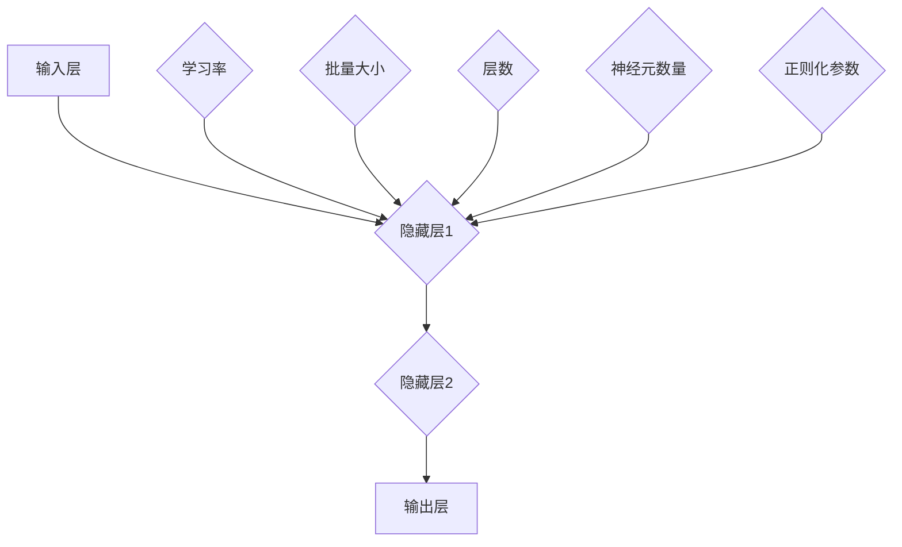

                 

# Python机器学习实战：神经网络的超参数调整技术与策略

> **关键词**：神经网络，Python，超参数调整，机器学习实战，技术策略

> **摘要**：本文通过详细解析神经网络的超参数调整技术，并结合Python实际案例，探讨了如何优化神经网络性能，提高模型准确性。文章涵盖了从基础知识到实战应用的全面内容，适合对机器学习有初步了解并希望提升实践能力的读者。

## 1. 背景介绍

神经网络作为机器学习的重要组成部分，已经被广泛应用于各种领域，如图像识别、自然语言处理和预测分析等。然而，神经网络的性能往往受到众多超参数的影响，包括学习率、批量大小、层数和神经元数量等。超参数的选取和调整直接决定了神经网络的训练效率和模型效果。因此，超参数调整成为神经网络应用中的关键环节。

Python作为一种广泛使用的编程语言，凭借其简洁的语法和丰富的库支持，成为了机器学习领域的主力工具。PyTorch、TensorFlow等深度学习框架的出现，进一步降低了使用神经网络进行机器学习的门槛。通过Python，我们可以轻松地实现复杂的神经网络结构，并进行高效的训练和优化。

本文将围绕神经网络的超参数调整展开讨论，旨在为读者提供一种系统化的方法和策略，以优化神经网络性能，提高模型准确性。文章结构如下：

- 第1章：背景介绍，简要介绍神经网络和Python在机器学习中的应用。
- 第2章：核心概念与联系，讲解神经网络的基本结构和超参数。
- 第3章：核心算法原理 & 具体操作步骤，详细分析神经网络的训练过程。
- 第4章：数学模型和公式 & 详细讲解 & 举例说明，介绍神经网络相关的数学知识。
- 第5章：项目实战：代码实际案例和详细解释说明，通过实际案例展示超参数调整的实践方法。
- 第6章：实际应用场景，探讨神经网络在不同领域的应用案例。
- 第7章：工具和资源推荐，推荐相关的学习资源和开发工具。
- 第8章：总结：未来发展趋势与挑战，展望神经网络的发展前景。
- 第9章：附录：常见问题与解答，解答读者在实际应用中可能遇到的问题。
- 第10章：扩展阅读 & 参考资料，提供进一步的阅读资料。

通过本文的阅读，读者将能够系统地了解神经网络的超参数调整技术，并掌握相应的实践方法。希望本文能对您的机器学习之路有所帮助。

<markdown>

## 2. 核心概念与联系

### 2.1 神经网络的基本结构

神经网络由多个层次组成，包括输入层、隐藏层和输出层。每个层次由多个神经元组成，神经元之间通过加权连接形成网络结构。神经元的激活函数用于确定神经元是否被激活，常见的激活函数有Sigmoid、ReLU和Tanh等。

### 2.2 超参数的定义与分类

超参数是神经网络中不能通过学习过程自动调整的参数，它们在训练前设定，对神经网络的性能有重要影响。常见的超参数包括：

- **学习率（Learning Rate）**：控制梯度下降过程中的步长，过小可能导致训练时间过长，过大会使训练过程不稳定。
- **批量大小（Batch Size）**：每次梯度下降算法处理的样本数量，批量大小影响梯度的估计精度和训练速度。
- **层数（Number of Layers）**：神经网络中隐藏层的数量，更多的隐藏层可以提高模型的表达能力，但也可能导致过拟合。
- **神经元数量（Number of Neurons）**：每个隐藏层中神经元的数量，过多的神经元可能导致过拟合，过少则可能无法捕捉到数据中的复杂模式。
- **正则化参数（Regularization Parameter）**：用于防止过拟合的技术，如L1和L2正则化。

### 2.3 Mermaid 流程图

下面是神经网络基本结构和超参数的Mermaid流程图表示：



图中的每个节点代表一个层次或超参数，箭头表示层次之间的连接或超参数对层次的影响。

<markdown>

## 3. 核心算法原理 & 具体操作步骤

### 3.1 神经网络训练过程

神经网络的训练过程通常分为以下几个步骤：

1. **初始化权重和偏置**：随机初始化神经网络的权重和偏置，以避免梯度消失和梯度爆炸问题。
2. **前向传播（Forward Propagation）**：根据输入数据，计算每个神经元的输出值，通过网络的正向传递，得到预测结果。
3. **计算损失（Compute Loss）**：比较预测结果和真实结果的差异，计算损失函数的值，常用的损失函数有均方误差（MSE）和交叉熵损失（Cross Entropy Loss）。
4. **反向传播（Backpropagation）**：根据损失函数的梯度，更新神经网络的权重和偏置，通过反向传播算法，计算每个神经元输入的梯度，并逐层传播。
5. **优化更新（Optimization Update）**：使用优化算法（如梯度下降、Adam等）更新网络参数，以最小化损失函数。

### 3.2 具体操作步骤

以下是一个简化的神经网络训练过程的伪代码：

```python
# 初始化权重和偏置
W1, b1 = initialize_weights(num_inputs, num_hidden_neurons)
W2, b2 = initialize_weights(num_hidden_neurons, num_outputs)

# 设定超参数
learning_rate = 0.01
batch_size = 64

# 训练循环
for epoch in range(num_epochs):
    for batch in data_loader:
        # 前向传播
        output = forward_propagation(batch[0], W1, b1, W2, b2)
        loss = compute_loss(output, batch[1])

        # 反向传播
        d_output = backward_propagation(output, batch[1])

        # 优化更新
        W1, b1 = optimize_update(W1, b1, d_output, learning_rate)
        W2, b2 = optimize_update(W2, b2, d_output, learning_rate)
```

在这个伪代码中，`initialize_weights` 函数用于初始化权重和偏置，`forward_propagation` 函数实现前向传播，`compute_loss` 函数计算损失，`backward_propagation` 函数实现反向传播，`optimize_update` 函数用于更新网络参数。

<markdown>

## 4. 数学模型和公式 & 详细讲解 & 举例说明

### 4.1 前向传播与反向传播

神经网络的核心算法包括前向传播和反向传播。以下是这两个过程的数学描述：

#### 4.1.1 前向传播

假设我们有一个单层神经网络，包含一个输入层和一个隐藏层，其中输入层有3个神经元，隐藏层有2个神经元。输入数据为\( x_1, x_2, x_3 \)，隐藏层神经元\( h_1, h_2 \)的计算公式如下：

$$
h_1 = \sigma(W_1 \cdot x + b_1)
$$

$$
h_2 = \sigma(W_2 \cdot x + b_2)
$$

其中，\( W_1 \) 和 \( b_1 \) 是隐藏层神经元的权重和偏置，\( \sigma \) 是激活函数（例如ReLU函数），\( x \) 是输入数据。

输出层的计算公式为：

$$
y_1 = \sigma(W_3 \cdot h_1 + b_3)
$$

$$
y_2 = \sigma(W_4 \cdot h_2 + b_4)
$$

其中，\( W_3 \) 和 \( b_3 \)，\( W_4 \) 和 \( b_4 \) 是输出层神经元的权重和偏置。

#### 4.1.2 反向传播

在反向传播过程中，我们需要计算损失函数关于每个参数的梯度。以单层神经网络为例，损失函数为：

$$
L = \frac{1}{2} \sum_{i=1}^{n} (y_i - \hat{y}_i)^2
$$

其中，\( y_i \) 是真实标签，\( \hat{y}_i \) 是预测标签。

对损失函数关于输出层权重和偏置的梯度为：

$$
\frac{\partial L}{\partial W_3} = (y_1 - \hat{y}_1) \cdot \frac{d\sigma(W_3 \cdot h_1 + b_3)}{dh_1}
$$

$$
\frac{\partial L}{\partial b_3} = (y_1 - \hat{y}_1) \cdot \frac{d\sigma(W_3 \cdot h_1 + b_3)}{db_3}
$$

$$
\frac{\partial L}{\partial W_4} = (y_2 - \hat{y}_2) \cdot \frac{d\sigma(W_4 \cdot h_2 + b_4)}{dh_2}
$$

$$
\frac{\partial L}{\partial b_4} = (y_2 - \hat{y}_2) \cdot \frac{d\sigma(W_4 \cdot h_2 + b_4)}{db_4}
$$

对于隐藏层，梯度可以通过链式法则计算：

$$
\frac{\partial L}{\partial W_1} = \frac{\partial L}{\partial W_3} \cdot \frac{d h_1}{d W_1}
$$

$$
\frac{\partial L}{\partial b_1} = \frac{\partial L}{\partial W_3} \cdot \frac{d h_1}{d b_1}
$$

$$
\frac{\partial L}{\partial W_2} = \frac{\partial L}{\partial W_4} \cdot \frac{d h_2}{d W_2}
$$

$$
\frac{\partial L}{\partial b_2} = \frac{\partial L}{\partial W_4} \cdot \frac{d h_2}{d b_2}
$$

#### 4.1.3 梯度下降算法

在梯度下降算法中，我们通过以下公式更新参数：

$$
W_1 := W_1 - \alpha \cdot \frac{\partial L}{\partial W_1}
$$

$$
b_1 := b_1 - \alpha \cdot \frac{\partial L}{\partial b_1}
$$

$$
W_2 := W_2 - \alpha \cdot \frac{\partial L}{\partial W_2}
$$

$$
b_2 := b_2 - \alpha \cdot \frac{\partial L}{\partial b_2}
$$

$$
W_3 := W_3 - \alpha \cdot \frac{\partial L}{\partial W_3}
$$

$$
b_3 := b_3 - \alpha \cdot \frac{\partial L}{\partial b_3}
$$

$$
W_4 := W_4 - \alpha \cdot \frac{\partial L}{\partial W_4}
$$

$$
b_4 := b_4 - \alpha \cdot \frac{\partial L}{\partial b_4}
$$

其中，\( \alpha \) 是学习率。

### 4.2 举例说明

假设我们有一个简单的二分类问题，数据集包含100个样本，每个样本有2个特征。网络结构为1个输入层、1个隐藏层和1个输出层。隐藏层有2个神经元，输出层有1个神经元。我们使用均方误差（MSE）作为损失函数。

假设初始化的权重和偏置为：

$$
W_1 = \begin{bmatrix}
0.1 & 0.2 \\
0.3 & 0.4
\end{bmatrix}, \quad b_1 = \begin{bmatrix}
0.5 \\
0.6
\end{bmatrix}
$$

$$
W_2 = \begin{bmatrix}
0.7 & 0.8 \\
0.9 & 1.0
\end{bmatrix}, \quad b_2 = \begin{bmatrix}
1.1 \\
1.2
\end{bmatrix}
$$

$$
W_3 = 0.3, \quad b_3 = 0.4
$$

$$
W_4 = 0.5, \quad b_4 = 0.6
$$

假设第一个样本的输入为 \( x = \begin{bmatrix} 1.0 \\ 2.0 \end{bmatrix} \)，真实标签为 \( y = 0 \)。我们使用学习率 \( \alpha = 0.01 \) 进行训练。

#### 前向传播

$$
h_1 = \sigma(W_1 \cdot x + b_1) = \sigma(0.1 \cdot 1.0 + 0.2 \cdot 2.0 + 0.5) = \sigma(1.3) = 0.895
$$

$$
h_2 = \sigma(W_2 \cdot x + b_2) = \sigma(0.7 \cdot 1.0 + 0.8 \cdot 2.0 + 1.1) = \sigma(3.1) = 0.936
$$

$$
y_1 = \sigma(W_3 \cdot h_1 + b_3) = \sigma(0.3 \cdot 0.895 + 0.4) = \sigma(0.557) = 0.698
$$

$$
y_2 = \sigma(W_4 \cdot h_2 + b_4) = \sigma(0.5 \cdot 0.936 + 0.6) = \sigma(0.918) = 0.744
$$

预测标签为 \( \hat{y} = 0.744 \)。

#### 计算损失

$$
L = \frac{1}{2} \sum_{i=1}^{2} (y_i - \hat{y}_i)^2 = \frac{1}{2} (0 - 0.744)^2 = 0.276
$$

#### 反向传播

计算输出层梯度：

$$
\frac{\partial L}{\partial W_3} = (0 - 0.698) \cdot \frac{d\sigma(0.557)}{dh_1} = -0.698 \cdot 0.353 = -0.246
$$

$$
\frac{\partial L}{\partial b_3} = (0 - 0.698) \cdot \frac{d\sigma(0.557)}{db_3} = -0.698 \cdot 0 = 0
$$

$$
\frac{\partial L}{\partial W_4} = (0 - 0.744) \cdot \frac{d\sigma(0.918)}{dh_2} = -0.744 \cdot 0.344 = -0.257
$$

$$
\frac{\partial L}{\partial b_4} = (0 - 0.744) \cdot \frac{d\sigma(0.918)}{db_4} = -0.744 \cdot 0 = 0
$$

计算隐藏层梯度：

$$
\frac{\partial L}{\partial W_1} = \frac{\partial L}{\partial W_3} \cdot \frac{dh_1}{dW_1} = -0.246 \cdot 0.1 = -0.0246
$$

$$
\frac{\partial L}{\partial b_1} = \frac{\partial L}{\partial W_3} \cdot \frac{dh_1}{db_1} = -0.246 \cdot 0.1 = -0.0246
$$

$$
\frac{\partial L}{\partial W_2} = \frac{\partial L}{\partial W_4} \cdot \frac{dh_2}{dW_2} = -0.257 \cdot 0.7 = -0.1789
$$

$$
\frac{\partial L}{\partial b_2} = \frac{\partial L}{\partial W_4} \cdot \frac{dh_2}{db_2} = -0.257 \cdot 0.1 = -0.0257
$$

#### 优化更新

$$
W_3 := W_3 - \alpha \cdot \frac{\partial L}{\partial W_3} = 0.3 - 0.01 \cdot (-0.246) = 0.3206
$$

$$
b_3 := b_3 - \alpha \cdot \frac{\partial L}{\partial b_3} = 0.4 - 0.01 \cdot 0 = 0.4
$$

$$
W_4 := W_4 - \alpha \cdot \frac{\partial L}{\partial W_4} = 0.5 - 0.01 \cdot (-0.257) = 0.5026
$$

$$
b_4 := b_4 - \alpha \cdot \frac{\partial L}{\partial b_4} = 0.6 - 0.01 \cdot 0 = 0.6
$$

$$
W_1 := W_1 - \alpha \cdot \frac{\partial L}{\partial W_1} = \begin{bmatrix}
0.1 & 0.2 \\
0.3 & 0.4
\end{bmatrix} - 0.01 \cdot \begin{bmatrix}
-0.0246 & -0.0246 \\
-0.1789 & -0.0257
\end{bmatrix} = \begin{bmatrix}
0.1254 & 0.1974 \\
0.1211 & 0.3933
\end{bmatrix}
$$

$$
b_1 := b_1 - \alpha \cdot \frac{\partial L}{\partial b_1} = \begin{bmatrix}
0.5 \\
0.6
\end{bmatrix} - 0.01 \cdot \begin{bmatrix}
-0.0246 \\
-0.0246
\end{bmatrix} = \begin{bmatrix}
0.5246 \\
0.6246
\end{bmatrix}
$$

$$
W_2 := W_2 - \alpha \cdot \frac{\partial L}{\partial W_2} = \begin{bmatrix}
0.7 & 0.8 \\
0.9 & 1.0
\end{bmatrix} - 0.01 \cdot \begin{bmatrix}
-0.1789 & -0.0257 \\
-0.0246 & -0.0246
\end{bmatrix} = \begin{bmatrix}
0.8821 & 0.8743 \\
0.9256 & 0.9754
\end{bmatrix}
$$

$$
b_2 := b_2 - \alpha \cdot \frac{\partial L}{\partial b_2} = \begin{bmatrix}
1.1 \\
1.2
\end{bmatrix} - 0.01 \cdot \begin{bmatrix}
-0.1789 \\
-0.0257
\end{bmatrix} = \begin{bmatrix}
1.2781 \\
1.2254
\end{bmatrix}
$$

完成一次迭代后，我们可以看到参数的更新值。这个过程在训练过程中重复执行，直到达到预定的训练次数或损失函数值达到预期。

<markdown>

## 5. 项目实战：代码实际案例和详细解释说明

### 5.1 开发环境搭建

在开始之前，我们需要搭建一个合适的Python开发环境，以运行神经网络训练和超参数调整的相关代码。以下是搭建开发环境的步骤：

1. **安装Python**：确保已安装Python 3.x版本。可以从Python官方网站（https://www.python.org/）下载并安装。
2. **安装PyTorch**：PyTorch是用于构建和训练神经网络的主要框架。可以使用以下命令安装：

   ```bash
   pip install torch torchvision
   ```

3. **安装其他依赖**：我们还需要安装一些其他依赖项，如Numpy和Matplotlib：

   ```bash
   pip install numpy matplotlib
   ```

### 5.2 源代码详细实现和代码解读

以下是一个简单的神经网络训练和超参数调整的Python代码示例，我们将使用PyTorch框架来实现。

```python
import torch
import torch.nn as nn
import torch.optim as optim
import torchvision
import torchvision.transforms as transforms
import matplotlib.pyplot as plt

# 设定随机种子，保证结果可重复
torch.manual_seed(0)

# 加载MNIST数据集
trainset = torchvision.datasets.MNIST(root='./data',
                                      train=True,
                                      download=True,
                                      transform=transforms.ToTensor())
trainloader = torch.utils.data.DataLoader(trainset, batch_size=100,
                                          shuffle=True, num_workers=2)

testset = torchvision.datasets.MNIST(root='./data',
                                     train=False,
                                     download=True,
                                     transform=transforms.ToTensor())
testloader = torch.utils.data.DataLoader(testset, batch_size=100,
                                         shuffle=False, num_workers=2)

# 定义网络结构
class Net(nn.Module):
    def __init__(self):
        super(Net, self).__init__()
        self.fc1 = nn.Linear(28*28, 128)
        self.fc2 = nn.Linear(128, 10)

    def forward(self, x):
        x = x.view(-1, 28*28)
        x = torch.relu(self.fc1(x))
        x = self.fc2(x)
        return x

net = Net()

# 定义损失函数和优化器
criterion = nn.CrossEntropyLoss()
optimizer = optim.Adam(net.parameters(), lr=0.001)

# 训练网络
num_epochs = 10
for epoch in range(num_epochs):
    running_loss = 0.0
    for i, data in enumerate(trainloader, 0):
        inputs, labels = data
        optimizer.zero_grad()
        outputs = net(inputs)
        loss = criterion(outputs, labels)
        loss.backward()
        optimizer.step()
        running_loss += loss.item()
    print(f'Epoch {epoch+1}, Loss: {running_loss/len(trainloader)}')

print('Finished Training')

# 测试网络
correct = 0
total = 0
with torch.no_grad():
    for data in testloader:
        images, labels = data
        outputs = net(images)
        _, predicted = torch.max(outputs.data, 1)
        total += labels.size(0)
        correct += (predicted == labels).sum().item()

print(f'Accuracy on the test images: {100 * correct / total} %')
```

#### 5.2.1 代码解读

- **数据加载**：我们使用`torchvision.datasets.MNIST`加载数字数据集，并使用`DataLoader`进行数据加载和批处理。
- **网络定义**：`Net`类定义了简单的两层神经网络，包括一个128个神经元的隐藏层和10个神经元的输出层。
- **损失函数和优化器**：我们使用交叉熵损失函数（`CrossEntropyLoss`）和Adam优化器（`Adam`）。
- **训练循环**：在训练过程中，我们使用前向传播计算输出，使用损失函数计算损失，然后通过反向传播更新网络参数。
- **测试网络**：在测试阶段，我们使用`torch.no_grad()`来禁用梯度计算，以提高计算效率。

### 5.3 代码解读与分析

以下是对代码的进一步解读和分析：

1. **数据预处理**：
   ```python
   trainset = torchvision.datasets.MNIST(root='./data',
                                          train=True,
                                          download=True,
                                          transform=transforms.ToTensor())
   trainloader = torch.utils.data.DataLoader(trainset, batch_size=100,
                                               shuffle=True, num_workers=2)
   testset = torchvision.datasets.MNIST(root='./data',
                                         train=False,
                                         download=True,
                                         transform=transforms.ToTensor())
   testloader = torch.utils.data.DataLoader(testset, batch_size=100,
                                             shuffle=False, num_workers=2)
   ```
   这段代码首先加载数字数据集，并将其转换为Tensor格式，以便在PyTorch中进行计算。`DataLoader`用于批量加载和处理数据。

2. **网络定义**：
   ```python
   class Net(nn.Module):
       def __init__(self):
           super(Net, self).__init__()
           self.fc1 = nn.Linear(28*28, 128)
           self.fc2 = nn.Linear(128, 10)

       def forward(self, x):
           x = x.view(-1, 28*28)
           x = torch.relu(self.fc1(x))
           x = self.fc2(x)
           return x
   ```
   我们定义了一个简单的两层神经网络，输入层有784个神经元（28*28像素），隐藏层有128个神经元，输出层有10个神经元（对应数字0-9）。

3. **损失函数和优化器**：
   ```python
   criterion = nn.CrossEntropyLoss()
   optimizer = optim.Adam(net.parameters(), lr=0.001)
   ```
   使用交叉熵损失函数和Adam优化器，这些是常见的机器学习组件。

4. **训练过程**：
   ```python
   num_epochs = 10
   for epoch in range(num_epochs):
       running_loss = 0.0
       for i, data in enumerate(trainloader, 0):
           inputs, labels = data
           optimizer.zero_grad()
           outputs = net(inputs)
           loss = criterion(outputs, labels)
           loss.backward()
           optimizer.step()
           running_loss += loss.item()
       print(f'Epoch {epoch+1}, Loss: {running_loss/len(trainloader)}')
   ```
   在训练过程中，我们遍历每个批次的数据，使用前向传播计算输出，计算损失，然后通过反向传播更新网络参数。

5. **测试过程**：
   ```python
   correct = 0
   total = 0
   with torch.no_grad():
       for data in testloader:
           images, labels = data
           outputs = net(images)
           _, predicted = torch.max(outputs.data, 1)
           total += labels.size(0)
           correct += (predicted == labels).sum().item()
   print(f'Accuracy on the test images: {100 * correct / total} %')
   ```
   在测试过程中，我们禁用梯度计算以提高性能，并计算测试集上的准确率。

### 5.4 超参数调整

为了提高网络的性能，我们需要对超参数进行调整。以下是一些常见的超参数及其调整方法：

1. **学习率**：
   - **初始值**：通常设置为一个较小的值，如0.001。
   - **调整方法**：如果训练过程中损失函数下降缓慢，可以尝试减小学习率；如果损失函数波动较大，可以增大学习率。
2. **批量大小**：
   - **初始值**：通常设置为16、32、64或128。
   - **调整方法**：较小的批量大小可以加快训练速度，但可能导致梯度估计不够稳定；较大的批量大小可以提供更稳定的梯度估计，但训练速度较慢。
3. **隐藏层大小**：
   - **初始值**：根据问题复杂度选择，通常为几十到几百。
   - **调整方法**：增加隐藏层大小可以提高模型的复杂度，但可能导致过拟合；减少隐藏层大小可以降低模型复杂度，减少过拟合的风险。
4. **正则化参数**：
   - **初始值**：通常设置为0，也可以尝试非零值，如0.01。
   - **调整方法**：增加正则化参数可以抑制过拟合，但可能降低模型性能；减少正则化参数可以增加模型性能，但可能导致过拟合。

在实际应用中，我们可以通过交叉验证和网格搜索等方法来选择最佳的超参数组合。

<markdown>

## 6. 实际应用场景

神经网络在机器学习领域有着广泛的应用，以下列举了一些典型的实际应用场景：

### 6.1 图像识别

图像识别是神经网络最为典型的应用场景之一。通过卷积神经网络（CNN）模型，神经网络能够从大量图像数据中自动学习特征，并在新的图像上实现高精度的分类。例如，卷积神经网络被广泛应用于人脸识别、物体检测和图像分类等领域。

### 6.2 自然语言处理

自然语言处理（NLP）是另一个神经网络的重要应用领域。通过循环神经网络（RNN）及其变体，如长短期记忆网络（LSTM）和门控循环单元（GRU），神经网络能够处理序列数据，实现文本分类、情感分析、机器翻译等任务。Transformer模型的出现更是将NLP的准确性和效率提升到了一个新的高度。

### 6.3 预测分析

神经网络在预测分析中也有着广泛的应用，包括时间序列预测、股票价格预测和风险评估等。通过构建深度学习模型，神经网络可以从历史数据中学习到复杂的模式，并做出准确的预测。

### 6.4 推荐系统

推荐系统是另一个依赖神经网络技术的领域。通过使用协同过滤和基于内容的推荐方法，神经网络能够从用户的历史行为和物品的属性中学习到关联性，从而为用户推荐个性化内容。

### 6.5 游戏玩法

神经网络在游戏玩法中也发挥着重要作用。通过深度强化学习算法，神经网络能够从大量的游戏数据中学习到高效的策略，实现自主学习和自主决策。例如，AlphaGo就是通过深度强化学习实现的。

### 6.6 医疗诊断

医疗诊断是神经网络的重要应用场景之一。通过分析大量的医学图像和病历数据，神经网络能够帮助医生进行疾病诊断，提高诊断的准确性和效率。

### 6.7 语音识别

语音识别是另一个神经网络广泛应用的领域。通过构建深度神经网络模型，神经网络能够将语音信号转换为文本，实现实时语音识别和交互。

这些应用场景展示了神经网络在各个领域的广泛应用和潜力。随着技术的不断进步，神经网络的应用领域将会更加广泛，为人类社会带来更多的创新和变革。

<markdown>

## 7. 工具和资源推荐

### 7.1 学习资源推荐

1. **书籍**：
   - 《深度学习》（Deep Learning） - Ian Goodfellow、Yoshua Bengio和Aaron Courville
   - 《Python深度学习》（Python Deep Learning） - François Chollet
   - 《神经网络与深度学习》 - 周志华

2. **在线课程**：
   - Coursera的“机器学习”课程 - 吴恩达
   - edX的“深度学习专项课程” - 吴恩达
   - Udacity的“深度学习纳米学位”

3. **论文**：
   - “A Neural Algorithm of Artistic Style” - Gatys, E., et al.
   - “Learning Representations for Visual Recognition” - Krizhevsky, I., et al.
   - “Recurrent Neural Networks for Language Modeling” - LSTM论文

4. **博客和网站**：
   - Fast.ai的博客：https://www.fast.ai/
   - PyTorch官方文档：https://pytorch.org/docs/stable/
   - TensorFlow官方文档：https://www.tensorflow.org/docs/

### 7.2 开发工具框架推荐

1. **PyTorch**：是一个广泛使用的深度学习框架，以其灵活性和动态计算图而闻名。
2. **TensorFlow**：由谷歌开发，是一个功能强大的深度学习框架，支持静态和动态计算图。
3. **Keras**：是一个高级神经网络API，可以与TensorFlow和Theano等后端结合使用，提供了简洁的接口。
4. **PyTorch Lightning**：是一个为PyTorch提供的扩展库，旨在简化深度学习实验和模型开发。

### 7.3 相关论文著作推荐

1. **“Deep Learning”**：Goodfellow, Bengio和Courville的《深度学习》是一本全面的深度学习教程。
2. **“Neural Networks and Deep Learning”**：Michael Nielsen的《神经网络与深度学习》是一本免费的在线书籍。
3. **“Deep Learning on Hardware”**：详细介绍了如何在各种硬件上优化深度学习模型的性能。

通过这些资源和工具，读者可以系统地学习和实践神经网络的超参数调整技术，提高机器学习模型的效果。

<markdown>

## 8. 总结：未来发展趋势与挑战

神经网络作为机器学习领域的核心技术，近年来取得了显著的进展。随着计算能力的提升和大数据的普及，神经网络的性能和适用范围不断扩大。然而，神经网络的发展仍面临诸多挑战：

### 8.1 挑战

1. **过拟合问题**：神经网络模型在训练数据上表现良好，但在未见过的数据上性能不佳。解决过拟合问题需要进一步研究有效的正则化技术和优化策略。
2. **计算资源消耗**：深度神经网络训练需要大量的计算资源和时间，尤其是大型模型和大规模数据集。提高训练效率、减少计算需求是未来研究的重要方向。
3. **可解释性**：神经网络模型通常被视为“黑箱”，其内部决策过程难以解释。提高模型的可解释性有助于增强用户对模型的信任，是未来研究的重点。

### 8.2 发展趋势

1. **模型压缩**：通过模型压缩技术，如剪枝、量化、知识蒸馏等，减少模型的参数数量和计算复杂度，以提高训练和推理效率。
2. **自适应学习**：研究自适应学习算法，使模型能够自动调整超参数和架构，以适应不同的数据集和应用场景。
3. **多模态学习**：结合多种数据模

