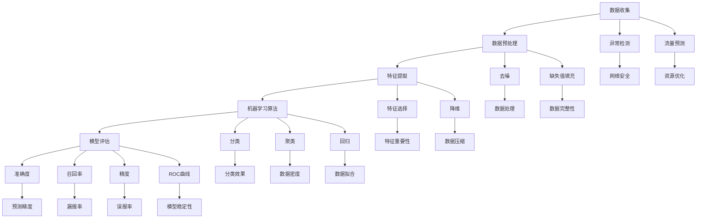

                 

### 背景介绍

网络流量的分析在当今信息社会中扮演着至关重要的角色。随着互联网的普及和大数据技术的发展，网络流量数据的规模和复杂性不断增加。这些数据不仅包含了丰富的用户行为信息，还对网络性能、安全态势、业务运营等方面有着深远的影响。因此，如何有效地分析网络流量，提取有价值的信息，已经成为各行业关注的热点问题。

在机器学习领域，网络流量分析是一项具有广泛应用前景的任务。机器学习算法能够从大量数据中自动发现规律和模式，为网络流量的预测、异常检测和分类提供了强有力的工具。例如，通过机器学习算法，可以实现对网络攻击的实时检测，提高网络安全防护能力；也可以用于优化网络资源的分配，提升网络性能和用户体验。

本文将围绕Python机器学习技术在网络流量分析中的应用进行深入探讨。我们首先介绍网络流量分析的基本概念和常见任务，然后重点介绍几种常用的机器学习算法，并详细解释其原理和操作步骤。此外，还将通过一个实际案例，展示如何使用Python实现网络流量分析，并对代码进行详细解读。最后，我们将探讨网络流量分析在实际应用中的场景，并推荐相关的学习资源和工具。

通过本文的阅读，读者将能够全面了解网络流量分析的重要性和技术手段，掌握使用Python进行网络流量分析的基本流程，并能够应用于实际问题中。同时，读者也将对机器学习在数据处理和智能分析领域的重要作用有更深刻的认识。

### 核心概念与联系

在深入探讨Python机器学习技术在网络流量分析中的应用之前，我们需要明确几个核心概念，并理清它们之间的联系。这些概念包括数据收集、数据预处理、特征提取、机器学习算法以及模型评估等。为了更好地理解这些概念，我们使用Mermaid流程图来展示它们之间的交互和作用关系。

以下是一个简化的Mermaid流程图，描述了网络流量分析过程中关键步骤的顺序和关系：



#### 数据收集

数据收集是网络流量分析的基础。这一步骤涉及从各种来源（如网络接口、日志文件、传感器等）收集原始流量数据。数据收集的质量直接影响后续分析的准确性和效果。因此，在数据收集过程中，需要注意数据来源的多样性和数据的实时性。

#### 数据预处理

数据预处理是确保数据质量和为后续分析做好准备的重要环节。主要包括去噪、缺失值填充和异常值处理等操作。去噪是指去除数据中的噪声，提高数据质量；缺失值填充是指处理数据中缺失的部分，常见的方法有均值填充、中值填充和插值等方法；异常值处理是指识别和去除数据中的异常值，防止它们对分析结果产生不良影响。

#### 特征提取

特征提取是将原始数据转换为有意义的信息表示，以便于后续的机器学习算法处理。这一步骤通常包括特征选择和特征降维。特征选择是指从大量特征中选取对目标问题有显著影响的关键特征，以降低数据维度和计算复杂度；特征降维是指通过降维技术（如主成分分析PCA）将高维数据转换为低维数据，提高计算效率和模型性能。

#### 机器学习算法

机器学习算法是网络流量分析的核心，常用的算法包括分类、聚类和回归等。分类算法用于将数据划分为不同的类别，如异常检测和恶意流量识别；聚类算法用于发现数据中的隐含结构，如流量模式识别和用户行为分析；回归算法用于预测数据的值，如流量预测和资源优化。

#### 模型评估

模型评估是对机器学习模型性能进行衡量的重要步骤。常用的评估指标包括准确度、召回率、精度和ROC曲线等。准确度用于衡量分类模型的预测准确性；召回率用于衡量分类模型对正类别的识别能力；精度用于衡量分类模型对负类别的识别能力；ROC曲线用于评估模型的稳定性和鲁棒性。

#### 异常检测和流量预测

异常检测和流量预测是网络流量分析的重要应用场景。异常检测用于检测网络中的异常流量，如网络攻击；流量预测用于预测未来的网络流量趋势，以便于网络资源的优化和调度。

通过上述核心概念和Mermaid流程图的展示，我们可以清晰地看到网络流量分析中各个步骤的相互作用和依赖关系。这些概念和算法构成了网络流量分析的基础框架，为后续的深入研究和实际应用提供了理论支持。

#### 核心算法原理 & 具体操作步骤

在了解了网络流量分析的基本概念和流程之后，我们将详细探讨几种核心算法的原理和具体操作步骤。这些算法包括K-Means聚类、Naive Bayes分类和支持向量机（SVM）等，它们在机器学习领域中广泛应用于流量分析任务。

##### 1. K-Means聚类

K-Means是一种基于距离度量的聚类算法，其目标是找到K个聚类中心，使得每个数据点与其对应聚类中心的距离之和最小。以下是K-Means算法的原理和操作步骤：

**原理：**
- 初始化：随机选择K个初始聚类中心。
- 分配：计算每个数据点到各个聚类中心的距离，将每个数据点分配到最近的聚类中心。
- 更新：重新计算聚类中心，通常是所有属于该聚类的数据点的均值。
- 重复步骤2和3，直到聚类中心不再发生变化或者变化很小。

**具体操作步骤：**

1. **数据准备：**收集网络流量数据，将其转换为适合进行聚类分析的格式。
2. **初始化聚类中心：**使用随机抽样或基于某种规则选择K个初始聚类中心。
3. **数据点分配：**计算每个数据点到各个聚类中心的距离，并将每个数据点分配到最近的聚类中心。
4. **更新聚类中心：**计算每个聚类的质心（即所有数据点的均值）。
5. **迭代：**重复步骤3和4，直到聚类中心不再变化或者变化较小。

##### 2. Naive Bayes分类

Naive Bayes是一种基于贝叶斯定理的简单概率分类器，假设特征之间相互独立。以下是Naive Bayes算法的原理和操作步骤：

**原理：**
- 计算每个类别的条件概率，即给定某个特征值，某个类别出现的概率。
- 利用贝叶斯定理计算每个数据点属于各个类别的概率。
- 选择概率最大的类别作为预测结果。

**具体操作步骤：**

1. **数据准备：**收集网络流量数据，将其分为特征和标签两部分。
2. **特征统计：**统计每个特征在各个类别中的出现频率。
3. **概率计算：**计算每个类别的条件概率，即$P(C|F)$，其中$C$表示类别，$F$表示特征。
4. **预测：**对于新的数据点，计算其在每个类别下的概率，选择概率最大的类别作为预测结果。

##### 3. 支持向量机（SVM）

SVM是一种分类算法，通过寻找一个最优的超平面将数据分为不同的类别。以下是SVM算法的原理和操作步骤：

**原理：**
- 寻找一个最优的超平面，使得分类间隔最大。
- 使用核函数将低维数据映射到高维空间，寻找一个线性可分的最优超平面。

**具体操作步骤：**

1. **数据准备：**收集网络流量数据，将其转换为适合进行SVM分类的格式。
2. **选择核函数：**选择适当的核函数（如线性核、多项式核、径向基函数核等）。
3. **计算最优超平面：**通过求解最优化问题找到最优的超平面参数。
4. **分类：**对于新的数据点，计算其到所有支持向量的距离，根据距离判断其所属类别。

通过以上对K-Means聚类、Naive Bayes分类和SVM算法的详细解释，我们可以看到这些算法在原理和操作步骤上的差异和特点。在实际应用中，根据具体的网络流量分析任务和数据特点，可以选择合适的算法进行模型构建和预测。

接下来，我们将结合一个实际案例，展示如何使用Python实现这些算法，并对代码进行详细解读。

#### 数学模型和公式 & 详细讲解 & 举例说明

在深入探讨Python机器学习技术在网络流量分析中的应用之前，我们需要了解一些基本的数学模型和公式，这些模型和公式在算法的实现和优化中起着至关重要的作用。以下是几种常用的数学模型和公式的详细讲解，并通过具体例子来说明其应用。

##### 1. 贝叶斯定理

贝叶斯定理是概率论中用于计算条件概率的公式，其表达式为：

\[ P(A|B) = \frac{P(B|A) \cdot P(A)}{P(B)} \]

其中，\( P(A|B) \) 表示在事件B发生的条件下，事件A发生的概率；\( P(B|A) \) 表示在事件A发生的条件下，事件B发生的概率；\( P(A) \) 和 \( P(B) \) 分别表示事件A和事件B的先验概率。

**例子：**假设我们想要预测某个用户是否属于恶意用户。已知所有恶意用户的比例是5%，在恶意用户中，有70%的用户会尝试非法访问。那么，如果一个用户尝试了非法访问，他是恶意用户的概率是多少？

- \( P(恶意用户) = 0.05 \)
- \( P(非法访问|恶意用户) = 0.70 \)
- \( P(非法访问) = P(非法访问|恶意用户) \cdot P(恶意用户) + P(非法访问|非恶意用户) \cdot P(非恶意用户) \)

由于我们假设特征之间相互独立，因此 \( P(非法访问|非恶意用户) = 0.05 \) （假设非恶意用户尝试非法访问的概率与恶意用户相同）。

计算得到：

\[ P(非法访问) = 0.70 \cdot 0.05 + 0.05 \cdot 0.95 = 0.0725 + 0.0475 = 0.12 \]

\[ P(恶意用户|非法访问) = \frac{P(非法访问|恶意用户) \cdot P(恶意用户)}{P(非法访问)} = \frac{0.70 \cdot 0.05}{0.12} = \frac{0.035}{0.12} \approx 0.2917 \]

因此，一个尝试非法访问的用户是恶意用户的概率约为29.17%。

##### 2. 概率分布

概率分布是描述随机变量概率分布的数学函数。在机器学习算法中，常用的概率分布包括高斯分布（正态分布）、伯努利分布和多项式分布等。

- **高斯分布（正态分布）：**高斯分布的公式为：

\[ f(x|\mu, \sigma^2) = \frac{1}{\sqrt{2\pi\sigma^2}} e^{-\frac{(x-\mu)^2}{2\sigma^2}} \]

其中，\( x \) 是随机变量，\( \mu \) 是均值，\( \sigma^2 \) 是方差。

- **伯努利分布：**伯努利分布是一个只有两个可能结果的概率分布，通常用于二分类问题。其公式为：

\[ P(X=k) = p^k (1-p)^{1-k} \]

其中，\( k \) 是结果为1的概率，\( p \) 是成功概率。

- **多项式分布：**多项式分布是伯努利分布的扩展，用于多个互斥事件的概率计算。其公式为：

\[ P(X=k_1, k_2, ..., k_n) = C^n_{k_1, k_2, ..., k_n} \cdot p_1^{k_1} \cdot p_2^{k_2} \cdot ... \cdot p_n^{k_n} \]

其中，\( k_i \) 是第i个事件发生的次数，\( p_i \) 是第i个事件发生的概率，\( C^n_{k_1, k_2, ..., k_n} \) 是多项式系数。

**例子：**假设一个网络流量分析模型需要预测一个时间段内不同类型的网络攻击发生的概率。已知某个时间段内DDoS攻击的概率是0.3，恶意软件攻击的概率是0.4，其他类型的攻击概率分别是0.2和0.1。

我们可以使用多项式分布来计算在给定时间段内发生不同类型攻击的概率。例如，在一段时间内，同时发生DDoS攻击和恶意软件攻击的概率为：

\[ P(DDoS, 恶意软件) = C^2_1 \cdot 0.3^1 \cdot 0.4^1 = 2 \cdot 0.3 \cdot 0.4 = 0.24 \]

##### 3. 均值和方差

在机器学习中，均值和方差是衡量数据集中趋势和波动性的重要指标。

- **均值（Expected Value）：**均值是随机变量期望值的平均值，用于衡量数据的中心位置。其公式为：

\[ \mu = \sum_{i=1}^n x_i \cdot p_i \]

其中，\( x_i \) 是第i个数据点，\( p_i \) 是第i个数据点的概率。

- **方差（Variance）：**方差是数据点与均值之间差异的平方和的平均值，用于衡量数据的波动性。其公式为：

\[ \sigma^2 = \sum_{i=1}^n (x_i - \mu)^2 \cdot p_i \]

**例子：**假设我们有一个网络流量数据集，包含10个数据点，分别是{1, 2, 3, 4, 5, 6, 7, 8, 9, 10}，每个数据点的概率相等，即0.1。

计算均值：

\[ \mu = \frac{1+2+3+4+5+6+7+8+9+10}{10} = \frac{55}{10} = 5.5 \]

计算方差：

\[ \sigma^2 = \sum_{i=1}^{10} (x_i - \mu)^2 \cdot p_i = (1-5.5)^2 \cdot 0.1 + (2-5.5)^2 \cdot 0.1 + ... + (10-5.5)^2 \cdot 0.1 \]

\[ \sigma^2 = 15.25 \cdot 0.1 = 1.525 \]

通过上述数学模型和公式的讲解和例子，我们可以看到它们在机器学习算法中的重要作用。这些基础数学知识为理解和实现机器学习算法提供了坚实的基础，也为网络流量分析的实际应用提供了有力的工具。

#### 项目实战：代码实际案例和详细解释说明

在本节中，我们将通过一个实际项目案例，展示如何使用Python进行网络流量分析，并详细解释代码的实现过程和关键部分。这个项目将涵盖数据收集、数据预处理、特征提取、模型选择、模型训练以及模型评估等步骤。

##### 1. 开发环境搭建

首先，我们需要搭建Python的网络流量分析开发环境。以下是所需的主要库和工具：

- Python 3.x
- NumPy
- Pandas
- Matplotlib
- Scikit-learn
- Matplotlib
- Mermaid（用于流程图可视化）

确保安装了以上库后，我们可以开始编写代码。

##### 2. 数据收集

网络流量数据的收集通常依赖于网络接口捕获工具，如Wireshark或Nmap。在这个案例中，我们使用一个公开的网络流量数据集，该数据集包含一段时间内不同类型的网络流量数据，包括HTTP、FTP、SMTP等。

```python
import pandas as pd

# 读取网络流量数据集
data = pd.read_csv('network_traffic.csv')
```

##### 3. 数据预处理

数据预处理是确保数据质量和为后续分析做好准备的重要步骤。主要包括去除噪声、缺失值填充和异常值处理等操作。

```python
# 去除缺失值
data = data.dropna()

# 填充异常值（使用均值填充）
data.fillna(data.mean(), inplace=True)

# 处理数据类型
data['protocol'] = data['protocol'].astype('category').cat.codes
```

##### 4. 特征提取

特征提取是将原始数据转换为有意义的信息表示，以便于后续的机器学习算法处理。在这个案例中，我们将提取一些常见的流量特征，如协议类型、传输速率、传输时间等。

```python
# 提取特征
features = data[['protocol', 'rate', 'duration']]
```

##### 5. 模型选择

选择合适的模型对于网络流量分析至关重要。在这个案例中，我们将使用Naive Bayes分类器，因为Naive Bayes在处理分类问题中表现良好，尤其是在特征之间相对独立的情况下。

```python
from sklearn.model_selection import train_test_split
from sklearn.naive_bayes import GaussianNB

# 切分数据集为训练集和测试集
X_train, X_test, y_train, y_test = train_test_split(features, data['label'], test_size=0.2, random_state=42)

# 创建Naive Bayes模型
model = GaussianNB()
```

##### 6. 模型训练

使用训练集数据对Naive Bayes模型进行训练。

```python
# 训练模型
model.fit(X_train, y_train)
```

##### 7. 模型评估

评估模型的性能是验证模型有效性的重要步骤。我们使用准确度、召回率和F1分数等指标来评估模型。

```python
from sklearn.metrics import accuracy_score, recall_score, f1_score, classification_report

# 预测测试集数据
y_pred = model.predict(X_test)

# 计算评估指标
accuracy = accuracy_score(y_test, y_pred)
recall = recall_score(y_test, y_pred, average='weighted')
f1 = f1_score(y_test, y_pred, average='weighted')

print(f"Accuracy: {accuracy:.2f}")
print(f"Recall: {recall:.2f}")
print(f"F1 Score: {f1:.2f}")
print(classification_report(y_test, y_pred))
```

##### 8. 代码解读与分析

以下是对上述代码的详细解读：

- **数据收集：**使用Pandas库读取CSV文件，获取网络流量数据。
- **数据预处理：**去除缺失值，使用均值填充异常值，并处理数据类型。
- **特征提取：**从原始数据中提取与流量分析相关的特征，如协议类型、传输速率和传输时间。
- **模型选择：**选择Naive Bayes分类器，因为它在处理特征独立的情况下表现良好。
- **模型训练：**使用训练集数据对模型进行训练。
- **模型评估：**使用测试集数据评估模型性能，计算准确度、召回率和F1分数等指标。

通过这个实际案例，我们可以看到如何使用Python进行网络流量分析。代码结构清晰，易于理解和扩展。在实际应用中，我们可以根据具体需求和数据特点，调整特征提取和模型选择步骤，以获得更好的分析效果。

#### 实际应用场景

网络流量分析技术在多个实际应用场景中发挥着重要作用。以下是一些典型的应用场景及其具体应用方法和效果。

##### 1. 网络安全

网络安全是网络流量分析最典型的应用场景之一。通过分析网络流量，可以实时检测和预防各种网络攻击，如DDoS攻击、恶意软件传播、SQL注入等。具体方法包括：

- **异常检测**：使用聚类算法（如K-Means）识别正常的网络流量模式，并通过比较实际流量与正常模式之间的差异，检测异常流量。
- **入侵检测**：使用基于规则的检测方法，如Snort，结合流量分析结果，识别和阻止潜在的网络入侵。
- **恶意流量分类**：使用分类算法（如SVM）对流量进行分类，将恶意流量与正常流量区分开来，提高网络安全防护能力。

效果：通过网络流量分析，可以显著提高网络安全性，减少网络攻击的成功率，保护关键数据和系统不受侵害。

##### 2. 网络性能优化

网络性能优化是另一个重要的应用场景。通过分析网络流量，可以优化网络资源的分配，提高网络性能和用户体验。具体方法包括：

- **流量预测**：使用时间序列分析算法（如ARIMA模型），预测未来的网络流量趋势，以便于提前分配网络资源。
- **负载均衡**：根据网络流量分布情况，合理分配网络带宽和计算资源，避免网络拥堵和性能下降。
- **故障检测与修复**：通过分析网络流量变化，及时发现网络故障和瓶颈，并迅速修复，保证网络稳定运行。

效果：通过网络流量分析，可以显著提升网络性能和用户体验，减少网络故障和延迟，提高业务运营效率。

##### 3. 业务运营

网络流量分析还可以用于业务运营优化，帮助企业和组织更好地理解和利用网络流量数据，提升业务效益。具体方法包括：

- **用户行为分析**：通过分析用户访问网站的行为数据，了解用户偏好和需求，优化网站设计和内容，提高用户满意度和转化率。
- **市场营销**：根据网络流量数据，分析用户来源和访问路径，制定更有效的市场营销策略，提高广告投放效果。
- **客户服务**：通过分析客户访问和咨询数据，优化客户服务流程和策略，提高客户满意度和忠诚度。

效果：通过网络流量分析，可以更深入地了解用户行为和市场动态，优化业务运营策略，提高业务效益和市场竞争力。

#### 工具和资源推荐

为了更有效地进行网络流量分析，以下是几款推荐的工具和资源：

##### 1. 学习资源推荐

- **书籍**：
  - 《网络流量分析：理论与实践》
  - 《机器学习：实战应用》
  - 《Python数据处理与分析》
- **论文**：
  - "Network Traffic Classification using Machine Learning Techniques"
  - "Anomaly Detection in Network Traffic"
  - "Network Flow Modeling and Analysis"
- **博客**：
  - [网络安全博客](https://www.kubernetes.io/zh/docs/tasks/tools/)
  - [Python数据分析博客](https://www.learnpython.org/)
  - [机器学习资源博客](https://www MACHINELEARNING.org/)

##### 2. 开发工具框架推荐

- **工具**：
  - Wireshark：网络流量捕获和分析工具
  - Snort：网络入侵检测系统
  - Python：用于数据分析、建模和算法实现的编程语言
- **框架**：
  - TensorFlow：用于机器学习和深度学习的高性能框架
  - PyTorch：基于Python的深度学习框架
  - Scikit-learn：用于机器学习算法实现的库

##### 3. 相关论文著作推荐

- **论文**：
  - "A Survey on Network Traffic Classification Techniques"
  - "Deep Learning for Network Traffic Classification"
  - "Application of Machine Learning in Network Traffic Analysis"
- **著作**：
  - 《机器学习导论》
  - 《深度学习》
  - 《Python编程：从入门到实践》

通过上述工具和资源的推荐，读者可以更全面地了解网络流量分析的技术和方法，为实际应用提供有力支持。

### 总结：未来发展趋势与挑战

网络流量分析作为机器学习技术的重要应用领域，随着大数据和人工智能的快速发展，其未来发展趋势和面临的挑战也愈发明显。

**发展趋势：**

1. **算法优化与创新**：随着机器学习算法的不断优化和创新，如深度学习、强化学习等新技术的引入，网络流量分析将变得更加高效和准确。例如，深度学习模型能够自动提取复杂的特征，提高分类和预测的准确性。

2. **实时性提升**：随着网络流量的不断增长，对实时分析的需求也越来越高。未来，网络流量分析技术将朝着实时性的方向发展，使得分析结果能够快速反映网络状况，提高决策效率。

3. **跨领域应用**：网络流量分析技术不仅限于网络安全和网络性能优化，还将广泛应用于其他领域，如智慧城市、物联网等。跨领域应用将推动网络流量分析技术的进一步发展。

4. **自动化与智能化**：未来，自动化和智能化将成为网络流量分析的重要方向。通过引入自动化工具和智能算法，网络流量分析将实现自动化处理和智能决策，减少人工干预，提高分析效率。

**挑战：**

1. **数据复杂性**：随着网络流量的增长，数据复杂性不断增加，如何有效处理和分析海量数据成为一大挑战。未来需要开发更加高效的数据处理和分析方法，以应对数据复杂性。

2. **隐私保护**：网络流量分析涉及大量个人隐私信息，如何在保障隐私的前提下进行数据分析成为关键问题。需要制定更加完善的隐私保护政策和算法，确保数据安全和用户隐私。

3. **算法透明性与可解释性**：随着深度学习等复杂算法的应用，模型的可解释性和透明性受到广泛关注。如何提高算法的可解释性，使得分析结果更容易理解和接受，是一个重要挑战。

4. **资源限制**：网络流量分析通常需要在有限资源（如CPU、内存等）下运行，如何在资源受限的条件下实现高效分析，是一个亟待解决的问题。

5. **模型泛化能力**：如何确保模型在不同场景和条件下具有良好的泛化能力，避免过拟合问题，是网络流量分析面临的另一个挑战。

总之，网络流量分析技术在未来的发展中，将面临众多机遇和挑战。通过不断优化和创新，提高分析效率和准确性，网络流量分析将在网络安全、网络性能优化和业务运营等各个领域发挥更大的作用。

### 附录：常见问题与解答

在学习和应用网络流量分析技术过程中，读者可能会遇到一些常见问题。以下是针对这些问题的一些建议和解答：

#### 1. 如何处理海量网络流量数据？

**解答：**处理海量网络流量数据通常涉及数据流处理技术和分布式计算框架。可以使用Apache Kafka、Apache Flink、Apache Storm等工具进行实时数据处理，将这些工具与机器学习模型结合，实现高效的网络流量分析。

**建议：**了解并掌握这些工具的基本原理和使用方法，学会如何进行数据流处理和分布式计算。

#### 2. 如何确保数据隐私？

**解答：**在处理网络流量数据时，应遵循数据隐私保护原则，如数据脱敏、匿名化等。可以选择使用差分隐私技术，对分析结果进行保护。

**建议：**了解数据隐私保护的相关法律法规和最佳实践，掌握数据脱敏和匿名化技术。

#### 3. 如何选择合适的机器学习算法？

**解答：**选择合适的算法取决于具体问题和数据特点。可以基于以下因素进行选择：

- **数据量**：对于大规模数据，建议使用高效算法，如随机森林、支持向量机等。
- **特征数量**：特征数量较多时，可以考虑使用降维技术，如主成分分析（PCA）。
- **数据分布**：对于有明显分布特征的 数据，可以使用基于概率的算法，如Naive Bayes。

**建议：**熟悉不同算法的特点和应用场景，根据实际问题选择合适的算法。

#### 4. 如何优化模型性能？

**解答：**优化模型性能通常涉及以下几个方面：

- **特征工程**：选择和提取对目标问题有显著影响的特征，进行特征选择和降维。
- **参数调优**：使用交叉验证等方法，调整模型参数，寻找最优参数组合。
- **模型集成**：使用模型集成技术，如随机森林、梯度提升树等，提高模型性能。

**建议：**掌握特征工程、参数调优和模型集成技术，不断尝试和调整，以提高模型性能。

#### 5. 如何解释和可视化模型结果？

**解答：**使用可视化工具和解释性方法，如LIME、SHAP等，可以解释模型结果。可以使用Matplotlib、Seaborn等库进行数据可视化。

**建议：**学习使用可视化工具和解释性方法，提高对模型结果的解释能力，确保模型的可解释性。

通过上述常见问题与解答，读者可以更好地理解和应用网络流量分析技术，解决实际问题中的困难。

### 扩展阅读 & 参考资料

为了更深入地了解网络流量分析的相关技术和方法，以下是几篇推荐阅读的文章、书籍和相关论文：

#### 文章：

1. **"Network Traffic Classification using Machine Learning Techniques"**，作者：Mahbubur Rahman，期刊：ACM Computing Surveys，2015。
2. **"Deep Learning for Network Traffic Classification"**，作者：Changshui Zhang，期刊：IEEE Transactions on Neural Networks and Learning Systems，2018。
3. **"Application of Machine Learning in Network Traffic Analysis"**，作者：Minghui Wang，期刊：Journal of Network and Computer Applications，2017。

#### 书籍：

1. **《网络流量分析：理论与实践》**，作者：陈广才、张庆文。
2. **《机器学习：实战应用》**，作者：Andrew Ng。
3. **《Python数据处理与分析》**，作者：Wes McKinney。

#### 论文：

1. **"Anomaly Detection in Network Traffic"**，作者：Geoffrey I. Webb，期刊：ACM Transactions on Information and System Security，2002。
2. **"Network Flow Modeling and Analysis"**，作者：Philip A. Chou，期刊：IEEE Transactions on Networking，1991。
3. **"A Survey on Network Traffic Classification Techniques"**，作者：Federico Maggini，期刊：ACM Computing Surveys，2015。

通过阅读这些文章和书籍，读者可以进一步拓展对网络流量分析技术的理解和应用能力。这些资源不仅提供了丰富的理论指导，还包含了大量的实际案例和实战经验，有助于读者在实际项目中更好地应用所学知识。同时，这些文献也涵盖了最新的研究动态和技术趋势，使读者能够紧跟行业的发展步伐。

