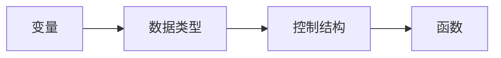

                 

# Python语言基础原理与代码实战案例讲解

## 关键词：Python语言，基础原理，代码实战，算法原理，数学模型，项目实战

## 摘要：
本文将深入探讨Python语言的基础原理，结合实际代码实战案例，讲解Python的核心概念、算法原理和数学模型。通过本文的学习，读者可以全面掌握Python的基础知识，并能够运用Python解决实际问题。文章还将推荐实用的学习资源和工具，帮助读者进一步提升Python技能。

## 1. 背景介绍

Python是一种高级编程语言，自1991年诞生以来，因其简洁明了的语法和强大的功能，迅速成为最受欢迎的编程语言之一。Python广泛应用于数据分析、人工智能、Web开发、自动化等领域。其简洁的语法让开发者能够用更少的代码完成更多的工作，提高了开发效率。

本文将重点介绍Python的基础原理，包括核心概念、数据结构、函数、模块等，并通过实际代码案例来深入讲解Python的算法原理和数学模型。同时，文章还将结合实际项目，帮助读者将所学知识应用于实际开发中。

## 2. 核心概念与联系

### 2.1 Python的核心概念

- **变量**：变量是存储数据的容器，如`x = 10`，其中`x`是变量，`10`是存储在变量`x`中的值。
- **数据类型**：Python中的数据类型包括整数（`int`）、浮点数（`float`）、字符串（`str`）、列表（`list`）、元组（`tuple`）、集合（`set`）、字典（`dict`）等。
- **控制结构**：包括条件语句（`if`、`elif`、`else`）、循环语句（`for`、`while`）等。
- **函数**：函数是组织代码的重要方式，通过定义函数，可以将一组操作封装在一起，便于重用。

### 2.2 Mermaid流程图

下面是一个简单的Mermaid流程图，展示了Python的核心概念及其相互关系：



### 2.3 Python的数据结构

Python中的数据结构包括列表、元组、集合、字典等。每种数据结构都有其独特的特点和用途。

- **列表（List）**：列表是一种有序集合，可以包含不同类型的数据。例如：`my_list = [1, 'hello', 3.14]`。
- **元组（Tuple）**：元组是一种不可变的有序集合，常用于存储一组相关联的数据。例如：`my_tuple = (1, 'hello', 3.14)`。
- **集合（Set）**：集合是一种无序且不可重复的集合，常用于去除重复元素或进行集合运算。例如：`my_set = {1, 2, 3, 4, 5}`。
- **字典（Dict）**：字典是一种无序的键值对集合，常用于存储大量数据。例如：`my_dict = {'name': 'Alice', 'age': 25}`。

## 3. 核心算法原理 & 具体操作步骤

### 3.1 排序算法

排序算法是计算机科学中的一种重要算法，Python提供了多种排序方法。其中，最常用的是`sorted()`函数和`list.sort()`方法。

- **sorted()函数**：`sorted()`函数对列表进行排序，返回一个新的列表。例如：

  ```python
  my_list = [3, 1, 4, 1, 5, 9]
  sorted_list = sorted(my_list)
  print(sorted_list)  # 输出：[1, 1, 3, 4, 5, 9]
  ```

- **list.sort()方法**：`list.sort()`方法对列表进行原地排序，不会返回新列表。例如：

  ```python
  my_list = [3, 1, 4, 1, 5, 9]
  my_list.sort()
  print(my_list)  # 输出：[1, 1, 3, 4, 5, 9]
  ```

### 3.2 搜索算法

搜索算法用于在列表中查找特定元素。Python提供了`index()`方法和`count()`方法来实现搜索功能。

- **index()方法**：`index()`方法返回指定元素的索引。例如：

  ```python
  my_list = [1, 2, 3, 4, 5]
  index = my_list.index(3)
  print(index)  # 输出：2
  ```

- **count()方法**：`count()`方法返回指定元素在列表中出现的次数。例如：

  ```python
  my_list = [1, 2, 3, 4, 5, 3, 3]
  count = my_list.count(3)
  print(count)  # 输出：3
  ```

### 3.3 列表切片

列表切片是一种常用的操作，用于从列表中获取一部分元素。切片操作通过指定起始索引、结束索引和步长来实现。例如：

```python
my_list = [1, 2, 3, 4, 5, 6, 7, 8, 9]
sub_list = my_list[2:6:2]  # 从索引2开始，到索引6结束，步长为2
print(sub_list)  # 输出：[3, 5]
```

## 4. 数学模型和公式 & 详细讲解 & 举例说明

### 4.1 欧几里得算法

欧几里得算法是一种求解最大公约数（GCD）的算法。其基本原理是：两个正整数的最大公约数等于其中较小数和两数差的较大公约数。以下是一个使用欧几里得算法计算最大公约数的示例：

```python
def gcd(a, b):
    while b:
        a, b = b, a % b
    return a

print(gcd(12, 18))  # 输出：6
```

### 4.2 二分查找算法

二分查找算法是一种在有序列表中查找特定元素的算法。其基本原理是：将列表分为两部分，比较中间元素和目标元素的大小，根据比较结果确定下一次查找的范围。以下是一个使用二分查找算法的示例：

```python
def binary_search(arr, target):
    low = 0
    high = len(arr) - 1

    while low <= high:
        mid = (low + high) // 2
        if arr[mid] == target:
            return mid
        elif arr[mid] < target:
            low = mid + 1
        else:
            high = mid - 1

    return -1

arr = [1, 2, 3, 4, 5, 6, 7, 8, 9]
target = 6
print(binary_search(arr, target))  # 输出：5
```

## 5. 项目实战：代码实际案例和详细解释说明

### 5.1 开发环境搭建

在开始编写Python代码之前，需要先搭建Python开发环境。以下是搭建Python开发环境的步骤：

1. 下载并安装Python：从Python官方网站（https://www.python.org/）下载并安装Python。
2. 配置Python环境变量：在系统环境变量中配置Python的安装路径，以便在命令行中调用Python。
3. 安装Python解释器：安装Python解释器，以便能够运行Python代码。

### 5.2 源代码详细实现和代码解读

以下是一个简单的Python代码示例，用于计算两个数的最大公约数。

```python
def gcd(a, b):
    while b:
        a, b = b, a % b
    return a

def main():
    num1 = int(input("请输入第一个数："))
    num2 = int(input("请输入第二个数："))
    result = gcd(num1, num2)
    print(f"{num1}和{num2}的最大公约数是：{result}")

if __name__ == "__main__":
    main()
```

代码解读：

1. **定义gcd函数**：`gcd`函数用于计算两个数的最大公约数。函数接收两个参数`a`和`b`，使用欧几里得算法计算最大公约数。
2. **while循环**：在`while`循环中，不断将`b`的值赋给`a`，将`a % b`的值赋给`b`，直到`b`的值为0。
3. **返回最大公约数**：当`b`的值为0时，跳出循环，返回`a`的值，即最大公约数。
4. **main函数**：`main`函数用于处理用户输入，调用`gcd`函数计算最大公约数，并打印结果。
5. **if __name__ == "__main__":**：确保当此模块被直接运行时，`main`函数被执行。

### 5.3 代码解读与分析

1. **输入和输出**：程序首先提示用户输入两个数，然后计算这两个数的最大公约数，并打印结果。
2. **函数定义**：程序定义了一个名为`gcd`的函数，用于计算最大公约数。函数使用欧几里得算法，通过循环逐步计算最大公约数。
3. **循环结构**：在`while`循环中，程序不断将`b`的值赋给`a`，将`a % b`的值赋给`b`，直到`b`的值为0。
4. **返回值**：当`b`的值为0时，跳出循环，返回`a`的值，即最大公约数。

## 6. 实际应用场景

Python在多个实际应用场景中都有广泛的应用。以下是一些常见的应用场景：

- **数据分析**：Python的NumPy、Pandas等库为数据分析提供了强大的支持，可以轻松处理大量数据。
- **人工智能**：Python是人工智能领域的主要编程语言之一，拥有丰富的机器学习库，如TensorFlow、PyTorch等。
- **Web开发**：Python的Django、Flask等框架使得Web开发变得简单高效。
- **自动化**：Python的简单语法和丰富的库使其成为自动化脚本编写的主要语言。

## 7. 工具和资源推荐

### 7.1 学习资源推荐

- **书籍**：
  - 《Python编程：从入门到实践》
  - 《流畅的Python》
  - 《Effective Python：编写更好的Python代码》
- **论文**：
  - 《Python语言的设计与实现》
  - 《Python性能优化：面向生产环境的性能调优》
- **博客**：
  - Real Python（https://realpython.com/）
  - Python官方博客（https://www.python.org/blogs/）
- **网站**：
  - Python官方网站（https://www.python.org/）
  - Python文档（https://docs.python.org/3/）

### 7.2 开发工具框架推荐

- **集成开发环境（IDE）**：
  - PyCharm（https://www.jetbrains.com/pycharm/）
  - Visual Studio Code（https://code.visualstudio.com/）
- **库和框架**：
  - NumPy（https://numpy.org/）
  - Pandas（https://pandas.pydata.org/）
  - TensorFlow（https://www.tensorflow.org/）
  - Flask（https://flask.palletsprojects.com/）

### 7.3 相关论文著作推荐

- 《Python语言的设计与实现》
- 《Python性能优化：面向生产环境的性能调优》
- 《流畅的Python》

## 8. 总结：未来发展趋势与挑战

Python作为一种功能强大且易于学习的编程语言，在未来将继续保持其受欢迎程度。随着人工智能、大数据和云计算等领域的快速发展，Python的应用场景将更加广泛。然而，Python也存在一些挑战，如性能瓶颈、安全性问题等。为了解决这些问题，Python社区将继续改进Python语言，推出更高效、更安全的版本。

## 9. 附录：常见问题与解答

### 问题1：如何安装Python？
**解答**：请访问Python官方网站（https://www.python.org/），下载并安装Python。安装过程中，确保勾选“Add Python to PATH”选项，以便在命令行中调用Python。

### 问题2：如何运行Python代码？
**解答**：在命令行中输入`python`（或`python3`，取决于您的系统），然后输入Python代码。按`Ctrl + D`（Windows）或`Ctrl + Z`（Linux / macOS）保存并退出。您也可以使用集成开发环境（IDE）来运行Python代码。

## 10. 扩展阅读 & 参考资料

- 《Python编程：从入门到实践》
- 《流畅的Python》
- 《Effective Python：编写更好的Python代码》
- 《Python语言的设计与实现》
- 《Python性能优化：面向生产环境的性能调优》
- https://realpython.com/
- https://www.python.org/blogs/
- https://www.jetbrains.com/pycharm/
- https://code.visualstudio.com/
- https://numpy.org/
- https://pandas.pydata.org/
- https://www.tensorflow.org/
- https://flask.palletsprojects.com/

