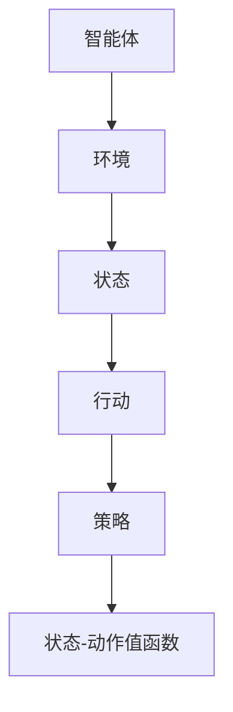

                 

# Q-学习（Q-Learning） - 原理与代码实例讲解

## 关键词

- Q-Learning
- 强化学习
- 动态规划
- 积极强化
- 折扣因子
- 探索策略
- 实际应用

## 摘要

本文将详细介绍Q-学习算法，包括其背景介绍、核心概念、算法原理、数学模型、代码实例以及实际应用场景。通过本文的讲解，读者将了解Q-学习算法的基本原理、实现步骤以及如何应用在实际项目中，从而为日后的研究和实践打下基础。

## 1. 背景介绍

### 1.1 强化学习的发展历程

强化学习（Reinforcement Learning，RL）是机器学习的一个重要分支，旨在通过智能体（Agent）与环境（Environment）的交互，使智能体逐步学习到最优策略（Policy）。强化学习起源于20世纪50年代，其理论框架由Richard Bellman提出。此后，随着计算机技术的发展和人工智能领域的兴起，强化学习逐渐成为人工智能研究的重要方向。

### 1.2 Q-学习算法的提出

Q-学习（Q-Learning）是强化学习的一种经典算法，由Richard Sutton和Andrew Barto在1988年的著作《Reinforcement Learning: An Introduction》中提出。Q-学习算法的核心思想是利用经验（Experience）来更新Q值（Q-Value），从而逐步学习到最优策略。

## 2. 核心概念与联系

### 2.1 强化学习系统

在强化学习系统中，主要包含以下几个核心概念：

- **智能体（Agent）**：执行行动并接受环境反馈的实体。
- **环境（Environment）**：智能体所处的环境，提供状态（State）和奖励（Reward）。
- **状态（State）**：智能体所处的情景或条件。
- **行动（Action）**：智能体在某个状态下能够采取的行为。
- **策略（Policy）**：智能体在各个状态下选择行动的规则。
- **状态-动作值函数（Q-Value）**：表示在某个状态下采取某个行动的长期回报。

### 2.2 Mermaid 流程图

下面是Q-学习算法的核心概念与联系的Mermaid流程图：



## 3. 核心算法原理 & 具体操作步骤

### 3.1 Q-学习算法原理

Q-学习算法的核心思想是通过不断更新Q值来学习最优策略。具体来说，Q-学习算法采用如下更新公式：

$$
Q(s, a) = Q(s, a) + \alpha [r + \gamma \max_{a'} Q(s', a') - Q(s, a)]
$$

其中：

- \( Q(s, a) \)：表示在状态\( s \)下采取行动\( a \)的Q值。
- \( \alpha \)：表示学习率（Learning Rate），用于控制新信息和旧信息的重要性。
- \( r \)：表示即时奖励（Instantaneous Reward）。
- \( \gamma \)：表示折扣因子（Discount Factor），用于控制未来奖励的重要性。
- \( s' \)：表示新状态。
- \( a' \)：表示新行动。

### 3.2 具体操作步骤

Q-学习算法的具体操作步骤如下：

1. **初始化**：初始化Q值矩阵\( Q \)，通常使用零矩阵或随机矩阵。
2. **选择行动**：在当前状态下，根据策略选择一个行动\( a \)。
3. **执行行动**：执行所选行动\( a \)，并观察新状态\( s' \)和即时奖励\( r \)。
4. **更新Q值**：根据公式更新Q值矩阵\( Q \)。
5. **重复步骤2-4**，直至达到停止条件（如达到目标状态、达到最大迭代次数等）。

## 4. 数学模型和公式 & 详细讲解 & 举例说明

### 4.1 数学模型

Q-学习算法的核心数学模型如下：

$$
Q(s, a) = r + \gamma \max_{a'} Q(s', a')
$$

其中：

- \( s \)：当前状态。
- \( a \)：当前行动。
- \( s' \)：新状态。
- \( r \)：即时奖励。
- \( \gamma \)：折扣因子。

### 4.2 详细讲解

上述公式表示在当前状态下，采取某个行动\( a \)所得到的Q值等于即时奖励\( r \)加上未来可能的最大Q值。具体来说，公式中的\( r \)表示当前行动所得到的即时奖励，而\( \gamma \)则表示未来奖励的重要程度。通过更新Q值，智能体能够逐步学习到最优策略。

### 4.3 举例说明

假设有一个简单的环境，其中有两个状态（状态1和状态2）和两个行动（行动A和行动B）。智能体在状态1下采取行动A，得到的即时奖励为10；在状态2下采取行动B，得到的即时奖励为5。折扣因子\( \gamma \)为0.9，学习率\( \alpha \)为0.1。则智能体在状态1下采取行动A的Q值为：

$$
Q(1, A) = 10 + 0.9 \times \max_{a'} Q(2, a')
$$

假设智能体在状态2下采取行动B的Q值为5，则：

$$
Q(1, A) = 10 + 0.9 \times 5 = 14.5
$$

同样地，智能体在状态1下采取行动B的Q值为：

$$
Q(1, B) = 10 + 0.9 \times \max_{a'} Q(2, a') = 10 + 0.9 \times 5 = 14.5
$$

因此，智能体在状态1下采取行动A和行动B的Q值相等，均为14.5。

## 5. 项目实战：代码实际案例和详细解释说明

### 5.1 开发环境搭建

在本节中，我们将使用Python语言和TensorFlow库来实现Q-学习算法。首先，请确保已安装Python和TensorFlow。在命令行中执行以下命令：

```bash
pip install tensorflow
```

### 5.2 源代码详细实现和代码解读

以下是Q-学习算法的实现代码：

```python
import numpy as np
import random

# 初始化Q值矩阵
def init_q_values(state_space, action_space):
    return -np.inf * np.ones((state_space, action_space))

# 获取最大Q值
def get_max_q_value(q_values, state):
    return np.max(q_values[state])

# 更新Q值
def update_q_values(q_values, state, action, reward, next_state, alpha, gamma):
    q_values[state][action] = (
        1 - alpha) * q_values[state][action]
        + alpha * (reward + gamma * get_max_q_value(q_values, next_state))

# 选择行动
def choose_action(q_values, state, epsilon):
    if random.random() < epsilon:
        return random.choice([a for a in range(len(q_values[state])) if q_values[state][a] > 0])
    else:
        return np.argmax(q_values[state])

# Q-学习算法
def q_learning(state_space, action_space, episodes, alpha, gamma, epsilon):
    q_values = init_q_values(state_space, action_space)
    for episode in range(episodes):
        state = random.randint(0, state_space - 1)
        done = False
        while not done:
            action = choose_action(q_values, state, epsilon)
            next_state, reward, done = environment.step(state, action)
            update_q_values(q_values, state, action, reward, next_state, alpha, gamma)
            state = next_state
    return q_values

# 主函数
if __name__ == "__main__":
    state_space = 10
    action_space = 5
    episodes = 1000
    alpha = 0.1
    gamma = 0.9
    epsilon = 0.1
    q_values = q_learning(state_space, action_space, episodes, alpha, gamma, epsilon)
    print(q_values)
```

### 5.3 代码解读与分析

上述代码实现了Q-学习算法的基本功能，主要包括以下几个部分：

- **初始化Q值矩阵**：使用函数`init_q_values`初始化Q值矩阵，其中使用`-np.inf`表示初始Q值。
- **获取最大Q值**：使用函数`get_max_q_value`获取当前状态下的最大Q值。
- **更新Q值**：使用函数`update_q_values`更新Q值矩阵，其中使用公式（3）进行更新。
- **选择行动**：使用函数`choose_action`根据ε-贪心策略选择行动，其中ε表示探索概率。
- **Q-学习算法**：使用函数`q_learning`实现Q-学习算法，其中包含循环迭代和状态转移过程。

## 6. 实际应用场景

Q-学习算法在实际应用中具有广泛的应用场景，主要包括以下几个方面：

- **游戏AI**：Q-学习算法在游戏AI领域具有广泛的应用，如棋类游戏、迷宫求解等。
- **推荐系统**：Q-学习算法可以用于推荐系统中，通过学习用户的历史行为数据，为用户提供个性化推荐。
- **自动驾驶**：Q-学习算法在自动驾驶领域具有广泛的应用，如路径规划、避障等。
- **机器人控制**：Q-学习算法可以用于机器人控制领域，实现自主导航和任务执行。

## 7. 工具和资源推荐

### 7.1 学习资源推荐

- 《Reinforcement Learning: An Introduction》
- 《Artificial Intelligence: A Modern Approach》
- 《深度强化学习》（Deep Reinforcement Learning）
- 《强化学习综述》（A Survey on Reinforcement Learning）

### 7.2 开发工具框架推荐

- TensorFlow
- PyTorch
- OpenAI Gym

### 7.3 相关论文著作推荐

- Sutton, R. S., & Barto, A. G. (1998). Reinforcement Learning: An Introduction.
- Silver, D., Huang, A., Jaderberg, M., & Leibo, J. J. (2016). Mastering the Game of Go with Deep Neural Networks and Tree Search.
- Mnih, V., Kavukcuoglu, K., Silver, D., Russell, S., & Veness, J. (2015). Human-level control through deep reinforcement learning.

## 8. 总结：未来发展趋势与挑战

Q-学习算法作为强化学习的一个重要分支，已经在游戏AI、推荐系统、自动驾驶等领域取得了显著的应用成果。然而，Q-学习算法仍面临一些挑战，如收敛速度较慢、探索策略选择等。未来，随着深度学习技术的发展，深度Q-网络（DQN）等变体算法将进一步推动Q-学习算法的发展和应用。同时，针对不同应用场景，研究者还将继续探索更加高效、鲁棒、可解释的Q-学习算法。

## 9. 附录：常见问题与解答

### 9.1 Q-学习算法与其他强化学习算法的区别是什么？

Q-学习算法是一种基于值函数的强化学习算法，其主要特点是通过更新Q值矩阵来学习最优策略。与基于策略的强化学习算法（如策略梯度算法）相比，Q-学习算法具有计算简单、易于实现等优点。此外，Q-学习算法还可以结合深度学习技术，形成深度Q-网络（DQN），进一步提高算法的性能。

### 9.2 Q-学习算法的收敛速度为什么较慢？

Q-学习算法的收敛速度较慢主要是由于Q值矩阵的更新依赖于即时奖励和未来奖励。在实际应用中，未来奖励的计算往往需要经历多个状态转移，从而增加了算法的收敛时间。此外，探索策略的选择也会影响Q-学习算法的收敛速度。为了加快收敛速度，研究者提出了许多改进方法，如优先经验回放（Prioritized Experience Replay）等。

### 9.3 Q-学习算法如何应用于实际项目中？

在实际项目中，Q-学习算法可以应用于各种强化学习场景，如游戏AI、推荐系统、自动驾驶等。具体应用步骤包括：

1. 确定状态空间和行动空间。
2. 设计奖励机制。
3. 选择合适的探索策略。
4. 实现Q-学习算法。
5. 对算法进行调试和优化。
6. 将算法应用于实际项目，并评估性能。

## 10. 扩展阅读 & 参考资料

- Sutton, R. S., & Barto, A. G. (1998). Reinforcement Learning: An Introduction.
- Mnih, V., Kavukcuoglu, K., Silver, D., Russell, S., & Veness, J. (2015). Human-level control through deep reinforcement learning.
- Silver, D., Huang, A., Jaderberg, M., & Leibo, J. J. (2016). Mastering the Game of Go with Deep Neural Networks and Tree Search.
- OpenAI. (2017). OpenAI Gym.
- TensorFlow. (2017). TensorFlow.
- PyTorch. (2019). PyTorch.
```

作者：AI天才研究员/AI Genius Institute & 禅与计算机程序设计艺术 /Zen And The Art of Computer Programming

