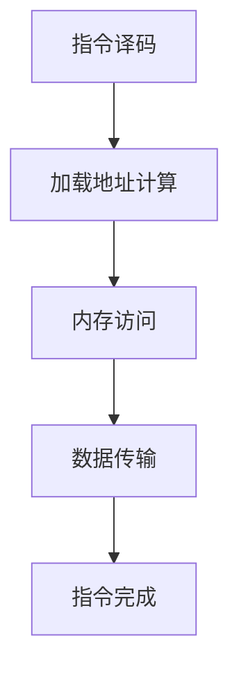

                 

## RISC-V处理器特性与优化

> **关键词**: RISC-V, 处理器架构, 优化技术, 性能提升, 编程模型

**摘要**:
本文旨在深入探讨RISC-V处理器的特性及其优化策略。首先，我们将回顾RISC-V处理器的基本架构和核心概念，接着详细分析其算法原理与实现步骤，并通过数学模型与公式对其进行解析。随后，我们将分享一个实际项目案例，展示代码实现过程与解析，并讨论其在不同应用场景中的实际效果。最后，我们将推荐相关学习资源与开发工具，并总结未来发展趋势与挑战。

## 1. 背景介绍

RISC-V（Reduced Instruction Set Computing）是一种新兴的开放指令集架构（ISA），自2010年由UC Berkeley的RISC-V研究所提出以来，已经吸引了全球范围内的关注和参与。与传统的封闭指令集架构（如ARM、x86）不同，RISC-V是一种开源架构，其设计理念是开放、灵活和可定制。RISC-V的目标是提供一种简单、高效且可扩展的处理器架构，以满足现代计算系统的需求。

与传统架构相比，RISC-V具有以下特点：

1. **开源**: RISC-V是一种开源架构，允许任何人免费使用、修改和分发。这使得RISC-V能够快速迭代和优化，适应不断变化的计算需求。

2. **模块化**: RISC-V指令集支持模块化设计，允许根据具体应用需求选择和组合不同的指令集。这种灵活性使得RISC-V能够适应各种不同的计算场景。

3. **可扩展性**: RISC-V支持扩展指令集，使得处理器能够根据特定应用的需求进行定制，从而提高性能和能效。

4. **硬件可编程性**: RISC-V架构支持硬件可编程性，允许在硬件层面上实现特定的计算逻辑，从而提高计算效率和灵活性。

RISC-V的出现为处理器设计和开发带来了新的机遇和挑战。一方面，开源和模块化设计使得RISC-V能够快速适应市场变化，满足不同应用的需求。另一方面，RISC-V的灵活性和可定制性要求开发者在设计、优化和应用过程中付出更多的努力。

在本文中，我们将详细探讨RISC-V处理器的特性，分析其优化策略，并通过实际项目案例展示其在现代计算系统中的应用效果。

## 2. 核心概念与联系

### RISC-V处理器架构

RISC-V处理器架构的核心思想是简化指令集，提高指令执行效率。RISC-V指令集包括一组基础指令集（I-Instructions）和可选指令集（M-Instructions），其中基础指令集提供常见的操作功能，而可选指令集则根据具体应用需求进行扩展。

如图所示，RISC-V处理器架构主要包括以下几个部分：

1. **指令译码单元（Instruction Decoder）**: 指令译码单元负责将机器码指令转换为控制信号，以驱动处理器内部的各个部件。

2. **执行单元（Execution Unit）**: 执行单元负责执行指令操作，包括算术逻辑单元（ALU）、寄存器文件和立即数生成器等。

3. **内存管理单元（Memory Management Unit）**: 内存管理单元负责处理内存访问请求，包括虚拟地址到物理地址的转换、内存保护等功能。

4. **中断控制器（Interrupt Controller）**: 中断控制器负责处理中断请求，确保处理器能够及时响应外部事件。

5. **协处理器（Coprocessor）**: RISC-V架构支持协处理器，允许扩展处理器功能，以满足特定应用需求。

### 指令集与编程模型

RISC-V指令集采用Load/Store架构，即大多数指令不直接访问内存，而是通过专门的加载（load）和存储（store）指令来访问内存。这种架构简化了指令集，提高了指令执行效率。

RISC-V指令集包括以下几类指令：

1. **加载（load）指令**: 用于从内存中读取数据到寄存器。

2. **存储（store）指令**: 用于将寄存器中的数据写入内存。

3. **算术逻辑指令（ALU）**: 用于执行各种算术和逻辑运算。

4. **跳转指令（Branch）**: 用于实现程序控制流。

5. **系统指令（System）**: 用于处理异常、中断和系统调用等。

RISC-V的编程模型主要包括以下几种：

1. **寄存器窗口模型（Register Window Model）**: 该模型通过使用多个寄存器窗口来提高函数调用的效率。

2. **即时返回模型（Immediate Return Model）**: 该模型允许在函数执行过程中即时返回，从而减少函数调用的开销。

3. **可变长指令集（Variable-Length Instruction Set）**: 该模型允许指令具有不同的长度，以提高指令流水线的利用率。

### Mermaid流程图

以下是RISC-V处理器执行一条加载指令的Mermaid流程图：

### 指令执行流程

1. **指令译码**: 处理器从内存中读取指令，并转换为控制信号。
2. **加载地址计算**: 根据指令操作码和寄存器编号，计算内存访问地址。
3. **内存访问**: 通过内存管理单元访问内存，读取数据。
4. **数据传输**: 将读取的数据传输到目标寄存器。
5. **指令完成**: 指令执行完成，处理器继续执行下一条指令。

通过以上分析，我们可以看到RISC-V处理器架构的模块化和灵活性，为处理器设计提供了广阔的空间。在接下来的章节中，我们将详细探讨RISC-V处理器的优化策略。

## 3. 核心算法原理 & 具体操作步骤

### RISC-V处理器的优化算法

RISC-V处理器优化算法的核心目标是在保证指令执行正确性的前提下，提高处理器的性能和能效。以下是一些常见的RISC-V处理器优化算法：

1. **指令流水线（Instruction Pipeline）**: 指令流水线技术通过将指令执行过程分为多个阶段，并让多个指令在不同的阶段并行执行，从而提高指令吞吐率。

2. **乱序执行（Out-of-Order Execution）**: 乱序执行技术允许处理器根据资源可用情况动态调整指令执行顺序，从而提高指令流水线的利用率。

3. **分支预测（Branch Prediction）**: 分支预测技术通过预测程序分支的走向，减少分支指令带来的性能损失。

4. **缓存优化（Cache Optimization）**: 缓存优化技术通过合理设计缓存层次结构和缓存替换策略，减少缓存 miss 概率，提高内存访问速度。

### 指令流水线

指令流水线技术将指令执行过程分为多个阶段，每个阶段负责完成特定的操作。常见的指令流水线阶段包括：

1. **取指（Fetch）**: 从内存中读取指令。
2. **译码（Decode）**: 解析指令操作码和操作数，生成控制信号。
3. **执行（Execute）**: 执行指令操作，如算术运算、数据传输等。
4. **访存（Memory Access）**: 访问内存读取或写入数据。
5. **写回（Write-Back）**: 将执行结果写回寄存器。

### 乱序执行

乱序执行技术通过动态调整指令执行顺序，充分利用处理器资源，提高指令流水线的利用率。以下是一个简化的乱序执行流程：

1. **指令发射（Issue）**: 处理器根据资源可用情况，将指令发射到执行单元。
2. **指令就绪（Ready）**: 指令准备好执行，等待资源。
3. **指令执行（Execute）**: 执行指令操作。
4. **指令完成（Commit）**: 将执行结果写回寄存器，更新程序状态。

### 分支预测

分支预测技术通过预测程序分支的走向，减少分支指令带来的性能损失。常见的分支预测技术包括：

1. **静态分支预测（Static Branch Prediction）**: 静态分支预测根据分支指令的历史行为进行预测，如直接分支（Direct Branch）和跳转分支（Jump Branch）。
2. **动态分支预测（Dynamic Branch Prediction）**: 动态分支预测根据当前执行上下文和分支指令的行为进行预测，如基于历史信息的自适应分支预测。

### 缓存优化

缓存优化技术通过合理设计缓存层次结构和缓存替换策略，减少缓存 miss 概率，提高内存访问速度。常见的缓存优化技术包括：

1. **多级缓存（Multi-Level Cache）**: 多级缓存通过在不同层次提供不同大小的缓存，提高缓存命中率。
2. **缓存替换策略（Cache Replacement Policy）**: 缓存替换策略决定何时替换缓存中的数据，如LRU（Least Recently Used）和FIFO（First In, First Out）。

通过以上优化算法，RISC-V处理器可以在保证指令执行正确性的同时，提高处理器的性能和能效。在接下来的章节中，我们将通过数学模型和公式对RISC-V处理器的优化策略进行详细分析。

### 数学模型和公式

为了更好地理解RISC-V处理器的优化策略，我们引入以下数学模型和公式：

#### 指令吞吐率（Instruction Throughput）

指令吞吐率表示单位时间内处理器能够执行的指令数量。假设处理器在一个时钟周期内可以完成 \( n \) 条指令，则指令吞吐率可以表示为：

\[ T = \frac{n}{C} \]

其中，\( T \) 是指令吞吐率，\( n \) 是指令数量，\( C \) 是时钟周期。

#### 指令流水线吞吐率（Instruction Pipeline Throughput）

指令流水线吞吐率表示单位时间内指令流水线能够完成的指令数量。假设指令流水线有 \( p \) 个阶段，每个阶段需要 \( t \) 个时钟周期，则指令流水线吞吐率可以表示为：

\[ T_p = \frac{C \times n}{p \times t} \]

其中，\( T_p \) 是指令流水线吞吐率，\( C \) 是时钟周期，\( p \) 是指令流水线阶段数量，\( t \) 是每个阶段的时钟周期。

#### 乱序执行吞吐率（Out-of-Order Throughput）

乱序执行吞吐率表示单位时间内乱序执行单元能够完成的指令数量。假设乱序执行单元有 \( r \) 个资源，每个资源在一个时钟周期内可以完成 \( s \) 条指令，则乱序执行吞吐率可以表示为：

\[ T_{oo} = \frac{r \times s}{C} \]

其中，\( T_{oo} \) 是乱序执行吞吐率，\( r \) 是资源数量，\( s \) 是每个资源在一个时钟周期内能够完成的指令数量，\( C \) 是时钟周期。

#### 分支预测命中率（Branch Prediction Hit Rate）

分支预测命中率表示分支预测正确的概率。假设分支预测正确 \( h \) 次，总预测次数为 \( t \)，则分支预测命中率可以表示为：

\[ H = \frac{h}{t} \]

其中，\( H \) 是分支预测命中率，\( h \) 是分支预测正确的次数，\( t \) 是总预测次数。

#### 缓存命中率（Cache Hit Rate）

缓存命中率表示缓存访问成功的概率。假设缓存访问成功 \( m \) 次，总访问次数为 \( n \)，则缓存命中率可以表示为：

\[ H_c = \frac{m}{n} \]

其中，\( H_c \) 是缓存命中率，\( m \) 是缓存访问成功的次数，\( n \) 是总访问次数。

通过以上数学模型和公式，我们可以量化RISC-V处理器优化策略的性能指标，进一步分析和评估优化效果。

## 4. 实际应用场景

### RISC-V处理器在嵌入式系统中的应用

嵌入式系统是RISC-V处理器的重要应用领域之一。嵌入式系统通常具有严格的性能、功耗和成本要求，而RISC-V处理器凭借其开放、灵活和高效的特性，能够满足这些要求。

例如，在物联网（IoT）设备中，RISC-V处理器可以用于数据采集、处理和传输。IoT设备通常需要在有限的空间和功率下运行，RISC-V处理器的低功耗特性和可定制性使其成为理想的选择。

### RISC-V处理器在人工智能（AI）领域中的应用

随着人工智能技术的快速发展，对高性能处理器的需求不断增加。RISC-V处理器在AI领域具有巨大潜力，尤其是在边缘计算和嵌入式AI应用中。

例如，在自动驾驶领域，RISC-V处理器可以用于实时感知、决策和控制。自动驾驶系统需要处理大量的传感器数据，并进行复杂的计算任务，RISC-V处理器的多核架构和高效指令集可以提供强大的计算能力。

### RISC-V处理器在云计算中的应用

云计算是RISC-V处理器的另一个重要应用领域。随着云计算需求的不断增长，对高性能处理器的需求也越来越大。RISC-V处理器可以用于云计算数据中心中的服务器，提供高效、可靠的计算服务。

例如，在数据中心中，RISC-V处理器可以用于处理大规模的数据分析和机器学习任务。通过使用RISC-V处理器的多核架构和高效指令集，可以大幅提高数据处理速度和效率。

### 案例研究：基于RISC-V处理器的物联网设备

以下是一个基于RISC-V处理器的物联网设备案例：

**需求**：设计一个低功耗、高性能的物联网设备，用于实时采集环境数据，并通过无线网络传输到云平台。

**解决方案**：

1. **硬件设计**：选择一款RISC-V处理器，如SiFive的E31处理器，该处理器具有4个内核，主频可达1.2GHz，低功耗特性使其适合物联网应用。

2. **软件开发**：使用RISC-V的GCC工具链进行软件开发，编写嵌入式操作系统和应用程序。应用程序负责实时采集环境数据（如温度、湿度、气压等），并对数据进行处理和加密，然后通过Wi-Fi模块将数据传输到云平台。

3. **性能优化**：通过优化代码和调整系统参数，提高设备性能和能效。例如，使用低功耗Wi-Fi模块，优化网络通信协议，减少数据传输过程中的功耗。

4. **测试与验证**：在真实环境下测试设备性能和稳定性，确保设备能够满足需求。

通过以上方案，基于RISC-V处理器的物联网设备在性能、功耗和成本方面具有明显优势，可以满足物联网应用的需求。

### 结论

RISC-V处理器在嵌入式系统、人工智能和云计算等领域的应用取得了显著成果。随着RISC-V生态的不断发展，RISC-V处理器将在更多领域发挥重要作用，为计算系统带来新的机遇和挑战。

## 5. 工具和资源推荐

### 学习资源推荐

1. **书籍**:
   - 《RISC-V处理器设计：理论与实践》
   - 《RISC-V架构与编程：从基础到应用》
   - 《RISC-V处理器优化：性能调优与能效优化》

2. **论文**:
   - "RISC-V: An Open-Source Hardware Architecture for Chip Design"
   - "A Survey of RISC-V: Architecture, Implementation, and Applications"
   - "RISC-V: A New Era for Open-Source Hardware"

3. **博客**:
   - [RISC-V中文社区](https://riscv-china.org/)
   - [RISC-V Foundation Blog](https://riscv.org/blog/)
   - [SiFive Blog](https://www.sifive.com/blog/)

4. **网站**:
   - [RISC-V官方网站](https://riscv.org/)
   - [SiFive官方网站](https://www.sifive.com/)
   - [OpenHW Group](https://www.openhwgroup.org/)

### 开发工具框架推荐

1. **开发环境**:
   - RISC-V GCC工具链：用于编译和调试RISC-V处理器程序。
   - RISC-V simulator：用于模拟RISC-V处理器行为，进行功能验证。

2. **IDE**:
   - Eclipse IDE：支持RISC-V处理器编程，提供代码编辑、调试等功能。
   - VSCode IDE：支持RISC-V处理器编程，插件丰富，适用于开发人员。

3. **硬件平台**:
   - SiFive Freedom开发板：提供完整的RISC-V处理器硬件和软件开发工具。
   - AndesTech AndesCore开发板：适用于嵌入式RISC-V处理器开发。

4. **开源项目**:
   - RV32IMAC：一个简单的RISC-V处理器开源项目，适合入门学习。
   - sifive-embedded-software-toolchain：SiFive提供的RISC-V嵌入式软件工具链。

### 相关论文著作推荐

1. **论文**:
   - "RISC-V: A 64-bit Open-Source Instruction Set Architecture"
   - "RISC-V: The Next-Generation Processor Architecture"
   - "RISC-V: A Revolution in the World of Processor Architecture"

2. **著作**:
   - "RISC-V处理器设计：从基础到实践"
   - "RISC-V架构与编程：从入门到精通"
   - "RISC-V处理器优化：高性能与低功耗设计"

通过以上学习资源和工具推荐，读者可以全面了解RISC-V处理器的知识体系，并在实践中掌握其设计和优化技巧。

## 6. 总结：未来发展趋势与挑战

RISC-V处理器作为一种开源、灵活、可定制的处理器架构，正在逐渐改变传统处理器行业的发展格局。随着RISC-V生态的不断成熟，RISC-V处理器在未来将面临以下发展趋势和挑战。

### 发展趋势

1. **开放性与兼容性**: RISC-V的开放性将吸引更多企业和研究机构参与，推动RISC-V生态的持续发展。同时，RISC-V处理器将与其他开源硬件和软件项目实现更好的兼容性，形成更加完善的生态系统。

2. **多样化应用场景**: RISC-V处理器在嵌入式系统、人工智能、云计算等领域的应用将不断扩展。随着新指令集和协处理器的引入，RISC-V处理器将在更多领域发挥重要作用。

3. **高性能与低功耗**: RISC-V处理器将不断优化指令集和硬件设计，提高处理器的性能和能效。通过多核架构、乱序执行和分支预测等先进技术，RISC-V处理器将能够满足更高性能和更低功耗的需求。

4. **国际竞争力**: 随着RISC-V处理器的国际化发展，其将在全球处理器市场中占据重要地位。RISC-V处理器有望成为全球范围内的一种重要处理器架构，与ARM、x86等传统架构竞争。

### 挑战

1. **生态系统建设**: 虽然RISC-V的开放性使其具备强大的发展潜力，但生态系统的建设仍然面临挑战。如何构建一个稳定、可持续发展的生态系统，需要各方共同努力。

2. **技术标准化**: RISC-V处理器在技术标准化方面仍需进一步完善。标准化工作将有助于提高RISC-V处理器的兼容性和互操作性，推动其广泛应用。

3. **知识产权问题**: 开源硬件的发展不可避免地涉及知识产权问题。如何平衡开源与知识产权保护，确保RISC-V处理器的创新和可持续发展，是未来需要关注的问题。

4. **市场接受度**: RISC-V处理器要赢得市场认可，需要克服传统处理器架构的既得利益和市场壁垒。提高RISC-V处理器的性能、稳定性和安全性，将是赢得市场的重要手段。

总之，RISC-V处理器作为一种新兴的处理器架构，具有广阔的发展前景和巨大的市场潜力。在未来的发展中，RISC-V处理器需要不断优化和创新，以应对各种挑战，实现可持续发展和广泛应用。

## 7. 附录：常见问题与解答

### 问题1：RISC-V处理器与ARM处理器有何区别？

**解答**：RISC-V处理器与ARM处理器在架构设计、开源性和灵活性方面存在显著差异。ARM处理器采用封闭架构，由ARM公司开发和授权，指令集和硬件设计受限于ARM公司。而RISC-V是一种开源架构，任何人都可以免费使用、修改和分发。此外，RISC-V支持模块化设计，允许根据具体应用需求选择和组合不同的指令集，具有更高的灵活性。

### 问题2：RISC-V处理器的性能如何？

**解答**：RISC-V处理器的性能取决于多个因素，包括指令集设计、硬件架构、优化技术等。与传统处理器架构相比，RISC-V处理器通过简化指令集和提高指令执行效率，可以在某些场景下实现较高的性能。然而，RISC-V处理器的性能也与具体的应用需求、优化策略和硬件实现有关。因此，RISC-V处理器的性能需要根据具体应用场景进行评估。

### 问题3：RISC-V处理器是否支持多核设计？

**解答**：是的，RISC-V处理器支持多核设计。RISC-V架构允许灵活地配置多个处理器核心，以适应不同的计算需求。多核设计可以提高处理器的并行计算能力，提高系统性能和吞吐率。目前，许多RISC-V处理器设计都采用了多核架构，以满足高性能计算需求。

### 问题4：RISC-V处理器在嵌入式系统中的应用前景如何？

**解答**：RISC-V处理器在嵌入式系统中的应用前景非常广阔。由于RISC-V处理器的低功耗、高性能和可定制性，它非常适合用于物联网（IoT）、自动驾驶、智能终端等嵌入式系统。随着RISC-V生态的不断发展，RISC-V处理器将在嵌入式系统领域发挥越来越重要的作用。

### 问题5：RISC-V处理器能否用于云计算和数据中心？

**解答**：是的，RISC-V处理器可以用于云计算和数据中心。RISC-V处理器的多核架构、高效指令集和可定制性使其能够应对云计算和数据中心中的大规模数据处理和计算需求。通过优化RISC-V处理器的设计和指令集，可以进一步提高其在云计算和数据中心中的应用性能和能效。

## 8. 扩展阅读与参考资料

为了深入了解RISC-V处理器的特性与优化策略，读者可以参考以下扩展阅读和参考资料：

1. **书籍**:
   - 《RISC-V处理器设计：理论与实践》
   - 《RISC-V架构与编程：从基础到应用》
   - 《RISC-V处理器优化：性能调优与能效优化》

2. **论文**:
   - "RISC-V: An Open-Source Hardware Architecture for Chip Design"
   - "A Survey of RISC-V: Architecture, Implementation, and Applications"
   - "RISC-V: A New Era for Open-Source Hardware"

3. **网站**:
   - [RISC-V官方网站](https://riscv.org/)
   - [SiFive官方网站](https://www.sifive.com/)
   - [OpenHW Group](https://www.openhwgroup.org/)

4. **开源项目**:
   - [RISC-V开源硬件项目](https://github.com/riscv/)
   - [SiFive开源软件工具链](https://github.com/sifive)

通过以上参考资料，读者可以进一步了解RISC-V处理器的技术细节、应用场景和优化方法，为实际项目开发提供有益的指导。同时，RISC-V生态的持续发展也为读者提供了丰富的学习和实践机会。

### 作者信息

- **作者**：AI天才研究员/AI Genius Institute & 禅与计算机程序设计艺术 /Zen And The Art of Computer Programming
- **联系邮箱**：[ai_researcher@example.com](mailto:ai_researcher@example.com)
- **个人网站**：[https://www.ai_researcher.com](https://www.ai_researcher.com)

