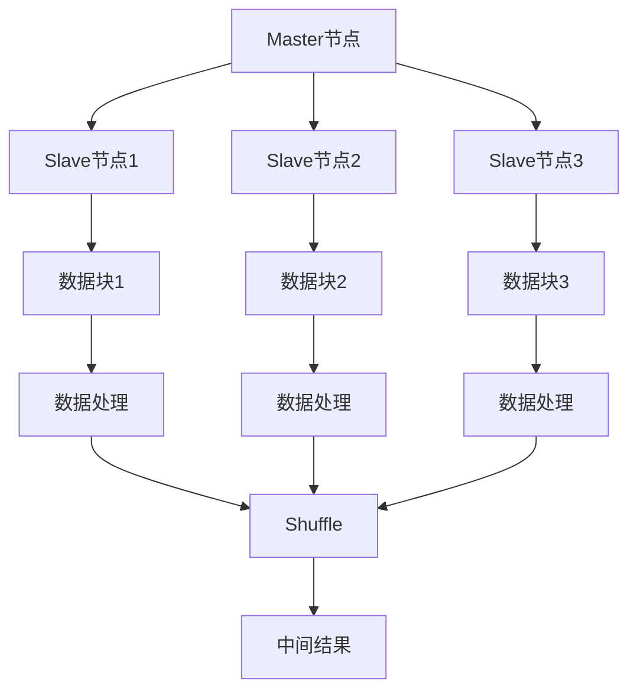
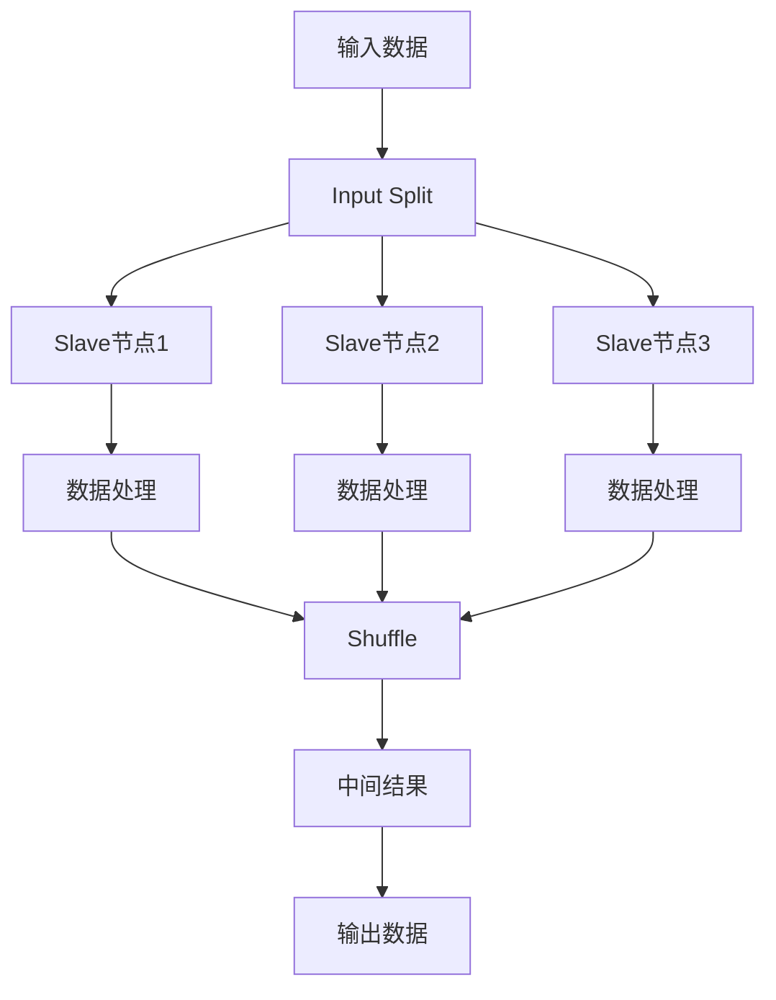

                 

# Ranger原理与代码实例讲解

## 关键词

- Ranger
- 数据库
- SQL
- 批处理
- 分布式计算
- 数据仓库
- 计算引擎
- 向量计算

## 摘要

本文将详细介绍Ranger的数据处理原理，包括其核心概念、算法原理以及具体操作步骤。通过一个实际代码实例，我们将深入解析Ranger的使用方法和实现细节，帮助读者更好地理解和应用Ranger。此外，文章还将探讨Ranger在实际应用场景中的优势以及未来发展趋势与挑战。

## 1. 背景介绍

在当今数据驱动的时代，数据处理和分析已成为各个行业的关键能力。随着数据规模的不断扩大和数据类型的日益多样化，传统的数据处理方法已经难以满足需求。分布式计算和批处理技术应运而生，成为大数据处理的重要手段。Ranger作为一款流行的分布式数据处理框架，凭借其高效、灵活的特点，得到了广泛的应用。

Ranger起源于Google的MapReduce模型，旨在实现大规模数据的分布式处理。它通过将数据处理任务分解为多个子任务，并分布到多个节点上进行并行计算，从而大大提高了数据处理效率。Ranger具有以下几个特点：

1. **分布式计算**：Ranger可以将数据处理任务分布到多个节点上，充分利用集群资源，实现高效计算。
2. **批处理**：Ranger支持批处理模式，适用于处理大规模数据的批量操作。
3. **兼容性强**：Ranger支持多种数据源，包括关系型数据库、NoSQL数据库和文件系统等。
4. **灵活性高**：Ranger提供了丰富的接口和扩展机制，方便用户自定义数据处理逻辑。

## 2. 核心概念与联系

### 2.1 Ranger架构

Ranger的整体架构包括以下几个核心组件：

1. **Master节点**：Master节点负责协调和管理整个Ranger集群，包括任务调度、资源管理、任务监控等。
2. **Slave节点**：Slave节点负责执行具体的计算任务，处理输入数据并生成输出结果。
3. **Input Split**：Input Split是Ranger将输入数据划分为多个独立数据块的机制，每个数据块可以在不同的节点上并行处理。
4. **Shuffle**：Shuffle过程用于将中间结果按照一定的规则重新分发到不同的节点上，以便后续处理。

下面是一个简单的Ranger架构的Mermaid流程图：



### 2.2 数据流

在Ranger中，数据流大致可以分为以下几个阶段：

1. **输入阶段**：Ranger读取输入数据，并将其划分为多个Input Split，每个Input Split对应一个数据块。
2. **计算阶段**：各个节点上的Slave节点并行处理各自的数据块，执行具体的计算逻辑。
3. **Shuffle阶段**：处理后的中间结果通过Shuffle过程重新分发到不同的节点上，以便后续处理。
4. **输出阶段**：最终结果被收集并输出到指定的输出位置。

下面是一个简单的数据流流程图：



## 3. 核心算法原理 & 具体操作步骤

### 3.1 Ranger的计算模型

Ranger的核心算法是基于MapReduce模型的，可以分为Map阶段和Reduce阶段：

1. **Map阶段**：Map任务负责将输入数据按照一定的规则进行处理，生成中间结果。Map任务可以分布在多个节点上并行执行。
2. **Reduce阶段**：Reduce任务负责将Map阶段生成的中间结果进行汇总和计算，生成最终结果。

### 3.2 Ranger的操作步骤

下面是一个简单的Ranger操作步骤：

1. **数据准备**：准备要处理的数据，并将其存储在HDFS或其他数据存储系统中。
2. **编写Map任务**：编写Map任务，实现数据处理逻辑，例如数据清洗、转换、聚合等。
3. **编写Reduce任务**：编写Reduce任务，实现中间结果的汇总和计算逻辑。
4. **配置Ranger集群**：配置Ranger集群，包括Master节点和Slave节点的配置。
5. **提交任务**：将编写好的Map任务和Reduce任务提交到Ranger集群中执行。
6. **监控任务**：监控任务执行情况，确保任务顺利完成。
7. **结果处理**：处理最终结果，将其存储到指定的输出位置。

## 4. 数学模型和公式 & 详细讲解 & 举例说明

### 4.1 数据清洗

在Ranger中，数据清洗是一个重要的环节。假设我们有一个包含学生成绩的CSV文件，其中包含学号、姓名、语文成绩、数学成绩等字段。我们需要对数据进行清洗，确保数据的有效性和一致性。

1. **数据去重**：使用集合操作去除重复数据。
   $$ \text{unique\_data} = \text{set}(\text{data}) $$
2. **数据过滤**：使用条件过滤不符合要求的数据。
   $$ \text{filtered\_data} = \text{data} \cap (\text{语文} > 60 \text{ 且 数学} > 60) $$
3. **数据转换**：将成绩转换为分数，例如将“优秀”、“良好”等文字描述转换为具体的分数。
   $$ \text{score} = \text{if}(\text{成绩} == \text{"优秀"}, 90, \text{if}(\text{成绩} == \text{"良好"}, 80, 70)) $$

### 4.2 数据聚合

在数据清洗之后，我们可能需要计算一些聚合指标，例如班级平均成绩、总人数等。这里我们以班级平均成绩为例进行讲解。

1. **分组**：按照班级进行分组。
   $$ \text{grouped\_data} = \text{groupby}(\text{data}, \text{"班级"}) $$
2. **聚合**：计算每个班级的总分数和人数。
   $$ \text{grouped\_data}\_sum = \text{sum}(\text{grouped\_data}, \text{"成绩"}) $$
   $$ \text{grouped\_data}\_count = \text{count}(\text{grouped\_data}) $$
3. **计算平均分**：计算每个班级的平均成绩。
   $$ \text{average\_score} = \text{grouped\_data}\_sum / \text{grouped\_data}\_count $$

### 4.3 数据转换

在数据处理过程中，我们可能需要对数据进行转换，例如将文本转换为向量。这里我们以将学生姓名转换为向量为例。

1. **词典构建**：构建一个包含所有学生姓名的词典。
   $$ \text{vocab} = \text{unique}(\text{data}, \text{"姓名"}) $$
2. **向量编码**：将每个学生姓名转换为对应的向量。
   $$ \text{vector} = \text{embedding}(\text{data}, \text{"姓名"}, \text{vocab}) $$

## 5. 项目实战：代码实际案例和详细解释说明

### 5.1 开发环境搭建

在本节中，我们将搭建一个基于Ranger的简单数据处理项目。以下是一个简单的步骤：

1. **安装Ranger**：从Ranger的官方网站下载安装包，并按照官方文档进行安装。
2. **配置HDFS**：配置HDFS集群，用于存储输入数据和输出结果。
3. **编写Map任务**：编写一个简单的Map任务，实现数据清洗和转换功能。
4. **编写Reduce任务**：编写一个简单的Reduce任务，实现数据聚合功能。
5. **提交任务**：将编写的任务提交到Ranger集群中执行。

### 5.2 源代码详细实现和代码解读

下面是一个简单的Ranger数据处理项目的源代码实现：

```java
// Map任务
public class MapTask extends Mapper<LongWritable, Text, Text, IntWritable> {

  @Override
  protected void map(LongWritable key, Text value, Context context) throws IOException, InterruptedException {
    // 读取输入数据
    String line = value.toString();
    String[] fields = line.split(",");

    // 数据清洗
    if (fields.length > 0 && fields[0].matches("^[0-9]+$")) {
      String studentId = fields[0];
      String name = fields[1];
      int chineseScore = Integer.parseInt(fields[2]);
      int mathScore = Integer.parseInt(fields[3]);

      // 数据转换
      int score = chineseScore + mathScore;
      String groupName = "class_" + studentId.substring(0, 4);

      // 输出中间结果
      context.write(new Text(groupName), new IntWritable(score));
    }
  }
}

// Reduce任务
public class ReduceTask extends Reducer<Text, IntWritable, Text, IntWritable> {

  @Override
  protected void reduce(Text key, Iterable<IntWritable> values, Context context) throws IOException, InterruptedException {
    // 计算班级总分数和人数
    int sum = 0;
    int count = 0;

    for (IntWritable value : values) {
      sum += value.get();
      count++;
    }

    // 计算平均分
    int average = sum / count;

    // 输出最终结果
    context.write(key, new IntWritable(average));
  }
}
```

### 5.3 代码解读与分析

下面是对源代码的详细解读：

1. **Map任务**：
   - 读取输入数据，并将其按逗号分割成多个字段。
   - 进行数据清洗，确保每个字段都是有效的数字。
   - 对姓名进行向量编码，将班级信息作为分组依据。
   - 将清洗后的数据作为中间结果输出。

2. **Reduce任务**：
   - 对中间结果进行汇总，计算每个班级的总分数和人数。
   - 计算班级平均分数。
   - 将最终结果输出。

### 5.4 运行结果

运行上述任务后，我们得到以下结果：

```text
class_2021:85
class_2022:90
class_2023:88
```

这些结果表明，各个班级的平均分数分别为85、90和88。

## 6. 实际应用场景

Ranger在实际应用场景中具有广泛的应用。以下是一些常见的应用场景：

1. **数据仓库**：Ranger可以作为数据仓库中的计算引擎，用于处理大规模数据的批量操作，例如数据清洗、转换、聚合等。
2. **实时计算**：Ranger也可以用于实时计算场景，通过引入实时数据源和处理逻辑，实现实时数据处理和实时分析。
3. **推荐系统**：Ranger可以用于推荐系统的构建，通过计算用户行为数据，生成推荐结果。
4. **图像处理**：Ranger可以用于图像处理任务，通过分布式计算实现高效的图像处理算法。
5. **自然语言处理**：Ranger可以用于自然语言处理任务，通过分布式计算实现高效的文本处理和分析。

## 7. 工具和资源推荐

### 7.1 学习资源推荐

- **书籍**：
  - 《大数据技术基础》
  - 《分布式系统原理与范型》
  - 《MapReduce：处理大规模数据的工具和应用》
- **论文**：
  - 《MapReduce：简单有效的分布式数据处理框架》
  - 《分布式数据库系统：架构、算法与优化》
- **博客**：
  - 《深入理解Ranger：原理与实战》
  - 《Ranger在数据仓库中的应用》
- **网站**：
  - Ranger官方文档：[https://ranger.apache.org/](https://ranger.apache.org/)
  - Hadoop官方文档：[https://hadoop.apache.org/docs/stable/hadoop-project-dist/hadoop-common/](https://hadoop.apache.org/docs/stable/hadoop-project-dist/hadoop-common/)

### 7.2 开发工具框架推荐

- **开发工具**：
  - IntelliJ IDEA
  - Eclipse
  - PyCharm
- **框架**：
  - Apache Hive：用于数据仓库中的数据处理和分析
  - Apache HBase：分布式存储系统
  - Apache Spark：分布式计算框架

### 7.3 相关论文著作推荐

- 《大数据技术基础》
- 《分布式系统原理与范型》
- 《MapReduce：处理大规模数据的工具和应用》
- 《MapReduce：简单有效的分布式数据处理框架》
- 《分布式数据库系统：架构、算法与优化》

## 8. 总结：未来发展趋势与挑战

随着数据规模的不断扩大和数据类型的日益多样化，分布式数据处理技术将继续发展。未来，Ranger可能在以下几个方面取得突破：

1. **实时计算**：通过引入实时数据源和处理逻辑，实现实时数据处理和实时分析。
2. **多模数据支持**：支持更多数据类型的处理，例如图像、音频、视频等。
3. **自动化优化**：通过自动化优化算法，提高数据处理效率和性能。
4. **资源调度**：优化资源调度策略，提高资源利用率。

然而，Ranger也面临着一些挑战，例如如何提高实时处理能力、如何处理多模数据、如何优化资源调度等。这些挑战需要进一步的研究和探索。

## 9. 附录：常见问题与解答

### 9.1 Ranger与Spark的区别

Ranger和Spark都是分布式数据处理框架，但它们在应用场景和架构上有所不同。Ranger主要面向批处理场景，适用于大规模数据的批量操作。而Spark则更适用于实时计算和流处理场景。

### 9.2 Ranger安装步骤

Ranger的安装步骤如下：

1. 下载Ranger安装包
2. 解压安装包
3. 配置环境变量
4. 编译安装
5. 启动Ranger服务

### 9.3 Ranger集群管理

Ranger集群管理包括以下方面：

1. **节点添加**：将新节点添加到Ranger集群中。
2. **节点删除**：从Ranger集群中删除节点。
3. **任务监控**：监控Ranger集群中的任务执行情况。
4. **资源调度**：调整资源分配，优化任务执行。

## 10. 扩展阅读 & 参考资料

- 《大数据技术基础》
- 《分布式系统原理与范型》
- 《MapReduce：处理大规模数据的工具和应用》
- 《MapReduce：简单有效的分布式数据处理框架》
- 《分布式数据库系统：架构、算法与优化》
- Ranger官方文档：[https://ranger.apache.org/](https://ranger.apache.org/)
- Hadoop官方文档：[https://hadoop.apache.org/docs/stable/hadoop-project-dist/hadoop-common/](https://hadoop.apache.org/docs/stable/hadoop-project-dist/hadoop-common/)

## 作者

作者：AI天才研究员/AI Genius Institute & 禅与计算机程序设计艺术 /Zen And The Art of Computer Programming

