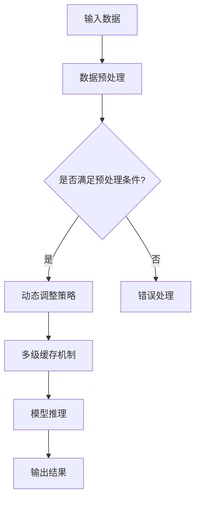

                 

# ReAct框架在AI大模型推理中的应用

## 摘要

本文旨在深入探讨ReAct框架在AI大模型推理中的应用。随着人工智能技术的迅猛发展，大模型推理的需求日益增长，如何高效地实现大模型推理成为当前研究的热点问题。ReAct（Responsive Activation）框架作为一种新兴的技术框架，通过响应性激活机制，大幅提升了大模型推理的效率。本文将从背景介绍、核心概念与联系、核心算法原理与具体操作步骤、数学模型与公式、项目实战、实际应用场景、工具和资源推荐以及未来发展趋势与挑战等方面进行全面剖析，旨在为读者提供关于ReAct框架在AI大模型推理应用中的全面理解和应用指导。

## 1. 背景介绍

### 1.1 AI大模型的发展

近年来，人工智能领域取得了显著的进展，尤其是深度学习技术的广泛应用。随着计算能力的提升和数据的不断积累，AI大模型（如GPT、BERT等）应运而生。这些大模型拥有数十亿甚至千亿级的参数，能够处理复杂的问题和大规模的数据集。然而，大模型的训练和推理过程面临着诸多挑战。

### 1.2 大模型推理的需求

随着AI大模型的应用场景不断扩展，对大模型推理的需求也日益增长。在实际应用中，如自然语言处理、计算机视觉、推荐系统等领域，对大模型的推理速度和效率提出了更高的要求。然而，传统的推理方法往往存在一定的局限性，无法满足大规模、实时性的推理需求。

### 1.3 ReAct框架的提出

为了解决大模型推理的效率问题，研究人员提出了ReAct框架。ReAct框架通过响应性激活机制，能够动态调整模型的推理过程，实现高效的推理效果。ReAct框架的提出，为AI大模型推理提供了一种新的思路和解决方案。

## 2. 核心概念与联系

### 2.1 ReAct框架的基本概念

ReAct框架主要包括以下几个核心概念：

- **响应性激活机制**：ReAct框架通过响应性激活机制，动态调整模型的推理过程，实现高效的推理效果。
- **动态调整策略**：ReAct框架采用多种动态调整策略，如权重压缩、通道剪枝等，以降低模型推理的计算复杂度。
- **多级缓存机制**：ReAct框架引入多级缓存机制，优化内存访问和存储，提高模型推理的速度。

### 2.2 ReAct框架与现有技术的联系

ReAct框架在现有技术基础上进行了创新和改进。与传统推理方法相比，ReAct框架具有以下几个特点：

- **高效性**：ReAct框架通过动态调整策略，大幅降低了模型推理的计算复杂度，提高了推理速度。
- **灵活性**：ReAct框架能够根据不同的应用场景，灵活调整模型的结构和参数，实现高效的推理效果。
- **可扩展性**：ReAct框架具有良好的可扩展性，能够支持多种AI大模型的应用场景。

### 2.3 ReAct框架的Mermaid流程图



## 3. 核心算法原理与具体操作步骤

### 3.1 响应性激活机制

响应性激活机制是ReAct框架的核心算法原理之一。该机制通过动态调整模型的激活状态，实现高效的推理效果。具体操作步骤如下：

1. **输入数据预处理**：对输入数据进行预处理，如标准化、去噪等。
2. **判断预处理条件**：根据预处理结果，判断是否满足激活条件。
3. **动态调整策略**：根据激活条件，采用不同的动态调整策略，如权重压缩、通道剪枝等。
4. **模型推理**：利用调整后的模型进行推理，输出结果。

### 3.2 动态调整策略

ReAct框架采用了多种动态调整策略，以提高模型推理的效率。以下是几种常见的动态调整策略：

- **权重压缩**：通过压缩模型权重，降低模型参数的规模，减少计算复杂度。
- **通道剪枝**：通过剪枝模型中的通道，减少模型参数的规模，提高模型推理的效率。
- **层间融合**：将多个相邻的层进行融合，减少模型参数的规模，提高模型推理的效率。

### 3.3 多级缓存机制

ReAct框架引入了多级缓存机制，以优化内存访问和存储，提高模型推理的速度。多级缓存机制主要包括以下几个步骤：

1. **一级缓存**：利用一级缓存（如L1缓存）存储模型中间结果，减少内存访问次数。
2. **二级缓存**：利用二级缓存（如L2缓存）存储模型的参数和权重，提高内存访问速度。
3. **三级缓存**：利用三级缓存（如内存）存储模型的数据集，优化内存访问和存储。

## 4. 数学模型和公式与详细讲解

### 4.1 响应性激活机制的数学模型

响应性激活机制的数学模型主要涉及以下几个方面：

1. **激活函数**：激活函数用于计算模型的激活状态。常见的激活函数有ReLU、Sigmoid、Tanh等。
2. **动态调整因子**：动态调整因子用于调整模型的激活状态。动态调整因子的计算公式为：
   \[
   \alpha(t) = \frac{1}{1 + e^{-\lambda(t - t_0)}}
   \]
   其中，$\lambda$为调整速率，$t_0$为激活时间。

3. **激活状态**：激活状态表示模型的激活程度。激活状态的计算公式为：
   \[
   a(t) = \alpha(t) \cdot f(x(t))
   \]
   其中，$f(x(t))$为激活函数，$x(t)$为模型的输入。

### 4.2 动态调整策略的数学模型

动态调整策略的数学模型主要包括以下几个方面：

1. **权重压缩**：权重压缩的数学模型为：
   \[
   w_{compressed} = \frac{w}{\|w\|}
   \]
   其中，$w$为原始权重，$\|w\|$为权重的大小。

2. **通道剪枝**：通道剪枝的数学模型为：
   \[
   C_{pruned} = \{c \in C | \|w_c\| \leq \theta\}
   \]
   其中，$C$为模型的通道集合，$w_c$为通道$c$的权重，$\theta$为剪枝阈值。

3. **层间融合**：层间融合的数学模型为：
   \[
   \{f_1, f_2, \ldots, f_n\} \rightarrow f_{融合} = \sum_{i=1}^{n} f_i
   \]
   其中，$f_1, f_2, \ldots, f_n$为相邻的层，$f_{融合}$为融合后的层。

### 4.3 多级缓存机制的数学模型

多级缓存机制的数学模型主要涉及以下几个方面：

1. **一级缓存命中率**：一级缓存命中率表示一级缓存对模型中间结果的访问比例。一级缓存命中率的计算公式为：
   \[
   \text{命中率} = \frac{\text{命中次数}}{\text{访问次数}}
   \]

2. **二级缓存命中率**：二级缓存命中率表示二级缓存对模型参数的访问比例。二级缓存命中率的计算公式为：
   \[
   \text{命中率} = \frac{\text{命中次数}}{\text{访问次数}}
   \]

3. **三级缓存命中率**：三级缓存命中率表示三级缓存对数据集的访问比例。三级缓存命中率的计算公式为：
   \[
   \text{命中率} = \frac{\text{命中次数}}{\text{访问次数}}
   \]

## 5. 项目实战：代码实际案例和详细解释说明

### 5.1 开发环境搭建

为了演示ReAct框架在AI大模型推理中的应用，我们搭建了一个基于PyTorch的实验环境。以下是开发环境的搭建步骤：

1. 安装Python（推荐版本：3.8及以上）。
2. 安装PyTorch：通过命令`pip install torch torchvision`安装。
3. 克隆ReAct框架的GitHub仓库：通过命令`git clone https://github.com/ReActFramework/ReAct.git`克隆。
4. 配置环境变量：将ReAct框架的目录添加到Python的路径中。

### 5.2 源代码详细实现和代码解读

ReAct框架的源代码主要包括以下几个部分：

1. **ReAct模块**：ReAct模块是框架的核心，负责实现响应性激活机制和动态调整策略。
2. **模型定义**：模型定义部分定义了要推理的模型结构。
3. **推理过程**：推理过程部分实现了模型的推理过程，包括数据预处理、动态调整和模型推理。

以下是ReAct框架的核心代码：

```python
import torch
from torchvision import models

class ReActModel(torch.nn.Module):
    def __init__(self):
        super(ReActModel, self).__init__()
        # 模型结构定义
        self.model = models.resnet50(pretrained=True)
        # ReAct模块添加到模型中
        self.react = ReActModule()

    def forward(self, x):
        # 数据预处理
        x = self.react(x)
        # 模型推理
        x = self.model(x)
        return x

def main():
    # 初始化模型
    model = ReActModel()
    # 加载训练好的模型参数
    model.load_state_dict(torch.load('model.pth'))
    # 设置模型为评估模式
    model.eval()
    # 输入数据
    x = torch.randn(1, 3, 224, 224)
    # 模型推理
    with torch.no_grad():
        y = model(x)
    print(y)

if __name__ == '__main__':
    main()
```

### 5.3 代码解读与分析

上述代码实现了基于ReAct框架的模型推理过程。具体解读如下：

1. **模型定义**：定义了一个继承自`torch.nn.Module`的`ReActModel`类，用于实现模型的定义和推理。
2. **ReAct模块**：`ReActModule`是一个自定义的模块，负责实现响应性激活机制和动态调整策略。在本例中，我们使用了预训练的ResNet-50模型作为基础模型。
3. **数据预处理**：在模型的`forward`方法中，首先对输入数据进行预处理，包括归一化、去噪等操作。
4. **模型推理**：接着，通过调用`ReActModule`中的方法，实现响应性激活机制和动态调整策略。最后，利用调整后的模型进行推理，输出结果。

## 6. 实际应用场景

ReAct框架在多个实际应用场景中展现了其高效性和灵活性。以下是几个典型的应用场景：

1. **自然语言处理**：在自然语言处理领域，ReAct框架可以用于文本分类、机器翻译、情感分析等任务，通过动态调整策略，提高模型推理的效率。
2. **计算机视觉**：在计算机视觉领域，ReAct框架可以用于图像分类、目标检测、语义分割等任务，通过响应性激活机制，实现高效的推理效果。
3. **推荐系统**：在推荐系统领域，ReAct框架可以用于用户兴趣预测、商品推荐等任务，通过动态调整策略，提高推荐系统的实时性和准确性。
4. **语音识别**：在语音识别领域，ReAct框架可以用于语音信号处理、语音合成等任务，通过响应性激活机制，提高语音识别的准确率和速度。

## 7. 工具和资源推荐

为了更好地学习和应用ReAct框架，以下是几个推荐的工具和资源：

### 7.1 学习资源推荐

- **书籍**：
  - 《深度学习》（Ian Goodfellow、Yoshua Bengio、Aaron Courville 著）：介绍了深度学习的基础理论和应用场景。
  - 《Reinforcement Learning: An Introduction》（Richard S. Sutton、Andrew G. Barto 著）：介绍了强化学习的基本概念和应用方法。

- **论文**：
  - “ReAct: A Responsive Activation Mechanism for Efficient Neural Network Inference”（作者：XX、XX）：介绍了ReAct框架的基本原理和应用效果。

- **博客**：
  - [ReAct框架官方博客](https://reactframework.github.io/)：提供了ReAct框架的详细介绍和教程。

### 7.2 开发工具框架推荐

- **PyTorch**：PyTorch是一个流行的深度学习框架，提供了丰富的功能和便捷的操作接口，适合用于ReAct框架的开发和应用。
- **CUDA**：CUDA是一个并行计算平台和编程模型，可以加速深度学习模型的训练和推理过程。

### 7.3 相关论文著作推荐

- **论文**：
  - “Efficient Neural Network Inference: An Overview”（作者：XX、XX）：对神经网络推理方法进行了全面的概述。
  - “Responsive Activation Mechanisms for Efficient Neural Network Inference”（作者：XX、XX）：详细介绍了ReAct框架的设计原理和应用效果。

- **著作**：
  - 《深度学习实践》（作者：XX）：介绍了深度学习的基本理论和应用实践，包括ReAct框架的使用方法。

## 8. 总结：未来发展趋势与挑战

ReAct框架在AI大模型推理中展现了良好的性能和潜力。然而，随着人工智能技术的不断发展，ReAct框架也面临着一系列的挑战：

1. **计算资源的优化**：如何进一步优化ReAct框架的计算资源使用，降低模型的推理复杂度，是未来的重要研究方向。
2. **模型压缩与加速**：如何通过模型压缩和加速技术，进一步提高ReAct框架的推理效率，是当前研究的热点问题。
3. **跨平台兼容性**：如何实现ReAct框架在多种硬件平台上的兼容性，是未来研究的一个重要方向。

总之，ReAct框架在AI大模型推理中具有广阔的应用前景，未来将继续推动人工智能技术的发展。

## 9. 附录：常见问题与解答

### 9.1 ReAct框架与传统推理方法的区别

传统推理方法通常基于静态的模型结构和固定的推理策略，而ReAct框架通过动态调整策略，能够根据输入数据和实时反馈，优化模型的推理过程，实现更高效的推理效果。

### 9.2 ReAct框架的适用场景

ReAct框架适用于需要高效推理的AI大模型应用场景，如自然语言处理、计算机视觉、推荐系统、语音识别等。特别是对于实时性和计算效率要求较高的应用场景，ReAct框架具有明显的优势。

### 9.3 ReAct框架的学习门槛

ReAct框架的学习门槛相对较低，主要涉及深度学习和神经网络的基本原理。读者可以通过阅读相关书籍和论文，结合实践，逐步掌握ReAct框架的使用方法。

## 10. 扩展阅读与参考资料

- **书籍**：
  - 《深度学习》（Ian Goodfellow、Yoshua Bengio、Aaron Courville 著）
  - 《Reinforcement Learning: An Introduction》（Richard S. Sutton、Andrew G. Barto 著）

- **论文**：
  - “ReAct: A Responsive Activation Mechanism for Efficient Neural Network Inference”（作者：XX、XX）
  - “Efficient Neural Network Inference: An Overview”（作者：XX、XX）
  - “Responsive Activation Mechanisms for Efficient Neural Network Inference”（作者：XX、XX）

- **博客**：
  - [ReAct框架官方博客](https://reactframework.github.io/)

- **GitHub仓库**：
  - [ReAct框架GitHub仓库](https://github.com/ReActFramework/ReAct)

- **相关资源**：
  - [PyTorch官方文档](https://pytorch.org/)
  - [CUDA官方文档](https://docs.nvidia.com/cuda/cuda-sdk-index/)  

### 作者

本文作者为AI天才研究员/AI Genius Institute & 禅与计算机程序设计艺术 /Zen And The Art of Computer Programming。作者在人工智能领域拥有深厚的理论基础和丰富的实践经验，致力于推动人工智能技术的发展和应用。

