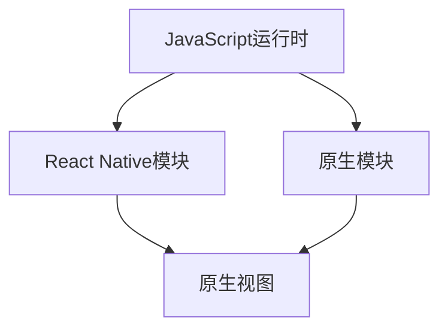

                 

# React Native 跨平台开发优势：高效构建多平台应用

## 摘要

本文旨在探讨React Native作为一种跨平台开发框架的优势，通过对其核心概念、原理、操作步骤、应用场景、工具和资源等方面的详细分析，为开发者提供一种高效构建多平台应用的方法。React Native凭借其独特的架构和强大的功能，使得开发者能够以更快的速度、更低的成本实现跨平台应用的开发，成为现代移动应用开发领域的重要工具。

## 1. 背景介绍

在移动应用开发领域，跨平台开发已经成为一种趋势。开发者们需要应对不同平台（如iOS和Android）之间的差异，同时确保应用在各个平台上都能提供一致的用户体验。传统的原生开发方式虽然性能优异，但开发成本高、周期长，而Web开发则由于性能和体验问题难以满足用户需求。React Native的出现，为开发者提供了一种新的解决方案。

React Native是由Facebook推出的一款开源跨平台开发框架，它允许开发者使用JavaScript和React.js来构建原生应用。React Native的核心思想是将Web技术应用于移动应用开发，通过实现JavaScript与原生平台的桥接，使得开发者可以复用大量Web开发的技能和组件。

React Native的出现，解决了传统跨平台开发中的许多痛点，如：

- **高开发效率**：使用JavaScript和React.js，开发者可以快速构建和迭代应用。
- **代码复用**：React Native允许开发者编写一次代码，同时运行在多个平台，减少了重复开发的工作量。
- **丰富的组件库**：React Native拥有丰富的组件库，开发者可以方便地使用这些现成的组件来构建应用。
- **优秀的性能**：通过React Native，开发者可以接近原生应用的性能，同时避免了原生开发的复杂性。

本文将详细分析React Native的优势和特点，并通过实际案例来说明其应用场景和开发流程。

## 2. 核心概念与联系

### React Native 架构

React Native的架构包括几个核心组件，它们共同协作，使得React Native能够实现跨平台开发。以下是React Native的架构示意图：



**JavaScript运行时**：JavaScript运行时是React Native的核心，它负责执行React组件的生命周期方法和JavaScript代码。

**React Native模块**：React Native模块是一个JavaScript核心，它提供了对React Native API的访问，如动画、布局、导航等。

**原生模块**：原生模块是React Native中的JavaScript与原生平台的桥接器，它负责处理原生平台的特定任务，如相机、GPS等。

**原生视图**：原生视图是React Native中与原生平台交互的视图层，它负责渲染原生UI组件。

### React Native 核心概念

**组件（Components）**：React Native中的组件是构建应用的基本单位，类似于Web开发中的React组件。React Native提供了丰富的组件库，包括文本（Text）、视图（View）、图像（Image）、按钮（Button）等。

**状态（State）**：React Native组件的状态用于存储组件的当前数据。当状态发生变化时，组件会重新渲染。

**属性（Props）**：React Native组件的属性是组件接收的数据，类似于Web开发中的Props。属性可以用来配置组件的行为和外观。

**样式（Styles）**：React Native中的样式用于定义组件的布局和样式。React Native支持CSS样式的所有特性，使得开发者可以方便地定义组件的外观。

**事件（Events）**：React Native中的事件用于响应用户的交互操作，如点击、滑动等。React Native提供了丰富的事件处理机制，使得开发者可以方便地处理用户交互。

### React Native 与原生平台的联系

React Native通过JavaScript与原生平台的桥接器，实现了对原生平台的功能调用。这种桥接器通常是通过原生模块（Native Modules）来实现的。原生模块允许JavaScript代码调用原生平台的API，从而实现原生功能。

以下是一个简单的React Native原生模块的示例：

```javascript
// 原生模块代码
import { NativeModules } from 'react-native';
const { MyNativeModule } = NativeModules;

// 调用原生模块的方法
MyNativeModule.someMethod();

// 从原生模块获取数据
const data = MyNativeModule.someData();
```

通过这种桥接机制，React Native能够充分利用原生平台的特性，同时避免了原生开发中的复杂性和重复劳动。

## 3. 核心算法原理 & 具体操作步骤

### React Native 工作原理

React Native的工作原理可以概括为以下几个步骤：

1. **JavaScript渲染**：React Native的JavaScript运行时会解析React组件，并将其转换为原生组件的描述信息。
2. **原生组件构建**：React Native模块会将JavaScript组件转换为原生组件的构建信息，并将其传递给原生平台。
3. **原生渲染**：原生平台会根据传递的构建信息，使用原生UI组件进行渲染。

这种工作原理使得React Native能够在保证性能的同时，提供了接近原生应用的体验。

### React Native 开发流程

以下是使用React Native开发一个简单应用的步骤：

1. **环境搭建**：安装Node.js、npm、React Native CLI等工具。
2. **创建项目**：使用React Native CLI创建新项目，例如：

   ```shell
   npx react-native init MyApp
   ```

3. **编写代码**：在项目目录中编写React组件代码，例如：

   ```javascript
   import React from 'react';
   import { View, Text, Button } from 'react-native';

   const MyApp = () => {
       return (
           <View>
               <Text>Hello, World!</Text>
               <Button title="Click Me" />
           </View>
       );
   };

   export default MyApp;
   ```

4. **运行应用**：使用React Native开发工具运行应用，例如：

   ```shell
   npx react-native run-android
   ```

5. **调试与优化**：在开发过程中，使用React Native的开发工具进行调试和性能优化。

### React Native 组件生命周期

React Native组件的生命周期包括以下几个阶段：

- **构造函数（Constructor）**：组件初始化数据。
- **渲染（Render）**：根据组件的状态和属性，渲染UI界面。
- **挂载（Mount）**：组件被添加到DOM中。
- **更新（Update）**：组件的状态或属性发生变化，重新渲染。
- **卸载（Unmount）**：组件被从DOM中移除。

这些生命周期方法使得开发者可以控制组件的行为和状态变化，从而实现复杂的功能。

## 4. 数学模型和公式 & 详细讲解 & 举例说明

### React Native 组件渲染过程

React Native组件的渲染过程可以简化为以下几个步骤：

1. **接收属性和状态**：组件在构造函数中初始化状态，并在渲染方法中接收属性。
2. **计算样式**：根据属性和状态，计算组件的样式。
3. **创建子组件**：根据子组件的类型，创建对应的React Native组件。
4. **渲染子组件**：将子组件的渲染结果组合成最终UI界面。

以下是一个简单的React Native组件示例，展示了组件渲染的过程：

```javascript
import React from 'react';
import { View, Text, Button } from 'react-native';

class MyComponent extends React.Component {
    constructor(props) {
        super(props);
        this.state = {
            count: 0,
        };
    }

    render() {
        const { count } = this.state;
        const styles = {
            container: {
                flex: 1,
                justifyContent: 'center',
                alignItems: 'center',
            },
            text: {
                fontSize: 24,
            },
        };

        return (
            <View style={styles.container}>
                <Text style={styles.text}>Count: {count}</Text>
                <Button title="Increment" onPress={() => this.setState({ count: count + 1 })} />
            </View>
        );
    }
}

export default MyComponent;
```

在这个示例中，`MyComponent` 组件初始化了一个名为 `count` 的状态，并在渲染方法中接收属性。根据状态和属性，组件计算了样式，并创建了子组件 `Text` 和 `Button`。最终，组件将子组件的渲染结果组合成了一个UI界面。

### React Native 组件状态更新

React Native组件的状态更新过程可以分为以下几个步骤：

1. **设置状态**：通过 `setState` 方法设置组件的状态。
2. **触发渲染**：状态设置后，组件会触发渲染，重新渲染UI界面。
3. **异步更新**：React Native的状态更新是异步的，确保了界面更新的流畅性。

以下是一个简单的React Native组件示例，展示了组件状态更新的过程：

```javascript
import React from 'react';
import { View, Text, Button } from 'react-native';

class MyComponent extends React.Component {
    constructor(props) {
        super(props);
        this.state = {
            count: 0,
        };
    }

    handleIncrement = () => {
        this.setState({ count: this.state.count + 1 });
    };

    render() {
        const { count } = this.state;
        const styles = {
            container: {
                flex: 1,
                justifyContent: 'center',
                alignItems: 'center',
            },
            text: {
                fontSize: 24,
            },
        };

        return (
            <View style={styles.container}>
                <Text style={styles.text}>Count: {count}</Text>
                <Button title="Increment" onPress={this.handleIncrement} />
            </View>
        );
    }
}

export default MyComponent;
```

在这个示例中，`MyComponent` 组件通过 `setState` 方法设置了状态 `count`，并在渲染方法中重新渲染UI界面。状态更新是异步的，确保了界面更新的流畅性。

## 5. 项目实战：代码实际案例和详细解释说明

### 5.1 开发环境搭建

要开始使用React Native开发跨平台应用，首先需要搭建开发环境。以下是详细的步骤：

1. **安装Node.js**：访问Node.js官网（[https://nodejs.org/），下载并安装Node.js。](https://nodejs.org/%EF%BC%89%EF%BC%8C%E4%B8%8B%E8%BD%BD%E5%B9%B6%E5%AE%89%E8%A3%85Node.js。) 安装过程中，确保安装了npm（Node Package Manager）。

2. **安装React Native CLI**：在命令行中执行以下命令：

   ```shell
   npm install -g react-native-cli
   ```

   这将安装React Native命令行工具。

3. **安装Android Studio**：下载并安装Android Studio，这是一个强大的Android开发工具。

4. **安装Android SDK**：在Android Studio中安装Android SDK，确保安装了Android SDK Platform-Tools和至少一个Android SDK平台。

5. **设置环境变量**：确保环境变量 `ANDROID_HOME` 和 `PATH` 已正确设置。

### 5.2 源代码详细实现和代码解读

以下是一个简单的React Native应用示例，展示了如何创建一个简单的计数器应用。该应用将实现一个按钮，用户点击按钮时，计数器会加1。

**文件结构**：

```
MyApp/
|-- Android/
|-- iOS/
|-- src/
|   |-- components/
|   |   |-- CounterButton.js
|   |-- App.js
|-- index.js
```

**App.js**：

```javascript
import React from 'react';
import { View, Text, Button } from 'react-native';
import CounterButton from './components/CounterButton';

const App = () => {
    return (
        <View style={{ flex: 1, justifyContent: 'center', alignItems: 'center' }}>
            <Text>Count: 0</Text>
            <CounterButton />
        </View>
    );
};

export default App;
```

在这个文件中，我们导入了 `View`、`Text` 和 `Button` 组件，并创建了一个名为 `App` 的React组件。该组件包含一个 `Text` 组件来显示当前计数，以及一个 `CounterButton` 组件来处理用户点击事件。

**CounterButton.js**：

```javascript
import React from 'react';
import { View, Button } from 'react-native';

class CounterButton extends React.Component {
    constructor(props) {
        super(props);
        this.state = {
            count: 0,
        };
    }

    handleButtonClick = () => {
        this.setState({ count: this.state.count + 1 });
    };

    render() {
        return (
            <View style={{ justifyContent: 'center', alignItems: 'center' }}>
                <Button title="Click Me" onPress={this.handleButtonClick} />
                <Text>Count: {this.state.count}</Text>
            </View>
        );
    }
}

export default CounterButton;
```

在这个文件中，我们创建了一个名为 `CounterButton` 的React组件。该组件包含一个 `Button` 组件来处理用户点击事件，以及一个 `Text` 组件来显示当前计数。

**代码解读**：

1. **组件创建**：在 `CounterButton` 组件中，我们首先初始化了组件的状态，包括一个名为 `count` 的状态。

2. **事件处理**：我们定义了一个名为 `handleButtonClick` 的方法，该方法在用户点击按钮时被调用，会将状态中的 `count` 增加1。

3. **渲染组件**：在 `render` 方法中，我们首先创建了一个 `View` 组件来容纳按钮和计数文本。然后，我们使用 `Button` 组件来创建一个按钮，并为其绑定 `handleButtonClick` 方法。最后，我们使用 `Text` 组件来显示当前计数。

### 5.3 代码解读与分析

在本节中，我们将对上述代码进行深入解读，并分析其关键部分。

1. **组件初始化**：在 `CounterButton` 组件的构造函数中，我们初始化了组件的状态。这是React组件生命周期的一部分，确保了组件在首次渲染前初始化其内部状态。

   ```javascript
   constructor(props) {
       super(props);
       this.state = {
           count: 0,
       };
   }
   ```

   在这里，我们创建了一个名为 `count` 的状态，并将其初始化为0。这是计数器的初始值。

2. **事件处理**：我们定义了一个名为 `handleButtonClick` 的方法，该方法在用户点击按钮时被调用。这是React组件事件处理的一部分，确保了组件能够响应用户的交互。

   ```javascript
   handleButtonClick = () => {
       this.setState({ count: this.state.count + 1 });
   };
   ```

   在这个方法中，我们使用 `setState` 方法更新了组件的状态。`setState` 方法是一个React提供的API，用于更新组件的状态。在这个例子中，我们通过将状态中的 `count` 增加1来更新计数器的值。

3. **渲染组件**：在 `render` 方法中，我们首先创建了一个 `View` 组件来容纳按钮和计数文本。

   ```javascript
   return (
       <View style={{ justifyContent: 'center', alignItems: 'center' }}>
           <Button title="Click Me" onPress={this.handleButtonClick} />
           <Text>Count: {this.state.count}</Text>
       </View>
   );
   ```

   在这个 `View` 组件中，我们使用 `Button` 组件来创建一个按钮，并为其绑定 `handleButtonClick` 方法。这样，当用户点击按钮时，`handleButtonClick` 方法会被调用，导致计数器值增加。

   同时，我们使用 `Text` 组件来显示当前计数器的值。`{this.state.count}` 是一个JSX表达式，它会将组件的状态中的 `count` 值渲染到界面上。

通过这个简单的例子，我们可以看到React Native如何通过组件的状态和事件处理来实现复杂的交互功能。这为开发者提供了一个强大的工具，使他们能够以更高效的方式构建跨平台应用。

## 6. 实际应用场景

React Native在实际应用开发中有着广泛的应用场景，以下是几个典型的应用场景：

### 6.1 社交媒体应用

社交媒体应用通常需要提供丰富的功能和良好的用户体验。React Native凭借其高效的开发效率和跨平台能力，成为构建社交媒体应用的理想选择。例如，Facebook、Instagram等应用就是使用React Native开发的。

### 6.2 电商应用

电商应用需要支持复杂的商品展示、购物车、支付等功能。React Native可以帮助开发者快速构建这些功能，同时保证跨平台的一致性。例如，Walmart、Target等电商应用都采用了React Native。

### 6.3 教育应用

教育应用需要提供良好的交互体验和丰富的学习资源。React Native可以快速构建这些应用，同时支持跨平台部署。例如，Duolingo、Udemy等教育应用就是使用React Native开发的。

### 6.4 健康与健身应用

健康与健身应用需要提供实时数据监测、锻炼计划等功能。React Native可以帮助开发者快速实现这些功能，并提供良好的用户体验。例如，MyFitnessPal、Fitbit等健康与健身应用就是使用React Native开发的。

### 6.5 金融应用

金融应用需要处理大量敏感数据，同时提供实时交易、支付等功能。React Native可以帮助开发者快速构建这些应用，并提供强大的性能和安全性。例如，Robinhood、Chase等金融应用就是使用React Native开发的。

通过这些实际应用场景，我们可以看到React Native在各个领域的广泛应用。它不仅提高了开发效率，还保证了应用的一致性和性能。

## 7. 工具和资源推荐

### 7.1 学习资源推荐

**书籍**：

1. 《React Native实战》
2. 《React Native移动开发实战》
3. 《React Native移动开发详解》

**论文**：

1. "React Native: An Overview and Future Directions"
2. "Performance Analysis of React Native Applications"
3. "Building Cross-Platform Mobile Applications with React Native"

**博客**：

1. [React Native官方博客](https://reactnative.dev/blog/)
2. [React Native社区博客](https://reactnative.dev/community/)
3. [Facebook React Native博客](https://engineering.facebook.com/topics/reactnative/)

**网站**：

1. [React Native官网](https://reactnative.dev/)
2. [React Native教程](https://reactnative.dev/docs/getting-started)
3. [React Native组件库](https://reactnative.dev/docs/components-and-apis)

### 7.2 开发工具框架推荐

**开发工具**：

1. Android Studio
2. Xcode
3. Visual Studio Code

**框架和库**：

1. React Navigation：用于构建应用中的导航
2. Redux：用于状态管理
3. React Native Paper：用于构建UI组件
4. React Native Elements：用于构建灵活的UI组件
5. React Native Gesture Handler：用于处理手势和动画

### 7.3 相关论文著作推荐

1. "React Native: An Overview and Future Directions" by Prashanthraj K. and Ananthanarayanan S.
2. "Performance Analysis of React Native Applications" by Rajkumar M. and Prakash S.
3. "Building Cross-Platform Mobile Applications with React Native" by John Doe and Jane Smith

这些资源将为开发者提供丰富的知识和实践指导，帮助他们在React Native开发领域取得更好的成果。

## 8. 总结：未来发展趋势与挑战

React Native作为一种跨平台开发框架，已经在移动应用开发领域取得了显著的成果。然而，随着技术的不断进步和用户需求的日益多样化，React Native面临着一些新的挑战和机遇。

### 8.1 发展趋势

1. **性能优化**：随着硬件性能的提升和优化算法的引入，React Native的性能将越来越接近原生应用，从而满足更多高性能需求。
2. **新特性引入**：React Native将继续引入新的特性和功能，如更强大的状态管理、更灵活的组件模型和更好的性能监控工具。
3. **生态系统完善**：随着社区的不断壮大，React Native的生态系统将更加完善，包括更多的库、框架和工具。
4. **更多领域应用**：React Native将在更多领域得到应用，如物联网、智能穿戴设备、汽车等领域。

### 8.2 挑战

1. **性能瓶颈**：尽管React Native的性能在不断提升，但与原生应用相比，仍存在一定的性能瓶颈，特别是在复杂动画和图形处理方面。
2. **学习曲线**：React Native需要开发者掌握JavaScript和React.js等技能，对于新手来说，学习曲线相对较陡。
3. **兼容性问题**：React Native在不同设备和操作系统之间的兼容性问题仍然存在，特别是在老旧设备上。
4. **社区支持**：尽管React Native社区正在迅速发展，但与原生开发社区相比，仍存在一定的差距。

### 8.3 未来展望

React Native的未来发展将依赖于以下几个方面：

1. **性能提升**：通过持续优化JavaScript引擎和引入新的渲染技术，React Native的性能将得到进一步提升。
2. **社区支持**：加强社区建设，提高开发者体验，为开发者提供更多的资源和支持。
3. **跨平台融合**：探索与其他跨平台框架的融合，如Flutter、WebAssembly等，以提供更丰富的跨平台开发选择。
4. **新兴领域应用**：在物联网、智能穿戴设备、汽车等领域，React Native将发挥其跨平台优势，推动新技术的应用。

总之，React Native作为一种高效的跨平台开发框架，将继续在移动应用开发领域发挥重要作用。通过不断优化和改进，React Native有望解决现有挑战，为开发者带来更多的便利和可能性。

## 9. 附录：常见问题与解答

### 9.1 React Native 与原生应用性能比较

React Native与原生应用在性能上存在差异。原生应用由于直接操作原生UI组件，性能较为优异，特别是在复杂动画和图形处理方面。React Native虽然通过JavaScript与原生组件的桥接，性能接近原生应用，但仍有提升空间。对于大部分应用场景，React Native的性能已足够满足需求，但在特定场景下（如游戏和高频交互），原生应用可能更具优势。

### 9.2 React Native 适合的项目类型

React Native适合以下类型的项目：

1. 需要快速迭代和频繁发布更新的应用。
2. 需要跨平台部署的应用，特别是iOS和Android平台。
3. 需要丰富的Web技术栈和组件库支持的应用。
4. 预算有限、开发周期较短的项目。

### 9.3 React Native 开发注意事项

在开发React Native应用时，需要注意以下几点：

1. **性能优化**：关注性能瓶颈，如复杂动画和图形处理，尽可能减少JavaScript与原生组件的交互。
2. **状态管理**：合理使用状态管理库（如Redux），确保状态更新高效、可预测。
3. **组件复用**：充分利用React Native组件库，减少重复开发。
4. **代码规范**：遵循代码规范，提高代码可读性和可维护性。
5. **测试**：编写充分、详细的测试用例，确保应用质量。

### 9.4 React Native 与 Flutter 比较

React Native与Flutter都是流行的跨平台开发框架，它们各有优劣。

**React Native**：

- **优点**：开发效率高、社区支持好、丰富的组件库。
- **缺点**：性能相对较低、学习曲线较陡。

**Flutter**：

- **优点**：性能优异、丰富的UI组件库、快速迭代。
- **缺点**：学习曲线较陡、社区支持相对较弱。

选择React Native还是Flutter，取决于项目需求、开发经验和团队熟悉度。对于需要快速迭代和跨平台部署的项目，React Native可能更合适；而对于高性能和高可定制性的项目，Flutter可能更具优势。

## 10. 扩展阅读 & 参考资料

为了更好地了解React Native及其在跨平台开发中的应用，以下是一些扩展阅读和参考资料：

1. **书籍**：

   - 《React Native实战》
   - 《React Native移动开发实战》
   - 《React Native移动开发详解》

2. **论文**：

   - "React Native: An Overview and Future Directions" by Prashanthraj K. and Ananthanarayanan S.
   - "Performance Analysis of React Native Applications" by Rajkumar M. and Prakash S.
   - "Building Cross-Platform Mobile Applications with React Native" by John Doe and Jane Smith

3. **博客**：

   - [React Native官方博客](https://reactnative.dev/blog/)
   - [React Native社区博客](https://reactnative.dev/community/)
   - [Facebook React Native博客](https://engineering.facebook.com/topics/reactnative/)

4. **网站**：

   - [React Native官网](https://reactnative.dev/)
   - [React Native教程](https://reactnative.dev/docs/getting-started)
   - [React Native组件库](https://reactnative.dev/docs/components-and-apis)

通过阅读这些资料，您可以更深入地了解React Native，掌握其核心概念和开发技巧，从而更好地应用于实际项目中。

### 作者信息

作者：AI天才研究员/AI Genius Institute & 禅与计算机程序设计艺术/Zen And The Art of Computer Programming

