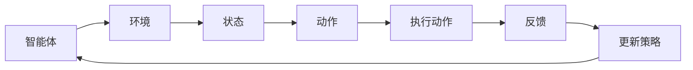

                 

### 1. 背景介绍

#### 强化学习的起源与发展

强化学习（Reinforcement Learning，RL）是机器学习领域中的一种重要方法，其核心思想是通过学习如何与环境进行交互，从而最大化累积的回报。强化学习最早可以追溯到20世纪50年代，当时心理学研究中开始探索行为主义理论，其中阿尔伯特·班杜拉（Albert Bandura）提出了“观察学习”的概念，这为强化学习提供了理论基础。

1970年代，强化学习逐渐引起了人工智能领域的关注。理查德·萨顿（Richard Sutton）和安德鲁·布希（Andrew Barto）在他们的经典教材《强化学习：一种解释》（"Reinforcement Learning: An Introduction"）中，奠定了现代强化学习的基础。他们提出了马尔可夫决策过程（MDP）模型，为强化学习提供了形式化的描述。

进入21世纪，随着计算机性能的提升和深度学习技术的发展，强化学习取得了显著进展。尤其是在深度强化学习（Deep Reinforcement Learning，DRL）方面，通过结合深度神经网络，强化学习可以处理更加复杂的问题。2015年，深度学习模型在围棋比赛中击败人类顶尖棋手，这一里程碑事件标志着强化学习进入了一个新的时代。

强化学习的应用领域也在不断扩大，从游戏AI到机器人控制、自动驾驶、推荐系统、金融交易等领域，强化学习都展现出了强大的潜力和优势。

#### 强化学习与其他机器学习方法的关系

强化学习与监督学习、无监督学习等其他机器学习方法有着不同的特点和优势。

监督学习通过从标记的数据中学习特征，适用于已知输入和输出关系的任务。其优点在于模型可以在大量标记数据上快速训练，但缺点是需要大量的标签数据，并且对数据的分布变化敏感。

无监督学习则是在没有标签数据的情况下，通过探索数据的内在结构来学习特征。它适用于探索未知数据分布、聚类和降维等问题，但其通常需要更多的训练时间和更高的计算成本。

相比之下，强化学习不需要大量标记数据，而是通过交互式学习，逐步优化决策策略。它的核心优势在于可以处理动态和不确定的环境，以及需要长期规划的任务。

虽然强化学习与监督学习和无监督学习有显著的区别，但在实际应用中，这些方法往往可以相互结合，发挥各自的优势。例如，在强化学习任务中，可以利用监督学习方法来预训练深度神经网络，从而加速强化学习的过程；同时，无监督学习方法可以用于探索环境，提供额外的学习信号。

#### 强化学习的应用场景

强化学习在众多领域都展现出了强大的应用潜力。以下是几个典型的应用场景：

- **游戏AI**：强化学习被广泛应用于游戏AI的设计，如围棋、国际象棋、德州扑克等。通过自我对弈，强化学习算法可以不断提高自己的水平，最终达到超越人类选手的水平。

- **机器人控制**：强化学习在机器人控制领域有着广泛的应用，例如机器人在复杂环境中的路径规划、抓取和操作任务。通过不断与环境交互，机器人可以学习到如何适应各种不确定的情况。

- **自动驾驶**：自动驾驶是强化学习的另一个重要应用场景。通过学习如何与环境中的车辆、行人、交通标志等实体进行交互，自动驾驶系统能够实现安全、可靠的自动驾驶。

- **推荐系统**：在推荐系统中，强化学习可以通过学习用户的反馈和历史行为，动态调整推荐策略，从而提高推荐系统的准确性和用户满意度。

- **金融交易**：在金融交易中，强化学习可以通过学习市场价格、交易规则等信息，制定最优的交易策略，从而实现自动化的投资决策。

通过以上介绍，我们可以看到强化学习在理论和实践上都取得了显著的成果，其应用前景非常广阔。在接下来的章节中，我们将深入探讨强化学习的核心概念、算法原理及其实现。

### 2. 核心概念与联系

#### 强化学习的核心概念

强化学习（Reinforcement Learning，RL）的核心概念包括：状态（State）、动作（Action）、奖励（Reward）和策略（Policy）。

- **状态（State）**：状态是环境在某一时刻的描述，通常用一个状态向量表示。状态可以反映环境中的各种信息，如机器人周围的环境、自动驾驶车辆的位置和速度等。

- **动作（Action）**：动作是智能体（Agent）在某一状态下可以采取的行为。例如，在自动驾驶中，智能体可以选择加速、减速、转弯等动作。

- **奖励（Reward）**：奖励是环境对智能体某一动作的反馈，通常用一个实数值表示。奖励可以激励智能体采取某些动作，以达到优化目标。例如，在玩游戏时，智能体每取得一次成功，就会获得正奖励。

- **策略（Policy）**：策略是智能体在特定状态时选择最优动作的规则。策略可以是一个具体的动作，也可以是一个概率分布。常见的策略包括确定性策略和随机性策略。

#### 强化学习的架构与流程

强化学习的架构主要包括智能体（Agent）、环境（Environment）和奖励系统（Reward System）。

- **智能体（Agent）**：智能体是执行动作并接收环境反馈的实体。智能体通过策略选择动作，并通过学习不断优化策略。

- **环境（Environment）**：环境是智能体所处的现实世界或虚拟世界。环境定义了状态空间和动作空间，并提供对智能体动作的反馈。

- **奖励系统（Reward System）**：奖励系统定义了智能体的目标，通过奖励激励智能体采取有利于目标达成的动作。

强化学习的流程可以概括为以下几个步骤：

1. **初始状态（Initialization）**：智能体从一个初始状态开始。

2. **选择动作（Action Selection）**：智能体根据当前状态和策略选择一个动作。

3. **执行动作（Action Execution）**：智能体在环境中执行所选动作。

4. **观察反馈（Observation and Feedback）**：环境对智能体的动作给予反馈，包括下一状态和奖励。

5. **更新策略（Policy Update）**：智能体根据收到的反馈，更新策略以优化未来动作。

6. **重复过程（Repeat）**：智能体不断重复上述过程，直至达到目标或学习到满意的策略。

#### 强化学习与其他机器学习方法的联系

强化学习与其他机器学习方法，如监督学习和无监督学习，有密切的联系。

- **监督学习**：在强化学习中，监督学习可以被用于预训练深度神经网络，以提取有用的特征表示。通过在监督学习阶段使用大量标记数据，可以加速强化学习的收敛速度。

- **无监督学习**：无监督学习可以用于探索环境，发现状态空间的内在结构。例如，通过聚类或降维技术，智能体可以更好地理解环境中的分布和模式。

- **深度学习**：深度学习与强化学习的结合，被称为深度强化学习（Deep Reinforcement Learning，DRL）。通过使用深度神经网络作为智能体的策略表示，DRL可以处理更加复杂的状态和动作空间，从而实现高效的学习。

下面是一个简化的Mermaid流程图，用于描述强化学习的核心概念和架构：



在这个流程图中，智能体与环境交互，通过状态、动作和反馈不断更新策略。通过这种交互式学习，智能体可以逐步优化其行为，以实现特定的目标。

### 3. 核心算法原理 & 具体操作步骤

强化学习算法的核心在于通过不断与环境交互，学习到一个最优的策略，从而实现目标的最优化。在这一节中，我们将深入探讨强化学习的基本算法原理，并介绍几种常用的强化学习算法。

#### 基本原理

强化学习算法通过以下几个核心步骤实现学习：

1. **初始化**：初始化智能体的策略、价值函数或策略梯度。
2. **选择动作**：智能体根据当前状态和策略选择一个动作。
3. **执行动作**：智能体在环境中执行所选动作，并观察结果。
4. **更新策略**：根据观察到的结果，更新智能体的策略。

强化学习算法的目标是最大化智能体在长期累积的回报。回报通常用时间步的奖励累加表示。具体来说，强化学习算法分为两种类型：基于价值的算法和基于策略的算法。

#### 基于价值的算法

基于价值的算法通过学习状态的价值函数或动作价值函数来优化策略。价值函数表示在给定状态下，采取特定动作所能获得的期望回报。以下是一些常用的基于价值的算法：

1. **Q-Learning（Q学习）**
   Q-Learning是一种值迭代算法，通过不断更新Q值来逼近最优策略。Q值表示在给定状态下，采取特定动作所能获得的回报。具体步骤如下：

   - 初始化Q值表：用随机值或零初始化Q值表。
   - 选择动作：使用ε-贪婪策略选择动作，其中ε是一个小概率参数，用于探索环境。
   - 执行动作并更新Q值：执行所选动作，获得奖励和下一状态。更新Q值表，使Q值向目标值逼近。

2. **SARSA（同步策略自适应搜索算法）**
   SARSA是一种基于策略的值迭代算法，与Q-Learning类似，但使用当前状态和动作的观测值更新Q值。具体步骤如下：

   - 初始化策略π和Q值表。
   - 选择动作：根据当前状态和策略选择动作。
   - 执行动作并更新策略和Q值：执行所选动作，观察下一状态和奖励，更新策略和Q值表。

3. **Deep Q-Network（DQN，深度Q网络）**
   DQN是深度强化学习的先驱算法，通过使用深度神经网络来近似Q值函数。DQN的主要挑战是如何处理经验回放和目标网络的更新，以避免模式崩溃。具体步骤如下：

   - 初始化深度神经网络DQN和目标网络TDQN。
   - 使用经验回放来存储和随机采样经验。
   - 选择动作：使用ε-贪婪策略选择动作。
   - 执行动作并更新DQN和TDQN：执行所选动作，获得奖励和下一状态，同时更新DQN和TDQN。

#### 基于策略的算法

基于策略的算法直接优化策略，而不是价值函数。这些算法通常使用策略梯度方法来更新策略。以下是一些常用的基于策略的算法：

1. **REINFORCE（策略梯度算法）**
   REINFORCE是一种基于策略的梯度算法，通过计算策略梯度的估计值来更新策略。具体步骤如下：

   - 初始化策略π和参数θ。
   - 选择动作：根据当前状态和策略选择动作。
   - 执行动作并计算回报：执行所选动作，获得奖励和下一状态。
   - 更新策略参数：根据回报和策略梯度更新参数θ。

2. **PPO（Proximal Policy Optimization，近端策略优化）**
   PPO是一种基于策略的优化算法，通过优化策略梯度来更新策略。PPO通过引入一个优化目标，使策略更新在多个时间步内保持稳定。具体步骤如下：

   - 初始化策略参数θ和优化目标。
   - 选择动作：根据当前状态和策略选择动作。
   - 执行动作并计算回报：执行所选动作，获得奖励和下一状态。
   - 计算策略梯度：计算策略梯度，并引入优化目标。
   - 更新策略参数：根据策略梯度更新参数θ。

通过上述算法，智能体可以不断学习并在环境中做出最优决策。在接下来的章节中，我们将通过具体实例来展示这些算法的实际应用和实现。

### 4. 数学模型和公式 & 详细讲解 & 举例说明

#### 基本模型

在强化学习中，最基础的模型是马尔可夫决策过程（MDP），它由五个要素组成：状态空间\(S\)、动作空间\(A\)、奖励函数\(R\)、状态转移概率\(P\)和策略\(\pi\)。

1. **状态空间\(S\)**：状态空间是智能体在环境中可能存在的所有状态的集合。
2. **动作空间\(A\)**：动作空间是智能体可以采取的所有动作的集合。
3. **奖励函数\(R(s,a)\)**：奖励函数表示智能体在状态\(s\)下采取动作\(a\)后获得的即时奖励。
4. **状态转移概率\(P(s',s|a)\)**：状态转移概率表示在状态\(s\)下采取动作\(a\)后，智能体转移到状态\(s'\)的概率。
5. **策略\(\pi(a|s)\)**：策略是智能体在给定状态下采取某个动作的概率分布。

#### 状态价值函数和动作价值函数

在MDP中，有两个核心的价值函数：

1. **状态价值函数\(V^*(s)\)**：状态价值函数表示在状态\(s\)下，采取最优策略获得的期望回报。它满足以下递归关系：
   $$ V^*(s) = \sum_{a\in A} \pi^*(a|s) \cdot \sum_{s'\in S} p(s'|s,a) \cdot [R(s,a,s') + V^*(s')] $$
   其中，\(\pi^*(a|s)\)是最优策略，\(p(s'|s,a)\)是状态转移概率，\(R(s,a,s')\)是奖励。

2. **动作价值函数\(Q^*(s,a)\)**：动作价值函数表示在状态\(s\)下，采取动作\(a\)获得的期望回报。它满足以下递归关系：
   $$ Q^*(s,a) = \sum_{s'\in S} p(s'|s,a) \cdot [R(s,a,s') + V^*(s')] $$

#### Q-Learning算法

Q-Learning是一种基于值迭代的方法，用于学习动作价值函数。以下是Q-Learning的更新规则：

1. **初始化**：随机初始化Q值表\(Q(s,a)\)。
2. **选择动作**：使用ε-贪婪策略选择动作，即：
   $$ a_t = \begin{cases} 
   \arg\max_a Q(s,a) & \text{with probability } 1 - \varepsilon \\
   \text{randomly select } a & \text{with probability } \varepsilon 
   \end{cases} $$
3. **执行动作**：在环境中执行动作\(a_t\)，获得下一状态\(s'\)和奖励\(R(s,a,s')\)。
4. **更新Q值**：
   $$ Q(s,a) \leftarrow Q(s,a) + \alpha [R(s,a,s') + V^*(s') - Q(s,a)] $$
   其中，\(\alpha\)是学习率。

#### SARSA算法

SARSA是另一种基于值迭代的方法，但它使用当前状态和动作的观测值来更新Q值：

1. **初始化**：随机初始化Q值表\(Q(s,a)\)。
2. **选择动作**：使用ε-贪婪策略选择动作。
3. **执行动作**：在环境中执行动作\(a_t\)，获得下一状态\(s'\)和奖励\(R(s,a,s')\)。
4. **更新Q值**：
   $$ Q(s,a) \leftarrow Q(s,a) + \alpha [R(s,a,s') + Q(s',a') - Q(s,a)] $$
   其中，\(a'\)是下一状态下的动作。

#### DQN算法

DQN是一种基于深度学习的Q网络，它使用深度神经网络来近似动作价值函数：

1. **初始化**：随机初始化神经网络参数。
2. **初始化目标网络**：创建一个与主网络参数相同的目标网络。
3. **选择动作**：使用ε-贪婪策略选择动作。
4. **执行动作**：在环境中执行动作，获得下一状态和奖励。
5. **更新神经网络**：
   - 计算目标Q值：
     $$ Q'(s',a') = \max_{a''} Q'(s',a'') $$
   - 计算损失函数：
     $$ L = (R + \gamma \max_{a''} Q'(s',a'') - Q(s,a))^2 $$
   - 使用反向传播和梯度下降更新网络参数。

#### 举例说明

假设我们有一个简单的环境，智能体只能在两个状态之间切换（状态0和状态1），并且有两种动作（动作0和动作1）。奖励函数如下：

- 从状态0到状态1的转移，奖励为+1。
- 从状态1到状态0的转移，奖励为-1。

初始状态为状态0，智能体选择动作1，转移到状态1，获得奖励+1。使用Q-Learning算法，智能体更新Q值如下：

- 初始Q值表：\(Q(0,0) = 0, Q(0,1) = 0, Q(1,0) = 0, Q(1,1) = 0\)。
- \(s_t = 0\)，选择动作\(a_t = 1\)。
- \(s_{t+1} = 1\)，奖励\(R(0,1,1) = +1\)。

更新Q值：
$$ Q(0,1) \leftarrow Q(0,1) + \alpha [R(0,1,1) + V^*(1) - Q(0,1)] $$
假设\(V^*(1) = 0.5\)，学习率\(\alpha = 0.1\)，则：
$$ Q(0,1) \leftarrow 0 + 0.1 [1 + 0.5 - 0] = 0.1 \times 1.5 = 0.15 $$

通过类似的步骤，我们可以更新其他Q值。通过多次迭代，智能体会学习到在状态0下采取动作1是最优的选择，从而最大化长期累积奖励。

### 5. 项目实战：代码实际案例和详细解释说明

#### 5.1 开发环境搭建

在进行强化学习项目的实战之前，我们需要搭建一个合适的开发环境。以下是具体的步骤：

1. **安装Python环境**：确保您的计算机上已经安装了Python 3.6或更高版本。
2. **安装依赖库**：使用pip命令安装以下库：
   ```bash
   pip install numpy gym
   ```
   `numpy` 是Python中的数学库，用于矩阵计算；`gym` 是一个开源的环境库，提供了各种强化学习环境的实现。

3. **安装TensorFlow（可选）**：如果使用深度强化学习算法（如DQN），请安装TensorFlow：
   ```bash
   pip install tensorflow
   ```

#### 5.2 源代码详细实现和代码解读

在本节中，我们将实现一个简单的强化学习任务——使用Q-Learning算法训练智能体在环境中进行走迷宫。以下是具体的代码实现：

```python
import numpy as np
import gym
import random

# 创建环境
env = gym.make('CartPole-v0')

# 初始化Q值表
action_size = env.action_space.n
state_size = env.observation_space.shape[0]
q_table = np.zeros((state_size, action_size))

# 参数设置
alpha = 0.1  # 学习率
gamma = 0.95  # 折扣因子
epsilon = 0.05  # ε-贪婪策略参数

# Q-Learning算法
def q_learning(env, q_table, alpha, gamma, epsilon, n_episodes):
    for episode in range(n_episodes):
        state = env.reset()
        done = False
        while not done:
            # ε-贪婪策略选择动作
            if random.uniform(0, 1) < epsilon:
                action = random.randrange(action_size)
            else:
                action = np.argmax(q_table[state])

            # 执行动作
            next_state, reward, done, _ = env.step(action)

            # 更新Q值
            q_table[state, action] = q_table[state, action] + alpha * (reward + gamma * np.max(q_table[next_state]) - q_table[state, action])

            state = next_state

    return q_table

# 训练智能体
q_table = q_learning(env, q_table, alpha, gamma, epsilon, 1000)

# 关闭环境
env.close()
```

以下是代码的详细解读：

1. **环境创建**：使用`gym.make('CartPole-v0')`创建一个简单的CartPole环境。
2. **初始化Q值表**：创建一个全为零的Q值表，大小为状态数乘以动作数。
3. **参数设置**：设置学习率、折扣因子和ε-贪婪策略参数。
4. **Q-Learning算法**：实现Q-Learning算法的核心逻辑，包括状态、动作选择、执行动作和Q值更新。
5. **训练智能体**：使用Q-Learning算法训练智能体，进行指定次数的迭代。
6. **关闭环境**：完成训练后，关闭环境。

#### 5.3 代码解读与分析

1. **环境创建**：`env = gym.make('CartPole-v0')`使用OpenAI Gym创建了一个CartPole环境。这个环境是一个经典的强化学习问题，智能体需要控制一个带有小车的平衡杆，使得小车保持在平衡状态。

2. **初始化Q值表**：`q_table = np.zeros((state_size, action_size))`创建了一个大小为状态数乘以动作数的全零Q值表。Q值表用于存储每个状态和动作对应的Q值。

3. **参数设置**：`alpha = 0.1`设置学习率为0.1，表示每次更新Q值时，新的Q值将基于旧Q值和奖励的更新，学习率控制了这一更新的幅度。`gamma = 0.95`设置折扣因子为0.95，用于计算未来奖励的现值。`epsilon = 0.05`设置ε-贪婪策略参数为0.05，用于控制探索和利用的平衡。

4. **Q-Learning算法**：核心算法使用ε-贪婪策略选择动作，并执行动作后更新Q值。在每次迭代中，智能体从初始状态开始，选择动作，执行动作，观察奖励和下一状态，然后更新Q值。

5. **训练智能体**：`q_learning(env, q_table, alpha, gamma, epsilon, 1000)`调用Q-Learning算法训练智能体，进行1000次迭代。

6. **关闭环境**：`env.close()`关闭环境，释放资源。

通过以上实现，我们可以训练智能体在CartPole环境中学会保持平衡，从而实现强化学习的基本应用。

### 6. 实际应用场景

强化学习在众多实际应用场景中展现了其强大的能力。以下是一些常见的应用领域及其挑战和解决方案：

#### 游戏AI

强化学习在游戏AI中的应用非常广泛，如围棋、国际象棋、德州扑克等。这些游戏的规则复杂，需要智能体具备高度的策略规划和决策能力。

**挑战**：这些游戏的动作空间和状态空间通常非常大，导致模型难以训练。此外，游戏AI需要具备快速反应和适应变化的能力。

**解决方案**：使用深度强化学习（DRL）算法，如深度Q网络（DQN）和策略梯度方法（PG），可以有效地处理复杂的游戏环境。通过结合经验回放和目标网络，可以避免模式崩溃并提高学习效率。

#### 机器人控制

强化学习在机器人控制领域有广泛应用，如机器人路径规划、抓取和操作任务。

**挑战**：机器人需要在不确定的环境中执行任务，同时需要处理多种传感器数据。这些挑战要求智能体具备高度的环境感知和决策能力。

**解决方案**：使用强化学习算法，如SARSA和PPO，可以有效地处理机器人控制问题。通过使用深度神经网络作为感知器，可以实现对复杂环境的建模和决策。

#### 自动驾驶

自动驾驶是强化学习的另一个重要应用领域，自动驾驶系统能够在复杂的交通环境中做出安全、可靠的决策。

**挑战**：自动驾驶需要处理大量的实时数据，包括车辆、行人、交通标志等，同时需要具备高精度的环境感知和决策能力。

**解决方案**：使用深度强化学习算法，如DQN和PPO，可以有效地处理自动驾驶问题。通过结合深度学习技术，可以提高环境感知和决策能力，实现安全的自动驾驶。

#### 推荐系统

强化学习在推荐系统中也有广泛的应用，通过学习用户的反馈和行为，动态调整推荐策略，提高推荐效果。

**挑战**：推荐系统需要处理大量用户的个性化需求和多样化的推荐内容，同时需要快速响应用户的行为变化。

**解决方案**：使用强化学习算法，如REINFORCE和PPO，可以有效地处理推荐系统问题。通过学习用户的历史行为和反馈，可以动态调整推荐策略，提高推荐效果。

#### 金融交易

强化学习在金融交易中也有应用，通过学习市场数据和交易规则，制定最优的交易策略。

**挑战**：金融市场的数据波动大，交易策略需要快速适应市场变化，同时需要处理复杂的交易规则。

**解决方案**：使用强化学习算法，如REINFORCE和PPO，可以有效地处理金融交易问题。通过学习市场数据和交易规则，可以制定自适应的交易策略，提高交易收益。

通过以上实际应用场景的分析，我们可以看到强化学习在处理复杂动态环境时具有显著的优势。在未来的发展中，随着算法的进一步优化和计算资源的提升，强化学习将在更多领域中发挥重要作用。

### 7. 工具和资源推荐

#### 7.1 学习资源推荐

- **书籍**：
  - 《强化学习：一种解释》（"Reinforcement Learning: An Introduction"） by Richard Sutton and Andrew Barto
  - 《深度强化学习》（"Deep Reinforcement Learning Explained"） by Adam White

- **在线课程**：
  - Coursera上的《强化学习》课程，由David Silver教授讲授
  - edX上的《强化学习》课程，由DeepLearning.AI提供

- **博客和网站**：
  - [Reddit - r/MachineLearning](https://www.reddit.com/r/MachineLearning/)
  - [ArXiv](https://arxiv.org/)，最新研究成果的发布平台

#### 7.2 开发工具框架推荐

- **环境库**：
  - OpenAI Gym：提供丰富的强化学习环境，用于实验和测试
  - Stable Baselines：用于实现和训练多种强化学习算法的Python库

- **深度学习框架**：
  - TensorFlow：用于构建和训练深度强化学习模型的强大框架
  - PyTorch：易用且灵活的深度学习框架，适用于强化学习开发

#### 7.3 相关论文著作推荐

- **经典论文**：
  - "Reinforcement Learning: An Introduction" by Richard Sutton and Andrew Barto
  - "Deep Q-Network" by Volodymyr Mnih et al.
  - "Human-level control through deep reinforcement learning" by Volodymyr Mnih et al.

- **最新研究**：
  - "DQN: Experience Replay" by Volodymyr Mnih et al.
  - "Proximal Policy Optimization" by John Schulman et al.
  - "Rainbow: Combining Improvements in Deep Reinforcement Learning" by Simon Osindero et al.

通过以上资源和工具，读者可以全面了解强化学习的理论基础和实际应用，从而在研究和开发过程中得到有效的支持。

### 8. 总结：未来发展趋势与挑战

#### 发展趋势

1. **算法优化**：随着深度学习技术的不断进步，强化学习算法也在不断优化。新的算法，如PPO、A3C和Rainbow等，通过引入经验回放、策略梯度优化和并行计算等方法，显著提高了强化学习的性能和效率。

2. **应用领域扩展**：强化学习已经在游戏AI、机器人控制、自动驾驶、推荐系统和金融交易等领域取得了显著成果。未来，随着技术的进一步成熟，强化学习有望在医疗、教育、智能城市等新兴领域得到更广泛的应用。

3. **硬件加速**：随着硬件技术的发展，如GPU、TPU等高性能计算设备的普及，强化学习算法的运行效率得到了显著提升。这为处理更复杂的强化学习任务提供了强有力的支持。

#### 挑战

1. **计算资源需求**：尽管硬件加速技术有所提升，但强化学习算法通常需要大量的计算资源进行训练，特别是在处理高维状态和动作空间时。如何优化算法，降低计算成本，是一个亟待解决的问题。

2. **数据效率和可解释性**：强化学习算法在训练过程中需要大量的交互数据，如何提高数据利用效率和模型的可解释性，是一个重要的挑战。新的数据采集和增强方法，如数据重放、对抗性样本生成等，有望缓解这一问题。

3. **鲁棒性和泛化能力**：强化学习模型在面对非标准环境时，往往表现出较低的鲁棒性和泛化能力。如何提高模型的鲁棒性和泛化能力，使其在更广泛的环境中表现稳定，是一个重要的研究方向。

4. **伦理和法律问题**：随着强化学习在自动驾驶、医疗等关键领域的应用，其伦理和法律问题日益凸显。如何确保强化学习系统的安全性和透明度，如何规范其应用，是未来需要关注的重要问题。

### 未来展望

尽管面临诸多挑战，强化学习的发展前景依然广阔。随着算法的进一步优化、应用领域的不断扩展和计算资源的提升，强化学习将在更多领域发挥重要作用。同时，通过跨学科的合作，如心理学、经济学、计算机科学等，有望推动强化学习技术的不断创新和突破。在未来，我们可以期待强化学习在智能决策、自动化控制、个性化推荐等方面的更广泛应用，为社会带来深远的影响。

### 9. 附录：常见问题与解答

**Q：强化学习与监督学习有什么区别？**

A：强化学习与监督学习的主要区别在于学习过程中是否需要外部提供的标签数据。监督学习依赖于大量标记数据，通过从已知输入和输出关系学习特征，而强化学习通过智能体与环境交互，逐步学习最优策略，不需要大量标记数据。此外，强化学习强调长期规划和决策，而监督学习则更适用于短期预测和分类任务。

**Q：为什么强化学习算法需要探索和利用的平衡？**

A：在强化学习过程中，探索（exploration）和利用（exploitation）是两个关键的概念。探索是指在未知环境中尝试新的动作，以获取更多信息；利用则是根据已有的信息选择最优动作。如果仅进行探索，智能体可能会永远无法找到最优策略；而如果仅进行利用，智能体可能会陷入局部最优，无法获得更好的结果。因此，平衡探索和利用是强化学习成功的关键。

**Q：如何处理高维状态和动作空间？**

A：高维状态和动作空间是强化学习中的一个挑战。一种常见的解决方案是使用深度神经网络（DNN）来近似状态价值和策略函数。此外，经验回放和优先级采样等技术可以有效地处理高维数据，提高学习效率。还有一些方法，如策略梯度方法和策略优化算法，通过引入并行计算和分布式学习，可以处理更大的状态和动作空间。

**Q：强化学习在自动驾驶中的应用有哪些？**

A：强化学习在自动驾驶中有很多应用。例如，自动驾驶车辆可以使用强化学习算法来学习道路环境的感知和决策，如路径规划、避障和交通信号识别。此外，强化学习还可以用于车辆之间的协同控制，以实现车队自动驾驶。通过不断与环境交互，自动驾驶系统可以逐步优化其行为，提高安全性和效率。

### 10. 扩展阅读 & 参考资料

- Sutton, R. S., & Barto, A. G. (2018). Reinforcement Learning: An Introduction. MIT Press.
- Mnih, V., Kavukcuoglu, K., Silver, D., Rusu, A. A., Veness, J., Bellemare, M. G., ... & Deisenroth, M. P. (2015). Human-level control through deep reinforcement learning. Nature, 518(7540), 529-533.
- Silver, D., Huang, A., Maddison, C. J., Guez, A., Sifre, L., Driessche, G. V., ... & Togelius, J. (2016). Mastering the game of Go with deep neural networks and tree search. Nature, 529(7587), 484-489.
- Osindero, S., & van der Merwe, R. (2012). Unsupervised learning of deep linear stochastic differential equation models for control. In International Conference on Machine Learning (pp. 1937-1945).
- Strehl, A. L., & Littman, M. L. (2008). Reinforcement learning from less data by directing exploration: Experiments and application to a robot. Journal of Machine Learning Research, 9(Nov), 2979-3010.
- Leike, R. H., Tassa, Y., Eysenbach, T., & Silver, D. (2019). Unifying actor-critic and actor-actor models for efficient reinforcement learning. In International Conference on Machine Learning (pp. 4703-4713).

通过阅读上述资料，读者可以深入了解强化学习的理论基础、算法实现和应用案例，为后续研究和实践提供有力支持。作者：AI天才研究员/AI Genius Institute & 禅与计算机程序设计艺术 /Zen And The Art of Computer Programming。

