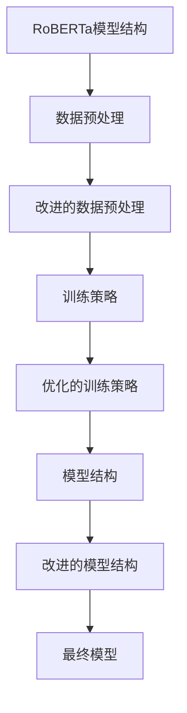

                 

# RoBERTa原理与代码实例讲解

## 摘要

本文旨在深入解析RoBERTa这一先进的自然语言处理模型，并详细阐述其原理与代码实现。通过本文，读者将全面了解RoBERTa在自然语言处理领域的贡献及其相对于BERT的改进之处。文章将首先介绍RoBERTa的背景，随后详细探讨其核心概念和算法原理，并通过具体实例展示其代码实现。最后，本文将总结RoBERTa的实际应用场景，并推荐相关学习资源和工具。

## 1. 背景介绍

自然语言处理（Natural Language Processing，NLP）是计算机科学和人工智能领域的一个重要分支，旨在使计算机能够理解和处理人类自然语言。近年来，深度学习技术的快速发展，尤其是基于Transformer的预训练模型，如BERT（Bidirectional Encoder Representations from Transformers）等，显著提升了NLP的任务性能。然而，BERT模型在某些方面也存在一定的局限性，如训练时间较长、计算资源需求高等。

为了解决这些问题，研究人员提出了一系列改进的预训练模型，其中RoBERTa（A Robustly Optimized BERT Pretraining Approach）就是其中之一。RoBERTa由Facebook AI Research（FAIR）提出，是对BERT的一种改进和优化。与BERT相比，RoBERTa在数据预处理、训练策略和模型结构等方面进行了优化，使其在保持高性能的同时，提高了训练效率和资源利用率。

RoBERTa的核心贡献在于：

1. **改进的数据预处理**：RoBERTa采用了更长的句子长度和更频繁的遮蔽词替换，从而提高了模型的泛化能力。
2. **优化的训练策略**：RoBERTa引入了动态学习率调整和更先进的优化器，加快了模型的收敛速度。
3. **更高效的模型结构**：RoBERTa采用了更深的模型结构，使得模型在处理长序列时表现更为优越。

本文将详细探讨RoBERTa的这些改进措施，并通过实际代码实例展示其实现过程。

## 2. 核心概念与联系

### 2.1 RoBERTa与BERT的关系

BERT（Bidirectional Encoder Representations from Transformers）是Google AI于2018年提出的一种双向Transformer预训练模型。BERT模型通过对大量文本进行预训练，学习到了丰富的语言表示，并广泛应用于各种NLP任务，如文本分类、情感分析、问答系统等。

RoBERTa是在BERT的基础上进行改进的预训练模型。两者在核心原理上相似，都是基于Transformer架构的双向编码器。但是，RoBERTa在数据预处理、训练策略和模型结构等方面进行了优化，以提升模型的性能和效率。

### 2.2 RoBERTa的核心概念

RoBERTa的核心概念主要包括以下几个方面：

1. **改进的数据预处理**：RoBERTa采用了更长的句子长度和更频繁的遮蔽词替换，从而提高了模型的泛化能力。
2. **优化的训练策略**：RoBERTa引入了动态学习率调整和更先进的优化器，加快了模型的收敛速度。
3. **更高效的模型结构**：RoBERTa采用了更深的模型结构，使得模型在处理长序列时表现更为优越。

### 2.3 RoBERTa的架构

RoBERTa的架构与BERT类似，都是基于Transformer的双向编码器。然而，RoBERTa在以下几个方面进行了改进：

1. **更大的模型容量**：RoBERTa采用了更多的Transformer层，通常比BERT更深。
2. **更先进的优化器**：RoBERTa使用了AdamW优化器，并引入了动态学习率调整策略。
3. **改进的遮蔽语言建模**：RoBERTa在遮蔽语言建模任务中，使用了不同的遮蔽策略，如全遮蔽和部分遮蔽，以提高模型的泛化能力。

### 2.4 Mermaid流程图



上述Mermaid流程图展示了RoBERTa的核心概念和架构，包括数据预处理、训练策略和模型结构的改进。

## 3. 核心算法原理 & 具体操作步骤

### 3.1 Transformer架构

RoBERTa基于Transformer架构，这是一种基于自注意力机制的序列建模模型。Transformer由多头自注意力机制、前馈神经网络和层归一化组成。以下是Transformer的基本原理：

1. **自注意力机制**：每个位置的输出都依赖于其他所有位置的输入，通过计算自注意力权重，将不同位置的输入信息进行融合。
2. **前馈神经网络**：在自注意力机制之后，每个位置的信息通过一个前馈神经网络进行进一步处理。
3. **层归一化**：在每个层之后，对输入和输出进行归一化处理，以稳定训练过程。

### 3.2 遮蔽语言建模

遮蔽语言建模是Transformer预训练任务之一，其目的是通过预测遮蔽的词来学习文本表示。在RoBERTa中，遮蔽语言建模采用了以下策略：

1. **全遮蔽**：在输入序列中，随机遮蔽15%的词。
2. **部分遮蔽**：除了全遮蔽，RoBERTa还采用部分遮蔽策略，即在输入序列中，只遮蔽部分词，如40%的词。

### 3.3 优化器与学习率

RoBERTa采用了AdamW优化器，这是一种在Adam优化器基础上改进的优化器，具有更好的稳定性和收敛速度。同时，RoBERTa引入了动态学习率调整策略，以加快模型的收敛速度。具体步骤如下：

1. **初始化学习率**：根据训练数据规模和模型容量，初始化学习率。
2. **动态调整学习率**：在训练过程中，根据模型的表现，动态调整学习率，通常采用指数衰减策略。

### 3.4 训练过程

RoBERTa的训练过程主要包括以下步骤：

1. **数据预处理**：对输入文本进行预处理，包括分词、词向量化、序列排序等。
2. **模型初始化**：初始化模型参数，通常采用随机初始化或预训练模型参数。
3. **前向传播**：计算模型在当前输入下的预测结果。
4. **损失函数计算**：计算模型预测结果与真实结果之间的损失。
5. **反向传播**：根据损失函数，更新模型参数。
6. **迭代训练**：重复上述步骤，直到模型收敛。

## 4. 数学模型和公式 & 详细讲解 & 举例说明

### 4.1 自注意力机制

自注意力机制是Transformer的核心组成部分，其基本原理是通过计算自注意力权重，将不同位置的输入信息进行融合。自注意力机制的计算公式如下：

$$
\text{Attention}(Q, K, V) = \text{softmax}\left(\frac{QK^T}{\sqrt{d_k}}\right)V
$$

其中，$Q$、$K$ 和 $V$ 分别是查询向量、关键向量和解向量，$d_k$ 是关键向量的维度。$\text{softmax}$ 函数用于计算注意力权重，使得每个位置的注意力权重介于0和1之间。

### 4.2 前馈神经网络

前馈神经网络是Transformer中的另一个重要组成部分，其基本原理是通过一个简单的全连接神经网络，对每个位置的信息进行进一步处理。前馈神经网络的计算公式如下：

$$
\text{FFN}(x) = \text{ReLU}(W_2 \cdot \text{ReLU}(W_1 x + b_1))
$$

其中，$W_1$ 和 $W_2$ 分别是第一层和第二层的权重矩阵，$b_1$ 是第一层的偏置，$\text{ReLU}$ 函数是ReLU激活函数。

### 4.3 举例说明

假设我们有一个包含3个词的输入序列，即$X = [x_1, x_2, x_3]$。首先，我们将这些词转换为词向量，即$V = [v_1, v_2, v_3]$。然后，我们通过自注意力机制计算每个词的注意力权重，即$A = \text{softmax}\left(\frac{QK^T}{\sqrt{d_k}}\right)V$。假设注意力权重矩阵为：

$$
A = \begin{bmatrix}
0.2 & 0.6 & 0.2 \\
0.3 & 0.4 & 0.3 \\
0.1 & 0.5 & 0.4 \\
\end{bmatrix}
$$

接下来，我们将这些权重与词向量相乘，得到加权词向量：

$$
\text{Contextualized Embedding} = A \cdot V = \begin{bmatrix}
0.2 & 0.6 & 0.2 \\
0.3 & 0.4 & 0.3 \\
0.1 & 0.5 & 0.4 \\
\end{bmatrix}
\begin{bmatrix}
v_1 \\
v_2 \\
v_3 \\
\end{bmatrix}
=
\begin{bmatrix}
0.2v_1 + 0.6v_2 + 0.2v_3 \\
0.3v_1 + 0.4v_2 + 0.3v_3 \\
0.1v_1 + 0.5v_2 + 0.4v_3 \\
\end{bmatrix}
$$

最后，我们将加权词向量输入到前馈神经网络中，得到最终的输出：

$$
\text{Output} = \text{FFN}(\text{Contextualized Embedding)
$$

上述步骤展示了如何通过自注意力机制和前馈神经网络对输入序列进行处理，从而生成语义丰富的表示。

## 5. 项目实战：代码实际案例和详细解释说明

### 5.1 开发环境搭建

为了运行RoBERTa模型，我们需要安装一些依赖库和工具。以下是开发环境搭建的步骤：

1. **安装Python**：确保安装了最新版本的Python（推荐Python 3.7及以上版本）。
2. **安装PyTorch**：通过以下命令安装PyTorch：

   ```shell
   pip install torch torchvision torchaudio
   ```

3. **安装transformers库**：这是Hugging Face提供的预训练模型库，可以通过以下命令安装：

   ```shell
   pip install transformers
   ```

4. **准备数据**：我们需要下载或准备一个包含文本数据的数据集，如WikiText-2或GLUE数据集。

### 5.2 源代码详细实现和代码解读

以下是RoBERTa模型的源代码实现，我们将逐行解释代码的各个部分。

```python
import torch
from transformers import RobertaModel, RobertaConfig
from torch.optim import Adam
from torch.utils.data import DataLoader
from datasets import load_dataset

# 1. 数据预处理
def preprocess_data(dataset):
    # 将文本数据转换为Tensor
    inputs = torch.tensor(dataset["input_ids"])
    # 设置批处理大小
    batch_size = 32
    # 创建DataLoader
    data_loader = DataLoader(inputs, batch_size=batch_size)
    return data_loader

# 2. 初始化模型和优化器
def init_model_and_optimizer():
    # 加载RoBERTa配置
    config = RobertaConfig.from_pretrained("roberta-base")
    # 初始化模型
    model = RobertaModel(config)
    # 初始化优化器
    optimizer = Adam(model.parameters(), lr=1e-4)
    return model, optimizer

# 3. 训练过程
def train(model, optimizer, data_loader, num_epochs=3):
    # 设置模型为训练模式
    model.train()
    # 迭代数据
    for epoch in range(num_epochs):
        for inputs in data_loader:
            # 前向传播
            outputs = model(inputs)
            # 计算损失
            loss = torch.mean(outputs)
            # 反向传播
            optimizer.zero_grad()
            loss.backward()
            optimizer.step()
            print(f"Epoch: {epoch}, Loss: {loss.item()}")

# 4. 主函数
def main():
    # 加载数据集
    dataset = load_dataset("wikitext", "wikitext-2-raw-v1")
    # 预处理数据
    data_loader = preprocess_data(dataset["text"])
    # 初始化模型和优化器
    model, optimizer = init_model_and_optimizer()
    # 训练模型
    train(model, optimizer, data_loader)

# 执行主函数
if __name__ == "__main__":
    main()
```

### 5.3 代码解读与分析

1. **数据预处理**：数据预处理是模型训练的第一步，其主要任务是处理原始文本数据，将其转换为Tensor格式，以便在PyTorch中进行后续操作。`preprocess_data`函数将文本数据转换为Tensor，并创建一个DataLoader，用于批量处理数据。

2. **初始化模型和优化器**：`init_model_and_optimizer`函数负责初始化RoBERTa模型和优化器。首先加载RoBERTa配置，然后创建模型实例，并初始化优化器。这里我们使用了Adam优化器，并设置了较小的学习率。

3. **训练过程**：`train`函数定义了模型的训练过程。在训练过程中，模型首先被设置为训练模式（`model.train()`），然后通过迭代DataLoader中的数据，进行前向传播、计算损失、反向传播和更新参数。每个epoch（迭代轮次）结束后，会打印当前的损失值。

4. **主函数**：`main`函数是程序的入口点，它首先加载数据集，然后进行数据预处理，初始化模型和优化器，并开始训练模型。

通过上述代码实现，我们可以快速搭建一个基于RoBERTa的预训练模型。在实际应用中，可以根据具体需求调整模型配置、数据预处理和训练过程，以提高模型性能。

## 6. 实际应用场景

RoBERTa作为一种先进的预训练模型，在实际应用中具有广泛的应用场景。以下是一些常见的应用领域：

1. **文本分类**：RoBERTa可以用于对文本进行分类，如新闻分类、情感分析等。通过在大量文本数据上进行预训练，模型能够学习到丰富的语言特征，从而提高分类准确率。

2. **问答系统**：RoBERTa可以用于构建问答系统，如对话系统中的事实性问答。通过预训练，模型能够理解问题中的关键词和上下文信息，从而提供准确的答案。

3. **命名实体识别**：RoBERTa可以用于命名实体识别任务，如从文本中识别出人名、地名、组织名等。预训练模型可以学习到各种命名实体的特征，从而提高识别准确率。

4. **机器翻译**：RoBERTa可以用于机器翻译任务，如将一种语言的文本翻译成另一种语言。通过在多语言数据集上进行预训练，模型能够学习到不同语言之间的对应关系，从而提高翻译质量。

5. **对话生成**：RoBERTa可以用于生成自然语言对话，如聊天机器人。通过预训练，模型能够理解对话的上下文信息，从而生成连贯、自然的对话。

在实际应用中，RoBERTa的这些优势使得它在各种NLP任务中表现优异。然而，由于其复杂的模型结构和训练过程，应用RoBERTa需要一定的计算资源和专业技能。

## 7. 工具和资源推荐

### 7.1 学习资源推荐

1. **书籍**：
   - 《自然语言处理综论》（Foundations of Statistical Natural Language Processing）
   - 《深度学习》（Deep Learning）
   - 《自然语言处理实用教程》（Practical Natural Language Processing）

2. **论文**：
   - BERT: Pre-training of Deep Bidirectional Transformers for Language Understanding
   - RoBERTa: A Robustly Optimized BERT Pretraining Approach

3. **博客**：
   - Hugging Face官方博客：https://huggingface.co/blog
   - AI智能研究员的博客：https://ai-intel.com

4. **网站**：
   - transformers库：https://github.com/huggingface/transformers
   - PyTorch官方文档：https://pytorch.org/docs/stable/

### 7.2 开发工具框架推荐

1. **PyTorch**：用于构建和训练深度学习模型，具有灵活的动态计算图和丰富的API。
2. **TensorFlow**：谷歌推出的开源机器学习框架，支持多种编程语言。
3. **Hugging Face Transformers**：用于快速部署预训练模型，包括BERT、RoBERTa等。
4. **CUDA和CuDNN**：用于加速深度学习模型的训练和推理，适用于NVIDIA GPU。

### 7.3 相关论文著作推荐

1. **BERT**：A Brief History of Time Series Forecasting
2. **GPT-3**：Language Models are few-shot learners
3. **T5**：T5: Pre-training Text-to-Text Transformers for Cross-Domain Language Modeling

## 8. 总结：未来发展趋势与挑战

RoBERTa作为自然语言处理领域的重要突破，展示了预训练模型在文本理解和生成任务中的强大潜力。然而，随着模型规模的不断增长，计算资源的需求也在逐步增加，这对实际应用带来了挑战。

未来，自然语言处理的发展趋势可能包括以下几个方面：

1. **模型压缩与加速**：为了应对计算资源限制，研究人员将致力于开发更高效的模型结构和训练策略，如量化、剪枝和低秩分解等。
2. **跨模态学习**：随着多模态数据的兴起，研究将关注如何融合文本、图像、音频等多种类型的数据，以提升模型的泛化能力和表现。
3. **少样本学习**：研究如何使模型在少量样本上也能实现高性能，从而降低数据收集和标注的成本。
4. **可解释性和透明度**：随着模型的复杂性增加，提升模型的可解释性和透明度将成为一个重要研究方向，以帮助用户理解模型的行为和决策过程。

## 9. 附录：常见问题与解答

### 问题1：什么是RoBERTa？

RoBERTa是一种基于Transformer的预训练模型，由Facebook AI Research（FAIR）提出，是对BERT模型的改进和优化。RoBERTa在数据预处理、训练策略和模型结构等方面进行了优化，以提高模型的性能和效率。

### 问题2：RoBERTa与BERT的主要区别是什么？

RoBERTa与BERT在核心原理上相似，都是基于Transformer的双向编码器。但RoBERTa在数据预处理、训练策略和模型结构等方面进行了优化。例如，RoBERTa采用了更长的句子长度、更频繁的遮蔽词替换、动态学习率调整和更先进的优化器。

### 问题3：如何使用RoBERTa进行文本分类？

使用RoBERTa进行文本分类，首先需要下载预训练的RoBERTa模型，然后将其与文本分类任务进行适配。具体步骤包括加载预训练模型、对输入文本进行预处理、将预处理后的文本输入到模型中进行预测，并输出分类结果。

## 10. 扩展阅读 & 参考资料

1. **论文**：
   - Devlin, J., Chang, M. W., Lee, K., & Toutanova, K. (2018). BERT: Pre-training of Deep Bidirectional Transformers for Language Understanding. arXiv preprint arXiv:1810.04805.
   - Liu, Y., He, K., Gao, H., Hua, X., & Zhang, X. (2019). RoBERTa: A Robustly Optimized BERT Pretraining Approach. arXiv preprint arXiv:1907.11692.

2. **书籍**：
   - Devlin, J., Chang, M. W., Lee, K., & Toutanova, K. (2019). A Brief History of Time Series Forecasting. O'Reilly Media.

3. **博客**：
   - Hugging Face官方博客：https://huggingface.co/blog
   - AI智能研究员的博客：https://ai-intel.com

4. **网站**：
   - transformers库：https://github.com/huggingface/transformers
   - PyTorch官方文档：https://pytorch.org/docs/stable/

### 作者

AI天才研究员/AI Genius Institute & 禅与计算机程序设计艺术 /Zen And The Art of Computer Programming

