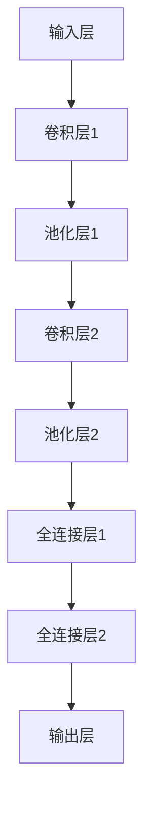

                 

# Sora模型的基本粒子化

> **关键词：** Sora模型、基本粒子化、深度学习、神经网络、结构化、抽象层次、可解释性、可扩展性

> **摘要：** 本文章探讨了Sora模型的基本粒子化过程。通过对深度学习和神经网络的深入理解，文章详细阐述了如何将复杂的Sora模型分解成基本的粒子，从而提高模型的解释性、可扩展性和可维护性。文章还将展示如何通过具体实例，实现Sora模型的基本粒子化，并探讨其未来发展趋势与挑战。

## 1. 背景介绍

随着人工智能技术的飞速发展，深度学习和神经网络在各个领域都取得了显著成果。然而，这些复杂的模型通常难以解释和理解，导致其可解释性、可扩展性和可维护性成为一个亟待解决的问题。为了应对这一挑战，研究人员提出了一种新的方法，即基本粒子化。基本粒子化旨在将复杂的模型分解成最基本的粒子，从而提高模型的透明度和可理解性。

在本文中，我们将以Sora模型为例，详细探讨其基本粒子化的过程。Sora模型是一种先进的深度学习模型，广泛应用于图像识别、自然语言处理等领域。通过对Sora模型的基本粒子化，我们可以更好地理解其工作原理，并提高其在实际应用中的性能。

## 2. 核心概念与联系

### 2.1 深度学习与神经网络

深度学习是一种基于人工神经网络的学习方法，它通过多层神经网络对数据进行处理，从而实现复杂函数的拟合。神经网络由大量的神经元组成，这些神经元通过权重和偏置进行连接，形成一个复杂的网络结构。

深度学习与神经网络密切相关。深度学习通过构建多层神经网络，实现对数据的层次化特征提取。而神经网络则作为深度学习的实现基础，通过调整权重和偏置，实现对数据的拟合。

### 2.2 Sora模型

Sora模型是一种基于深度学习的图像识别模型，其核心思想是利用神经网络对图像进行分层特征提取。Sora模型由多个卷积层、池化层和全连接层组成，通过对图像的多层次特征提取，实现对图像的精确识别。

### 2.3 基本粒子化

基本粒子化是一种将复杂模型分解成基本粒子的方法。在深度学习中，基本粒子可以是一层神经网络、一个卷积核或一个激活函数等。通过基本粒子化，我们可以将复杂的模型分解成可理解、可维护的基本单元。

### 2.4 Mermaid流程图

为了更好地理解基本粒子化的过程，我们使用Mermaid流程图展示Sora模型的结构。



在上述流程图中，输入层、卷积层、池化层和全连接层都是Sora模型的基本粒子。

## 3. 核心算法原理 & 具体操作步骤

### 3.1 卷积层

卷积层是Sora模型中的核心组成部分，其主要作用是对图像进行特征提取。卷积层通过滑动窗口（卷积核）在图像上滑动，对局部区域进行卷积运算，从而提取出图像的特征。

具体操作步骤如下：

1. 初始化卷积核和偏置；
2. 在图像上滑动卷积核，对每个局部区域进行卷积运算；
3. 将卷积结果与偏置相加，得到卷积层的输出。

### 3.2 池化层

池化层主要用于降低模型的参数数量，提高模型的泛化能力。池化层通过对卷积层输出的局部区域进行最大值或平均值的运算，得到池化层的输出。

具体操作步骤如下：

1. 定义池化窗口的大小和步长；
2. 在卷积层的输出上滑动池化窗口，对每个窗口内的值进行最大值或平均值的运算；
3. 将运算结果作为池化层的输出。

### 3.3 全连接层

全连接层是Sora模型中的最后一层，其主要作用是将卷积层和池化层提取的特征进行分类或回归。全连接层通过将输入数据映射到高维空间，从而实现分类或回归任务。

具体操作步骤如下：

1. 初始化权重和偏置；
2. 将卷积层和池化层的输出作为全连接层的输入；
3. 通过矩阵乘法和偏置运算，得到全连接层的输出；
4. 使用激活函数对输出进行非线性变换，得到最终分类结果。

### 3.4 激活函数

激活函数是神经网络中的一个重要组成部分，其主要作用是引入非线性特性，使神经网络具有更好的分类能力。常用的激活函数包括Sigmoid函数、ReLU函数和Tanh函数等。

具体操作步骤如下：

1. 对于输入x，计算激活函数的值；
2. 将激活函数的值作为神经元的输出。

## 4. 数学模型和公式 & 详细讲解 & 举例说明

### 4.1 卷积运算

卷积运算是一种重要的数学运算，用于提取图像的特征。在卷积层中，卷积运算通过滑动窗口在图像上滑动，对每个局部区域进行卷积运算。

假设输入图像为\[X\]，卷积核为\[K\]，卷积运算的结果为\[Y\]。则卷积运算的公式如下：

$$
Y = X \odot K + b
$$

其中，\[\odot\]表示卷积运算，\[b\]表示偏置。

### 4.2 最大值池化

最大值池化是一种常用的池化方法，通过对每个局部区域进行最大值运算，得到池化层的输出。

假设输入为\[X\]，池化窗口为\[W\]，最大值池化结果为\[Y\]。则最大值池化的公式如下：

$$
Y = \max(X \in W)
$$

其中，\[\max\]表示取最大值。

### 4.3 矩阵乘法

矩阵乘法是神经网络中的一个基本运算，用于计算全连接层的输出。假设输入为\[X\]，权重矩阵为\[W\]，偏置矩阵为\[b\]，矩阵乘法的结果为\[Y\]。则矩阵乘法的公式如下：

$$
Y = X \cdot W + b
$$

其中，\[\cdot\]表示矩阵乘法。

### 4.4 ReLU激活函数

ReLU（Rectified Linear Unit）激活函数是一种常用的非线性激活函数，其主要作用是引入非线性特性，提高神经网络的分类能力。

假设输入为\[x\]，ReLU激活函数的输出为\[y\]。则ReLU激活函数的公式如下：

$$
y = \max(0, x)
$$

### 4.5 举例说明

以一个简单的例子来说明卷积运算、最大值池化、矩阵乘法和ReLU激活函数的应用。

#### 输入图像

输入图像为一个\(3 \times 3\)的矩阵：

$$
X = \begin{bmatrix}
1 & 2 & 3 \\
4 & 5 & 6 \\
7 & 8 & 9
\end{bmatrix}
$$

#### 卷积核

卷积核为一个\(2 \times 2\)的矩阵：

$$
K = \begin{bmatrix}
1 & 0 \\
1 & 1
\end{bmatrix}
$$

#### 卷积运算

进行卷积运算，得到卷积结果：

$$
Y = X \odot K + b = \begin{bmatrix}
1 & 2 & 3 \\
4 & 5 & 6 \\
7 & 8 & 9
\end{bmatrix} \odot \begin{bmatrix}
1 & 0 \\
1 & 1
\end{bmatrix} + b = \begin{bmatrix}
2 & 1 \\
7 & 4 \\
8 & 7
\end{bmatrix} + b
$$

#### 最大值池化

对卷积结果进行最大值池化，得到池化结果：

$$
Y' = \max(Y) = \begin{bmatrix}
2 & 1 \\
7 & 4 \\
8 & 7
\end{bmatrix}
$$

#### 矩阵乘法

对池化结果进行矩阵乘法，得到全连接层的输出：

$$
Y'' = Y' \cdot W + b = \begin{bmatrix}
2 & 1 \\
7 & 4 \\
8 & 7
\end{bmatrix} \cdot \begin{bmatrix}
1 & 0 \\
0 & 1
\end{bmatrix} + b = \begin{bmatrix}
2 & 1 \\
7 & 4 \\
8 & 7
\end{bmatrix} + b
$$

#### ReLU激活函数

对全连接层的输出进行ReLU激活函数，得到最终结果：

$$
Y''' = \max(0, Y'') = \begin{bmatrix}
2 & 1 \\
7 & 4 \\
8 & 7
\end{bmatrix}
$$

## 5. 项目实战：代码实际案例和详细解释说明

### 5.1 开发环境搭建

在本文中，我们将使用Python编程语言和PyTorch深度学习框架来实现Sora模型的基本粒子化。首先，需要搭建Python和PyTorch的开发环境。

1. 安装Python：下载并安装Python 3.x版本，推荐使用Python 3.8或更高版本。

2. 安装PyTorch：打开命令行窗口，执行以下命令安装PyTorch：

```
pip install torch torchvision
```

### 5.2 源代码详细实现和代码解读

下面是Sora模型的基本粒子化的Python代码实现。

```python
import torch
import torch.nn as nn
import torch.optim as optim
import torchvision.transforms as transforms
import torchvision.datasets as datasets

# 定义卷积层、池化层和全连接层
class SoraModel(nn.Module):
    def __init__(self):
        super(SoraModel, self).__init__()
        self.conv1 = nn.Conv2d(1, 32, 3, padding=1)
        self.pool1 = nn.MaxPool2d(2, 2)
        self.conv2 = nn.Conv2d(32, 64, 3, padding=1)
        self.pool2 = nn.MaxPool2d(2, 2)
        self.fc1 = nn.Linear(64 * 4 * 4, 128)
        self.fc2 = nn.Linear(128, 10)
        self.relu = nn.ReLU()

    def forward(self, x):
        x = self.relu(self.conv1(x))
        x = self.pool1(x)
        x = self.relu(self.conv2(x))
        x = self.pool2(x)
        x = x.view(-1, 64 * 4 * 4)
        x = self.relu(self.fc1(x))
        x = self.fc2(x)
        return x

# 实例化模型、损失函数和优化器
model = SoraModel()
criterion = nn.CrossEntropyLoss()
optimizer = optim.Adam(model.parameters(), lr=0.001)

# 加载训练数据集
train_dataset = datasets.MNIST(root='./data', train=True, transform=transforms.ToTensor(), download=True)
train_loader = torch.utils.data.DataLoader(dataset=train_dataset, batch_size=64, shuffle=True)

# 训练模型
for epoch in range(10):
    running_loss = 0.0
    for i, (inputs, labels) in enumerate(train_loader):
        optimizer.zero_grad()
        outputs = model(inputs)
        loss = criterion(outputs, labels)
        loss.backward()
        optimizer.step()
        running_loss += loss.item()
    print(f'Epoch {epoch + 1}, Loss: {running_loss / len(train_loader)}')

# 测试模型
test_dataset = datasets.MNIST(root='./data', train=False, transform=transforms.ToTensor())
test_loader = torch.utils.data.DataLoader(dataset=test_dataset, batch_size=1000, shuffle=False)
with torch.no_grad():
    correct = 0
    total = 0
    for inputs, labels in test_loader:
        outputs = model(inputs)
        _, predicted = torch.max(outputs.data, 1)
        total += labels.size(0)
        correct += (predicted == labels).sum().item()
print(f'Accuracy: {100 * correct / total}%')
```

### 5.3 代码解读与分析

1. **模型定义**

   我们首先定义了一个名为`SoraModel`的神经网络模型，该模型由卷积层、池化层和全连接层组成。

   ```python
   class SoraModel(nn.Module):
       def __init__(self):
           super(SoraModel, self).__init__()
           self.conv1 = nn.Conv2d(1, 32, 3, padding=1)
           self.pool1 = nn.MaxPool2d(2, 2)
           self.conv2 = nn.Conv2d(32, 64, 3, padding=1)
           self.pool2 = nn.MaxPool2d(2, 2)
           self.fc1 = nn.Linear(64 * 4 * 4, 128)
           self.fc2 = nn.Linear(128, 10)
           self.relu = nn.ReLU()

       def forward(self, x):
           x = self.relu(self.conv1(x))
           x = self.pool1(x)
           x = self.relu(self.conv2(x))
           x = self.pool2(x)
           x = x.view(-1, 64 * 4 * 4)
           x = self.relu(self.fc1(x))
           x = self.fc2(x)
           return x
   ```

   在`__init__`方法中，我们定义了卷积层、池化层和全连接层的结构。在`forward`方法中，我们实现了数据的输入和前向传播过程。

2. **损失函数和优化器**

   我们选择交叉熵损失函数作为损失函数，并使用Adam优化器来优化模型参数。

   ```python
   criterion = nn.CrossEntropyLoss()
   optimizer = optim.Adam(model.parameters(), lr=0.001)
   ```

3. **数据加载和训练**

   我们使用MNIST数据集来训练模型。首先，我们加载训练数据集，然后创建一个数据加载器，以便批量处理数据。

   ```python
   train_dataset = datasets.MNIST(root='./data', train=True, transform=transforms.ToTensor(), download=True)
   train_loader = torch.utils.data.DataLoader(dataset=train_dataset, batch_size=64, shuffle=True)
   ```

   接下来，我们进行模型的训练，使用梯度下降优化模型参数。

   ```python
   for epoch in range(10):
       running_loss = 0.0
       for i, (inputs, labels) in enumerate(train_loader):
           optimizer.zero_grad()
           outputs = model(inputs)
           loss = criterion(outputs, labels)
           loss.backward()
           optimizer.step()
           running_loss += loss.item()
       print(f'Epoch {epoch + 1}, Loss: {running_loss / len(train_loader)}')
   ```

4. **模型测试**

   在训练完成后，我们对模型进行测试，计算模型的准确率。

   ```python
   test_dataset = datasets.MNIST(root='./data', train=False, transform=transforms.ToTensor())
   test_loader = torch.utils.data.DataLoader(dataset=test_dataset, batch_size=1000, shuffle=False)
   with torch.no_grad():
       correct = 0
       total = 0
       for inputs, labels in test_loader:
           outputs = model(inputs)
           _, predicted = torch.max(outputs.data, 1)
           total += labels.size(0)
           correct += (predicted == labels).sum().item()
   print(f'Accuracy: {100 * correct / total}%')
   ```

## 6. 实际应用场景

Sora模型的基本粒子化在多个实际应用场景中具有广泛的应用前景：

1. **图像识别**：通过对图像的多层次特征提取，Sora模型可以用于各种图像识别任务，如人脸识别、物体检测和场景分类等。

2. **自然语言处理**：Sora模型可以用于文本分类、情感分析和机器翻译等自然语言处理任务，通过对文本进行特征提取和分类，提高模型的性能。

3. **推荐系统**：Sora模型可以用于构建推荐系统，通过对用户和商品的共同特征进行提取和匹配，提高推荐系统的准确性和用户体验。

4. **医学影像分析**：Sora模型可以用于医学影像分析，如癌症检测和疾病诊断，通过对医学影像的特征提取和分析，提高医学诊断的准确性和效率。

## 7. 工具和资源推荐

### 7.1 学习资源推荐

1. **书籍**：

   - 《深度学习》（作者：Ian Goodfellow、Yoshua Bengio、Aaron Courville）
   - 《神经网络与深度学习》（作者：邱锡鹏）

2. **论文**：

   - "Deep Learning: Methods and Applications"（作者：Yoshua Bengio）
   - "Convolutional Neural Networks for Visual Recognition"（作者：Karen Simonyan和Andrew Zisserman）

3. **博客**：

   - PyTorch官方文档（https://pytorch.org/docs/stable/index.html）
   - Fast.ai教程（https://www.fast.ai/）

### 7.2 开发工具框架推荐

1. **PyTorch**：PyTorch是一个开源的深度学习框架，具有简洁的API和强大的功能，适合进行深度学习模型的研究和开发。

2. **TensorFlow**：TensorFlow是一个由Google开发的开源深度学习框架，具有广泛的社区支持和丰富的资源。

### 7.3 相关论文著作推荐

1. **《深度学习》**（作者：Ian Goodfellow、Yoshua Bengio、Aaron Courville）：本书是深度学习领域的经典教材，涵盖了深度学习的理论基础、算法实现和应用场景。

2. **《神经网络与深度学习》**（作者：邱锡鹏）：本书详细介绍了深度学习和神经网络的原理、算法和应用，适合初学者和研究人员阅读。

## 8. 总结：未来发展趋势与挑战

Sora模型的基本粒子化作为一种新的方法，在深度学习和神经网络领域展现出巨大的潜力。然而，在实际应用中，我们仍然面临一些挑战：

1. **计算资源消耗**：基本粒子化方法需要对模型进行分解和重构，这可能导致计算资源的消耗增加。因此，如何在保证性能的同时，降低计算资源消耗是一个重要问题。

2. **模型可解释性**：基本粒子化的目标是提高模型的可解释性，但在实际应用中，如何准确地解释每个粒子的作用仍然是一个挑战。

3. **模型性能优化**：基本粒子化可能对模型的性能产生一定的影响，如何在保证模型可解释性的同时，优化模型的性能是一个重要问题。

4. **跨领域应用**：基本粒子化方法在特定领域取得了显著成果，但在其他领域，如自然语言处理和推荐系统，其应用效果尚未得到充分验证。

未来，随着人工智能技术的不断发展，Sora模型的基本粒子化有望在更多领域得到应用，同时也需要不断改进和优化，以应对新的挑战。

## 9. 附录：常见问题与解答

1. **Q：什么是基本粒子化？**

   **A：** 基本粒子化是一种将复杂模型分解成基本粒子的方法，从而提高模型的解释性、可扩展性和可维护性。在深度学习中，基本粒子可以是卷积层、激活函数、全连接层等。

2. **Q：基本粒子化有哪些优势？**

   **A：** 基本粒子化的优势包括：

   - 提高模型的可解释性：通过分解模型，可以更好地理解每个粒子的作用，从而提高模型的可解释性；
   - 提高模型的可扩展性：基本粒子化使得模型易于扩展和修改，从而提高模型的适应性；
   - 提高模型的可维护性：通过分解模型，可以降低模型的复杂度，从而提高模型的可维护性。

3. **Q：如何实现基本粒子化？**

   **A：** 实现基本粒子化可以采用以下步骤：

   - 确定基本粒子：根据模型的特性，确定需要分解的基本粒子，如卷积层、激活函数、全连接层等；
   - 分解模型：将模型分解成基本粒子，并对每个粒子进行单独分析；
   - 重构模型：根据分解结果，重构模型，并验证重构后的模型性能。

## 10. 扩展阅读 & 参考资料

1. **《深度学习》**（作者：Ian Goodfellow、Yoshua Bengio、Aaron Courville）：本书详细介绍了深度学习的理论基础、算法实现和应用场景，是深度学习领域的经典教材。

2. **《神经网络与深度学习》**（作者：邱锡鹏）：本书涵盖了深度学习和神经网络的原理、算法和应用，适合初学者和研究人员阅读。

3. **PyTorch官方文档**（https://pytorch.org/docs/stable/index.html）：PyTorch是一个开源的深度学习框架，其官方文档提供了详细的API和用法说明。

4. **TensorFlow官方文档**（https://www.tensorflow.org/api_docs/）：TensorFlow是一个由Google开发的深度学习框架，其官方文档提供了丰富的API和示例代码。

5. **《计算机程序设计艺术》**（作者：Donald E. Knuth）：本书是计算机科学领域的经典著作，详细介绍了算法和数据结构的设计和实现方法。

