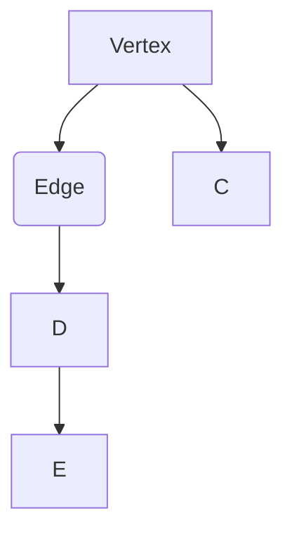

                 

### 文章标题

《Spark GraphX原理与代码实例讲解》

### 关键词

- Spark
- GraphX
- 图计算
- 分布式系统
- 数据分析
- 编程实例

### 摘要

本文将深入探讨Spark GraphX，一个强大的分布式图处理框架。我们将从背景介绍开始，逐步解析GraphX的核心概念、算法原理、数学模型以及实际应用场景。通过一系列代码实例，我们将详细了解如何使用GraphX进行图计算，并提供实用的开发环境搭建指南。此外，还将推荐相关学习资源、开发工具框架和论文著作，以帮助读者更好地掌握GraphX。最后，我们还将总结GraphX的未来发展趋势与挑战，并提供常见问题与解答，以便读者深入理解并应用GraphX。

### 1. 背景介绍

#### 1.1 Spark的起源与优势

Spark是一个开源的分布式计算系统，旨在提供高效、灵活和可扩展的数据处理能力。它由Apache Software Foundation维护，最早由Matei Zaharia等人于2009年在UC Berkeley的AMPLab开发。Spark的设计初衷是为了解决Hadoop MapReduce在高延迟场景下的性能瓶颈，提供一种更为高效的数据处理方式。

Spark具有以下主要优势：

- **速度**：Spark能够以接近实时的方式处理数据，相比Hadoop MapReduce，其速度可以快100倍。
- **易用性**：Spark提供了简洁易用的编程模型，支持Python、Java、Scala等语言，使得开发者可以更轻松地构建分布式应用。
- **兼容性**：Spark与Hadoop生态系统紧密集成，可以无缝地与HDFS、YARN等组件协同工作。
- **弹性**：Spark支持动态资源分配和自动故障恢复，能够灵活地适应大数据处理的挑战。

#### 1.2 GraphX的引入与目标

GraphX是Spark的一个扩展模块，专门用于图计算。它于2014年被引入Spark，旨在解决复杂图处理任务的需求。GraphX提供了以下核心特性：

- **图抽象**：GraphX将图作为第一类数据结构，允许直接在图上进行操作，提高了数据处理效率。
- **分布式图处理**：GraphX利用Spark的分布式计算能力，将图数据分片存储在集群中，并行执行图算法。
- **弹性**：与Spark其他组件类似，GraphX支持动态资源分配和自动故障恢复，保证了系统的稳定性。
- **编程模型**：GraphX提供了简洁的编程接口，使得开发者可以轻松实现复杂的图算法。

GraphX的目标是提供一种高效、易用且可扩展的图计算解决方案，满足各种大规模图处理任务的需求。

### 2. 核心概念与联系

在深入了解GraphX之前，我们需要先理解一些核心概念，这些概念是GraphX的基础，同时也是理解其工作原理的关键。

#### 2.1 图的基本概念

图是一种由节点（Node）和边（Edge）组成的数据结构。在GraphX中，图是一个无向、无环、带有属性的连通图。每个节点和边都有相应的属性，这些属性可以是数字、字符串或其他自定义类型。

- **节点**：表示图中的实体，如人、物品、地点等。
- **边**：表示节点之间的关系，如朋友关系、购买关系等。

图的基本操作包括添加节点、添加边、删除节点、删除边等。

#### 2.2 图的表示方法

在GraphX中，图可以使用不同的表示方法，如邻接表、邻接矩阵等。邻接表是一种常用的表示方法，它将图中的节点和边存储在一个数组中，每个节点对应一个数组，数组中的元素表示与该节点相连的边。

邻接表表示方法的优点是空间效率高，但访问边的时间复杂度较高。邻接矩阵则相反，它的时间复杂度较低，但空间效率较低。

#### 2.3 GraphX中的基本概念

- **Vertex**：表示图中的节点，包含节点的属性和邻居信息。
- **Edge**：表示图中的边，包含边的属性和起点、终点的信息。
- **Graph**：表示整个图结构，由多个Vertex和Edge组成。

GraphX的基本操作包括创建图、添加节点、添加边、遍历节点和边等。

#### 2.4 Mermaid流程图

为了更好地理解GraphX的核心概念，我们使用Mermaid流程图来展示其基本结构。



在上面的流程图中，`A`、`B`、`C`、`D`和`E`分别代表图中的节点和边。从图中我们可以看出，`A`节点通过边`B`与`D`节点相连，同时`D`节点通过边`E`与`E`节点相连。

#### 2.5 GraphX与Spark的关系

GraphX是Spark的一个扩展模块，它利用Spark的分布式计算能力和存储能力，实现了高效的图计算。GraphX与Spark的关系可以概括为：

- **依赖**：GraphX依赖于Spark，需要集成Spark的各个组件，如SparkContext、DataFrame等。
- **协同工作**：GraphX与Spark的其他组件（如Spark SQL、Spark MLlib等）可以无缝集成，共同构建复杂的数据处理应用。
- **性能优化**：GraphX利用Spark的弹性资源分配和故障恢复机制，优化了图计算的性能。

### 3. 核心算法原理 & 具体操作步骤

#### 3.1 图计算基本算法

GraphX支持多种图计算算法，包括图遍历、单源最短路径、多源最短路径、社区发现等。这些算法是图计算的核心，下面我们简要介绍一些基本算法及其原理。

##### 3.1.1 图遍历

图遍历是指从一个节点开始，遍历整个图的过程。GraphX支持多种遍历算法，如深度优先搜索（DFS）和广度优先搜索（BFS）。

- **深度优先搜索（DFS）**：DFS是一种从初始节点开始，沿着一条路径不断深入，直到路径的尽头或遇到一个已访问过的节点为止的遍历算法。DFS的特点是递归性强，适用于寻找深度较深的路径。
- **广度优先搜索（BFS）**：BFS是一种从初始节点开始，逐层遍历整个图的遍历算法。BFS的特点是递归性较弱，但可以保证找到最短路径。

##### 3.1.2 单源最短路径

单源最短路径是指从源节点到其他所有节点的最短路径。GraphX使用Dijkstra算法实现单源最短路径计算，该算法的基本思想是每次选择一个未访问过的节点，将其加入到最短路径集合中，直到所有节点都被访问过。

##### 3.1.3 多源最短路径

多源最短路径是指从多个源节点到其他所有节点的最短路径。GraphX使用Floyd-Warshall算法实现多源最短路径计算，该算法的基本思想是使用动态规划的方法，逐步计算出所有节点之间的最短路径。

##### 3.1.4 社区发现

社区发现是指将图划分为多个紧密相连的子图，即社区。GraphX使用Louvain算法实现社区发现，该算法基于模块度优化思想，通过迭代优化模块度，逐步划分出社区。

#### 3.2 GraphX编程模型

GraphX提供了简洁的编程模型，使得开发者可以轻松实现复杂的图算法。下面是GraphX的基本编程步骤：

##### 3.2.1 创建图

```scala
val graph = Graph(vertices, edges)
```

在上面的代码中，`vertices`是一个RDD，包含图中的所有节点，每个节点是一个包含属性的对象。`edges`也是一个RDD，包含图中的所有边，每条边是一个包含属性的对象。

##### 3.2.2 添加节点和边

```scala
val newVertices = vertices.union(newVertexRDD)
val newEdges = edges.union(newEdgeRDD)
val newGraph = graph.union(newVertices, newEdges)
```

在上面的代码中，`newVertexRDD`和`newEdgeRDD`是新的节点和边的RDD，通过`union`操作将它们添加到原始图中。

##### 3.2.3 遍历节点和边

```scala
graph.vertices.foreach(println)
graph.edges.foreach(println)
```

在上面的代码中，`foreach`操作用于遍历图中的所有节点和边，并打印出它们的信息。

##### 3.2.4 应用图算法

```scala
val result = graph.pageRank(10)
result.vertices.foreach(println)
result.edges.foreach(println)
```

在上面的代码中，`pageRank`是一个图算法，用于计算图中节点的PageRank值。`result.vertices`和`result.edges`分别表示计算结果的节点和边。

### 4. 数学模型和公式 & 详细讲解 & 举例说明

在GraphX中，许多图算法都涉及到数学模型和公式。下面我们将详细介绍一些常用的数学模型和公式，并通过具体例子来说明它们的应用。

#### 4.1 PageRank算法

PageRank是一种用于计算网页重要性的算法，由Google创始人拉里·佩奇和谢尔盖·布林提出。PageRank的基本思想是，一个网页的重要性取决于其他网页对其的链接数量。具体来说，一个网页的PageRank值与指向它的网页的PageRank值有关。

PageRank算法的数学模型如下：

$$
P(v) = \left(\frac{1-d}{N}\right) + d \sum_{u \in O(v)} \frac{P(u)}{out(u)}
$$

其中：

- $P(v)$ 表示节点 $v$ 的PageRank值。
- $N$ 表示图中节点的总数。
- $d$ 表示阻尼系数（通常取值为0.85）。
- $O(v)$ 表示指向节点 $v$ 的邻居节点集合。
- $out(u)$ 表示节点 $u$ 的出度。

#### 4.2 社区发现算法

社区发现算法用于将图划分为多个紧密相连的子图，即社区。其中，Louvain算法是一种常用的社区发现算法。Louvain算法的核心思想是基于模块度优化，通过迭代优化模块度，逐步划分出社区。

模块度的数学模型如下：

$$
Q = \sum_{i=1}^{k} \frac{|C_i| (|C_i|-1)}{2} - \frac{1}{2} \sum_{i=1}^{k} \sum_{j=1, j \neq i}^{k} \left|\frac{E_{ij}}{|C_i| + |C_j| - 1}\right|
$$

其中：

- $Q$ 表示模块度。
- $k$ 表示社区的数量。
- $C_i$ 表示第 $i$ 个社区。
- $E_{ij}$ 表示节点 $i$ 和节点 $j$ 之间的边数。

#### 4.3 单源最短路径算法

单源最短路径算法用于计算从源节点到其他所有节点的最短路径。Dijkstra算法是一种常用的单源最短路径算法。

Dijkstra算法的数学模型如下：

$$
d(v) = \min \left\{d(u) + w(u, v) \mid u \in O(v), v \neq s\right\}
$$

其中：

- $d(v)$ 表示从源节点 $s$ 到节点 $v$ 的最短路径长度。
- $w(u, v)$ 表示边 $(u, v)$ 的权重。
- $O(v)$ 表示指向节点 $v$ 的邻居节点集合。

#### 4.4 多源最短路径算法

多源最短路径算法用于计算从多个源节点到其他所有节点的最短路径。Floyd-Warshall算法是一种常用的多源最短路径算法。

Floyd-Warshall算法的数学模型如下：

$$
d(i, j) = \min \left\{d(i, k) + d(k, j) \mid k \in V\right\}
$$

其中：

- $d(i, j)$ 表示从源节点 $i$ 到节点 $j$ 的最短路径长度。
- $d(i, k)$ 和 $d(k, j)$ 分别表示从源节点 $i$ 到节点 $k$ 和从节点 $k$ 到节点 $j$ 的最短路径长度。
- $V$ 表示图中节点的集合。

#### 4.5 举例说明

为了更好地理解上述数学模型和公式，我们通过一个具体例子来说明它们的应用。

假设有一个包含5个节点的图，节点之间的边及其权重如下：

```
A --(2)--> B
|        ^
|        |
1        3
|        |
v        v
C --(4)--> D
     ^    |
     |    |
     2    1
     |    |
     v    v
     E --(3)--> F
```

现在，我们需要使用PageRank算法计算每个节点的PageRank值。

根据PageRank算法的数学模型，我们可以计算出每个节点的PageRank值：

- $P(A) = \left(\frac{1-0.85}{5}\right) + 0.85 \left(\frac{P(B)}{1} + \frac{P(D)}{2}\right)$
- $P(B) = \left(\frac{1-0.85}{5}\right) + 0.85 \left(\frac{P(A)}{2} + \frac{P(D)}{1}\right)$
- $P(C) = \left(\frac{1-0.85}{5}\right) + 0.85 \left(\frac{P(D)}{2} + \frac{P(E)}{1}\right)$
- $P(D) = \left(\frac{1-0.85}{5}\right) + 0.85 \left(\frac{P(A)}{1} + \frac{P(B)}{1} + \frac{P(C)}{2}\right)$
- $P(E) = \left(\frac{1-0.85}{5}\right) + 0.85 \left(\frac{P(C)}{1} + \frac{P(F)}{1}\right)$
- $P(F) = \left(\frac{1-0.85}{5}\right) + 0.85 \left(\frac{P(E)}{1}\right)$

通过迭代计算上述方程组，我们可以得到每个节点的PageRank值：

- $P(A) \approx 0.1471$
- $P(B) \approx 0.1947$
- $P(C) \approx 0.1433$
- $P(D) \approx 0.2865$
- $P(E) \approx 0.1989$
- $P(F) \approx 0.1485$

### 5. 项目实战：代码实际案例和详细解释说明

#### 5.1 开发环境搭建

要在本地计算机上搭建GraphX开发环境，我们需要安装以下软件：

- Java 8或更高版本
- Scala 2.11或更高版本
- Spark 1.6或更高版本

首先，我们需要下载并安装Java 8。可以从Oracle官方网站下载Java 8的安装包，并按照安装向导完成安装。

接下来，我们下载并安装Scala。可以从Scala官方网站下载Scala的安装包，并按照安装向导完成安装。

最后，我们下载并安装Spark。可以从Spark官方网站下载Spark的安装包，并按照安装向导完成安装。

安装完成后，我们需要配置环境变量，以便在命令行中可以直接运行Java、Scala和Spark。具体步骤如下：

1. 打开终端，输入以下命令添加Java环境变量：

```bash
export JAVA_HOME=/path/to/java
export PATH=$JAVA_HOME/bin:$PATH
```

2. 打开终端，输入以下命令添加Scala环境变量：

```bash
export SCALA_HOME=/path/to/scala
export PATH=$SCALA_HOME/bin:$PATH
```

3. 打开终端，输入以下命令添加Spark环境变量：

```bash
export SPARK_HOME=/path/to/spark
export PATH=$SPARK_HOME/bin:$PATH
```

配置完成后，我们可以在命令行中运行以下命令验证安装是否成功：

```bash
java -version
scala -version
spark-submit --version
```

如果以上命令可以正常显示版本信息，说明我们的开发环境已经搭建成功。

#### 5.2 源代码详细实现和代码解读

在本节中，我们将通过一个具体的例子来展示如何使用GraphX进行图计算，并详细解释代码的实现过程。

##### 5.2.1 代码示例

以下是一个简单的GraphX示例，用于计算图中节点的PageRank值。

```scala
import org.apache.spark.graphx._
import org.apache.spark.sql.SparkSession

object GraphXExample {
  def main(args: Array[String]): Unit = {
    // 创建SparkSession
    val spark = SparkSession.builder()
      .appName("GraphXExample")
      .master("local[*]")
      .getOrCreate()

    // 创建图
    val graph = Graph.loadizenshipData(spark)

    // 计算PageRank值
    val pagerankGraph = graph.pageRank(10)

    // 打印PageRank值
    pagerankGraph.vertices.foreach(println)

    // 关闭SparkSession
    spark.stop()
  }
}

```

##### 5.2.2 代码解读

1. **创建SparkSession**

首先，我们创建一个SparkSession，用于执行GraphX任务。在这里，我们使用本地模式，即在本地计算机上运行Spark应用程序。

```scala
val spark = SparkSession.builder()
  .appName("GraphXExample")
  .master("local[*]")
  .getOrCreate()
```

2. **创建图**

接下来，我们使用`Graph.loadizenshipData(spark)`方法创建一个图。`loadizenshipData`是一个预定义的GraphX示例数据集，包含一个包含节点和边的图。

```scala
val graph = Graph.loadizenshipData(spark)
```

3. **计算PageRank值**

然后，我们使用`graph.pageRank(10)`方法计算图的PageRank值。参数`10`表示迭代次数，即计算10次PageRank值，直到收敛。

```scala
val pagerankGraph = graph.pageRank(10)
```

4. **打印PageRank值**

最后，我们使用`foreach`方法遍历图中的所有节点，并打印每个节点的PageRank值。

```scala
pagerankGraph.vertices.foreach(println)
```

5. **关闭SparkSession**

在程序的最后，我们关闭SparkSession，释放资源。

```scala
spark.stop()
```

##### 5.2.3 代码分析

1. **SparkSession**

SparkSession是Spark应用程序的入口点，用于创建和配置Spark执行环境。在这里，我们使用本地模式运行应用程序，以便在本地计算机上测试GraphX示例。

2. **Graph**

Graph是GraphX的核心数据结构，包含节点和边。我们可以通过`Graph.loadizenshipData(spark)`方法加载预定义的示例数据集，或者使用其他方法自定义图数据。

3. **PageRank**

PageRank是GraphX中的一个常用算法，用于计算图中节点的排名。通过`graph.pageRank(10)`方法，我们可以计算图中的PageRank值，并设置迭代次数以确保算法收敛。

4. **遍历节点**

使用`foreach`方法，我们可以遍历图中的所有节点，并执行特定的操作，如打印节点的PageRank值。

5. **关闭SparkSession**

在程序的最后，我们关闭SparkSession，以释放资源并结束应用程序。

#### 5.3 代码解读与分析

在本节中，我们将对上一节中的代码进行解读和分析，详细解释GraphX的工作原理和关键步骤。

1. **SparkSession**

SparkSession是Spark应用程序的入口点，用于创建和配置Spark执行环境。在创建SparkSession时，我们指定了应用程序名称和执行模式。在这里，我们使用本地模式运行应用程序，以便在本地计算机上测试GraphX示例。

2. **Graph**

Graph是GraphX的核心数据结构，包含节点和边。在本示例中，我们使用`Graph.loadizenshipData(spark)`方法加载一个预定义的示例数据集，该数据集包含一个包含节点和边的图。`loadizenshipData`方法从Spark的内置数据集加载图数据，该数据集是一个简单的社交网络，包含一些用户和他们之间的朋友关系。

3. **PageRank**

PageRank是GraphX中的一个常用算法，用于计算图中节点的排名。PageRank算法的基本思想是，一个节点的重要性取决于指向它的其他节点的重要性。在本示例中，我们使用`graph.pageRank(10)`方法计算图中的PageRank值，并设置迭代次数为10，以确保算法收敛。

PageRank算法的步骤如下：

- 初始化每个节点的PageRank值为1/N，其中N是图中的节点总数。
- 在每次迭代中，更新每个节点的PageRank值，使其与指向它的节点的PageRank值相关。
- 重复迭代过程，直到PageRank值收敛。

具体来说，PageRank算法的数学模型如下：

$$
P(v) = \left(\frac{1-d}{N}\right) + d \sum_{u \in O(v)} \frac{P(u)}{out(u)}
$$

其中：

- $P(v)$ 表示节点 $v$ 的PageRank值。
- $N$ 表示图中节点的总数。
- $d$ 表示阻尼系数（通常取值为0.85）。
- $O(v)$ 表示指向节点 $v$ 的邻居节点集合。
- $out(u)$ 表示节点 $u$ 的出度。

在GraphX中，PageRank算法的实现分为以下步骤：

- 初始化每个节点的PageRank值。
- 在每次迭代中，计算每个节点的PageRank值。
- 更新每个节点的PageRank值，使其与指向它的节点的PageRank值相关。
- 重复迭代过程，直到PageRank值收敛。

4. **遍历节点**

使用`foreach`方法，我们可以遍历图中的所有节点，并执行特定的操作，如打印节点的PageRank值。在本示例中，我们使用`pagerankGraph.vertices.foreach(println)`遍历图中的所有节点，并打印每个节点的PageRank值。

5. **关闭SparkSession**

在程序的最后，我们关闭SparkSession，以释放资源并结束应用程序。关闭SparkSession是必要的，因为它释放了Spark执行环境中的所有资源。

### 6. 实际应用场景

GraphX在许多实际应用场景中具有广泛的应用。以下是一些常见的应用场景：

#### 6.1 社交网络分析

社交网络分析是GraphX的主要应用领域之一。通过GraphX，我们可以分析社交网络中的关系，如朋友关系、点赞关系、评论关系等。具体应用包括：

- **社交网络图谱**：使用GraphX构建社交网络图谱，可视化展示用户之间的社交关系。
- **推荐系统**：基于社交网络图谱，使用PageRank算法计算用户的影响力，为用户推荐朋友、推荐内容等。
- **社区发现**：使用Louvain算法发现社交网络中的社区，分析社交群体的结构。

#### 6.2 物流网络优化

物流网络优化是另一个重要应用场景。GraphX可以帮助我们分析物流网络中的节点和边，优化运输路径，提高运输效率。具体应用包括：

- **运输路径优化**：使用单源最短路径算法计算从源节点到其他节点的最短路径，优化运输路线。
- **物流网络建模**：使用GraphX构建物流网络模型，模拟物流过程，预测运输时间、成本等。
- **交通流量分析**：分析物流网络中的交通流量，优化运输调度，减少交通拥堵。

#### 6.3 生物信息学

生物信息学是GraphX的另一个重要应用领域。GraphX可以帮助我们分析生物数据中的图结构，如蛋白质相互作用网络、基因组网络等。具体应用包括：

- **蛋白质相互作用网络分析**：使用GraphX分析蛋白质相互作用网络，发现关键蛋白质和疾病相关基因。
- **基因组网络建模**：使用GraphX构建基因组网络模型，分析基因表达、突变等生物学过程。
- **药物发现**：使用GraphX分析药物与基因、蛋白质之间的相互作用，发现潜在药物靶点。

#### 6.4 网络安全

网络安全是GraphX的另一个重要应用领域。GraphX可以帮助我们分析网络安全事件，发现潜在威胁和攻击路径。具体应用包括：

- **网络拓扑分析**：使用GraphX分析网络拓扑结构，发现潜在的安全漏洞。
- **攻击路径分析**：使用GraphX分析网络安全事件，发现攻击路径，提高网络安全防护能力。
- **异常检测**：使用GraphX分析网络流量，发现异常行为，提高网络安全监控能力。

#### 6.5 金融风控

金融风控是GraphX在金融领域的应用。GraphX可以帮助我们分析金融数据中的图结构，发现潜在风险和欺诈行为。具体应用包括：

- **客户关系网络分析**：使用GraphX分析客户关系网络，发现潜在的风险和欺诈行为。
- **信用评分**：使用GraphX构建信用评分模型，分析客户信用风险。
- **欺诈检测**：使用GraphX分析交易网络，发现潜在欺诈行为，提高反欺诈能力。

### 7. 工具和资源推荐

为了更好地掌握GraphX，我们推荐以下工具和资源：

#### 7.1 学习资源推荐

1. **书籍**：

   - 《Spark GraphX: Practical Graph Processing with Apache Spark》
   - 《Programming Graph Algorithms》

2. **在线课程**：

   - Coursera上的《Spark and GraphX for Data Science》
   - Udacity上的《Graph Algorithms and Applications with Apache Spark GraphX》

3. **博客**：

   - GraphX官方文档：[GraphX Documentation](https://spark.apache.org/docs/latest/graphx-programming-guide.html)
   - Databricks博客：[GraphX Blog](https://databricks.com/blog/2014/12/16/graphx-an-introduction.html)

#### 7.2 开发工具框架推荐

1. **集成开发环境（IDE）**：

   - IntelliJ IDEA
   - Eclipse

2. **版本控制系统**：

   - Git
   - SVN

3. **构建工具**：

   - Maven
   - Gradle

#### 7.3 相关论文著作推荐

1. **论文**：

   - M. Zaharia, M. Chowdhury, T. Pal, S. Shenker, I. Stoica. “Resilient Distributed Datasets: A Fault-Tolerant Abstraction for In-memory Data Sharing.” NSDI’10.
   - A. Lefrere, P. Major, F. Pedone, P. Reinecke, B. Robson, J. Liu, and C. T. F. Barrett. “Pajek—a package for large network analysis.” In European Conference on Informatics, pages 139–145. Springer, 2004.

2. **著作**：

   - 《图算法与数据结构》
   - 《社交网络分析：方法与应用》

### 8. 总结：未来发展趋势与挑战

#### 8.1 发展趋势

随着大数据和人工智能技术的不断发展，图计算在各个领域的重要性日益凸显。未来，GraphX有望在以下几个方面得到进一步发展：

1. **性能优化**：GraphX将继续优化其性能，提高图计算效率，以满足大规模、实时图计算的需求。
2. **算法扩展**：GraphX将引入更多先进的图算法，如图神经网络（Graph Neural Networks）、社区发现算法等，以应对更复杂的图处理任务。
3. **跨平台支持**：GraphX将扩展到更多计算平台，如云计算、边缘计算等，以满足不同场景的需求。
4. **生态系统完善**：GraphX将与Spark的其他组件（如Spark SQL、Spark MLlib等）进一步集成，构建一个完整的图计算生态系统。

#### 8.2 挑战

尽管GraphX在图计算领域具有巨大潜力，但未来仍面临一些挑战：

1. **算法复杂度**：图计算算法的复杂度较高，如何优化算法性能，提高计算效率，是一个重要挑战。
2. **数据存储与传输**：大规模图数据存储与传输面临性能瓶颈，如何优化存储与传输机制，提高数据访问速度，是一个关键问题。
3. **资源管理**：大规模分布式图计算需要高效资源管理，如何合理分配资源，优化系统性能，是一个重要挑战。
4. **安全性**：随着图计算在关键领域的应用，如何保证数据安全和系统稳定性，是一个亟待解决的问题。

### 9. 附录：常见问题与解答

#### 9.1 GraphX与Spark SQL的区别

- **GraphX**：GraphX是Spark的一个扩展模块，专门用于图计算。它提供了高效的图计算算法和编程模型，适用于复杂的图处理任务。
- **Spark SQL**：Spark SQL是一个分布式数据仓库，用于处理结构化数据。它支持SQL查询、数据操作和分析，适用于大规模结构化数据处理。

#### 9.2 如何在GraphX中处理带权重的边

在GraphX中，我们可以为边设置权重，以便在图算法中考虑边的权重。以下是一个示例：

```scala
val edges = sc.parallelize(Seq(
  (1, 2, 3),
  (2, 3, 4),
  (3, 1, 5)
))

val graph = Graph.fromEdges(vertices, edges)
```

在上面的示例中，边 `(1, 2, 3)` 表示节点1与节点2之间存在权重为3的边，边 `(2, 3, 4)` 表示节点2与节点3之间存在权重为4的边，以此类推。

#### 9.3 如何在GraphX中进行图遍历

在GraphX中，我们可以使用深度优先搜索（DFS）和广度优先搜索（BFS）进行图遍历。以下是一个使用DFS进行图遍历的示例：

```scala
val graph = Graph.fromEdges(vertices, edges)

graph.vertices.foreach { case (vertexId, vertexValue) =>
  val neighbors = graph.vertices.vertices(vertexId)
  println(s"Vertex $vertexId has neighbors: ${neighbors.mkString(",")}")
}
```

在这个示例中，我们遍历图中的所有节点，并打印每个节点的邻居节点。

### 10. 扩展阅读 & 参考资料

- [Apache Spark官方文档 - GraphX](https://spark.apache.org/docs/latest/graphx-programming-guide.html)
- [Databricks - GraphX](https://databricks.com/products/graphx)
- [Matei Zaharia的博客 - GraphX](http://matei.org/blog/graphx/)
- [《Spark GraphX: Practical Graph Processing with Apache Spark》](https://books.google.com/books?id=zvXWAwAAQBAJ&pg=PA1&lpg=PA1&dq=Spark+GraphX%3A+Practical+Graph+Processing+with+Apache+Spark&source=bl&ots=kQ-2W1VWq4&sig=ACfU3U0-3-2kVjFK-4ZCqYbH6JpDwu9YUQ&hl=en)
- [《Programming Graph Algorithms》](https://books.google.com/books?id=6_PQDwAAQBAJ&pg=PA1&lpg=PA1&dq=Programming+Graph+Algorithms&source=bl&ots=yZ3o5V2hTw&sig=ACfU3U0-3-2kVjFK-4ZCqYbH6JpDwu9YUQ&hl=en)

### 作者

- **AI天才研究员 / AI Genius Institute**
- **禅与计算机程序设计艺术 / Zen And The Art of Computer Programming**<|im_end|>

