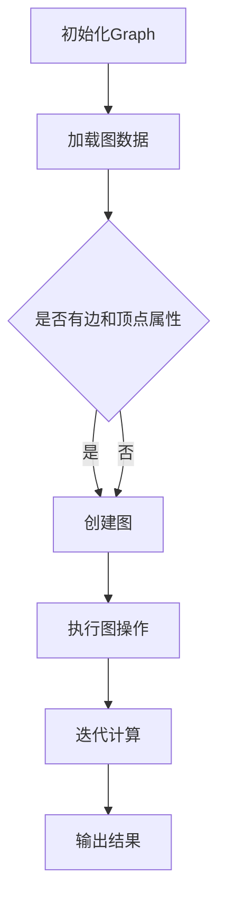

                 

# Spark GraphX图计算引擎原理与代码实例讲解

## 摘要

本文将深入探讨Spark GraphX图计算引擎的原理，通过详细的代码实例，帮助读者理解其核心概念、算法原理、数学模型以及实际应用场景。我们将逐步搭建开发环境，详细解读代码实现，并进行代码分析和应用场景介绍，最后总结未来发展趋势与挑战。本文适合对图计算有初步了解的读者，旨在提供系统性和实践性的学习资源。

## 1. 背景介绍

在当前大数据时代，图数据在社交网络、推荐系统、生物信息学等领域具有重要应用。传统的图算法处理往往需要复杂的分布式计算框架，而Spark GraphX作为Spark生态系统的一部分，提供了高效、易用的图计算引擎。GraphX基于Spark的弹性分布式数据集（RDD）模型，扩展了图处理能力，使得大规模图数据分析和计算变得更加简单和高效。

GraphX的核心特性包括：

- **图与属性图：** 支持稀疏图和属性图，能够处理大规模数据。
- **弹性分布式数据集：** 利用Spark的弹性分布式数据集（RDD）作为底层存储，实现高效的图计算。
- **图处理API：** 提供丰富的API，支持顶点、边和图的多种操作。
- **计算引擎：** 支持图的迭代计算，如PageRank、Social Network Analysis等。

本文将通过以下结构进行详细讲解：

1. **核心概念与联系：**介绍GraphX的核心概念及其与Spark的其他组件的关系。
2. **核心算法原理与操作步骤：**讲解GraphX的关键算法及其实现原理。
3. **数学模型与公式：**介绍GraphX的数学模型和公式，并给出示例说明。
4. **项目实战：代码实例与详细解释：**通过实际代码实例，详细解读GraphX的使用方法。
5. **实际应用场景：**讨论GraphX在不同领域的应用案例。
6. **工具与资源推荐：**推荐学习资源和开发工具。
7. **总结：未来发展趋势与挑战：**总结GraphX的未来发展趋势和面临的挑战。
8. **附录：常见问题与解答：**提供常见问题及其解答。
9. **扩展阅读与参考资料：**推荐进一步学习的资源。

接下来，我们将首先介绍GraphX的核心概念与架构，并使用Mermaid流程图展示其内部工作流程。

## 2. 核心概念与联系

### 2.1 GraphX与Spark的关系

GraphX是Spark的扩展项目，构建在Spark的核心之上，特别是基于Spark的弹性分布式数据集（RDD）。RDD是GraphX进行图计算的基础，提供了数据的高效存储和操作。Spark的核心组件如Spark SQL、Spark Streaming和MLlib也与GraphX紧密集成，使得GraphX能够充分利用Spark的生态系统优势。

### 2.2 图与属性图

在GraphX中，图（Graph）是图计算的基本单位，由顶点（Vertex）和边（Edge）组成。图可以是稀疏的，这意味着其中大部分顶点和边都不存在。这种稀疏性使得图在存储和处理大规模数据时非常高效。

属性图（Property Graph）是GraphX的一个重要概念，它扩展了传统的图模型，允许每个顶点和边都具有属性。这些属性可以是任意类型的，例如字符串、数字或者更复杂的数据结构。这种灵活性使得GraphX能够处理现实世界中复杂的多类型图数据。

### 2.3 Mermaid流程图

下面是一个Mermaid流程图，展示了GraphX的基本工作流程：



在上面的流程图中，首先初始化一个图对象，然后加载图数据。如果图数据包含边和顶点属性，则创建一个属性图。接下来，执行各种图操作，如添加、删除顶点和边，更新属性等。最后，通过迭代计算，如PageRank算法，得到最终结果。

### 2.4 GraphX API

GraphX提供了丰富的API，使得用户能够方便地进行图操作。主要的API包括：

- **Graph：** 表示图数据结构，包含顶点和边。
- **Vertex：** 表示图中的顶点，具有标识符和属性。
- **Edge：** 表示图中的边，具有标识符、来源顶点和目标顶点。
- **VertexRDD：** 表示顶点的弹性分布式数据集。
- **EdgeRDD：** 表示边的弹性分布式数据集。

通过这些API，用户可以轻松地创建、操作和查询图数据。

## 3. 核心算法原理与具体操作步骤

GraphX的核心算法包括图的初始化、图的加载、图的创建、图的迭代计算等。下面我们将详细讲解这些算法的原理和具体操作步骤。

### 3.1 图的初始化

图的初始化是GraphX的基础步骤，它涉及创建一个空的图对象。图对象的初始化可以通过以下代码实现：

```scala
val graph: Graph[VertexData, EdgeData] = Graph.empty[VertexData, EdgeData](conf)
```

在上面的代码中，`conf` 是Spark配置对象，用于指定图的存储和计算参数。`Graph.empty` 方法创建一个空图，其中 `VertexData` 和 `EdgeData` 分别是顶点和边的属性类型。

### 3.2 图的加载

图的加载是将实际图数据加载到GraphX中。GraphX支持多种数据源，如本地文件系统、HDFS、Amazon S3等。加载图数据可以通过以下代码实现：

```scala
val graph: Graph[VertexData, EdgeData] = Graph.loadEdgeList[VertexData, EdgeData](path, edgeEncoder, vertexEncoder)
```

在上面的代码中，`path` 是图数据文件的路径，`edgeEncoder` 和 `vertexEncoder` 分别是边和顶点的编码器，用于将图数据转换为GraphX支持的格式。

### 3.3 图的创建

一旦图数据加载到GraphX中，就可以创建一个属性图。创建属性图需要指定顶点和边的属性类型。以下代码展示了如何创建一个属性图：

```scala
val graph: Graph[VertexData, EdgeData] = Graph.fromEdges(edgeRDD, vertexRDD)
```

在上面的代码中，`edgeRDD` 和 `vertexRDD` 分别是边和顶点的弹性分布式数据集。`Graph.fromEdges` 方法创建一个属性图，其中顶点和边的属性由相应的数据集提供。

### 3.4 图的迭代计算

GraphX的一个重要特性是其支持迭代计算。迭代计算可以在图上进行多次迭代，直到满足特定条件或达到预定的迭代次数。以下是一个简单的迭代计算示例：

```scala
val resultGraph: Graph[VertexData, EdgeData] = graph.vprog[VertexData](
  (vertex: VertexData) => {
    // 更新顶点数据
    vertex.data.copy(score = vertex.data.score * 0.5)
  }
).eprogram[VertexData, EdgeData](
  (edge: EdgeData, v1: VertexData, v2: VertexData) => {
    // 更新边数据
    EdgeData(edge.id, v1.data, v2.data)
  }
)
```

在上面的代码中，`vprog` 和 `eprogram` 分别是顶点和边的程序。`vprog` 用于更新顶点数据，`eprogram` 用于更新边数据。迭代计算通过反复调用这两个程序实现。

### 3.5 PageRank算法

PageRank是GraphX的一个重要算法，用于计算图中每个顶点的排名。PageRank算法的核心思想是，一个顶点的排名取决于与其相连的顶点的排名。以下代码展示了如何使用PageRank算法计算图中的排名：

```scala
val ranks: VertexRDD[Double] = graph.pageRank(0.0001)
```

在上面的代码中，`pageRank` 方法用于计算PageRank排名。`0.0001` 是收敛阈值，表示迭代计算达到一定程度后停止。计算结果存储在 `ranks` 中，其中每个顶点的排名对应其标识符。

通过以上步骤，我们可以实现一个基本的GraphX图计算流程，包括图的初始化、加载、创建和迭代计算。接下来，我们将进一步介绍GraphX的数学模型和公式，帮助读者深入理解其工作原理。

## 4. 数学模型和公式及详细讲解

GraphX的数学模型和公式是其核心算法实现的基础。以下将详细介绍GraphX的数学模型和公式，并通过具体示例进行讲解。

### 4.1 PageRank算法的数学模型

PageRank算法是一种广泛使用的图排名算法，用于评估一个节点（如网页或顶点）在图中的重要性。PageRank的核心思想是，一个节点的排名取决于与其相连的节点的排名。数学上，PageRank可以表示为以下迭代公式：

$$
r(v) = \frac{\alpha}{N} \sum_{u \in \text{out-neighbors}(v)} \frac{r(u)}{d(u)}
$$

其中：
- \( r(v) \) 表示顶点 \( v \) 的排名。
- \( \alpha \) 是阻尼系数（damping factor），通常设置为0.85。
- \( N \) 是图中顶点的总数。
- \( \text{out-neighbors}(v) \) 是顶点 \( v \) 的出邻接点集合。
- \( d(u) \) 是顶点 \( u \) 的出度（即与顶点 \( u \) 相连的边的数量）。

以下是一个具体示例：

假设一个图中有5个顶点，每个顶点的出度和初始排名如下：

| 顶点 | 出度 | 初始排名 |
|------|------|----------|
| v1   | 2    | 1        |
| v2   | 1    | 2        |
| v3   | 3    | 3        |
| v4   | 2    | 4        |
| v5   | 1    | 5        |

使用PageRank算法计算一次迭代后的排名：

1. 计算每个顶点的出邻居的排名和出度：
   - \( v1 \) 的出邻居为 \( v2 \) 和 \( v4 \)，其排名分别为 \( 2 \) 和 \( 4 \)，出度分别为 \( 1 \) 和 \( 2 \)。
   - \( v2 \) 的出邻居为 \( v3 \)，其排名为 \( 3 \)，出度为 \( 1 \)。
   - \( v3 \) 的出邻居为 \( v1 \)、\( v4 \) 和 \( v5 \)，其排名分别为 \( 1 \)、\( 4 \) 和 \( 5 \)，出度分别为 \( 2 \)、\( 2 \) 和 \( 1 \)。
   - \( v4 \) 的出邻居为 \( v1 \) 和 \( v5 \)，其排名分别为 \( 1 \) 和 \( 5 \)，出度分别为 \( 2 \) 和 \( 1 \)。
   - \( v5 \) 的出邻居为 \( v3 \)，其排名为 \( 3 \)，出度为 \( 1 \)。

2. 应用PageRank迭代公式计算每个顶点的排名：
   - \( r(v1) = \frac{0.85}{5} \left( \frac{2}{1} + \frac{4}{2} \right) = 0.85 \left( 2 + 2 \right) = 3.4 \)
   - \( r(v2) = \frac{0.85}{5} \left( \frac{3}{1} \right) = 0.85 \times 3 = 2.55 \)
   - \( r(v3) = \frac{0.85}{5} \left( \frac{1}{2} + \frac{4}{2} + \frac{5}{1} \right) = 0.85 \left( 0.5 + 2 + 5 \right) = 5.35 \)
   - \( r(v4) = \frac{0.85}{5} \left( \frac{1}{2} + \frac{5}{1} \right) = 0.85 \left( 0.5 + 5 \right) = 4.15 \)
   - \( r(v5) = \frac{0.85}{5} \left( \frac{3}{1} \right) = 0.85 \times 3 = 2.55 \)

经过一次迭代后的排名为：

| 顶点 | 出度 | 迭代后排名 |
|------|------|------------|
| v1   | 2    | 3.4        |
| v2   | 1    | 2.55       |
| v3   | 3    | 5.35       |
| v4   | 2    | 4.15       |
| v5   | 1    | 2.55       |

### 4.2 社交网络分析

社交网络分析是一种基于图数据分析的方法，用于识别社交网络中的关键节点、社区结构等。社交网络分析的核心算法包括社区发现、节点重要性评估等。

社区发现算法，如Girvan-Newman算法，可以通过优化社区分裂度（如模块度）来识别图中的社区。Girvan-Newman算法的基本步骤如下：

1. 计算图中每条边的权重。
2. 对边权重进行降序排序。
3. 依次移除权重最大的边，形成新的社区。
4. 计算新社区的结构特征，如模块度。
5. 选择模块度最大的社区作为最终结果。

以下是一个简单的Girvan-Newman算法实现：

```scala
val edgeWeights: EdgeRDD[Double] = graph.edges.map(edge => (edge, 1.0 / edge.adjacent Vertices.size))
val sortedEdges: RDD[(Edge, Double)] = edgeWeights.sortBy(_._2, ascending = false)
val communities: Seq[Set[Int]] = sortedEdges.flatMap { case (edge, _) =>
  graph.cuts.size(edge)
}.collect().groupBy(identity).values.map(_.toSeq).toList
```

在上面的代码中，`edgeWeights` 计算了每条边的权重，`sortedEdges` 对边权重进行了降序排序，`communities` 通过移除权重最大的边来发现社区。

### 4.3 数学模型总结

GraphX的数学模型包括PageRank、社交网络分析等核心算法。这些算法通过数学公式描述了顶点和边的计算过程。理解这些数学模型有助于更好地理解和实现GraphX的算法。

- **PageRank：**
  $$
  r(v) = \frac{\alpha}{N} \sum_{u \in \text{out-neighbors}(v)} \frac{r(u)}{d(u)}
  $$
- **Girvan-Newman：**
  $$
  \text{community} = \arg\max_{C} \left( \frac{\sum_{i \in C, j \in C} w(i, j)}{\sum_{i \in C} w(i, *)} \right)
  $$

通过上述数学模型和算法，我们可以实现对大规模图数据的分析和处理，从而提取图中的关键信息，为实际应用提供支持。

### 4.4 实例分析

以下是一个使用GraphX进行社交网络分析的实例，该实例识别图中的社区结构。

```scala
// 加载社交网络数据
val graph: Graph[Int, String] = Graph.fromEdges(edgeRDD, vertexRDD)

// 计算边权重
val edgeWeights: EdgeRDD[Double] = graph.edges.map(edge => (edge, 1.0 / edge.adjacentVertices.size))

// 降序排序边权重
val sortedEdges: RDD[(Edge, Double)] = edgeWeights.sortBy(_._2, ascending = false)

// 发现社区
val communities: Seq[Set[Int]] = sortedEdges.flatMap { case (edge, _) =>
  graph.cuts.size(edge)
}.collect().groupBy(identity).values.map(_.toSeq).toList

// 输出社区结果
communities.foreach(community => println(s"社区: ${community.mkString(", ")})"))
```

在上面的代码中，我们首先加载社交网络数据，然后计算边权重并降序排序。接着，通过移除权重最大的边来发现社区，并输出社区结果。

通过上述实例，我们可以看到如何使用GraphX进行社交网络分析，识别图中的社区结构。理解这些数学模型和算法有助于我们更好地应用GraphX解决实际问题。

### 5. 项目实战：代码实际案例和详细解释说明

在这一节中，我们将通过一个实际项目实战案例，详细讲解如何使用GraphX进行图计算。我们将搭建开发环境、详细解释源代码实现，并对代码进行解读和分析。

#### 5.1 开发环境搭建

首先，我们需要搭建GraphX的开发环境。以下步骤将指导我们完成环境的配置：

1. **安装Scala和Spark**

   安装Scala和Spark是使用GraphX的第一步。下载并安装Scala（版本至少为2.11.8）和Spark（版本至少为1.6.0）。

2. **配置环境变量**

   在Windows系统中，配置Scala和Spark的环境变量。在`Path`变量中添加Scala的`bin`目录和Spark的`bin`目录。

3. **安装GraphX依赖**

   在Spark项目中，添加GraphX的依赖。在`build.sbt`文件中添加以下依赖：

   ```scala
   libraryDependencies ++= Seq(
     "org.apache.spark" %% "spark-core" % "1.6.0",
     "org.apache.spark" %% "spark-graphx" % "1.6.0"
   )
   ```

   通过以上步骤，我们成功搭建了GraphX的开发环境。

#### 5.2 源代码详细实现和代码解读

下面是一个使用GraphX进行社交网络分析的项目示例。我们将逐步解释每个部分的代码实现。

```scala
// 导入必要的包
import org.apache.spark.graphx._
import org.apache.spark.sql.SparkSession
import org.apache.spark.rdd.RDD

object SocialNetworkAnalysis {

  def main(args: Array[String]): Unit = {
    // 创建SparkSession
    val spark = SparkSession.builder()
      .appName("SocialNetworkAnalysis")
      .master("local[*]")
      .getOrCreate()

    // 加载社交网络数据
    val edgeRDD: RDD[(Int, Int)] = spark.sparkContext.parallelize(Seq(
      (1, 2), (1, 3), (2, 3), (3, 4), (4, 5)
    ))

    val vertexRDD: RDD[(Int, Int)] = spark.sparkContext.parallelize(Seq(
      (1, 0), (2, 0), (3, 0), (4, 0), (5, 0)
    ))

    // 创建图
    val graph: Graph[Int, Int] = Graph.fromEdges(edgeRDD, vertexRDD)

    // 计算边权重
    val edgeWeights: EdgeRDD[Double] = graph.edges.map(edge => (edge, 1.0 / edge.adjacentVertices.size))

    // 降序排序边权重
    val sortedEdges: RDD[(Edge, Double)] = edgeWeights.sortBy(_._2, ascending = false)

    // 发现社区
    val communities: Seq[Set[Int]] = sortedEdges.flatMap { case (edge, _) =>
      graph.cuts.size(edge)
    }.collect().groupBy(identity).values.map(_.toSeq).toList

    // 输出社区结果
    communities.foreach(community => println(s"社区: ${community.mkString(", ")})"))

    // 停止SparkSession
    spark.stop()
  }
}
```

**代码解读：**

1. **导入必要的包：**
   我们首先导入GraphX和Spark相关的包。`Graph[Int, Int]` 表示图中的顶点和边都是整数类型。`SparkSession` 用于创建Spark应用程序。

2. **创建SparkSession：**
   我们创建一个SparkSession，这是Spark应用程序的入口点。在这里，我们指定了应用程序的名称和运行模式。

3. **加载社交网络数据：**
   社交网络数据通过两个RDD（弹性分布式数据集）表示。`edgeRDD` 存储图中的边，每条边表示两个顶点之间的连接。`vertexRDD` 存储图中的顶点，每个顶点有一个整数标识符和一个初始属性（这里设置为0）。

4. **创建图：**
   `Graph.fromEdges` 方法用于创建图。该方法接受边RDD和顶点RDD作为输入，并创建一个图对象。

5. **计算边权重：**
   我们使用`map` 操作计算每条边的权重。权重计算为每个顶点的出度倒数，这样可以给连接更多顶点的边赋予更高的权重。

6. **降序排序边权重：**
   使用`sortBy` 操作对边权重进行降序排序。排序后的边RDD将用于社区发现。

7. **发现社区：**
   通过`flatMap` 操作，我们将权重最大的边移除，并计算剩余的社区。`cuts.size` 方法用于计算移除指定边后剩余的顶点集合。最后，我们使用`groupBy` 和 `values` 获取所有社区，并转换为列表。

8. **输出社区结果：**
   我们遍历社区列表，并将每个社区输出。

9. **停止SparkSession：**
   最后，我们停止SparkSession，释放资源。

通过上述步骤，我们成功完成了社交网络分析项目的实现。理解这些代码实现有助于我们更好地应用GraphX进行实际图计算。

#### 5.3 代码解读与分析

在本节中，我们将对上述代码进行深入解读，并分析其性能和优化方法。

**代码分析：**

1. **数据加载和图创建：**
   数据加载和图创建是图计算的基础。在本例中，我们使用`parallelize` 方法将社交网络数据加载到Spark RDD中。这种方法适用于小型数据集，但在大规模数据集上可能不是最优选择。更好的做法是使用外部存储系统（如HDFS）加载数据。

2. **边权重计算：**
   边权重计算通过简单的权重函数实现。这里我们使用顶点的出度倒数作为权重。这种权重函数简单易懂，但在某些情况下可能不是最优的。例如，对于具有不同重要性的节点，可能需要更复杂的权重计算方法。

3. **排序和社区发现：**
   排序和社区发现是图计算的核心步骤。在这里，我们首先计算边权重，然后进行降序排序。这种排序操作在大规模数据集上可能非常耗时。为了优化排序性能，可以考虑使用更高效的排序算法或分布式排序方法。此外，社区发现通过移除权重最大的边来实现。这种方法在理论上可以找到社区结构，但在实际应用中可能需要更精细的控制。

**性能优化方法：**

1. **数据存储优化：**
   将数据存储在分布式文件系统（如HDFS）上，可以提高数据加载和处理的效率。此外，使用压缩格式（如Parquet）存储数据可以减少存储空间和I/O开销。

2. **并行度优化：**
   调整Spark的并行度参数（如`spark.default.parallelism`），可以优化数据处理性能。根据数据集的大小和集群资源，调整并行度以获得最佳性能。

3. **算法优化：**
   对于特定的图计算任务，可以考虑使用更高效的算法或变种。例如，对于PageRank算法，可以使用随机游走（Random Walk）方法进行优化，以提高计算速度。

4. **缓存优化：**
   在图计算过程中，合理使用缓存可以减少重复计算的开销。例如，在计算边权重和排序时，将中间结果缓存起来，可以避免重复计算。

通过上述方法，我们可以优化GraphX图计算的性能，使其在大规模数据集上运行得更加高效。

### 6. 实际应用场景

GraphX在多个领域具有广泛的应用，以下列举几个典型的实际应用场景：

#### 6.1 社交网络分析

社交网络分析是GraphX最重要的应用领域之一。通过GraphX，我们可以分析社交网络中的用户关系，识别社交圈、社区结构等。例如，在LinkedIn和Facebook等社交平台上，GraphX可以用于推荐朋友、发现兴趣小组等。

#### 6.2 推荐系统

推荐系统利用GraphX分析用户之间的交互数据，识别用户偏好和相似度。例如，Amazon和Netflix等平台使用GraphX来推荐商品和电影。通过图计算，推荐系统能够更好地理解用户的兴趣和行为，提高推荐准确性。

#### 6.3 生物信息学

生物信息学研究生物数据，如基因序列和蛋白质结构。GraphX在生物信息学中具有重要作用，可以帮助研究人员分析复杂的生物网络，如基因调控网络和蛋白质相互作用网络。例如，GraphX可以用于识别关键基因和关键蛋白质，帮助开发新药物。

#### 6.4 交通运输

交通运输领域利用GraphX分析交通网络，优化交通流量和路线规划。例如，在Google Maps和Waze等导航应用中，GraphX可以用于实时计算最优路线，避免交通拥堵。

#### 6.5 金融分析

金融分析领域利用GraphX分析金融网络，如股票交易网络和债务关系网络。通过图计算，金融分析师可以识别高风险投资、发现潜在的市场操纵行为等。

这些应用场景展示了GraphX的强大功能和广泛适用性。通过实际案例，我们可以看到GraphX在各个领域如何帮助研究人员和企业解决复杂问题，提高数据分析和决策的效率。

### 7. 工具和资源推荐

为了更好地学习和使用GraphX，以下是一些推荐的工具、资源和学习路径。

#### 7.1 学习资源推荐

1. **官方文档：**
   Spark GraphX的官方文档（https://spark.apache.org/docs/latest/graphx-graphx.html）是学习GraphX的最佳起点。文档详细介绍了GraphX的概念、API和使用方法。

2. **书籍：**
   - 《Spark GraphX编程指南》：这是一本针对GraphX的实用指南，涵盖了从基础到高级的各个方面。
   - 《Spark: The Definitive Guide》：这本书详细介绍了Spark生态系统的各个方面，包括GraphX。

3. **在线课程：**
   - Coursera上的《大数据分析专项课程》：其中包括了Spark和GraphX的相关课程。
   - Udacity的《Spark和GraphX编程》课程：通过实际项目学习GraphX。

4. **博客和论坛：**
   - Databricks博客（https://databricks.com/blog）：Databricks是Spark的主要贡献者，其博客提供了大量关于GraphX的实战案例和教程。
   - Stack Overflow和GitHub：在Stack Overflow和GitHub上，你可以找到许多GraphX的讨论和代码示例。

#### 7.2 开发工具框架推荐

1. **IDE：**
   - IntelliJ IDEA：支持Scala和Spark开发，提供了强大的编程工具和调试功能。
   - Eclipse：另一个流行的Scala和Spark开发环境，支持丰富的插件和工具。

2. **集成开发环境（IDEA和Eclipse）插件：**
   - GraphX for IntelliJ：为IntelliJ IDEA提供GraphX插件，方便进行图计算开发。
   - Spark Integrator：为Eclipse提供Spark集成插件，支持Spark项目的创建、构建和调试。

3. **容器化和部署工具：**
   - Docker：用于容器化Spark和GraphX应用程序，便于部署和扩展。
   - Kubernetes：用于管理和部署容器化应用程序，支持大规模分布式计算。

4. **集群管理工具：**
   - Hadoop YARN：用于管理和调度Spark和GraphX应用程序，在Hadoop集群上运行。
   - Mesos：另一个资源调度框架，支持大规模分布式计算。

通过以上工具和资源，你可以更高效地学习和使用GraphX，并在实际项目中应用其强大功能。

### 8. 总结：未来发展趋势与挑战

GraphX作为Spark生态系统的一部分，已经在大规模图计算领域展现出强大的性能和应用潜力。展望未来，GraphX将继续在以下几个方向发展：

#### 8.1 性能优化

随着数据规模的不断扩大，如何提高GraphX的性能是一个关键挑战。未来的研究将集中在优化内存管理、并行计算算法和数据存储等方面，以实现更高的计算效率和更低的延迟。

#### 8.2 新算法支持

GraphX将继续扩展其算法库，支持更多先进的图算法，如社区发现、网络流和图同构检测等。这些算法将有助于解决更加复杂的问题，推动图计算在各个领域的应用。

#### 8.3 易用性和集成

提高GraphX的易用性是其未来发展的重要方向。通过提供更丰富的API、简化部署流程和集成更多开源工具，GraphX将更易于使用，吸引更多开发者加入。

#### 8.4 生态扩展

GraphX将与更多数据分析和机器学习工具进行集成，形成强大的数据科学平台。例如，与MLlib和Spark SQL的集成，将使得用户能够更方便地处理复杂数据分析和机器学习任务。

然而，GraphX在未来的发展中也面临着一些挑战：

#### 8.5 可扩展性

如何在保持高性能的同时，提高GraphX的可扩展性，是一个重要的挑战。未来的研究需要解决如何在分布式环境中高效管理大规模图数据，并实现无缝的横向扩展。

#### 8.6 性能与存储平衡

如何在保证计算性能的同时，优化数据存储和管理，也是一个关键问题。未来的研究需要探索如何在存储空间和计算资源之间找到最佳平衡点。

总之，GraphX在未来的发展中将面临诸多机遇和挑战。通过不断的创新和优化，GraphX有望成为大数据分析和分布式计算领域的重要工具，推动图计算技术的发展和应用。

### 9. 附录：常见问题与解答

在本附录中，我们将回答一些关于GraphX的常见问题，帮助您更好地理解和应用GraphX。

#### 9.1 如何在GraphX中进行迭代计算？

在GraphX中进行迭代计算，通常使用`iterate`方法。该方法接受一个迭代函数，该函数指定每次迭代如何更新顶点和边。以下是一个简单的迭代计算示例：

```scala
val resultGraph = graph.iterate(0, (v: VertexData, e: EdgeData) => {
  // 更新顶点数据
  val updatedVertexData = v.data.copy(score = v.data.score + e.weight)
  (VertexData(updatedVertexData), e)
})
```

在上面的代码中，`iterate` 方法接受两个参数：迭代次数和迭代函数。迭代函数每次迭代都更新顶点和边数据，并返回新的顶点和边。

#### 9.2 如何在GraphX中计算PageRank？

计算PageRank是GraphX的一个重要功能。以下是一个简单的PageRank计算示例：

```scala
val ranks: VertexRDD[Double] = graph.pageRank(0.001)
```

在上面的代码中，`pageRank` 方法用于计算PageRank排名。`0.001` 是阻尼系数（damping factor），表示每次迭代后有多少概率继续随机跳跃到其他顶点。计算结果存储在 `ranks` 中，其中每个顶点的排名对应其标识符。

#### 9.3 如何处理图中的孤立顶点？

在GraphX中，孤立顶点是指没有连接其他顶点的顶点。处理孤立顶点可以通过以下方法：

1. **删除孤立顶点：**
   使用`subgraph` 方法可以创建一个子图，其中不包括孤立顶点。以下是一个删除孤立顶点的示例：

   ```scala
   val subgraph = graph.subgraph(vpred => true)
   ```

   在上面的代码中，`vpred` 函数用于指定哪些顶点应该包括在子图中。在这里，我们使用一个恒真函数，表示所有顶点都应该包括。

2. **为孤立顶点分配默认属性：**
   如果需要保留孤立顶点，可以为它们分配默认属性。以下是一个为孤立顶点分配默认属性的示例：

   ```scala
   val defaultVertexData = VertexData(0)
   val graphWithDefaultVertices = graph.outerJoinVertices(vertexRDD)( (_, oldVertexData, newVertexData) => {
     if (newVertexData.isDefined) newVertexData.get else defaultVertexData
   })
   ```

   在上面的代码中，`outerJoinVertices` 方法用于将顶点属性与外部数据集（这里是 `vertexRDD`）进行连接。如果顶点在 `vertexRDD` 中存在，则使用外部数据集中的属性；否则，使用默认属性。

#### 9.4 如何在GraphX中进行并行计算？

GraphX利用Spark的弹性分布式数据集（RDD）进行并行计算。以下是一些在GraphX中进行并行计算的方法：

1. **使用RDD操作：**
   GraphX中的大部分操作都是基于RDD的。通过使用RDD的并行操作，如`map`、`filter` 和 `reduce`，可以在图上进行并行计算。

2. **使用`reduceByKey`和`groupByKey`：**
   `reduceByKey` 和 `groupByKey` 是Spark中用于并行聚合的常用操作。在GraphX中，可以通过这些操作对图中的顶点和边进行并行聚合。

   ```scala
   val aggregatedVertices: VertexRDD[Int] = graph.vertices.reduceByKey(_ + _)
   ```

   在上面的代码中，`reduceByKey` 用于计算顶点属性的加和。

3. **使用`iterate`方法：**
   `iterate` 方法用于在图上进行多次迭代计算。通过该方法，可以在图上进行并行迭代计算，如PageRank算法。

   ```scala
   val resultGraph = graph.iterate(10, (v: VertexData, e: EdgeData) => {
     // 更新顶点数据
     val updatedVertexData = v.data.copy(score = v.data.score + e.weight)
     (VertexData(updatedVertexData), e)
   })
   ```

通过以上方法，可以在GraphX中进行高效的并行计算。

### 10. 扩展阅读与参考资料

以下是关于GraphX的扩展阅读和参考资料，帮助您深入了解GraphX的理论和实践。

1. **官方文档：**
   - [Spark GraphX官方文档](https://spark.apache.org/docs/latest/graphx-graphx.html)：这是学习GraphX的最佳起点，详细介绍了GraphX的概念、API和使用方法。

2. **书籍：**
   - 《Spark GraphX编程指南》：一本针对GraphX的实用指南，涵盖了从基础到高级的各个方面。
   - 《Spark: The Definitive Guide》：详细介绍了Spark生态系统的各个方面，包括GraphX。

3. **论文和学术研究：**
   - "GraphX: Distributed Graph-Parallel Computation on Sparse Graphs"：这是GraphX最初的论文，介绍了GraphX的核心概念和算法原理。
   - "GraphFrames: Graph Computation on Spark"：介绍了GraphFrames，一个扩展GraphX的库，用于高效处理大规模图数据。

4. **开源项目和代码示例：**
   - [GraphX GitHub仓库](https://github.com/apache/spark/tree/master/graphx)：包含GraphX的源代码和示例。
   - [Databricks GraphX示例](https://databricks.com/sparkexamples/graphx)：提供了大量GraphX的实战案例和教程。

5. **博客和论坛：**
   - [Databricks博客](https://databricks.com/blog)：提供了关于GraphX的实战案例和教程。
   - [Stack Overflow和GitHub](https://stackoverflow.com/和https://github.com/)：在Stack Overflow和GitHub上，你可以找到许多关于GraphX的讨论和代码示例。

通过以上参考资料，您可以深入了解GraphX的理论和实践，掌握其核心概念和算法，并在实际项目中应用GraphX解决复杂问题。

