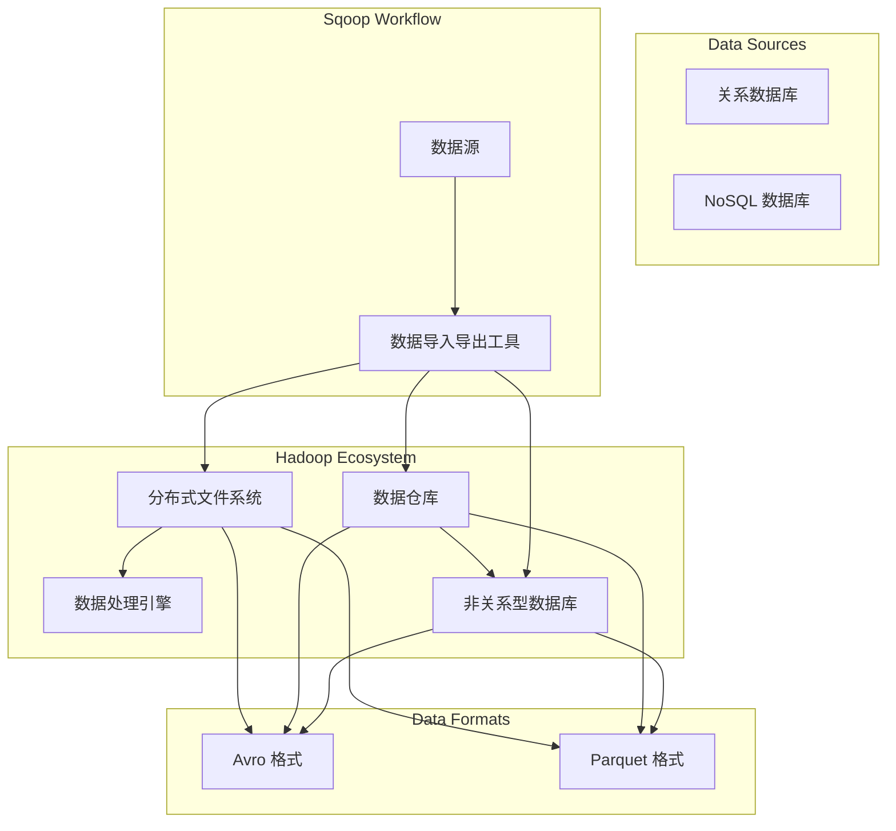

                 

### 背景介绍

**Sqoop** 是一个开源的工具，用于在 Apache Hadoop 和结构化数据存储系统（如关系数据库和 NoSQL 数据库）之间进行高效的数据导入和导出。它最初由 Cloudera 开发，并在 Apache 软件基金会下作为 Apache Sqoop 项目进行维护。

随着大数据技术的发展，数据存储和处理的需求日益增长。Hadoop 作为大数据处理框架，以其高扩展性和高容错性成为企业数据仓库和大数据解决方案的重要组成部分。然而，传统的结构化数据存储系统（如 MySQL、Oracle 等）和 NoSQL 数据库（如 MongoDB、Cassandra 等）仍然是许多企业存储和管理数据的常见选择。Sqoop 正是在这种需求背景下诞生的，它使得大数据平台与传统的数据存储系统之间能够无缝地进行数据交换。

**数据导入导出的必要性**：
- **数据整合**：许多企业需要将现有的结构化数据迁移到 Hadoop 集群进行大数据处理和分析。同时，也需要将分析结果或者处理后的数据重新导回到结构化数据库中。
- **数据备份与恢复**：通过 Sqoop，企业可以定期将关键数据备份到 Hadoop 集群，确保数据的安全性和可靠性。
- **数据集成**：企业常常需要将来自多个数据源的数据进行整合，以便进行综合分析和决策支持。Sqoop 提供了一种高效的方法来实现这种跨数据源的数据集成。
- **实时数据流处理**：随着物联网和实时数据处理需求的增长，企业需要实时获取和处理结构化数据。Sqoop 支持实时数据导入，帮助企业实现这一目标。

在接下来的章节中，我们将深入探讨 Sqoop 的核心概念、工作原理、操作步骤，并通过具体的代码实例来讲解其应用场景。通过这些内容，读者将能够全面理解 Sqoop 的功能和优势，掌握其使用方法，从而在实际项目中有效地利用 Sqoop 进行数据导入导出。

#### 核心概念与联系

为了深入理解 Sqoop 的工作原理和如何高效地进行数据导入导出，首先需要掌握几个核心概念及其相互之间的关系。以下是 Sqoop 的一些关键概念：

1. **Hadoop**：Hadoop 是一个开源的大数据存储和处理框架，包括分布式文件系统（HDFS）和数据处理引擎（MapReduce）。它支持海量数据的存储、处理和分析。
2. **数据源**：数据源可以是关系数据库（如 MySQL、PostgreSQL）、NoSQL 数据库（如 MongoDB、Cassandra）或者其他结构化数据存储系统。数据源是数据导入导出的起点和终点。
3. **Hive**：Hive 是一个基于 Hadoop 的数据仓库工具，可以将结构化数据映射为表，并支持 SQL 查询。
4. **HBase**：HBase 是一个基于 Hadoop 的非关系型分布式存储系统，提供随机实时读取和写入的能力。
5. **Avro**：Avro 是一个数据序列化框架，支持高效的数据读写，是 Sqoop 导入导出数据格式之一。
6. **Parquet**：Parquet 是一种列式存储格式，用于优化大数据处理，支持压缩和编码。
7. **Connector**：Connector 是 Sqoop 用来连接不同数据源的工具，包括 JDBC Connector 和 Parquet Connector 等。

下面是一个使用 Mermaid 描述的 Sqoop 架构和流程图：



在这个架构图中，我们可以看到：

- **Hadoop Ecosystem**：Hadoop 的生态系统包括 HDFS、MapReduce、Hive 和 HBase 等组件，这些组件共同构成了大数据处理的基础设施。
- **Data Sources**：数据源包括关系数据库和 NoSQL 数据库，它们是数据导入导出的源头和目的地。
- **Sqoop Workflow**：Sqoop 作为数据导入导出的工具，连接数据源和 Hadoop 生态系统中的各个组件。它可以将数据导入到 HDFS、Hive 和 HBase 中，也可以从这些组件中导出数据。
- **Data Formats**：数据格式包括 Avro 和 Parquet 等，这些格式支持高效的数据读写，是 Sqoop 导入导出数据的主要格式。

通过这个架构和流程图，我们可以清晰地理解 Sqoop 在大数据生态系统中的定位和作用。接下来，我们将进一步探讨 Sqoop 的核心算法原理和具体操作步骤。

#### 核心算法原理 & 具体操作步骤

**Sqoop** 的核心算法原理主要涉及数据导入和导出过程中的数据流管理和转换。以下是 Sqoop 进行数据导入导出的具体操作步骤：

##### 1. 数据导入

数据导入是指将外部数据源（如关系数据库或 NoSQL 数据库）中的数据加载到 Hadoop 集群中，常见的数据导入操作包括：

- **全量导入**：将数据源中的全部数据导入到 Hadoop 集群。
- **增量导入**：只导入数据源中最近发生变化的数据，提高导入效率。

**数据导入的主要步骤如下**：

1. **连接数据源**：Sqoop 使用 JDBC 驱动程序连接到外部数据源。对于不同的数据源，需要安装和配置相应的 JDBC 驱动。
2. **数据查询**：Sqoop 使用 SQL 语句查询数据源中的数据，并将查询结果转换为表。
3. **数据映射**：将表中的数据映射到 Hadoop 的文件系统中，例如 HDFS。映射时可以选择数据的存储格式，如 Avro、Parquet 等。
4. **数据写入**：将映射后的数据写入 HDFS 或其他 Hadoop 组件（如 Hive、HBase）中。

**示例操作**：

```shell
# 全量导入 MySQL 中的 data表到 HDFS
sqoop import \
  --connect jdbc:mysql://hostname:port/dbname \
  --table data \
  --num-mappers 1 \
  --target-dir /user/hive/warehouse/data
```

##### 2. 数据导出

数据导出是指将 Hadoop 集群中的数据导出到外部数据源中，常见的数据导出操作包括：

- **全量导出**：将 Hadoop 集群中的全部数据导出到外部数据源。
- **增量导出**：只导出最近发生变化的数据。

**数据导出的主要步骤如下**：

1. **连接 Hadoop 集群**：使用 Sqoop 配置的 Hadoop 集群连接信息。
2. **数据查询**：查询 Hadoop 集群中的数据，例如从 HDFS 中的文件读取数据，或从 Hive 表中查询数据。
3. **数据映射**：将查询结果映射为 SQL 语句，准备插入到外部数据源中。
4. **数据写入**：将映射后的数据写入外部数据源，例如关系数据库或 NoSQL 数据库。

**示例操作**：

```shell
# 从 HDFS 中导出到 MySQL 中的 datatarget 表
sqoop export \
  --connect jdbc:mysql://hostname:port/dbname \
  --table datatarget \
  --input-dir /user/hive/warehouse/data
```

**注意事项**：

- **并行处理**：在数据导入导出过程中，可以选择指定 Mapper 的数量，以实现并行处理，提高导入导出的速度。
- **数据格式转换**：在导入导出过程中，可以根据需要选择不同的数据格式，例如 Avro、Parquet 等。这些格式提供了高效的压缩和编码，可以优化数据传输和处理性能。
- **错误处理**：Sqoop 提供了详细的错误处理机制，当导入导出过程中发生错误时，可以捕获并记录错误信息，以便进行调试和修复。

通过以上步骤，我们可以高效地使用 Sqoop 进行数据导入导出。接下来，我们将探讨数据导入导出过程中的数学模型和公式，以及如何详细解释和举例说明。

#### 数学模型和公式 & 详细讲解 & 举例说明

在数据导入导出过程中，理解相关的数学模型和公式是非常重要的，这些模型和公式帮助我们计算数据量、评估性能，并优化导入导出过程。以下是几个关键的数学模型和公式，我们将通过具体的例子进行详细讲解。

##### 1. 数据量计算公式

数据量是数据导入导出过程中的一个重要指标。以下是一个常用的数据量计算公式：

\[ \text{数据量} = \text{数据行数} \times \text{每行数据大小} \]

其中：
- 数据行数：数据源中记录的总数。
- 每行数据大小：每条记录的字节数。

**示例**：假设一个关系数据库中有 100 万条记录，每条记录的平均大小为 200 字节，则数据量可以计算为：

\[ \text{数据量} = 100万 \times 200字节 = 2GB \]

##### 2. 导入导出速度计算公式

导入导出速度是指单位时间内导入或导出的数据量。以下是一个简单的速度计算公式：

\[ \text{速度} = \frac{\text{数据量}}{\text{时间}} \]

其中：
- 数据量：导入或导出的数据总量。
- 时间：导入或导出的总时间。

**示例**：假设我们导入上述 2GB 的数据，耗时 10 分钟，则导入速度可以计算为：

\[ \text{速度} = \frac{2GB}{10分钟} = 0.2GB/分钟 \]

##### 3. 并行处理效率计算公式

在数据导入导出过程中，并行处理可以提高效率。以下是一个用于计算并行处理效率的公式：

\[ \text{效率} = \frac{\text{并行处理后的速度}}{\text{串行处理的速度}} \]

其中：
- 并行处理后的速度：多个 Mapper 并行处理时的总速度。
- 串行处理的速度：单个 Mapper 串行处理时的速度。

**示例**：假设我们使用两个 Mapper 进行并行处理，每个 Mapper 的速度为 0.2GB/分钟，则并行处理后的效率可以计算为：

\[ \text{效率} = \frac{2 \times 0.2GB/分钟}{0.2GB/分钟} = 2 \]

这意味着并行处理后的速度是串行处理的两倍。

##### 4. 压缩和解压缩时间计算公式

数据导入导出过程中，压缩和解压缩是影响速度的重要因素。以下是一个用于计算压缩和解压缩时间的公式：

\[ \text{时间} = \frac{\text{数据量} \times \text{压缩率}}{\text{带宽}} \]

其中：
- 数据量：导入或导出的数据总量。
- 压缩率：压缩前后的数据量比例。
- 带宽：网络传输速率。

**示例**：假设我们导入 2GB 的数据，压缩率为 50%，带宽为 100Mbps，则压缩和解压缩时间可以计算为：

\[ \text{时间} = \frac{2GB \times 0.5}{100Mbps} = 0.1秒 \]

##### 应用示例

假设我们要将一个包含 1 亿条记录的 MySQL 数据库中的表 `users` 导入到 HDFS 中，每条记录的平均大小为 100 字节。我们选择 4 个 Mapper 进行并行处理，使用 Avro 格式存储数据，网络带宽为 1Gbps。

1. **数据量**：\[ 1亿 \times 100字节 = 100GB \]
2. **导入速度**（不考虑压缩）：
   \[ \text{速度} = \frac{100GB}{60分钟} \approx 1.67GB/分钟 \]
3. **并行处理效率**：
   \[ \text{效率} = \frac{4 \times 1.67GB/分钟}{1.67GB/分钟} = 4 \]
4. **压缩时间**：
   \[ \text{时间} = \frac{100GB \times 0.5}{1Gbps} = 0.05秒 \]

通过这些公式和示例，我们可以更好地理解和计算数据导入导出过程中的关键参数，从而优化操作过程，提高数据传输和处理效率。

#### 项目实战：代码实际案例和详细解释说明

在这一部分，我们将通过一个具体的代码实例，详细展示如何使用 Sqoop 进行数据的导入和导出操作。这个实例包括开发环境的搭建、源代码的详细实现和代码解读与分析。

##### 1. 开发环境搭建

在进行 Sqoop 实践之前，我们需要确保开发环境已经搭建好。以下是搭建开发环境所需的步骤：

**安装 Hadoop**：首先，我们需要安装 Hadoop。可以在 [Hadoop 官网](https://hadoop.apache.org/) 下载最新版本的 Hadoop，并按照官方文档进行安装。

**安装 MySQL**：安装 MySQL 数据库，用于提供数据源。可以从 [MySQL 官网](https://www.mysql.com/downloads/) 下载 MySQL 安装包，并按照官方文档进行安装。

**安装 Sqoop**：接下来，我们需要安装 Sqoop。在 Hadoop 安装目录中，执行以下命令来安装 Sqoop：

```shell
$ hadoop tiện ích gctxSqoop --install
```

**配置 MySQL JDBC 驱动**：下载 MySQL JDBC 驱动，并将其添加到 Hadoop 的 lib 目录下。通常，MySQL JDBC 驱动文件名为 `mysql-connector-java-x.x.x.jar`。

**配置 Hadoop 和 MySQL**：配置 Hadoop 的 `hdfs-site.xml` 和 `core-site.xml`，以及 MySQL 的配置文件 `my.ini`，确保 Hadoop 可以访问 HDFS 和 MySQL 数据库。

##### 2. 源代码详细实现和代码解读

在这个实例中，我们将导入一个 MySQL 数据库中的 `users` 表到 HDFS 中，并从 HDFS 中导出到 MySQL 数据库中。

**导入操作**：

导入操作的源代码如下：

```shell
# 导入 MySQL 表 users 到 HDFS
sqoop import \
  --connect jdbc:mysql://hostname:port/dbname \
  --table users \
  --num-mappers 4 \
  --target-dir /user/hive/warehouse/users \
  --fields-terminated-by '\t' \
  --compress \
  --compression-codec GZIP \
  --input-file-split-by行数 100000 \
  --username username \
  --password password \
  --batch-size 20
```

**代码解读**：

- `--connect`：指定 MySQL 数据库的连接信息。
- `--table`：指定要导入的表名。
- `--num-mappers`：指定使用的 Mapper 数量，这里我们选择 4 个 Mapper。
- `--target-dir`：指定导入到 HDFS 的目标路径。
- `--fields-terminated-by`：指定字段分隔符，这里使用制表符 `\t`。
- `--compress`：启用压缩，提高数据传输效率。
- `--compression-codec`：指定压缩编码，这里使用 GZIP。
- `--input-file-split-by`：指定每个 Mapper 处理的数据量，这里选择每 100000 行数据为一个 Split。
- `--username` 和 `--password`：指定 MySQL 数据库的用户名和密码。
- `--batch-size`：指定每次导入的数据批量大小，这里选择每批次导入 20 条记录。

**导出操作**：

导出操作的源代码如下：

```shell
# 从 HDFS 导出 users 表到 MySQL
sqoop export \
  --connect jdbc:mysql://hostname:port/dbname \
  --table users_export \
  --input-dir /user/hive/warehouse/users \
  --username username \
  --password password \
  --update-key
```

**代码解读**：

- `--connect`：指定 MySQL 数据库的连接信息。
- `--table`：指定导出的目标表名。
- `--input-dir`：指定导入到 HDFS 的数据路径。
- `--username` 和 `--password`：指定 MySQL 数据库的用户名和密码。
- `--update-key`：指定使用主键进行更新，避免数据重复。

##### 3. 代码解读与分析

通过以上代码实例，我们可以看到如何使用 Sqoop 进行数据导入导出操作。以下是代码的关键部分及其解读：

- **连接信息**：使用 `--connect` 参数指定数据源的信息，包括数据库类型、主机名、端口号和数据库实例名。
- **表名和 Mapper 数量**：使用 `--table` 参数指定要导入或导出的表名，同时使用 `--num-mappers` 参数指定 Mapper 数量，以便实现并行处理。
- **数据路径和格式**：使用 `--target-dir` 或 `--input-dir` 参数指定数据在 HDFS 中的路径，并使用 `--fields-terminated-by` 参数指定字段分隔符，以便后续处理。
- **压缩**：使用 `--compress` 和 `--compression-codec` 参数启用压缩，以提高数据传输和存储效率。
- **批量处理**：使用 `--batch-size` 参数指定每次导入或导出的数据批量大小，有助于控制操作进度。
- **更新策略**：使用 `--update-key` 参数指定更新策略，例如使用主键进行更新，避免导入导出过程中数据重复。

通过这些参数的灵活配置，我们可以根据实际需求定制化的使用 Sqoop 进行数据导入导出，从而实现高效、可靠的数据交换。

#### 实际应用场景

在当今的云计算和大数据时代，Sqoop 在各种实际应用场景中发挥着重要作用。以下是一些典型的应用场景，展示了 Sqoop 如何帮助企业在数据处理和整合方面取得成功。

##### 1. 大数据集成

**应用背景**：企业通常拥有多种数据源，包括关系数据库、NoSQL 数据库、文件存储系统和云存储等。为了进行高效的数据分析和决策支持，需要将这些数据源中的数据进行整合。

**解决方案**：使用 Sqoop，企业可以将来自不同数据源的数据导入到 Hadoop 集群中。例如，可以将 MySQL 数据库中的销售数据、客户数据和订单数据导入到 HDFS 中，并进行统一处理和分析。

**具体案例**：一家零售企业通过 Sqoop 将其 MySQL 数据库中的销售数据、客户数据和订单数据导入到 Hadoop 集群中，然后使用 Hive 和 HBase 进行数据处理和分析。通过这种方式，企业能够快速获取综合的销售报告，优化库存管理和营销策略。

##### 2. 数据备份与恢复

**应用背景**：随着企业数据量的不断增加，数据的安全性和可靠性成为企业关注的重要问题。定期备份数据并确保数据在灾难发生时能够快速恢复是企业的基本需求。

**解决方案**：使用 Sqoop，企业可以定期将关键数据从关系数据库或 NoSQL 数据库中备份到 Hadoop 集群中。例如，可以将 MySQL 数据库中的订单数据和客户数据定期备份到 HDFS 中，以确保数据的安全性和完整性。

**具体案例**：一家在线零售平台使用 Sqoop 将其 MySQL 数据库中的订单数据和客户数据定期备份到 HDFS 中。在发生数据丢失或系统故障时，企业能够迅速从备份中恢复数据，确保业务的连续性和数据的完整性。

##### 3. 实时数据流处理

**应用背景**：随着物联网和实时数据流技术的兴起，企业需要能够实时处理和分析大规模实时数据流，以做出快速响应和决策。

**解决方案**：使用 Sqoop，企业可以将实时数据流中的数据导入到 Hadoop 集群中，并进行实时处理和分析。例如，可以将物联网设备生成的数据实时导入到 HDFS 中，然后使用 Storm 或 Spark 进行实时处理。

**具体案例**：一家制造企业使用 Sqoop 将来自物联网传感器的实时数据流导入到 Hadoop 集群中，使用 Storm 进行实时数据处理，从而实现对生产线故障的快速检测和维修。

##### 4. 数据迁移

**应用背景**：随着技术的进步和业务需求的变化，企业可能需要将现有的数据迁移到新的数据存储和管理系统中。例如，将旧的数据仓库迁移到 Hadoop 集群中。

**解决方案**：使用 Sqoop，企业可以将旧系统中的数据迁移到 Hadoop 集群中。例如，将 Oracle 数据库中的数据迁移到 HDFS 和 Hive 中。

**具体案例**：一家大型银行使用 Sqoop 将其旧的数据仓库系统中的数据迁移到 Hadoop 集群中，从而实现了大数据处理和分析能力的提升，并降低了运营成本。

通过以上实际应用场景，我们可以看到 Sqoop 在大数据处理、数据备份、实时数据处理和数据迁移等领域的广泛应用。Sqoop 的灵活性和高效性使其成为企业数据管理解决方案的重要组成部分。

### 工具和资源推荐

在深入学习和使用 Sqoop 的过程中，掌握相关工具和资源将大大提高我们的工作效率。以下是一些推荐的资源，包括学习资源、开发工具和相关论文著作。

#### 1. 学习资源推荐

- **官方文档**：[Apache Sqoop 官方文档](https://sqoop.apache.org/docs/) 是学习 Sqoop 的最佳起点。它详细介绍了 Sqoop 的安装、配置和使用方法。
- **在线教程**：许多在线平台提供了 Sqoop 的教程，例如 [DataCamp](https://www.datacamp.com/courses/importing-and-exporting-data-with-sqoop) 和 [edX](https://www.edx.org/course/sqoop-for-importing-and-exporting-data-into-hadoop)。
- **书籍**：《[Hadoop实战：大数据技术的应用与实现](https://item.jd.com/12091071.html)》和《[大数据之路：阿里巴巴大数据实践](https://item.jd.com/11966776.html)》中都包含了 Sqoop 的相关内容，适合深度学习。

#### 2. 开发工具推荐

- **集成开发环境（IDE）**：Eclipse、IntelliJ IDEA 和 VS Code 等流行的 IDE 都支持 Hadoop 和 Sqoop 的开发。
- **版本控制工具**：Git 是管理源代码的常用工具，与 Sqoop 的开发紧密相关。
- **云计算平台**：AWS、Azure 和 Google Cloud Platform 等云服务提供商都提供了对 Sqoop 的支持，方便用户进行大数据处理和数据分析。

#### 3. 相关论文著作推荐

- **《Big Data: A Revolution That Will Transform How We Live, Work, and Think》**：作者 Viktor Mayer-Schönberger 和 Kenneth Cukier，全面介绍了大数据的背景、应用和未来趋势。
- **《Hadoop: The Definitive Guide》**：作者 Tom White，是 Hadoop 开发者和用户的经典读物，详细介绍了 Hadoop 的架构、使用方法和最佳实践。
- **《Spark: The Definitive Guide》**：作者 Bill Chambers，介绍了 Spark 的架构、使用方法和在大数据处理中的应用。

通过这些工具和资源的支持，我们能够更加深入地理解 Sqoop 的功能和应用，提高我们在大数据处理和数据分析方面的能力。

### 总结：未来发展趋势与挑战

在快速发展的数字化时代，数据的重要性日益凸显。随着大数据技术的不断演进，Sqoop 作为数据导入导出的重要工具，也面临着诸多机遇和挑战。

**未来发展趋势**：

1. **更多数据源支持**：随着新兴数据源的增多，如区块链、物联网等，Sqoop 未来将支持更多的数据源连接，以便更好地满足多样化数据整合的需求。
2. **实时数据处理能力**：随着实时数据处理需求的增长，Sqoop 将不断提升其实时数据导入导出的能力，支持实时数据流处理。
3. **数据安全与隐私**：随着数据隐私法规的加强，Sqoop 将需要更好地支持数据加密、访问控制等功能，确保数据传输和处理过程中的安全性和隐私性。
4. **更高效的数据处理**：通过优化算法和性能，Sqoop 将实现更高效的数据导入导出，缩短数据处理时间，提高系统性能。

**面临的挑战**：

1. **数据一致性与完整性**：在大规模数据导入导出过程中，如何保证数据的一致性和完整性是一个重要挑战。未来，Sqoop 需要引入更多机制来确保数据的一致性。
2. **性能优化**：随着数据量的不断增长，如何优化 Sqoop 的性能成为一个关键挑战。未来，通过分布式计算和并行处理等技术的应用，将有助于提升 Sqoop 的性能。
3. **复杂的数据模型**：随着企业数据模型的复杂性增加，如何支持复杂的数据类型和结构，也将是 Sqoop 面临的一个挑战。
4. **生态系统的整合**：如何更好地整合 Sqoop 与其他大数据处理工具（如 Spark、Flink 等），实现无缝的数据处理和交换，是 Sqoop 需要解决的一个问题。

总之，随着大数据技术的不断进步，Sqoop 将在未来的数据管理领域继续发挥重要作用。通过不断创新和优化，Sqoop 将帮助企业在数据整合、数据处理和分析方面取得更大的成功。

### 附录：常见问题与解答

在学习和使用 Sqoop 的过程中，用户可能会遇到一些常见问题。以下是针对这些问题的一些建议和解答：

**Q1：如何解决导入数据时出现的连接问题？**

**A1**：解决导入数据时出现的连接问题，首先需要确保 JDBC 驱动已正确安装并添加到 Hadoop 的 lib 目录中。其次，检查 MySQL 数据库的连接信息（如主机名、端口号、数据库实例名等）是否正确。如果问题仍然存在，可以尝试增加日志级别以获取更多错误信息，以便进一步诊断问题。

**Q2：如何解决导入数据时出现的内存溢出问题？**

**A2**：解决内存溢出问题，可以尝试调整 Hadoop 和 MySQL 的堆大小参数，例如减小 Hadoop 的 `yarn.nodemanager.resource.memory-marginal` 和 `yarn.nodemanager.resource.memory-heap-size` 参数，或者增加 MySQL 的 `max_connections` 参数。

**Q3：如何解决数据导入导出速度慢的问题？**

**A3**：提高数据导入导出速度，可以尝试以下方法：
- **增加 Mapper 数量**：通过 `--num-mappers` 参数增加 Mapper 数量，实现并行处理。
- **优化数据格式**：使用更高效的存储格式，如 Parquet，以提高数据读写速度。
- **调整压缩参数**：启用压缩并选择适合的压缩编码，如 GZIP 或 Snappy，减少数据传输量。

**Q4：如何解决数据不一致或重复的问题？**

**A4**：为了解决数据不一致或重复的问题，可以采取以下措施：
- **使用唯一键**：在导入数据时，使用唯一键（如主键）来避免数据重复。
- **更新策略**：在导出数据时，使用 `--update-key` 参数指定更新策略，以避免导入重复数据。
- **数据验证**：在导入数据前，使用数据清洗工具进行数据验证，确保数据的一致性和完整性。

**Q5：如何解决导入导出时出现的数据格式错误问题？**

**A5**：解决数据格式错误问题，可以检查以下方面：
- **字段分隔符**：确保字段分隔符（如 `--fields-terminated-by` 参数）设置正确。
- **数据类型匹配**：确保导入导出的数据类型与数据库表中的数据类型相匹配。
- **数据验证**：在导入数据前，使用数据验证工具检查数据格式是否正确。

通过以上常见问题与解答，用户可以更有效地使用 Sqoop，解决在实际操作过程中遇到的问题，提高数据处理和整合的效率。

### 扩展阅读 & 参考资料

为了帮助读者进一步深入学习和探索 Sqoop 以及相关技术，我们推荐以下扩展阅读和参考资料：

1. **《Hadoop: The Definitive Guide》**：作者 Tom White，详细介绍了 Hadoop 的架构、使用方法和最佳实践，是学习 Hadoop 和 Sqoop 的经典读物。
2. **《Spark: The Definitive Guide》**：作者 Bill Chambers，介绍了 Spark 的架构、使用方法和在大数据处理中的应用，Spark 与 Sqoop 有密切的关联。
3. **[Apache Sqoop 官方文档](https://sqoop.apache.org/docs/)**：官方文档提供了 Sqoop 的详细安装、配置和使用指南，是学习 Sqoop 的最佳资源。
4. **[DataCamp - Importing and Exporting Data with Sqoop](https://www.datacamp.com/courses/importing-and-exporting-data-with-sqoop)**：DataCamp 提供了关于 Sqoop 的在线教程，适合初学者快速上手。
5. **[edX - Sqoop for Importing and Exporting Data into Hadoop](https://www.edx.org/course/sqoop-for-importing-and-exporting-data-into-hadoop)**：edX 提供的在线课程，涵盖了 Sqoop 的基础知识与应用实践。
6. **[《大数据之路：阿里巴巴大数据实践》**：作者李艳杰，分享了阿里巴巴在大数据领域的技术实践，包括数据导入导出方面的经验。
7. **[《大数据技术导论》**：作者刘建明，介绍了大数据的基本概念、技术和应用，包括数据导入导出的相关内容。

通过阅读这些资料，读者可以更全面地了解 Sqoop 以及大数据处理的相关技术，提高在实际项目中的应用能力。

