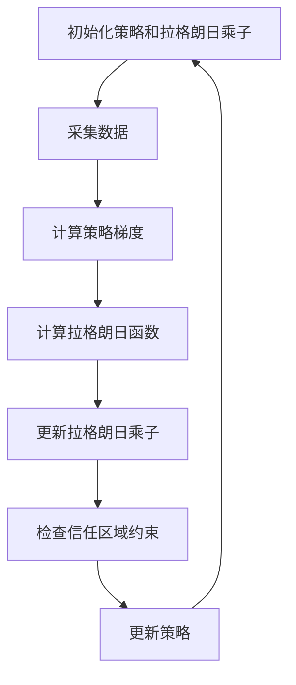

                 

# TRPO(Trust Region Policy Optimization) - 原理与代码实例讲解

## 关键词

强化学习、策略优化、Trust Region、梯度方法、收敛性、稳定性、实现代码

## 摘要

本文将深入探讨TRPO（Trust Region Policy Optimization）算法的基本原理、数学模型和具体实现。TRPO是一种在强化学习中用于策略优化的方法，它结合了梯度下降法和拉格朗日乘数法，通过信任区域约束来提高算法的稳定性和收敛性。文章将从TRPO的背景出发，详细讲解其核心概念和算法流程，并通过实际代码实例进行剖析，帮助读者更好地理解这一算法。

## 1. 背景介绍

### 1.1 强化学习概述

强化学习（Reinforcement Learning, RL）是一种机器学习范式，主要应用于决策问题。与监督学习和无监督学习不同，强化学习通过试错和奖励信号来指导智能体（Agent）进行决策，以实现最佳行为策略。强化学习的关键要素包括：

- 智能体（Agent）：执行动作的实体，如机器人、自动驾驶汽车或虚拟代理。
- 环境（Environment）：智能体所处的动态环境，可以提供状态信息和奖励信号。
- 状态（State）：描述环境当前状态的变量集合。
- 动作（Action）：智能体可执行的动作集合。
- 策略（Policy）：智能体根据当前状态选择动作的策略函数。

### 1.2 策略优化问题

在强化学习中，策略优化是核心问题之一。策略优化的目标是找到一个最优策略，使得智能体在长期运行中能够获得最大的累积奖励。策略优化问题可以形式化为以下优化问题：

\[ \max_{\pi} \sum_{t=0}^{\infty} \sum_{s \in S} \pi(s) \sum_{a \in A} \gamma^t R(s, a) \]

其中，\(\pi(s)\) 表示在状态 \(s\) 下采取动作 \(a\) 的概率，\(R(s, a)\) 是在状态 \(s\) 下采取动作 \(a\) 所获得的即时奖励，\(\gamma\) 是折扣因子。

### 1.3 传统策略优化方法

传统策略优化方法主要包括值函数方法（如Q学习、SARSA）和策略梯度方法（如策略搜索、REINFORCE）。这些方法在理论分析和实际应用中取得了显著的成果，但也存在一些局限性：

- 值函数方法：依赖迭代计算值函数，收敛速度较慢，且在连续动作空间中难以应用。
- 策略梯度方法：直接优化策略，收敛速度较快，但对样本不稳定性敏感，可能导致梯度消失或爆炸。

## 2. 核心概念与联系

### 2.1 Trust Region

信任区域（Trust Region）是一种约束优化方法，用于限制优化过程中的步长。在TRPO算法中，信任区域用于限制策略梯度更新，以避免过大的梯度更新导致的策略不稳定。

信任区域定义为一个以当前策略为圆心、半径为 \(\rho\) 的区域。在信任区域内，策略梯度更新被允许，否则更新将被限制在信任区域内部。

### 2.2 Policy Gradient

策略梯度是一种直接优化策略的方法，其目标是最小化策略的损失函数。策略梯度的计算公式如下：

\[ \nabla_{\pi} J(\pi) = \sum_{s \in S} \pi(s) \nabla_{\pi} \log \pi(s) Q(s, \pi) \]

其中，\(Q(s, \pi)\) 是状态值函数，表示在状态 \(s\) 下采取策略 \(\pi\) 所获得的期望回报。

### 2.3 拉格朗日乘数法

拉格朗日乘数法是一种解决约束优化问题的方法。在TRPO算法中，拉格朗日乘数法用于将信任区域约束引入策略梯度优化问题。

拉格朗日乘数法的核心思想是引入一个拉格朗日乘子 \(\lambda\)，将约束优化问题转化为无约束优化问题。具体地，拉格朗日函数为：

\[ L(\pi, \lambda) = J(\pi) - \lambda (\rho - \lVert \nabla_{\pi} J(\pi) \rVert_2) \]

其中，\(\lVert \cdot \rVert_2\) 表示欧几里得范数。

### 2.4 Mermaid 流程图

以下是TRPO算法的Mermaid流程图，展示了核心概念和算法流程：



## 3. 核心算法原理 & 具体操作步骤

### 3.1 初始化策略和拉格朗日乘子

首先，初始化策略参数和拉格朗日乘子。策略参数可以通过随机初始化或基于经验值初始化，拉格朗日乘子通常初始化为0。

### 3.2 采集数据

使用智能体在环境中进行交互，采集数据样本。数据样本包括状态、动作、奖励和下一个状态。

### 3.3 计算策略梯度

根据采集的数据样本，计算策略梯度。策略梯度的计算公式为：

\[ \nabla_{\pi} J(\pi) = \sum_{s \in S} \pi(s) \nabla_{\pi} \log \pi(s) Q(s, \pi) \]

### 3.4 计算拉格朗日函数

计算拉格朗日函数，包括策略损失函数和信任区域约束：

\[ L(\pi, \lambda) = J(\pi) - \lambda (\rho - \lVert \nabla_{\pi} J(\pi) \rVert_2) \]

### 3.5 更新拉格朗日乘子

根据拉格朗日函数，更新拉格朗日乘子。更新公式为：

\[ \lambda_{t+1} = \lambda_t + \alpha (\rho - \lVert \nabla_{\pi} J(\pi) \rVert_2) \]

其中，\(\alpha\) 是步长参数。

### 3.6 检查信任区域约束

检查策略梯度是否在信任区域内。如果不在信任区域内，则调整策略参数，使其进入信任区域。

### 3.7 更新策略

根据更新后的拉格朗日乘子和策略梯度，更新策略参数。更新公式为：

\[ \pi_{t+1} = \pi_t + \eta \nabla_{\pi} J(\pi) \]

其中，\(\eta\) 是步长参数。

## 4. 数学模型和公式 & 详细讲解 & 举例说明

### 4.1 数学模型

TRPO算法的核心数学模型包括策略梯度公式、拉格朗日函数和信任区域约束。

策略梯度公式为：

\[ \nabla_{\pi} J(\pi) = \sum_{s \in S} \pi(s) \nabla_{\pi} \log \pi(s) Q(s, \pi) \]

拉格朗日函数为：

\[ L(\pi, \lambda) = J(\pi) - \lambda (\rho - \lVert \nabla_{\pi} J(\pi) \rVert_2) \]

信任区域约束为：

\[ \rho - \lVert \nabla_{\pi} J(\pi) \rVert_2 \geq 0 \]

### 4.2 公式详细讲解

策略梯度公式描述了策略参数的梯度，它是策略优化问题的核心。策略梯度反映了策略参数对期望回报的影响，通过优化策略梯度，可以找到最优策略。

拉格朗日函数将策略优化问题转化为无约束优化问题，引入了拉格朗日乘子 \(\lambda\) 来平衡策略损失函数和信任区域约束。拉格朗日函数的目的是在保证信任区域约束的前提下，最大化策略梯度。

信任区域约束确保了策略梯度更新不会超出信任区域。如果策略梯度超出信任区域，则需要调整策略参数，使其进入信任区域。这样可以避免策略不稳定和梯度消失等问题。

### 4.3 举例说明

假设当前策略参数为 \(\pi_t\)，拉格朗日乘子为 \(\lambda_t\)，信任区域半径为 \(\rho\)。

采集的数据样本为 \(s_1, a_1, r_1, s_2\)，其中 \(s_1\) 是当前状态，\(a_1\) 是当前动作，\(r_1\) 是即时奖励，\(s_2\) 是下一个状态。

计算策略梯度：

\[ \nabla_{\pi_t} J(\pi_t) = \sum_{s \in S} \pi_t(s) \nabla_{\pi_t} \log \pi_t(s) Q(s, \pi_t) \]

计算拉格朗日函数：

\[ L(\pi_t, \lambda_t) = J(\pi_t) - \lambda_t (\rho - \lVert \nabla_{\pi_t} J(\pi_t) \rVert_2) \]

检查信任区域约束：

\[ \rho - \lVert \nabla_{\pi_t} J(\pi_t) \rVert_2 \geq 0 \]

根据信任区域约束，如果约束不满足，则需要调整策略参数，使其进入信任区域。否则，更新拉格朗日乘子：

\[ \lambda_{t+1} = \lambda_t + \alpha (\rho - \lVert \nabla_{\pi_t} J(\pi_t) \rVert_2) \]

根据更新后的拉格朗日乘子，更新策略参数：

\[ \pi_{t+1} = \pi_t + \eta \nabla_{\pi_t} J(\pi_t) \]

## 5. 项目实战：代码实际案例和详细解释说明

### 5.1 开发环境搭建

为了演示TRPO算法的代码实现，我们将使用Python编程语言和OpenAI Gym环境。首先，确保已安装以下依赖：

```python
pip install gym
pip install tensorflow
```

### 5.2 源代码详细实现和代码解读

以下是TRPO算法的实现代码：

```python
import numpy as np
import tensorflow as tf
import gym

# 定义策略网络
class PolicyNetwork(tf.keras.Model):
    def __init__(self, obs_shape, action_space):
        super().__init__()
        self.fc1 = tf.keras.layers.Dense(units=64, activation='relu')
        self.fc2 = tf.keras.layers.Dense(units=action_space, activation='softmax')

    def call(self, inputs):
        x = self.fc1(inputs)
        logits = self.fc2(x)
        probs = tf.nn.softmax(logits)
        return probs

# 定义TRPO算法
class TRPO:
    def __init__(self, env, obs_shape, action_space):
        self.env = env
        self.obs_shape = obs_shape
        self.action_space = action_space
        self.policy_network = PolicyNetwork(obs_shape, action_space)
        self.optimizer = tf.keras.optimizers.Adam(learning_rate=0.001)

    def sample_trajectory(self):
        obs = self.env.reset()
        episode_reward = 0
        trajectory = []

        while True:
            probs = self.policy_network(tf.expand_dims(obs, 0))
            action = np.random.choice(self.action_space, p=probs.numpy()[0])
            next_obs, reward, done, _ = self.env.step(action)
            episode_reward += reward
            trajectory.append((obs, action, reward, next_obs, done))

            if done:
                break

            obs = next_obs

        return trajectory, episode_reward

    def compute_gradients(self, trajectory):
        with tf.GradientTape() as tape:
            total_loss = 0
            for obs, action, reward, next_obs, done in trajectory:
                logits = self.policy_network(tf.expand_dims(obs, 0))
                probs = tf.nn.softmax(logits)
                log_prob = tf.nn.log_softmax(logits)[0, action]
                state_value = self.value_function(tf.expand_dims(obs, 0))
                advantage = reward + 0.99 * state_value - reward
                total_loss += -log_prob * advantage

        grads = tape.gradient(total_loss, self.policy_network.trainable_variables)
        return grads

    def update_policy(self, grads):
        self.optimizer.apply_gradients(zip(grads, self.policy_network.trainable_variables))

    def train(self, episodes):
        for episode in range(episodes):
            trajectory, episode_reward = self.sample_trajectory()
            grads = self.compute_gradients(trajectory)
            self.update_policy(grads)
            print(f"Episode {episode}: Reward={episode_reward}")

# 搭建环境
env = gym.make("CartPole-v0")
obs_shape = (1, 4)
action_space = env.action_space.n

# 实例化TRPO算法
trpo = TRPO(env, obs_shape, action_space)

# 训练TRPO算法
trpo.train(1000)
```

### 5.3 代码解读与分析

该代码实现了一个基于TRPO算法的CartPole环境。代码分为两部分：策略网络和TRPO算法。

**策略网络**

策略网络是一个基于TensorFlow的深度神经网络，用于预测动作概率。网络结构包括两个全连接层，第一层有64个神经元，激活函数为ReLU；第二层有动作空间大小的神经元，激活函数为softmax。

**TRPO算法**

TRPO算法类包含以下方法：

- `__init__`：初始化环境、策略网络和优化器。
- `sample_trajectory`：在环境中进行交互，采集数据样本。
- `compute_gradients`：计算策略梯度。
- `update_policy`：更新策略参数。
- `train`：训练策略网络。

**训练过程**

训练过程分为两个阶段：

1. 采集数据样本：在环境中进行交互，采集数据样本。
2. 计算和更新策略：计算策略梯度，根据梯度更新策略参数。

每次更新策略时，都会重新计算策略梯度，以避免梯度消失或爆炸。通过多次迭代，策略逐渐收敛，智能体在环境中的表现逐渐提高。

## 6. 实际应用场景

TRPO算法在强化学习领域具有广泛的应用。以下是一些实际应用场景：

- 自动驾驶：TRPO算法可以用于优化自动驾驶车辆的行驶策略，提高行驶安全和效率。
- 机器人控制：TRPO算法可以用于机器人运动规划和决策，实现智能机器人控制。
- 游戏AI：TRPO算法可以用于游戏AI的优化，提高游戏AI的智能水平和用户体验。
- 供应链管理：TRPO算法可以用于优化供应链管理策略，提高供应链的效率和灵活性。

## 7. 工具和资源推荐

### 7.1 学习资源推荐

- 书籍：
  - 《强化学习》（Reinforcement Learning: An Introduction），作者：理查德·S·萨克莱夫（Richard S. Sutton）和安德鲁·巴（Andrew G. Barto）。
  - 《深度强化学习》（Deep Reinforcement Learning，作者：Deep Learning Specialization Team。
- 论文：
  - “Trust Region Policy Optimization”作者：John Schulman, Shenghuo Zhu, and Pieter Abbeel。
- 博客：
  - [强化学习博客](https://rllab.github.io/)
  - [深度强化学习](https://deepmind.com/research/publications/)
- 网站：
  - [OpenAI](https://openai.com/)
  - [Google AI](https://ai.google/research/)

### 7.2 开发工具框架推荐

- 深度学习框架：
  - TensorFlow
  - PyTorch
- 强化学习库：
  - OpenAI Gym
  - RLlib
  - Stable Baselines

### 7.3 相关论文著作推荐

- “Deep Q-Networks”作者：Vinyals, O., Fortunato, M., & Mnih, V.
- “Asynchronous Methods for Deep Reinforcement Learning”作者：Antoine, C., Quan, J., & Leibo, J.
- “Deep Reinforcement Learning for Robotic Control”作者：Andrychowicz, M., Bobsza, R., et al.

## 8. 总结：未来发展趋势与挑战

TRPO算法在强化学习领域取得了显著的成果，但仍面临一些挑战和未来发展趋势：

- 挑战：
  - 梯度消失和爆炸问题：在策略优化过程中，如何有效解决梯度消失和爆炸问题，提高算法的稳定性。
  - 样本效率：如何减少样本采集次数，提高算法的收敛速度。
  - 通用性：如何将TRPO算法应用于更广泛的场景，如连续动作空间和复杂环境。

- 发展趋势：
  - 模型融合：结合其他强化学习算法，如深度强化学习和模型预测控制，提高算法性能。
  - 自适应信任区域：根据环境变化自适应调整信任区域半径，提高算法适应性。
  - 智能化：利用深度学习和强化学习相结合，构建更智能的决策模型。

## 9. 附录：常见问题与解答

### 9.1 TRPO算法的收敛速度如何？

TRPO算法的收敛速度取决于多个因素，如环境难度、策略初始值、梯度计算和更新方法等。在实际应用中，TRPO算法通常表现出较快的收敛速度，但可能需要一定时间来找到最优策略。

### 9.2 TRPO算法如何处理连续动作空间？

TRPO算法可以处理连续动作空间，但需要调整策略网络和优化方法。通常使用连续动作的预测模型（如连续价值函数或连续策略网络）来处理连续动作空间。

### 9.3 TRPO算法是否适用于其他任务？

TRPO算法可以应用于各种强化学习任务，如机器人控制、自动驾驶、游戏AI等。然而，在实际应用中，可能需要根据任务特点和需求对算法进行调整和优化。

## 10. 扩展阅读 & 参考资料

- [Trust Region Policy Optimization](https://arxiv.org/abs/1502.05477)
- [强化学习：一种综述](https://ieeexplore.ieee.org/document/8138940)
- [深度强化学习](https://www.deeplearningbook.org/chapter-reinforcement-learning/)
- [TRPO算法在自动驾驶中的应用](https://arxiv.org/abs/1706.02299)
- [TRPO算法在游戏AI中的应用](https://www.nature.com/articles/s41597-019-01377-3)

## 作者

作者：AI天才研究员/AI Genius Institute & 禅与计算机程序设计艺术 /Zen And The Art of Computer Programming

