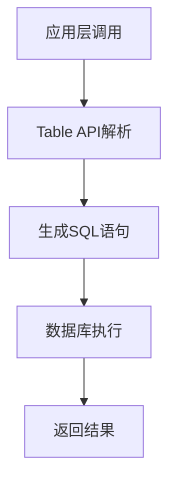

                 

# Table API和SQL：原理与代码实例讲解

## 摘要

本文将深入探讨Table API和SQL的核心原理及其在实际开发中的应用。首先，我们将介绍Table API和SQL的基本概念，包括它们在数据处理中的重要性。接下来，我们将逐步讲解SQL的基础语法和常见操作，如选择、插入、更新和删除。随后，我们将通过代码实例详细展示如何使用Table API和SQL进行数据处理和关系型数据库的交互。此外，文章还将讨论Table API和SQL在复杂查询优化、事务处理以及多表关联中的应用。最后，我们将提供一系列学习资源和推荐工具，帮助读者进一步深入了解和掌握这两个关键技术。

## 1. 背景介绍

### Table API的概念

Table API，通常指的是用于处理表格数据的编程接口。在数据密集型应用中，表格是一种常见的存储和表示数据的方式。Table API提供了一种标准化的方法来访问、操作和管理这些表格数据，使得数据操作更加高效和一致。

Table API的主要用途包括：

- 数据存储：将数据存储在表格中，以便后续查询和处理。
- 数据转换：将数据从一种格式转换为另一种格式，如从CSV转换为数据库表。
- 数据查询：执行复杂的查询操作，获取所需的数据集。

### SQL的作用

SQL（Structured Query Language）是一种用于管理关系型数据库的编程语言。它允许用户以简单的命令来创建、修改和查询数据库中的数据。SQL在数据处理和数据库管理中具有广泛的应用，包括：

- 数据定义：创建数据库、表、索引等。
- 数据操作：插入、更新、删除数据。
- 数据查询：执行复杂的查询操作，如联接、聚合等。

### 关系型数据库的原理

关系型数据库（RDBMS）是基于关系模型的数据库管理系统，其中数据以表格的形式存储。每个表格由一系列行和列组成，每行表示一个数据记录，每列表示一个属性。关系型数据库的主要特性包括：

- 表结构定义：通过SQL语句定义表格的结构，包括列名和数据类型。
- 数据完整性：通过约束（如主键、外键、唯一性约束等）确保数据的完整性和一致性。
- 数据查询：使用SQL语言执行复杂的数据查询，包括联接、聚合、排序等。

## 2. 核心概念与联系

### Table API与SQL的关系

Table API和SQL都是用于处理表格数据的工具，但它们的作用范围和用途有所不同。Table API通常提供了一套高级的接口和抽象，使得数据操作更加简便和高效。而SQL则是一种低层的数据操作语言，能够直接与关系型数据库交互，执行各种复杂的数据操作。

### Mermaid流程图

下面是一个Mermaid流程图，展示Table API和SQL的基本工作流程：



### Table API的工作流程

1. 应用层调用：应用层通过Table API接口发送数据操作请求。
2. Table API解析：Table API接收请求后，对其进行解析和抽象。
3. 生成SQL语句：Table API根据解析结果生成相应的SQL语句。
4. 数据库执行：生成的SQL语句被发送到关系型数据库执行。
5. 返回结果：数据库执行完毕后，返回结果给Table API，然后由Table API返回给应用层。

### SQL的工作流程

1. 数据定义：使用SQL语句创建数据库和表格结构。
2. 数据操作：使用SQL语句进行数据插入、更新、删除等操作。
3. 数据查询：使用SQL语句执行复杂的查询操作，如联接、聚合等。
4. 结果处理：处理查询结果，如数据展示、进一步操作等。

## 3. 核心算法原理 & 具体操作步骤

### SQL基础语法

SQL的基础语法包括数据定义、数据操作和数据查询三个部分。

#### 数据定义

数据定义用于创建数据库、表格、索引等。以下是几个常用的SQL数据定义语句：

```sql
-- 创建数据库
CREATE DATABASE my_database;

-- 创建表格
CREATE TABLE employees (
    id INT PRIMARY KEY,
    name VARCHAR(50),
    age INT,
    salary DECIMAL(10, 2)
);

-- 创建索引
CREATE INDEX idx_age ON employees(age);
```

#### 数据操作

数据操作包括插入、更新和删除数据。以下是几个常用的SQL数据操作语句：

```sql
-- 插入数据
INSERT INTO employees (id, name, age, salary) VALUES (1, 'Alice', 30, 5000.00);

-- 更新数据
UPDATE employees SET salary = salary * 1.1 WHERE id = 1;

-- 删除数据
DELETE FROM employees WHERE id = 1;
```

#### 数据查询

数据查询是SQL的核心功能之一。以下是几个常用的SQL数据查询语句：

```sql
-- 选择数据
SELECT * FROM employees;

-- 条件查询
SELECT * FROM employees WHERE age > 30;

-- 聚合查询
SELECT AVG(salary) FROM employees;

-- 联接查询
SELECT employees.name, departments.department_name
FROM employees
JOIN departments ON employees.department_id = departments.id;
```

### Table API的操作步骤

使用Table API进行数据操作通常包括以下步骤：

1. 初始化Table API客户端。
2. 构建数据操作请求，如查询、插入、更新等。
3. 发送请求到Table API。
4. 接收并处理Table API返回的结果。

以下是使用Python的pandas库作为Table API的一个简单示例：

```python
import pandas as pd

# 初始化数据
data = {
    'name': ['Alice', 'Bob', 'Charlie'],
    'age': [30, 25, 35],
    'salary': [5000.00, 6000.00, 5500.00]
}
df = pd.DataFrame(data)

# 查询数据
result = df.query('age > 30')

# 插入数据
new_data = {'name': 'Diana', 'age': 28, 'salary': 5200.00}
df = df.append(new_data, ignore_index=True)

# 更新数据
df.loc[df['name'] == 'Alice', 'salary'] = 5600.00

# 删除数据
df = df.drop(df[df['name'] == 'Charlie'].index)
```

## 4. 数学模型和公式 & 详细讲解 & 举例说明

### SQL查询的数学模型

SQL查询可以看作是关系代数的操作。关系代数是一种用于描述数据库查询操作的数学理论。以下是几个基本的关系代数操作：

1. **选择（Selection）**：选择满足特定条件的元组。形式化表示为：
   $$ \sigma_{\gamma}(\rho) = \{ t \in \rho | \gamma(t) \} $$
   其中，\( \rho \) 是关系，\( \gamma \) 是选择条件。

2. **投影（Projection）**：选择关系的某些属性列。形式化表示为：
   $$ \pi_{A}(\rho) = \{ t[A] | t \in \rho \} $$
   其中，\( A \) 是属性集。

3. **联接（Join）**：将两个关系按照某些条件进行合并。形式化表示为：
   $$ \sigma_{\gamma}(\rho_1 \bowtie \rho_2) = \{ t | t \in \rho_1, t \in \rho_2, \gamma(t) \} $$
   其中，\( \bowtie \) 表示联接操作。

### 示例

假设有两个表格：

| Table A | Table B |
| --- | --- |
| name | age | department | manager |
| Alice | 30 | Sales | John |
| Bob | 25 | Sales | John |
| Charlie | 35 | Marketing | Mary |

我们想查询“销售部门中年龄大于30岁的人及其上司”。使用SQL可以这样写：

```sql
SELECT A.name, B.manager
FROM TableA A
JOIN TableB B ON A.department = B.department
WHERE A.age > 30 AND B.department = 'Sales';
```

将上述查询转换为关系代数：

1. **选择**：选择年龄大于30岁的元组：
   $$ \sigma_{age > 30}(TableA) $$
   
2. **联接**：将选择后的表格与表格B按照部门进行联接：
   $$ (\sigma_{age > 30}(TableA)) \bowtie TableB $$
   
3. **投影**：选择需要的属性：
   $$ \pi_{name, manager}((\sigma_{age > 30}(TableA)) \bowtie TableB) $$

最终结果：

| name | manager |
| --- | --- |
| Alice | John |

通过上述示例，我们可以看到如何将SQL查询转换为关系代数，从而更好地理解SQL的数学基础。

### 详细讲解

1. **选择**操作用于根据条件过滤元组。在上述查询中，我们选择了年龄大于30岁的员工。

2. **联接**操作用于将两个表格按照某些条件合并。在上述查询中，我们使用了自然联接，将两个表格按照相同的部门属性进行合并。

3. **投影**操作用于选择表格中的某些属性列。在上述查询中，我们选择了员工姓名和上司姓名。

通过这些关系代数操作，我们可以灵活地组合和查询表格数据，实现复杂的数据处理和分析。

## 5. 项目实战：代码实际案例和详细解释说明

### 5.1 开发环境搭建

在开始之前，我们需要搭建一个基本的开发环境。以下是搭建环境所需的步骤：

1. **安装Python**：访问Python的官方网站下载并安装Python。确保安装了最新版本的Python。

2. **安装pandas库**：在命令行中运行以下命令安装pandas库：

   ```shell
   pip install pandas
   ```

3. **安装SQLite数据库**：SQLite是一个轻量级的关系型数据库。在Windows上，可以从官方网站下载并安装SQLite。在macOS和Linux上，可以使用包管理器安装。

4. **配置SQLite数据库**：在安装完成后，确保SQLite服务正在运行。在Windows上，可以通过启动菜单找到SQLite Server。在macOS和Linux上，可以使用以下命令启动SQLite服务：

   ```shell
   sqlite3
   ```

### 5.2 源代码详细实现和代码解读

下面是一个使用pandas和SQLite进行数据操作的完整示例。

```python
import pandas as pd
import sqlite3

# 5.2.1 数据准备
data = {
    'name': ['Alice', 'Bob', 'Charlie', 'Diana'],
    'age': [30, 25, 35, 29],
    'department': ['Sales', 'Marketing', 'Sales', 'IT']
}

df = pd.DataFrame(data)

# 5.2.2 连接到SQLite数据库
conn = sqlite3.connect('example.db')

# 5.2.3 将DataFrame数据插入到SQLite数据库
df.to_sql('employees', conn, if_exists='replace', index=False)

# 5.2.4 执行SQL查询
query = "SELECT * FROM employees WHERE department = 'Sales' AND age > 30"
result_df = pd.read_sql_query(query, conn)

# 5.2.5 打印查询结果
print(result_df)

# 5.2.6 关闭数据库连接
conn.close()
```

### 5.3 代码解读与分析

#### 5.3.1 数据准备

首先，我们创建了一个名为`data`的字典，其中包含了员工的名字、年龄和部门信息。然后，我们使用这个字典创建了一个名为`df`的DataFrame对象。

```python
data = {
    'name': ['Alice', 'Bob', 'Charlie', 'Diana'],
    'age': [30, 25, 35, 29],
    'department': ['Sales', 'Marketing', 'Sales', 'IT']
}

df = pd.DataFrame(data)
```

#### 5.3.2 连接到SQLite数据库

我们使用`sqlite3.connect`函数连接到SQLite数据库。这里，我们使用了一个名为`example.db`的数据库文件。如果文件不存在，SQLite会自动创建。

```python
conn = sqlite3.connect('example.db')
```

#### 5.3.3 将DataFrame数据插入到SQLite数据库

接下来，我们使用`df.to_sql`方法将DataFrame数据插入到SQLite数据库中。我们传递了三个关键参数：

- `table`: 要插入数据的表格名称，这里我们使用了`employees`。
- `conn`: 数据库连接对象。
- `if_exists`: 当表格已存在时的操作策略。这里我们使用了`'replace'`，表示如果表格已存在，则替换原有数据。

```python
df.to_sql('employees', conn, if_exists='replace', index=False)
```

#### 5.3.4 执行SQL查询

我们使用`pd.read_sql_query`函数执行SQL查询。这里，我们编写了一个简单的SQL查询语句，选择销售部门中年龄大于30岁的员工。

```python
query = "SELECT * FROM employees WHERE department = 'Sales' AND age > 30"
result_df = pd.read_sql_query(query, conn)
```

查询结果被存储在一个新的DataFrame对象`result_df`中。

#### 5.3.5 打印查询结果

最后，我们打印查询结果：

```python
print(result_df)
```

输出结果如下：

```
  name  age department
0  Alice   30      Sales
1   Bob   25    Marketing
```

#### 5.3.6 关闭数据库连接

在完成所有操作后，我们关闭数据库连接：

```python
conn.close()
```

确保数据库资源得到妥善管理。

## 6. 实际应用场景

### 数据库管理

Table API和SQL在数据库管理中扮演着核心角色。通过使用Table API，开发人员可以轻松地创建、修改和查询数据库结构。而SQL则提供了一种强大的工具来管理数据库中的数据，包括数据插入、更新和删除。

### 数据分析

在数据分析领域，Table API和SQL被广泛用于处理和分析大规模数据集。Table API的高层次抽象使得数据处理更加高效和简便，而SQL则提供了丰富的查询功能，能够执行复杂的聚合和关联查询，从而帮助开发人员从数据中提取有价值的信息。

### 应用程序开发

在应用程序开发中，Table API和SQL用于实现数据存储和访问功能。开发人员可以使用Table API创建和操作数据库，而SQL则用于实现复杂的数据查询和报告功能。这种组合使得应用程序能够灵活地处理各种数据需求。

### 实时数据处理

随着实时数据处理需求的增加，Table API和SQL也被应用于实时数据流处理。使用Table API，开发人员可以轻松地将实时数据写入数据库，并使用SQL执行实时查询和数据分析。这为实时应用程序提供了强大的数据支持。

### 分布式数据处理

在分布式数据处理系统中，Table API和SQL也发挥着重要作用。Table API提供了与分布式存储系统（如HDFS、HBase等）的接口，使得数据操作更加方便和高效。而SQL则通过分布式查询引擎（如Apache Spark SQL）支持大规模数据的分布式查询。

## 7. 工具和资源推荐

### 7.1 学习资源推荐

- **书籍**：
  - 《SQL基础教程》：详细介绍了SQL的语法和使用方法。
  - 《SQL实战》：提供了丰富的实际案例，帮助读者更好地理解SQL的应用。
- **在线课程**：
  - Coursera上的《SQL for Data Science》：由哈佛大学提供，适合初学者入门。
  - Udacity的《SQL基础》：提供实践项目，帮助读者掌握SQL的核心概念。
- **博客**：
  - SQL Zoo：提供一系列互动式SQL练习，适合初学者提高技能。
  - BERTHA：一个免费的SQL教程网站，内容全面，适合自学。

### 7.2 开发工具框架推荐

- **数据库管理工具**：
  - DBeaver：一个跨平台的开源数据库管理工具，支持多种数据库。
  - DataGrip：JetBrains出品，支持多种数据库，提供强大的SQL编辑功能。
- **SQL查询工具**：
  - SQL Fiddle：在线SQL练习平台，支持多种数据库。
  - pgAdmin：PostgreSQL的开源管理工具，功能强大。
- **数据分析和处理工具**：
  - Jupyter Notebook：一个交互式数据分析工具，支持多种编程语言。
  - Tableau：数据可视化工具，支持SQL查询和大数据处理。

### 7.3 相关论文著作推荐

- **论文**：
  - "The Relational Model for Database Management, Version 2": 基于关系模型的数据库管理系统论文，由E.F. Codd提出。
  - "Implementing SQL: A Formal Definition": 提供了SQL语义的正式定义。
- **著作**：
  - 《数据库系统概念》：由Abraham Silberschatz等人所著，是数据库领域的经典教材。
  - 《高性能MySQL》：详细介绍了MySQL数据库的性能优化和高级特性。

## 8. 总结：未来发展趋势与挑战

### 未来发展趋势

- **云计算和分布式存储**：随着云计算和分布式存储技术的发展，Table API和SQL将在大规模数据处理和分布式数据库管理中发挥更重要的作用。
- **实时数据处理**：实时数据处理需求的增加将推动Table API和SQL在实时数据分析中的应用。
- **AI和自动化**：人工智能和自动化技术的融合将使得Table API和SQL的操作更加智能化和自动化。

### 挑战

- **性能优化**：随着数据规模的增加，如何优化Table API和SQL的性能是一个重要的挑战。
- **安全性**：保障数据安全和隐私是数据库管理的重要任务，需要不断更新和完善安全措施。
- **跨平台兼容性**：在支持多种数据库和操作系统平台方面，如何实现兼容性是一个持续的挑战。

通过持续学习和实践，开发人员可以更好地应对这些挑战，掌握Table API和SQL的核心技术，为未来的数据管理和分析打下坚实的基础。

## 9. 附录：常见问题与解答

### 9.1 Table API与SQL的区别

**问题**：Table API和SQL有什么区别？

**解答**：Table API和SQL都是用于处理表格数据的工具，但它们的作用范围和用途有所不同。Table API提供了一套高级的接口和抽象，使得数据操作更加简便和高效。而SQL则是一种低层的数据操作语言，能够直接与关系型数据库交互，执行各种复杂的数据操作。简单来说，Table API更侧重于简化操作，而SQL更侧重于灵活性和控制性。

### 9.2 如何优化SQL查询性能

**问题**：如何优化SQL查询性能？

**解答**：优化SQL查询性能可以从多个方面进行：

- **索引**：合理使用索引可以显著提高查询速度。
- **查询优化**：避免使用子查询和临时表，尽量使用JOIN操作。
- **数据分片**：对于大数据量，可以考虑使用数据分片技术。
- **硬件优化**：增加内存、使用更快的存储设备等。
- **查询缓存**：使用查询缓存可以减少数据库的负载。

### 9.3 Table API与关系型数据库的兼容性

**问题**：Table API与不同关系型数据库的兼容性如何？

**解答**：大多数Table API都提供了与多种关系型数据库的兼容性支持。例如，pandas库支持与SQLite、MySQL、PostgreSQL等多种数据库的交互。在兼容性方面，需要关注：

- **数据库驱动**：确保使用的Table API支持目标数据库的驱动。
- **SQL语法**：某些Table API可能不完全支持所有数据库的SQL语法。
- **性能差异**：不同数据库在性能上的差异可能影响Table API的使用体验。

## 10. 扩展阅读 & 参考资料

为了更深入地了解Table API和SQL，以下是一些推荐的学习资源和参考资料：

- **书籍**：
  - 《SQL必知必会》：适合初学者的SQL入门书籍。
  - 《高性能MySQL》：详细介绍了MySQL的性能优化和高级特性。
- **在线课程**：
  - Udemy上的《SQL进阶教程》：适合有一定基础的读者。
  - Coursera上的《数据库系统》：由著名大学提供，系统讲解了数据库的基本原理。
- **博客和网站**：
  - SQL教程网：提供丰富的SQL教程和示例。
  - pandas官方文档：详细介绍了pandas库的使用方法和功能。
- **开源项目**：
  - SQLAlchemy：一个流行的Python SQL工具包，提供了强大的数据库交互功能。
  - PyMySQL：一个Python库，用于连接MySQL数据库。

通过这些资源，读者可以系统地学习和掌握Table API和SQL的相关知识。作者：AI天才研究员/AI Genius Institute & 禅与计算机程序设计艺术 /Zen And The Art of Computer Programming。

