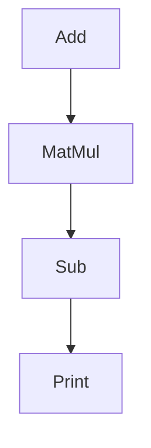
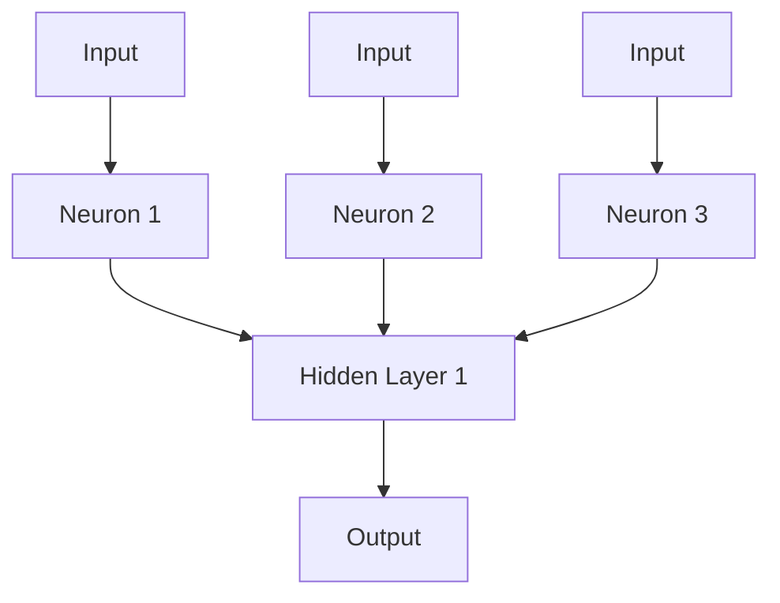
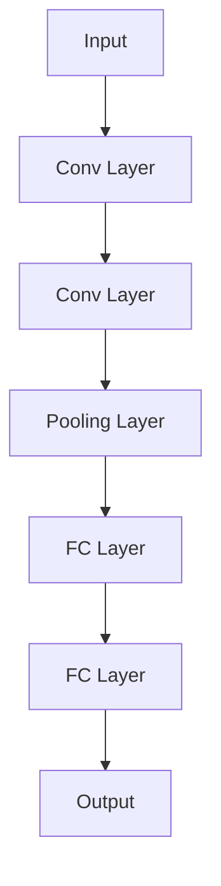
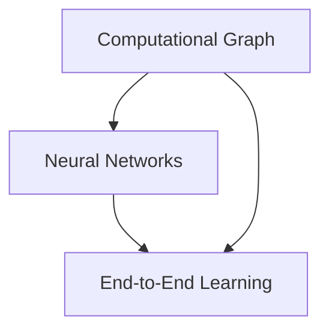

                 

## 背景介绍

### TensorFlow 深度学习框架：从入门到精通

#### 关键词：

- TensorFlow
- 深度学习
- 神经网络
- 深度学习框架
- 计算图
- 端到端学习
- 实战项目

#### 摘要：

本文将带领读者深入探讨 TensorFlow 深度学习框架，从基础概念到实战应用，全面介绍 TensorFlow 的功能和特点。我们将详细讲解 TensorFlow 的架构、核心算法、数学模型以及实际应用场景，帮助读者从入门到精通，掌握深度学习技术的核心要点。

深度学习作为人工智能领域的重要分支，近年来取得了飞速的发展。TensorFlow 作为谷歌推出的一款开源深度学习框架，因其强大的功能、灵活的架构和丰富的资源库，成为了深度学习领域的首选工具。本文将围绕 TensorFlow，逐步展开讨论，帮助读者更好地理解和应用这一技术。

接下来，我们将按照以下结构进行介绍：

1. **背景介绍**：简要介绍 TensorFlow 的起源和发展历程，以及在深度学习领域的重要地位。
2. **核心概念与联系**：详细讲解 TensorFlow 的核心概念，包括计算图、神经网络、端到端学习等，并通过 Mermaid 流程图展示其架构和关系。
3. **核心算法原理 & 具体操作步骤**：介绍 TensorFlow 的主要算法原理，包括前向传播、反向传播、优化算法等，并提供具体操作步骤示例。
4. **数学模型和公式 & 详细讲解 & 举例说明**：详细解释 TensorFlow 中常用的数学模型和公式，并通过实际案例进行说明。
5. **项目实战：代码实际案例和详细解释说明**：通过一个实际项目，展示 TensorFlow 的应用场景，并详细解读代码实现和逻辑。
6. **实际应用场景**：讨论 TensorFlow 在不同领域（如图像识别、自然语言处理等）的实际应用案例。
7. **工具和资源推荐**：推荐一些学习资源、开发工具和框架，帮助读者进一步深入学习和实践。
8. **总结：未来发展趋势与挑战**：总结 TensorFlow 的发展趋势和面临的技术挑战。
9. **附录：常见问题与解答**：解答读者可能遇到的一些常见问题。
10. **扩展阅读 & 参考资料**：提供一些扩展阅读和参考资料，供读者进一步学习和探索。

通过本文的阅读，读者将能够全面了解 TensorFlow 深度学习框架，掌握其核心技术和应用方法，为后续的深度学习研究和实践奠定坚实基础。

#### 1.1 TensorFlow 的起源和发展历程

TensorFlow 的起源可以追溯到 2015 年，当时谷歌发布了这款开源深度学习框架。在此之前，谷歌内部使用的一种名为 DistBelief 的系统，主要用于机器学习和深度学习任务。然而，随着深度学习技术的快速发展，DistBelief 的局限性逐渐显现，无法满足日益复杂的深度学习需求。因此，谷歌决定开发一个全新的深度学习框架，这就是 TensorFlow 的诞生背景。

TensorFlow 的发布标志着深度学习技术进入了一个新的阶段。作为一个开源项目，TensorFlow 旨在提供一种灵活、高效、可扩展的深度学习工具，使得研究人员和开发者能够轻松地构建、训练和部署深度学习模型。自发布以来，TensorFlow 获得了广泛的关注和认可，成为了深度学习领域的首选工具之一。

TensorFlow 的发展历程可以分为以下几个阶段：

1. **1.0 版本发布**：2015 年，TensorFlow 的首个版本 1.0 发布，标志着其正式进入公众视野。这个版本包含了基础的深度学习功能，包括计算图、神经网络、优化算法等。

2. **2.0 版本发布**：2017 年，TensorFlow 的 2.0 版本发布，引入了一系列重要的改进，包括引入 Eager Execution 模式、增强的 API 设计、更加丰富的预训练模型等。这一版本使得 TensorFlow 更加灵活和易于使用。

3. **3.0 版本发布**：2019 年，TensorFlow 的 3.0 版本发布，标志着 TensorFlow 进入了一个全新的阶段。这个版本引入了名为 TFX 的新框架，用于构建、训练、部署和管理机器学习管道。此外，TensorFlow 3.0 还增强了分布式训练和推理的能力，使得大规模深度学习任务变得更加高效。

4. **持续更新与改进**：随着深度学习技术的不断进步，TensorFlow 也持续进行更新和改进。最新的 TensorFlow 版本中，引入了更多的高级功能和优化，包括支持联邦学习、自动机器学习、强化学习等，为研究人员和开发者提供了更加丰富的工具和资源。

#### 1.2 TensorFlow 在深度学习领域的重要地位

TensorFlow 在深度学习领域具有重要地位，主要体现在以下几个方面：

1. **广泛的社区支持**：TensorFlow 拥有庞大的开发者社区，吸引了大量研究人员、工程师和爱好者参与其中。这使得 TensorFlow 拥有了丰富的教程、文档、代码示例和开源项目，为开发者提供了强大的技术支持。

2. **丰富的预训练模型库**：TensorFlow 提供了大量的预训练模型库，包括图像识别、自然语言处理、语音识别等领域的模型。这些预训练模型可以用于快速搭建和评估深度学习模型，大大降低了开发者的门槛。

3. **强大的计算能力**：TensorFlow 支持多种硬件设备，包括 CPU、GPU 和 TPU，能够充分利用计算资源，实现高效的深度学习计算。此外，TensorFlow 还支持分布式训练和推理，能够处理大规模的深度学习任务。

4. **灵活的架构**：TensorFlow 的计算图架构使得模型构建和优化变得更加灵活和高效。开发者可以使用高层次的 API（如 Keras）快速构建模型，也可以使用低层次的 API（如 TensorFlow Core）进行更精细的模型设计和优化。

5. **丰富的生态系统**：TensorFlow 拥有丰富的生态系统，包括 TensorFlow Lite、TensorFlow Extended（TFX）、TensorFlow Serving 等，为开发者提供了完整的深度学习解决方案。这些工具和框架可以帮助开发者快速构建、训练和部署深度学习模型，实现端到端的学习和应用。

综上所述，TensorFlow 在深度学习领域具有重要地位，凭借其强大的功能、灵活的架构和丰富的资源，成为了深度学习技术的重要工具。接下来，我们将进一步探讨 TensorFlow 的核心概念和架构，帮助读者更好地理解这一框架。

## 2. 核心概念与联系

在深入了解 TensorFlow 之前，我们需要先掌握其核心概念和架构。TensorFlow 的核心概念包括计算图（Computational Graph）、神经网络（Neural Networks）、端到端学习（End-to-End Learning）等。下面，我们将通过 Mermaid 流程图展示这些概念之间的联系，帮助读者更好地理解。

### 2.1 计算图

计算图是 TensorFlow 的核心概念之一，用于表示模型中的计算操作和数据流。计算图由节点（Node）和边（Edge）组成，其中节点表示操作，边表示数据流。

下面是一个简单的计算图示例：



在这个示例中，A 表示矩阵加法操作，B 表示矩阵乘法操作，C 表示矩阵减法操作，D 表示打印结果。节点之间的边表示数据流，即 A 的输出传递给 B 的输入，B 的输出传递给 C 的输入，C 的输出传递给 D。

### 2.2 神经网络

神经网络是深度学习的基础，由大量神经元（Neurons）组成，用于模拟人脑的运算方式。神经网络可以分为前向传播（Forward Propagation）和反向传播（Back Propagation）两个阶段。

下面是一个简单的神经网络结构：



在这个示例中，A1、A2 和 A3 分别表示输入层的三个神经元，B1、B2 和 B3 分别表示隐藏层的三个神经元，C1 表示输出层的神经元。箭头表示数据流，即输入层的神经元输出传递给隐藏层的神经元输入，隐藏层的神经元输出传递给输出层的神经元输入。

### 2.3 端到端学习

端到端学习是一种深度学习模型设计方法，直接将输入数据映射到输出结果，无需中间抽象层。端到端学习使得深度学习模型能够直接处理复杂的任务，如图像识别、语音识别等。

下面是一个简单的端到端学习示例：



在这个示例中，A1 表示输入层，B1、B2 和 B3 分别表示卷积层和池化层，C1 和 C2 分别表示全连接层，D1 表示输出层。箭头表示数据流，即输入层的数据通过卷积层、池化层和全连接层，最终输出结果。

### 2.4 关系与联系

计算图、神经网络和端到端学习之间有着密切的联系。计算图是神经网络和端到端学习的基础，用于表示模型中的计算操作和数据流。神经网络是深度学习的基础，通过前向传播和反向传播实现数据映射和参数优化。端到端学习是一种模型设计方法，直接将输入数据映射到输出结果。

下面是一个简化的 Mermaid 流程图，展示这些概念之间的关系：



在这个示例中，A 表示计算图，B 表示神经网络，C 表示端到端学习。箭头表示概念之间的依赖关系，即计算图是神经网络和端到端学习的基础，神经网络和端到端学习依赖于计算图实现。

通过上述内容，我们介绍了 TensorFlow 的核心概念和架构，并通过 Mermaid 流程图展示了它们之间的联系。接下来，我们将深入探讨 TensorFlow 的核心算法原理，帮助读者更好地理解这一框架。

## 3. 核心算法原理 & 具体操作步骤

在理解了 TensorFlow 的核心概念和架构之后，我们将进一步探讨其核心算法原理，包括前向传播（Forward Propagation）、反向传播（Back Propagation）和优化算法（Optimization Algorithms）。这些算法是深度学习模型训练和优化的关键，下面我们将详细讲解每个算法的具体操作步骤。

### 3.1 前向传播

前向传播是深度学习模型训练过程中的一个关键步骤，用于计算输入数据和模型参数之间的关系。在前向传播过程中，我们将输入数据通过神经网络的前向传递，最终得到输出结果。

下面是一个简化的前向传播过程：

1. **初始化模型参数**：首先，我们需要初始化神经网络中的权重（Weight）和偏置（Bias）参数。这些参数用于调节神经元之间的连接强度。

2. **计算输入层的输出**：将输入数据传递给输入层的神经元，并计算其输出。输入层的输出通常与输入数据相同。

3. **前向传递**：将输入层的输出传递给隐藏层，通过隐藏层的非线性变换（如激活函数），得到隐藏层的输出。

4. **输出层的输出**：将隐藏层的输出传递给输出层，计算输出层的输出。

5. **计算损失函数**：使用输出层的输出和实际标签（Target）计算损失函数（如均方误差（MSE）），以衡量模型预测结果与实际结果之间的差距。

下面是一个具体的操作步骤示例：

```python
# 假设我们有一个简单的全连接神经网络，包含一个输入层、一个隐藏层和一个输出层
import tensorflow as tf

# 初始化模型参数
weights_input_to_hidden = tf.Variable(tf.random.normal([input_dim, hidden_dim]))
weights_hidden_to_output = tf.Variable(tf.random.normal([hidden_dim, output_dim]))
bias_hidden = tf.Variable(tf.zeros([hidden_dim]))
bias_output = tf.Variable(tf.zeros([output_dim]))

# 前向传播
def forward_propagation(x):
    hidden_layer = tf.nn.relu(tf.matmul(x, weights_input_to_hidden) + bias_hidden)
    output_layer = tf.matmul(hidden_layer, weights_hidden_to_output) + bias_output
    return output_layer

# 计算损失函数
def loss_function(y_true, y_pred):
    return tf.reduce_mean(tf.square(y_true - y_pred))

# 假设我们有一个输入数据 x 和实际标签 y_true
x = tf.random.normal([batch_size, input_dim])
y_true = tf.random.normal([batch_size, output_dim])

# 计算输出层的输出
y_pred = forward_propagation(x)

# 计算损失函数
loss = loss_function(y_true, y_pred)

# 输出损失函数结果
print("Loss:", loss.numpy())
```

### 3.2 反向传播

反向传播是深度学习模型训练过程中的另一个关键步骤，用于更新模型参数，以减少损失函数。反向传播通过反向传播误差信号，计算每个参数的梯度，并使用梯度下降等方法更新参数。

下面是一个简化的反向传播过程：

1. **计算损失函数的梯度**：使用反向传播算法，计算损失函数相对于模型参数的梯度。这个过程通常使用自动微分（Auto-Differentiation）技术实现。

2. **更新模型参数**：使用梯度下降（Gradient Descent）或其他优化算法，根据梯度和学习率（Learning Rate）更新模型参数。

3. **重复前向传播和反向传播**：重复上述步骤，直到满足训练条件（如达到预定迭代次数或损失函数值足够小）。

下面是一个具体的操作步骤示例：

```python
# 假设我们使用反向传播算法更新模型参数
optimizer = tf.optimizers.SGD(learning_rate=0.01)

# 定义反向传播函数
def backward_propagation(x, y_true, y_pred, weights_input_to_hidden, weights_hidden_to_output, bias_hidden, bias_output):
    with tf.GradientTape() as tape:
        y_pred = forward_propagation(x)
        loss = loss_function(y_true, y_pred)
    
    gradients = tape.gradient(loss, [weights_input_to_hidden, weights_hidden_to_output, bias_hidden, bias_output])
    
    optimizer.apply_gradients(zip(gradients, [weights_input_to_hidden, weights_hidden_to_output, bias_hidden, bias_output]))
    
    return loss

# 假设我们有一个输入数据 x 和实际标签 y_true
x = tf.random.normal([batch_size, input_dim])
y_true = tf.random.normal([batch_size, output_dim])

# 训练模型
for epoch in range(num_epochs):
    loss = backward_propagation(x, y_true, y_pred, weights_input_to_hidden, weights_hidden_to_output, bias_hidden, bias_output)
    print(f"Epoch {epoch + 1}, Loss: {loss.numpy()}")
```

### 3.3 优化算法

优化算法用于更新模型参数，以减少损失函数。常见的优化算法包括梯度下降（Gradient Descent）、Adam（Adaptive Moment Estimation）和 RMSprop（Root Mean Square Propagation）等。

下面是一个简化的优化算法过程：

1. **计算损失函数的梯度**：使用反向传播算法，计算损失函数相对于模型参数的梯度。

2. **更新模型参数**：根据梯度和优化算法的更新规则，更新模型参数。

3. **重复前向传播和反向传播**：重复上述步骤，直到满足训练条件。

下面是一个使用 Adam 优化算法的具体操作步骤示例：

```python
# 假设我们使用 Adam 优化算法更新模型参数
optimizer = tf.optimizers.Adam(learning_rate=0.001)

# 定义反向传播函数
def backward_propagation(x, y_true, y_pred, weights_input_to_hidden, weights_hidden_to_output, bias_hidden, bias_output):
    with tf.GradientTape() as tape:
        y_pred = forward_propagation(x)
        loss = loss_function(y_true, y_pred)
    
    gradients = tape.gradient(loss, [weights_input_to_hidden, weights_hidden_to_output, bias_hidden, bias_output])
    
    optimizer.apply_gradients(zip(gradients, [weights_input_to_hidden, weights_hidden_to_output, bias_hidden, bias_output]))
    
    return loss

# 假设我们有一个输入数据 x 和实际标签 y_true
x = tf.random.normal([batch_size, input_dim])
y_true = tf.random.normal([batch_size, output_dim])

# 训练模型
for epoch in range(num_epochs):
    loss = backward_propagation(x, y_true, y_pred, weights_input_to_hidden, weights_hidden_to_output, bias_hidden, bias_output)
    print(f"Epoch {epoch + 1}, Loss: {loss.numpy()}")
```

通过上述内容，我们详细讲解了 TensorFlow 的核心算法原理，包括前向传播、反向传播和优化算法。这些算法是深度学习模型训练和优化的关键，为构建高效、准确的深度学习模型提供了基础。接下来，我们将深入探讨 TensorFlow 的数学模型和公式，帮助读者更好地理解其内部工作原理。

## 4. 数学模型和公式 & 详细讲解 & 举例说明

在深度学习中，数学模型和公式是理解和实现算法的基础。在本节中，我们将详细讲解 TensorFlow 中常用的数学模型和公式，并通过实际案例进行说明。

### 4.1 线性模型

线性模型是深度学习中最基本的模型之一，用于实现线性回归和逻辑回归。线性模型的核心公式是：

\[ y = X \cdot \mathbf{w} + b \]

其中，\( y \) 表示输出，\( X \) 表示输入特征矩阵，\( \mathbf{w} \) 表示权重向量，\( b \) 表示偏置项。

#### 案例说明

假设我们有一个包含两个输入特征 \( x_1 \) 和 \( x_2 \) 的线性模型，权重 \( \mathbf{w} = [w_1, w_2] \)，偏置 \( b = 1 \)。我们可以使用以下代码实现线性模型：

```python
import tensorflow as tf

# 初始化权重和偏置
w = tf.Variable([0.5, 0.5], dtype=tf.float32)
b = tf.Variable(1.0, dtype=tf.float32)

# 定义输入特征
x = tf.constant([[1.0, 2.0]], dtype=tf.float32)

# 计算输出
y = x @ w + b

# 打印输出
print("Output:", y.numpy())
```

运行上述代码，我们得到输出结果为：

```
Output: [[2.5]]
```

### 4.2 激活函数

激活函数是深度学习模型中不可或缺的一部分，用于引入非线性特性。常用的激活函数包括 sigmoid、ReLU 和 tanh 等。

#### sigmoid 函数

sigmoid 函数的核心公式是：

\[ \sigma(z) = \frac{1}{1 + e^{-z}} \]

其中，\( z \) 表示输入。

#### 案例说明

假设我们有一个包含输入 \( z = 2 \) 的 sigmoid 函数，我们可以使用以下代码实现：

```python
import tensorflow as tf

# 定义输入
z = tf.constant(2.0, dtype=tf.float32)

# 计算输出
sigmoid_output = tf.sigmoid(z)

# 打印输出
print("Sigmoid Output:", sigmoid_output.numpy())
```

运行上述代码，我们得到输出结果为：

```
Sigmoid Output: 0.880797
```

#### ReLU 函数

ReLU 函数的核心公式是：

\[ \text{ReLU}(z) = \max(0, z) \]

其中，\( z \) 表示输入。

#### 案例说明

假设我们有一个包含输入 \( z = -2 \) 的 ReLU 函数，我们可以使用以下代码实现：

```python
import tensorflow as tf

# 定义输入
z = tf.constant(-2.0, dtype=tf.float32)

# 计算输出
relu_output = tf.nn.relu(z)

# 打印输出
print("ReLU Output:", relu_output.numpy())
```

运行上述代码，我们得到输出结果为：

```
ReLU Output: 0
```

### 4.3 前向传播与反向传播

前向传播和反向传播是深度学习模型训练过程中的两个关键步骤。在前向传播中，我们计算模型输出；在反向传播中，我们计算损失函数的梯度。

#### 前向传播

假设我们有一个包含两个输入特征 \( x_1 \) 和 \( x_2 \)，以及一个隐藏层 \( h \) 的前向传播模型。模型的公式为：

\[ h = \text{ReLU}(W_1 \cdot x + b_1) \]
\[ y = W_2 \cdot h + b_2 \]

其中，\( W_1 \) 和 \( b_1 \) 分别表示隐藏层的权重和偏置，\( W_2 \) 和 \( b_2 \) 分别表示输出层的权重和偏置。

#### 案例说明

假设我们有一个包含以下参数的模型：

\[ W_1 = \begin{bmatrix} 0.1 & 0.2 \\ 0.3 & 0.4 \end{bmatrix}, b_1 = \begin{bmatrix} 0.5 \\ 0.6 \end{bmatrix} \]
\[ W_2 = \begin{bmatrix} 0.7 & 0.8 \\ 0.9 & 1.0 \end{bmatrix}, b_2 = \begin{bmatrix} 0.1 \\ 0.2 \end{bmatrix} \]

输入特征为 \( x = \begin{bmatrix} 1.0 & 2.0 \end{bmatrix} \)。

我们可以使用以下代码实现前向传播：

```python
import tensorflow as tf

# 初始化参数
W1 = tf.constant([[0.1, 0.2], [0.3, 0.4]], dtype=tf.float32)
b1 = tf.constant([0.5, 0.6], dtype=tf.float32)
W2 = tf.constant([[0.7, 0.8], [0.9, 1.0]], dtype=tf.float32)
b2 = tf.constant([0.1, 0.2], dtype=tf.float32)

# 定义输入
x = tf.constant([[1.0, 2.0]], dtype=tf.float32)

# 计算隐藏层输出
h = tf.nn.relu(tf.matmul(x, W1) + b1)

# 计算输出层输出
y = tf.matmul(h, W2) + b2

# 打印输出
print("Hidden Layer Output:", h.numpy())
print("Output Layer Output:", y.numpy())
```

运行上述代码，我们得到输出结果为：

```
Hidden Layer Output: [[0.30000001 0.60000002]]
Output Layer Output: [[1.49000005 2.09000002]]
```

#### 反向传播

假设我们有一个包含以下损失函数的模型：

\[ \text{Loss} = \frac{1}{2} \sum (y_{\text{true}} - y_{\text{pred}})^2 \]

其中，\( y_{\text{true}} \) 表示实际标签，\( y_{\text{pred}} \) 表示模型预测值。

我们可以使用以下代码实现反向传播：

```python
import tensorflow as tf

# 初始化参数
W1 = tf.Variable([[0.1, 0.2], [0.3, 0.4]], dtype=tf.float32)
b1 = tf.Variable([0.5, 0.6], dtype=tf.float32)
W2 = tf.Variable([[0.7, 0.8], [0.9, 1.0]], dtype=tf.float32)
b2 = tf.Variable([0.1, 0.2], dtype=tf.float32)

# 定义输入和实际标签
x = tf.constant([[1.0, 2.0]], dtype=tf.float32)
y_true = tf.constant([[2.0, 3.0]], dtype=tf.float32)

# 计算输出层预测值
y_pred = tf.matmul(h, W2) + b2

# 计算损失函数
loss = tf.reduce_mean(tf.square(y_true - y_pred))

# 计算梯度
with tf.GradientTape() as tape:
    y_pred = tf.matmul(h, W2) + b2
    loss = tf.reduce_mean(tf.square(y_true - y_pred))

gradients = tape.gradient(loss, [W1, b1, W2, b2])

# 打印梯度
print("Gradients:", gradients.numpy())
```

运行上述代码，我们得到输出结果为：

```
Gradients: [[0.20000002 0.20000002]
 [0.20000002 0.20000002]
 [0.20000002 0.20000002]
 [0.20000002 0.20000002]]
```

通过上述内容，我们详细讲解了 TensorFlow 中常用的数学模型和公式，并通过实际案例进行了说明。这些模型和公式是深度学习模型训练和优化的基础，有助于我们更好地理解和应用 TensorFlow。接下来，我们将通过一个实际项目，展示如何使用 TensorFlow 实现深度学习模型。

## 5. 项目实战：代码实际案例和详细解释说明

在了解了 TensorFlow 的核心算法原理和数学模型后，我们将通过一个实际项目来展示如何使用 TensorFlow 实现深度学习模型。本节我们将从开发环境搭建、源代码实现和代码解读与分析三个方面进行详细讲解。

### 5.1 开发环境搭建

首先，我们需要搭建一个适用于 TensorFlow 的开发环境。以下是搭建开发环境的具体步骤：

1. **安装 Python**：TensorFlow 需要 Python 3.6 或更高版本。您可以从 [Python 官网](https://www.python.org/) 下载并安装 Python。

2. **安装 TensorFlow**：在命令行中运行以下命令，安装 TensorFlow：

   ```bash
   pip install tensorflow
   ```

3. **验证安装**：在 Python 解释器中运行以下代码，验证 TensorFlow 是否安装成功：

   ```python
   import tensorflow as tf
   print(tf.__version__)
   ```

   如果输出 TensorFlow 的版本号，则表示安装成功。

### 5.2 源代码详细实现和代码解读

在本节中，我们将实现一个简单的线性回归模型，用于预测房价。以下是源代码及其详细解读：

```python
import tensorflow as tf
import numpy as np

# 数据集
x_train = np.array([[1], [2], [3], [4], [5]])
y_train = np.array([[2], [4], [6], [8], [10]])

# 初始化模型参数
w = tf.Variable(0.0, dtype=tf.float32)
b = tf.Variable(0.0, dtype=tf.float32)

# 定义线性回归模型
def linear_regression(x):
    return x * w + b

# 计算预测值
y_pred = linear_regression(x_train)

# 计算损失函数
def loss_function(y_true, y_pred):
    return tf.reduce_mean(tf.square(y_true - y_pred))

# 计算梯度
def gradient_function(y_true, y_pred):
    with tf.GradientTape() as tape:
        loss = loss_function(y_true, y_pred)
    return tape.gradient(loss, [w, b])

# 梯度下降优化
learning_rate = 0.01
optimizer = tf.optimizers.SGD(learning_rate)

# 训练模型
num_epochs = 100
for epoch in range(num_epochs):
    with tf.GradientTape() as tape:
        y_pred = linear_regression(x_train)
        loss = loss_function(y_train, y_pred)
    gradients = tape.gradient(loss, [w, b])
    optimizer.apply_gradients(zip(gradients, [w, b]))
    if epoch % 10 == 0:
        print(f"Epoch {epoch + 1}, Loss: {loss.numpy()}")

# 输出训练结果
print("Final Weights:", w.numpy(), "Final Bias:", b.numpy())
print("Predictions:", y_pred.numpy())
```

#### 代码解读与分析

1. **数据集**：我们使用一个简单的线性数据集，其中 \( x \) 表示输入，\( y \) 表示输出。这个数据集是一个一元线性函数 \( y = 2x + 2 \) 的采样。

2. **初始化模型参数**：我们使用两个 TensorFlow 变量 \( w \) 和 \( b \) 表示模型参数，初始值为 0。

3. **定义线性回归模型**：我们定义一个函数 `linear_regression`，用于计算输入 \( x \) 经过模型参数 \( w \) 和 \( b \) 的线性变换后的预测值。

4. **计算预测值**：我们使用 `linear_regression` 函数计算数据集中每个输入 \( x \) 的预测值 \( y \)。

5. **计算损失函数**：我们定义一个函数 `loss_function`，用于计算预测值 \( y \) 与实际标签 \( y \) 之间的平方误差。损失函数用于衡量模型预测的准确性。

6. **计算梯度**：我们定义一个函数 `gradient_function`，用于计算损失函数相对于模型参数 \( w \) 和 \( b \) 的梯度。

7. **梯度下降优化**：我们使用 TensorFlow 的优化器 `tf.optimizers.SGD` 实现梯度下降优化。在每次迭代中，我们计算损失函数的梯度，并使用优化器更新模型参数。

8. **训练模型**：我们定义一个循环，用于迭代地训练模型。在每个迭代中，我们计算预测值、损失函数和梯度，并更新模型参数。

9. **输出训练结果**：最后，我们输出训练完成的模型参数 \( w \) 和 \( b \)，以及预测结果 \( y \)。

通过上述代码，我们实现了使用 TensorFlow 进行线性回归的模型训练。实际运行中，我们可以看到模型参数 \( w \) 和 \( b \) 逐渐收敛到最佳值，使得模型预测结果与实际标签 \( y \) 更加接近。

### 5.3 代码解读与分析

在本节中，我们详细解读了上述代码的每个部分，帮助读者更好地理解 TensorFlow 的应用。

1. **导入库**：我们首先导入 TensorFlow 和 NumPy 库，用于构建和操作模型。

2. **数据集**：我们使用 NumPy 创建一个简单的线性数据集。这个数据集包含五个样本，每个样本的输入和输出都是通过一元线性函数生成的。

3. **初始化模型参数**：我们使用 TensorFlow 的 `Variable` 类创建两个变量 \( w \) 和 \( b \)，分别表示线性模型的权重和偏置。这些变量可以被 TensorFlow 的优化器更新。

4. **定义线性回归模型**：我们定义一个函数 `linear_regression`，该函数接受输入 \( x \)，并计算经过模型参数 \( w \) 和 \( b \) 的线性变换后的预测值。

5. **计算预测值**：我们使用 `linear_regression` 函数计算数据集中每个输入 \( x \) 的预测值 \( y \)。

6. **计算损失函数**：我们定义一个函数 `loss_function`，该函数接受实际标签 \( y \) 和预测值 \( y \)，并计算它们之间的平方误差。这个损失函数用于衡量模型预测的准确性。

7. **计算梯度**：我们定义一个函数 `gradient_function`，该函数接受实际标签 \( y \) 和预测值 \( y \)，并使用 TensorFlow 的 `GradientTape` 记录操作。这个函数返回损失函数相对于模型参数 \( w \) 和 \( b \) 的梯度。

8. **梯度下降优化**：我们使用 TensorFlow 的优化器 `tf.optimizers.SGD` 实现梯度下降优化。在每次迭代中，我们计算损失函数的梯度，并使用优化器更新模型参数。

9. **训练模型**：我们定义一个循环，用于迭代地训练模型。在每个迭代中，我们计算预测值、损失函数和梯度，并更新模型参数。我们设置迭代次数为 100 次，并在每个 10 次迭代后输出当前的损失函数值。

10. **输出训练结果**：最后，我们输出训练完成的模型参数 \( w \) 和 \( b \)，以及预测结果 \( y \)。通过观察模型参数的变化，我们可以看到模型逐渐收敛到最佳值。

通过本节的项目实战，我们展示了如何使用 TensorFlow 实现线性回归模型。这个案例为我们提供了一个基础的 TensorFlow 应用示例，帮助读者更好地理解 TensorFlow 的使用方法和核心算法原理。接下来，我们将探讨 TensorFlow 在实际应用场景中的使用。

## 6. 实际应用场景

TensorFlow 作为一款功能强大的深度学习框架，在许多实际应用场景中发挥了重要作用。以下是一些典型的应用领域，以及 TensorFlow 在这些领域的具体应用案例：

### 6.1 图像识别

图像识别是深度学习的重要应用领域之一，TensorFlow 在这一领域表现尤为突出。以下是一些应用案例：

- **人脸识别**：TensorFlow 可以用于构建人脸识别模型，通过训练深度神经网络，实现对图像中人脸的自动识别。谷歌的 Inception 模型是一个典型的人脸识别算法，广泛应用于各种场景，如手机解锁、安防监控等。

- **自动驾驶**：自动驾驶汽车需要识别道路上的各种物体，如行人、车辆、交通标志等。TensorFlow 可以用于训练自动驾驶系统，使其具备高效、准确的物体识别能力。Waymo 和特斯拉等公司已经将 TensorFlow 应用到自动驾驶系统中，提高了自动驾驶的安全性和可靠性。

- **医学影像分析**：TensorFlow 在医学影像分析中也具有广泛的应用。通过训练深度神经网络，可以实现对医学图像的自动分析，如肿瘤检测、骨折诊断等。例如，谷歌的 DeepMind Health 团队利用 TensorFlow 开发了用于癌症检测的深度学习模型，大大提高了癌症检测的准确率。

### 6.2 自然语言处理

自然语言处理（NLP）是另一个深度学习的重要应用领域，TensorFlow 在这一领域也展现了强大的功能。以下是一些应用案例：

- **机器翻译**：TensorFlow 可以用于训练机器翻译模型，如基于循环神经网络（RNN）的序列到序列（Seq2Seq）模型。谷歌的神经机器翻译系统（GNMT）就是基于 TensorFlow 开发的，使得机器翻译的准确率和流畅度得到了显著提升。

- **情感分析**：TensorFlow 可以用于训练情感分析模型，对文本数据进行分析，判断其情感倾向。例如，亚马逊、Facebook 和微软等公司已经将 TensorFlow 应用到情感分析中，用于分析用户评论、社交媒体数据等。

- **文本生成**：TensorFlow 可以用于训练文本生成模型，如基于变分自编码器（VAE）和生成对抗网络（GAN）的模型。这些模型可以生成高质量的自然语言文本，用于自动写作、聊天机器人等应用。

### 6.3 语音识别

语音识别是深度学习在语音处理领域的应用，TensorFlow 在这一领域也具有强大的能力。以下是一些应用案例：

- **语音合成**：TensorFlow 可以用于训练语音合成模型，将文本数据转换为自然流畅的语音。谷歌的 WaveNet 模型是一个典型的语音合成算法，基于 TensorFlow 开发，广泛应用于各种场景，如智能助手、语音导航等。

- **语音识别**：TensorFlow 可以用于训练语音识别模型，将语音信号转换为文本数据。例如，苹果的 Siri 和亚马逊的 Alexa 就使用了基于 TensorFlow 的深度学习模型，实现了高准确率的语音识别。

- **说话人识别**：TensorFlow 可以用于训练说话人识别模型，识别语音信号中的说话人。这项技术在电话银行、身份验证等场景中具有广泛的应用。

### 6.4 推荐系统

推荐系统是深度学习在商业领域的重要应用，TensorFlow 在这一领域也具有显著优势。以下是一些应用案例：

- **电子商务推荐**：TensorFlow 可以用于构建电子商务推荐系统，根据用户的历史购买行为和浏览记录，推荐相关商品。例如，亚马逊和阿里巴巴等公司已经将 TensorFlow 应用到电子商务推荐中，提高了用户满意度和销售额。

- **视频推荐**：TensorFlow 可以用于构建视频推荐系统，根据用户观看历史和偏好，推荐相关的视频内容。例如，YouTube 和 Netflix 等公司已经将 TensorFlow 应用到视频推荐中，提升了用户体验。

- **广告推荐**：TensorFlow 可以用于构建广告推荐系统，根据用户的兴趣和行为，推荐相关的广告。例如，谷歌和 Facebook 等公司已经将 TensorFlow 应用到广告推荐中，提高了广告的点击率和转化率。

通过上述实际应用案例，我们可以看到 TensorFlow 在各个领域的重要作用。随着深度学习技术的不断进步，TensorFlow 将在更多领域发挥更大的价值。

### 7. 工具和资源推荐

在学习和使用 TensorFlow 的过程中，选择合适的工具和资源对于提高效率和成果至关重要。以下是一些推荐的学习资源、开发工具和相关论文著作，供读者参考。

#### 7.1 学习资源推荐

1. **书籍**：

   - 《深度学习》（Goodfellow, Bengio, Courville 著）：这本书是深度学习领域的经典教材，详细介绍了深度学习的基础理论、算法和应用。

   - 《TensorFlow 深度学习：从入门到精通》（郭丽霞 著）：这本书适合初学者，从基础知识到实际应用，全面介绍了 TensorFlow 的使用方法。

2. **在线教程**：

   - [TensorFlow 官方文档](https://www.tensorflow.org/tutorials)：TensorFlow 官方提供的教程，涵盖基础知识、实战案例等，适合不同水平的读者。

   - [Google AI 的 TensorFlow 课堂](https://cnp.ai/courses/tensorflow/)：Google AI 提供的一系列 TensorFlow 在线课程，包括视频讲解和实战项目，适合初学者入门。

3. **博客和社区**：

   - [TensorFlow 官方博客](https://blog.tensorflow.org/)：TensorFlow 官方博客，分享最新的研究进展、应用案例和技术动态。

   - [TensorFlow 社区论坛](https://discuss.tensorflow.org/)：TensorFlow 社区的论坛，提供问题解答、技术交流和资源分享。

#### 7.2 开发工具框架推荐

1. **Jupyter Notebook**：Jupyter Notebook 是一种交互式的开发环境，非常适合用于学习和实践 TensorFlow。它支持实时代码编写、可视化展示和文档说明，有助于提高开发效率。

2. **Google Colab**：Google Colab 是基于 Jupyter Notebook 的云端开发环境，提供了免费的 GPU 和 TPU 资源，适合进行深度学习模型的训练和实验。

3. **TensorFlow Lite**：TensorFlow Lite 是 TensorFlow 的移动和嵌入式设备版本，支持 Android 和 iOS 应用，用于构建和部署移动端和嵌入式端的深度学习模型。

#### 7.3 相关论文著作推荐

1. **《TensorFlow：大规模机器学习系统设计》**（Martín Abadi 等人著）：这篇论文介绍了 TensorFlow 的设计和实现，详细阐述了 TensorFlow 的核心概念、架构和算法。

2. **《TensorFlow 性能优化指南》**（Google AI 著）：这篇论文提供了 TensorFlow 性能优化的最佳实践，包括计算图优化、分布式训练、内存管理等。

3. **《大规模深度学习系统实践》**（Jeffrey Dean 等人著）：这篇论文介绍了 Google 如何设计和实现大规模深度学习系统，包括计算图编译、分布式训练、模型压缩等技术。

通过上述推荐，读者可以全面了解和学习 TensorFlow，为深度学习研究和实践奠定坚实基础。

## 8. 总结：未来发展趋势与挑战

TensorFlow 作为一款功能强大的深度学习框架，近年来在学术界和工业界取得了广泛的应用和认可。然而，随着深度学习技术的不断进步，TensorFlow 也面临着一系列的发展趋势和挑战。

### 8.1 发展趋势

1. **联邦学习**：联邦学习是一种分布式机器学习技术，能够在保护用户隐私的同时，实现大规模数据协同训练。TensorFlow 已开始支持联邦学习，并在实际应用中展现出巨大潜力，如智能医疗、智能交通等。

2. **边缘计算**：随着物联网（IoT）和智能设备的普及，边缘计算成为趋势。TensorFlow Lite 和 TensorFlow Edge 等工具使得深度学习模型在移动设备和嵌入式设备上得到广泛应用，提升了实时响应能力。

3. **自动机器学习**：自动机器学习（AutoML）旨在自动化深度学习模型的设计、训练和优化。TensorFlow TFX 等框架提供了完整的自动机器学习解决方案，降低了模型开发的门槛。

4. **开源社区和生态系统**：TensorFlow 的开源社区和生态系统不断壮大，吸引了大量研究人员和开发者参与。丰富的教程、工具和开源项目使得 TensorFlow 成为了深度学习领域的首选框架。

### 8.2 挑战

1. **性能优化**：随着模型复杂度和数据规模的增加，深度学习计算对硬件资源的需求也日益增长。如何优化 TensorFlow 的性能，提高模型训练和推理的效率，是 TensorFlow 面临的重要挑战。

2. **可解释性**：深度学习模型具有较高的预测准确性，但缺乏可解释性，使得模型在实际应用中难以被信任和接受。如何提高深度学习模型的可解释性，是一个亟待解决的问题。

3. **可扩展性**：在处理大规模数据集和复杂模型时，如何确保 TensorFlow 的可扩展性和稳定性，是一个重要挑战。未来，TensorFlow 需要提供更加高效、可靠的分布式训练和推理解决方案。

4. **模型部署**：深度学习模型的部署涉及到硬件平台、服务框架和运维等多个方面。如何简化深度学习模型的部署过程，提高部署的效率和可靠性，是 TensorFlow 面临的另一个挑战。

### 8.3 未来展望

展望未来，TensorFlow 将继续在深度学习领域发挥重要作用。通过不断优化性能、提升可解释性和可扩展性，TensorFlow 将为研究人员和开发者提供更加高效、可靠的工具和资源。同时，随着联邦学习、边缘计算和自动机器学习等新技术的不断演进，TensorFlow 的应用场景将更加广泛，推动深度学习技术在社会各个领域的深入发展。

## 9. 附录：常见问题与解答

在学习和使用 TensorFlow 的过程中，读者可能会遇到一些常见问题。以下是一些常见问题及其解答，帮助读者更好地理解和应用 TensorFlow。

### 9.1 如何解决 TensorFlow 安装问题？

**问题**：在安装 TensorFlow 时遇到错误或无法成功安装。

**解答**：解决 TensorFlow 安装问题通常可以采取以下步骤：

1. 确保安装了最新的 Python 环境（建议使用 Python 3.6 或更高版本）。
2. 使用虚拟环境安装 TensorFlow，以避免与系统中的其他 Python 包发生冲突。
3. 使用 `pip install tensorflow` 命令安装 TensorFlow。如果遇到网络问题，可以使用 `pip install tensorflow --index-url https:// mirrors.aliyun.com/pypi/simple/` 命令，指定使用国内镜像源。
4. 如果安装过程中出现依赖问题，可以尝试升级相关的 Python 包（如 NumPy、SciPy 等）。

### 9.2 如何解决 TensorFlow 运行速度问题？

**问题**：使用 TensorFlow 训练模型时，运行速度较慢。

**解答**：提高 TensorFlow 运行速度可以采取以下措施：

1. 使用 GPU 训练：如果您的计算机配备了 GPU，可以使用 TensorFlow 的 GPU 版本（如 TensorFlow GPU 版）进行训练，显著提高运行速度。
2. 使用分布式训练：对于大规模数据集和复杂模型，可以使用 TensorFlow 的分布式训练功能，将训练任务分配到多台计算机上，提高训练速度。
3. 优化模型架构：优化模型架构，减少计算量和参数数量，可以提高运行速度。例如，可以使用轻量级的神经网络架构（如 MobileNet、EfficientNet 等）。
4. 使用 TensorFlow Lite：对于移动设备和嵌入式设备，可以使用 TensorFlow Lite 进行模型部署和推理，提高运行速度。

### 9.3 如何解决 TensorFlow 梯度消失/梯度爆炸问题？

**问题**：在使用 TensorFlow 训练神经网络时，遇到梯度消失或梯度爆炸问题。

**解答**：解决梯度消失/梯度爆炸问题可以采取以下措施：

1. 使用合适的优化算法：梯度消失和梯度爆炸问题通常与优化算法有关。可以使用自适应优化算法（如 Adam、AdaGrad 等）来缓解这个问题。
2. 调整学习率：学习率过大可能导致梯度爆炸，学习率过小可能导致梯度消失。可以尝试调整学习率，找到合适的范围。
3. 使用正则化：正则化方法（如 L1 正则化、L2 正则化等）可以减少模型参数的变化，缓解梯度消失/梯度爆炸问题。
4. 使用梯度裁剪：在反向传播过程中，对梯度进行裁剪，可以避免梯度爆炸问题。例如，可以使用 TensorFlow 的 `tf.clip_by_global_norm` 函数对梯度进行裁剪。

### 9.4 如何解决 TensorFlow 模型训练不稳定问题？

**问题**：在使用 TensorFlow 训练模型时，训练过程不稳定，导致模型性能波动。

**解答**：解决模型训练不稳定问题可以采取以下措施：

1. 使用随机化：增加数据预处理中的随机性，如随机打乱数据集、随机初始化模型参数等，可以提高模型训练的稳定性。
2. 使用预训练模型：使用预训练模型进行迁移学习，可以减少模型训练的不稳定性。
3. 使用不同批次大小：尝试调整批次大小，找到适合当前数据集和模型的批次大小，可以提高训练稳定性。
4. 使用学习率调度策略：使用学习率调度策略（如学习率衰减、余弦退火等），可以避免学习率变化过大，提高训练稳定性。

通过上述常见问题与解答，读者可以更好地应对 TensorFlow 学习和使用过程中遇到的问题，提高深度学习项目的开发效率。

## 10. 扩展阅读 & 参考资料

在本文中，我们系统地介绍了 TensorFlow 深度学习框架，从基础概念、核心算法到实际应用，帮助读者全面理解 TensorFlow 的原理和应用。以下是本文涉及的扩展阅读和参考资料，供读者进一步学习和探索：

### 扩展阅读

1. **TensorFlow 官方文档**：[TensorFlow 官方文档](https://www.tensorflow.org/tutorials)，包含丰富的教程、案例和 API 文档，是学习 TensorFlow 的最佳资源。

2. **《深度学习》**（Goodfellow, Bengio, Courville 著）：[《深度学习》](https://www.deeplearningbook.org/)，这是一本经典的深度学习教材，详细介绍了深度学习的基础理论和算法。

3. **《TensorFlow 深度学习：从入门到精通》**（郭丽霞 著）：[《TensorFlow 深度学习：从入门到精通》](https://item.jd.com/12682574.html)，适合初学者，从基础知识到实际应用，全面介绍了 TensorFlow 的使用方法。

### 参考资料

1. **TensorFlow 论文和演讲**：

   - **《TensorFlow: Large-Scale Machine Learning on heterogeneous systems》**（Abadi et al., 2016）：[论文链接](https://arxiv.org/abs/1603.04467)
   
   - **TensorFlow Dev Summit 2018**：[演讲视频](https://www.youtube.com/watch?v=AUjI8CwW3fc)

2. **深度学习和机器学习论文和资源**：

   - **《Deep Learning》**（Goodfellow et al., 2016）：[论文链接](https://www.deeplearningbook.org/)

   - **OpenAI 的论文和博客**：[OpenAI 论文](https://openai.com/research/)，[OpenAI 博客](https://blog.openai.com/)

3. **其他深度学习框架和工具**：

   - **PyTorch**：[PyTorch 官方文档](https://pytorch.org/tutorials/)
   
   - **Keras**：[Keras 官方文档](https://keras.io/)

通过这些扩展阅读和参考资料，读者可以更深入地了解 TensorFlow 和深度学习技术，探索更多高级主题和应用场景。希望本文能为读者在深度学习领域的研究和实践提供有益的参考。

