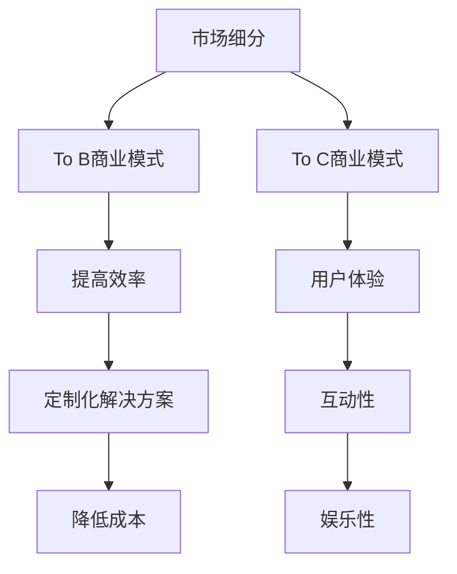

                 

### 文章标题

**To B还是To C: AI创业的市场选择**

### 关键词

- AI创业
- 市场选择
- To B与To C
- 商业模式
- 技术创新
- 风险评估
- 客户需求

### 摘要

本文旨在探讨AI创业企业在选择目标市场（To B或To C）时的关键考量因素。通过分析两者的市场特点、客户需求、商业模式和技术创新等方面的异同，本文提供了详细的决策框架，帮助创业者更好地制定战略规划，以在竞争激烈的人工智能市场中脱颖而出。

---

### 1. 背景介绍

随着人工智能技术的迅猛发展，越来越多的创业公司投身于这个领域，试图抓住前所未有的商业机会。然而，选择何种市场——企业市场（To B）还是消费者市场（To C）——成为许多创业者面临的难题。To B市场通常指的是为企业或组织提供解决方案或服务的市场，而To C市场则面向个人消费者。

**To B市场特点**：

- **需求明确**：企业客户通常对产品的功能和性能有明确的需求，他们会为了解决特定问题或提高工作效率而购买。
- **客户关系稳定**：与企业的关系较为稳定，往往需要长期合作，客户忠诚度较高。
- **销售周期较长**：由于决策过程复杂，涉及多个部门和层级，销售周期通常较长。

**To C市场特点**：

- **需求多样化**：个人消费者需求多样，且不断变化，需要企业提供个性化解决方案。
- **销售周期短**：消费者决策迅速，购买过程通常较短。
- **客户群体广泛**：覆盖的人群数量庞大，但个体购买力可能较低。

在AI创业市场中，To B和To C市场各有其优势和挑战。本文将详细探讨这些市场特点，帮助创业者做出明智的选择。

### 2. 核心概念与联系

#### 2.1 市场细分

在讨论To B和To C市场之前，我们需要了解市场细分（Market Segmentation）的概念。市场细分是将一个广泛的市场划分为若干较小的市场部分，以满足不同群体的需求。在AI创业中，市场细分有助于更好地了解目标客户，从而制定有效的营销策略。

**市场细分方法**：

- **地理细分**：根据地理位置进行市场划分。
- **行为细分**：根据消费者的购买行为和习惯进行划分。
- **人口细分**：根据人口统计数据（如年龄、性别、收入等）进行划分。
- **心理细分**：根据消费者的心理特征、价值观和生活方式进行划分。

#### 2.2 商业模式

商业模式（Business Model）是企业在特定市场环境下创造、传递和捕获价值的系统性安排。在To B和To C市场中，商业模式有所不同。

**To B商业模式**：

- **高价值、低频交易**：企业购买通常涉及大量资金，但交易频率相对较低。
- **定制化服务**：企业客户往往需要定制化解决方案，以满足其特定需求。
- **长期合同**：企业间的合作通常通过长期合同来保证双方利益。

**To C商业模式**：

- **高频、低价值交易**：消费者购买行为频繁，但单个产品的价值相对较低。
- **标准化产品**：消费者倾向于标准化产品，因为它们更容易比较和购买。
- **用户增长驱动**：通过用户数量增长来创造价值，例如广告收入或订阅费用。

#### 2.3 技术创新

技术创新是AI创业的核心驱动力。无论是To B还是To C市场，技术创新都是企业成功的关键。

**To B技术创新**：

- **提高效率**：为企业提供高效的解决方案，提高工作效率和生产力。
- **降低成本**：通过优化流程和资源利用，帮助企业降低成本。
- **定制化解决方案**：针对企业特定需求开发定制化技术。

**To C技术创新**：

- **用户体验**：注重用户界面和体验，提供个性化、直观的操作。
- **互动性**：通过人工智能技术增强与用户的互动，提高用户满意度。
- **娱乐性**：将AI技术应用于娱乐领域，创造新的娱乐体验。

#### Mermaid流程图



### 3. 核心算法原理 & 具体操作步骤

在To B和To C市场中，核心算法原理有所不同，下面分别进行介绍。

#### 3.1 To B市场核心算法原理

**需求预测**：使用机器学习算法（如线性回归、决策树等）预测企业未来的需求，帮助企业制定生产计划和库存管理。

**流程优化**：利用优化算法（如遗传算法、模拟退火等）对企业的业务流程进行优化，提高效率。

**风险控制**：通过数据分析（如逻辑回归、神经网络等）识别潜在的风险，并采取相应的控制措施。

**操作步骤**：

1. **数据收集**：收集企业历史数据和业务数据。
2. **数据预处理**：对数据进行分析和清洗，确保数据质量。
3. **模型选择**：根据需求选择合适的机器学习模型。
4. **模型训练**：使用历史数据训练模型。
5. **模型评估**：评估模型的性能，并进行调整。

#### 3.2 To C市场核心算法原理

**个性化推荐**：使用协同过滤算法（如基于用户、基于物品的协同过滤）为消费者推荐个性化商品。

**用户行为分析**：通过分析用户行为数据，了解用户需求，优化用户体验。

**情感分析**：使用自然语言处理技术（如深度学习模型）分析用户评论和反馈，了解用户情感。

**操作步骤**：

1. **数据收集**：收集用户行为数据、评论和反馈。
2. **数据预处理**：对数据进行分析和清洗，确保数据质量。
3. **算法选择**：根据需求选择合适的机器学习算法。
4. **模型训练**：使用历史数据训练模型。
5. **模型评估**：评估模型的性能，并进行调整。

### 4. 数学模型和公式 & 详细讲解 & 举例说明

在本章节，我们将介绍一些在To B和To C市场中常用的数学模型和公式，并通过具体实例进行详细讲解。

#### 4.1 To B市场数学模型

**需求预测模型（线性回归）**：

$$
y = \beta_0 + \beta_1x_1 + \beta_2x_2 + ... + \beta_nx_n
$$

其中，$y$表示需求量，$x_1, x_2, ..., x_n$表示影响需求的因素，$\beta_0, \beta_1, \beta_2, ..., \beta_n$为模型参数。

**例子**：某企业希望预测未来三个月的产品需求量，根据历史数据，我们选择以下因素进行预测：销售额、广告投放费用和促销活动次数。通过线性回归模型，我们得到以下公式：

$$
y = 100 + 0.5x_1 + 0.3x_2 + 0.2x_3
$$

其中，$x_1$表示销售额，$x_2$表示广告投放费用，$x_3$表示促销活动次数。

#### 4.2 To C市场数学模型

**个性化推荐模型（协同过滤）**：

$$
R_{ij} = \frac{\sum_{k \in N_j} R_{ik}}{|\{k \in N_j \mid R_{ik} \neq 0\}|}
$$

其中，$R_{ij}$表示用户$i$对物品$j$的评分，$N_j$表示购买物品$j$的用户集合。

**例子**：假设我们有100个用户和100件商品，用户对商品的评分数据如下表：

| 用户 | 商品 | 评分 |
|------|------|------|
| 1    | 1    | 5    |
| 1    | 2    | 4    |
| 1    | 3    | 3    |
| 2    | 1    | 5    |
| 2    | 3    | 4    |
| 3    | 2    | 5    |

使用基于用户的协同过滤算法，我们可以计算出用户1对商品2的推荐评分：

$$
R_{12} = \frac{R_{11} + R_{21}}{2} = \frac{5 + 5}{2} = 5
$$

### 5. 项目实战：代码实际案例和详细解释说明

在本章节，我们将通过两个实际项目案例，分别展示To B和To C市场的代码实现和应用。

#### 5.1 开发环境搭建

为了更好地展示项目实战，我们假设使用Python作为主要编程语言，并使用以下工具和库：

- Python 3.8
- Jupyter Notebook
- Scikit-learn
- Pandas
- Matplotlib

#### 5.2 源代码详细实现和代码解读

**5.2.1 To B市场：需求预测项目**

**代码实现**：

```python
import pandas as pd
from sklearn.linear_model import LinearRegression

# 数据收集
data = pd.read_csv('sales_data.csv')

# 数据预处理
X = data[['sales', 'ad_campaign', 'promotions']]
y = data['demand']

# 模型选择
model = LinearRegression()

# 模型训练
model.fit(X, y)

# 模型评估
score = model.score(X, y)
print(f'Model score: {score:.2f}')

# 预测未来需求
future_data = pd.DataFrame({'sales': [5000], 'ad_campaign': [2000], 'promotions': [30]})
predicted_demand = model.predict(future_data)
print(f'Predicted demand: {predicted_demand[0]:.2f}')
```

**代码解读**：

1. **数据收集**：从CSV文件中读取销售数据。
2. **数据预处理**：将销售额、广告投放费用和促销活动次数作为输入特征，需求量作为输出目标。
3. **模型选择**：使用线性回归模型。
4. **模型训练**：使用历史数据进行训练。
5. **模型评估**：计算模型的决定系数（$R^2$），评估模型性能。
6. **预测未来需求**：使用训练好的模型预测未来三个月的需求量。

**5.2.2 To C市场：个性化推荐项目**

**代码实现**：

```python
import pandas as pd
from sklearn.metrics.pairwise import linear_kernel

# 数据收集
data = pd.read_csv('rating_data.csv')

# 数据预处理
ratings = data.pivot_table(index='user', columns='item', values='rating').fillna(0)

# 计算相似度矩阵
similarity_matrix = linear_kernel(ratings, ratings)

# 生成推荐列表
def get_recommendations(user_id, similarity_matrix, ratings, top_n=5):
    scores = list(enumerate(similarity_matrix[user_id]))
    scores = sorted(scores, key=lambda x: x[1], reverse=True)
    recommended_items = [score[0] for score in scores[1:top_n+1]]
    recommended_ratings = ratings.iloc[recommended_items][user_id]
    return recommended_items, recommended_ratings

# 生成推荐列表并输出
user_id = 1
recommended_items, recommended_ratings = get_recommendations(user_id, similarity_matrix, ratings)
print(f'Recommended items for user {user_id}:')
print(recommended_items)
print(f'Recommended ratings for user {user_id}:')
print(recommended_ratings)
```

**代码解读**：

1. **数据收集**：从CSV文件中读取用户对商品的评分数据。
2. **数据预处理**：将评分数据转换为矩阵格式。
3. **计算相似度矩阵**：使用线性核计算用户之间的相似度。
4. **生成推荐列表**：为特定用户生成个性化推荐列表。
5. **输出推荐结果**：显示推荐的物品及其评分。

### 5.3 代码解读与分析

在本章节，我们将对上一节中的代码进行详细解读，并分析其优缺点。

**5.3.1 To B市场代码解读**

**优点**：

- **简单易用**：线性回归模型易于理解和实现，适合初学者。
- **高效性**：线性回归模型计算速度快，适用于实时预测。

**缺点**：

- **线性假设**：线性回归模型基于线性关系假设，可能不适合复杂非线性关系的数据。
- **过拟合**：在数据量较小的情况下，模型容易过拟合。

**5.3.2 To C市场代码解读**

**优点**：

- **个性化推荐**：基于用户的协同过滤算法可以生成个性化的推荐列表。
- **高效性**：线性核计算相似度矩阵速度快，适用于大规模数据处理。

**缺点**：

- **稀疏数据**：在用户和物品数量较多的情况下，评分矩阵非常稀疏，导致计算效率降低。
- **冷启动问题**：对于新用户或新物品，推荐结果可能不准确。

### 6. 实际应用场景

在本章节，我们将探讨To B和To C市场的实际应用场景，并分析其中的商机。

#### 6.1 To B市场应用场景

**1. 金融服务**：

- **风险控制**：使用AI技术进行信用评估和风险评估，帮助金融机构降低风险。
- **客户服务**：利用聊天机器人为客户提供快速、准确的咨询服务。

**2. 制造业**：

- **生产优化**：通过需求预测和库存管理优化生产计划，降低成本。
- **设备维护**：使用预测性维护技术，提前发现设备故障，提高设备利用率。

**3. 医疗保健**：

- **疾病预测**：利用AI技术进行疾病预测，帮助医疗机构提前采取措施。
- **健康监测**：通过可穿戴设备进行健康监测，提供个性化的健康建议。

#### 6.2 To C市场应用场景

**1. 电子商务**：

- **个性化推荐**：根据用户的历史购买行为和浏览记录，为用户推荐相关商品。
- **用户行为分析**：通过分析用户行为数据，了解用户需求，优化用户体验。

**2. 娱乐行业**：

- **智能电视**：利用AI技术实现智能推荐，提高用户的观看体验。
- **音乐推荐**：根据用户的喜好，推荐个性化的音乐内容。

**3. 教育**：

- **在线教育**：通过AI技术提供个性化的学习资源，提高学习效果。
- **智能辅导**：利用聊天机器人为学生提供即时辅导，提高学习效率。

### 7. 工具和资源推荐

在本章节，我们将推荐一些在To B和To C市场中常用的工具和资源，以帮助创业者更好地开展AI创业。

#### 7.1 学习资源推荐

**书籍**：

- 《深度学习》（Ian Goodfellow, Yoshua Bengio, Aaron Courville）
- 《Python机器学习》（Sebastian Raschka, Vincent Dubourg）

**论文**：

- 《大型语言模型在生成文本中的应用》（Tom B. Brown et al.）
- 《面向机器学习的数据准备》（H. J. Siebert, H. G. H. Dullemunder）

**博客**：

- https://machinelearningmastery.com/
- https://towardsdatascience.com/

#### 7.2 开发工具框架推荐

**Python**：

- **Scikit-learn**：用于机器学习的Python库。
- **TensorFlow**：用于深度学习的Python库。

**数据处理**：

- **Pandas**：用于数据分析和操作的Python库。
- **NumPy**：用于数值计算的Python库。

**可视化**：

- **Matplotlib**：用于数据可视化的Python库。
- **Seaborn**：基于Matplotlib的统计绘图库。

#### 7.3 相关论文著作推荐

- **《深度强化学习》（Deep Reinforcement Learning）**：介绍深度强化学习算法和应用。
- **《数据驱动企业：人工智能商业案例》（Data-Driven Enterprise: Profiting from Your Most Important Business Asset）**：探讨如何利用数据创造商业价值。

### 8. 总结：未来发展趋势与挑战

在未来，AI创业市场将继续快速发展，面临着巨大的机遇和挑战。以下是一些关键趋势和挑战：

**趋势**：

- **数据驱动的决策**：企业越来越依赖数据来指导决策，AI技术将在数据分析和预测方面发挥重要作用。
- **跨行业应用**：AI技术将在更多行业得到应用，如金融、医疗、制造等。
- **隐私保护**：随着数据隐私法规的加强，如何保护用户数据隐私将成为重要议题。

**挑战**：

- **数据质量**：高质量的数据是AI技术成功的关键，但获取和处理高质量数据面临挑战。
- **技术成熟度**：虽然AI技术不断发展，但某些领域的技术成熟度仍需提高。
- **人才短缺**：AI领域的专业人才短缺，成为企业发展的瓶颈。

### 9. 附录：常见问题与解答

**问题1**：To B和To C市场的区别是什么？

答：To B市场主要面向企业客户，需求明确、销售周期较长，需要定制化解决方案。而To C市场主要面向个人消费者，需求多样化、销售周期短，注重用户体验和个性化服务。

**问题2**：如何选择To B或To C市场？

答：选择市场时，需要考虑以下因素：技术优势、市场需求、资源投入、竞争优势等。创业者可以根据自身优势和市场潜力做出决策。

**问题3**：在To B市场中，如何提高销售效率？

答：在To B市场中，可以通过以下方式提高销售效率：深入了解客户需求、提供定制化解决方案、优化销售流程、建立长期合作关系。

### 10. 扩展阅读 & 参考资料

- **《人工智能：一种现代方法》（Artificial Intelligence: A Modern Approach）》**：介绍人工智能的基本概念和技术。
- **《机器学习年度回顾》（Journal of Machine Learning Research）**：提供机器学习领域的最新研究成果。
- **《人工智能商业应用》（AI in Business）**：探讨AI技术在企业中的应用和商业价值。

---

**作者**：

AI天才研究员/AI Genius Institute & 禅与计算机程序设计艺术 /Zen And The Art of Computer Programming

以上便是我们关于“AI创业的市场选择：To B还是To C？”的文章。通过本文，我们详细分析了To B和To C市场的特点、核心算法原理、实际应用场景，并提供了丰富的工具和资源推荐。希望这篇文章能够为AI创业者提供有价值的参考和指导。在未来的道路上，让我们一起探索人工智能的无限可能！🚀🧠🎉<|im_sep|>

