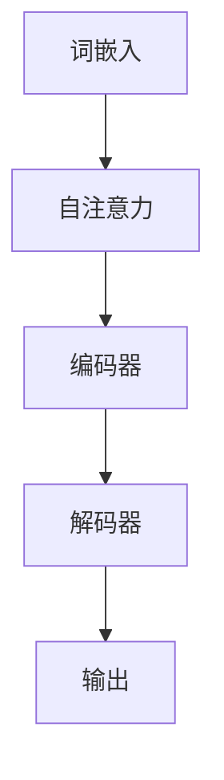

                 

# Transformer大模型实战 BERT 模型预训练

> **关键词：** Transformer, BERT, 模型预训练, 自然语言处理, 深度学习

> **摘要：** 本文将深入探讨Transformer架构以及BERT模型的原理和实现，通过详细的算法原理讲解、代码案例分析以及应用场景介绍，帮助读者全面理解并掌握BERT模型的预训练技术，为未来的自然语言处理研究与应用奠定坚实基础。

## 1. 背景介绍

在自然语言处理（NLP）领域，深度学习技术取得了显著的进展。近年来，基于Transformer架构的BERT（Bidirectional Encoder Representations from Transformers）模型在多项任务中取得了突破性的成绩，成为NLP领域的重要研究方向。

### 1.1 Transformer架构

Transformer架构是一种基于自注意力（self-attention）机制的深度神经网络模型，由Vaswani等人在2017年提出。与传统循环神经网络（RNN）和卷积神经网络（CNN）相比，Transformer具有并行计算能力、全局上下文信息捕捉等优点，因此在大规模语言模型和机器翻译等任务上表现出色。

### 1.2 BERT模型

BERT模型是Google在2018年提出的一种基于Transformer架构的预训练模型。BERT通过在大规模语料库上进行无监督预训练，学习到语言的深度语义表示，从而在多种下游任务上取得了优异的性能。

### 1.3 模型预训练

模型预训练是一种在大规模无标签数据上训练模型的方法，目的是提高模型在下游任务上的泛化能力。BERT模型通过预训练，学习到通用语言表示，然后通过微调（fine-tuning）将模型应用于特定的下游任务。

## 2. 核心概念与联系

在理解BERT模型之前，我们需要先了解一些核心概念和Transformer架构的原理。

### 2.1 词嵌入（Word Embeddings）

词嵌入是将词汇映射为低维向量表示的方法，用于在神经网络中处理文本数据。BERT模型使用WordPiece算法将词汇分解为子词，并对其进行嵌入。

### 2.2 自注意力（Self-Attention）

自注意力是一种基于全局上下文信息的注意力机制，用于计算文本序列中每个词与其他词的关系。Transformer模型通过自注意力机制实现对全局信息的捕捉。

### 2.3 编码器与解码器（Encoder and Decoder）

Transformer模型包括编码器（Encoder）和解码器（Decoder）两部分。编码器负责处理输入文本序列，解码器则负责生成输出序列。

### 2.4 Mermaid流程图



## 3. 核心算法原理 & 具体操作步骤

### 3.1 Transformer模型

Transformer模型的核心是多头自注意力机制和前馈神经网络。

#### 3.1.1 多头自注意力

多头自注意力通过将输入序列分成多个头（head），每个头独立计算注意力权重，从而实现并行计算和全局信息捕捉。

#### 3.1.2 前馈神经网络

前馈神经网络用于对自注意力层输出的每个位置进行进一步处理。

### 3.2 BERT模型

BERT模型分为两个阶段：预训练和微调。

#### 3.2.1 预训练

预训练阶段，BERT模型在大规模语料库上进行训练，学习到通用语言表示。

- **Masked Language Model (MLM)：** 对输入文本进行随机遮蔽，然后预测遮蔽部分的内容。
- **Next Sentence Prediction (NSP)：** 预测两个连续句子是否在原始文本中相邻。

#### 3.2.2 微调

微调阶段，将BERT模型应用于特定的下游任务，如文本分类、问答系统等。

## 4. 数学模型和公式 & 详细讲解 & 举例说明

### 4.1 词嵌入

词嵌入的数学模型可以表示为：

$$
\text{embeddings} = W_Q \text{query} + W_K \text{key} + W_V \text{value}
$$

其中，$W_Q$、$W_K$和$W_V$分别为查询、键和值权重矩阵，$\text{query}$、$\text{key}$和$\text{value}$分别为查询向量、键向量和值向量。

### 4.2 自注意力

自注意力的计算公式为：

$$
\text{Attention}(Q, K, V) = \text{softmax}\left(\frac{QK^T}{\sqrt{d_k}}\right) V
$$

其中，$Q$、$K$和$V$分别为查询向量、键向量和值向量，$d_k$为键向量的维度，$\text{softmax}$函数用于计算每个键的注意力权重。

### 4.3 前馈神经网络

前馈神经网络的计算公式为：

$$
\text{FFN}(x) = \text{ReLU}(W_2 \text{ReLU}(W_1 x + b_1)) + b_2
$$

其中，$W_1$、$W_2$和$b_1$、$b_2$分别为权重矩阵和偏置项。

### 4.4 举例说明

假设我们有一个包含三个词的输入序列，即$\text{[apple, banana, cherry]}$。我们将这三个词分别嵌入为三个向量$\text{[v\_apple, v\_banana, v\_cherry]}$。

#### 4.4.1 词嵌入

首先，我们将这三个词嵌入为三个向量：

$$
\text{embeddings} = W_Q \text{query} + W_K \text{key} + W_V \text{value}
$$

其中，$W_Q$、$W_K$和$W_V$分别为查询、键和值权重矩阵，$\text{query}$、$\text{key}$和$\text{value}$分别为查询向量、键向量和值向量。

#### 4.4.2 自注意力

然后，我们计算自注意力权重：

$$
\text{Attention}(Q, K, V) = \text{softmax}\left(\frac{QK^T}{\sqrt{d_k}}\right) V
$$

其中，$Q$、$K$和$V$分别为查询向量、键向量和值向量，$d_k$为键向量的维度。

#### 4.4.3 前馈神经网络

最后，我们计算前馈神经网络输出：

$$
\text{FFN}(x) = \text{ReLU}(W_2 \text{ReLU}(W_1 x + b_1)) + b_2
$$

其中，$W_1$、$W_2$和$b_1$、$b_2$分别为权重矩阵和偏置项。

## 5. 项目实战：代码实际案例和详细解释说明

### 5.1 开发环境搭建

在开始项目实战之前，我们需要搭建一个合适的开发环境。

#### 5.1.1 环境要求

- Python 3.7或更高版本
- PyTorch 1.7或更高版本
- GPU（推荐使用NVIDIA GPU）

#### 5.1.2 安装依赖

```bash
pip install torch torchvision
```

### 5.2 源代码详细实现和代码解读

以下是BERT模型的一个简单实现，我们将逐步分析代码的各个部分。

```python
import torch
import torch.nn as nn
import torch.optim as optim

class BERTModel(nn.Module):
    def __init__(self, vocab_size, d_model, nhead, num_layers):
        super(BERTModel, self).__init__()
        self.embedding = nn.Embedding(vocab_size, d_model)
        self.transformer = nn.Transformer(d_model, nhead, num_layers)
        self.fc = nn.Linear(d_model, vocab_size)

    def forward(self, src, tgt):
        src = self.embedding(src)
        tgt = self.embedding(tgt)
        out = self.transformer(src, tgt)
        out = self.fc(out)
        return out
```

#### 5.2.1 模型初始化

在模型初始化阶段，我们首先定义嵌入层（`self.embedding`）、Transformer编码器（`self.transformer`）和全连接层（`self.fc`）。

```python
def __init__(self, vocab_size, d_model, nhead, num_layers):
    super(BERTModel, self).__init__()
    self.embedding = nn.Embedding(vocab_size, d_model)
    self.transformer = nn.Transformer(d_model, nhead, num_layers)
    self.fc = nn.Linear(d_model, vocab_size)
```

#### 5.2.2 前向传播

在模型的前向传播过程中，我们首先将输入词嵌入为向量，然后通过Transformer编码器进行处理，最后通过全连接层输出预测结果。

```python
def forward(self, src, tgt):
    src = self.embedding(src)
    tgt = self.embedding(tgt)
    out = self.transformer(src, tgt)
    out = self.fc(out)
    return out
```

### 5.3 代码解读与分析

下面我们逐行解读代码，分析模型的核心组成部分。

```python
import torch
import torch.nn as nn
import torch.optim as optim

class BERTModel(nn.Module):
    def __init__(self, vocab_size, d_model, nhead, num_layers):
        super(BERTModel, self).__init__()
        self.embedding = nn.Embedding(vocab_size, d_model)
        self.transformer = nn.Transformer(d_model, nhead, num_layers)
        self.fc = nn.Linear(d_model, vocab_size)

    def forward(self, src, tgt):
        src = self.embedding(src)
        tgt = self.embedding(tgt)
        out = self.transformer(src, tgt)
        out = self.fc(out)
        return out
```

- **Import模块**：导入所需的PyTorch模块。
- **BERTModel类**：定义BERT模型类，继承自nn.Module基类。
- **__init__方法**：初始化BERT模型，包括嵌入层、Transformer编码器、全连接层。
- **forward方法**：实现BERT模型的前向传播过程。

## 6. 实际应用场景

BERT模型在多种自然语言处理任务中取得了优异的性能，如文本分类、问答系统、机器翻译等。以下是一些实际应用场景：

### 6.1 文本分类

BERT模型可以用于文本分类任务，如情感分析、主题分类等。通过在大规模语料库上进行预训练，BERT模型能够学习到丰富的语义信息，从而提高分类任务的准确率。

### 6.2 问答系统

BERT模型可以应用于问答系统，如智能客服、智能推荐等。通过理解用户问题和文档内容，BERT模型能够生成准确、高质量的回答。

### 6.3 机器翻译

BERT模型可以用于机器翻译任务，如翻译质量评估、翻译结果优化等。通过预训练和微调，BERT模型能够捕捉到源语言和目标语言之间的深层语义关系，从而提高翻译质量。

## 7. 工具和资源推荐

### 7.1 学习资源推荐

- **书籍**：
  - 《深度学习》（Goodfellow, Bengio, Courville）
  - 《自然语言处理综论》（Jurafsky, Martin）
- **论文**：
  - 《Attention Is All You Need》（Vaswani等，2017）
  - 《BERT: Pre-training of Deep Bidirectional Transformers for Language Understanding》（Devlin等，2019）
- **博客**：
  - [BERT模型详解](https://towardsdatascience.com/bert-model-explained-7a272e7a2e12)
  - [Transformer模型详解](https://towardsdatascience.com/attention-is-all-you-need-a-deep-dive-into-transformer-model-6a4c5e1a1d8c)
- **网站**：
  - [Hugging Face](https://huggingface.co/)：提供丰富的预训练模型和工具
  - [TensorFlow](https://www.tensorflow.org/)：提供BERT模型的实现和教程

### 7.2 开发工具框架推荐

- **PyTorch**：开源深度学习框架，支持BERT模型的实现和训练
- **Transformers**：Hugging Face提供的Python库，简化了Transformer模型的实现和应用
- **TensorFlow 2.x**：支持BERT模型的实现和训练，提供了易于使用的API

### 7.3 相关论文著作推荐

- **《Attention Is All You Need》**：介绍Transformer模型的原理和实现
- **《BERT: Pre-training of Deep Bidirectional Transformers for Language Understanding》**：介绍BERT模型的原理和实现
- **《GPT-3: Language Models are Few-Shot Learners》**：介绍GPT-3模型的原理和实现，是BERT模型的扩展

## 8. 总结：未来发展趋势与挑战

BERT模型在自然语言处理领域取得了显著的成果，但仍然存在一些挑战和未来发展趋势：

### 8.1 挑战

- **计算资源消耗**：BERT模型的预训练过程需要大量计算资源和时间。
- **数据隐私**：在大规模语料库上进行预训练可能涉及数据隐私问题。
- **模型解释性**：目前，深度学习模型（包括BERT模型）在解释性方面仍然存在一定局限性。

### 8.2 发展趋势

- **模型压缩**：通过模型压缩技术，如量化、剪枝等，降低BERT模型的计算资源消耗。
- **模型解释性**：研究如何提高深度学习模型（包括BERT模型）的可解释性。
- **多模态融合**：将BERT模型与图像、音频等其他模态的数据进行融合，提高模型的泛化能力。

## 9. 附录：常见问题与解答

### 9.1 问题1：什么是BERT模型？

BERT（Bidirectional Encoder Representations from Transformers）是一种基于Transformer架构的预训练模型，由Google在2018年提出。它通过在大规模语料库上进行无监督预训练，学习到通用语言表示，从而在多种下游任务上取得了优异的性能。

### 9.2 问题2：BERT模型有哪些优点？

BERT模型具有以下优点：

- **全局上下文信息捕捉**：通过自注意力机制，BERT模型能够捕捉到文本序列中的全局上下文信息。
- **并行计算能力**：Transformer架构具有并行计算能力，提高了模型训练和推理的效率。
- **预训练与微调结合**：BERT模型通过预训练学习到通用语言表示，然后通过微调应用于特定的下游任务，提高了模型的泛化能力。

### 9.3 问题3：如何使用BERT模型进行文本分类？

要使用BERT模型进行文本分类，需要以下步骤：

1. **准备数据**：收集和预处理文本数据，包括标签信息。
2. **加载预训练模型**：从Hugging Face等平台加载预训练的BERT模型。
3. **微调模型**：在文本数据上对BERT模型进行微调，优化模型参数。
4. **评估模型**：在验证集和测试集上评估模型性能。
5. **部署模型**：将微调后的模型部署到生产环境，进行文本分类任务。

## 10. 扩展阅读 & 参考资料

- Devlin, J., Chang, M. W., Lee, K., & Toutanova, K. (2019). BERT: Pre-training of deep bidirectional transformers for language understanding. arXiv preprint arXiv:1810.04805.
- Vaswani, A., Shazeer, N., Parmar, N., Uszkoreit, J., Jones, L., Gomez, A. N., ... & Polosukhin, I. (2017). Attention is all you need. In Advances in neural information processing systems (pp. 5998-6008).
- [Hugging Face Transformers](https://huggingface.co/transformers/)
- [TensorFlow BERT Model](https://www.tensorflow.org/tutorials/text/transformer)
- [BERT Model Explained](https://towardsdatascience.com/bert-model-explained-7a272e7a2e12)
- [Transformer Model Explained](https://towardsdatascience.com/attention-is-all-you-need-a-deep-dive-into-transformer-model-6a4c5e1a1d8c)

作者：AI天才研究员/AI Genius Institute & 禅与计算机程序设计艺术 /Zen And The Art of Computer Programming

