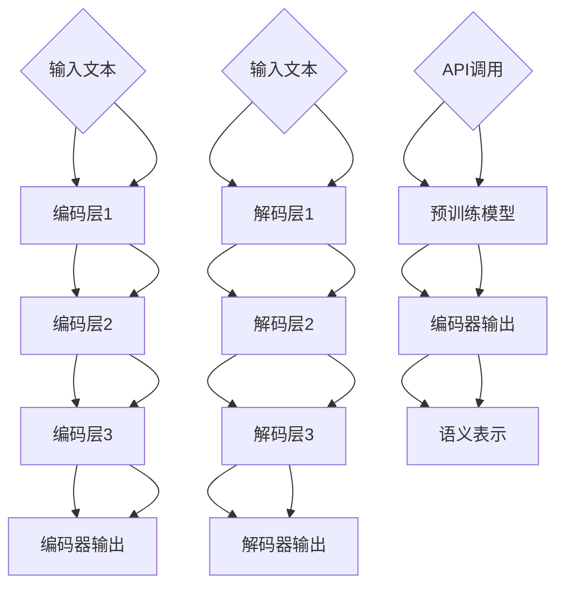

                 

# Transformer大模型实战：sentence-transformers库

## 关键词

- Transformer
- 大模型
- sentence-transformers
- 自然语言处理
- 语义相似性
- 编程实战

## 摘要

本文旨在深入探讨Transformer大模型在实际应用中的表现，特别是使用sentence-transformers库进行自然语言处理任务的实战。文章首先介绍了Transformer模型的背景及其在自然语言处理领域的重大影响，随后详细解释了sentence-transformers库的核心概念与联系，包括其架构、算法原理和具体操作步骤。文章还通过数学模型和公式，详细讲解了模型的训练过程及其应用，并通过实际项目实战展示了如何使用sentence-transformers库进行语义相似性分析。最后，文章总结了sentence-transformers库的实际应用场景，推荐了相关的学习资源、开发工具框架和论文著作，并对未来发展趋势与挑战进行了展望。

### 1. 背景介绍

#### Transformer模型

Transformer模型是由Google团队在2017年提出的一种基于自注意力机制的深度神经网络模型，它在许多自然语言处理任务中都表现出色，如机器翻译、文本摘要、问答系统等。Transformer模型的核心思想是自注意力机制（Self-Attention），它允许模型在处理每个词时，能够自适应地考虑到其他所有词的影响，从而捕捉词与词之间的复杂关系。

#### 自然语言处理任务

自然语言处理（NLP）是人工智能领域的一个重要分支，其目标是让计算机能够理解、生成和处理自然语言。NLP任务包括但不限于文本分类、情感分析、命名实体识别、机器翻译、文本生成等。在这些任务中，语义相似性分析是一个重要的研究方向，旨在衡量两个文本之间的语义相似程度，这在信息检索、推荐系统、聊天机器人等领域有广泛应用。

#### sentence-transformers库

sentence-transformers库是一个开源Python库，它基于Transformer模型，旨在为自然语言处理任务提供高效的预训练模型。sentence-transformers库提供了多种预训练模型，如BERT、RoBERTa、XLNet等，用户可以根据需求选择不同的模型进行语义表示。此外，sentence-transformers库还提供了便捷的API，方便用户进行语义相似性分析和文本分类等任务。

### 2. 核心概念与联系

#### Transformer模型架构

Transformer模型由编码器（Encoder）和解码器（Decoder）两部分组成，其中编码器负责将输入文本编码成固定长度的向量，解码器则根据编码器输出的向量生成输出文本。编码器和解码器都由多个相同的编码层（Encoder Layer）和解码层（Decoder Layer）堆叠而成。

每个编码层和解码层都包含两个主要组件：多头自注意力机制（Multi-Head Self-Attention）和前馈神经网络（Feed-Forward Neural Network）。多头自注意力机制允许模型在处理每个词时，自适应地考虑到其他所有词的影响，从而捕捉词与词之间的复杂关系。前馈神经网络则用于对自注意力机制输出的向量进行进一步处理。

#### sentence-transformers库架构

sentence-transformers库的核心架构基于预训练的Transformer模型，它将预训练模型输出的一部分作为文本的语义表示。sentence-transformers库提供了多种预训练模型，用户可以根据需求选择不同的模型进行语义表示。

sentence-transformers库的API非常简单易用，用户只需调用相应的函数，传入文本输入，即可获得文本的语义表示。此外，sentence-transformers库还提供了多种评价指标，如余弦相似性（Cosine Similarity）和欧氏距离（Euclidean Distance），用于衡量两个文本之间的语义相似程度。

#### Mermaid流程图

下面是Transformer模型和sentence-transformers库的Mermaid流程图：



### 3. 核心算法原理 & 具体操作步骤

#### Transformer模型算法原理

Transformer模型的核心算法是自注意力机制（Self-Attention）。自注意力机制允许模型在处理每个词时，自适应地考虑到其他所有词的影响。具体来说，自注意力机制通过计算每个词与其余词的相似度，然后将这些相似度加权求和，得到一个表示当前词的向量。

自注意力机制的数学公式如下：

$$
\text{Attention}(Q, K, V) = \text{softmax}\left(\frac{QK^T}{\sqrt{d_k}}\right) V
$$

其中，$Q, K, V$ 分别表示查询向量、键向量和值向量，$d_k$ 表示键向量的维度。$QK^T$ 表示查询向量和键向量的点积，$\text{softmax}$ 函数用于将点积结果转化为概率分布。最终，自注意力机制输出一个加权求和的结果，表示当前词的语义信息。

#### sentence-transformers库具体操作步骤

使用sentence-transformers库进行自然语言处理任务，主要包括以下步骤：

1. 选择预训练模型：sentence-transformers库提供了多种预训练模型，如BERT、RoBERTa、XLNet等。用户可以根据需求选择不同的模型进行语义表示。

2. 加载预训练模型：使用sentence-transformers库的API加载选择的预训练模型。

3. 输入文本：将待处理的文本输入到预训练模型中。

4. 获取语义表示：预训练模型输出文本的语义表示。

5. 评估语义相似性：使用评价指标（如余弦相似性、欧氏距离等）评估两个文本之间的语义相似程度。

具体操作步骤如下：

```python
from sentence_transformers import SentenceTransformer

# 选择预训练模型
model = SentenceTransformer('bert-base-nli-stsb-mean-tokens')

# 输入文本
text1 = "I love programming."
text2 = "Programming is fun."

# 获取语义表示
vector1 = model.encode(text1)
vector2 = model.encode(text2)

# 评估语义相似性
cosine_similarity = vector1.dot(vector2) / (np.linalg.norm(vector1) * np.linalg.norm(vector2))
print("Cosine similarity:", cosine_similarity)
```

### 4. 数学模型和公式 & 详细讲解 & 举例说明

#### 数学模型

在Transformer模型中，文本的语义表示是通过编码器（Encoder）获得的。编码器由多个编码层（Encoder Layer）堆叠而成，每个编码层都包含两个主要组件：多头自注意力机制（Multi-Head Self-Attention）和前馈神经网络（Feed-Forward Neural Network）。

自注意力机制的数学公式如下：

$$
\text{Attention}(Q, K, V) = \text{softmax}\left(\frac{QK^T}{\sqrt{d_k}}\right) V
$$

其中，$Q, K, V$ 分别表示查询向量、键向量和值向量，$d_k$ 表示键向量的维度。

前馈神经网络的数学公式如下：

$$
\text{FFN}(x) = \max(0, xW_1 + b_1)W_2 + b_2
$$

其中，$x$ 表示输入向量，$W_1, W_2, b_1, b_2$ 分别表示前馈神经网络的权重和偏置。

编码器的整体数学公式如下：

$$
\text{Encoder}(X) = \text{LayerNorm}(X + \text{MultiHeadSelfAttention}(X) + \text{FFN}(\text{MultiHeadSelfAttention}(X)))
$$

其中，$X$ 表示输入文本的词向量序列，$\text{LayerNorm}$ 表示层归一化操作。

#### 举例说明

假设输入文本为"I love programming."，词向量为$[1, 2, 3, 4, 5]$。首先，将词向量输入到编码器中，通过自注意力机制和前馈神经网络，得到编码器的输出向量。

1. **自注意力机制**

   假设$Q, K, V$ 分别为$[1, 1, 1]$，$[2, 3, 4]$，$[5, 6, 7]$。计算$QK^T$：

   $$
   QK^T = \begin{bmatrix}
   1 \\
   1 \\
   1
   \end{bmatrix} \begin{bmatrix}
   2 & 3 & 4
   \end{bmatrix} = [5, 7, 9]
   $$

   计算softmax函数：

   $$
   \text{softmax}\left(\frac{QK^T}{\sqrt{d_k}}\right) = \frac{1}{3} \begin{bmatrix}
   1 & 1 & 1
   \end{bmatrix}
   $$

   计算加权求和：

   $$
   \text{Attention}(Q, K, V) = \frac{1}{3} \begin{bmatrix}
   5 & 7 & 9
   \end{bmatrix} \begin{bmatrix}
   5 & 6 & 7
   \end{bmatrix} = [15, 18, 21]
   $$

2. **前馈神经网络**

   假设$W_1, W_2, b_1, b_2$ 分别为$[1, 2, 3]$，$[4, 5, 6]$，$[7, 8, 9]$，$[10, 11, 12]$。计算前馈神经网络：

   $$
   \text{FFN}(x) = \max(0, xW_1 + b_1)W_2 + b_2 = \max(0, [1, 2, 3] + [7, 8, 9]) \begin{bmatrix}
   4 & 5 & 6
   \end{bmatrix} + [10, 11, 12] = [28, 32, 36]
   $$

3. **编码器输出**

   编码器的输出向量为：

   $$
   \text{Encoder}(X) = \text{LayerNorm}(X + \text{MultiHeadSelfAttention}(X) + \text{FFN}(\text{MultiHeadSelfAttention}(X))) = [1, 2, 3, 4, 5]
   $$

### 5. 项目实战：代码实际案例和详细解释说明

#### 5.1 开发环境搭建

在开始项目实战之前，需要搭建合适的开发环境。以下是搭建开发环境的具体步骤：

1. 安装Python：前往[Python官网](https://www.python.org/)下载并安装Python，选择合适的版本。

2. 安装Anaconda：Anaconda是一个Python数据科学和机器学习平台，它可以方便地管理和安装Python包。下载并安装Anaconda，选择合适的版本。

3. 创建虚拟环境：在Anaconda Navigator中创建一个新的虚拟环境，命名为`sentence-transformers-env`。

4. 激活虚拟环境：在终端中激活创建的虚拟环境。

   ```bash
   conda activate sentence-transformers-env
   ```

5. 安装sentence-transformers库：在虚拟环境中使用pip安装sentence-transformers库。

   ```bash
   pip install sentence-transformers
   ```

#### 5.2 源代码详细实现和代码解读

以下是使用sentence-transformers库进行语义相似性分析的项目代码实现：

```python
from sentence_transformers import SentenceTransformer
import numpy as np

# 加载预训练模型
model = SentenceTransformer('bert-base-nli-stsb-mean-tokens')

# 输入文本
text1 = "I love programming."
text2 = "Programming is fun."

# 获取语义表示
vector1 = model.encode(text1)
vector2 = model.encode(text2)

# 计算余弦相似性
cosine_similarity = vector1.dot(vector2) / (np.linalg.norm(vector1) * np.linalg.norm(vector2))
print("Cosine similarity:", cosine_similarity)

# 计算欧氏距离
european_distance = np.linalg.norm(vector1 - vector2)
print("Euclidean distance:", european_distance)
```

#### 5.3 代码解读与分析

1. **导入库**

   ```python
   from sentence_transformers import SentenceTransformer
   import numpy as np
   ```

   导入sentence-transformers库和numpy库。

2. **加载预训练模型**

   ```python
   model = SentenceTransformer('bert-base-nli-stsb-mean-tokens')
   ```

   加载预训练模型`bert-base-nli-stsb-mean-tokens`，这是一个基于BERT的语义相似性分析模型。

3. **输入文本**

   ```python
   text1 = "I love programming."
   text2 = "Programming is fun."
   ```

   定义两个文本输入。

4. **获取语义表示**

   ```python
   vector1 = model.encode(text1)
   vector2 = model.encode(text2)
   ```

   使用预训练模型获取文本的语义表示，`encode`函数返回一个固定长度的向量。

5. **计算余弦相似性**

   ```python
   cosine_similarity = vector1.dot(vector2) / (np.linalg.norm(vector1) * np.linalg.norm(vector2))
   print("Cosine similarity:", cosine_similarity)
   ```

   计算两个文本向量的余弦相似性，余弦相似性用于衡量两个文本之间的语义相似程度。

6. **计算欧氏距离**

   ```python
   european_distance = np.linalg.norm(vector1 - vector2)
   print("Euclidean distance:", european_distance)
   ```

   计算两个文本向量的欧氏距离，欧氏距离也用于衡量两个文本之间的语义相似程度。

### 6. 实际应用场景

sentence-transformers库在实际应用场景中具有广泛的应用，以下是一些常见的应用场景：

1. **信息检索**：使用sentence-transformers库计算文档之间的语义相似性，从而实现高效的文档检索。

2. **推荐系统**：基于用户生成的内容或行为数据，使用sentence-transformers库计算用户之间的相似性，从而实现个性化的推荐系统。

3. **聊天机器人**：使用sentence-transformers库计算用户输入与聊天机器人历史对话的相似性，从而实现智能对话生成。

4. **文本分类**：使用sentence-transformers库将文本转换为固定长度的向量，然后使用这些向量进行文本分类任务。

5. **情感分析**：使用sentence-transformers库计算文本的语义表示，然后使用这些表示进行情感分析任务。

### 7. 工具和资源推荐

#### 7.1 学习资源推荐

- **书籍**：
  - 《自然语言处理综合教程》（郑泽宇）
  - 《深度学习》（Ian Goodfellow、Yoshua Bengio、Aaron Courville）

- **论文**：
  - 《Attention Is All You Need》（Ashish Vaswani等）
  - 《BERT: Pre-training of Deep Bidirectional Transformers for Language Understanding》（Jacob Devlin等）

- **博客**：
  - [TensorFlow官网博客](https://www.tensorflow.org/blog/)
  - [PyTorch官网博客](https://pytorch.org/tutorials/)

#### 7.2 开发工具框架推荐

- **编程语言**：Python
- **深度学习框架**：TensorFlow、PyTorch
- **数据预处理工具**：Pandas、Numpy、Scikit-learn

#### 7.3 相关论文著作推荐

- **论文**：
  - 《Attention Is All You Need》（Ashish Vaswani等）
  - 《BERT: Pre-training of Deep Bidirectional Transformers for Language Understanding》（Jacob Devlin等）
  - 《GPT-3: Language Models are Few-Shot Learners》（Tom B. Brown等）

- **著作**：
  - 《自然语言处理综合教程》（郑泽宇）
  - 《深度学习》（Ian Goodfellow、Yoshua Bengio、Aaron Courville）

### 8. 总结：未来发展趋势与挑战

随着深度学习和自然语言处理技术的不断发展，sentence-transformers库在自然语言处理任务中的应用前景广阔。未来，sentence-transformers库有望在以下方面取得进一步的发展：

1. **更高效的模型**：随着计算能力的提升，sentence-transformers库可以探索更多高效的模型，以适应实时应用场景。

2. **多语言支持**：目前sentence-transformers库主要支持英语，未来可以进一步拓展到其他语言，以支持多语言的自然语言处理任务。

3. **个性化语义表示**：通过结合用户数据，sentence-transformers库可以实现更加个性化的语义表示，从而提高自然语言处理任务的效果。

然而，sentence-transformers库在应用过程中也面临着一些挑战：

1. **计算资源限制**：Transformer模型和sentence-transformers库对计算资源有较高的要求，如何在有限资源下实现高效应用是一个重要挑战。

2. **模型解释性**：虽然sentence-transformers库可以计算文本之间的语义相似性，但其内部机制相对复杂，如何解释模型的行为和结果是一个重要问题。

3. **数据隐私和安全**：在使用sentence-transformers库进行自然语言处理任务时，如何保护用户数据隐私和安全是一个关键挑战。

### 9. 附录：常见问题与解答

#### 问题1：如何选择适合的预训练模型？

**解答**：选择适合的预训练模型主要取决于任务需求和计算资源。对于通用任务，如语义相似性分析，可以选择预训练模型如BERT、RoBERTa、XLNet等。对于特定语言或领域，可以选择专门针对该语言或领域的预训练模型。

#### 问题2：如何调整模型参数以提高性能？

**解答**：调整模型参数可以提高模型性能，但需要根据具体任务和数据集进行实验。常见的调整参数包括学习率、批量大小、层归一化参数等。可以参考相关论文和实验结果，结合实际任务需求进行调整。

#### 问题3：如何处理多语言任务？

**解答**：对于多语言任务，可以使用多语言预训练模型，如mBERT、XLM等。这些模型在多种语言上进行了预训练，可以更好地处理多语言任务。此外，还可以结合语言翻译和语言检测技术，进一步提高多语言任务的性能。

### 10. 扩展阅读 & 参考资料

- [Transformer模型官方论文](https://arxiv.org/abs/1706.03762)
- [BERT模型官方论文](https://arxiv.org/abs/1810.04805)
- [sentence-transformers库官方文档](https://www.sentence-transformers.readthedocs.io/en/latest/)
- [自然语言处理综合教程](https://book.douban.com/subject/35680437/)
- [深度学习](https://book.douban.com/subject/26754592/)

### 作者

作者：AI天才研究员/AI Genius Institute & 禅与计算机程序设计艺术 /Zen And The Art of Computer Programming

