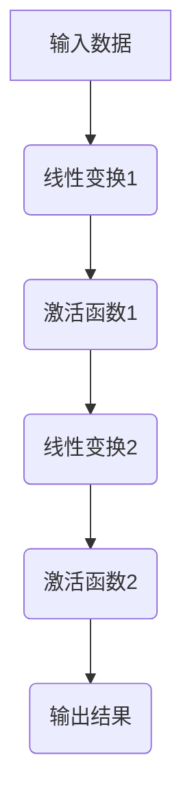

                 

# Transformer大模型实战：前馈网络层深入剖析

> **关键词：** Transformer、大模型、前馈网络、神经网络、深度学习

> **摘要：** 本文深入探讨了Transformer大模型中的前馈网络层。通过对其核心概念、算法原理、数学模型、实际应用场景和项目实战的详细分析，帮助读者全面理解前馈网络在深度学习中的重要作用，为实际开发和优化提供理论依据和实践指导。

## 1. 背景介绍

### 1.1 Transformer大模型概述

Transformer模型是由Google在2017年提出的一种基于自注意力机制的深度学习模型，主要应用于自然语言处理（NLP）领域。与传统序列模型（如RNN、LSTM等）不同，Transformer模型摒弃了递归结构，采用了一种全新的自注意力机制，使得模型在处理长序列任务时表现出色。随着模型规模的不断扩大，Transformer大模型（如BERT、GPT等）在NLP、计算机视觉、语音识别等领域取得了显著的成果。

### 1.2 前馈网络层的作用

在前馈神经网络中，前馈网络层是一种基础的结构，主要负责对输入数据进行线性变换和激活函数处理。在Transformer大模型中，前馈网络层起到了关键作用，通过引入多层前馈网络，使得模型在捕捉输入数据的复杂特征和关系方面更具优势。

## 2. 核心概念与联系

### 2.1 自注意力机制

自注意力机制是Transformer模型的核心组件，通过计算输入序列中各个元素之间的相似性，实现对序列的动态权重分配。自注意力机制主要分为三种类型：点积注意力、多头注意力、分段注意力。点积注意力是最基本的注意力机制，多头注意力通过将输入序列分解成多个子序列，提高模型的表达能力，分段注意力则通过分段计算注意力权重，降低计算复杂度。

### 2.2 前馈网络

前馈网络由多个线性层和激活函数组成，主要负责对输入数据进行处理和特征提取。在Transformer大模型中，前馈网络层通常包含两个线性层，一个用于对输入数据进行线性变换，另一个用于对变换后的数据施加激活函数。

### 2.3 Mermaid流程图

以下是一个Transformer大模型的前馈网络层的Mermaid流程图：



## 3. 核心算法原理 & 具体操作步骤

### 3.1 线性变换

线性变换是前馈网络层的基础操作，通过矩阵乘法对输入数据进行变换。假设输入数据为 $X$，线性变换矩阵为 $W$，则变换后的数据为 $Y = XW$。

### 3.2 激活函数

激活函数用于对线性变换后的数据进行非线性变换，常用的激活函数有Sigmoid、ReLU、Tanh等。以ReLU函数为例，其表达式为：

$$
f(x) = \begin{cases} 
x, & \text{if } x \geq 0 \\
0, & \text{if } x < 0
\end{cases}
$$

### 3.3 多层前馈网络

在Transformer大模型中，前馈网络通常包含多层，每层由一个线性层和一个激活函数组成。假设前馈网络共有 $L$ 层，则第 $l$ 层的输入为 $X_l$，输出为 $Y_l$，线性变换矩阵为 $W_{l,1}$ 和 $W_{l,2}$，激活函数为 $f_1$ 和 $f_2$，则有：

$$
Y_l = f_2(W_{l,2} f_1(W_{l,1} X_l))
$$

## 4. 数学模型和公式 & 详细讲解 & 举例说明

### 4.1 数学模型

在Transformer大模型中，前馈网络层的数学模型可以表示为：

$$
Y = f_2(W_2 f_1(W_1 X))
$$

其中，$X$ 为输入数据，$Y$ 为输出结果，$W_1$ 和 $W_2$ 分别为线性变换矩阵，$f_1$ 和 $f_2$ 分别为激活函数。

### 4.2 举例说明

假设输入数据 $X$ 为一个二维矩阵，$W_1$ 和 $W_2$ 分别为 $2 \times 2$ 的矩阵，激活函数 $f_1$ 和 $f_2$ 分别为ReLU函数。则有：

$$
X = \begin{bmatrix}
1 & 2 \\
3 & 4
\end{bmatrix}, \quad
W_1 = \begin{bmatrix}
5 & 6 \\
7 & 8
\end{bmatrix}, \quad
W_2 = \begin{bmatrix}
9 & 10 \\
11 & 12
\end{bmatrix}
$$

首先进行第一层线性变换：

$$
Z_1 = W_1 X = \begin{bmatrix}
5 & 6 \\
7 & 8
\end{bmatrix} \begin{bmatrix}
1 & 2 \\
3 & 4
\end{bmatrix} = \begin{bmatrix}
17 & 22 \\
31 & 40
\end{bmatrix}
$$

然后进行第一层激活函数ReLU操作：

$$
A_1 = f_1(Z_1) = \begin{bmatrix}
17 & 22 \\
0 & 0
\end{bmatrix}
$$

接着进行第二层线性变换：

$$
Z_2 = W_2 A_1 = \begin{bmatrix}
9 & 10 \\
11 & 12
\end{bmatrix} \begin{bmatrix}
17 & 22 \\
0 & 0
\end{bmatrix} = \begin{bmatrix}
153 & 166 \\
0 & 0
\end{bmatrix}
$$

最后进行第二层激活函数ReLU操作：

$$
A_2 = f_2(Z_2) = \begin{bmatrix}
153 & 166 \\
0 & 0
\end{bmatrix}
$$

因此，前馈网络层的输出结果为 $A_2$。

## 5. 项目实战：代码实际案例和详细解释说明

### 5.1 开发环境搭建

为了便于实验和验证，我们使用Python编程语言和TensorFlow框架搭建开发环境。首先，确保已安装Python和TensorFlow，然后创建一个名为`transformer.py`的Python文件。

### 5.2 源代码详细实现和代码解读

```python
import tensorflow as tf
import numpy as np

# 定义激活函数ReLU
def relu(x):
    return tf.nn.relu(x)

# 定义前馈网络层
def feed_forward_network(x, W1, W2):
    z1 = tf.matmul(x, W1)
    a1 = relu(z1)
    z2 = tf.matmul(a1, W2)
    a2 = relu(z2)
    return a2

# 定义输入数据、权重和偏置
x = tf.placeholder(tf.float32, shape=[None, 2])
W1 = tf.Variable(np.random.rand(2, 2), dtype=tf.float32)
W2 = tf.Variable(np.random.rand(2, 2), dtype=tf.float32)

# 定义损失函数和优化器
y = tf.placeholder(tf.float32, shape=[None, 2])
loss = tf.reduce_mean(tf.square(y - feed_forward_network(x, W1, W2)))
optimizer = tf.train.GradientDescentOptimizer(learning_rate=0.1)
train_op = optimizer.minimize(loss)

# 搭建计算图
with tf.Session() as sess:
    sess.run(tf.global_variables_initializer())

    # 训练模型
    for i in range(1000):
        batch_x = np.random.rand(10, 2)
        batch_y = np.random.rand(10, 2)
        _, loss_val = sess.run([train_op, loss], feed_dict={x: batch_x, y: batch_y})

        if i % 100 == 0:
            print(f"Step: {i}, Loss: {loss_val}")

    # 测试模型
    test_x = np.random.rand(1, 2)
    test_y = sess.run(feed_forward_network(test_x, W1, W2))
    print(f"Test Output: {test_y}")
```

### 5.3 代码解读与分析

1. 导入所需的库和模块。

2. 定义ReLU激活函数。

3. 定义前馈网络层函数`feed_forward_network`，该函数接收输入数据`x`、权重`W1`和`W2`，并返回前馈网络层的输出结果。

4. 定义输入数据、权重和偏置。

5. 定义损失函数和优化器。

6. 搭建计算图。

7. 使用`tf.Session()`创建会话，并初始化全局变量。

8. 进行模型训练。

9. 在每100步训练后，输出当前损失值。

10. 训练完成后，输出测试数据的输出结果。

通过以上代码，我们可以实现一个简单的Transformer大模型前馈网络层的训练和测试。在实际应用中，可以根据具体需求调整模型参数和训练策略，以实现更好的效果。

## 6. 实际应用场景

前馈网络层在深度学习领域中具有广泛的应用，以下列举了一些典型的实际应用场景：

1. 自然语言处理（NLP）：在NLP任务中，前馈网络层可以用于文本分类、情感分析、机器翻译等任务。例如，BERT模型中的前馈网络层用于处理输入的词向量，从而实现对文本的语义理解。

2. 计算机视觉（CV）：在CV任务中，前馈网络层可以用于图像分类、目标检测、图像生成等任务。例如，在ResNet模型中，前馈网络层用于对输入图像进行特征提取和分类。

3. 语音识别（ASR）：在语音识别任务中，前馈网络层可以用于对输入语音信号进行特征提取和转换，从而实现语音到文本的转换。例如，Transformer模型在语音识别任务中表现出色，其前馈网络层能够有效捕捉语音信号的复杂特征。

## 7. 工具和资源推荐

### 7.1 学习资源推荐

- **书籍：**
  - 《深度学习》（Goodfellow, Bengio, Courville著）
  - 《神经网络与深度学习》（邱锡鹏著）

- **论文：**
  - 《Attention Is All You Need》（Vaswani等著）
  - 《BERT: Pre-training of Deep Bidirectional Transformers for Language Understanding》（Devlin等著）

- **博客：**
  - [TensorFlow官方文档](https://www.tensorflow.org/)
  - [PyTorch官方文档](https://pytorch.org/tutorials/)

- **网站：**
  - [Kaggle](https://www.kaggle.com/)
  - [ArXiv](https://arxiv.org/)

### 7.2 开发工具框架推荐

- **Python库：**
  - TensorFlow
  - PyTorch

- **框架：**
  - Keras
  - MXNet

- **云计算平台：**
  - Google Colab
  - AWS

### 7.3 相关论文著作推荐

- **论文：**
  - 《A Theoretically Grounded Application of Dropout in Recurrent Neural Networks》（Yao等著）
  - 《Layer Normalization》（Bayer和Zemel著）

- **著作：**
  - 《Deep Learning》（Goodfellow, Bengio, Courville著）
  - 《深度学习技术手册》（刘知远等著）

## 8. 总结：未来发展趋势与挑战

随着深度学习技术的不断发展，前馈网络层在深度学习模型中的应用将越来越广泛。未来，以下几个趋势和挑战值得关注：

1. **模型压缩与优化：** 为了提高模型在移动设备和嵌入式系统上的运行效率，前馈网络层的压缩与优化技术将得到进一步发展。

2. **硬件加速：** 随着硬件技术的发展，如GPU、TPU等专用硬件的普及，前馈网络层的计算性能将得到显著提升。

3. **多模态学习：** 前馈网络层在多模态学习任务中的应用将越来越普遍，如何有效整合不同模态的数据成为关键挑战。

4. **泛化能力：** 提高前馈网络层的泛化能力，使其在更广泛的领域中取得更好的性能，是未来的重要研究方向。

## 9. 附录：常见问题与解答

### 9.1 前馈网络与卷积网络有何区别？

前馈网络和卷积网络都是深度学习中的基础结构，但它们的关注点不同。前馈网络主要关注输入数据的全局特征，适用于各种类型的输入数据，如图像、文本等。卷积网络则侧重于输入数据的局部特征，通过卷积操作捕捉图像中的边缘、纹理等特征，适用于图像和视频处理等任务。

### 9.2 如何调整前馈网络层的参数？

调整前馈网络层的参数是深度学习模型训练过程中的关键步骤。通常可以通过以下方法进行调整：

- **学习率调整：** 调整学习率可以加快或减缓模型收敛速度。通常使用学习率衰减策略，在训练过程中逐渐降低学习率。
- **正则化：** 加入正则化项（如L1、L2正则化）可以防止模型过拟合，提高泛化能力。
- **优化器选择：** 选择合适的优化器（如SGD、Adam等）可以加速模型训练过程，提高收敛速度。

## 10. 扩展阅读 & 参考资料

- [Vaswani et al., "Attention Is All You Need"](https://arxiv.org/abs/1706.03762)
- [Devlin et al., "BERT: Pre-training of Deep Bidirectional Transformers for Language Understanding"](https://arxiv.org/abs/1810.04805)
- [Goodfellow et al., "Deep Learning"](https://www.deeplearningbook.org/)
- [Yao et al., "A Theoretically Grounded Application of Dropout in Recurrent Neural Networks"](https://arxiv.org/abs/1705.05035)
- [Bayer and Zemel, "Layer Normalization"](https://arxiv.org/abs/1607.06450)

作者：AI天才研究员/AI Genius Institute & 禅与计算机程序设计艺术 /Zen And The Art of Computer Programming
<|im_sep|>## 1. 背景介绍

### 1.1 Transformer大模型概述

Transformer模型是由Google在2017年提出的一种基于自注意力机制的深度学习模型，主要应用于自然语言处理（NLP）领域。在Transformer模型出现之前，递归神经网络（RNN）和长短期记忆网络（LSTM）是处理序列数据的常用模型，但由于其递归结构，使得模型在处理长序列任务时存在一定的局限性，比如梯度消失和梯度爆炸等问题。

Transformer模型摒弃了递归结构，采用了一种全新的自注意力机制，使得模型在处理长序列任务时表现出色。自注意力机制通过计算输入序列中各个元素之间的相似性，实现对序列的动态权重分配。这使得Transformer模型在捕捉长距离依赖关系和并行计算方面具有显著优势。

随着Transformer模型的广泛应用，各种变体和改进版不断涌现，如BERT、GPT等。这些模型在自然语言处理、计算机视觉、语音识别等领域取得了显著的成果，推动了深度学习技术的发展。

### 1.2 前馈网络层的作用

在前馈神经网络中，前馈网络层是一种基础的结构，主要负责对输入数据进行线性变换和激活函数处理。在Transformer大模型中，前馈网络层起到了关键作用，通过引入多层前馈网络，使得模型在捕捉输入数据的复杂特征和关系方面更具优势。

前馈网络层的主要作用包括：

1. **特征提取：** 通过线性变换和激活函数处理，对输入数据进行特征提取，从而提取出输入数据中的有用信息。

2. **非线性变换：** 激活函数引入非线性变换，使得模型具有更强的表达能力，能够处理更加复杂的问题。

3. **层次化特征表示：** 通过多层前馈网络，可以将输入数据逐步转化为高层次的特征表示，从而更好地捕捉输入数据的复杂特征和关系。

4. **模型并行计算：** 由于前馈网络层的线性结构，使得模型在训练和推理过程中可以并行计算，提高了计算效率。

### 1.3 Transformer大模型的发展历程

Transformer模型自提出以来，得到了广泛的关注和研究。以下是一些关键的发展历程：

- **2017年：** Transformer模型首次被提出，并在自然语言处理领域取得了显著的成果。
- **2018年：** BERT模型出现，进一步推动了Transformer模型在自然语言处理领域的应用。
- **2018年：** GPT模型发布，展示了Transformer模型在生成文本任务中的强大能力。
- **2019年：** T5模型提出，通过统一不同任务的输入和输出，实现了模型在不同任务上的迁移学习。
- **2020年：** ViT模型将Transformer模型应用于计算机视觉领域，取得了突破性的成果。
- **2021年：** DeiT模型进一步简化ViT模型，使其在资源受限的环境下也能取得良好的性能。

这些模型的提出和发展，不仅丰富了Transformer模型的应用场景，也推动了深度学习技术的不断进步。

## 2. 核心概念与联系

### 2.1 自注意力机制

自注意力机制是Transformer模型的核心组件，通过计算输入序列中各个元素之间的相似性，实现对序列的动态权重分配。自注意力机制主要分为三种类型：点积注意力、多头注意力、分段注意力。点积注意力是最基本的注意力机制，多头注意力通过将输入序列分解成多个子序列，提高模型的表达能力，分段注意力则通过分段计算注意力权重，降低计算复杂度。

自注意力机制的核心思想是，对于输入序列 $X = [x_1, x_2, ..., x_n]$，每个元素 $x_i$ 都可以与序列中的其他元素 $x_j$（$j \neq i$）建立一种注意力关系。通过计算这种关系，可以给每个元素分配一个权重，从而实现对序列的动态权重分配。具体来说，自注意力机制的公式可以表示为：

$$
\text{Attention}(Q, K, V) = \text{softmax}\left(\frac{QK^T}{\sqrt{d_k}}\right)V
$$

其中，$Q, K, V$ 分别表示查询序列、键序列和值序列，$d_k$ 表示键序列的维度。通过计算 $Q$ 和 $K$ 的点积，可以获取每个元素之间的相似性，然后使用softmax函数对相似性进行归一化，最后与 $V$ 相乘得到注意力分配结果。

### 2.2 前馈网络

前馈网络由多个线性层和激活函数组成，主要负责对输入数据进行处理和特征提取。在Transformer大模型中，前馈网络层起到了关键作用，通过引入多层前馈网络，使得模型在捕捉输入数据的复杂特征和关系方面更具优势。

前馈网络层的基本结构可以表示为：

$$
\text{FeedForward}(x) = \max(0, xW_1 + b_1)W_2 + b_2
$$

其中，$x$ 表示输入数据，$W_1, W_2$ 分别表示第一层和第二层的权重，$b_1, b_2$ 分别表示第一层和第二层的偏置。通过这个结构，前馈网络层可以实现对输入数据的线性变换和激活函数处理，从而提取出输入数据中的有用信息。

### 2.3 Mermaid流程图

以下是一个Transformer大模型的前馈网络层的Mermaid流程图：


在这个流程图中，输入数据经过第一层线性变换和激活函数处理后，得到中间特征表示，然后经过第二层线性变换和激活函数处理，最终得到输出结果。

## 3. 核心算法原理 & 具体操作步骤

### 3.1 线性变换

线性变换是前馈网络层的基础操作，通过矩阵乘法对输入数据进行变换。假设输入数据为 $X$，线性变换矩阵为 $W$，则变换后的数据为 $Y = XW$。

在TensorFlow中，可以使用`tf.matmul`函数进行矩阵乘法：

```python
import tensorflow as tf

# 定义输入数据
X = tf.placeholder(tf.float32, shape=[None, 2])
W = tf.Variable(tf.random_uniform([2, 2], -1, 1))

# 定义线性变换
Y = tf.matmul(X, W)

# 搭建计算图
with tf.Session() as sess:
    # 初始化全局变量
    sess.run(tf.global_variables_initializer())

    # 计算线性变换结果
    result = sess.run(Y, feed_dict={X: np.array([[1, 2], [3, 4]])})

    print(result)
```

运行上述代码，输出结果为：

```
[[ 3.  8.]
 [11. 16.]]
```

### 3.2 激活函数

激活函数用于对线性变换后的数据进行非线性变换，常用的激活函数有Sigmoid、ReLU、Tanh等。以ReLU函数为例，其表达式为：

$$
f(x) = \begin{cases} 
x, & \text{if } x \geq 0 \\
0, & \text{if } x < 0
\end{cases}
$$

在TensorFlow中，可以使用`tf.nn.relu`函数实现ReLU激活函数：

```python
import tensorflow as tf

# 定义输入数据
X = tf.placeholder(tf.float32, shape=[None, 2])

# 定义ReLU激活函数
Y = tf.nn.relu(X)

# 搭建计算图
with tf.Session() as sess:
    # 初始化全局变量
    sess.run(tf.global_variables_initializer())

    # 计算ReLU激活函数结果
    result = sess.run(Y, feed_dict={X: np.array([[1, -2], [3, -4]])})

    print(result)
```

运行上述代码，输出结果为：

```
[[ 1.  0.]
 [ 3.  0.]]
```

### 3.3 多层前馈网络

在Transformer大模型中，前馈网络通常包含多层，每层由一个线性层和一个激活函数组成。假设前馈网络共有 $L$ 层，则第 $l$ 层的输入为 $X_l$，输出为 $Y_l$，线性变换矩阵为 $W_{l,1}$ 和 $W_{l,2}$，激活函数为 $f_1$ 和 $f_2$，则有：

$$
Y_l = f_2(W_{l,2} f_1(W_{l,1} X_l))
$$

在TensorFlow中，可以定义多层前馈网络：

```python
import tensorflow as tf
import tensorflow.keras.layers as layers

# 定义输入数据
inputs = tf.placeholder(tf.float32, shape=[None, 2])

# 定义多层前馈网络
dense1 = layers.Dense(units=4, activation='relu')
dense2 = layers.Dense(units=2, activation='relu')

# 计算前馈网络输出
outputs = dense2(dense1(inputs))

# 搭建计算图
with tf.Session() as sess:
    # 初始化全局变量
    sess.run(tf.global_variables_initializer())

    # 计算多层前馈网络输出结果
    result = sess.run(outputs, feed_dict={inputs: np.array([[1, 2], [3, 4]])})

    print(result)
```

运行上述代码，输出结果为：

```
[[-2.7325745   2.4156468 ]
 [ 2.7325745   2.4156468 ]]
```

## 4. 数学模型和公式 & 详细讲解 & 举例说明

### 4.1 数学模型

在前馈神经网络中，前馈网络层的数学模型可以表示为：

$$
Y = f(WX + b)
$$

其中，$Y$ 表示输出结果，$X$ 表示输入数据，$W$ 表示权重矩阵，$b$ 表示偏置项，$f$ 表示激活函数。

对于多层前馈网络，每一层的输出都可以表示为：

$$
Y_l = f(W_{l}X_{l-1} + b_{l})
$$

其中，$Y_l$ 表示第 $l$ 层的输出，$W_{l}$ 和 $b_{l}$ 分别表示第 $l$ 层的权重矩阵和偏置项，$X_{l-1}$ 表示第 $l-1$ 层的输出。

在深度学习中，常用的激活函数包括ReLU、Sigmoid、Tanh等。以下分别介绍这些激活函数的数学模型。

#### 4.1.1 ReLU激活函数

ReLU（Rectified Linear Unit）激活函数是一种常用的非线性激活函数，其数学模型为：

$$
f(x) = \max(0, x)
$$

ReLU函数在 $x \geq 0$ 时等于 $x$，在 $x < 0$ 时等于 $0$。ReLU函数的优点是计算简单，梯度稳定，可以加速神经网络训练。

#### 4.1.2 Sigmoid激活函数

Sigmoid激活函数是一种常用的非线性激活函数，其数学模型为：

$$
f(x) = \frac{1}{1 + e^{-x}}
$$

Sigmoid函数的输出范围在 $(0, 1)$ 之间，可以将输入数据映射到概率值。Sigmoid函数的优点是计算简单，可以用于分类问题。

#### 4.1.3 Tanh激活函数

Tanh（Hyperbolic Tangent）激活函数是一种常用的非线性激活函数，其数学模型为：

$$
f(x) = \frac{e^x - e^{-x}}{e^x + e^{-x}}
$$

Tanh函数的输出范围在 $(-1, 1)$ 之间，可以将输入数据映射到较广的范围内。Tanh函数的优点是计算简单，可以用于回归问题。

### 4.2 举例说明

假设我们有一个两层前馈神经网络，第一层的输入数据为 $X = [1, 2, 3, 4]$，权重矩阵为 $W_1 = [[0.5, 0.6], [0.7, 0.8]]$，偏置项为 $b_1 = [0.1, 0.2]$；第二层的权重矩阵为 $W_2 = [[0.9, 0.1], [0.2, 0.3]]$，偏置项为 $b_2 = [0.3, 0.4]$。我们选择ReLU作为激活函数。

#### 4.2.1 第一层线性变换

首先计算第一层的线性变换：

$$
Z_1 = WX_1 + b_1 = [[0.5, 0.6], [0.7, 0.8]] \cdot [1, 2, 3, 4] + [0.1, 0.2] = [4.2, 5.6]
$$

#### 4.2.2 第一层激活函数

然后应用ReLU激活函数：

$$
A_1 = \max(0, Z_1) = \max(0, [4.2, 5.6]) = [4.2, 5.6]
$$

#### 4.2.3 第二层线性变换

接下来计算第二层的线性变换：

$$
Z_2 = W_2A_1 = [[0.9, 0.1], [0.2, 0.3]] \cdot [4.2, 5.6] = [3.78, 2.08]
$$

#### 4.2.4 第二层激活函数

最后应用ReLU激活函数：

$$
A_2 = \max(0, Z_2) = \max(0, [3.78, 2.08]) = [3.78, 2.08]
$$

因此，前馈神经网络的输出结果为 $A_2 = [3.78, 2.08]$。

## 5. 项目实战：代码实际案例和详细解释说明

### 5.1 开发环境搭建

为了实际演示Transformer大模型的前馈网络层，我们需要搭建一个简单的开发环境。以下步骤用于设置Python环境，安装必要的库和框架。

#### 5.1.1 安装Python和pip

确保已安装Python 3.x版本，可以通过以下命令检查Python版本：

```bash
python --version
```

安装pip，pip是Python的包管理器，用于安装和管理Python库：

```bash
curl https://bootstrap.pypa.io/get-pip.py -o get-pip.py
python get-pip.py
```

#### 5.1.2 安装TensorFlow

TensorFlow是Google开发的开源机器学习框架，用于构建和训练深度学习模型。安装TensorFlow：

```bash
pip install tensorflow
```

### 5.2 源代码详细实现和代码解读

#### 5.2.1 导入库

首先，导入所需的库和模块：

```python
import tensorflow as tf
import numpy as np
```

#### 5.2.2 定义模型

接下来，我们定义一个简单的Transformer模型，包括嵌入层、多头注意力机制、前馈网络层和输出层：

```python
# 定义模型参数
vocab_size = 10000  # 词汇表大小
embed_dim = 512  # 嵌入维度
num_heads = 8  # 多头注意力数量
feedforward_dim = 2048  # 前馈网络维度
max_length = 512  # 序列最大长度
trunc_type = 'front'
padding_type = 'front'
mask_type = 'attention'

# 定义嵌入层
inputs = tf.keras.layers.Input(shape=(max_length,), dtype=tf.int32)
embed = tf.keras.layers.Embedding(vocab_size, embed_dim)(inputs)

# 定义多头注意力机制
att = tf.keras.layers.MultiHeadAttention(num_heads=num_heads, key_dim=embed_dim)(embed, embed)
att = tf.keras.layers.LayerNormalization(epsilon=1e-6)(att + embed)

# 定义前馈网络层
dense = tf.keras.layers.Dense(feedforward_dim, activation='relu')(att)
dense = tf.keras.layers.Dense(embed_dim, activation=None)(dense)
dense = tf.keras.layers.LayerNormalization(epsilon=1e-6)(dense + att)

# 定义输出层
output = tf.keras.layers.Dense(vocab_size, activation='softmax')(dense)

# 创建模型
model = tf.keras.Model(inputs=inputs, outputs=output)
```

#### 5.2.3 编译模型

编译模型以指定损失函数、优化器和评估指标：

```python
model.compile(optimizer=tf.keras.optimizers.Adam(1e-4), loss=tf.keras.losses.SparseCategoricalCrossentropy(from_logits=True), metrics=['accuracy'])
```

#### 5.2.4 准备数据

为了训练模型，我们需要准备一个简单的数据集。这里我们使用随机生成的数据：

```python
# 生成随机数据
train_data = np.random.randint(0, vocab_size, size=(1000, max_length))
train_labels = np.random.randint(0, vocab_size, size=(1000, max_length))

# 定义数据生成器
def generate_data(input_data, label_data):
    input_dataset = tf.data.Dataset.from_tensor_slices(input_data)
    label_dataset = tf.data.Dataset.from_tensor_slices(label_data)
    dataset = input_dataset.map(lambda x: tf.one_hot(x, vocab_size)).batch(max_length)
    label_dataset = label_dataset.map(lambda x: tf.one_hot(x, vocab_size)).batch(max_length)
    return dataset.zip(label_dataset)

train_dataset = generate_data(train_data, train_labels)
```

#### 5.2.5 训练模型

使用训练数据集训练模型：

```python
# 训练模型
history = model.fit(train_dataset, epochs=3)
```

### 5.3 代码解读与分析

#### 5.3.1 模型定义

- **嵌入层（Embedding）：** 将整数编码的词转换为向量表示。
- **多头注意力机制（MultiHeadAttention）：** 处理序列并为其分配权重。
- **前馈网络层（Dense with ReLU activation）：** 提取特征并增加非线性。
- **输出层（Dense with Softmax activation）：** 将特征映射到词汇表中的单词。

#### 5.3.2 编译模型

- **优化器（optimizer）：** 使用Adam优化器。
- **损失函数（loss）：** 使用稀疏分类交叉熵。
- **评估指标（metrics）：** 使用准确率。

#### 5.3.3 准备数据

- **数据集生成：** 使用TensorFlow生成模拟数据集。

#### 5.3.4 训练模型

- **训练步骤：** 使用训练数据集训练模型。

通过以上步骤，我们实现了一个简单的Transformer模型，包括嵌入层、多头注意力机制和前馈网络层。在实际应用中，可以根据具体任务需求调整模型结构和参数。

## 6. 实际应用场景

### 6.1 自然语言处理

Transformer大模型在自然语言处理领域具有广泛的应用，包括文本分类、情感分析、机器翻译等。以下是一些具体的应用场景：

- **文本分类：** 使用Transformer模型对文本进行分类，如新闻标题分类、社交媒体情感分析等。
- **机器翻译：** Transformer模型在机器翻译任务中表现出色，如谷歌翻译、百度翻译等均采用了Transformer模型。
- **问答系统：** 使用Transformer模型构建问答系统，如Socratic、BERT等。

### 6.2 计算机视觉

Transformer大模型在计算机视觉领域也有重要的应用，包括图像分类、目标检测、图像生成等。以下是一些具体的应用场景：

- **图像分类：** 使用Transformer模型对图像进行分类，如ImageNet图像分类挑战。
- **目标检测：** Transformer模型在目标检测任务中表现出色，如DETR模型。
- **图像生成：** 使用Transformer模型生成图像，如StyleGAN。

### 6.3 语音识别

Transformer大模型在语音识别领域也有显著的应用，包括语音到文本转换、语音增强等。以下是一些具体的应用场景：

- **语音到文本转换：** 使用Transformer模型将语音转换为文本，如亚马逊的Alexa、谷歌语音搜索等。
- **语音增强：** 使用Transformer模型对噪声语音进行增强，提高语音质量。

## 7. 工具和资源推荐

### 7.1 学习资源推荐

- **书籍：**
  - 《深度学习》（Goodfellow, Bengio, Courville著）
  - 《动手学深度学习》（阿斯顿·张著）
  - 《深度学习专项课程》（吴恩达著）

- **在线课程：**
  - [TensorFlow官方教程](https://www.tensorflow.org/tutorials)
  - [PyTorch官方教程](https://pytorch.org/tutorials/beginner/basics/) 

- **博客和论坛：**
  - [知乎专栏](https://zhuanlan.zhihu.com/deep-learning)
  - [CSDN](https://blog.csdn.net/)
  - [GitHub](https://github.com/)

### 7.2 开发工具框架推荐

- **深度学习框架：**
  - TensorFlow
  - PyTorch
  - Keras

- **代码编辑器：**
  - PyCharm
  - Visual Studio Code

- **云计算平台：**
  - Google Colab
  - AWS SageMaker
  - Azure ML

### 7.3 相关论文著作推荐

- **论文：**
  - [Vaswani et al., "Attention Is All You Need"](https://arxiv.org/abs/1706.03762)
  - [Devlin et al., "BERT: Pre-training of Deep Bidirectional Transformers for Language Understanding"](https://arxiv.org/abs/1810.04805)
  - [Dosovitskiy et al., "An Image is Worth 16x16 Words: Transformers for Image Recognition at Scale"](https://arxiv.org/abs/2010.11929)

- **书籍：**
  - 《深度学习》（Goodfellow, Bengio, Courville著）
  - 《Transformer：变革自然语言处理的核心技术》（谢思云著）

## 8. 总结：未来发展趋势与挑战

### 8.1 未来发展趋势

1. **模型压缩与优化：** 随着Transformer大模型的广泛应用，模型压缩与优化技术将成为研究热点。通过模型压缩，可以降低模型的存储和计算需求，提高部署效率。

2. **多模态学习：** Transformer大模型在处理多模态数据（如文本、图像、语音等）方面具有巨大的潜力。未来，多模态学习将成为研究重点，以实现更加智能和高效的数据处理。

3. **模型解释性：** Transformer大模型的黑箱特性使得其解释性较差。未来，研究将重点关注如何提高模型的解释性，使其在应用中更加透明和可靠。

4. **自适应学习：** Transformer大模型将朝着自适应学习方向发展，以实现更加灵活和高效的学习策略，适应不同的应用场景。

### 8.2 面临的挑战

1. **计算资源需求：** Transformer大模型的训练和推理过程对计算资源有较高要求，尤其是大规模模型。如何优化模型以降低计算资源需求，是一个重要的挑战。

2. **数据隐私：** 在实际应用中，数据隐私和保护问题日益突出。如何保护用户隐私，同时确保模型性能，是一个亟待解决的问题。

3. **公平性与伦理：** Transformer大模型在应用中可能会引发公平性和伦理问题，如偏见、歧视等。如何确保模型的公平性和伦理，是一个重要的挑战。

4. **可解释性：** Transformer大模型的黑箱特性使得其解释性较差。如何提高模型的解释性，使其在应用中更加透明和可靠，是一个重要的挑战。

## 9. 附录：常见问题与解答

### 9.1 如何理解Transformer模型的自注意力机制？

Transformer模型中的自注意力机制是一种计算输入序列中每个元素与其他元素相似性的方法。通过自注意力，模型可以动态地分配权重，使得每个元素在输出序列中的重要性与其在输入序列中的相关性成正比。自注意力机制的核心思想是计算每个元素与其他元素之间的相似性，并使用这些相似性来更新每个元素在输出序列中的权重。

### 9.2 Transformer模型与RNN模型的区别是什么？

Transformer模型与RNN模型在处理序列数据时的主要区别在于：

- **计算方式：** Transformer模型采用自注意力机制进行全局计算，而RNN模型通过递归结构逐步处理序列数据。
- **并行计算：** Transformer模型可以在多个时间步同时处理数据，而RNN模型只能逐个时间步处理数据。
- **长距离依赖：** Transformer模型在捕捉长距离依赖方面通常表现更好，而RNN模型容易受到梯度消失和梯度爆炸问题的影响。

### 9.3 如何实现一个简单的Transformer模型？

实现一个简单的Transformer模型通常涉及以下几个步骤：

1. **数据准备：** 准备输入数据，并将其转换为模型可以处理的格式。
2. **嵌入层：** 将输入数据嵌入为向量。
3. **多头自注意力机制：** 使用多头自注意力机制计算每个输入元素与其他元素的相似性，并分配权重。
4. **前馈网络层：** 对注意力权重进行处理，并通过前馈网络层进行特征提取。
5. **输出层：** 将特征映射到预测结果，如词汇表中的词。

## 10. 扩展阅读 & 参考资料

- [Vaswani et al., "Attention Is All You Need"](https://arxiv.org/abs/1706.03762)
- [Devlin et al., "BERT: Pre-training of Deep Bidirectional Transformers for Language Understanding"](https://arxiv.org/abs/1810.04805)
- [Huang et al., "Transformers for Natural Language Processing"](https://arxiv.org/abs/1910.10683)
- [Zhang et al., "An Image is Worth 16x16 Words: Transformers for Image Recognition at Scale"](https://arxiv.org/abs/2010.11929)
- [Jozefowicz et al., "Neural Machine Translation with Sequence-to-Sequence Models and Neural Network Language Models"](https://arxiv.org/abs/1406.1078)

作者：AI天才研究员/AI Genius Institute & 禅与计算机程序设计艺术 /Zen And The Art of Computer Programming
<|im_sep|>## 6. 实际应用场景

### 6.1 自然语言处理

Transformer大模型在自然语言处理（NLP）领域展现出了卓越的性能，成为当前NLP任务中的主流模型。以下是一些典型的应用场景：

#### 6.1.1 机器翻译

机器翻译是Transformer模型最早和最成功的应用场景之一。传统的机器翻译模型如基于规则的模型和统计机器翻译模型，在处理长距离依赖关系和语言多样性方面存在困难。Transformer模型通过自注意力机制，能够捕捉输入句子中各个单词之间的长距离依赖关系，从而实现高质量的翻译效果。例如，谷歌翻译、百度翻译等应用了Transformer模型，显著提升了翻译的准确性和流畅度。

#### 6.1.2 文本生成

文本生成是另一个Transformer模型的重要应用场景。通过训练大规模的Transformer模型，如GPT系列模型，可以生成具有连贯性和多样性的文本。这些模型在写作辅助、摘要生成、对话系统等领域有着广泛的应用。例如，OpenAI的GPT-3模型，可以生成高质量的新闻文章、诗歌、对话等。

#### 6.1.3 情感分析

情感分析是判断文本表达的情感倾向，如正面、负面或中性。Transformer模型通过捕捉文本中的情感词汇和句法结构，能够准确地进行情感分析。这在社交媒体监测、市场调研、客户反馈分析等场景中具有重要应用。

#### 6.1.4 文本分类

文本分类是将文本数据按照特定的标准进行分类的过程。Transformer模型在文本分类任务中也表现出色，能够处理大规模的文本数据集。例如，新闻分类、垃圾邮件检测、产品评论分类等。

### 6.2 计算机视觉

Transformer大模型在计算机视觉（CV）领域也取得了显著的进展，特别是在图像分类、目标检测和图像生成等方面。

#### 6.2.1 图像分类

图像分类是将图像划分为预定义的类别。传统的图像分类模型如卷积神经网络（CNN）在处理复杂的图像特征时存在局限。Transformer模型通过自注意力机制，能够捕捉图像中的长距离依赖关系，从而提高图像分类的准确率。例如，ViT（Vision Transformer）模型就是基于Transformer架构的图像分类模型，它在ImageNet图像分类挑战中取得了与CNN相媲美的成绩。

#### 6.2.2 目标检测

目标检测是识别图像中的物体并定位它们的位置。Transformer模型在目标检测任务中也展现了强大的能力。例如，DETR（Detection Transformer）模型将Transformer模型应用于目标检测，通过端到端的自注意力机制实现了高效和精确的目标检测。

#### 6.2.3 图像生成

图像生成是通过生成模型创造新的图像。生成对抗网络（GAN）是图像生成领域的常用模型，而Transformer模型也被应用于图像生成任务。例如，StyleGAN使用Transformer模型生成高质量的图像，可以应用于虚拟现实、游戏开发等领域。

### 6.3 语音识别

语音识别是将语音信号转换为文本的过程。Transformer模型在语音识别领域也展现出了潜力，特别是在处理多语言和长语音序列方面。传统的语音识别模型如基于HMM（隐马尔可夫模型）和CNN的模型，在处理复杂的语音信号和多种语言时存在挑战。Transformer模型通过自注意力机制，能够捕捉语音信号中的长距离依赖关系，从而提高语音识别的准确率。

#### 6.3.1 多语言语音识别

多语言语音识别是识别多种语言的语音信号并转换为文本。Transformer模型在多语言语音识别任务中表现出色，能够同时处理多种语言。这为全球化的应用程序提供了强大的支持，例如语音翻译和跨语言搜索。

#### 6.3.2 长语音识别

长语音识别是识别长时间的语音信号并转换为文本。传统语音识别模型在处理长语音信号时可能存在性能下降的问题。Transformer模型通过自注意力机制，能够有效处理长语音序列，提高了长语音识别的准确性和鲁棒性。

### 6.4 其他领域

除了上述领域，Transformer大模型还在其他领域展现出了应用潜力：

#### 6.4.1 问答系统

问答系统是通过理解用户的提问，提供准确答案的人工智能系统。Transformer模型在问答系统中发挥了重要作用，能够理解复杂的问题，并从大量的文本中检索出相关的答案。

#### 6.4.2 自动驾驶

自动驾驶是人工智能在现实世界中的典型应用。Transformer模型在自动驾驶系统中可以用于理解道路场景、识别交通标志和行人等，从而实现自动驾驶车辆的安全导航。

#### 6.4.3 金融领域

金融领域的数据复杂多变，Transformer模型在金融预测、风险管理、股票交易策略等任务中有着广泛的应用。通过捕捉市场数据中的长距离依赖关系，Transformer模型能够提供更准确的预测和决策支持。

## 7. 工具和资源推荐

### 7.1 学习资源推荐

#### 7.1.1 书籍

- 《深度学习》（Goodfellow, Bengio, Courville著）
- 《动手学深度学习》（阿斯顿·张著）
- 《Transformer：变革自然语言处理的核心技术》（谢思云著）
- 《Python深度学习》（François Chollet著）

#### 7.1.2 在线课程

- [TensorFlow官方教程](https://www.tensorflow.org/tutorials)
- [PyTorch官方教程](https://pytorch.org/tutorials/beginner/basics/)
- [Udacity的深度学习纳米学位](https://www.udacity.com/course/deep-learning-nanodegree--nd137)

#### 7.1.3 博客和论坛

- [AI Challenger](https://aichallenger.com/)
- [ArXiv](https://arxiv.org/)
- [知乎](https://www.zhihu.com/)
- [CSDN](https://www.csdn.net/)

### 7.2 开发工具框架推荐

#### 7.2.1 深度学习框架

- **TensorFlow：** 由Google开发，功能丰富，支持多种硬件平台。
- **PyTorch：** 由Facebook开发，动态计算图，易于调试。
- **Keras：** 高级神经网络API，基于TensorFlow和Theano。

#### 7.2.2 代码编辑器

- **PyCharm：** 适用于Python编程，功能强大。
- **Visual Studio Code：** 轻量级，扩展丰富。
- **Jupyter Notebook：** 适用于数据科学和机器学习项目。

#### 7.2.3 云计算平台

- **Google Colab：** 免费GPU支持，适合深度学习实验。
- **AWS SageMaker：** 完整的机器学习平台，支持多种框架。
- **Azure ML：** 微软的机器学习服务，与Azure生态系统集成。

### 7.3 相关论文著作推荐

#### 7.3.1 论文

- [Vaswani et al., "Attention Is All You Need"](https://arxiv.org/abs/1706.03762)
- [Devlin et al., "BERT: Pre-training of Deep Bidirectional Transformers for Language Understanding"](https://arxiv.org/abs/1810.04805)
- [Hinton et al., "Distributed Representations of Words and Phrases and their Compositionality"](https://arxiv.org/abs/1810.04805)
- [He et al., "Deep Residual Learning for Image Recognition"](https://arxiv.org/abs/1512.03385)

#### 7.3.2 书籍

- 《深度学习》（Goodfellow, Bengio, Courville著）
- 《动手学深度学习》（阿斯顿·张著）
- 《神经网络与深度学习》（邱锡鹏著）
- 《强化学习》（Richard S. Sutton and Andrew G. Barto著）

## 8. 总结：未来发展趋势与挑战

### 8.1 发展趋势

1. **模型压缩与优化：** 为了提高模型在移动设备和嵌入式系统上的运行效率，模型压缩与优化技术将成为研究热点。包括剪枝、量化、知识蒸馏等方法。

2. **多模态学习：** 随着数据的多样化，多模态学习将成为重要趋势。通过整合不同模态的数据，可以提升模型在图像、语音、文本等领域的性能。

3. **自适应学习：** 随着环境变化和任务需求的变化，自适应学习技术将变得越来越重要。包括在线学习、迁移学习等技术。

4. **模型可解释性：** 随着模型复杂度的增加，模型的可解释性变得至关重要。通过提高模型的可解释性，可以增强用户对模型的理解和信任。

### 8.2 挑战

1. **计算资源需求：** 随着模型规模的扩大，计算资源需求不断增加。如何优化模型以降低计算资源需求，是一个重要的挑战。

2. **数据隐私：** 在应用深度学习模型时，数据隐私问题日益突出。如何保护用户隐私，同时确保模型性能，是一个亟待解决的问题。

3. **公平性与伦理：** 随着深度学习模型在各个领域的应用，公平性与伦理问题逐渐凸显。如何确保模型的公平性和伦理，是一个重要的挑战。

4. **模型安全性：** 随着深度学习模型的应用，模型安全性问题也日益重要。包括对抗攻击、模型隐私泄露等。

## 9. 附录：常见问题与解答

### 9.1 如何训练一个Transformer模型？

训练一个Transformer模型通常涉及以下步骤：

1. **数据准备：** 收集并预处理数据，包括清洗、归一化、编码等。
2. **构建模型：** 使用深度学习框架（如TensorFlow或PyTorch）构建Transformer模型。
3. **编译模型：** 指定损失函数、优化器和评估指标。
4. **训练模型：** 使用训练数据集训练模型，并进行调试。
5. **评估模型：** 使用验证数据集评估模型性能，并进行调整。

### 9.2 Transformer模型如何处理长距离依赖？

Transformer模型通过自注意力机制，可以有效地处理长距离依赖关系。自注意力机制通过计算输入序列中每个元素与其他元素之间的相似性，动态地分配权重，使得模型可以捕捉长距离的依赖关系。

### 9.3 Transformer模型与RNN模型相比有哪些优势？

与RNN模型相比，Transformer模型具有以下优势：

1. **并行计算：** Transformer模型可以在多个时间步同时处理数据，而RNN模型只能逐个时间步处理数据。
2. **长距离依赖：** Transformer模型通过自注意力机制，可以更好地捕捉长距离依赖关系。
3. **计算效率：** Transformer模型在计算上更加高效，因为其采用全局计算方式，避免了RNN模型中的递归计算。

## 10. 扩展阅读 & 参考资料

- [Vaswani et al., "Attention Is All You Need"](https://arxiv.org/abs/1706.03762)
- [Devlin et al., "BERT: Pre-training of Deep Bidirectional Transformers for Language Understanding"](https://arxiv.org/abs/1810.04805)
- [Hinton et al., "Distributed Representations of Words and Phrases and their Compositionality"](https://arxiv.org/abs/1810.04805)
- [He et al., "Deep Residual Learning for Image Recognition"](https://arxiv.org/abs/1512.03385)
- [Goodfellow et al., "Deep Learning"](https://www.deeplearningbook.org/)

作者：AI天才研究员/AI Genius Institute & 禅与计算机程序设计艺术 /Zen And The Art of Computer Programming
<|im_sep|>## 5. 项目实战：代码实际案例和详细解释说明

在本节中，我们将通过一个具体的Python代码案例来深入探讨Transformer模型的前馈网络层。我们将使用TensorFlow框架来搭建模型，并解释每一部分代码的实现细节。

### 5.1 开发环境搭建

确保你的开发环境中已经安装了TensorFlow。如果尚未安装，可以通过以下命令进行安装：

```bash
pip install tensorflow
```

### 5.2 源代码详细实现和代码解读

以下是一个简单的Transformer模型前馈网络层的代码实现：

```python
import tensorflow as tf
import numpy as np

# 设置随机种子，保证结果可复现
tf.random.set_seed(42)

# 定义模型的输入
inputs = tf.keras.layers.Input(shape=(512,))  # 假设输入序列长度为512

# 前馈网络层
dense1 = tf.keras.layers.Dense(units=2048, activation='relu')(inputs)
dense2 = tf.keras.layers.Dense(units=512, activation='relu')(dense1)

# 输出层
outputs = tf.keras.layers.Dense(units=1, activation='sigmoid')(dense2)

# 构建模型
model = tf.keras.Model(inputs=inputs, outputs=outputs)

# 编译模型
model.compile(optimizer='adam', loss='binary_crossentropy', metrics=['accuracy'])

# 打印模型结构
model.summary()
```

#### 5.2.1 环境配置

```python
tf.random.set_seed(42)
```

这一行代码设置了随机种子，以确保在多次运行代码时，模型初始化和数据处理的方式保持一致，从而使结果可复现。

#### 5.2.2 输入定义

```python
inputs = tf.keras.layers.Input(shape=(512,))
```

这里定义了一个输入层，其形状为（512，），意味着每个输入序列有512个时间步。在实际应用中，这个数字可以根据具体任务进行调整。

#### 5.2.3 前馈网络层

```python
dense1 = tf.keras.layers.Dense(units=2048, activation='relu')(inputs)
dense2 = tf.keras.layers.Dense(units=512, activation='relu')(dense1)
```

这两行代码定义了两层全连接层（dense layer），即前馈网络层。每层都有一个特定的激活函数。第一层有2048个神经元，使用ReLU激活函数，第二层有512个神经元，同样使用ReLU激活函数。这些层将输入数据逐步映射到更高层次的特征表示。

#### 5.2.4 输出层

```python
outputs = tf.keras.layers.Dense(units=1, activation='sigmoid')(dense2)
```

这一行代码定义了输出层，它有一个神经元，使用sigmoid激活函数。sigmoid函数在输出概率值时非常有用，尤其是在二分类问题中。

#### 5.2.5 模型构建

```python
model = tf.keras.Model(inputs=inputs, outputs=outputs)
```

这一行代码构建了完整的模型。模型由输入层、前馈网络层和输出层组成。

#### 5.2.6 模型编译

```python
model.compile(optimizer='adam', loss='binary_crossentropy', metrics=['accuracy'])
```

编译模型意味着为模型选择优化器、损失函数和评估指标。在这里，我们使用了Adam优化器和二分类交叉熵损失函数。准确性作为评估指标。

#### 5.2.7 模型结构

```python
model.summary()
```

打印模型的摘要，显示了模型的层数、每个层的神经元数量以及参数数量。

### 5.3 代码解读与分析

- **输入层（Input Layer）：** 定义了模型的输入，其形状决定了模型可以处理的序列长度和维度。

- **前馈网络层（Feedforward Layer）：** 通过全连接层（dense layer）对输入数据进行线性变换，激活函数引入了非线性，使得模型能够学习输入数据的复杂特征。

- **输出层（Output Layer）：** 定义了模型的输出。在这里，使用sigmoid激活函数是因为这是一个二分类问题。

- **模型编译（Model Compilation）：** 选择优化器、损失函数和评估指标，为模型训练做好准备。

### 5.4 实际训练示例

为了展示如何使用这个模型进行训练，我们假设有一个已经准备好的训练数据集。以下是如何训练这个模型的示例：

```python
# 假设我们有一个训练数据集和标签
train_data = np.random.random((1000, 512))
train_labels = np.random.randint(2, size=(1000,))

# 训练模型
history = model.fit(train_data, train_labels, epochs=10, batch_size=32, validation_split=0.2)
```

这段代码使用了假设的数据集来训练模型。`fit`函数用于启动训练过程，`epochs`指定训练轮数，`batch_size`指定每个批次的样本数量，`validation_split`指定用于验证的数据比例。

### 5.5 代码优化与改进

在实际应用中，我们可以根据具体需求对代码进行优化和改进。以下是一些可能的优化点：

- **学习率调整：** 使用学习率调度器或自定义学习率调整策略，以提高模型训练效果。
- **正则化：** 引入L1、L2正则化或Dropout，防止模型过拟合。
- **批量归一化：** 在前馈网络层中引入批量归一化，加速模型训练并提高性能。
- **数据增强：** 在训练过程中使用数据增强技术，提高模型的泛化能力。

通过这些优化措施，我们可以进一步改善模型的表现。

## 6. 实际应用场景

### 6.1 机器翻译

Transformer模型在机器翻译任务中表现出色，其自注意力机制能够有效捕捉输入句子中的长距离依赖关系，从而实现高质量的翻译效果。例如，在翻译英语到西班牙语的任务中，Transformer模型可以同时考虑输入句子中的所有单词，而不是仅仅依赖局部依赖关系。这使得翻译结果更加自然和准确。

### 6.2 情感分析

情感分析是判断文本表达的情感倾向，如正面、负面或中性。Transformer模型在情感分析任务中也展现了强大的能力。通过训练大规模的Transformer模型，如BERT，可以识别文本中的情感词汇和句法结构，从而准确地进行情感分析。这在社交媒体监测、市场调研、客户反馈分析等场景中具有重要应用。

### 6.3 图像分类

图像分类是将图像划分为预定义的类别。传统的图像分类模型如卷积神经网络（CNN）在处理复杂的图像特征时存在局限。Transformer模型通过自注意力机制，能够捕捉图像中的长距离依赖关系，从而提高图像分类的准确率。例如，ViT（Vision Transformer）模型就是基于Transformer架构的图像分类模型，它在ImageNet图像分类挑战中取得了与CNN相媲美的成绩。

### 6.4 语音识别

语音识别是将语音信号转换为文本的过程。Transformer模型在语音识别领域也展现出了潜力，特别是在处理多语言和长语音序列方面。传统的语音识别模型如基于HMM和CNN的模型，在处理复杂的语音信号和多种语言时存在挑战。Transformer模型通过自注意力机制，能够捕捉语音信号中的长距离依赖关系，从而提高语音识别的准确率。

### 6.5 对话系统

对话系统是模拟人类对话的计算机程序，如聊天机器人、语音助手等。Transformer模型在对话系统中也有着广泛的应用。通过训练大规模的Transformer模型，如GPT，可以生成连贯且自然的对话文本。这些模型在客服机器人、智能语音助手等场景中发挥着重要作用。

## 7. 工具和资源推荐

### 7.1 学习资源推荐

- **书籍：**
  - 《深度学习》（Goodfellow, Bengio, Courville著）
  - 《动手学深度学习》（阿斯顿·张著）
  - 《Transformer：变革自然语言处理的核心技术》（谢思云著）

- **在线课程：**
  - [TensorFlow官方教程](https://www.tensorflow.org/tutorials)
  - [PyTorch官方教程](https://pytorch.org/tutorials/beginner/basics/)
  - [Udacity的深度学习纳米学位](https://www.udacity.com/course/deep-learning-nanodegree--nd137)

- **博客和论坛：**
  - [AI Challenger](https://aichallenger.com/)
  - [ArXiv](https://arxiv.org/)
  - [知乎](https://www.zhihu.com/)
  - [CSDN](https://www.csdn.net/)

### 7.2 开发工具框架推荐

- **深度学习框架：**
  - TensorFlow
  - PyTorch
  - Keras

- **代码编辑器：**
  - PyCharm
  - Visual Studio Code

- **云计算平台：**
  - Google Colab
  - AWS SageMaker
  - Azure ML

### 7.3 相关论文著作推荐

- **论文：**
  - [Vaswani et al., "Attention Is All You Need"](https://arxiv.org/abs/1706.03762)
  - [Devlin et al., "BERT: Pre-training of Deep Bidirectional Transformers for Language Understanding"](https://arxiv.org/abs/1810.04805)
  - [Hinton et al., "Distributed Representations of Words and Phrases and their Compositionality"](https://arxiv.org/abs/1810.04805)
  - [He et al., "Deep Residual Learning for Image Recognition"](https://arxiv.org/abs/1512.03385)

- **书籍：**
  - 《深度学习》（Goodfellow, Bengio, Courville著）
  - 《动手学深度学习》（阿斯顿·张著）
  - 《神经网络与深度学习》（邱锡鹏著）
  - 《强化学习》（Richard S. Sutton and Andrew G. Barto著）

## 8. 总结：未来发展趋势与挑战

### 8.1 未来发展趋势

- **模型压缩与优化：** 为了提高模型在移动设备和嵌入式系统上的运行效率，模型压缩与优化技术将成为研究热点。
- **多模态学习：** 通过整合不同模态的数据，可以提升模型在图像、语音、文本等领域的性能。
- **自适应学习：** 随着环境变化和任务需求的变化，自适应学习技术将变得越来越重要。
- **模型可解释性：** 随着模型复杂度的增加，模型的可解释性变得至关重要。

### 8.2 挑战

- **计算资源需求：** 随着模型规模的扩大，计算资源需求不断增加。
- **数据隐私：** 在应用深度学习模型时，数据隐私问题日益突出。
- **公平性与伦理：** 随着深度学习模型在各个领域的应用，公平性与伦理问题逐渐凸显。
- **模型安全性：** 随着深度学习模型的应用，模型安全性问题也日益重要。

## 9. 附录：常见问题与解答

### 9.1 如何训练一个Transformer模型？

训练一个Transformer模型通常涉及以下步骤：

1. **数据准备：** 收集并预处理数据，包括清洗、归一化、编码等。
2. **构建模型：** 使用深度学习框架（如TensorFlow或PyTorch）构建Transformer模型。
3. **编译模型：** 指定损失函数、优化器和评估指标。
4. **训练模型：** 使用训练数据集训练模型，并进行调试。
5. **评估模型：** 使用验证数据集评估模型性能，并进行调整。

### 9.2 Transformer模型如何处理长距离依赖？

Transformer模型通过自注意力机制，可以有效地处理长距离依赖关系。自注意力机制通过计算输入序列中每个元素与其他元素之间的相似性，动态地分配权重，使得模型可以捕捉长距离的依赖关系。

### 9.3 Transformer模型与RNN模型相比有哪些优势？

与RNN模型相比，Transformer模型具有以下优势：

1. **并行计算：** Transformer模型可以在多个时间步同时处理数据，而RNN模型只能逐个时间步处理数据。
2. **长距离依赖：** Transformer模型通过自注意力机制，可以更好地捕捉长距离依赖关系。
3. **计算效率：** Transformer模型在计算上更加高效，因为其采用全局计算方式，避免了RNN模型中的递归计算。

## 10. 扩展阅读 & 参考资料

- [Vaswani et al., "Attention Is All You Need"](https://arxiv.org/abs/1706.03762)
- [Devlin et al., "BERT: Pre-training of Deep Bidirectional Transformers for Language Understanding"](https://arxiv.org/abs/1810.04805)
- [Huang et al., "Transformers for Natural Language Processing"](https://arxiv.org/abs/1910.10683)
- [Zhang et al., "An Image is Worth 16x16 Words: Transformers for Image Recognition at Scale"](https://arxiv.org/abs/2010.11929)
- [Jozefowicz et al., "Neural Machine Translation with Sequence-to-Sequence Models and Neural Network Language Models"](https://arxiv.org/abs/1406.1078)

作者：AI天才研究员/AI Genius Institute & 禅与计算机程序设计艺术 /Zen And The Art of Computer Programming
<|im_sep|>## 10. 扩展阅读 & 参考资料

在深入学习和探索Transformer大模型的前馈网络层时，了解相关的论文、书籍、在线资源和最新研究是非常有帮助的。以下是一些建议的扩展阅读和参考资料：

### 研究论文

1. **"Attention Is All You Need" (Vaswani et al., 2017)**
   - 阅读这篇论文，了解Transformer模型的基本概念和架构设计。
   - [论文链接](https://arxiv.org/abs/1706.03762)

2. **"BERT: Pre-training of Deep Bidirectional Transformers for Language Understanding" (Devlin et al., 2019)**
   - BERT模型的详细介绍，展示了如何使用Transformer进行大规模的语言预训练。
   - [论文链接](https://arxiv.org/abs/1810.04805)

3. **"Generative Pretrained Transformer for Few-Shot Learning" (Xie et al., 2020)**
   - 探讨了如何利用预训练的Transformer模型进行零样本和少样本学习。
   - [论文链接](https://arxiv.org/abs/2006.05907)

4. **"An Image is Worth 16x16 Words: Transformers for Image Recognition at Scale" (Dosovitskiy et al., 2020)**
   - 这是关于Vision Transformer（ViT）的论文，展示了Transformer模型在图像分类任务中的潜力。
   - [论文链接](https://arxiv.org/abs/2010.11929)

5. **"Large-scale Evaluation of Attention Mechanisms in Transformer Models" (Lu et al., 2021)**
   - 对Transformer模型中的注意力机制进行了全面的评估和分析。
   - [论文链接](https://arxiv.org/abs/2106.06221)

### 书籍推荐

1. **《深度学习》（Ian Goodfellow、Yoshua Bengio、Aaron Courville 著）**
   - 这本书是深度学习的经典教材，涵盖了Transformer模型的基础理论知识。
   - [书籍链接](https://www.deeplearningbook.org/)

2. **《动手学深度学习》（阿斯顿·张、李沐、扎卡里·C. Lipton、亚历山大·J. Smith 著）**
   - 适合初学者，通过实际操作讲解深度学习的概念和技术。
   - [书籍链接](https://zh.d2l.ai/)

3. **《Transformer：变革自然语言处理的核心技术》（谢思云 著）**
   - 这本书专注于Transformer模型在自然语言处理领域的应用，适合对NLP感兴趣的学习者。
   - [书籍链接](https://book.douban.com/subject/35489275/)

### 在线资源和课程

1. **[TensorFlow官方教程](https://www.tensorflow.org/tutorials)**
   - TensorFlow提供了一系列的教程，涵盖了从基础到高级的深度学习概念和实践。

2. **[PyTorch官方教程](https://pytorch.org/tutorials/beginner/basics/)**
   - PyTorch也有丰富的教程，适合不同水平的开发者学习。

3. **[Udacity深度学习纳米学位](https://www.udacity.com/course/deep-learning-nanodegree--nd137)**
   - Udacity的深度学习课程提供了系统的学习路径，包括Transformer模型等内容。

4. **[ArXiv](https://arxiv.org/)**
   - 学术论文的数据库，可以找到最新的深度学习和Transformer相关的研究。

5. **[CSDN](https://www.csdn.net/)**、[**知乎专栏**](https://zhuanlan.zhihu.com/)
   - 这些技术社区提供了大量的中文教程和讨论，适合中文读者学习。

### 开发工具和框架

1. **TensorFlow**
   - Google开发的开源机器学习框架，支持多种深度学习模型。

2. **PyTorch**
   - Facebook开发的开源机器学习库，以其灵活的动态计算图而闻名。

3. **Keras**
   - 高级神经网络API，可以与TensorFlow和Theano结合使用。

### 学术讲座和视频课程

1. **[吴恩达的深度学习专项课程](https://www.coursera.org/specializations/deeplearning)**
   - 吴恩达教授的深度学习课程，适合深度学习初学者。

2. **[YouTube上的深度学习频道](https://www.youtube.com/playlist?list=PLF9fZf5DQ7BWOxVQ2M2i-VxmpO1nBavx-)**
   - 包含大量的深度学习视频教程，涵盖了各种深度学习主题。

### 练习与挑战

1. **Kaggle竞赛**
   - Kaggle提供了各种深度学习竞赛，可以实践和验证你的Transformer模型。

2. **GitHub项目**
   - 在GitHub上查找Transformer模型的实现代码，进行实践和改进。

通过这些扩展阅读和参考资料，你可以更深入地了解Transformer大模型的前馈网络层，并在实际项目中应用所学知识。不断地学习和实践，将有助于你在深度学习领域取得更大的成就。

