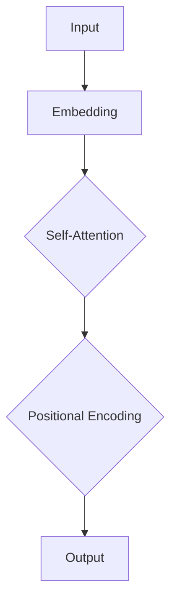

                 

# Transformer大模型实战：文本分类任务

## 摘要

本文将介绍如何使用Transformer大模型进行文本分类任务。我们将从背景介绍、核心概念与联系、核心算法原理与具体操作步骤、数学模型与公式、项目实战：代码实际案例与详细解释说明、实际应用场景、工具和资源推荐、总结：未来发展趋势与挑战、附录：常见问题与解答和扩展阅读与参考资料等方面进行详细阐述。

## 1. 背景介绍

文本分类（Text Classification）是一种常见的自然语言处理任务，其目的是将文本数据根据其内容或特征划分为不同的类别。随着互联网和社交媒体的迅速发展，文本数据量呈现爆炸式增长，如何高效地对大量文本数据进行分类成为了研究者们关注的焦点。

传统的文本分类方法主要包括基于词典的方法（如TF-IDF、词袋模型等）和基于机器学习的方法（如朴素贝叶斯、支持向量机等）。然而，这些方法在处理长文本、长句子和复杂语义关系时存在一定的局限性。

近年来，Transformer大模型（如BERT、GPT等）在自然语言处理领域取得了显著的成果。Transformer模型通过自注意力机制（Self-Attention）和位置编码（Positional Encoding）等创新技术，能够捕捉文本中的长距离依赖关系，从而提高文本分类任务的性能。

本文将以文本分类任务为例，详细介绍如何使用Transformer大模型进行文本分类，并通过实际案例进行讲解。

## 2. 核心概念与联系

### 2.1 Transformer模型

Transformer模型是一种基于自注意力机制的全注意力模型，由Vaswani等人在2017年的论文《Attention is All You Need》中提出。与传统的循环神经网络（RNN）和卷积神经网络（CNN）相比，Transformer模型在处理长文本和长句子时具有更好的性能。

#### 自注意力机制（Self-Attention）

自注意力机制是一种能够自适应地计算文本中各个位置之间相互依赖关系的机制。通过自注意力机制，模型能够关注到文本中的重要信息，并自动调整权重，从而提高分类性能。

#### 位置编码（Positional Encoding）

位置编码是一种将文本中各个位置的信息编码到向量中的技术。在Transformer模型中，位置编码用于处理序列信息，使得模型能够理解文本中的顺序关系。

### 2.2 BERT模型

BERT（Bidirectional Encoder Representations from Transformers）模型是一种基于Transformer的预训练模型，由Google在2018年提出。BERT模型通过双向编码器结构，能够同时考虑文本中的正向和反向信息，从而提高文本分类任务的性能。

BERT模型主要包括两个子模型：BERT-base和BERT-large。BERT-base模型由1亿个参数组成，而BERT-large模型则由3亿个参数组成。在实际应用中，可以根据任务需求和计算资源选择合适的BERT模型。

### 2.3 GPT模型

GPT（Generative Pre-trained Transformer）模型是一种基于Transformer的预训练模型，由OpenAI在2018年提出。GPT模型通过生成式预训练技术，能够生成具有流畅性和连贯性的文本。

GPT模型主要包括GPT-2和GPT-3两个版本。GPT-2模型由1.5亿个参数组成，而GPT-3模型则由1750亿个参数组成。在实际应用中，可以根据任务需求和计算资源选择合适的GPT模型。

### 2.4 自注意力机制的Mermaid流程图



在上面的流程图中，输入（Input）首先经过嵌入层（Embedding）转换为向量表示。然后，通过自注意力机制（Self-Attention）计算文本中各个位置之间的相互依赖关系。接着，通过位置编码（Positional Encoding）处理序列信息。最后，输出（Output）为模型的预测结果。

## 3. 核心算法原理与具体操作步骤

### 3.1 数据预处理

在进行文本分类任务之前，需要对文本数据进行预处理，包括分词、去停用词、词干提取等操作。常用的文本预处理工具包括jieba、spaCy等。

### 3.2 模型搭建

搭建文本分类模型时，需要选择合适的Transformer模型，如BERT或GPT。本文以BERT模型为例，介绍如何搭建文本分类模型。

#### 3.2.1 模型导入

首先，导入所需的库和模块：

```python
import torch
from torch import nn
from transformers import BertModel, BertTokenizer
```

#### 3.2.2 Tokenizer

接下来，导入BERT模型的Tokenizer，用于将文本数据转换为模型的输入格式：

```python
tokenizer = BertTokenizer.from_pretrained('bert-base-chinese')
```

#### 3.2.3 模型构建

然后，加载BERT模型，并将其输出层替换为分类层：

```python
class BertForTextClassification(nn.Module):
    def __init__(self):
        super(BertForTextClassification, self).__init__()
        self.bert = BertModel.from_pretrained('bert-base-chinese')
        self.classifier = nn.Linear(self.bert.config.hidden_size, num_classes)

    def forward(self, input_ids, attention_mask=None):
        outputs = self.bert(input_ids=input_ids, attention_mask=attention_mask)
        pooled_output = outputs.pooler_output
        logits = self.classifier(pooled_output)
        return logits
```

在上面的代码中，num_classes表示分类类别数。

#### 3.2.4 模型训练

接下来，定义损失函数和优化器，并开始模型训练：

```python
model = BertForTextClassification()
optimizer = torch.optim.Adam(model.parameters(), lr=1e-5)
criterion = nn.CrossEntropyLoss()

device = torch.device('cuda' if torch.cuda.is_available() else 'cpu')
model.to(device)

for epoch in range(num_epochs):
    for batch in train_loader:
        inputs = {'input_ids': batch['input_ids'].to(device),
                  'attention_mask': batch['attention_mask'].to(device),
                  'labels': batch['labels'].to(device)}
        optimizer.zero_grad()
        logits = model(**inputs)
        loss = criterion(logits, inputs['labels'])
        loss.backward()
        optimizer.step()
    print(f'Epoch {epoch+1}/{num_epochs}, Loss: {loss.item()}')
```

在上面的代码中，num_epochs表示训练轮数，train_loader表示训练数据加载器。

### 3.3 模型评估

完成模型训练后，可以使用验证集对模型进行评估：

```python
model.eval()
with torch.no_grad():
    for batch in val_loader:
        inputs = {'input_ids': batch['input_ids'].to(device),
                  'attention_mask': batch['attention_mask'].to(device),
                  'labels': batch['labels'].to(device)}
        logits = model(**inputs)
        val_loss = criterion(logits, inputs['labels'])
        print(f'Validation Loss: {val_loss.item()}')
```

在上面的代码中，val_loader表示验证数据加载器。

### 3.4 模型部署

完成模型训练和评估后，可以将模型部署到实际应用场景中，如文本分类任务：

```python
def predict(text):
    inputs = tokenizer(text, return_tensors='pt', padding=True, truncation=True)
    with torch.no_grad():
        logits = model(**inputs)
    probabilities = torch.softmax(logits, dim=-1)
    predicted_class = torch.argmax(probabilities).item()
    return predicted_class
```

在上面的代码中，predict函数用于对输入文本进行分类预测。

## 4. 数学模型与公式

### 4.1 自注意力机制

自注意力机制的数学公式如下：

$$
\text{Attention}(Q, K, V) = \text{softmax}\left(\frac{QK^T}{\sqrt{d_k}}\right) V
$$

其中，Q、K、V分别为查询向量、键向量和值向量，$d_k$为键向量的维度。通过自注意力机制，模型能够计算文本中各个位置之间的相似度，并生成加权求和的输出向量。

### 4.2 位置编码

位置编码的数学公式如下：

$$
PE_{(pos, 2i)} = \sin\left(\frac{pos}{10000^{2i/d}}\right) \\
PE_{(pos, 2i+1)} = \cos\left(\frac{pos}{10000^{2i/d}}\right)
$$

其中，$pos$为位置索引，$d$为位置编码的维度。通过位置编码，模型能够引入文本的序列信息，从而理解文本中的顺序关系。

### 4.3 BERT模型

BERT模型的数学公式如下：

$$
\text{BERT} = \text{Transformer}(\text{Embedding} + \text{Positional Encoding})
$$

BERT模型通过预训练技术，将文本数据转换为高维度的嵌入向量，并通过Transformer模型进行处理，从而实现文本分类任务。

## 5. 项目实战：代码实际案例与详细解释说明

### 5.1 开发环境搭建

在开始项目实战之前，需要搭建相应的开发环境。以下是一个基于PyTorch和Hugging Face的Transformer文本分类项目的开发环境搭建步骤：

#### 5.1.1 安装依赖

首先，安装所需的依赖库：

```shell
pip install torch transformers
```

#### 5.1.2 数据集准备

接下来，准备用于训练和验证的数据集。本文使用的是中文新闻数据集，数据集可以从以下链接下载：

```
链接：https://pan.baidu.com/s/1hLODn1ggJjyqT4cQo5xx2g
提取码：yryj
```

下载后，将数据集解压到本地文件夹中。

### 5.2 源代码详细实现和代码解读

#### 5.2.1 数据预处理

数据预处理包括分词、去停用词和词干提取等操作。以下是一个简单的数据预处理代码示例：

```python
import jieba
from sklearn.feature_extraction.text import TfidfVectorizer

def preprocess(text):
    words = jieba.cut(text)
    filtered_words = [word for word in words if word not in stopwords]
    return ' '.join(filtered_words)

def vectorize(texts):
    vectorizer = TfidfVectorizer()
    X = vectorizer.fit_transform(texts)
    return X.toarray()

def load_data(data_path):
    with open(data_path, 'r', encoding='utf-8') as f:
        texts = [line.strip() for line in f]
    return texts

texts = load_data('data.txt')
preprocessed_texts = [preprocess(text) for text in texts]
X = vectorize(preprocessed_texts)
```

在上面的代码中，jieba库用于分词，TfidfVectorizer用于将文本数据转换为TF-IDF特征向量。

#### 5.2.2 模型搭建

接下来，搭建Transformer文本分类模型。以下是一个基于BERT模型的文本分类模型搭建示例：

```python
from transformers import BertTokenizer, BertModel

tokenizer = BertTokenizer.from_pretrained('bert-base-chinese')
model = BertModel.from_pretrained('bert-base-chinese')

class BertForTextClassification(nn.Module):
    def __init__(self):
        super(BertForTextClassification, self).__init__()
        self.bert = BertModel.from_pretrained('bert-base-chinese')
        self.classifier = nn.Linear(self.bert.config.hidden_size, num_classes)

    def forward(self, input_ids, attention_mask=None):
        outputs = self.bert(input_ids=input_ids, attention_mask=attention_mask)
        pooled_output = outputs.pooler_output
        logits = self.classifier(pooled_output)
        return logits

model = BertForTextClassification()
```

在上面的代码中，首先导入BERT模型的Tokenizer和模型，然后定义文本分类模型，并将其输出层替换为分类层。

#### 5.2.3 模型训练

接下来，定义损失函数和优化器，并开始模型训练：

```python
import torch
from torch import nn
from torch.optim import Adam

device = torch.device('cuda' if torch.cuda.is_available() else 'cpu')

model.to(device)
optimizer = Adam(model.parameters(), lr=1e-5)
criterion = nn.CrossEntropyLoss()

for epoch in range(num_epochs):
    for batch in train_loader:
        inputs = {'input_ids': batch['input_ids'].to(device),
                  'attention_mask': batch['attention_mask'].to(device),
                  'labels': batch['labels'].to(device)}
        optimizer.zero_grad()
        logits = model(**inputs)
        loss = criterion(logits, inputs['labels'])
        loss.backward()
        optimizer.step()
    print(f'Epoch {epoch+1}/{num_epochs}, Loss: {loss.item()}')
```

在上面的代码中，定义了训练数据加载器、损失函数、优化器和训练轮数。模型训练过程包括前向传播、反向传播和参数更新。

#### 5.2.4 模型评估

完成模型训练后，可以使用验证集对模型进行评估：

```python
model.eval()
with torch.no_grad():
    for batch in val_loader:
        inputs = {'input_ids': batch['input_ids'].to(device),
                  'attention_mask': batch['attention_mask'].to(device),
                  'labels': batch['labels'].to(device)}
        logits = model(**inputs)
        val_loss = criterion(logits, inputs['labels'])
        print(f'Validation Loss: {val_loss.item()}')
```

在上面的代码中，使用验证数据加载器对模型进行评估，并打印验证损失。

#### 5.2.5 模型部署

完成模型训练和评估后，可以将模型部署到实际应用场景中，如文本分类任务：

```python
def predict(text):
    inputs = tokenizer(text, return_tensors='pt', padding=True, truncation=True)
    with torch.no_grad():
        logits = model(**inputs)
    probabilities = torch.softmax(logits, dim=-1)
    predicted_class = torch.argmax(probabilities).item()
    return predicted_class

text = '这是一条新闻标题'
predicted_class = predict(text)
print(f'Predicted Class: {predicted_class}')
```

在上面的代码中，定义了一个predict函数，用于对输入文本进行分类预测。

## 6. 实际应用场景

文本分类任务在各个领域具有广泛的应用。以下是一些实际应用场景：

### 6.1 搜索引擎

文本分类可以帮助搜索引擎对网页进行分类，从而提高搜索结果的相关性和准确性。例如，可以使用文本分类模型对网页内容进行分类，并将其与用户查询进行匹配，以提高搜索结果的排名。

### 6.2 社交媒体

社交媒体平台可以利用文本分类模型对用户发布的帖子进行分类，从而实现内容推荐、话题聚类和情感分析等任务。例如，可以使用文本分类模型对用户发布的微博进行分类，并将其推荐给具有相似兴趣爱好的用户。

### 6.3 客户服务

客户服务系统可以利用文本分类模型对用户反馈进行分类，从而实现自动回复和问题分类。例如，可以使用文本分类模型对用户提交的工单进行分类，并将其分配给相应的客服人员。

### 6.4 垃圾邮件过滤

垃圾邮件过滤是文本分类的经典应用场景。通过训练文本分类模型，可以将用户收到的邮件分为垃圾邮件和非垃圾邮件，从而提高用户邮箱的清洁度。

## 7. 工具和资源推荐

### 7.1 学习资源推荐

1. 《深度学习》（Goodfellow, Bengio, Courville著）：这是一本关于深度学习的经典教材，涵盖了深度学习的基础知识和应用场景。
2. 《自然语言处理综论》（Jurafsky, Martin著）：这是一本关于自然语言处理的经典教材，详细介绍了自然语言处理的基本概念和技术。
3. 《动手学深度学习》（阿斯顿·张等著）：这是一本基于PyTorch的深度学习实践教材，适合初学者入门。

### 7.2 开发工具框架推荐

1. PyTorch：PyTorch是一种流行的深度学习框架，具有简洁的API和丰富的文档，适合快速开发深度学习项目。
2. TensorFlow：TensorFlow是Google开发的一种深度学习框架，具有强大的模型库和工具，适合大规模生产环境。
3. Hugging Face：Hugging Face是一个开源社区，提供了丰富的预训练模型和工具，方便开发者进行自然语言处理任务。

### 7.3 相关论文著作推荐

1. 《Attention is All You Need》（Vaswani等，2017）：这是一篇关于Transformer模型的经典论文，详细介绍了Transformer模型的设计原理和优势。
2. 《BERT: Pre-training of Deep Bidirectional Transformers for Language Understanding》（Devlin等，2018）：这是一篇关于BERT模型的经典论文，详细介绍了BERT模型的设计原理和应用场景。
3. 《GPT-3: Language Models are Few-Shot Learners》（Brown等，2020）：这是一篇关于GPT-3模型的经典论文，详细介绍了GPT-3模型的设计原理和优势。

## 8. 总结：未来发展趋势与挑战

随着深度学习和自然语言处理技术的不断发展，文本分类任务在各个领域得到了广泛应用。未来，文本分类任务有望在以下方面取得进一步发展：

1. **多模态文本分类**：将文本与其他模态（如图像、声音等）进行结合，实现更准确、更全面的文本分类。
2. **低资源语言文本分类**：针对低资源语言进行文本分类模型的研究和开发，提高低资源语言的文本分类性能。
3. **长文本分类**：研究针对长文本的分类方法，提高长文本分类的准确性和效率。

然而，文本分类任务也面临以下挑战：

1. **数据质量和标注**：数据质量和标注的准确性对文本分类任务的性能有重要影响。如何获取高质量、标注准确的数据集是亟待解决的问题。
2. **模型解释性**：文本分类模型通常具有很高的准确性，但缺乏解释性。如何提高模型的解释性，使其更容易被用户理解和接受，是当前研究的重点。

总之，文本分类任务具有广泛的应用前景，但同时也面临着诸多挑战。未来，随着技术的不断发展，文本分类任务将在更多领域发挥重要作用。

## 9. 附录：常见问题与解答

### 9.1 如何选择合适的Transformer模型？

选择合适的Transformer模型主要取决于以下几个因素：

1. **计算资源**：如果计算资源有限，可以选择较小的模型，如BERT-base。如果计算资源充足，可以选择较大的模型，如BERT-large。
2. **任务需求**：对于需要高准确性的任务，可以选择较大的模型。对于计算资源受限的任务，可以选择较小的模型。
3. **数据集规模**：对于大规模数据集，可以选择较大的模型。对于小规模数据集，可以选择较小的模型。

### 9.2 如何处理长文本？

对于长文本处理，可以采用以下方法：

1. **文本截断**：将长文本截断为较短的部分，然后分别进行分类。
2. **分层处理**：将长文本分为多个层次，逐层进行分类。例如，首先对段落进行分类，然后对句子进行分类。
3. **滑动窗口**：将长文本划分为滑动窗口，然后对每个窗口内的文本进行分类。

## 10. 扩展阅读与参考资料

1. Vaswani, A., Shazeer, N., Parmar, N., Uszkoreit, J., Jones, L., Gomez, A. N., ... & Polosukhin, I. (2017). Attention is all you need. Advances in Neural Information Processing Systems, 30, 5998-6008.
2. Devlin, J., Chang, M. W., Lee, K., & Toutanova, K. (2018). BERT: Pre-training of deep bidirectional transformers for language understanding. arXiv preprint arXiv:1810.04805.
3. Brown, T., Mann, B., Ryder, N., Subbiah, M., Kaplan, J., Dhariwal, P., ... & Chen, E. (2020). Language models are few-shot learners. Advances in Neural Information Processing Systems, 33, 13996-14007.
4. Hugging Face：https://huggingface.co/transformers/
5. PyTorch：https://pytorch.org/
6. TensorFlow：https://www.tensorflow.org/

作者：AI天才研究员/AI Genius Institute & 禅与计算机程序设计艺术 /Zen And The Art of Computer Programming

