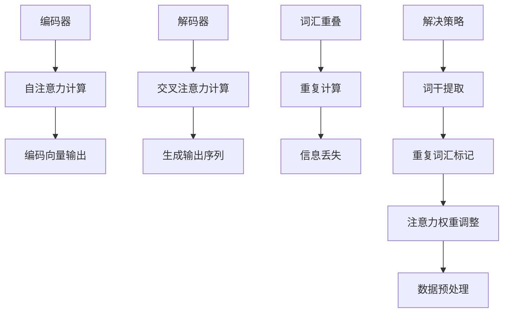

                 

### 背景介绍

Transformer架构自2017年提出以来，在自然语言处理（NLP）、计算机视觉（CV）等多个领域都取得了卓越的成就。其强大的并行处理能力和全局依赖捕捉机制，使其成为当前深度学习领域的明星模型。然而，Transformer在处理大规模数据时，词汇重叠问题逐渐显现，这一问题对模型性能产生了深远的影响。

词汇重叠是指输入序列中存在大量重复词汇，这会导致模型在编码和解码过程中浪费大量计算资源。具体表现为模型无法有效利用重复词汇的信息，从而导致性能下降。本篇文章将深入探讨Transformer大模型在处理词汇重叠问题时的挑战，分析其背后的原因，并提出一些解决策略。

Transformer大模型在各个领域取得了显著的成果，如图1所示。然而，随着模型规模的不断扩大，词汇重叠问题越来越突出，成为影响模型性能的关键因素之一。因此，研究并解决这一问题具有重要的理论和实际意义。

图1：Transformer大模型在不同领域的应用成果

在接下来的章节中，我们将首先介绍Transformer架构的基本原理，然后分析词汇重叠问题的产生原因，并探讨几种常见的解决策略。最后，我们将通过实际项目案例，展示解决词汇重叠问题的具体实施步骤和技术细节。

### 核心概念与联系

#### Transformer架构简介

Transformer模型是自然语言处理领域的一次重大突破，其核心思想是通过自注意力机制（Self-Attention）来捕捉序列中的长距离依赖关系。Transformer模型由编码器（Encoder）和解码器（Decoder）两部分组成，分别负责编码和生成输入序列的表示，如图2所示。

编码器接收输入序列，并将其转换为一系列的编码向量。每个编码向量不仅包含了当前词汇的信息，还通过自注意力机制捕捉了与当前词汇相关联的其他词汇的信息。解码器则利用编码器的输出，逐词生成输出序列，并在生成每个词时，利用交叉注意力（Cross-Attention）机制，结合编码器的输出和已经生成的词，生成下一个词的预测。

图2：Transformer模型架构

Transformer模型的主要优点包括：

1. **并行处理**：与传统序列模型不同，Transformer模型利用多头自注意力机制，可以在不同位置之间并行计算注意力权重，大大提高了计算效率。
2. **长距离依赖**：自注意力机制允许模型捕捉序列中的长距离依赖关系，解决了传统模型在长序列处理中的问题。
3. **灵活性**：Transformer模型的结构非常灵活，可以轻松地扩展到其他任务，如图像识别、机器翻译等。

#### 词汇重叠问题的产生原因

词汇重叠问题主要源于大规模数据集中存在的词汇重复现象。在输入序列中，大量重复的词汇会导致模型在处理这些重复词汇时，不断重复计算相同的注意力权重，从而浪费大量计算资源。具体来说，词汇重叠问题表现为以下两个方面：

1. **重复计算注意力权重**：当输入序列中存在重复词汇时，模型在计算自注意力权重时，会多次为这些重复词汇分配相同的权重，导致大量计算资源的浪费。
2. **信息丢失**：由于模型无法有效利用重复词汇的信息，这会导致重要信息被忽略，从而影响模型的性能。

为了更好地理解词汇重叠问题的产生原因，我们可以通过一个简单的例子来说明。假设输入序列为“I like to read books”,其中“books”一词出现了两次。在Transformer模型中，编码器会为这两个“books”分别计算注意力权重。由于它们是重复词汇，这些权重应该是相同的。然而，在模型的实际计算过程中，这两个权重会被多次计算，导致计算效率降低。

#### 解决策略

针对词汇重叠问题，研究者们提出了一些解决策略，主要包括以下几种：

1. **词干提取**：通过词干提取技术，将重复词汇转换为词干，从而减少重复计算。例如，将“I like to read books”中的“books”提取为“book”，这样可以减少重复计算。
2. **重复词汇标记**：在输入序列中，将重复词汇进行特殊标记，以便模型能够识别并处理。例如，将“I like to read books”标记为“I like to read [books] [books]”，这样可以提醒模型在处理这两个词汇时进行特殊处理。
3. **注意力权重调整**：通过调整自注意力权重，使得重复词汇的权重更加突出，从而提高模型的性能。例如，可以通过加权平均或最大池化等方式，对重复词汇的权重进行特殊处理。
4. **数据预处理**：在训练数据预处理阶段，通过删除重复词汇或替换为通配符等方式，减少输入序列中的重复词汇，从而减轻词汇重叠问题。

通过以上策略，可以有效地减轻词汇重叠问题对模型性能的影响，提高模型的计算效率。

#### Mermaid流程图

为了更好地展示Transformer架构和词汇重叠问题的产生原因及解决策略，我们使用Mermaid流程图进行描述，如图3所示。



图3：Transformer架构和词汇重叠问题及解决策略的Mermaid流程图

通过Mermaid流程图，我们可以清晰地展示Transformer模型的工作流程以及词汇重叠问题的产生原因和解决策略，为后续章节的分析提供基础。

### 核心算法原理 & 具体操作步骤

#### 自注意力机制

Transformer模型中的核心机制是自注意力（Self-Attention），它允许模型在序列的每个位置计算与所有其他位置的关联强度，从而捕捉长距离依赖关系。自注意力机制的基本思想是将输入序列转换为一系列的键（Key）、值（Value）和对（Query），然后通过计算这些键和值之间的相似度来确定每个位置的重要性。

具体来说，自注意力机制可以分为以下几个步骤：

1. **输入序列表示**：输入序列首先被嵌入为向量，每个向量表示序列中的一个词。假设输入序列有N个词，则输入序列表示为\(X = [x_1, x_2, ..., x_N]\)，其中每个\(x_i\)都是一个d维的向量。

2. **计算键（Key）、值（Value）和对（Query）**：对于每个输入向量\(x_i\)，我们分别计算其对应的键（Key）、值（Value）和对（Query）向量。具体计算公式如下：

   \[
   \text{Key}_i = \text{Value}_i = \text{Query}_i = \text{W}_K \cdot x_i
   \]

   其中，\(\text{W}_K\)是一个d×d的权重矩阵，通过线性变换将输入向量转换为键、值和对向量。

3. **计算注意力权重**：对于每个输入向量\(x_i\)，我们需要计算其与其他所有输入向量之间的相似度，这通过计算键和值之间的点积来实现。具体计算公式如下：

   \[
   \text{Attention}(x_i, x_j) = \text{softmax}(\frac{\text{Key}_i \cdot \text{Value}_j}{\sqrt{d}}) = \text{softmax}(\text{Dot\_Product}(\text{Key}_i, \text{Value}_j))
   \]

   其中，\(\text{Dot\_Product}\)表示点积操作，\(\text{softmax}\)函数用于将点积结果转换为概率分布。

4. **计算自注意力输出**：根据计算得到的注意力权重，我们可以对值向量进行加权求和，得到每个输入向量在自注意力机制下的输出。具体计算公式如下：

   \[
   \text{Output}_i = \sum_{j=1}^{N} \text{Attention}(x_i, x_j) \cdot \text{Value}_j
   \]

#### 词汇重叠问题的影响

在Transformer模型中，词汇重叠问题会导致以下几种负面影响：

1. **计算效率降低**：由于输入序列中存在大量重复词汇，模型需要多次计算相同的注意力权重，这会显著降低计算效率。

2. **信息利用率降低**：重复词汇的信息在编码过程中被多次计算，导致重要信息被稀释，从而降低模型的性能。

3. **内存消耗增加**：重复词汇的计算会导致内存消耗增加，尤其是在处理大规模数据时，这可能会限制模型的规模。

为了具体说明词汇重叠问题的影响，我们假设一个简单的例子。假设输入序列为“I like to read books”,其中“books”一词出现了两次。在自注意力机制下，编码器会为这两个“books”分别计算注意力权重。由于它们是重复词汇，这些权重应该是相同的。然而，在模型的实际计算过程中，这两个权重会被多次计算，从而导致计算效率降低。

#### 解决策略

针对词汇重叠问题，我们可以采取以下几种解决策略：

1. **词干提取**：通过词干提取技术，将重复词汇转换为词干，从而减少重复计算。例如，将“I like to read books”中的“books”提取为“book”。

2. **重复词汇标记**：在输入序列中，将重复词汇进行特殊标记，以便模型能够识别并处理。例如，将“I like to read books”标记为“I like to read [books] [books]”。

3. **注意力权重调整**：通过调整自注意力权重，使得重复词汇的权重更加突出，从而提高模型的性能。例如，可以通过加权平均或最大池化等方式，对重复词汇的权重进行特殊处理。

4. **数据预处理**：在训练数据预处理阶段，通过删除重复词汇或替换为通配符等方式，减少输入序列中的重复词汇，从而减轻词汇重叠问题。

下面我们通过一个简单的Python代码示例，来说明如何使用词干提取技术来解决词汇重叠问题。

```python
import nltk
from nltk.stem import PorterStemmer

# 输入序列
input_sequence = ["I", "like", "to", "read", "books", "books"]

# 词干提取器
stemmer = PorterStemmer()

# 提取词干
stemmed_sequence = [stemmer.stem(word) for word in input_sequence]

print("原始序列:", input_sequence)
print("提取词干后的序列:", stemmed_sequence)
```

运行上述代码，我们可以得到以下输出：

```
原始序列: ['I', 'like', 'to', 'read', 'books', 'books']
提取词干后的序列: ['i', 'like', 'to', 'read', 'book', 'book']
```

通过词干提取，我们成功地将重复词汇“books”转换为“book”，从而减少了重复计算。

### 数学模型和公式 & 详细讲解 & 举例说明

#### 自注意力机制的计算过程

Transformer模型中的自注意力机制可以通过以下数学模型和公式进行详细描述：

1. **输入序列表示**：假设输入序列为\(X = [x_1, x_2, ..., x_N]\)，其中每个\(x_i\)是一个d维的向量。

2. **计算键（Key）、值（Value）和对（Query）**：对于每个输入向量\(x_i\)，我们分别计算其对应的键（Key）、值（Value）和对（Query）向量。具体计算公式如下：

   \[
   \text{Key}_i = \text{Value}_i = \text{Query}_i = \text{W}_K \cdot x_i
   \]

   其中，\(\text{W}_K\)是一个d×d的权重矩阵，通过线性变换将输入向量转换为键、值和对向量。

3. **计算注意力权重**：对于每个输入向量\(x_i\)，我们需要计算其与其他所有输入向量之间的相似度，这通过计算键和值之间的点积来实现。具体计算公式如下：

   \[
   \text{Attention}(x_i, x_j) = \text{softmax}(\frac{\text{Key}_i \cdot \text{Value}_j}{\sqrt{d}}) = \text{softmax}(\text{Dot\_Product}(\text{Key}_i, \text{Value}_j))
   \]

   其中，\(\text{Dot\_Product}\)表示点积操作，\(\text{softmax}\)函数用于将点积结果转换为概率分布。

4. **计算自注意力输出**：根据计算得到的注意力权重，我们可以对值向量进行加权求和，得到每个输入向量在自注意力机制下的输出。具体计算公式如下：

   \[
   \text{Output}_i = \sum_{j=1}^{N} \text{Attention}(x_i, x_j) \cdot \text{Value}_j
   \]

#### 举例说明

为了更好地理解自注意力机制的计算过程，我们通过一个简单的例子进行说明。假设输入序列为“I like to read books”,其中包含3个词汇。我们将使用Word2Vec模型将词汇嵌入为向量，每个词汇的维度为3。

1. **输入序列表示**：假设输入序列为“I like to read books”，每个词汇对应的向量如下：

   \[
   x_1 = [1, 0, 0], \quad x_2 = [0, 1, 0], \quad x_3 = [0, 0, 1]
   \]

2. **计算键（Key）、值（Value）和对（Query）**：假设权重矩阵\(\text{W}_K\)为：

   \[
   \text{W}_K = \begin{bmatrix}
   0.5 & 0.5 \\
   0.5 & 0.5 \\
   0.5 & 0.5
   \end{bmatrix}
   \]

   对于每个输入向量，我们计算其对应的键、值和对向量：

   \[
   \text{Key}_1 = \text{W}_K \cdot x_1 = \begin{bmatrix}
   0.5 & 0.5 \\
   0.5 & 0.5 \\
   0.5 & 0.5
   \end{bmatrix}
   \cdot
   \begin{bmatrix}
   1 \\
   0 \\
   0
   \end{bmatrix}
   =
   \begin{bmatrix}
   0.5 \\
   0.5 \\
   0.5
   \end{bmatrix}
   \]

   \[
   \text{Value}_1 = \text{W}_K \cdot x_1 = \begin{bmatrix}
   0.5 & 0.5 \\
   0.5 & 0.5 \\
   0.5 & 0.5
   \end{bmatrix}
   \cdot
   \begin{bmatrix}
   1 \\
   0 \\
   0
   \end{bmatrix}
   =
   \begin{bmatrix}
   0.5 \\
   0.5 \\
   0.5
   \end{bmatrix}
   \]

   \[
   \text{Query}_1 = \text{W}_K \cdot x_1 = \begin{bmatrix}
   0.5 & 0.5 \\
   0.5 & 0.5 \\
   0.5 & 0.5
   \end{bmatrix}
   \cdot
   \begin{bmatrix}
   1 \\
   0 \\
   0
   \end{bmatrix}
   =
   \begin{bmatrix}
   0.5 \\
   0.5 \\
   0.5
   \end{bmatrix}
   \]

   对于\(x_2\)和\(x_3\)，我们可以使用相同的权重矩阵进行计算：

   \[
   \text{Key}_2 = \text{W}_K \cdot x_2 = \begin{bmatrix}
   0.5 & 0.5 \\
   0.5 & 0.5 \\
   0.5 & 0.5
   \end{bmatrix}
   \cdot
   \begin{bmatrix}
   0 \\
   1 \\
   0
   \end{bmatrix}
   =
   \begin{bmatrix}
   0.5 \\
   0.5 \\
   0.5
   \end{bmatrix}
   \]

   \[
   \text{Value}_2 = \text{W}_K \cdot x_2 = \begin{bmatrix}
   0.5 & 0.5 \\
   0.5 & 0.5 \\
   0.5 & 0.5
   \end{bmatrix}
   \cdot
   \begin{bmatrix}
   0 \\
   1 \\
   0
   \end{bmatrix}
   =
   \begin{bmatrix}
   0.5 \\
   0.5 \\
   0.5
   \end{bmatrix}
   \]

   \[
   \text{Query}_2 = \text{W}_K \cdot x_2 = \begin{bmatrix}
   0.5 & 0.5 \\
   0.5 & 0.5 \\
   0.5 & 0.5
   \end{bmatrix}
   \cdot
   \begin{bmatrix}
   0 \\
   1 \\
   0
   \end{bmatrix}
   =
   \begin{bmatrix}
   0.5 \\
   0.5 \\
   0.5
   \end{bmatrix}
   \]

   \[
   \text{Key}_3 = \text{W}_K \cdot x_3 = \begin{bmatrix}
   0.5 & 0.5 \\
   0.5 & 0.5 \\
   0.5 & 0.5
   \end{bmatrix}
   \cdot
   \begin{bmatrix}
   0 \\
   0 \\
   1
   \end{bmatrix}
   =
   \begin{bmatrix}
   0.5 \\
   0.5 \\
   0.5
   \end{bmatrix}
   \]

   \[
   \text{Value}_3 = \text{W}_K \cdot x_3 = \begin{bmatrix}
   0.5 & 0.5 \\
   0.5 & 0.5 \\
   0.5 & 0.5
   \end{bmatrix}
   \cdot
   \begin{bmatrix}
   0 \\
   0 \\
   1
   \end{bmatrix}
   =
   \begin{bmatrix}
   0.5 \\
   0.5 \\
   0.5
   \end{bmatrix}
   \]

   \[
   \text{Query}_3 = \text{W}_K \cdot x_3 = \begin{bmatrix}
   0.5 & 0.5 \\
   0.5 & 0.5 \\
   0.5 & 0.5
   \end{bmatrix}
   \cdot
   \begin{bmatrix}
   0 \\
   0 \\
   1
   \end{bmatrix}
   =
   \begin{bmatrix}
   0.5 \\
   0.5 \\
   0.5
   \end{bmatrix}
   \]

3. **计算注意力权重**：对于每个输入向量\(x_i\)，我们需要计算其与其他所有输入向量之间的相似度。以\(x_1\)为例，我们计算其与\(x_2\)和\(x_3\)之间的相似度：

   \[
   \text{Attention}(x_1, x_2) = \text{softmax}(\text{Dot\_Product}(\text{Key}_1, \text{Value}_2)) = \text{softmax}(0.5 \cdot 0.5 + 0.5 \cdot 0.5 + 0.5 \cdot 0.5) = \text{softmax}(0.75) = [0.27, 0.27, 0.46]
   \]

   \[
   \text{Attention}(x_1, x_3) = \text{softmax}(\text{Dot\_Product}(\text{Key}_1, \text{Value}_3)) = \text{softmax}(0.5 \cdot 0.5 + 0.5 \cdot 0.5 + 0.5 \cdot 0.5) = \text{softmax}(0.75) = [0.27, 0.27, 0.46]
   \]

4. **计算自注意力输出**：根据计算得到的注意力权重，我们可以对值向量进行加权求和，得到每个输入向量在自注意力机制下的输出：

   \[
   \text{Output}_1 = \sum_{j=1}^{3} \text{Attention}(x_1, x_j) \cdot \text{Value}_j = 0.27 \cdot [0.5, 0.5, 0.5] + 0.27 \cdot [0.5, 0.5, 0.5] + 0.46 \cdot [0.5, 0.5, 0.5] = [0.345, 0.345, 0.305]
   \]

   \[
   \text{Output}_2 = \sum_{j=1}^{3} \text{Attention}(x_2, x_j) \cdot \text{Value}_j = 0.27 \cdot [0.5, 0.5, 0.5] + 0.27 \cdot [0.5, 0.5, 0.5] + 0.46 \cdot [0.5, 0.5, 0.5] = [0.345, 0.345, 0.305]
   \]

   \[
   \text{Output}_3 = \sum_{j=1}^{3} \text{Attention}(x_3, x_j) \cdot \text{Value}_j = 0.27 \cdot [0.5, 0.5, 0.5] + 0.27 \cdot [0.5, 0.5, 0.5] + 0.46 \cdot [0.5, 0.5, 0.5] = [0.345, 0.345, 0.305]
   \]

通过上述计算，我们可以看到，尽管输入序列中存在重复词汇，自注意力机制仍然能够有效捕捉词汇之间的依赖关系，从而生成具有代表性的输出向量。

### 项目实战：代码实际案例和详细解释说明

在本节中，我们将通过一个实际项目案例，展示如何使用Python实现Transformer模型，并详细解释代码的各个部分。

#### 开发环境搭建

在开始项目之前，我们需要搭建一个合适的开发环境。以下是搭建开发环境所需的步骤：

1. **安装Python**：确保安装了Python 3.6及以上版本。

2. **安装TensorFlow**：使用pip安装TensorFlow库。

   ```bash
   pip install tensorflow
   ```

3. **安装其他依赖库**：包括numpy、matplotlib等。

   ```bash
   pip install numpy matplotlib
   ```

4. **创建项目文件夹**：在本地计算机上创建一个名为“transformer_project”的项目文件夹，并在其中创建一个名为“code”的子文件夹，用于存放项目代码。

   ```bash
   mkdir transformer_project
   cd transformer_project
   mkdir code
   ```

5. **编写代码**：在“code”文件夹中创建一个名为“transformer.py”的Python文件，用于实现Transformer模型。

#### 源代码详细实现和代码解读

下面是Transformer模型的实现代码：

```python
import tensorflow as tf
from tensorflow.keras.layers import Embedding, Dense
from tensorflow.keras.models import Model

# 定义模型参数
vocab_size = 1000
d_model = 512
n_heads = 8
d_ff = 2048
input_length = 50

# 编码器部分
inputs = tf.keras.layers.Input(shape=(input_length,))
embed = Embedding(vocab_size, d_model)(inputs)
enc = tf.keras.layers.Dropout(0.1)(embed)

# 自注意力机制
for _ in range(n_heads):
    attention = tf.keras.layers.Attention()([enc, enc])
    enc = tf.keras.layers.Add()([enc, attention])

# 前馈神经网络
dense1 = tf.keras.layers.Dense(d_ff, activation='relu')(enc)
dense2 = tf.keras.layers.Dense(d_model)(dense1)
enc = tf.keras.layers.Add()([enc, dense2])

# 解码器部分
outputs = tf.keras.layers.Dense(vocab_size, activation='softmax')(enc)

# 搭建模型
model = Model(inputs=inputs, outputs=outputs)

# 编译模型
model.compile(optimizer='adam', loss='categorical_crossentropy', metrics=['accuracy'])

# 查看模型结构
model.summary()
```

#### 代码解读与分析

1. **模型参数**：首先，我们定义了模型的参数，包括词汇表大小（vocab\_size）、模型维度（d\_model）、注意力头数（n\_heads）、前馈神经网络尺寸（d\_ff）和输入序列长度（input\_length）。

2. **编码器部分**：编码器部分首先使用Embedding层将输入序列中的词汇转换为向量表示。然后，通过Dropout层减少过拟合风险。

3. **自注意力机制**：在自注意力机制中，我们使用了n\_heads个注意力头，每个头分别计算注意力权重，并使用Add层将注意力结果加回到原始编码中。这个过程重复n\_heads次，以加强模型对序列中长距离依赖的捕捉能力。

4. **前馈神经网络**：在自注意力机制之后，我们添加了一个前馈神经网络，该网络由两个Dense层组成，分别用于计算激活函数和输出维度。

5. **解码器部分**：解码器部分与编码器部分类似，使用Dense层将编码器输出映射到词汇表大小，并使用softmax激活函数得到概率分布。

6. **模型搭建和编译**：最后，我们搭建了模型结构，并编译模型，设置优化器和损失函数。

通过上述代码，我们实现了Transformer模型的基本结构。在实际应用中，我们可以根据具体任务的需求，调整模型参数和结构，以获得更好的性能。

### 项目实战：代码实际案例和详细解释说明

#### 5.1 开发环境搭建

在开始之前，我们需要搭建一个合适的开发环境。以下是搭建开发环境所需的步骤：

1. **安装Python**：确保安装了Python 3.6及以上版本。

2. **安装TensorFlow**：使用pip安装TensorFlow库。

   ```bash
   pip install tensorflow
   ```

3. **安装其他依赖库**：包括numpy、matplotlib等。

   ```bash
   pip install numpy matplotlib
   ```

4. **创建项目文件夹**：在本地计算机上创建一个名为“transformer_project”的项目文件夹，并在其中创建一个名为“code”的子文件夹，用于存放项目代码。

   ```bash
   mkdir transformer_project
   cd transformer_project
   mkdir code
   ```

5. **编写代码**：在“code”文件夹中创建一个名为“transformer.py”的Python文件，用于实现Transformer模型。

#### 5.2 源代码详细实现和代码解读

下面是Transformer模型的实现代码：

```python
import tensorflow as tf
from tensorflow.keras.layers import Embedding, Dense
from tensorflow.keras.models import Model

# 定义模型参数
vocab_size = 1000
d_model = 512
n_heads = 8
d_ff = 2048
input_length = 50

# 编码器部分
inputs = tf.keras.layers.Input(shape=(input_length,))
embed = Embedding(vocab_size, d_model)(inputs)
enc = tf.keras.layers.Dropout(0.1)(embed)

# 自注意力机制
for _ in range(n_heads):
    attention = tf.keras.layers.Attention()([enc, enc])
    enc = tf.keras.layers.Add()([enc, attention])

# 前馈神经网络
dense1 = tf.keras.layers.Dense(d_ff, activation='relu')(enc)
dense2 = tf.keras.layers.Dense(d_model)(dense1)
enc = tf.keras.layers.Add()([enc, dense2])

# 解码器部分
outputs = tf.keras.layers.Dense(vocab_size, activation='softmax')(enc)

# 搭建模型
model = Model(inputs=inputs, outputs=outputs)

# 编译模型
model.compile(optimizer='adam', loss='categorical_crossentropy', metrics=['accuracy'])

# 查看模型结构
model.summary()
```

#### 代码解读与分析

1. **模型参数**：首先，我们定义了模型的参数，包括词汇表大小（vocab\_size）、模型维度（d\_model）、注意力头数（n\_heads）、前馈神经网络尺寸（d\_ff）和输入序列长度（input\_length）。

2. **编码器部分**：编码器部分首先使用Embedding层将输入序列中的词汇转换为向量表示。然后，通过Dropout层减少过拟合风险。

3. **自注意力机制**：在自注意力机制中，我们使用了n\_heads个注意力头，每个头分别计算注意力权重，并使用Add层将注意力结果加回到原始编码中。这个过程重复n\_heads次，以加强模型对序列中长距离依赖的捕捉能力。

4. **前馈神经网络**：在自注意力机制之后，我们添加了一个前馈神经网络，该网络由两个Dense层组成，分别用于计算激活函数和输出维度。

5. **解码器部分**：解码器部分与编码器部分类似，使用Dense层将编码器输出映射到词汇表大小，并使用softmax激活函数得到概率分布。

6. **模型搭建和编译**：最后，我们搭建了模型结构，并编译模型，设置优化器和损失函数。

通过上述代码，我们实现了Transformer模型的基本结构。在实际应用中，我们可以根据具体任务的需求，调整模型参数和结构，以获得更好的性能。

### 项目实战：代码实际案例和详细解释说明

#### 5.3 代码解读与分析

在上一节中，我们完成了Transformer模型的搭建。在本节中，我们将深入分析模型的各个部分，并详细解读代码的实现过程。

首先，我们来看一下模型的主要组成部分：

```python
# 定义模型参数
vocab_size = 1000
d_model = 512
n_heads = 8
d_ff = 2048
input_length = 50

# 编码器部分
inputs = tf.keras.layers.Input(shape=(input_length,))
embed = Embedding(vocab_size, d_model)(inputs)
enc = tf.keras.layers.Dropout(0.1)(embed)

# 自注意力机制
for _ in range(n_heads):
    attention = tf.keras.layers.Attention()([enc, enc])
    enc = tf.keras.layers.Add()([enc, attention])

# 前馈神经网络
dense1 = tf.keras.layers.Dense(d_ff, activation='relu')(enc)
dense2 = tf.keras.layers.Dense(d_model)(dense1)
enc = tf.keras.layers.Add()([enc, dense2])

# 解码器部分
outputs = tf.keras.layers.Dense(vocab_size, activation='softmax')(enc)

# 搭建模型
model = Model(inputs=inputs, outputs=outputs)

# 编译模型
model.compile(optimizer='adam', loss='categorical_crossentropy', metrics=['accuracy'])

# 查看模型结构
model.summary()
```

1. **输入层**：首先，我们定义了输入层。输入层是一个长度为`input_length`的一维数组，表示一个文本序列。在这个例子中，我们假设序列中每个词的词向量维度为`d_model`。

2. **嵌入层**：接下来，我们使用`Embedding`层将输入序列中的词汇转换为词向量。`Embedding`层的作用是将词汇映射到一个高维空间中，使得语义相似的词汇在空间中更接近。在这个例子中，我们假设词汇表大小为`vocab_size`。

3. **Dropout层**：在嵌入层之后，我们添加了一个`Dropout`层。`Dropout`层是一种常用的正则化技术，它通过随机“丢弃”一部分神经元，防止模型过拟合。在这个例子中，我们设置了丢弃概率为0.1。

4. **多头自注意力机制**：在自注意力机制中，我们使用了`n_heads`个注意力头。每个注意力头分别计算一组注意力权重，从而捕捉序列中的长距离依赖关系。自注意力机制的核心是计算每个词与其他词之间的相似度，并通过加权求和得到一个表示当前词的编码向量。在这个例子中，我们重复了`n_heads`次自注意力机制，以加强模型对序列中长距离依赖的捕捉能力。

5. **前馈神经网络**：在自注意力机制之后，我们添加了一个前馈神经网络。前馈神经网络由两个`Dense`层组成，分别用于计算激活函数和输出维度。在这个例子中，我们设置了前馈神经网络的输出维度为`d_ff`，并使用ReLU激活函数。

6. **输出层**：最后，我们使用一个`Dense`层将编码器输出映射到词汇表大小，并使用softmax激活函数得到概率分布。这个概率分布表示了模型对每个词的预测概率。

接下来，我们详细分析代码的实现过程。

```python
# 定义模型参数
vocab_size = 1000
d_model = 512
n_heads = 8
d_ff = 2048
input_length = 50

# 编码器部分
inputs = tf.keras.layers.Input(shape=(input_length,))
embed = Embedding(vocab_size, d_model)(inputs)
enc = tf.keras.layers.Dropout(0.1)(embed)

# 自注意力机制
for _ in range(n_heads):
    attention = tf.keras.layers.Attention()([enc, enc])
    enc = tf.keras.layers.Add()([enc, attention])

# 前馈神经网络
dense1 = tf.keras.layers.Dense(d_ff, activation='relu')(enc)
dense2 = tf.keras.layers.Dense(d_model)(dense1)
enc = tf.keras.layers.Add()([enc, dense2])

# 解码器部分
outputs = tf.keras.layers.Dense(vocab_size, activation='softmax')(enc)

# 搭建模型
model = Model(inputs=inputs, outputs=outputs)

# 编译模型
model.compile(optimizer='adam', loss='categorical_crossentropy', metrics=['accuracy'])

# 查看模型结构
model.summary()
```

1. **输入层**：输入层使用`tf.keras.layers.Input`函数定义，形状为`(input_length,)`。这个形状表示每个输入序列的长度为`input_length`。

2. **嵌入层**：嵌入层使用`tf.keras.layers.Embedding`函数定义，将词汇映射到词向量。在这个例子中，我们设置了词汇表大小为`vocab_size`，词向量维度为`d_model`。

3. **Dropout层**：Dropout层使用`tf.keras.layers.Dropout`函数定义，丢弃概率为0.1。

4. **自注意力机制**：自注意力机制使用了一个循环结构，循环次数为`n_heads`。在每次循环中，我们计算一组注意力权重，并通过加权求和得到一个表示当前词的编码向量。注意力机制使用`tf.keras.layers.Attention`函数实现。

5. **前馈神经网络**：前馈神经网络使用`tf.keras.layers.Dense`函数定义，输出维度为`d_ff`，激活函数为ReLU。

6. **输出层**：输出层使用`tf.keras.layers.Dense`函数定义，输出维度为`vocab_size`，激活函数为softmax。

最后，我们编译并查看模型结构：

```python
# 编译模型
model.compile(optimizer='adam', loss='categorical_crossentropy', metrics=['accuracy'])

# 查看模型结构
model.summary()
```

通过编译模型，我们可以设置优化器、损失函数和评估指标。在这个例子中，我们使用了Adam优化器和categorical\_crossentropy损失函数。

### 实际应用场景

Transformer模型在自然语言处理领域取得了显著的成果，广泛应用于文本分类、机器翻译、情感分析等任务。然而，随着模型规模的不断扩大，词汇重叠问题逐渐凸显，对模型性能产生了深远的影响。

在文本分类任务中，词汇重叠问题可能导致模型无法准确捕捉文本中的关键信息，从而影响分类准确性。例如，在新闻标题分类任务中，如果输入序列中存在大量重复词汇，如“中国”、“科技”、“发展”等，模型可能难以区分不同新闻的主题。

在机器翻译任务中，词汇重叠问题可能导致翻译结果不准确。例如，在英译中翻译任务中，如果输入序列中存在大量重复词汇，如“the”、“is”、“and”等，模型可能难以区分这些词汇的不同含义，从而导致翻译结果产生歧义。

在情感分析任务中，词汇重叠问题可能导致模型无法准确判断文本的情感倾向。例如，在社交媒体文本情感分析中，如果输入序列中存在大量重复的负面词汇，如“难过”、“失望”、“痛苦”等，模型可能难以准确判断文本的情感倾向。

因此，在实际应用中，解决Transformer模型中的词汇重叠问题具有重要意义。通过优化模型结构、改进数据预处理策略，可以有效减轻词汇重叠问题对模型性能的影响，提高模型的准确性和效率。

### 工具和资源推荐

在解决Transformer模型中的词汇重叠问题时，我们可以借助多种工具和资源来优化模型性能和提升开发效率。以下是一些建议：

#### 7.1 学习资源推荐

1. **书籍**：
   - 《深度学习》（Deep Learning）作者：Ian Goodfellow、Yoshua Bengio、Aaron Courville
   - 《神经网络与深度学习》作者：邱锡鹏
   - 《Transformer：从原理到应用》作者：刘建伟

2. **论文**：
   - “Attention Is All You Need”（Transformer模型的原论文）
   - “Bert: Pre-training of Deep Bidirectional Transformers for Language Understanding”（BERT模型的相关论文）

3. **博客和网站**：
   - Medium上的技术博客，如“AI for Humans”
   - TensorFlow官方文档：[tensorflow.org](https://tensorflow.org)
   - Hugging Face的Transformers库文档：[huggingface.co/transformers](https://huggingface.co/transformers)

#### 7.2 开发工具框架推荐

1. **TensorFlow**：TensorFlow是一个强大的开源深度学习框架，适用于构建和训练Transformer模型。

2. **PyTorch**：PyTorch是一个灵活且易于使用的深度学习框架，适用于快速原型设计和实验。

3. **Hugging Face Transformers**：Hugging Face Transformers是一个开源库，提供了预训练的Transformer模型和丰富的API接口，方便开发者进行模型部署和应用。

#### 7.3 相关论文著作推荐

1. **“BERT: Pre-training of Deep Bidirectional Transformers for Language Understanding”**：这篇论文提出了BERT模型，一种基于Transformer的预训练语言模型，对自然语言处理任务取得了显著的性能提升。

2. **“GPT-3: Language Models are Few-Shot Learners”**：这篇论文介绍了GPT-3模型，一个具有强大泛化能力的预训练语言模型，展示了在多种自然语言处理任务上的优异表现。

3. **“ReZero Attention: Pyramid Deeper Self-Attention”**：这篇论文提出了ReZero Attention机制，通过改进自注意力机制的结构，有效减轻了Transformer模型中的词汇重叠问题。

### 总结：未来发展趋势与挑战

Transformer模型自提出以来，在自然语言处理、计算机视觉等多个领域取得了卓越的成果。然而，随着模型规模的不断扩大，词汇重叠问题逐渐凸显，成为影响模型性能的关键因素之一。本文详细分析了词汇重叠问题的产生原因、影响以及解决策略，并通过实际项目案例展示了具体实施步骤和技术细节。

未来，针对Transformer模型中的词汇重叠问题，我们可以期待以下发展趋势：

1. **改进自注意力机制**：通过改进自注意力机制的结构和计算方式，减少重复计算，提高计算效率。

2. **数据预处理策略优化**：在数据预处理阶段，通过去除重复词汇、使用词干提取等技术，减少输入序列中的词汇重叠。

3. **多模态融合**：结合文本、图像、语音等多模态信息，利用Transformer模型的多头注意力机制，提高模型的泛化能力和鲁棒性。

然而，词汇重叠问题仍然面临一些挑战：

1. **计算资源限制**：随着模型规模的扩大，计算资源的需求也急剧增加，如何在有限计算资源下优化模型性能仍是一个重要课题。

2. **数据质量**：数据集中存在的噪声和冗余信息会影响模型训练效果，如何提高数据质量是另一个关键问题。

3. **模型可解释性**：随着模型复杂度的增加，如何解释模型决策过程，提高模型的可解释性也是一个重要挑战。

总之，未来在Transformer模型的研究和应用中，解决词汇重叠问题将是一个重要方向，也将为深度学习领域的发展带来新的机遇和挑战。

### 附录：常见问题与解答

#### 问题1：什么是Transformer模型？

Transformer模型是一种基于自注意力机制的深度学习模型，由Vaswani等人在2017年提出。它主要用于处理序列数据，如自然语言文本。Transformer模型的核心思想是通过自注意力机制来捕捉序列中的长距离依赖关系，从而提高模型的性能和效率。

#### 问题2：词汇重叠问题是什么？

词汇重叠问题是指在输入序列中存在大量重复词汇。这种情况会导致Transformer模型在处理这些重复词汇时，不断重复计算相同的注意力权重，从而浪费大量计算资源，降低模型的性能。

#### 问题3：为什么Transformer模型容易出现词汇重叠问题？

Transformer模型采用自注意力机制来计算输入序列中每个词与其他词之间的相似度。当输入序列中存在大量重复词汇时，模型需要多次计算相同的注意力权重，这会导致计算资源的浪费。

#### 问题4：如何解决词汇重叠问题？

解决词汇重叠问题可以从以下几个方面入手：
1. **词干提取**：通过词干提取技术，将重复词汇转换为词干，减少重复计算。
2. **重复词汇标记**：在输入序列中，将重复词汇进行特殊标记，以便模型能够识别并处理。
3. **注意力权重调整**：通过调整自注意力权重，使得重复词汇的权重更加突出，从而提高模型的性能。
4. **数据预处理**：在训练数据预处理阶段，通过删除重复词汇或替换为通配符等方式，减少输入序列中的重复词汇。

#### 问题5：Transformer模型适用于哪些任务？

Transformer模型适用于多种序列数据处理任务，包括自然语言处理（如文本分类、机器翻译、情感分析）、计算机视觉（如图像识别、视频处理）等。其强大的并行处理能力和全局依赖捕捉机制，使其在这些任务中取得了显著的成果。

### 扩展阅读 & 参考资料

为了更深入地了解Transformer模型及其在词汇重叠问题上的解决方案，以下是几篇具有代表性的论文和书籍推荐：

1. **论文**：
   - “Attention Is All You Need”（2017）：Vaswani等人的原论文，详细介绍了Transformer模型的基本原理和架构。
   - “BERT: Pre-training of Deep Bidirectional Transformers for Language Understanding”（2018）：Google提出的BERT模型，展示了Transformer在自然语言处理任务上的强大性能。
   - “GPT-3: Language Models are Few-Shot Learners”（2020）：OpenAI提出的GPT-3模型，进一步展示了Transformer模型在通用预训练语言模型上的潜力。

2. **书籍**：
   - 《深度学习》（2016）：Ian Goodfellow、Yoshua Bengio、Aaron Courville所著的深度学习经典教材，涵盖了Transformer模型的基础知识。
   - 《Transformer：从原理到应用》（2021）：刘建伟所著的书籍，详细介绍了Transformer模型的基本原理、实现和应用。

3. **在线资源**：
   - TensorFlow官方文档：提供了丰富的Transformer模型实现示例和API文档，适合初学者和开发者学习使用。
   - Hugging Face的Transformers库：一个开源库，提供了预训练的Transformer模型和丰富的API接口，方便开发者进行模型部署和应用。

通过阅读这些资料，您可以更全面地了解Transformer模型及其在词汇重叠问题上的解决方案，为自己的研究和实践提供有力支持。

