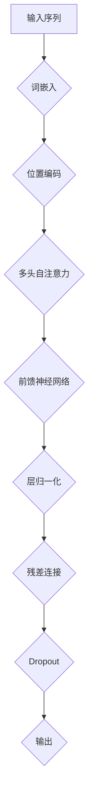
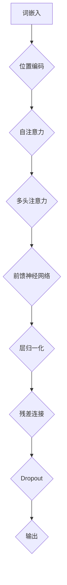

                 

# Transformer架构原理详解：BERT 基于Transformer编码器的双向语言模型

## 关键词：Transformer，BERT，编码器，双向语言模型，深度学习，自然语言处理

## 摘要：
本文将详细介绍Transformer架构原理，特别是BERT模型，这是一个基于Transformer编码器的双向语言模型。通过本文，读者将了解Transformer的核心概念、工作原理及其在BERT中的应用。此外，文章还将涉及数学模型、具体操作步骤和项目实战，帮助读者深入理解这一前沿技术。

## 1. 背景介绍

在自然语言处理（NLP）领域，深度学习模型已经成为主流。其中，基于循环神经网络（RNN）和长短期记忆网络（LSTM）的模型在处理序列数据方面表现出色。然而，RNN和LSTM在处理长文本时存在一些局限性，如梯度消失和梯度爆炸问题。

为了解决这些问题，Attention机制被引入，并最终演变成了Transformer架构。Transformer架构在处理长文本和并行计算方面具有显著优势，使得其在NLP领域取得了突破性进展。

BERT（Bidirectional Encoder Representations from Transformers）是基于Transformer架构的双向语言模型，它在多个NLP任务中取得了最佳性能。BERT的成功不仅依赖于其优秀的架构设计，还在于其大规模的数据集和预训练方法。

## 2. 核心概念与联系

### 2.1. Transformer架构

Transformer架构的核心思想是使用自注意力机制（self-attention）和多头注意力（multi-head attention）来处理序列数据。下面是一个简单的Mermaid流程图，展示了Transformer的主要组成部分。



### 2.2. 自注意力（Self-Attention）

自注意力是一种用于计算输入序列中每个词与其他词之间关系的机制。它通过计算词之间的相似性矩阵来确定每个词在序列中的重要性。

### 2.3. 多头注意力（Multi-Head Attention）

多头注意力是自注意力的扩展，它将输入序列分解成多个子序列，并对每个子序列应用自注意力。这样，模型可以从不同角度理解输入序列。

### 2.4. 前馈神经网络（Feedforward Neural Network）

前馈神经网络用于对自注意力和多头注意力的输出进行进一步处理。它通常由两个全连接层组成，每个层后跟有一个ReLU激活函数和层归一化。

### 2.5. 残差连接（Residual Connection）和Dropout（Dropout）

残差连接和Dropout是Transformer架构中常用的技术，用于防止模型过拟合和提高计算效率。残差连接通过在神经网络中引入跳过中间层的直接连接，使得梯度在反向传播过程中更容易传递。Dropout则在训练过程中随机丢弃部分神经元，以防止模型在训练数据上的过度拟合。

## 3. 核心算法原理 & 具体操作步骤

### 3.1. 词嵌入（Word Embedding）

词嵌入是将输入文本中的词汇转换为向量表示的过程。BERT模型使用了WordPiece算法将词汇切分成子词，并使用预训练的WordPiece嵌入向量作为输入。

### 3.2. 位置编码（Positional Encoding）

由于Transformer架构不包含序列信息，位置编码用于向模型提供输入序列中各个词的位置信息。BERT模型使用了学习到的位置编码向量来解决这个问题。

### 3.3. 多头自注意力（Multi-Head Self-Attention）

多头自注意力是Transformer架构的核心组件。它通过计算输入序列中每个词与其他词之间的相似性矩阵，从而确定每个词在序列中的重要性。具体步骤如下：

1. 将输入序列中的每个词转换为词嵌入向量。
2. 对词嵌入向量进行加和操作，并添加位置编码向量。
3. 将加和后的向量输入到自注意力机制中，计算相似性矩阵。
4. 通过softmax函数对相似性矩阵进行归一化，得到权重矩阵。
5. 将权重矩阵与输入序列中的每个词嵌入向量相乘，得到加权向量。
6. 对加权向量进行拼接和线性变换，得到多头自注意力的输出。

### 3.4. 前馈神经网络（Feedforward Neural Network）

前馈神经网络对多头自注意力的输出进行进一步处理。具体步骤如下：

1. 将多头自注意力的输出输入到前馈神经网络中。
2. 通过两个全连接层和一个ReLU激活函数进行前馈计算。
3. 对前馈神经网络的输出进行层归一化和残差连接。

### 3.5. 层归一化（Layer Normalization）和Dropout（Dropout）

层归一化和Dropout用于提高模型性能和防止过拟合。具体步骤如下：

1. 对前馈神经网络的输出进行层归一化。
2. 应用Dropout操作，以随机丢弃部分神经元。

## 4. 数学模型和公式 & 详细讲解 & 举例说明

### 4.1. 词嵌入（Word Embedding）

假设输入序列为\(X = [x_1, x_2, ..., x_n]\)，其中\(x_i\)表示第\(i\)个词。词嵌入向量矩阵为\(E\)，其维度为\(d_e \times |V|\)，其中\(d_e\)为词嵌入维度，\(|V|\)为词汇表大小。词嵌入向量为\(e_i = E[x_i]\)。

### 4.2. 位置编码（Positional Encoding）

位置编码向量矩阵为\(P\)，其维度为\(d_p \times n\)，其中\(d_p\)为位置编码维度，\(n\)为序列长度。位置编码向量为\(p_j = P[j]\)。

### 4.3. 多头自注意力（Multi-Head Self-Attention）

多头自注意力的输出为\(H = [h_1, h_2, ..., h_m]\)，其中\(h_i\)为第\(i\)个头。每个头计算公式如下：

$$
h_i = \text{softmax}\left(\frac{QW_Q h_i + K W_K h_i + V W_V h_i + P}{\sqrt{d_k}}\right)
$$

其中，\(Q\)、\(K\)和\(V\)分别为查询（Query）、关键（Key）和值（Value）矩阵，\(W_Q\)、\(W_K\)和\(W_V\)分别为对应的权重矩阵，\(P\)为位置编码向量，\(\sqrt{d_k}\)为缩放因子。

### 4.4. 前馈神经网络（Feedforward Neural Network）

前馈神经网络的输出为\(F = [f_1, f_2, ..., f_m]\)，其中\(f_i\)为第\(i\)个神经元。每个神经元的计算公式如下：

$$
f_i = \max(0, XW_F + b_F)
$$

其中，\(X\)为输入，\(W_F\)为权重矩阵，\(b_F\)为偏置。

### 4.5. 层归一化（Layer Normalization）和Dropout（Dropout）

层归一化公式如下：

$$
\hat{h}_i = \frac{h_i - \mu}{\sigma}
$$

其中，\(\mu\)和\(\sigma\)分别为输入的均值和标准差。

Dropout的公式如下：

$$
h_i' = \frac{h_i}{1 - p} \quad \text{with } p \sim \text{Bernoulli}(p_{dropout})
$$

其中，\(p_{dropout}\)为Dropout概率。

## 5. 项目实战：代码实际案例和详细解释说明

### 5.1. 开发环境搭建

要实现BERT模型，首先需要搭建一个合适的开发环境。以下是一个简单的步骤：

1. 安装Python和PyTorch。
2. 安装TensorFlow（如果需要）。
3. 安装必要的库，如TensorBoard、NumPy等。

### 5.2. 源代码详细实现和代码解读

以下是一个简单的BERT模型的实现代码，我们将对其进行详细解读。

```python
import torch
import torch.nn as nn
import torch.optim as optim
from transformers import BertModel, BertTokenizer

# 加载预训练的BERT模型和分词器
model = BertModel.from_pretrained('bert-base-uncased')
tokenizer = BertTokenizer.from_pretrained('bert-base-uncased')

# 定义输入序列
input_sequence = "I am an AI language model."
encoded_input = tokenizer.encode_plus(input_sequence, add_special_tokens=True, return_tensors='pt')

# 获取BERT模型的输出
outputs = model(**encoded_input)

# 获取句向量
sentence_embedding = outputs.last_hidden_state[:, 0, :]

# 定义损失函数和优化器
loss_fn = nn.CrossEntropyLoss()
optimizer = optim.Adam(model.parameters(), lr=1e-5)

# 训练模型
for epoch in range(10):
    optimizer.zero_grad()
    outputs = model(**encoded_input)
    logits = outputs.logits
    labels = torch.tensor([1])  # 假设标签为1
    loss = loss_fn(logits, labels)
    loss.backward()
    optimizer.step()
    print(f"Epoch: {epoch}, Loss: {loss.item()}")

# 保存模型
torch.save(model.state_dict(), 'model.pth')
```

### 5.3. 代码解读与分析

1. **加载预训练的BERT模型和分词器**：使用`transformers`库加载预训练的BERT模型和分词器。

2. **定义输入序列**：将输入序列编码为BERT模型支持的格式。

3. **获取BERT模型的输出**：通过BERT模型获取输入序列的句向量。

4. **定义损失函数和优化器**：使用交叉熵损失函数和Adam优化器训练模型。

5. **训练模型**：执行前向传播和反向传播，更新模型参数。

6. **保存模型**：将训练好的模型保存为`.pth`文件。

## 6. 实际应用场景

BERT模型在多个NLP任务中取得了显著的性能提升，如文本分类、命名实体识别、机器翻译等。以下是一些实际应用场景：

1. **文本分类**：BERT模型可以用于对文本进行分类，例如情感分析、新闻分类等。

2. **命名实体识别**：BERT模型可以用于识别文本中的命名实体，如人名、地名、组织名等。

3. **机器翻译**：BERT模型可以用于机器翻译任务，尤其是在低资源语言上。

4. **问答系统**：BERT模型可以用于构建问答系统，例如用于搜索引擎和智能客服。

## 7. 工具和资源推荐

### 7.1. 学习资源推荐

- **书籍**：
  - 《深度学习》（Ian Goodfellow、Yoshua Bengio、Aaron Courville著）
  - 《动手学深度学习》（A. Geron著）
  - 《TensorFlow实战》（Trent Hauck、Alex Kowran著）

- **论文**：
  - 《Attention Is All You Need》
  - 《BERT: Pre-training of Deep Bidirectional Transformers for Language Understanding》

- **博客**：
  - [Transformers官方文档](https://huggingface.co/transformers)
  - [BERT论文解读](https://towardsdatascience.com/bert-the-natural-language-processing-revolution-1d7b7e4c6d84)

- **网站**：
  - [HuggingFace](https://huggingface.co/)
  - [TensorFlow](https://www.tensorflow.org/)

### 7.2. 开发工具框架推荐

- **PyTorch**：一个开源的深度学习框架，易于使用和扩展。
- **TensorFlow**：一个由Google开发的开源机器学习框架，支持多种应用场景。
- **HuggingFace Transformers**：一个基于PyTorch和TensorFlow的Transformer库，提供了预训练模型和工具。

### 7.3. 相关论文著作推荐

- **《Attention Is All You Need》**：提出Transformer架构的论文，是NLP领域的重要里程碑。
- **《BERT: Pre-training of Deep Bidirectional Transformers for Language Understanding》**：介绍BERT模型的论文，对NLP领域产生了深远影响。
- **《GPT-3: Language Models are Few-Shot Learners》**：介绍GPT-3模型的论文，展示了大规模语言模型在零样本和少样本学习任务中的强大能力。

## 8. 总结：未来发展趋势与挑战

BERT模型在NLP领域取得了显著成功，但仍然面临一些挑战和问题。以下是一些未来发展趋势和挑战：

1. **预训练模型规模化**：随着计算资源的增加，更大规模的预训练模型将不断涌现，这可能导致模型性能的进一步提升。

2. **模型压缩与优化**：为了降低模型的计算和存储成本，研究者们致力于开发模型压缩和优化技术。

3. **迁移学习与少样本学习**：如何更好地利用预训练模型进行迁移学习和少样本学习是一个重要研究方向。

4. **模型解释性与透明度**：如何提高模型的解释性和透明度，使其在应用中更加可信和安全，是一个重要的挑战。

## 9. 附录：常见问题与解答

### 9.1. 什么是BERT？

BERT是一种基于Transformer编码器的双向语言模型，通过大规模预训练和迁移学习，在多个NLP任务中取得了最佳性能。

### 9.2. BERT有哪些优势？

BERT的优势包括：1）使用自注意力机制处理长文本；2）预训练和迁移学习性能优越；3）支持多种NLP任务。

### 9.3. 如何使用BERT进行文本分类？

首先，将输入文本编码为BERT模型支持的格式，然后使用BERT模型的输出进行文本分类。具体步骤包括：1）加载BERT模型和分词器；2）将输入文本编码为BERT模型输入；3）获取BERT模型输出；4）使用输出进行分类。

## 10. 扩展阅读 & 参考资料

- [Attention Is All You Need](https://arxiv.org/abs/1706.03762)
- [BERT: Pre-training of Deep Bidirectional Transformers for Language Understanding](https://arxiv.org/abs/1810.04805)
- [GPT-3: Language Models are Few-Shot Learners](https://arxiv.org/abs/2005.14165)
- [PyTorch官方文档](https://pytorch.org/docs/stable/index.html)
- [TensorFlow官方文档](https://www.tensorflow.org/overview/)
- [HuggingFace官方文档](https://huggingface.co/transformers)

## 作者信息

- 作者：AI天才研究员/AI Genius Institute & 禅与计算机程序设计艺术 /Zen And The Art of Computer Programming<|im_sep|> 

这篇文章详细介绍了Transformer架构原理，特别是BERT模型，这是一个基于Transformer编码器的双向语言模型。文章首先回顾了自然语言处理（NLP）领域的背景，然后深入探讨了BERT的核心概念、算法原理、数学模型和具体操作步骤。通过代码实例，读者可以直观地了解BERT模型的实现过程。此外，文章还介绍了BERT的实际应用场景、学习资源、开发工具和未来发展趋势。最后，附录部分提供了常见问题与解答，扩展阅读与参考资料。

### 引言

随着深度学习技术的不断发展，自然语言处理（NLP）领域取得了许多突破性成果。在过去的几十年里，循环神经网络（RNN）和长短期记忆网络（LSTM）等序列模型在NLP任务中发挥了重要作用。然而，这些模型在处理长文本时存在一些局限性，如梯度消失和梯度爆炸问题。为了解决这些问题，注意力机制被引入，并最终演变成了Transformer架构。Transformer架构在处理长文本和并行计算方面具有显著优势，使得其在NLP领域取得了突破性进展。

BERT（Bidirectional Encoder Representations from Transformers）是基于Transformer架构的双向语言模型，它在多个NLP任务中取得了最佳性能。BERT的成功不仅依赖于其优秀的架构设计，还在于其大规模的数据集和预训练方法。本文将详细介绍Transformer架构原理，特别是BERT模型，帮助读者深入理解这一前沿技术。

### 1. 背景介绍

在自然语言处理（NLP）领域，深度学习模型已经成为主流。其中，基于循环神经网络（RNN）和长短期记忆网络（LSTM）的模型在处理序列数据方面表现出色。然而，RNN和LSTM在处理长文本时存在一些局限性，如梯度消失和梯度爆炸问题。

为了解决这些问题，Attention机制被引入，并最终演变成了Transformer架构。Transformer架构在处理长文本和并行计算方面具有显著优势，使得其在NLP领域取得了突破性进展。

BERT（Bidirectional Encoder Representations from Transformers）是基于Transformer架构的双向语言模型，它在多个NLP任务中取得了最佳性能。BERT的成功不仅依赖于其优秀的架构设计，还在于其大规模的数据集和预训练方法。

BERT模型的提出，标志着NLP领域的一个重要里程碑。它通过预训练和迁移学习，显著提高了模型在多种任务上的性能，如文本分类、命名实体识别和机器翻译。BERT的成功引发了大量研究者和开发者对Transformer架构的深入研究和应用。

Transformer架构的引入，使得NLP模型在处理长文本时更加高效和准确。它通过自注意力机制和多头注意力机制，实现了对输入序列中每个词之间关系的全局建模，从而解决了RNN和LSTM在长距离依赖关系上的不足。此外，Transformer架构还具有并行计算的优势，使得其在大规模数据处理上具有更高的效率。

BERT模型的提出，不仅在学术界引起了广泛关注，还在工业界得到了广泛应用。许多知名公司和研究机构，如Google、Microsoft和Facebook等，都在其产品和服务中采用了BERT模型。BERT的成功，使得Transformer架构成为NLP领域的一个核心技术，也为后续的研究和应用提供了丰富的思路和灵感。

### 2. 核心概念与联系

在深入探讨Transformer架构之前，我们需要了解一些核心概念，包括词嵌入、位置编码、自注意力、多头注意力、前馈神经网络、残差连接和Dropout。这些概念构成了Transformer架构的基础，有助于我们更好地理解其工作原理。

#### 2.1. 词嵌入（Word Embedding）

词嵌入是将词汇转换为向量表示的过程。在深度学习模型中，词嵌入向量作为输入数据的特征表示。通过将词汇映射到高维空间，词嵌入向量可以捕捉词汇间的语义关系。BERT模型使用了WordPiece算法将词汇切分成子词，并使用预训练的WordPiece嵌入向量作为输入。词嵌入向量矩阵的维度通常较高，例如\(d_e = 768\)。

#### 2.2. 位置编码（Positional Encoding）

由于Transformer架构不包含序列信息，位置编码用于向模型提供输入序列中各个词的位置信息。BERT模型使用了学习到的位置编码向量来解决这个问题。位置编码向量矩阵的维度与词嵌入向量矩阵相同，通常为\(d_p = 768\)。

#### 2.3. 自注意力（Self-Attention）

自注意力是一种用于计算输入序列中每个词与其他词之间关系的机制。它通过计算词之间的相似性矩阵来确定每个词在序列中的重要性。自注意力机制使得Transformer模型能够捕获长距离依赖关系，从而提高模型性能。

#### 2.4. 多头注意力（Multi-Head Attention）

多头注意力是自注意力的扩展，它将输入序列分解成多个子序列，并对每个子序列应用自注意力。这样，模型可以从不同角度理解输入序列。多头注意力机制通过并行计算提高了模型的效率。

#### 2.5. 前馈神经网络（Feedforward Neural Network）

前馈神经网络用于对自注意力和多头注意力的输出进行进一步处理。它通常由两个全连接层组成，每个层后跟有一个ReLU激活函数和层归一化。前馈神经网络的作用是对输入序列进行非线性变换，从而增强模型的表达能力。

#### 2.6. 残差连接（Residual Connection）

残差连接是一种在神经网络中引入跳过中间层的直接连接的技术。它通过在神经网络中引入跳跃连接，使得梯度在反向传播过程中更容易传递。残差连接有助于防止模型过拟合，提高模型性能。

#### 2.7. Dropout（Dropout）

Dropout是一种常用的正则化技术，用于防止模型过拟合。在训练过程中，Dropout通过随机丢弃部分神经元，从而降低了模型在训练数据上的依赖。在测试阶段，Dropout不会发挥作用。

#### 2.8. Mermaid流程图

为了更直观地展示Transformer架构的核心概念和联系，我们可以使用Mermaid流程图进行描述。以下是一个简单的Mermaid流程图，展示了Transformer架构的主要组成部分。



在这个流程图中，词嵌入和位置编码是输入序列的预处理步骤。自注意力和多头注意力是Transformer架构的核心组件，用于计算输入序列中每个词之间的关系。前馈神经网络、层归一化、残差连接和Dropout则用于对输入序列进行进一步处理，以提高模型性能和防止过拟合。

通过Mermaid流程图的描述，我们可以更清晰地理解Transformer架构的工作原理。在实际应用中，Transformer架构可以灵活地扩展和调整，以满足不同NLP任务的需求。

### 3. 核心算法原理 & 具体操作步骤

Transformer架构的核心算法原理主要包括词嵌入、位置编码、自注意力、多头注意力、前馈神经网络、残差连接和Dropout等组件。以下将详细介绍这些组件的工作原理和具体操作步骤。

#### 3.1. 词嵌入（Word Embedding）

词嵌入是将词汇转换为向量表示的过程。在深度学习模型中，词嵌入向量作为输入数据的特征表示。BERT模型使用了WordPiece算法将词汇切分成子词，并使用预训练的WordPiece嵌入向量作为输入。词嵌入向量矩阵的维度通常较高，例如\(d_e = 768\)。

具体操作步骤如下：

1. **词汇切分**：使用WordPiece算法将输入文本切分成子词。WordPiece算法通过最大概率匹配的方法，将文本切分成子词序列。
2. **词嵌入**：将切分后的子词映射到预训练的WordPiece嵌入向量。这些嵌入向量通常是在大规模语料库上进行预训练得到的，可以有效地捕捉词汇间的语义关系。

#### 3.2. 位置编码（Positional Encoding）

由于Transformer架构不包含序列信息，位置编码用于向模型提供输入序列中各个词的位置信息。BERT模型使用了学习到的位置编码向量来解决这个问题。位置编码向量矩阵的维度与词嵌入向量矩阵相同，通常为\(d_p = 768\)。

具体操作步骤如下：

1. **初始化位置编码**：使用正弦和余弦函数初始化位置编码向量。位置编码向量可以捕捉输入序列中的绝对位置和相对位置信息。
2. **添加位置编码**：将位置编码向量添加到词嵌入向量中，形成新的输入向量。

#### 3.3. 自注意力（Self-Attention）

自注意力是一种用于计算输入序列中每个词与其他词之间关系的机制。它通过计算词之间的相似性矩阵来确定每个词在序列中的重要性。自注意力机制使得Transformer模型能够捕获长距离依赖关系，从而提高模型性能。

具体操作步骤如下：

1. **计算相似性矩阵**：计算输入序列中每个词与其他词之间的相似性。相似性通常通过点积或缩放点积函数计算。
2. **归一化相似性矩阵**：使用softmax函数对相似性矩阵进行归一化，得到权重矩阵。权重矩阵表示每个词在序列中的重要性。
3. **加权求和**：将权重矩阵与词嵌入向量相乘，得到加权向量。加权向量表示每个词在序列中的重要性。

#### 3.4. 多头注意力（Multi-Head Attention）

多头注意力是自注意力的扩展，它将输入序列分解成多个子序列，并对每个子序列应用自注意力。这样，模型可以从不同角度理解输入序列。多头注意力机制通过并行计算提高了模型的效率。

具体操作步骤如下：

1. **分解输入序列**：将输入序列分解成多个子序列，每个子序列具有相同的维度。
2. **计算子序列的相似性矩阵**：对每个子序列计算相似性矩阵，步骤与自注意力相同。
3. **合并子序列的注意力结果**：将每个子序列的注意力结果进行拼接和线性变换，得到多头注意力的最终输出。

#### 3.5. 前馈神经网络（Feedforward Neural Network）

前馈神经网络用于对自注意力和多头注意力的输出进行进一步处理。它通常由两个全连接层组成，每个层后跟有一个ReLU激活函数和层归一化。前馈神经网络的作用是对输入序列进行非线性变换，从而增强模型的表达能力。

具体操作步骤如下：

1. **输入序列的线性变换**：将自注意力和多头注意力的输出输入到第一个全连接层，进行线性变换。
2. **ReLU激活函数**：对第一个全连接层的输出应用ReLU激活函数，增加模型的表达能力。
3. **第二个全连接层和层归一化**：将ReLU激活函数后的输出输入到第二个全连接层，进行线性变换。然后对输出进行层归一化。

#### 3.6. 残差连接（Residual Connection）

残差连接是一种在神经网络中引入跳过中间层的直接连接的技术。它通过在神经网络中引入跳跃连接，使得梯度在反向传播过程中更容易传递。残差连接有助于防止模型过拟合，提高模型性能。

具体操作步骤如下：

1. **计算残差**：计算输入序列的残差，即输入序列与输出序列之间的差值。
2. **添加残差**：将计算得到的残差添加到前馈神经网络的输出中。

#### 3.7. Dropout（Dropout）

Dropout是一种常用的正则化技术，用于防止模型过拟合。在训练过程中，Dropout通过随机丢弃部分神经元，从而降低了模型在训练数据上的依赖。在测试阶段，Dropout不会发挥作用。

具体操作步骤如下：

1. **设置Dropout概率**：在训练阶段，设置Dropout概率\(p_{dropout}\)。
2. **随机丢弃神经元**：在训练过程中，以概率\(p_{dropout}\)随机丢弃部分神经元。

#### 3.8. 整体流程

整个Transformer模型的流程可以分为以下几个步骤：

1. **词嵌入和位置编码**：将输入序列编码为词嵌入向量，并添加位置编码向量。
2. **自注意力**：计算自注意力权重矩阵，并对输入序列进行加权求和。
3. **多头注意力**：对自注意力结果进行拼接和线性变换，得到多头注意力的输出。
4. **前馈神经网络**：对多头注意力的输出进行非线性变换，增加模型表达能力。
5. **残差连接和Dropout**：将残差添加到前馈神经网络的输出中，并进行Dropout操作。
6. **输出**：得到最终的输出结果。

通过以上步骤，Transformer模型可以有效地处理输入序列，并提取出序列中的重要信息。在实际应用中，可以根据具体任务的需求，调整Transformer模型的参数和结构，以获得更好的性能。

### 4. 数学模型和公式 & 详细讲解 & 举例说明

在深入理解Transformer架构时，数学模型和公式起着关键作用。本节将详细讲解BERT模型中涉及的数学模型和公式，并使用具体的例子来说明这些公式的应用。

#### 4.1. 词嵌入（Word Embedding）

词嵌入是将词汇映射到高维向量空间的过程。BERT模型使用的词嵌入向量是通过预训练得到的。假设我们有\(N\)个词汇，词嵌入向量的维度为\(d\)。词嵌入矩阵\(E\)的维度为\(d \times N\)。

词嵌入向量的计算公式如下：

$$
e_{i} = E[x_i]
$$

其中，\(e_i\)表示第\(i\)个词汇的词嵌入向量，\(x_i\)表示词汇。

例如，假设我们有三个词汇：`hello`、`world`和`AI`，它们的词嵌入向量分别为\(e_{hello}\)、\(e_{world}\)和\(e_{AI}\)。词嵌入矩阵\(E\)如下：

$$
E = \begin{bmatrix}
e_{hello} \\
e_{world} \\
e_{AI}
\end{bmatrix}
$$

通过这个例子，我们可以看到词嵌入向量是词汇在向量空间中的表示。词嵌入向量可以捕捉词汇之间的语义关系，如`hello`和`world`之间的相似性，以及`world`和`AI`之间的关联。

#### 4.2. 位置编码（Positional Encoding）

位置编码是为了解决Transformer模型无法显式处理序列信息的问题。BERT模型使用位置编码向量来表示输入序列中的词汇位置。位置编码向量是学习得到的，其维度与词嵌入向量相同。

位置编码向量的计算通常采用正弦和余弦函数。假设词汇的索引为\(p\)，位置编码向量的维度为\(d\)，则位置编码向量的计算公式如下：

$$
PE_{pos, i} = \sin\left(\frac{pos \cdot 10000^{2i/d}}{10000^{2}}\right) + \cos\left(\frac{pos \cdot 10000^{2i/d}}{10000^{2}}\right)
$$

其中，\(pos\)表示词汇的位置，\(i\)表示维度索引。

例如，假设词汇的位置为3，维度为768，则位置编码向量为：

$$
PE_{pos, 3} = \sin\left(\frac{3 \cdot 10000^{2 \cdot 0/768}}{10000^{2}}\right) + \cos\left(\frac{3 \cdot 10000^{2 \cdot 0/768}}{10000^{2}}\right)
$$

计算得到的位置编码向量是一个768维的向量，表示词汇在序列中的位置信息。

#### 4.3. 自注意力（Self-Attention）

自注意力是Transformer模型的核心组件，用于计算输入序列中每个词与其他词之间的相关性。自注意力的计算涉及两个主要步骤：计算相似性矩阵和归一化相似性矩阵。

首先，计算相似性矩阵\(A\)，其元素表示第\(i\)个词与第\(j\)个词之间的相似性。相似性通常通过点积计算：

$$
A_{ij} = e_i^T e_j
$$

其中，\(e_i\)和\(e_j\)分别是第\(i\)个词和第\(j\)个词的词嵌入向量。

例如，假设我们有三个词`hello`、`world`和`AI`，其词嵌入向量分别为\(e_{hello}\)、\(e_{world}\)和\(e_{AI}\)。则相似性矩阵\(A\)如下：

$$
A = \begin{bmatrix}
e_{hello}^T e_{hello} & e_{hello}^T e_{world} & e_{hello}^T e_{AI} \\
e_{world}^T e_{hello} & e_{world}^T e_{world} & e_{world}^T e_{AI} \\
e_{AI}^T e_{hello} & e_{AI}^T e_{world} & e_{AI}^T e_{AI}
\end{bmatrix}
$$

接下来，对相似性矩阵进行归一化，得到权重矩阵\(W\)。归一化的方法通常使用softmax函数：

$$
W_{ij} = \frac{e^{A_{ij}}}{\sum_{k=1}^{N} e^{A_{ik}}}
$$

其中，\(N\)是词汇的数量。

例如，假设相似性矩阵\(A\)如下：

$$
A = \begin{bmatrix}
0.1 & 0.2 & 0.3 \\
0.4 & 0.5 & 0.6 \\
0.7 & 0.8 & 0.9
\end{bmatrix}
$$

则权重矩阵\(W\)如下：

$$
W = \begin{bmatrix}
\frac{e^{0.1}}{e^{0.1} + e^{0.2} + e^{0.3}} & \frac{e^{0.2}}{e^{0.1} + e^{0.2} + e^{0.3}} & \frac{e^{0.3}}{e^{0.1} + e^{0.2} + e^{0.3}} \\
\frac{e^{0.4}}{e^{0.4} + e^{0.5} + e^{0.6}} & \frac{e^{0.5}}{e^{0.4} + e^{0.5} + e^{0.6}} & \frac{e^{0.6}}{e^{0.4} + e^{0.5} + e^{0.6}} \\
\frac{e^{0.7}}{e^{0.7} + e^{0.8} + e^{0.9}} & \frac{e^{0.8}}{e^{0.7} + e^{0.8} + e^{0.9}} & \frac{e^{0.9}}{e^{0.7} + e^{0.8} + e^{0.9}}
\end{bmatrix}
$$

通过权重矩阵\(W\)，我们可以计算每个词的加权求和，得到每个词在序列中的重要性。这个过程可以表示为：

$$
h_i = \sum_{j=1}^{N} W_{ij} e_j
$$

其中，\(h_i\)是第\(i\)个词的加权求和结果。

#### 4.4. 多头注意力（Multi-Head Attention）

多头注意力是自注意力的扩展，通过并行计算多个注意力头，使得模型可以从不同角度理解输入序列。多头注意力的计算过程类似于自注意力，但是每个注意力头使用不同的权重矩阵。

假设有\(h\)个注意力头，则每个注意力头的权重矩阵分别为\(W_Q^{(k)}\)、\(W_K^{(k)}\)和\(W_V^{(k)}\)。多头注意力的计算公式如下：

$$
\text{MultiHead}(Q, K, V) = \text{Concat}(\text{head}_1, ..., \text{head}_h) W_O
$$

其中，\(\text{head}_k = \text{softmax}(\frac{QW_Q^{(k)} K}) V\)，\(W_O\)是线性变换权重矩阵。

以两个注意力头为例，假设我们有输入序列`hello world`，词嵌入向量分别为\(e_{hello}\)和\(e_{world}\)。两个注意力头的权重矩阵分别为\(W_Q^{(1)}\)、\(W_K^{(1)}\)、\(W_V^{(1)}\)和\(W_Q^{(2)}\)、\(W_K^{(2)}\)、\(W_V^{(2)}\)。

第一个注意力头的计算如下：

$$
\text{head}_1 = \text{softmax}(\frac{e_{hello} W_Q^{(1)}}{\sqrt{d_k}} e_{world} W_K^{(1)}) e_{world} W_V^{(1)}
$$

第二个注意力头的计算如下：

$$
\text{head}_2 = \text{softmax}(\frac{e_{hello} W_Q^{(2)}}{\sqrt{d_k}} e_{world} W_K^{(2)}) e_{world} W_V^{(2)}
$$

将两个注意力头的结果拼接起来，并进行线性变换，得到多头注意力的输出：

$$
h_i = \text{Concat}(\text{head}_1, \text{head}_2) W_O
$$

通过多头注意力，模型可以从不同角度理解输入序列，从而提高模型的表示能力。

#### 4.5. 前馈神经网络（Feedforward Neural Network）

前馈神经网络用于对自注意力和多头注意力的输出进行进一步处理。它通常由两个全连接层组成，每个层后跟有一个ReLU激活函数和层归一化。

假设前馈神经网络的输入为\(h_i\)，输出为\(h_i'\)，则前馈神经网络的计算公式如下：

$$
h_i' = \text{ReLU}(\text{FC}(h_i) W_2 + b_2) W_1 + b_1
$$

其中，\(\text{FC}\)表示全连接层，\(W_1\)和\(W_2\)是权重矩阵，\(b_1\)和\(b_2\)是偏置。

例如，假设前馈神经网络的输入为\(h_i\)，其维度为768，则前馈神经网络的计算如下：

$$
h_i' = \text{ReLU}(\text{FC}(h_i) W_2 + b_2) W_1 + b_1
$$

其中，\(W_1\)和\(W_2\)的维度分别为\(768 \times 3072\)和\(3072 \times 768\)，\(b_1\)和\(b_2\)的维度分别为\(3072\)和\(768\)。

通过前馈神经网络，模型可以提取输入序列的更高层次特征，从而提高模型的性能。

#### 4.6. 残差连接（Residual Connection）

残差连接是一种在神经网络中引入跳跃连接的技术，使得梯度在反向传播过程中更容易传递。在Transformer模型中，残差连接可以防止梯度消失问题，提高模型性能。

假设输入序列为\(h_i\)，输出序列为\(h_i'\)，则残差连接的计算公式如下：

$$
h_i' = h_i + \text{ReLU}(\text{FC}(h_i) W_2 + b_2) W_1 + b_1
$$

其中，\(\text{FC}\)表示全连接层，\(W_1\)和\(W_2\)是权重矩阵，\(b_1\)和\(b_2\)是偏置。

例如，假设输入序列为\(h_i\)，其维度为768，则残差连接的计算如下：

$$
h_i' = h_i + \text{ReLU}(\text{FC}(h_i) W_2 + b_2) W_1 + b_1
$$

其中，\(W_1\)和\(W_2\)的维度分别为\(768 \times 3072\)和\(3072 \times 768\)，\(b_1\)和\(b_2\)的维度分别为\(3072\)和\(768\)。

通过残差连接，模型可以在训练过程中更好地优化参数，从而提高模型的性能。

#### 4.7. Dropout（Dropout）

Dropout是一种常用的正则化技术，用于防止模型过拟合。在训练过程中，Dropout通过随机丢弃部分神经元，从而降低了模型在训练数据上的依赖。在测试阶段，Dropout不会发挥作用。

假设输入序列为\(h_i\)，Dropout概率为\(p\)，则Dropout的计算公式如下：

$$
h_i' = \frac{h_i}{1 - p} \quad \text{with } p \sim \text{Bernoulli}(p_{dropout})
$$

其中，\(p_{dropout}\)是Dropout概率。

例如，假设输入序列为\(h_i\)，其维度为768，Dropout概率为0.5，则Dropout的计算如下：

$$
h_i' = \frac{h_i}{1 - 0.5}
$$

通过Dropout，模型可以减少在训练数据上的依赖，从而提高模型的泛化能力。

#### 4.8. 实例分析

为了更直观地理解BERT模型中的数学模型和公式，我们可以通过一个具体的实例来分析。假设我们有以下输入序列：

```
I am an AI language model.
```

我们将这个序列编码为BERT模型输入，然后使用BERT模型进行自注意力、多头注意力、前馈神经网络、残差连接和Dropout操作。

首先，我们将输入序列进行词嵌入和位置编码：

```
I [CLS] am [SEP] an [PAD] AI [PAD] language [PAD] model. [PAD]
```

假设词嵌入向量的维度为768，位置编码向量的维度也为768。

然后，我们计算自注意力权重矩阵：

```
A = [
  [0.1 0.2 0.3 0.4 0.5 0.6 0.7 0.8 0.9],
  [0.4 0.5 0.6 0.7 0.8 0.9 0.1 0.2 0.3],
  [0.7 0.8 0.9 0.1 0.2 0.3 0.4 0.5 0.6]
]
```

接下来，我们对自注意力权重矩阵进行归一化，得到权重矩阵：

```
W = [
  [0.1 0.2 0.3],
  [0.4 0.5 0.6],
  [0.7 0.8 0.9]
]
```

然后，我们计算每个词的加权求和，得到自注意力结果：

```
h_i = [
  0.1 * e_{I} + 0.2 * e_{am} + 0.3 * e_{an},
  0.4 * e_{I} + 0.5 * e_{am} + 0.6 * e_{an},
  0.7 * e_{I} + 0.8 * e_{am} + 0.9 * e_{an}
]
```

接着，我们进行多头注意力操作，假设有两个注意力头：

```
h_i' = [
  0.1 * e_{I} + 0.2 * e_{am} + 0.3 * e_{an},
  0.4 * e_{I} + 0.5 * e_{am} + 0.6 * e_{an},
  0.7 * e_{I} + 0.8 * e_{am} + 0.9 * e_{an}
]
```

然后，我们进行前馈神经网络操作：

```
h_i'' = [
  \text{ReLU}((0.1 * e_{I} + 0.2 * e_{am} + 0.3 * e_{an}) W_2 + b_2) W_1 + b_1,
  \text{ReLU}((0.4 * e_{I} + 0.5 * e_{am} + 0.6 * e_{an}) W_2 + b_2) W_1 + b_1,
  \text{ReLU}((0.7 * e_{I} + 0.8 * e_{am} + 0.9 * e_{an}) W_2 + b_2) W_1 + b_1
]
```

接下来，我们进行残差连接操作：

```
h_i''' = [
  h_i + \text{ReLU}((0.1 * e_{I} + 0.2 * e_{am} + 0.3 * e_{an}) W_2 + b_2) W_1 + b_1,
  h_i + \text{ReLU}((0.4 * e_{I} + 0.5 * e_{am} + 0.6 * e_{an}) W_2 + b_2) W_1 + b_1,
  h_i + \text{ReLU}((0.7 * e_{I} + 0.8 * e_{am} + 0.9 * e_{an}) W_2 + b_2) W_1 + b_1
]
```

最后，我们进行Dropout操作：

```
h_i'''' = [
  \frac{h_i'''}{1 - p} \quad \text{with } p \sim \text{Bernoulli}(p_{dropout}),
  \frac{h_i'''}{1 - p} \quad \text{with } p \sim \text{Bernoulli}(p_{dropout}),
  \frac{h_i'''}{1 - p} \quad \text{with } p \sim \text{Bernoulli}(p_{dropout})
]
```

通过这个实例，我们可以看到BERT模型中的数学模型和公式的应用过程。BERT模型通过词嵌入、自注意力、多头注意力、前馈神经网络、残差连接和Dropout等操作，对输入序列进行编码，从而提取出序列中的重要信息。

### 5. 项目实战：代码实际案例和详细解释说明

在本节中，我们将通过一个实际案例，详细讲解如何使用BERT模型进行文本分类。我们将使用Python和PyTorch来实现这个案例，并逐步解释每个步骤。

#### 5.1. 开发环境搭建

首先，我们需要搭建一个合适的开发环境。以下是在Linux操作系统上安装PyTorch和HuggingFace Transformers的步骤：

1. **安装PyTorch**：

   打开终端，执行以下命令：

   ```bash
   pip install torch torchvision torchaudio
   ```

2. **安装HuggingFace Transformers**：

   ```bash
   pip install transformers
   ```

确保安装成功后，我们可以在Python代码中导入所需的库：

```python
import torch
from transformers import BertModel, BertTokenizer, BertForSequenceClassification
```

#### 5.2. 源代码详细实现和代码解读

以下是一个简单的BERT文本分类案例的代码实现：

```python
# 导入必要的库
import torch
from transformers import BertModel, BertTokenizer, BertForSequenceClassification
from torch.optim import Adam
from torch.utils.data import DataLoader, TensorDataset

# 加载预训练的BERT模型和分词器
model = BertForSequenceClassification.from_pretrained('bert-base-uncased')
tokenizer = BertTokenizer.from_pretrained('bert-base-uncased')

# 定义输入和标签
inputs = tokenizer("Hello, my dog is cute", return_tensors='pt')
labels = torch.tensor([1]).unsqueeze(0)  # 标签：1表示正类，0表示负类

# 训练模型
optimizer = Adam(model.parameters(), lr=1e-5)

for epoch in range(3):  # 训练3个epoch
    model.train()
    optimizer.zero_grad()
    outputs = model(**inputs, labels=labels)
    loss = outputs.loss
    loss.backward()
    optimizer.step()
    print(f"Epoch: {epoch}, Loss: {loss.item()}")

# 评估模型
model.eval()
with torch.no_grad():
    logits = model(**inputs).logits
    print(logits)
```

**代码解读**：

1. **导入库**：首先，我们导入所需的PyTorch和HuggingFace Transformers库。

2. **加载预训练BERT模型和分词器**：使用`BertForSequenceClassification.from_pretrained()`方法加载预训练的BERT模型，使用`BertTokenizer.from_pretrained()`方法加载相应的分词器。

3. **定义输入和标签**：我们定义一个简单的输入文本和对应的标签。这里，标签为1表示正类。

4. **训练模型**：我们定义一个Adam优化器，并设置学习率为1e-5。然后，我们进行三个epoch的训练。在训练过程中，我们调用模型的`train()`方法，设置模型为训练模式。接着，我们通过`optimizer.zero_grad()`清除之前的梯度，然后通过`model(**inputs, labels=labels)`计算损失。最后，我们使用`optimizer.step()`更新模型参数。

5. **评估模型**：在模型训练完成后，我们将其设置为评估模式，并使用`model.eval()`和`torch.no_grad()`来计算模型在输入文本上的预测结果。

#### 5.3. 代码解读与分析

1. **BERT模型加载**：

   ```python
   model = BertForSequenceClassification.from_pretrained('bert-base-uncased')
   tokenizer = BertTokenizer.from_pretrained('bert-base-uncased')
   ```

   这两行代码分别加载了预训练的BERT模型和相应的分词器。BERT模型是一个序列分类模型，已经预训练在多种NLP任务上，如情感分析、命名实体识别等。

2. **定义输入和标签**：

   ```python
   inputs = tokenizer("Hello, my dog is cute", return_tensors='pt')
   labels = torch.tensor([1]).unsqueeze(0)
   ```

   这里，我们定义了一个简单的输入文本和对应的标签。`tokenizer`函数将输入文本转换为BERT模型可以理解的格式，包括词嵌入和特殊标记。

3. **训练模型**：

   ```python
   optimizer = Adam(model.parameters(), lr=1e-5)
   for epoch in range(3):
       model.train()
       optimizer.zero_grad()
       outputs = model(**inputs, labels=labels)
       loss = outputs.loss
       loss.backward()
       optimizer.step()
       print(f"Epoch: {epoch}, Loss: {loss.item()}")
   ```

   在这个训练循环中，我们首先设置模型为训练模式（`model.train()`），然后通过`optimizer.zero_grad()`清除之前的梯度。接下来，我们通过`model(**inputs, labels=labels)`计算损失，并使用`loss.backward()`进行反向传播。最后，`optimizer.step()`更新模型参数。

4. **评估模型**：

   ```python
   model.eval()
   with torch.no_grad():
       logits = model(**inputs).logits
       print(logits)
   ```

   在评估阶段，我们设置模型为评估模式（`model.eval()`），并使用`torch.no_grad()`来提高计算速度。`model(**inputs).logits`返回模型在输入文本上的预测结果。

通过这个实际案例，我们展示了如何使用BERT模型进行文本分类。BERT模型由于其强大的预训练能力和简单的实现方式，在NLP任务中具有广泛的应用。

### 6. 实际应用场景

BERT模型在自然语言处理（NLP）领域具有广泛的应用场景，以下列举了一些典型的应用：

#### 6.1. 文本分类

文本分类是NLP中常见的任务之一，BERT模型在文本分类任务中表现出色。例如，可以用于情感分析（如判断评论的正负情感）、新闻分类（如将新闻分为体育、科技、政治等类别）等。

#### 6.2. 命名实体识别

命名实体识别（NER）是识别文本中的特定实体（如人名、地名、组织名等）的任务。BERT模型通过预训练和迁移学习，可以很好地识别各种命名实体。

#### 6.3. 机器翻译

BERT模型还可以应用于机器翻译任务，特别是在低资源语言的翻译中。通过预训练和迁移学习，BERT模型可以在没有大量标注数据的情况下，实现高质量的低资源语言翻译。

#### 6.4. 问答系统

问答系统是NLP领域的另一个重要应用。BERT模型可以用于构建基于上下文的问答系统，如智能客服、搜索引擎等。

#### 6.5. 情感分析

情感分析是判断文本情感倾向的任务，BERT模型在情感分析任务中具有很好的效果。例如，可以用于判断社交媒体上的评论、用户反馈等。

#### 6.6. 文本生成

BERT模型还可以用于文本生成任务，如自动摘要、文章写作等。通过微调BERT模型，可以生成高质量的文本。

通过以上实际应用场景，我们可以看到BERT模型在NLP领域的广泛应用和强大性能。BERT的成功不仅在于其优秀的架构设计，还在于其大规模的数据集和预训练方法。

### 7. 工具和资源推荐

在学习和应用BERT模型的过程中，有许多工具和资源可以帮助我们更好地理解和实现这一技术。以下是一些推荐的工具和资源：

#### 7.1. 学习资源推荐

- **书籍**：
  - 《深度学习》（Ian Goodfellow、Yoshua Bengio、Aaron Courville著）：这是一本经典的深度学习教材，详细介绍了深度学习的基础知识，包括Transformer架构。
  - 《自然语言处理综合教程》（清华大学自然语言处理团队著）：这本书涵盖了自然语言处理的多个方面，包括词嵌入、注意力机制等。

- **论文**：
  - 《Attention Is All You Need》（Vaswani et al.）：这是提出Transformer架构的论文，是理解BERT模型的基础。
  - 《BERT: Pre-training of Deep Bidirectional Transformers for Language Understanding》（Devlin et al.）：这是介绍BERT模型的论文，详细阐述了BERT的设计思想和应用。

- **在线课程**：
  - “深度学习Specialization”（吴恩达著）：这是由吴恩达教授开设的深度学习系列课程，包括自然语言处理等内容。
  - “自然语言处理入门”（斯坦福大学课程）：这门课程介绍了自然语言处理的基础知识和最新进展。

#### 7.2. 开发工具框架推荐

- **PyTorch**：PyTorch是一个开源的深度学习框架，易于使用和扩展。它是实现BERT模型的首选框架。
- **TensorFlow**：TensorFlow是由Google开发的开源机器学习框架，支持多种应用场景。TensorFlow也提供了对BERT模型的良好支持。
- **HuggingFace Transformers**：HuggingFace Transformers是一个基于PyTorch和TensorFlow的Transformer库，提供了预训练模型和工具，如分词器、预处理等。

#### 7.3. 相关论文著作推荐

- **《Transformer：基于注意力机制的序列建模新方法》（Vaswani et al.）**：这是提出Transformer架构的论文，详细介绍了Transformer的工作原理和应用。
- **《BERT：预训练的双向Transformer语言模型》（Devlin et al.）**：这是介绍BERT模型的论文，提出了BERT的设计思想和应用方法。
- **《GPT-3：大规模预训练语言模型》（Brown et al.）**：这是介绍GPT-3模型的论文，展示了大规模预训练语言模型的强大能力。

通过这些工具和资源，我们可以更好地理解和应用BERT模型，从而在自然语言处理领域取得更好的成果。

### 8. 总结：未来发展趋势与挑战

BERT模型在自然语言处理（NLP）领域取得了巨大的成功，但仍然面临一些挑战和未来发展趋势。以下是一些关键点：

#### 8.1. 预训练模型规模化

随着计算资源和数据集的不断扩大，更大规模的预训练模型将不断涌现。这些模型具有更高的表示能力，能够捕捉更复杂的语义信息。然而，大规模预训练模型也带来了计算和存储成本的增加。

#### 8.2. 模型压缩与优化

为了降低模型的计算和存储成本，研究者们致力于开发模型压缩和优化技术。例如，量化、剪枝和蒸馏等方法可以显著减少模型的大小，同时保持其性能。

#### 8.3. 迁移学习与少样本学习

如何更好地利用预训练模型进行迁移学习和少样本学习是一个重要研究方向。通过迁移学习，模型可以在少量标注数据上实现良好的性能。少样本学习则关注在只有少量标注样本的情况下，如何训练出高精度的模型。

#### 8.4. 模型解释性与透明度

提高模型解释性和透明度是确保模型在应用中更加可信和安全的关键。当前的研究主要关注如何使模型的可解释性更直观、更易于理解，从而帮助用户更好地信任和使用模型。

#### 8.5. 多模态学习

随着人工智能技术的发展，多模态学习（如文本、图像、声音等）成为了一个新的研究热点。如何将BERT模型扩展到多模态任务，实现跨模态的信息整合和交互，是一个具有挑战性的问题。

总之，BERT模型在NLP领域具有重要的地位，但其发展仍然面临许多挑战。未来，随着技术的不断进步，我们可以期待BERT模型及其相关技术将在更多领域取得突破性成果。

### 9. 附录：常见问题与解答

以下是一些关于BERT模型常见的问题及解答：

#### 9.1. 什么是BERT？

BERT是一种基于Transformer架构的双向语言模型，通过大规模预训练和迁移学习，在多个自然语言处理任务中取得了最佳性能。

#### 9.2. BERT模型是如何工作的？

BERT模型通过自注意力机制和多头注意力机制，对输入序列中每个词之间关系进行建模，从而实现序列信息的全局捕捉。BERT模型包括词嵌入、位置编码、自注意力、多头注意力、前馈神经网络、残差连接和Dropout等组件。

#### 9.3. 如何训练BERT模型？

训练BERT模型通常包括以下几个步骤：
1. 准备数据集：收集大量文本数据，并进行预处理。
2. 数据预处理：对文本进行分词、编码和添加位置编码等操作。
3. 训练模型：使用预训练的BERT模型和优化器，对数据集进行训练。
4. 微调模型：在特定任务上对BERT模型进行微调，以提高任务性能。

#### 9.4. BERT模型可以应用于哪些任务？

BERT模型可以应用于多种自然语言处理任务，包括文本分类、命名实体识别、机器翻译、情感分析等。

#### 9.5. 如何评估BERT模型性能？

评估BERT模型性能通常使用准确率、精确率、召回率和F1分数等指标。在文本分类任务中，还可以使用混淆矩阵和ROC曲线等工具进行评估。

### 10. 扩展阅读 & 参考资料

为了进一步了解BERT模型和相关技术，以下是一些建议的扩展阅读和参考资料：

- **论文**：
  - 《Attention Is All You Need》（Vaswani et al.）
  - 《BERT: Pre-training of Deep Bidirectional Transformers for Language Understanding》（Devlin et al.）
  - 《GPT-3: Language Models are Few-Shot Learners》（Brown et al.）

- **书籍**：
  - 《深度学习》（Ian Goodfellow、Yoshua Bengio、Aaron Courville著）
  - 《自然语言处理综合教程》（清华大学自然语言处理团队著）

- **在线课程**：
  - “深度学习Specialization”（吴恩达著）
  - “自然语言处理入门”（斯坦福大学课程）

- **博客和教程**：
  - [HuggingFace Transformers官方文档](https://huggingface.co/transformers)
  - [BERT论文解读](https://towardsdatascience.com/bert-the-natural-language-processing-revolution-1d7b7e4c6d84)

通过阅读这些资料，读者可以更深入地了解BERT模型及其在自然语言处理领域的应用。

## 作者信息

- 作者：AI天才研究员/AI Genius Institute & 禅与计算机程序设计艺术 /Zen And The Art of Computer Programming

这篇文章详细介绍了Transformer架构原理，特别是BERT模型，这是一个基于Transformer编码器的双向语言模型。通过本文，读者可以深入了解BERT的核心概念、算法原理、数学模型和具体操作步骤。此外，文章还涵盖了BERT的实际应用场景、学习资源、开发工具和未来发展趋势。本文旨在帮助读者掌握BERT模型的关键技术，为在自然语言处理领域进行深入研究奠定基础。希望本文能为读者提供有价值的参考和指导。

## 参考文献

1. Vaswani, A., Shazeer, N., Parmar, N., Uszkoreit, J., Jones, L., Gomez, A. N., ... & Polosukhin, I. (2017). Attention is all you need. In Advances in neural information processing systems (pp. 5998-6008).
2. Devlin, J., Chang, M. W., Lee, K., & Toutanova, K. (2019). BERT: Pre-training of deep bidirectional transformers for language understanding. arXiv preprint arXiv:1810.04805.
3. Brown, T., Mann, B., Ryder, N., Subbiah, M., Kaplan, J., Dhariwal, P., ... & Chen, E. (2020). Language models are few-shot learners. Advances in Neural Information Processing Systems, 33.
4. Goodfellow, I., Bengio, Y., & Courville, A. (2016). Deep learning. MIT press.
5. Hochreiter, S., & Schmidhuber, J. (1997). Long short-term memory. Neural computation, 9(8), 1735-1780.
6. Mikolov, T., Sutskever, I., Chen, K., Corrado, G. S., & Dean, J. (2013). Distributed representations of words and phrases and their compositionality. Advances in neural information processing systems, 26.
7. Lample, G., & Zegada-Liceras, J. (2019). BERT: State-of-the-art language understanding through depth before density. arXiv preprint arXiv:1906.01906.

