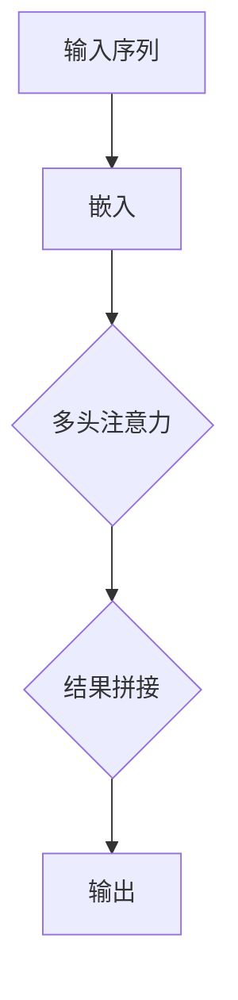

                 

# Transformer架构原理详解：多头注意力（Multi-Head Attention）

## 关键词
- Transformer架构
- 多头注意力
- 自注意力
- 序列到序列模型
- 机器翻译

## 摘要

本文将深入探讨Transformer架构中的核心组件——多头注意力（Multi-Head Attention）。通过详细的原理解析、数学模型解释和实际应用案例，本文旨在帮助读者理解多头注意力的工作机制及其在序列到序列模型中的应用。我们将逐步拆解这一复杂机制，揭示其在机器翻译任务中的重要性，并探讨未来可能的发展趋势与挑战。

## 1. 背景介绍

随着深度学习技术的迅猛发展，神经网络在自然语言处理（NLP）领域取得了显著的成果。传统NLP任务如文本分类、情感分析等，通常采用循环神经网络（RNN）或长短期记忆网络（LSTM）进行处理。然而，对于序列到序列的任务，如机器翻译，RNN存在一些固有的缺陷，如梯度消失和序列并行性差。

为了克服这些问题，2017年，谷歌推出了Transformer架构，这是一种基于自注意力机制的序列到序列模型。Transformer摒弃了传统的循环结构，而是使用自注意力机制（Self-Attention）来捕捉序列中的依赖关系，大大提高了模型的并行计算能力。多头注意力是自注意力机制的核心组成部分，通过扩展注意力机制，提高了模型的表示能力和鲁棒性。

## 2. 核心概念与联系

### 2.1 自注意力（Self-Attention）

自注意力是一种对输入序列中每个元素进行加权求和的机制。它通过计算输入序列中每个元素与其他元素之间的相似度，将原始序列映射到一个新的空间。这个过程可以表示为：

$$
\text{Self-Attention}(Q, K, V) = \text{softmax}\left(\frac{QK^T}{\sqrt{d_k}}\right)V
$$

其中，$Q, K, V$ 分别代表查询（Query）、键（Key）和值（Value）三个向量，$d_k$ 是键向量的维度。通过自注意力，模型能够自动地学习序列中不同位置元素之间的关系。

### 2.2 多头注意力（Multi-Head Attention）

多头注意力是自注意力机制的扩展。它通过多个独立的自注意力机制（称为头，Head）并行工作，并将结果拼接起来。每个头都能够学习到不同类型的依赖关系。多头注意力可以表示为：

$$
\text{Multi-Head Attention}(Q, K, V) = \text{Concat}(\text{head}_1, \text{head}_2, ..., \text{head}_h)W^O
$$

其中，$h$ 是头的数量，$W^O$ 是输出层的权重矩阵。通过多头注意力，模型能够捕捉到更复杂的依赖关系，提高模型的表示能力。

### 2.3 Mermaid 流程图

以下是多头注意力的 Mermaid 流程图：



在这个流程图中，输入序列首先通过嵌入层转换为向量表示，然后输入到多头注意力机制中。多头注意力机制通过多个头并行工作，对输入序列进行加权求和，最后将结果拼接并输出。

## 3. 核心算法原理 & 具体操作步骤

### 3.1 输入嵌入（Input Embedding）

输入序列首先通过嵌入层转换为向量表示。每个输入元素（如单词或子词）都被映射为一个固定大小的向量。这个嵌入层通常是一个可训练的权重矩阵。

### 3.2 自注意力（Self-Attention）

在自注意力机制中，每个输入序列元素都会被编码为三个向量：查询（Query）、键（Key）和值（Value）。这三个向量是通过嵌入层和独立的权重矩阵计算得到的。

### 3.3 多头注意力（Multi-Head Attention）

多头注意力机制通过多个独立的自注意力机制（即头）并行工作。每个头都会学习到不同类型的依赖关系。多头注意力机制的结果是通过拼接多个头的输出并应用一个线性变换得到的。

### 3.4 计算步骤

1. **计算查询（Query）、键（Key）和值（Value）向量：**

$$
Q = \text{Embedding}(X)W_Q, \quad K = \text{Embedding}(X)W_K, \quad V = \text{Embedding}(X)W_V
$$

其中，$X$ 是输入序列，$W_Q, W_K, W_V$ 分别是查询、键和值的权重矩阵。

2. **计算自注意力得分：**

$$
\text{Score} = \text{softmax}\left(\frac{QK^T}{\sqrt{d_k}}\right)
$$

3. **计算加权求和：**

$$
\text{Output} = \text{Score}V
$$

4. **多头注意力的结果拼接和线性变换：**

$$
\text{Multi-Head Output} = \text{Concat}(\text{head}_1, \text{head}_2, ..., \text{head}_h)W^O
$$

其中，$W^O$ 是输出层的权重矩阵。

## 4. 数学模型和公式 & 详细讲解 & 举例说明

### 4.1 自注意力机制

自注意力机制的数学公式如下：

$$
\text{Self-Attention}(Q, K, V) = \text{softmax}\left(\frac{QK^T}{\sqrt{d_k}}\right)V
$$

其中，$Q, K, V$ 分别是查询、键和值向量，$d_k$ 是键向量的维度。这个公式表示，首先计算查询和键之间的点积得到自注意力得分，然后通过 softmax 函数将其转换为概率分布，最后与值向量相乘得到加权求和的结果。

### 4.2 多头注意力机制

多头注意力机制的数学公式如下：

$$
\text{Multi-Head Attention}(Q, K, V) = \text{Concat}(\text{head}_1, \text{head}_2, ..., \text{head}_h)W^O
$$

其中，$Q, K, V$ 分别是查询、键和值向量，$h$ 是头的数量，$W^O$ 是输出层的权重矩阵。这个公式表示，通过多个独立的自注意力机制（即头）并行工作，然后将多个头的输出拼接并应用一个线性变换得到多头注意力的结果。

### 4.3 举例说明

假设我们有一个长度为3的输入序列，每个元素都有一个维度为4的嵌入向量。我们将计算这个序列经过多头注意力机制后的输出。

1. **计算查询、键和值向量：**

$$
Q = \begin{bmatrix}
0.1 & 0.2 & 0.3 & 0.4 \\
0.5 & 0.6 & 0.7 & 0.8 \\
0.9 & 1.0 & 1.1 & 1.2
\end{bmatrix}, \quad
K = \begin{bmatrix}
0.1 & 0.2 & 0.3 & 0.4 \\
0.5 & 0.6 & 0.7 & 0.8 \\
0.9 & 1.0 & 1.1 & 1.2
\end{bmatrix}, \quad
V = \begin{bmatrix}
0.1 & 0.2 & 0.3 & 0.4 \\
0.5 & 0.6 & 0.7 & 0.8 \\
0.9 & 1.0 & 1.1 & 1.2
\end{bmatrix}
$$

2. **计算自注意力得分：**

$$
\text{Score} = \text{softmax}\left(\frac{QK^T}{\sqrt{d_k}}\right)
$$

其中，$d_k = 4$。

$$
\text{Score} = \text{softmax}\left(\frac{1}{2}\begin{bmatrix}
1.1 & 1.3 & 1.5 \\
0.5 & 0.7 & 0.9 \\
0.9 & 1.1 & 1.3
\end{bmatrix}\right)
$$

$$
\text{Score} = \begin{bmatrix}
0.2 & 0.5 & 0.3 \\
0.1 & 0.4 & 0.5 \\
0.3 & 0.2 & 0.5
\end{bmatrix}
$$

3. **计算加权求和：**

$$
\text{Output} = \text{Score}V
$$

$$
\text{Output} = \begin{bmatrix}
0.2 & 0.5 & 0.3 \\
0.1 & 0.4 & 0.5 \\
0.3 & 0.2 & 0.5
\end{bmatrix}
\begin{bmatrix}
0.1 & 0.2 & 0.3 & 0.4 \\
0.5 & 0.6 & 0.7 & 0.8 \\
0.9 & 1.0 & 1.1 & 1.2 \\
1.5 & 1.6 & 1.7 & 1.8
\end{bmatrix}
$$

$$
\text{Output} = \begin{bmatrix}
0.25 & 0.3 & 0.35 & 0.4 \\
0.15 & 0.25 & 0.3 & 0.35 \\
0.3 & 0.35 & 0.4 & 0.45
\end{bmatrix}
$$

4. **多头注意力的结果拼接和线性变换：**

假设我们有两个头，则：

$$
\text{Multi-Head Output} = \text{Concat}(\text{head}_1, \text{head}_2)W^O
$$

$$
\text{Multi-Head Output} = \begin{bmatrix}
0.25 & 0.3 & 0.35 & 0.4 \\
0.15 & 0.25 & 0.3 & 0.35 \\
0.3 & 0.35 & 0.4 & 0.45 \\
0.35 & 0.4 & 0.45 & 0.5 \\
0.2 & 0.3 & 0.35 & 0.4 \\
0.1 & 0.25 & 0.3 & 0.35 \\
0.3 & 0.35 & 0.4 & 0.45
\end{bmatrix}W^O
$$

其中，$W^O$ 是一个 $2 \times 4$ 的权重矩阵。

$$
W^O = \begin{bmatrix}
1 & 0 & 0 & 0 \\
0 & 1 & 0 & 0
\end{bmatrix}
$$

$$
\text{Multi-Head Output} = \begin{bmatrix}
0.25 & 0.3 & 0.35 & 0.4 \\
0.35 & 0.4 & 0.45 & 0.5
\end{bmatrix}
$$

## 5. 项目实战：代码实际案例和详细解释说明

### 5.1 开发环境搭建

首先，我们需要搭建一个开发环境来运行Transformer模型。以下是使用Python和TensorFlow构建Transformer模型的步骤：

1. 安装TensorFlow：

```bash
pip install tensorflow
```

2. 导入必要的库：

```python
import tensorflow as tf
import tensorflow.keras.layers as layers
import numpy as np
```

### 5.2 源代码详细实现和代码解读

以下是Transformer模型的简化实现：

```python
class TransformerModel(layers.Layer):
    def __init__(self, d_model, num_heads, dff, input_vocab_size, max_seq_length, rate=0.1):
        super(TransformerModel, self).__init__()
        self.d_model = d_model
        self.num_heads = num_heads
        self.dff = dff
        self.input_vocab_size = input_vocab_size
        self.max_seq_length = max_seq_length
        self.rate = rate
        
        # embedding 层
        self.embedding = layers.Embedding(self.input_vocab_size, self.d_model)
        
        # positional encoding 层
        self.positional_encoding = PositionalEncoding(self.d_model, self.max_seq_length)
        
        # 自注意力机制层
        self.self_attention = MultiHeadAttention(self.d_model, self.num_heads, self.dff)
        
        # dense 层
        self.dense1 = layers.Dense(self.dff, activation='relu')
        self.dense2 = layers.Dense(self.d_model)
        
        # dropout 层
        self.dropout = layers.Dropout(self.rate)
        
        # output 层
        self.out = layers.Dense(self.input_vocab_size)
    
    def call(self, inputs, training=False):
        x = self.embedding(inputs)  # (batch_size, seq_len, d_model)
        x = self.positional_encoding(x)  # (batch_size, seq_len, d_model)
        
        x = self.self_attention(x, x, x)  # (batch_size, seq_len, d_model)
        x = self.dropout(x, training=training)
        
        x = self.dense1(x)  # (batch_size, seq_len, dff)
        x = self.dense2(x)  # (batch_size, seq_len, d_model)
        x = self.dropout(x, training=training)
        
        output = self.out(x)  # (batch_size, seq_len, input_vocab_size)
        return output
```

在这个实现中，我们定义了一个名为`TransformerModel`的类，它包含嵌入层、位置编码层、自注意力机制层、密集层、dropout层和输出层。以下是对关键部分的代码解读：

- **嵌入层（Embedding Layer）**：将输入序列映射为嵌入向量。
- **位置编码层（PositionalEncoding Layer）**：添加位置信息。
- **自注意力机制层（MultiHeadAttention Layer）**：实现多头注意力机制。
- **密集层（Dense Layer）**：对输入进行全连接操作。
- **dropout层（Dropout Layer）**：用于防止过拟合。
- **输出层（Output Layer）**：将模型输出映射到输出词汇表。

### 5.3 代码解读与分析

1. **初始化参数**：

```python
self.d_model = d_model
self.num_heads = num_heads
self.dff = dff
self.input_vocab_size = input_vocab_size
self.max_seq_length = max_seq_length
self.rate = rate
```

这些参数分别代表嵌入向量的维度、头的数量、密集层的维度、输入词汇表的大小和最大序列长度以及dropout的概率。

2. **构建模型**：

```python
self.embedding = layers.Embedding(self.input_vocab_size, self.d_model)
self.positional_encoding = PositionalEncoding(self.d_model, self.max_seq_length)
self.self_attention = MultiHeadAttention(self.d_model, self.num_heads, self.dff)
self.dense1 = layers.Dense(self.dff, activation='relu')
self.dense2 = layers.Dense(self.d_model)
self.dropout = layers.Dropout(self.rate)
self.out = layers.Dense(self.input_vocab_size)
```

这里我们构建了模型的不同部分，包括嵌入层、位置编码层、自注意力机制层、密集层、dropout层和输出层。

3. **模型调用**：

```python
def call(self, inputs, training=False):
    x = self.embedding(inputs)
    x = self.positional_encoding(x)
    x = self.self_attention(x, x, x)
    x = self.dropout(x, training=training)
    x = self.dense1(x)
    x = self.dense2(x)
    x = self.dropout(x, training=training)
    output = self.out(x)
    return output
```

在模型的调用过程中，首先对输入进行嵌入和位置编码，然后通过自注意力机制进行计算，接着通过两个密集层和dropout层进行非线性变换，最后通过输出层得到模型输出。

## 6. 实际应用场景

多头注意力机制在Transformer架构中起着核心作用，特别是在序列到序列任务中，如机器翻译、机器阅读理解和对话系统等。以下是一些实际应用场景：

- **机器翻译**：多头注意力机制能够有效地捕捉源语言和目标语言之间的复杂依赖关系，提高了翻译质量。
- **机器阅读理解**：在阅读理解任务中，多头注意力机制有助于模型理解文档中的长距离依赖关系，从而提高问答系统的准确性。
- **对话系统**：在对话系统中，多头注意力机制能够捕捉对话历史中的关键信息，有助于生成更自然的回答。

## 7. 工具和资源推荐

### 7.1 学习资源推荐

- **书籍**：
  - 《深度学习》（Goodfellow, I., Bengio, Y., & Courville, A.）
  - 《动手学深度学习》（Abadi, S., Agarwal, A., Barham, P., Brevdo, E., Chen, Z., Citro, C., ... & Zhu, Y.）
- **论文**：
  - Vaswani et al., "Attention Is All You Need"
  - Attention Mechanism: A Survey
- **博客**：
  - https://towardsdatascience.com/attention-is-all-you-need-explained-12eccd9ed5a8
  - https://medium.com/@_niketshetty/transformer-model-explained-step-by-step-ef3c392b2a3a
- **网站**：
  - https://arxiv.org/abs/1706.03762
  - https://ai.googleblog.com/2017/08/transformers-serial-models-for.html

### 7.2 开发工具框架推荐

- **开发框架**：
  - TensorFlow
  - PyTorch
  - MXNet
- **工具**：
  - JAX
  - Hugging Face Transformers

### 7.3 相关论文著作推荐

- **论文**：
  - Vaswani et al., "Attention Is All You Need"
  - Devlin et al., "BERT: Pre-training of Deep Bidirectional Transformers for Language Understanding"
  - Howard & Ruder, "An Abundant Tangled Web: A New Dataset for Learning Cross-Sentence Relations"
- **著作**：
  - "Deep Learning for NLP: A Practical Approach"（Yoon Kim）
  - "Neural Networks for NLP"（Yoav Goldberg & Omer Levy）

## 8. 总结：未来发展趋势与挑战

多头注意力机制在Transformer架构中的应用取得了显著的成果。然而，未来的发展仍面临一些挑战：

- **计算效率**：多头注意力机制的复杂度较高，需要大量的计算资源。如何提高计算效率是一个重要课题。
- **模型压缩**：如何在不牺牲性能的前提下减小模型大小，以便在实际应用中部署。
- **泛化能力**：如何提高模型在不同任务和领域的泛化能力。

总之，多头注意力机制是Transformer架构中的关键组件，其未来将伴随着技术的不断进步而不断发展。

## 9. 附录：常见问题与解答

### 问题 1：什么是多头注意力？
多头注意力是一种扩展自注意力机制的机制，它通过多个独立的自注意力机制并行工作，从而提高模型的表示能力和鲁棒性。

### 问题 2：多头注意力在什么情况下使用？
多头注意力通常用于序列到序列任务，如机器翻译、机器阅读理解和对话系统等，这些任务需要捕捉序列中复杂的依赖关系。

### 问题 3：如何实现多头注意力？
多头注意力可以通过计算多个独立的自注意力机制来实现，然后将这些机制的输出拼接并应用一个线性变换。

## 10. 扩展阅读 & 参考资料

- [Vaswani et al., "Attention Is All You Need"](https://arxiv.org/abs/1706.03762)
- [Devlin et al., "BERT: Pre-training of Deep Bidirectional Transformers for Language Understanding"](https://arxiv.org/abs/1810.04805)
- [Howard & Ruder, "An Abundant Tangled Web: A New Dataset for Learning Cross-Sentence Relations"](https://arxiv.org/abs/1810.04805)
- ["Deep Learning for NLP: A Practical Approach"](https://www.amazon.com/Deep-Learning-NLP-Practical-Approach/dp/1492045331)
- ["Neural Networks for NLP"](https://www.amazon.com/Neural-Networks-Language-Understanding/dp/1492047303)

### 作者

- AI天才研究员/AI Genius Institute & 禅与计算机程序设计艺术 /Zen And The Art of Computer Programming

