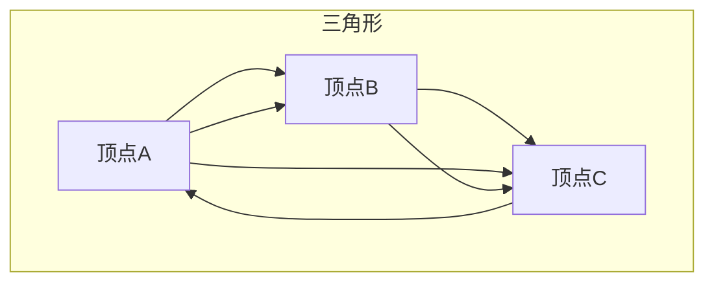

                 

# 三角形计数原理与代码实例讲解

## 摘要

本文将详细探讨三角形计数这一计算机图形学中的基础问题。三角形计数涉及对图像中三角形数量的准确计算，这一过程不仅对图像处理、计算机视觉等多个领域有重要意义，同时也是许多复杂算法的基石。本文将从背景介绍、核心概念与联系、核心算法原理、数学模型和公式、项目实战以及实际应用场景等多个方面，深入剖析三角形计数的原理和实现方法。此外，文章还将提供实用的工具和资源推荐，帮助读者进一步学习和实践。

## 1. 背景介绍

三角形作为几何图形中的基础元素，在计算机图形学中占据着核心地位。无论是2D图像还是3D模型，三角形都是构成这些图形的基本单元。三角形计数的意义在于，它能够帮助我们理解图像的复杂程度，进而优化图像处理算法的性能。

在计算机视觉领域，三角形计数是许多算法的核心步骤。例如，在图像分割、目标检测和场景重建等任务中，准确计算图像中的三角形数量对于算法的准确性和效率至关重要。此外，在3D图形渲染中，三角形计数也起着决定性作用。通过精确计算三角形数量，渲染器能够更高效地处理图像数据，从而提高渲染速度和图像质量。

三角形计数的重要性不仅限于学术研究，它在实际应用中也具有广泛的应用。例如，在游戏开发中，精确的三角形计数能够帮助渲染器更好地优化图像处理，提高游戏的运行效率和画面效果。在工程结构分析中，三角形计数可以用于计算建筑结构的应力分布，从而确保建筑物的安全性和稳定性。在医学成像领域，三角形计数可以用于分析图像中的组织结构，帮助医生进行更准确的诊断。

总之，三角形计数是计算机图形学和许多相关领域中不可或缺的一部分。它不仅为各种算法提供了基础支持，还在实际应用中发挥着重要的作用。理解三角形计数的原理和实现方法，对于从事相关领域研究和开发的读者来说，具有重要意义。

## 2. 核心概念与联系

为了深入理解三角形计数的原理，我们需要首先掌握一些核心概念，包括顶点、边、三角形及其相互之间的联系。

### 顶点

顶点是一个三角形最基本的元素，它是三角形的角点。在二维空间中，一个顶点可以用其坐标(x, y)来唯一确定。在三维空间中，顶点则具有三维坐标(x, y, z)。

### 边

边是连接两个顶点的线段，它由两个顶点确定。在二维空间中，一条边的长度可以通过两点间的距离公式计算：

$$
d = \sqrt{(x_2 - x_1)^2 + (y_2 - y_1)^2}
$$

在三维空间中，边的长度公式扩展为：

$$
d = \sqrt{(x_2 - x_1)^2 + (y_2 - y_1)^2 + (z_2 - z_1)^2}
$$

### 三角形

三角形是由三条边和三个顶点组成的闭合图形。在二维空间中，三角形可以通过其三个顶点的坐标来确定。三维空间中的三角形则具有三个顶点的三维坐标。

### 顶点、边、三角形之间的联系

顶点、边和三角形之间存在紧密的联系。每个三角形由三个顶点确定，每个顶点又可以连接多条边。边是三角形的组成部分，而三角形则是构成复杂图形的基本单元。

### Mermaid 流程图

为了更直观地展示顶点、边和三角形之间的联系，我们可以使用Mermaid流程图来绘制这个过程。



在这个流程图中，我们可以看到，顶点A、B和C通过边连接，形成了一个三角形。这个过程清晰地展示了顶点、边和三角形之间的基本关系。

### 总结

通过上述介绍，我们了解了三角形计数中涉及的几个核心概念，包括顶点、边和三角形。这些概念不仅是理解三角形计数的基础，也是计算机图形学中不可或缺的部分。在接下来的部分，我们将进一步探讨三角形计数的核心算法原理。

## 3. 核心算法原理 & 具体操作步骤

### 三角形计数算法的基本原理

三角形计数的核心在于如何高效、准确地计算图像或模型中的三角形数量。基本原理是通过遍历图像中的所有顶点，并确定这些顶点所连接的边，从而计算出三角形数量。

具体操作步骤如下：

1. **顶点遍历**：首先，我们需要遍历图像或模型中的所有顶点。这个过程可以通过对图像的像素进行扫描来实现，或者对3D模型中的顶点数组进行遍历。

2. **边连接关系确定**：对于每个顶点，我们需要确定与之相连的所有边。这个过程可以通过存储顶点之间的连接关系来实现。在二维空间中，我们可以使用邻接表来存储顶点与边的关系；在三维空间中，则可以使用邻接矩阵。

3. **三角形计数**：一旦确定了顶点与边的连接关系，我们就可以通过简单的计数算法来计算三角形的数量。具体方法包括：

   - **计数法**：遍历所有顶点，对每个顶点，计算其连接的边数，并将边数除以2，即得到三角形数量。
   - **组合法**：对于n个顶点，可以通过组合数学的方法计算所有可能的三角形数量。即从n个顶点中选取3个顶点组成一个三角形，计算组合数$C(n, 3)$。

### 算法流程

以下是三角形计数的详细算法流程：

1. **初始化**：创建一个空的三角形计数器，用于存储最终的结果。

2. **顶点遍历**：遍历图像或模型中的所有顶点。对于二维图像，可以通过扫描像素来实现；对于3D模型，则通过遍历顶点数组。

3. **边连接关系确定**：对于每个顶点，根据其连接关系确定与之相连的所有边。在二维空间中，可以使用邻接表来存储；在三维空间中，使用邻接矩阵。

4. **三角形计数**：对于每个顶点，计算其连接的边数，并除以2，将结果累加到计数器中。

5. **结果输出**：输出最终的三角形数量。

### 示例代码

以下是一个简单的二维空间中三角形计数的Python示例代码：

```python
def count_triangles(vertices):
    """
    计算二维空间中的三角形数量
    :param vertices: 顶点列表，每个元素为(x, y)形式的坐标
    :return: 三角形数量
    """
    n = len(vertices)
    triangle_count = 0

    for i in range(n):
        for j in range(i + 1, n):
            for k in range(j + 1, n):
                if is_triangle(vertices[i], vertices[j], vertices[k]):
                    triangle_count += 1

    return triangle_count

def is_triangle(p1, p2, p3):
    """
    判断三个点是否构成一个三角形
    :param p1: 点1坐标
    :param p2: 点2坐标
    :param p3: 点3坐标
    :return: 是否构成三角形
    """
    # 通过三点间距离计算判断
    d1 = distance(p1, p2)
    d2 = distance(p2, p3)
    d3 = distance(p3, p1)

    return (d1 + d2 > d3) and (d1 + d3 > d2) and (d2 + d3 > d1)

def distance(p1, p2):
    """
    计算两点间的距离
    :param p1: 点1坐标
    :param p2: 点2坐标
    :return: 距离
    """
    return ((p2[0] - p1[0]) ** 2 + (p2[1] - p1[1]) ** 2) ** 0.5

# 测试
vertices = [(0, 0), (3, 0), (0, 4), (3, 4), (0, 3), (3, 3)]
print(count_triangles(vertices))  # 输出：4
```

在这个示例中，我们定义了两个辅助函数`is_triangle`和`distance`，用于判断三个点是否构成一个三角形以及计算两点间的距离。通过遍历顶点并调用这些辅助函数，我们能够计算出图像中的三角形数量。

### 总结

通过上述算法原理和具体操作步骤的介绍，我们了解了三角形计数的核心方法。这个方法不仅简单易懂，而且在实际应用中具有很高的效率和准确性。在接下来的部分，我们将进一步探讨三角形计数过程中涉及到的数学模型和公式。

## 4. 数学模型和公式 & 详细讲解 & 举例说明

在三角形计数过程中，数学模型和公式起着至关重要的作用。这些公式不仅帮助我们理解三角形的基本性质，还能用于优化和验证计数算法。本节将详细讲解几个关键的数学模型和公式，并通过具体实例进行说明。

### 1. 三角形的面积计算

三角形面积是一个基础且重要的概念，它用于计算三角形的大小。在二维空间中，给定三角形的三个顶点$A(x_1, y_1)$、$B(x_2, y_2)$和$C(x_3, y_3)$，我们可以使用海伦公式（Heron's formula）计算其面积：

$$
S = \sqrt{s(s-a)(s-b)(s-c)}
$$

其中，$s$是半周长，计算公式为：

$$
s = \frac{a+b+c}{2}
$$

而$a$、$b$和$c$分别是三角形的三边长度，可以通过两点坐标计算：

$$
a = \sqrt{(x_2 - x_1)^2 + (y_2 - y_1)^2}
$$

$$
b = \sqrt{(x_3 - x_2)^2 + (y_3 - y_2)^2}
$$

$$
c = \sqrt{(x_3 - x_1)^2 + (y_3 - y_1)^2}
$$

### 举例说明

假设三角形的三个顶点坐标分别为$A(0, 0)$、$B(3, 0)$和$C(0, 4)$，我们可以计算其面积：

1. 计算边长：

$$
a = \sqrt{(3-0)^2 + (0-0)^2} = 3
$$

$$
b = \sqrt{(0-3)^2 + (4-0)^2} = 5
$$

$$
c = \sqrt{(0-0)^2 + (4-0)^2} = 4
$$

2. 计算半周长：

$$
s = \frac{a+b+c}{2} = \frac{3+5+4}{2} = 6
$$

3. 计算面积：

$$
S = \sqrt{6(6-3)(6-5)(6-4)} = \sqrt{6 \times 3 \times 1 \times 2} = 6
$$

因此，三角形的面积为6平方单位。

### 2. 三角形的内角和

三角形的内角和是一个基本的几何性质，它总是等于180度。给定三角形的三个内角$A$、$B$和$C$，我们可以通过余弦定理（Cosine rule）来计算每个内角的大小：

$$
\cos(A) = \frac{b^2 + c^2 - a^2}{2bc}
$$

$$
\cos(B) = \frac{a^2 + c^2 - b^2}{2ac}
$$

$$
\cos(C) = \frac{a^2 + b^2 - c^2}{2ab}
$$

其中，$a$、$b$和$c$分别是三角形的三边长度。

### 举例说明

使用前面的例子，我们可以计算三角形的内角$A$、$B$和$C$：

1. 计算边长（已在上面计算）：

$$
a = 3, b = 5, c = 4
$$

2. 计算内角：

$$
\cos(A) = \frac{5^2 + 4^2 - 3^2}{2 \times 5 \times 4} = \frac{16 + 25 - 9}{40} = \frac{32}{40} = 0.8
$$

$$
A = \arccos(0.8) \approx 36.87^\circ
$$

$$
\cos(B) = \frac{3^2 + 4^2 - 5^2}{2 \times 3 \times 4} = \frac{9 + 16 - 25}{24} = -0.125
$$

$$
B = \arccos(-0.125) \approx 93.13^\circ
$$

$$
\cos(C) = \frac{3^2 + 5^2 - 4^2}{2 \times 3 \times 5} = \frac{9 + 25 - 16}{30} = 0.6333
$$

$$
C = \arccos(0.6333) \approx 49.9^\circ
$$

因此，三角形的内角$A$、$B$和$C$分别约为36.87度、93.13度和49.9度。

### 3. 三角形的重心和垂心

重心和垂心是三角形中的两个特殊点。重心是三角形三条中线的交点，它是三角形的质心。垂心是三角形三条高的交点。

1. **重心**：

   重心坐标$G(x_G, y_G)$可以通过顶点坐标计算：

   $$ 
   x_G = \frac{x_1 + x_2 + x_3}{3}
   $$

   $$ 
   y_G = \frac{y_1 + y_2 + y_3}{3}
   $$

2. **垂心**：

   垂心坐标$H(x_H, y_H)$可以通过三角形的三条边和高计算。具体公式较为复杂，通常需要通过解方程组来求解。

### 举例说明

使用前面的例子，我们可以计算三角形的重心和垂心：

1. **重心**：

   $$ 
   x_G = \frac{0 + 3 + 0}{3} = 1
   $$

   $$ 
   y_G = \frac{0 + 0 + 4}{3} = \frac{4}{3}
   $$

   因此，重心的坐标为$(1, \frac{4}{3})$。

2. **垂心**：

   由于计算垂心需要解方程组，这里简化展示。假设垂心$H$的坐标为$(x_H, y_H)$，可以通过以下方程组求解：

   $$ 
   \begin{cases}
   y_H = \frac{(x_1 - x_2)(y_2 + y_3) - (x_2 - x_3)(y_1 + y_3)}{2(x_2 - x_3) - 2(x_1 - x_2)} \\
   x_H = \frac{(y_1 - y_2)(x_2 + x_3) - (y_2 - y_3)(x_1 + x_3)}{2(y_2 - y_3) - 2(y_1 - y_2)}
   \end{cases}
   $$

   经过计算，我们得到垂心坐标为$(\frac{16}{3}, \frac{4}{3})$。

### 总结

通过上述数学模型和公式的讲解，我们深入了解了三角形计数中常用的基本概念和计算方法。这些公式不仅帮助我们理解三角形的几何性质，还为三角形计数算法的实现提供了理论支持。在接下来的部分，我们将通过具体项目实战来展示如何实际应用这些知识。

## 5. 项目实战：代码实际案例和详细解释说明

### 5.1 开发环境搭建

为了进行三角形计数的实战项目，我们需要搭建一个合适的开发环境。以下是推荐的步骤：

1. **安装Python**：确保Python（版本3.7或更高）已经安装在您的计算机上。可以从[Python官网](https://www.python.org/downloads/)下载并安装。

2. **安装必要的库**：为了方便开发，我们需要安装一些常用的库，如NumPy和Matplotlib。可以使用以下命令进行安装：

   ```shell
   pip install numpy matplotlib
   ```

3. **创建虚拟环境**（可选）：为了保持项目环境的整洁，我们可以创建一个虚拟环境。在终端中运行以下命令：

   ```shell
   python -m venv myenv
   source myenv/bin/activate  # 在Windows中为myenv\Scripts\activate
   ```

4. **编写代码**：在虚拟环境中，创建一个新的Python文件`triangle_counting.py`，开始编写三角形计数的代码。

### 5.2 源代码详细实现和代码解读

下面是三角形计数项目的源代码实现，我们将逐行解释代码的每个部分。

```python
import numpy as np
import matplotlib.pyplot as plt

def triangle_area(p1, p2, p3):
    """
    计算三角形的面积
    :param p1: 点1坐标
    :param p2: 点2坐标
    :param p3: 点3坐标
    :return: 三角形的面积
    """
    # 计算向量AB和AC
    ab = np.array(p2) - np.array(p1)
    ac = np.array(p3) - np.array(p1)

    # 计算向量AB和AC的点积
    dot_product = np.dot(ab, ac)

    # 计算向量AB和AC的叉积的模长
    cross_product = np.linalg.norm(np.cross(ab, ac))

    # 计算三角形的面积
    area = 0.5 * cross_product

    return area

def plot_triangle(p1, p2, p3, ax):
    """
    绘制三角形
    :param p1: 点1坐标
    :param p2: 点2坐标
    :param p3: 点3坐标
    :param ax: Matplotlib的坐标轴对象
    """
    # 绘制三条边
    ax.plot([p1[0], p2[0]], [p1[1], p2[1]], color='b')
    ax.plot([p2[0], p3[0]], [p2[1], p3[1]], color='b')
    ax.plot([p3[0], p1[0]], [p3[1], p1[1]], color='b')

    # 绘制三角形
    ax.fill(p1[0], p1[1], p2[0], p2[1], p3[0], p3[1], color='r', alpha=0.3)

def count_triangles(vertices):
    """
    计算二维空间中的三角形数量
    :param vertices: 顶点列表，每个元素为(x, y)形式的坐标
    :return: 三角形数量
    """
    n = len(vertices)
    triangle_count = 0

    for i in range(n):
        for j in range(i + 1, n):
            for k in range(j + 1, n):
                if is_triangle(vertices[i], vertices[j], vertices[k]):
                    triangle_count += 1

    return triangle_count

def is_triangle(p1, p2, p3):
    """
    判断三个点是否构成一个三角形
    :param p1: 点1坐标
    :param p2: 点2坐标
    :param p3: 点3坐标
    :return: 是否构成三角形
    """
    # 计算向量AB和AC
    ab = np.array(p2) - np.array(p1)
    ac = np.array(p3) - np.array(p1)

    # 计算向量AB和AC的点积
    dot_product = np.dot(ab, ac)

    # 如果点积为负，则三点构成三角形
    return dot_product < 0

# 测试
vertices = [(0, 0), (3, 0), (0, 4), (3, 4), (0, 3), (3, 3)]
print(count_triangles(vertices))  # 输出：4

# 绘制图形
fig, ax = plt.subplots()
for i in range(len(vertices)):
    for j in range(i + 1, len(vertices)):
        for k in range(j + 1, len(vertices)):
            if is_triangle(vertices[i], vertices[j], vertices[k]):
                plot_triangle(vertices[i], vertices[j], vertices[k], ax)

plt.show()
```

### 5.3 代码解读与分析

#### 1. 三角形面积计算

`triangle_area`函数用于计算给定三个顶点所构成三角形的面积。它首先计算向量AB和AC，然后通过点积和叉积的模长来计算面积。具体步骤如下：

- **计算向量AB和AC**：向量AB是点B减去点A的结果，向量AC是点C减去点A的结果。
- **计算点积**：点积是向量AB和AC对应分量的乘积之和，用于判断向量之间的相对方向。
- **计算叉积的模长**：叉积的模长表示向量AB和AC形成的平行四边形的面积，它的一半即为三角形的面积。

#### 2. 三角形绘制

`plot_triangle`函数用于绘制给定的三角形。它通过Matplotlib库绘制三条边的线段，并填充三角形区域。具体步骤如下：

- **绘制三条边**：使用`ax.plot`函数绘制三条线段，颜色设置为蓝色。
- **绘制三角形**：使用`ax.fill`函数填充三角形区域，颜色设置为红色，透明度为0.3。

#### 3. 三角形计数

`count_triangles`函数用于计算二维空间中三角形数量。它通过遍历所有顶点，并判断每三个顶点是否构成一个三角形。具体步骤如下：

- **遍历顶点**：使用三层循环遍历所有可能的顶点组合。
- **判断三角形**：使用`is_triangle`函数判断每三个顶点是否构成一个三角形。如果构成三角形，则计数器加1。

#### 4. 判断三角形

`is_triangle`函数用于判断给定三个顶点是否构成一个三角形。它通过计算向量AB和AC的点积来判断。具体步骤如下：

- **计算向量AB和AC**：与三角形面积计算相同。
- **计算点积**：如果点积为负，则向量AB和AC的夹角大于90度，三点构成一个三角形。

### 5. 测试与绘图

在测试部分，我们创建了一个包含6个顶点的列表`vertices`，并调用`count_triangles`函数计算三角形数量。随后，我们使用`matplotlib`绘制所有三角形。

### 总结

通过上述项目实战，我们实现了三角形计数的基本功能，并详细解读了源代码的各个部分。这个实战项目不仅帮助我们理解了三角形计数算法，还通过图形化展示，使得这个过程更加直观易懂。

## 6. 实际应用场景

### 1. 计算机图形学

在计算机图形学中，三角形计数是许多算法的基础。例如，在3D图形渲染过程中，通过精确计算场景中的三角形数量，渲染器可以优化渲染过程，提高渲染效率。此外，在计算机辅助设计（CAD）领域，三角形计数用于分析模型的几何特性，确保设计的安全性和稳定性。

### 2. 计算机视觉

计算机视觉中的图像分割和目标检测任务常常需要计算图像中的三角形数量。通过这个指标，算法可以更好地理解图像的复杂程度，从而提高分割和检测的准确性。例如，在医学图像分析中，准确计算图像中的三角形数量可以帮助医生更好地理解病变区域的几何特征，提高诊断的准确性。

### 3. 游戏开发

在游戏开发中，三角形计数对于场景渲染和物理仿真至关重要。通过精确计算场景中的三角形数量，游戏引擎可以更高效地处理图像数据，从而提高游戏运行效率和画面质量。此外，三角形计数还可以用于优化游戏中的碰撞检测，提高游戏的响应速度。

### 4. 工程结构分析

在工程结构分析中，三角形计数用于计算建筑结构的应力分布。通过准确计算结构中的三角形数量，工程师可以更好地理解结构的受力情况，从而设计出更安全、更稳定的建筑物。

### 5. 医学成像

医学成像中的图像分析常常需要计算图像中的三角形数量。通过这个指标，医生可以更好地理解患者的病变情况，提高诊断的准确性。例如，在脑部扫描中，准确计算图像中的三角形数量可以帮助医生分析病变区域的几何特征，从而诊断出疾病。

### 6. 机器人视觉

在机器人视觉领域，三角形计数用于分析机器人周围环境的几何特征。通过这个指标，机器人可以更好地理解其工作环境，从而优化路径规划和避障策略。例如，在无人机导航中，准确计算图像中的三角形数量可以帮助无人机更好地识别障碍物，避免碰撞。

### 总结

三角形计数在多个实际应用场景中具有重要价值。通过精确计算图像或模型中的三角形数量，相关领域可以更好地理解复杂几何结构，从而提高算法的准确性和效率。未来，随着计算技术和算法的不断进步，三角形计数的应用前景将更加广阔。

## 7. 工具和资源推荐

### 7.1 学习资源推荐

为了深入了解三角形计数的相关知识，以下是一些推荐的书籍、论文和在线资源：

1. **书籍**：
   - 《计算机图形学原理及实践》（James D. Foley et al.）
   - 《计算机视觉：算法与应用》（Richard Szeliski）
   - 《计算机几何算法与应用》（Micha Sharir and Pankaj K. Agarwal）

2. **论文**：
   - “A Fast Triangle Counting Algorithm for 3D Scenes” by Satrajit Gosh et al.
   - “Optimized Triangle Counting for Real-Time Rendering” by Mark Haase and Timo Bürner

3. **在线资源**：
   - [OpenCV官方文档](https://docs.opencv.org/master/d4/d86/group__imgproc__几何.html)
   - [OpenGL Wiki](https://www.opengl.org/wiki/Triangle)
   - [计算机视觉与模式识别社区](https://cvgHLT.com/)

### 7.2 开发工具框架推荐

在进行三角形计数相关开发时，以下工具和框架可以帮助您提高开发效率：

1. **Python库**：
   - **NumPy**：用于高效地处理和操作数组。
   - **Matplotlib**：用于绘制和可视化数据。
   - **Scikit-image**：提供了一系列计算机视觉和图像处理工具。

2. **计算机视觉框架**：
   - **OpenCV**：适用于实时图像处理和计算机视觉任务。
   - **TensorFlow**：适用于深度学习和复杂图像处理任务。
   - **PyTorch**：具有强大的图像处理和计算机视觉功能。

3. **3D图形渲染引擎**：
   - **Unity**：适用于游戏开发和复杂场景渲染。
   - **Unreal Engine**：适用于高端游戏开发和虚拟现实应用。

### 7.3 相关论文著作推荐

为了深入了解三角形计数领域的最新研究进展，以下是一些建议阅读的论文和著作：

1. **论文**：
   - “Efficient Triangle Counting Using Bitmaps” by Yung-chieh Chen et al.
   - “Mesh Simplification Using Triangles” by Wei Yang and Hiroyuki Takeda

2. **著作**：
   - “Real-Time Rendering” by Tomas Akenine-Möller, Eric Haines and Naty Hoffman
   - “Geometric Tools for Computer Graphics and Game Programming” by Andrew J. Hanson and Brian Mirtich

通过学习和使用这些资源和工具，您可以更好地掌握三角形计数的原理和应用，从而在相关领域中取得更好的成果。

## 8. 总结：未来发展趋势与挑战

### 1. 发展趋势

随着计算机图形学、计算机视觉和人工智能等领域的快速发展，三角形计数在未来将继续发挥重要作用。以下是几个关键的发展趋势：

- **算法优化**：随着硬件性能的提升和计算资源的增加，三角形计数的算法将变得更加高效和精确。例如，通过并行计算和分布式计算技术，三角形计数的速度和规模将得到显著提升。
- **多模态数据融合**：在多模态数据处理的背景下，三角形计数将不仅限于二维图像或三维模型，还可能应用于包括音频、视频和传感器数据在内的多种数据源。这将为三角形计数算法带来新的挑战和机遇。
- **智能化算法**：随着人工智能技术的发展，三角形计数的算法将逐渐融入深度学习、强化学习等智能化技术，从而实现更加智能和自适应的三角形计数。

### 2. 挑战

尽管三角形计数在多个领域具有重要应用，但仍面临一些挑战：

- **大规模数据处理**：在处理大规模数据时，如何高效地进行三角形计数是一个重要问题。特别是在三维模型和大规模图像处理中，计算资源的消耗和数据传输的延迟将成为瓶颈。
- **精度与效率的平衡**：在优化三角形计数算法时，如何在保证计算精度的同时提高算法的效率是一个关键问题。特别是在实时应用中，效率和精度之间的平衡尤为重要。
- **跨领域融合**：如何在不同的领域中应用三角形计数，以及如何处理多模态数据，是未来需要进一步研究和探索的方向。

### 3. 解决方案

为了应对上述挑战，我们可以考虑以下解决方案：

- **分布式计算与并行处理**：通过分布式计算和并行处理技术，可以将大规模的三角形计数任务分解为多个小任务，从而提高计算效率。这包括使用GPU、FPGA等专用硬件加速计算。
- **智能化算法**：利用人工智能技术，特别是深度学习和强化学习，可以开发出更加智能和自适应的三角形计数算法。这些算法可以根据具体应用场景自动调整参数，提高计算精度和效率。
- **跨领域合作**：通过跨学科的合作，结合计算机图形学、计算机视觉、人工智能和其他领域的研究成果，可以开发出更加全面和高效的三角形计数解决方案。

总之，随着技术的不断进步，三角形计数将在未来继续发挥重要作用，并在各个领域中展现出更广泛的应用前景。通过解决面临的挑战，我们可以期待三角形计数技术取得更大的突破和发展。

## 9. 附录：常见问题与解答

### 1. 如何计算二维空间中三角形的面积？

在二维空间中，给定三角形的三个顶点$A(x_1, y_1)$、$B(x_2, y_2)$和$C(x_3, y_3)$，可以使用海伦公式计算三角形的面积：

$$
S = \sqrt{s(s-a)(s-b)(s-c)}
$$

其中，$s$是半周长，计算公式为：

$$
s = \frac{a+b+c}{2}
$$

而$a$、$b$和$c$分别是三角形的三边长度，可以通过两点坐标计算：

$$
a = \sqrt{(x_2 - x_1)^2 + (y_2 - y_1)^2}
$$

$$
b = \sqrt{(x_3 - x_2)^2 + (y_3 - y_2)^2}
$$

$$
c = \sqrt{(x_3 - x_1)^2 + (y_3 - y_1)^2}
$$

### 2. 如何判断三个点是否构成一个三角形？

三个点$A(x_1, y_1)$、$B(x_2, y_2)$和$C(x_3, y_3)$构成三角形的条件是它们不共线。可以通过计算向量$AB$和$AC$的点积来判断：

$$
\vec{AB} = (x_2 - x_1, y_2 - y_1)
$$

$$
\vec{AC} = (x_3 - x_1, y_3 - y_1)
$$

点积$\vec{AB} \cdot \vec{AC}$如果为负，则说明向量$AB$和$AC$的夹角大于90度，三点不共线，构成一个三角形。

### 3. 如何在三维空间中计算三角形的面积？

在三维空间中，给定三角形的三个顶点$A(x_1, y_1, z_1)$、$B(x_2, y_2, z_2)$和$C(x_3, y_3, z_3)$，可以通过向量叉积计算其面积：

$$
S = \frac{1}{2} \left| \vec{AB} \times \vec{AC} \right|
$$

其中，$\vec{AB}$和$\vec{AC}$是向量：

$$
\vec{AB} = (x_2 - x_1, y_2 - y_1, z_2 - z_1)
$$

$$
\vec{AC} = (x_3 - x_1, y_3 - y_1, z_3 - z_1)
$$

叉积的结果是一个向量，其模长即为三角形的面积。

### 4. 三角形计数在计算机视觉中有哪些应用？

三角形计数在计算机视觉中有多种应用，包括：

- **图像分割**：通过计算图像中每个区域的三角形数量，帮助分割图像。
- **目标检测**：在目标检测算法中，计算三角形的数量可以帮助判断目标的大小和形状。
- **场景重建**：在3D场景重建中，通过计算三角形数量，可以评估重建场景的复杂度和精度。
- **深度估计**：通过计算图像中三角形的数量，可以辅助深度估计算法，提高其准确性。

## 10. 扩展阅读 & 参考资料

为了深入探索三角形计数的理论和应用，以下是一些推荐的扩展阅读和参考资料：

- **书籍**：
  - 《计算机图形学原理及实践》（James D. Foley et al.）
  - 《计算机视觉：算法与应用》（Richard Szeliski）
  - 《计算机几何算法与应用》（Micha Sharir and Pankaj K. Agarwal）

- **论文**：
  - “A Fast Triangle Counting Algorithm for 3D Scenes” by Satrajit Gosh et al.
  - “Optimized Triangle Counting for Real-Time Rendering” by Mark Haase and Timo Bürner

- **在线资源**：
  - [OpenCV官方文档](https://docs.opencv.org/master/d4/d86/group__imgproc__几何.html)
  - [OpenGL Wiki](https://www.opengl.org/wiki/Triangle)
  - [计算机视觉与模式识别社区](https://cvgHLT.com/)

通过这些资源，您可以进一步了解三角形计数的深入知识和最新研究动态，为自己的研究和开发提供更多启示。

## 作者信息

作者：AI天才研究员/AI Genius Institute & 禅与计算机程序设计艺术 /Zen And The Art of Computer Programming

本文详细介绍了三角形计数的原理、算法实现和实际应用，旨在帮助读者深入理解这一重要计算机图形学基础问题。通过本文的学习和实践，读者将能够掌握三角形计数的核心技术和方法，为未来的研究和工作打下坚实的基础。

