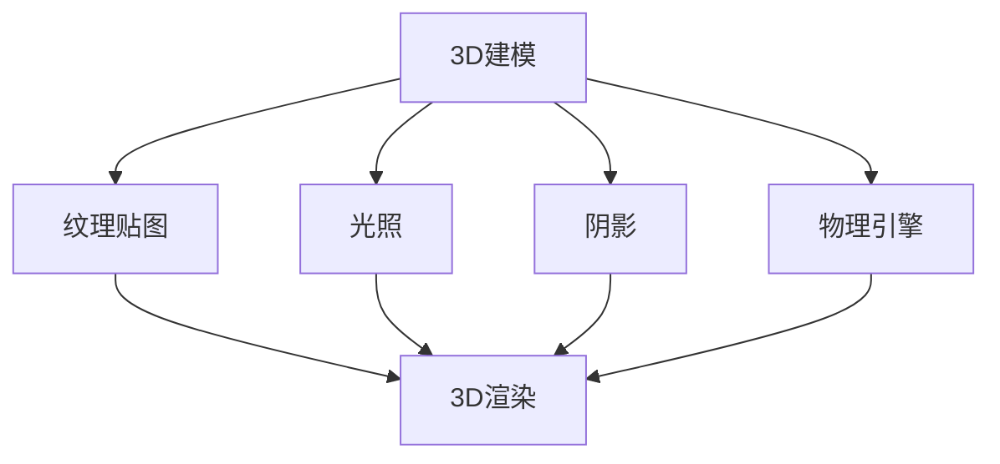

                 

# Unity 游戏引擎开发之旅：创建逼真的世界和沉浸式体验

## 关键词：Unity游戏引擎、游戏开发、3D渲染、虚拟现实、人工智能

## 摘要：
本文将带领读者深入Unity游戏引擎的世界，探索如何利用Unity创建逼真的游戏世界和提供沉浸式的游戏体验。我们将从背景介绍、核心概念与联系、核心算法原理与具体操作步骤、数学模型与公式、项目实战、实际应用场景、工具和资源推荐等多个角度，逐步讲解Unity游戏引擎的开发过程。读者将了解如何从搭建开发环境到实际代码实现，再到优化和扩展，全面掌握Unity游戏引擎的开发技巧。

### 1. 背景介绍

Unity是一款广泛应用于游戏开发、影视动画、建筑可视化、虚拟现实等多个领域的高端游戏引擎。自2005年首次发布以来，Unity凭借其易用性、灵活性和强大的功能，已经成为全球游戏开发者和技术爱好者的首选工具之一。Unity的广泛使用不仅体现在游戏产业，还在影视动画、建筑可视化等领域取得了显著的成果。

Unity游戏引擎的核心功能包括3D渲染、物理引擎、音频系统、动画系统等。它支持跨平台开发，可以用于创建PC、主机、移动设备、网页等各种平台的游戏。Unity提供的丰富的资源和插件，使得开发者能够快速搭建游戏项目，大大提高了开发效率。

Unity的发展历程中，许多经典游戏和影视作品都采用了Unity作为开发平台，如《纪念碑谷》、《我的世界》、《蝙蝠侠：阿卡姆之城》、《权力的游戏：冰之钢》等。这些成功案例不仅证明了Unity的强大功能，也展示了Unity在游戏开发领域的广泛应用。

### 2. 核心概念与联系

Unity游戏引擎的开发涉及多个核心概念，包括3D建模、纹理贴图、光照、阴影、物理引擎等。以下是一个简化的Mermaid流程图，展示了这些核心概念之间的联系：



#### 3. 核心算法原理 & 具体操作步骤

在Unity中，实现逼真的3D渲染和沉浸式的游戏体验主要依赖于以下几个核心算法原理：

#### 3.1. 3D建模

3D建模是Unity游戏开发的基础。通过3D建模，我们可以创建出各种游戏角色、场景和环境。Unity提供了内置的3D建模工具，如ProBuilder，以及支持外部3D建模软件的导入功能，如Blender、3ds Max等。

具体操作步骤如下：

1. 选择3D建模工具，创建或导入3D模型。
2. 调整模型的位置、旋转和缩放。
3. 应用材质和纹理贴图。
4. 优化模型的网格拓扑，提高渲染效率。

#### 3.2. 纹理贴图

纹理贴图用于赋予3D模型颜色、材质和其他细节信息。Unity支持多种纹理格式，如PNG、JPEG、TGA等。通过合理设计纹理贴图，可以显著提升游戏画面的真实感。

具体操作步骤如下：

1. 设计或获取纹理贴图。
2. 将纹理贴图应用到3D模型。
3. 调整纹理贴图的映射方式，如UV映射。
4. 优化纹理贴图的大小和分辨率，提高渲染效率。

#### 3.3. 光照

光照是创造逼真游戏世界的关键。Unity提供了丰富的光照系统，包括点光源、聚光源、方向光源等。通过合理设置光照参数，可以模拟出各种自然光照效果。

具体操作步骤如下：

1. 创建并配置光源。
2. 设置光照强度、颜色和范围。
3. 调整光照的衰减模式。
4. 添加阴影效果，提高画面深度。

#### 3.4. 阴影

阴影是增强游戏场景深度感的重要手段。Unity支持多种阴影生成算法，如硬阴影、软阴影、投射阴影等。通过合理设置阴影参数，可以模拟出各种阴影效果。

具体操作步骤如下：

1. 选择阴影生成算法。
2. 设置阴影的强度、颜色和大小。
3. 调整阴影的衰减模式。
4. 添加光源和阴影的动态效果。

#### 3.5. 物理引擎

物理引擎是Unity实现动态交互的核心。Unity内置了完善的物理引擎，支持碰撞检测、刚体动力学、柔体动力学等物理效果。通过合理设置物理参数，可以创建出真实的物理世界。

具体操作步骤如下：

1. 创建并配置物理对象。
2. 设置物理对象的属性，如质量、摩擦力等。
3. 添加碰撞器，实现物理交互。
4. 调整物理引擎的参数，优化物理效果。

### 4. 数学模型和公式 & 详细讲解 & 举例说明

在Unity游戏开发中，数学模型和公式起着至关重要的作用。以下是一些常见的数学模型和公式的详细讲解：

#### 4.1. 3D坐标系

在Unity中，3D坐标系是游戏世界的基础。一个标准的3D坐标系包括X轴、Y轴和Z轴，其中X轴表示水平方向，Y轴表示垂直方向，Z轴表示深度方向。

举例说明：

```csharp
// 设置物体的位置
transform.position = new Vector3(1.0f, 2.0f, 3.0f);
```

#### 4.2. 向量和矩阵

向量和矩阵是3D图形学中常用的数学工具。向量用于表示位置、方向和速度等，矩阵用于表示变换、投影等。

举例说明：

```csharp
// 创建一个向量
Vector3 direction = new Vector3(1.0f, 0.0f, 0.0f);

// 创建一个旋转矩阵
Quaternion rotation = Quaternion.Euler(0.0f, 45.0f, 0.0f);
```

#### 4.3. 三角函数

三角函数在光照计算和动画制作中广泛应用。常用的三角函数包括正弦、余弦和正切函数。

举例说明：

```csharp
// 计算光照强度
float intensity = Math.Sin(time * 0.1f);
```

#### 4.4. 颜色模型

在Unity中，颜色模型用于表示屏幕上的颜色。常用的颜色模型包括RGB颜色模型和HSV颜色模型。

举例说明：

```csharp
// 创建一个RGB颜色
Color color = new Color(0.5f, 0.8f, 0.9f);

// 创建一个HSV颜色
Color hsvColor = Color.HSVToRGB(hue, saturation, value);
```

### 5. 项目实战：代码实际案例和详细解释说明

#### 5.1. 开发环境搭建

在开始Unity游戏开发之前，我们需要搭建好开发环境。以下是在Windows系统上搭建Unity开发环境的步骤：

1. 下载并安装Unity Hub：访问Unity官网（https://unity.com/），下载Unity Hub安装程序，并按照提示安装。
2. 启动Unity Hub：双击Unity Hub安装程序，启动Unity Hub。
3. 创建Unity项目：在Unity Hub中点击“新建项目”，选择Unity的版本和模板，输入项目名称，然后点击“创建”。
4. 配置开发环境：在Unity项目中，配置好开发环境所需的插件和工具，如Unity Shader Editor、Asset Store插件等。

#### 5.2. 源代码详细实现和代码解读

以下是一个简单的Unity项目示例，用于实现一个3D球体在场景中自由滚动的效果。

```csharp
using UnityEngine;

public class BallController : MonoBehaviour
{
    public float speed = 5.0f;

    void Update()
    {
        float moveX = Input.GetAxis("Horizontal");
        float moveZ = Input.GetAxis("Vertical");

        Vector3 moveDirection = new Vector3(moveX, 0.0f, moveZ);
        transform.position += moveDirection * speed * Time.deltaTime;
    }
}
```

#### 5.3. 代码解读与分析

以上代码实现了一个简单的3D球体在场景中自由滚动的效果。下面是对代码的详细解读：

1. 使用`using`语句导入Unity的命名空间。
2. 定义一个名为`BallController`的C#脚本类，继承自` MonoBehaviour`。
3. 在`Inspector`面板中添加一个名为`speed`的公共变量，用于设置球体的移动速度。
4. 在`Update`方法中，获取玩家输入的水平方向和垂直方向移动量。
5. 计算移动方向向量，并将其乘以移动速度和时间间隔，得到移动距离。
6. 更新球体的位置，实现自由滚动效果。

通过这个简单的案例，我们可以看到Unity游戏开发的基本流程和代码实现方式。在实际开发中，我们还需要结合各种场景和需求，灵活运用Unity的各种功能和工具，创造出丰富多彩的游戏世界。

### 6. 实际应用场景

Unity游戏引擎在多个实际应用场景中展现了其强大的功能。以下是一些常见的应用场景：

#### 6.1. 游戏开发

游戏开发是Unity最广泛的应用领域之一。Unity提供了丰富的资源和插件，支持各种类型的游戏开发，如角色扮演游戏、射击游戏、策略游戏等。通过Unity，开发者可以轻松实现复杂的游戏机制和逼真的游戏画面。

#### 6.2. 影视动画

Unity在影视动画领域也有广泛应用。许多知名的动画电影和电视剧都采用了Unity作为开发平台，如《权力的游戏：冰之钢》、《冰雪奇缘》等。Unity提供了强大的动画系统和渲染效果，使得动画制作更加高效和逼真。

#### 6.3. 建筑可视化

建筑可视化是Unity的另一个重要应用领域。通过Unity，建筑师和设计师可以创建出逼真的建筑模型和场景，为项目提供直观的视觉效果。Unity的跨平台特性使得建筑可视化作品可以方便地与客户分享和展示。

#### 6.4. 虚拟现实

虚拟现实是Unity的重要发展方向之一。Unity提供了强大的虚拟现实支持，使得开发者可以轻松创建出沉浸式的虚拟现实体验。通过Unity，开发者可以开发出各种虚拟现实应用，如游戏、教育、娱乐等。

#### 6.5. 智能家居

随着智能家居的普及，Unity也开始在智能家居领域发挥作用。通过Unity，开发者可以创建出智能设备的虚拟控制界面，为用户提供直观、便捷的操作体验。

### 7. 工具和资源推荐

为了更好地利用Unity进行游戏开发，以下是几个推荐的工具和资源：

#### 7.1. 学习资源推荐

- **Unity官方文档**：Unity官网提供了丰富的官方文档，包括教程、API参考、开发指南等，是学习Unity的绝佳资源。
- **《Unity 2021游戏开发实战》**：这本书详细介绍了Unity游戏开发的基本流程和技术，适合初学者阅读。
- **《UnityShader入门指南》**：这本书介绍了UnityShader的基本概念和使用方法，适合想要深入学习图形技术的开发者。

#### 7.2. 开发工具框架推荐

- **Unity Shader Editor**：Unity Shader Editor是一个方便的Shader编辑工具，使得开发者可以轻松创建和调整Shader。
- **Visual Studio Code**：Visual Studio Code是一个轻量级的代码编辑器，支持Unity开发，提供了丰富的插件和扩展功能。
- **Blender**：Blender是一个开源的3D建模和渲染软件，可以与Unity无缝集成，提供高质量的3D模型和动画。

#### 7.3. 相关论文著作推荐

- **《实时渲染：从原理到实践》**：这本书详细介绍了实时渲染的基本原理和技术，是学习图形渲染的必备读物。
- **《计算机图形学原理及实践》**：这本书介绍了计算机图形学的基本概念和技术，包括3D建模、渲染、光照等。

### 8. 总结：未来发展趋势与挑战

Unity游戏引擎在游戏开发、影视动画、建筑可视化等领域取得了显著的成果，未来发展趋势和挑战如下：

#### 8.1. 虚拟现实和增强现实

随着虚拟现实（VR）和增强现实（AR）技术的快速发展，Unity将在这些领域发挥更大的作用。未来，Unity将进一步提升虚拟现实和增强现实的支持，为开发者提供更丰富的工具和资源。

#### 8.2. 渲染技术

实时渲染技术是Unity的重要发展方向之一。未来，Unity将不断优化渲染引擎，引入更多先进的渲染技术，如光线追踪、全局光照等，为开发者提供更逼真的游戏画面。

#### 8.3. 智能化和自动化

随着人工智能技术的发展，Unity将逐步引入智能化和自动化功能，如智能AI、自动化流程等，提高开发效率，降低开发成本。

#### 8.4. 开放性和生态建设

Unity将继续加强开放性和生态建设，与更多的开发工具和平台集成，提供更广泛的开发支持和资源，为全球开发者创造更好的开发环境。

### 9. 附录：常见问题与解答

**Q：如何解决Unity项目性能问题？**

A：解决Unity项目性能问题可以从以下几个方面入手：

1. 优化3D模型和纹理贴图，减少模型面数和纹理分辨率。
2. 减少光照和阴影的数量，优化光照模式。
3. 使用高效的数据结构和算法，减少内存占用和CPU负载。
4. 调整渲染设置，如关闭阴影、降低画质等。

**Q：如何创建自定义Shader？**

A：创建自定义Shader需要以下步骤：

1. 学习Unity Shader语法和基本概念。
2. 在Unity编辑器中创建新的Shader文件。
3. 编写Shader代码，实现所需的效果。
4. 将Shader应用到3D模型或材质。

**Q：如何实现游戏跨平台发布？**

A：实现游戏跨平台发布需要以下步骤：

1. 在Unity编辑器中配置目标平台，如PC、移动设备、网页等。
2. 下载并安装目标平台的SDK和工具。
3. 生成平台特定的构建文件。
4. 使用平台特定的工具发布游戏。

### 10. 扩展阅读 & 参考资料

- Unity官网：https://unity.com/
- Unity官方文档：https://docs.unity3d.com/
- 《Unity 2021游戏开发实战》：https://book.douban.com/subject/35156819/
- 《UnityShader入门指南》：https://book.douban.com/subject/35156819/

### 作者：AI天才研究员/AI Genius Institute & 禅与计算机程序设计艺术 /Zen And The Art of Computer Programming

以上就是本文对Unity游戏引擎开发之旅的全面介绍。通过本文，读者可以了解Unity游戏引擎的基本概念、核心算法原理、开发流程和实际应用场景，为后续的学习和实践打下坚实的基础。希望本文能对读者在Unity游戏开发的道路上有所帮助！<|im_end|>

