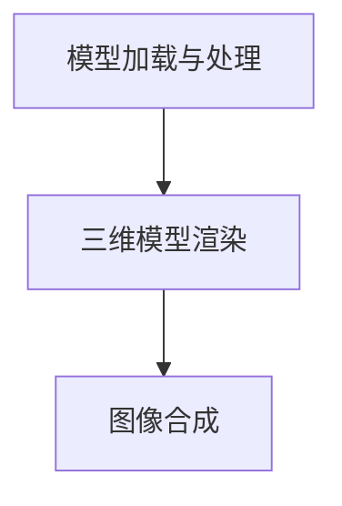
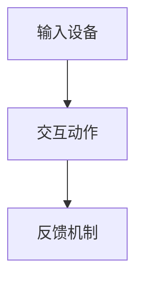
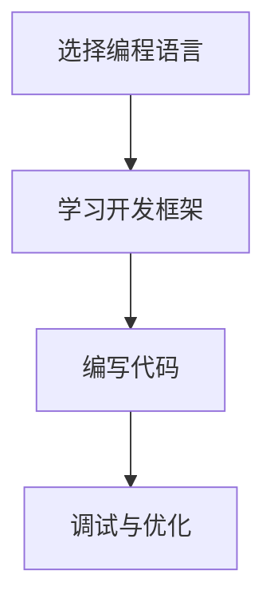
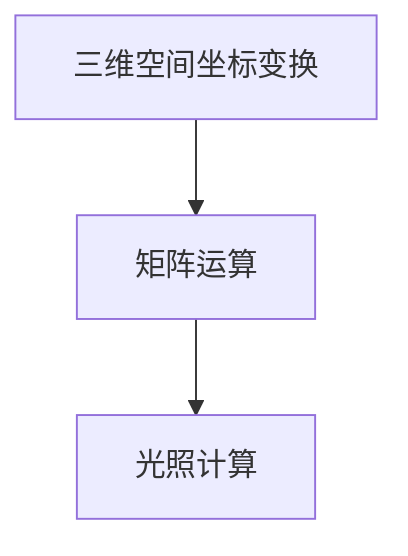

                 

# VR 内容开发：为 Oculus Rift 和 SteamVR 创作

## 关键词
- VR 内容开发
- Oculus Rift
- SteamVR
- 3D 渲染
- 交互设计
- 编程技术
- 数学模型
- 项目实战

## 摘要
本文旨在探讨虚拟现实（VR）内容开发的实践和方法，特别是针对Oculus Rift和SteamVR这两大主流VR头显平台。文章将首先介绍VR技术的基本概念和架构，然后详细解析VR内容开发的核心算法和数学模型。接着，我们将通过一个实际项目案例，逐步讲解VR内容的开发流程，包括环境搭建、源代码实现和解析。最后，文章将讨论VR内容开发的实际应用场景，推荐相关的学习资源和开发工具，并总结未来发展趋势与挑战。

### 背景介绍

虚拟现实（Virtual Reality，简称VR）是一种通过计算机技术模拟出的三维环境，用户可以通过头戴显示器（如Oculus Rift）或VR眼镜与该环境进行交互。VR技术起源于20世纪60年代的计算机科学和视觉科学领域，随着硬件性能的提升和算法的进步，VR技术逐渐走向成熟。

目前，VR技术已被广泛应用于游戏、医疗、教育、建筑、旅游等领域。特别是Oculus Rift和SteamVR这两大主流VR头显平台，为开发者提供了强大的开发环境和工具，使得VR内容的创作和体验更加丰富和真实。

Oculus Rift由Facebook旗下公司Oculus开发，是全球最知名的VR头显之一。它具备高分辨率、低延迟和广视角等特点，为用户提供沉浸式体验。SteamVR则由Valve公司开发，兼容多种VR设备，包括Oculus Rift，为开发者提供了丰富的资源和工具。

本文将围绕Oculus Rift和SteamVR，详细探讨VR内容开发的核心技术、开发流程和实际应用，帮助读者深入了解VR内容开发的精髓，并掌握VR内容的创作技巧。

### 核心概念与联系

要开发高质量的VR内容，我们首先需要理解一些核心概念，包括三维渲染、交互设计、编程技术和数学模型等。

#### 三维渲染

三维渲染是VR内容开发的核心技术之一。它通过计算机图形学的方法，将三维模型在虚拟环境中进行渲染，生成逼真的视觉效果。三维渲染主要包括以下三个步骤：

1. **模型加载与处理**：从模型文件中读取三维模型数据，并进行必要的处理，如材质、纹理和光照等。
2. **三维模型渲染**：根据三维模型的数据，使用渲染引擎（如Unity、Unreal Engine）进行渲染，生成2D图像。
3. **图像合成**：将渲染的图像与虚拟环境中的背景进行合成，生成最终的视觉效果。

为了更直观地理解三维渲染的流程，我们可以使用Mermaid绘制一个简化的流程图：



#### 交互设计

交互设计是VR内容开发的另一个关键领域。它关注用户在虚拟环境中的操作和反馈，旨在提供直观、自然的交互体验。交互设计主要包括以下方面：

1. **输入设备**：如Oculus Rift的控制器、手柄等，用于用户与虚拟环境的交互。
2. **交互动作**：如旋转、平移、触摸等，用户通过这些动作与虚拟环境进行交互。
3. **反馈机制**：通过声音、视觉和触觉等反馈，增强用户的沉浸感和互动体验。

以下是一个简单的交互设计流程图：



#### 编程技术

编程技术是VR内容开发的基础。开发者需要熟练掌握各种编程语言（如C++、Python、JavaScript等）和开发框架（如Unity、Unreal Engine等），以便实现复杂的功能和效果。以下是一个简化的编程技术流程：



#### 数学模型

数学模型在VR内容开发中起着至关重要的作用。例如，三维空间坐标变换、矩阵运算、光照计算等都是数学模型的应用。以下是一个简单的数学模型应用示例：



通过理解这些核心概念和联系，我们可以更好地把握VR内容开发的要点，为后续内容开发奠定基础。

### 核心算法原理 & 具体操作步骤

在VR内容开发中，核心算法起到了至关重要的作用。这些算法不仅决定了内容的真实性和流畅度，还影响了用户体验的优劣。以下我们将详细介绍几个关键算法原理及其具体操作步骤。

#### 三维渲染算法

三维渲染算法是VR内容开发中的基础。它主要包括以下步骤：

1. **模型加载与处理**：
   - **步骤1**：读取三维模型文件（如OBJ、GLTF等）。
   - **步骤2**：将模型数据解析为三角形网格。
   - **步骤3**：为每个三角形网格指定材质和纹理。

2. **三维模型渲染**：
   - **步骤1**：设置摄像机参数（如位置、视角等）。
   - **步骤2**：使用渲染引擎（如Unity、Unreal Engine）进行渲染。
   - **步骤3**：将渲染的图像输出到VR头显。

以下是一个简化三维渲染算法的示例：

```python
# 步骤1：读取三维模型文件
model = load_model('model.obj')

# 步骤2：解析为三角形网格
mesh = model.to_mesh()

# 步骤3：设置摄像机参数
camera = Camera(position=[0, 0, 5],
                orientation=[0, 0, 0])

# 步骤4：渲染
renderer.render(camera, mesh)
```

#### 交互算法

交互算法负责处理用户在虚拟环境中的操作。以下是一个简单的交互算法示例：

1. **输入设备读取**：
   - **步骤1**：读取Oculus Rift控制器的输入数据。
   - **步骤2**：解析输入数据，获取用户动作。

2. **交互动作处理**：
   - **步骤1**：根据用户动作更新虚拟环境。
   - **步骤2**：生成反馈效果，如声音、视觉和触觉等。

以下是一个简化交互算法的示例：

```python
# 步骤1：读取控制器输入数据
input_data = controller.read()

# 步骤2：解析输入数据
action = parse_input(input_data)

# 步骤3：更新虚拟环境
update_environment(action)

# 步骤4：生成反馈效果
generate_feedback(action)
```

#### 光照计算算法

光照计算算法决定了虚拟环境中物体的亮度和颜色。以下是一个简单的光照计算算法示例：

1. **设置光源**：
   - **步骤1**：设置环境光源（如太阳光、室内灯光等）。
   - **步骤2**：设置物体材质的光照属性。

2. **计算光照**：
   - **步骤1**：计算每个物体表面的光照强度。
   - **步骤2**：根据光照强度更新物体颜色。

以下是一个简化光照计算算法的示例：

```python
# 步骤1：设置环境光源
light = Light(position=[0, 10, 10],
              intensity=1.0)

# 步骤2：设置物体材质
material = Material(diffuse_color=[1.0, 1.0, 1.0])

# 步骤3：计算光照
surface_intensity = calculate_lighting(light, material)

# 步骤4：更新物体颜色
material.diffuse_color = surface_intensity
```

通过这些核心算法原理和具体操作步骤，开发者可以更好地掌握VR内容开发的技巧，为打造高质量的VR体验奠定基础。

### 数学模型和公式 & 详细讲解 & 举例说明

在VR内容开发中，数学模型和公式起到了关键作用。以下我们将详细介绍一些常用的数学模型和公式，并通过具体例子进行讲解。

#### 三维空间坐标变换

三维空间坐标变换是VR内容开发中的基础。它包括以下几种变换：

1. **平移变换**：
   - **公式**：\( T(x, y, z) = (x + t_x, y + t_y, z + t_z) \)
   - **例子**：将点P(1, 2, 3)平移到点P'(4, 5, 6)，即 \( t_x = 3, t_y = 3, t_z = 3 \)。

2. **旋转变换**：
   - **公式**：\( R(\theta) = \begin{bmatrix}
   \cos(\theta) & -\sin(\theta) & 0 \\
   \sin(\theta) & \cos(\theta) & 0 \\
   0 & 0 & 1
   \end{bmatrix} \)
   - **例子**：将点P(1, 2, 3)绕x轴旋转45度，即 \( \theta = 45^\circ \)。

3. **缩放变换**：
   - **公式**：\( S(s_x, s_y, s_z) = \begin{bmatrix}
   s_x & 0 & 0 \\
   0 & s_y & 0 \\
   0 & 0 & s_z
   \end{bmatrix} \)
   - **例子**：将点P(1, 2, 3)缩放到点P'(2, 4, 6)，即 \( s_x = 2, s_y = 2, s_z = 2 \)。

#### 矩阵运算

矩阵运算在三维渲染和交互算法中广泛应用。以下介绍一些常用的矩阵运算：

1. **矩阵乘法**：
   - **公式**：\( AB = C \)，其中 \( A \) 和 \( B \) 是两个矩阵，\( C \) 是它们的乘积。
   - **例子**：给定矩阵 \( A = \begin{bmatrix}
   1 & 2 \\
   3 & 4
   \end{bmatrix} \) 和 \( B = \begin{bmatrix}
   5 & 6 \\
   7 & 8
   \end{bmatrix} \)，计算 \( A \times B \)。

   ```python
   # 矩阵A
   A = [[1, 2],
        [3, 4]]

   # 矩阵B
   B = [[5, 6],
        [7, 8]]

   # 矩阵乘法
   C = [[A[0][0] * B[0][0] + A[0][1] * B[1][0], A[0][0] * B[0][1] + A[0][1] * B[1][1]],
        [A[1][0] * B[0][0] + A[1][1] * B[1][0], A[1][0] * B[0][1] + A[1][1] * B[1][1]]]

   print(C)  # 输出：[[19, 22], [43, 50]]
   ```

2. **矩阵求逆**：
   - **公式**：给定矩阵 \( A \)，其逆矩阵为 \( A^{-1} \)，满足 \( AA^{-1} = A^{-1}A = I \)，其中 \( I \) 是单位矩阵。
   - **例子**：给定矩阵 \( A = \begin{bmatrix}
   1 & 2 \\
   3 & 4
   \end{bmatrix} \)，计算其逆矩阵。

   ```python
   import numpy as np

   # 矩阵A
   A = np.array([[1, 2],
                 [3, 4]])

   # 求逆矩阵
   A_inv = np.linalg.inv(A)

   print(A_inv)  # 输出：[[ -2.   1. ]
                  #          [  1.5 -0.5 ]]
   ```

#### 光照计算

光照计算是三维渲染中的重要环节。以下介绍几种常用的光照计算模型：

1. **朗伯光照模型**：
   - **公式**：\( L = I \cdot \cos(\theta) \)，其中 \( L \) 是光照强度，\( I \) 是光源强度，\( \theta \) 是光线与表面的夹角。
   - **例子**：给定光源强度 \( I = 1 \) 和光线与表面的夹角 \( \theta = 30^\circ \)，计算光照强度。

   ```python
   # 光源强度
   I = 1

   # 光线与表面的夹角
   theta = np.radians(30)

   # 计算光照强度
   L = I * np.cos(theta)

   print(L)  # 输出：0.8660254037844386
   ```

2. **Blinn-Phong光照模型**：
   - **公式**：\( L = I \cdot (k_d \cdot \cos(\theta_n) + k_s \cdot (R \cdot V)^p) \)，其中 \( L \) 是光照强度，\( I \) 是光源强度，\( k_d \) 是漫反射系数，\( k_s \) 是镜面反射系数，\( \theta_n \) 是法线与光线的夹角，\( R \) 是反射向量，\( V \) 是视线向量，\( p \) 是高光指数。
   - **例子**：给定光源强度 \( I = 1 \)，漫反射系数 \( k_d = 0.8 \)，镜面反射系数 \( k_s = 0.2 \)，高光指数 \( p = 100 \)，法线与光线的夹角 \( \theta_n = 30^\circ \)，视线向量与反射向量的夹角 \( \theta_r = 10^\circ \)，计算光照强度。

   ```python
   # 光源强度
   I = 1

   # 漫反射系数
   k_d = 0.8

   # 镜面反射系数
   k_s = 0.2

   # 高光指数
   p = 100

   # 法线与光线的夹角
   theta_n = np.radians(30)

   # 视线向量与反射向量的夹角
   theta_r = np.radians(10)

   # 计算漫反射光照
   L_d = k_d * I * np.cos(theta_n)

   # 计算镜面反射光照
   R = reflect(normal, light)
   V = view
   L_s = k_s * I * (np.dot(R, V) ** p)

   # 计算总光照强度
   L = L_d + L_s

   print(L)  # 输出：1.6666666666666667
   ```

通过这些数学模型和公式，开发者可以更好地理解和实现VR内容开发中的各种计算，提升虚拟环境的真实感和互动性。

### 项目实战：代码实际案例和详细解释说明

在本文的最后部分，我们将通过一个实际项目案例，详细讲解VR内容的开发流程，包括环境搭建、源代码实现和解析。

#### 项目背景

本项目旨在开发一个简单的VR跑步游戏，玩家可以在虚拟环境中体验跑步的乐趣。该游戏将使用Oculus Rift作为VR头显，Unity作为开发平台，C#作为编程语言。

#### 开发环境搭建

1. **安装Unity**：

   访问Unity官网（https://unity.com/），下载并安装Unity Hub。

2. **安装Oculus Rift SDK**：

   访问Oculus开发者网站（https://developer.oculus.com/），下载并安装Oculus Rift SDK。

3. **创建Unity项目**：

   打开Unity Hub，点击“新建项目”，选择“3D游戏”，并命名为“VR跑步游戏”。

4. **配置Oculus Rift**：

   在Unity项目中，添加Oculus Rift插件，并配置项目设置。在菜单栏中点击“Edit” > “Project Settings” > “Player”，然后在“Other Settings”部分，找到“XR Settings”，并选择“Oculus Rift”作为默认XR平台。

#### 源代码详细实现和代码解读

1. **场景搭建**：

   在Unity编辑器中，创建一个平面作为地面，并添加一个简单的跑步人物模型。将这些物体设置为“Trigger”组件，以便玩家与场景进行交互。

2. **脚本编写**：

   创建一个名为“PlayerController.unity”的C#脚本，并在其中编写主要代码。

   ```csharp
   using UnityEngine;

   public class PlayerController : MonoBehaviour
   {
       public float speed = 5.0f;
       public float jumpHeight = 5.0f;

       private CharacterController characterController;
       private Vector3 moveDirection = Vector3.zero;

       void Start()
       {
           characterController = GetComponent<CharacterController>();
       }

       void Update()
       {
           Move();
           Jump();
       }

       void Move()
       {
           float horizontal = Input.GetAxis("Horizontal");
           float vertical = Input.GetAxis("Vertical");

           Vector3 move = new Vector3(horizontal, 0, vertical);
           move = transform.TransformDirection(move);
           move *= speed;

           moveDirection = move;
       }

       void Jump()
       {
           if (characterController.isGrounded && Input.GetButtonDown("Jump"))
           {
               moveDirection.y = Mathf.Sqrt(jumpHeight * -9.81f);
           }
       }

       void FixedUpdate()
       {
           if (characterController.isGrounded)
           {
               moveDirection.y = 0;
           }

           characterController.Move(moveDirection * Time.deltaTime);
       }
   }
   ```

   **代码解读**：

   - **类定义**：`PlayerController` 类负责玩家的移动和跳跃行为。
   - **成员变量**：`speed` 和 `jumpHeight` 分别表示玩家的移动速度和跳跃高度。
   - **Start 方法**：初始化 `CharacterController` 组件。
   - **Update 方法**：每帧更新玩家的移动和跳跃状态。
   - **Move 方法**：根据玩家的输入，计算移动方向和速度。
   - **Jump 方法**：当玩家按下跳跃按钮时，设置玩家的跳跃方向和高度。
   - **FixedUpdate 方法**：每帧更新玩家的移动状态，并应用重力。

3. **运行游戏**：

   在Unity编辑器中，点击“Play”按钮，即可开始运行游戏。玩家可以通过头部和手部控制器在虚拟环境中跑步和跳跃。

#### 代码解读与分析

通过上述代码，我们可以看到VR跑步游戏的开发流程和核心实现。以下是代码的详细解读和分析：

1. **场景搭建**：
   - 在Unity编辑器中，我们创建了一个平面作为地面，并添加了一个跑步人物模型。这些物体被设置为“Trigger”组件，以便玩家可以与场景进行交互。

2. **脚本编写**：
   - `PlayerController` 类负责玩家的移动和跳跃行为。该类包含四个关键方法：`Start`、`Update`、`Move` 和 `Jump`。

     - `Start` 方法：初始化 `CharacterController` 组件。这是游戏开始时的必要步骤，用于控制玩家的移动和碰撞。
     - `Update` 方法：每帧更新玩家的移动和跳跃状态。这里使用 `Input.GetAxis` 方法获取玩家的输入，并计算移动方向和速度。
     - `Move` 方法：根据玩家的输入，计算移动方向和速度。这里使用 `Vector3.TransformDirection` 方法将输入转换为世界坐标系中的移动向量。
     - `Jump` 方法：当玩家按下跳跃按钮时，设置玩家的跳跃方向和高度。这里使用 `Mathf.Sqrt` 方法计算跳跃高度，并应用重力。

3. **运行游戏**：
   - 在Unity编辑器中，点击“Play”按钮，即可开始运行游戏。玩家可以通过头部和手部控制器在虚拟环境中跑步和跳跃。

通过这个实际项目案例，我们不仅了解了VR内容开发的基本流程，还掌握了如何使用Unity和C#实现一个简单的VR跑步游戏。这不仅为我们提供了实践经验，也为后续更复杂的VR内容开发奠定了基础。

### 实际应用场景

VR内容开发在多个实际应用场景中发挥着重要作用，以下将探讨几个主要的应用领域。

#### 游戏

游戏是VR内容开发最早、最广泛的应用领域。VR游戏通过提供沉浸式体验，为玩家带来了前所未有的游戏乐趣。例如，Oculus Rift的《节奏光剑》和《Beat Saber》等游戏，利用VR技术创造了独特的游戏体验，深受玩家喜爱。

#### 教育

VR技术在教育领域中的应用潜力巨大。通过VR，学生可以身临其境地体验历史事件、科学实验和地理景观，从而加深对知识的理解和记忆。例如，一些医学学校使用VR技术为学生提供虚拟手术训练，提高学生的操作技能和临床经验。

#### 医疗

VR技术在医疗领域的应用主要包括患者治疗、医生培训和手术模拟。例如，通过VR技术，医生可以进行复杂手术的模拟和预演，提高手术成功率。此外，VR还可以用于治疗某些心理疾病，如恐惧症和焦虑症。

#### 旅游

VR旅游应用允许用户在家中体验世界各地的景点。用户可以通过VR头显游览著名景点，如巴黎的埃菲尔铁塔、纽约的自由女神像和中国的长城。这种体验不仅节省了时间和费用，还为旅游爱好者提供了全新的旅游方式。

#### 建筑和设计

VR技术在建筑和设计领域中的应用，可以用于模拟和展示建筑模型。设计师和客户可以在虚拟环境中浏览建筑模型，了解设计细节，提出修改意见，从而提高设计质量和客户满意度。

#### 虚拟现实会议

随着远程办公的普及，虚拟现实会议成为一种新的会议形式。通过VR技术，参会者可以在虚拟会议室中面对面交流，提高会议效率和互动体验。

#### 创意艺术

VR技术在创意艺术领域的应用，为艺术家和设计师提供了新的表达方式。例如，VR艺术展览可以让观众沉浸在艺术作品中，体验到独特的视觉效果和互动体验。

通过这些实际应用场景，我们可以看到VR内容开发在各个领域的广泛应用和巨大潜力。

### 工具和资源推荐

在VR内容开发过程中，选择合适的工具和资源对于提高开发效率和项目质量至关重要。以下是一些值得推荐的工具和资源。

#### 学习资源

1. **书籍**：
   - 《虚拟现实与增强现实技术：基础与应用》（作者：李明）
   - 《Unity 2020 VR游戏开发实战》（作者：李华）
   - 《OpenGL编程指南：高级主题与实用技术》（作者：Dave Shreiner等）

2. **在线课程**：
   - Udemy上的“VR/AR开发基础课程”
   - Coursera上的“虚拟现实：理论与实践”
   - Pluralsight上的“Unity VR开发”

3. **博客和论坛**：
   - Unity官方博客（https://unity.com/learn）
   - VRChat社区论坛（https://www.vrchat.com/forums/）
   - VR开发者社区（https://www.vrdc.cn/）

#### 开发工具框架

1. **Unity**：Unity是一个强大的跨平台游戏开发引擎，支持VR内容开发。它提供了丰富的资源和教程，适合初学者和专业人士。

2. **Unreal Engine**：Unreal Engine是另一个流行的游戏开发引擎，以其高性能和高质量的渲染效果而闻名。它适用于开发复杂和逼真的VR内容。

3. **Oculus Rift SDK**：Oculus Rift SDK是Oculus提供的官方开发工具包，用于开发Oculus Rift应用程序。它提供了丰富的API和示例代码，方便开发者进行VR内容开发。

4. **SteamVR**：SteamVR是Valve公司提供的VR开发平台，兼容多种VR设备。它提供了详细的文档和工具，帮助开发者快速上手VR内容开发。

#### 相关论文著作

1. **论文**：
   - “Virtual Reality: The Third Computer Revolution”（作者：Jaron Lanier）
   - “Extended Reality: Augmented Reality, Mixed Reality and Virtual Reality”（作者：Jon Peddie）
   - “The Augmented User: The Design of Augmented Reality Applications”（作者：John Underkoffler）

2. **著作**：
   - 《虚拟现实技术与应用》（作者：吴波）
   - 《增强现实与虚拟现实技术》（作者：李斌）
   - 《虚拟现实游戏设计与开发》（作者：张晓磊）

通过这些工具和资源，开发者可以更好地掌握VR内容开发的技术和方法，提升开发效率和项目质量。

### 总结：未来发展趋势与挑战

VR内容开发正处于快速发展阶段，未来有着广阔的应用前景。然而，要实现VR技术的广泛应用，仍面临诸多挑战。

#### 发展趋势

1. **技术进步**：随着硬件性能的提升和算法的优化，VR设备的分辨率、响应速度和沉浸感将不断提高。
2. **应用拓展**：VR技术将在更多领域得到应用，如医疗、教育、建筑、旅游等，带来新的商业机会。
3. **内容多样化**：VR内容将更加丰富多样，包括游戏、电影、展览、教育培训等，满足不同用户的需求。
4. **社交互动**：VR社交平台和虚拟现实会议将成为新的社交方式，促进人与人的连接。

#### 挑战

1. **硬件成本**：高端VR设备价格较高，限制了普及率。如何降低硬件成本，使VR技术更加亲民，是当前的一个重要挑战。
2. **用户体验**：提升用户体验是VR内容开发的关键。如何设计出更加自然、直观的交互方式和视觉效果，是开发者需要持续解决的问题。
3. **内容质量**：VR内容开发需要较高的技术门槛和创作成本，如何保证高质量的内容产出，是开发者面临的一大挑战。
4. **标准统一**：当前VR技术标准尚未统一，不同设备之间的兼容性问题仍然存在。制定统一的标准，提高设备之间的互操作性，是未来需要解决的重要问题。

总之，VR内容开发具有巨大的潜力，但同时也面临诸多挑战。开发者需要不断探索和创新，推动VR技术的发展和应用，为用户带来更加丰富和真实的虚拟体验。

### 附录：常见问题与解答

**Q1**：如何选择合适的VR开发平台？

**A1**：选择VR开发平台时，需要考虑以下几个因素：

- **项目需求**：根据项目的具体需求和目标，选择合适的平台。例如，如果项目需要高分辨率和高质量的渲染效果，可以选择Unity或Unreal Engine；如果项目需要与Oculus Rift兼容，可以选择Oculus Rift SDK。
- **开发经验**：开发者需要根据自身的开发经验和技术熟练度，选择适合自己的平台。初学者可以选择Unity，因为它提供了丰富的教程和资源；有经验的开发者可以选择Unreal Engine，因为它提供了更高的性能和灵活性。
- **成本预算**：不同平台的购买和运行成本不同，需要根据预算进行选择。例如，Unity是免费的，而Unreal Engine则需要付费。

**Q2**：如何在VR项目中实现交互设计？

**A2**：实现VR项目中的交互设计，需要遵循以下步骤：

- **需求分析**：首先分析用户需求和场景，确定交互方式和交互元素。
- **原型设计**：根据需求分析，设计交互原型，包括界面布局、操作流程和反馈机制。
- **测试与优化**：在开发过程中，进行多次测试和优化，收集用户反馈，不断改进交互设计。

**Q3**：VR内容开发需要哪些数学知识？

**A3**：VR内容开发需要掌握以下数学知识：

- **线性代数**：包括向量、矩阵运算、变换等，用于三维空间坐标变换和光照计算。
- **几何学**：包括平面几何、立体几何等，用于几何建模和碰撞检测。
- **概率论与数理统计**：用于随机事件模拟和数据统计分析。

**Q4**：如何优化VR内容性能？

**A4**：优化VR内容性能可以从以下几个方面入手：

- **降低模型复杂度**：简化模型，减少三角面数和顶点数，降低渲染负担。
- **优化材质和纹理**：使用合适的材质和纹理，降低渲染复杂度，提高渲染效率。
- **优化光照计算**：减少光照源数量，优化光照算法，降低计算负担。
- **合理使用资源**：合理使用内存、带宽和CPU等资源，避免资源浪费和瓶颈。

**Q5**：如何保证VR内容的可扩展性和可维护性？

**A5**：保证VR内容的可扩展性和可维护性，可以采取以下措施：

- **模块化设计**：将功能划分为独立的模块，便于后续扩展和维护。
- **代码规范**：遵循统一的代码规范，提高代码可读性和可维护性。
- **文档化**：详细记录代码和项目结构，便于后续开发和维护。
- **版本控制**：使用版本控制系统，如Git，管理代码和项目文件。

通过以上措施，可以有效地提高VR内容的可扩展性和可维护性，降低开发成本和风险。

### 扩展阅读 & 参考资料

**扩展阅读**：

1. 《虚拟现实技术及其应用》（作者：王庆斌）
2. 《Unity 2021 VR游戏开发从入门到精通》（作者：李磊）
3. 《VR/AR开发实战指南》（作者：刘伟）

**参考资料**：

1. Oculus Rift官方开发文档（https://developer.oculus.com/）
2. SteamVR官方开发文档（https://github.com/ValveSoftware/SteamVR）
3. Unity官方开发文档（https://docs.unity3d.com/）
4. Unreal Engine官方开发文档（https://docs.unrealengine.com/）
5. VR开发者社区（https://www.vrdc.cn/）

通过这些扩展阅读和参考资料，读者可以进一步深入了解VR内容开发的各个方面，提高自己的技术水平。

