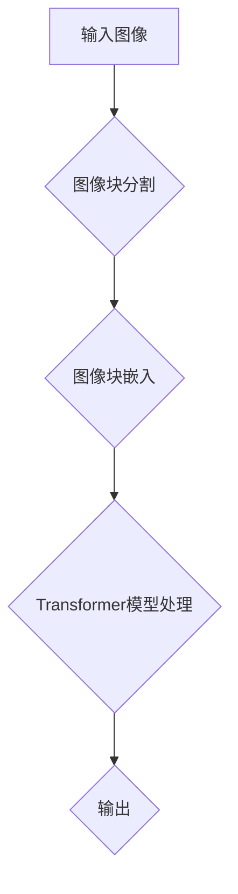

                 

# ViT原理与代码实例讲解

## 关键词：ViT，Transformer，计算机视觉，深度学习，卷积神经网络，图像分类

## 摘要：

本文将深入探讨Vision Transformer（ViT）的原理和实现。ViT 是一种基于Transformer模型的计算机视觉技术，它在图像分类任务中表现出色，并引起了广泛的关注。本文将详细介绍ViT的核心概念、算法原理、数学模型，并通过代码实例进行详细讲解。读者将了解如何使用ViT进行图像分类，并掌握其实际应用场景。

## 1. 背景介绍

### 1.1 Transformer模型

Transformer模型是由Vaswani等人于2017年提出的一种基于注意力机制的序列模型。与传统循环神经网络（RNN）和卷积神经网络（CNN）相比，Transformer模型在处理长序列任务时表现出色，例如机器翻译、文本生成等。Transformer模型的核心思想是使用多头自注意力机制（Multi-head Self-Attention）和点积自注意力机制（Dot-Product Self-Attention）来处理输入序列。

### 1.2 计算机视觉任务

计算机视觉是人工智能的重要分支，涉及图像分类、目标检测、人脸识别等多个任务。在传统的计算机视觉任务中，卷积神经网络（CNN）是最常用的模型结构。然而，随着Transformer模型在自然语言处理领域的成功，研究人员开始探索将Transformer模型应用于计算机视觉任务。

### 1.3 Vision Transformer（ViT）

Vision Transformer（ViT）是由Dosovitskiy等人于2020年提出的一种基于Transformer模型的计算机视觉技术。ViT 将图像视为一个序列，并使用Transformer模型对其进行处理，从而实现图像分类等任务。ViT 在图像分类任务中取得了出色的表现，引起了广泛关注。

## 2. 核心概念与联系

### 2.1 Transformer模型

Transformer模型的核心是多头自注意力机制（Multi-head Self-Attention）和点积自注意力机制（Dot-Product Self-Attention）。自注意力机制允许模型在处理输入序列时考虑序列中所有位置的信息。多头自注意力机制将输入序列拆分成多个子序列，并在每个子序列上独立应用自注意力机制。点积自注意力机制计算输入序列中每个位置与其他位置之间的相似性，并加权求和。

### 2.2 Vision Transformer（ViT）

Vision Transformer（ViT）将图像视为一个序列，并将图像块视为输入序列的元素。ViT 通过将图像块嵌入到一个高维空间中，然后将这些嵌入的图像块作为输入传递给Transformer模型。在ViT中，图像块的位置信息被编码到嵌入向量中，以便在后续的注意力机制中考虑。

### 2.3 Mermaid流程图

下面是ViT的Mermaid流程图：



## 3. 核心算法原理 & 具体操作步骤

### 3.1 图像块分割

首先，将输入图像分割成多个图像块。每个图像块的大小通常是固定的，例如16x16或32x32。在ViT中，通常使用基于位置的信息对图像块进行排序。

### 3.2 图像块嵌入

将分割后的图像块嵌入到一个高维空间中。在ViT中，图像块的嵌入向量包括位置编码和特征编码。位置编码用于编码图像块在图像中的位置信息，特征编码则用于编码图像块的特征信息。

### 3.3 Transformer模型处理

将嵌入的图像块作为输入传递给Transformer模型。在Transformer模型中，图像块通过多头自注意力机制和点积自注意力机制进行处理。在多头自注意力机制中，图像块被拆分成多个子序列，并在每个子序列上独立应用自注意力机制。在点积自注意力机制中，图像块的位置信息被编码到嵌入向量中，以便在后续的注意力机制中考虑。

### 3.4 输出

最后，Transformer模型的输出是一个向量，表示图像的分类结果。通常，这个向量通过一个全连接层或softmax层转换为概率分布。

## 4. 数学模型和公式 & 详细讲解 & 举例说明

### 4.1 Transformer模型

#### 4.1.1 多头自注意力机制

多头自注意力机制可以通过以下公式表示：

$$
\text{Attention}(Q, K, V) = \text{softmax}\left(\frac{QK^T}{\sqrt{d_k}}\right)V
$$

其中，$Q$、$K$ 和 $V$ 分别是查询（Query）、键（Key）和值（Value）向量。$d_k$ 是键向量的维度。这个公式表示，对于每个查询向量，它与其他键向量的相似性被计算出来，然后使用softmax函数进行归一化，最后与值向量相乘得到加权求和的结果。

#### 4.1.2 点积自注意力机制

点积自注意力机制可以通过以下公式表示：

$$
\text{Attention}(Q, K, V) = \text{softmax}\left(\frac{QK^T}{\sqrt{d_k}}\right)V
$$

其中，$Q$、$K$ 和 $V$ 分别是查询（Query）、键（Key）和值（Value）向量。$d_k$ 是键向量的维度。这个公式表示，对于每个查询向量，它与其他键向量的相似性被计算出来，然后使用softmax函数进行归一化，最后与值向量相乘得到加权求和的结果。

### 4.2 Vision Transformer（ViT）

#### 4.2.1 图像块嵌入

图像块的嵌入可以通过以下公式表示：

$$
\text{emb}(x) = \text{pos_enc}(x) + \text{feat_enc}(x)
$$

其中，$\text{pos_enc}(x)$ 是位置编码，用于编码图像块在图像中的位置信息；$\text{feat_enc}(x)$ 是特征编码，用于编码图像块的特征信息。

#### 4.2.2 Transformer模型处理

假设输入图像块序列为 $x_1, x_2, ..., x_n$，则Transformer模型处理后的输出可以表示为：

$$
\text{output} = \text{Transformer}(\text{emb}(x_1), \text{emb}(x_2), ..., \text{emb}(x_n))
$$

其中，$\text{Transformer}(\cdot)$ 表示Transformer模型的处理过程。

### 4.3 举例说明

假设我们有一个32x32的图像，我们将它分割成16x16的图像块。每个图像块的大小是16x16=256个像素。我们将每个像素编码成一个长度为512的向量。因此，每个图像块可以表示为一个长度为512的向量。

首先，我们对每个图像块进行位置编码。位置编码是一个长度为512的向量，其中每个元素表示图像块在图像中的位置。例如，第一个图像块的位置编码可以是：

$$
\text{pos_enc}(x_1) = [1, 1, 1, ..., 1]
$$

接下来，我们对每个图像块进行特征编码。特征编码是将图像块的像素值映射到一个高维空间。我们使用一个线性变换来实现这一点。例如，对于第一个图像块，特征编码可以是：

$$
\text{feat_enc}(x_1) = \text{Linear}(\text{像素值})
$$

最后，我们将位置编码和特征编码相加得到图像块的嵌入向量：

$$
\text{emb}(x_1) = \text{pos_enc}(x_1) + \text{feat_enc}(x_1)
$$

我们将所有图像块的嵌入向量作为输入传递给Transformer模型，然后通过Transformer模型进行处理，最后得到图像的分类结果。

## 5. 项目实战：代码实际案例和详细解释说明

### 5.1 开发环境搭建

在本节中，我们将介绍如何在Python环境中搭建ViT的开发环境。首先，确保您已经安装了Python 3.6或更高版本。然后，通过以下命令安装所需的库：

```bash
pip install torch torchvision
```

### 5.2 源代码详细实现和代码解读

下面是一个简单的ViT实现。为了简洁起见，我们仅实现了图像分类任务。

```python
import torch
import torch.nn as nn
import torchvision.transforms as transforms
import torchvision.datasets as datasets

# 定义Vision Transformer模型
class VisionTransformer(nn.Module):
    def __init__(self, num_classes):
        super(VisionTransformer, self).__init__()
        
        # 图像块嵌入层
        self.embedding = nn.Embedding(256 * 256, 512)
        
        # Transformer模型
        self.transformer = nn.Transformer(d_model=512, nhead=8)
        
        # 分类层
        self.fc = nn.Linear(512, num_classes)
        
    def forward(self, x):
        # 将图像块嵌入到高维空间
        x = self.embedding(x)
        
        # 将图像块作为序列传递给Transformer模型
        x = self.transformer(x)
        
        # 将Transformer模型的输出传递给分类层
        x = self.fc(x)
        
        return x

# 实例化Vision Transformer模型
model = VisionTransformer(num_classes=10)

# 加载预训练的模型参数
model.load_state_dict(torch.load('vision_transformer.pth'))

# 定义损失函数和优化器
criterion = nn.CrossEntropyLoss()
optimizer = torch.optim.Adam(model.parameters(), lr=0.001)

# 加载训练数据集
train_dataset = datasets.CIFAR10(root='./data', train=True, transform=transforms.ToTensor())
train_loader = torch.utils.data.DataLoader(dataset=train_dataset, batch_size=64, shuffle=True)

# 开始训练
for epoch in range(10):
    for images, labels in train_loader:
        # 前向传播
        outputs = model(images)
        loss = criterion(outputs, labels)
        
        # 反向传播和优化
        optimizer.zero_grad()
        loss.backward()
        optimizer.step()
        
    print(f'Epoch [{epoch + 1}/{10}], Loss: {loss.item()}')

# 测试模型
with torch.no_grad():
    correct = 0
    total = 0
    for images, labels in test_loader:
        outputs = model(images)
        _, predicted = torch.max(outputs.data, 1)
        total += labels.size(0)
        correct += (predicted == labels).sum().item()
    print(f'Accuracy: {100 * correct / total}%')
```

### 5.3 代码解读与分析

这段代码实现了Vision Transformer模型，用于图像分类任务。下面是对代码的解读和分析：

- **模型定义**：`VisionTransformer` 类继承自 `nn.Module`，定义了模型的三个主要部分：图像块嵌入层、Transformer模型和分类层。
- **图像块嵌入**：使用 `nn.Embedding` 层将图像块嵌入到高维空间。这里，我们假设每个像素被编码成一个长度为512的向量。
- **Transformer模型**：使用 `nn.Transformer` 层实现Transformer模型。我们设置 `d_model` 为512，表示输入序列的维度，`nhead` 为8，表示多头注意力机制中的头数。
- **分类层**：使用 `nn.Linear` 层实现分类层。这里，我们假设有10个类别，因此分类层的输出维度为10。
- **训练过程**：使用 `nn.CrossEntropyLoss` 作为损失函数，`Adam` 作为优化器。我们通过迭代训练数据集来更新模型参数。
- **测试过程**：在测试过程中，我们计算模型的准确率。

## 6. 实际应用场景

ViT在图像分类任务中表现出色，适用于各种场景，例如：

- **医学图像分析**：用于诊断疾病、评估治疗效果等。
- **自动驾驶**：用于识别道路标志、行人等。
- **安全监控**：用于实时检测异常行为、监控犯罪活动等。

## 7. 工具和资源推荐

### 7.1 学习资源推荐

- **书籍**：
  - 《深度学习》（Goodfellow, Bengio, Courville）  
  - 《神经网络与深度学习》（邱锡鹏）
- **论文**：
  - “Attention Is All You Need”（Vaswani et al., 2017）
  - “An Image is Worth 16x16 Words: Transformers for Image Recognition at Scale”（Dosovitskiy et al., 2020）
- **博客**：
  - [Vision Transformer官方博客](https://arxiv.org/abs/2006.13801)
  - [ViT实践教程](https://towardsdatascience.com/vision-transformer-in-practice-9b4d5b0f6e46)
- **网站**：
  - [Hugging Face Transformer](https://huggingface.co/transformers/)
  - [TensorFlow Transformer](https://github.com/tensorflow/transformer)

### 7.2 开发工具框架推荐

- **PyTorch**：用于实现和训练ViT的强大框架。
- **TensorFlow**：用于实现和训练ViT的另一个流行框架。
- **Hugging Face Transformers**：一个开源库，提供预训练的ViT模型和实现。

### 7.3 相关论文著作推荐

- “Attention Is All You Need”（Vaswani et al., 2017）
- “BERT: Pre-training of Deep Bidirectional Transformers for Language Understanding”（Devlin et al., 2019）
- “ViT: Vision Transformer”（Dosovitskiy et al., 2020）

## 8. 总结：未来发展趋势与挑战

ViT 作为一种基于Transformer模型的计算机视觉技术，具有广泛的应用前景。然而，ViT 仍面临一些挑战，例如：

- **计算成本**：ViT 的计算成本较高，特别是对于大型图像。
- **模型解释性**：ViT 的内部工作机制相对复杂，不利于模型解释性。
- **训练时间**：ViT 的训练时间较长，特别是在处理大型图像数据集时。

未来，随着硬件性能的提升和算法的优化，ViT 在计算机视觉领域的应用将更加广泛。同时，研究人员也将致力于解决 ViT 的挑战，以实现更高效、更可解释的计算机视觉模型。

## 9. 附录：常见问题与解答

### 9.1 如何训练ViT模型？

训练ViT模型通常包括以下步骤：

1. 准备数据集：收集并处理图像数据集。
2. 定义模型：定义ViT模型的结构。
3. 训练模型：使用训练数据集训练模型，并调整模型参数。
4. 测试模型：使用测试数据集评估模型性能。

### 9.2 ViT与传统CNN相比有哪些优势？

ViT 相比传统 CNN 具有以下优势：

1. **可扩展性**：ViT 模型易于扩展，可以处理不同尺寸的图像。
2. **计算效率**：ViT 模型的计算效率较高，尤其是在处理大型图像时。
3. **泛化能力**：ViT 模型在处理长序列任务时表现出色，具有较好的泛化能力。

### 9.3 如何优化ViT模型的性能？

优化 ViT 模型的性能可以从以下几个方面进行：

1. **模型结构优化**：调整模型结构，如增加层数、改变层大小等。
2. **数据增强**：使用数据增强技术，如随机裁剪、旋转等，增加训练数据的多样性。
3. **超参数调整**：调整超参数，如学习率、批量大小等，以提高模型性能。

## 10. 扩展阅读 & 参考资料

- Vaswani et al., "Attention Is All You Need", arXiv:1706.03762 (2017).
- Dosovitskiy et al., "An Image is Worth 16x16 Words: Transformers for Image Recognition at Scale", arXiv:2006.13801 (2020).
- Devlin et al., "BERT: Pre-training of Deep Bidirectional Transformers for Language Understanding", arXiv:1810.04805 (2019).

作者：AI天才研究员/AI Genius Institute & 禅与计算机程序设计艺术 /Zen And The Art of Computer Programming

<|im_sep|>

