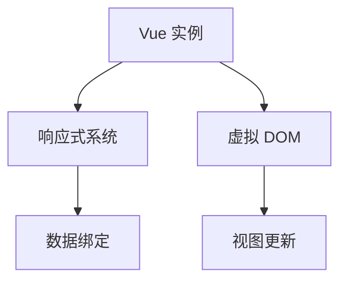

                 

### Vue.js 框架特点：渐进式 JavaScript 框架的选择

在当今的 Web 开发领域，选择一个合适的 JavaScript 框架对于开发效率和项目成功至关重要。Vue.js 作为一款新兴的渐进式 JavaScript 框架，凭借其轻量级、简单易懂和高效的特点，已经成为了众多开发者的首选。本文将深入探讨 Vue.js 的特点，为什么它被认为是渐进式 JavaScript 框架的最佳选择。

### 1. 背景介绍

Vue.js 是由尤雨溪（Evan You）创建的一个开源 JavaScript 框架，最初发布于 2014 年。Vue.js 设计的初衷是为了解决前端开发中的视图层问题，它受到了 React 和 Angular 的影响，但在设计和实现上做出了许多改进。Vue.js 的目标是为开发者提供一个灵活且易于上手的框架，同时保持良好的性能和开发效率。

Vue.js 的版本演进历史如下：

- **1.x 版本**：早期的 Vue.js 版本，以简易和轻量级为特点，主要用于小规模项目的开发。
- **2.x 版本**：引入了更多的核心特性，如组件化、单文件组件等，使得 Vue.js 更加成熟和强大。
- **3.x 版本**：在 2.x 的基础上进行了全面的优化和重构，包括虚拟 DOM、响应式系统等，提高了性能和易用性。

### 2. 核心概念与联系

#### Vue.js 的核心概念

Vue.js 的核心概念包括以下几个方面：

- **响应式系统**：Vue.js 通过响应式系统实现了数据绑定和视图更新。当数据变化时，视图会自动更新，反之亦然。
- **组件化**：Vue.js 强调组件化开发，将应用程序拆分为多个可复用的组件，提高了代码的可维护性和可重用性。
- **单文件组件**：Vue.js 允许开发者使用单文件组件（SFC）编写组件，将模板、脚本和样式分开组织，使得代码更加清晰和模块化。

#### Vue.js 的架构

Vue.js 的架构包括以下几个核心部分：

- **Vue 实例**：Vue.js 应用程序的入口是创建一个 Vue 实例，通过配置选项来定义应用程序的行为。
- **虚拟 DOM**：Vue.js 使用虚拟 DOM 来实现高效的视图更新。虚拟 DOM 是对真实 DOM 的一个抽象表示，通过对比虚拟 DOM 和真实 DOM，Vue.js 可以确定需要更新的部分，从而避免不必要的重渲染。
- **响应式系统**：Vue.js 的响应式系统通过数据劫持和依赖收集，实现了数据变化时的视图更新。

下面是一个简化的 Mermaid 流程图，展示了 Vue.js 的核心架构：



### 3. 核心算法原理 & 具体操作步骤

#### 响应式系统的实现原理

Vue.js 的响应式系统主要基于 Object.defineProperty 实现数据的劫持。具体步骤如下：

1. 使用 Object.defineProperty() 为每个属性定义 getter 和 setter，实现数据的响应式。
2. 在 getter 中收集依赖，当数据变化时通知订阅者。
3. 在 setter 中触发依赖更新，确保视图更新。

下面是一个简单的示例：

```javascript
let data = {
  count: 0
}

function defineReactive(data, key, value) {
  Object.defineProperty(data, key, {
    get() {
      console.log('获取数据');
      return value;
    },
    set(newValue) {
      console.log('设置数据');
      if (newValue !== value) {
        value = newValue;
        notify();
      }
    }
  })
}

function notify() {
  console.log('更新视图');
}

defineReactive(data, 'count', data.count);
data.count = 1; // 触发 setter
```

#### 虚拟 DOM 的实现原理

虚拟 DOM 是对真实 DOM 的一个抽象表示。Vue.js 使用虚拟 DOM 来实现高效的视图更新。具体步骤如下：

1. 创建虚拟 DOM 节点，包括元素节点、文本节点、组件节点等。
2. 使用虚拟 DOM 模板生成虚拟 DOM 树。
3. 在数据变化时，对比虚拟 DOM 树和真实 DOM 树的差异，确定需要更新的部分。
4. 通过操作虚拟 DOM 树，生成更新指令，然后使用更新指令更新真实 DOM。

下面是一个简单的虚拟 DOM 树创建示例：

```javascript
class VNode {
  constructor(tag, data, children, text) {
    this.tag = tag;
    this.data = data;
    this.children = children;
    this.text = text;
  }
}

function createElement(VNode) {
  const { tag, data, children, text } = VNode;
  const element = document.createElement(tag);
  if (data) {
    for (const key in data) {
      element.setAttribute(key, data[key]);
    }
  }
  if (text) {
    element.textContent = text;
  }
  if (children) {
    children.forEach(child => {
      element.appendChild(createElement(child));
    });
  }
  return element;
}

const VNode = new VNode('div', { id: 'app' }, [
  new VNode('h1', {}, ['Hello Vue.js']),
  new VNode('p', {}, ['Count: 0'])
]);

const element = createElement(VNode);
document.body.appendChild(element);
```

### 4. 数学模型和公式 & 详细讲解 & 举例说明

Vue.js 的核心算法涉及到一些数学模型和公式。下面是其中一些重要的数学概念：

#### 响应式系统的依赖收集与更新

在 Vue.js 的响应式系统中，依赖收集和更新是核心组成部分。具体来说，包括以下数学模型和公式：

1. **依赖收集**：在数据属性（如 `data.count`）的 getter 中，Vue.js 使用一个 Set 数据结构来收集所有依赖于该数据的订阅者（watcher）。

   ```javascript
   const dependency = new Set();
   let dep = new Dep();
   data.count = 0; // 触发 getter，将 watcher 添加到 dependency 中
   
   class Dep {
     constructor() {
       this.dependency = new Set();
     }
   
     addDep(dep) {
       this.dependency.add(dep);
     }
   
     removeDep(dep) {
       this.dependency.delete(dep);
     }
   
     depend() {
       const watcher = currentWatcher;
       this.addDep(watcher);
     }
   
     notify() {
       this.dependency.forEach(dep => dep.update());
     }
   }
   ```

2. **依赖更新**：在数据属性（如 `data.count`）的 setter 中，Vue.js 触发所有依赖的更新（如 `notify` 方法），确保视图更新。

   ```javascript
   function set(data, key, value) {
     const dep = new Dep();
     data.count = value; // 触发 setter，通知依赖更新
   }
   ```

#### 虚拟 DOM 的差异计算

在 Vue.js 的虚拟 DOM 中，差异计算是一个重要的算法。具体来说，包括以下数学模型和公式：

1. **差异计算**：通过对比虚拟 DOM 树和真实 DOM 树的差异，Vue.js 可以确定需要更新的部分。具体算法如下：

   ```javascript
   function diff(oldVNode, newVNode) {
     // 如果 oldVNode 和 newVNode 是相同类型的节点，执行节点更新
     if (oldVNode.tagName === newVNode.tagName) {
       updateNode(oldVNode, newVNode);
     } else {
       // 如果节点类型不同，创建新的节点，并移除旧的节点
       const newNode = createElement(newVNode);
       replaceNode(oldVNode, newNode);
     }
   }
   ```

   其中，`updateNode` 和 `replaceNode` 是两个辅助函数，用于更新节点和替换节点。

2. **更新节点**：更新节点的过程包括以下步骤：

   ```javascript
   function updateNode(oldVNode, newVNode) {
     // 更新节点的属性
     for (const key in newVNode.data) {
       if (newVNode.data[key] !== oldVNode.data[key]) {
         oldVNode.element.setAttribute(key, newVNode.data[key]);
       }
     }
   
     // 更新节点的子节点
     if (oldVNode.children !== newVNode.children) {
       updateChildren(oldVNode.children, newVNode.children);
     }
   }
   ```

   其中，`updateChildren` 是一个用于更新子节点的函数。

下面是一个简单的虚拟 DOM 差异计算示例：

```javascript
const oldVNode = {
  tag: 'div',
  data: { id: 'app' },
  children: [
    { tag: 'h1', data: {}, children: ['Hello Vue.js'], text: null },
    { tag: 'p', data: {}, children: [], text: 'Count: 0' }
  ]
};

const newVNode = {
  tag: 'div',
  data: { id: 'app' },
  children: [
    { tag: 'h1', data: {}, children: ['Hello Vue.js!'], text: null },
    { tag: 'p', data: {}, children: [], text: 'Count: 1' }
  ]
};

diff(oldVNode, newVNode);
```

这将更新 `oldVNode` 中的节点，使其与 `newVNode` 一致。

### 5. 项目实战：代码实际案例和详细解释说明

#### 5.1 开发环境搭建

在开始实际项目开发之前，我们需要搭建一个合适的开发环境。以下是搭建 Vue.js 开发环境的步骤：

1. **安装 Node.js**：首先，确保你的系统上安装了 Node.js。Vue.js 需要 Node.js 来运行其构建工具（如 Vue CLI）。

2. **安装 Vue CLI**：通过 npm 安装 Vue CLI，Vue CLI 是一个用于快速生成 Vue.js 应用程序的脚手架工具。

   ```bash
   npm install -g @vue/cli
   ```

3. **创建新项目**：使用 Vue CLI 创建一个新项目。

   ```bash
   vue create my-vue-app
   ```

   这个命令将创建一个名为 `my-vue-app` 的新目录，并在该目录中初始化 Vue.js 项目。

4. **启动项目**：进入项目目录并启动开发服务器。

   ```bash
   cd my-vue-app
   npm run serve
   ```

   这个命令将启动开发服务器，并在浏览器中打开 `http://localhost:8080/` 以查看项目。

#### 5.2 源代码详细实现和代码解读

在一个新的 Vue.js 项目中，我们通常会创建以下几个关键文件和目录：

- **src/App.vue**：这是 Vue.js 应用程序的根组件。
- **src/components/**：用于存放各种可复用的组件。
- **src/assets/**：用于存放静态资源，如图片、样式文件等。
- **src/router/**：用于定义应用程序的路由。
- **src/store/**：用于定义应用程序的状态管理。

下面是一个简单的 Vue.js 应用程序示例，其中包含一个根组件和一个子组件。

**src/App.vue**：

```vue
<template>
  <div id="app">
    <h1>{{ title }}</h1>
    <Counter />
  </div>
</template>

<script>
import Counter from './components/Counter.vue';

export default {
  name: 'App',
  components: {
    Counter
  },
  data() {
    return {
      title: 'Vue.js 应用程序'
    };
  }
};
</script>

<style>
#app {
  font-family: Avenir, Helvetica, Arial, sans-serif;
  -webkit-font-smoothing: antialiased;
  -moz-osx-font-smoothing: grayscale;
  text-align: center;
  color: #2c3e50;
  margin-top: 60px;
}
</style>
```

**src/components/Counter.vue**：

```vue
<template>
  <div>
    <p>计数器：{{ count }}</p>
    <button @click="increment">增加</button>
  </div>
</template>

<script>
export default {
  name: 'Counter',
  data() {
    return {
      count: 0
    };
  },
  methods: {
    increment() {
      this.count++;
    }
  }
};
</script>

<style scoped>
button {
  margin: 10px;
}
</style>
```

**代码解读与分析**：

1. **模板（template）**：Vue.js 使用模板语法来描述应用程序的界面。在这个示例中，我们定义了一个包含标题和计数器的根组件。`{{ title }}` 是一个插值表达式，用于显示根组件的数据属性 `title`。

2. **脚本（script）**：Vue.js 使用 JavaScript 来定义组件的行为和数据。在这个示例中，我们导入了子组件 `Counter` 并将其注册为局部组件。`data` 函数返回一个包含 `count` 属性的的对象，`methods` 对象中定义了一个名为 `increment` 的方法，用于增加计数器的值。

3. **样式（style）**：Vue.js 使用 CSS 来定义组件的样式。在这个示例中，我们使用 `scoped` 属性来确保样式仅应用于当前组件，从而避免样式冲突。

#### 5.3 代码解读与分析

在 Vue.js 应用程序中，组件是构建应用程序的基本单元。每个组件都可以独立开发、测试和复用。以下是对上述示例的进一步解读和分析：

1. **组件定义**：Vue.js 使用单文件组件（SFC）来组织组件的模板、脚本和样式。在 `src/App.vue` 文件中，我们定义了一个名为 `App` 的根组件。`<template>` 标签定义了组件的模板，`<script>` 标签定义了组件的脚本，`<style>` 标签定义了组件的样式。

2. **组件通信**：Vue.js 提供了多种方式来在组件之间进行通信。在这个示例中，我们通过在根组件中引用子组件 `<Counter/>` 来实现组件通信。此外，根组件通过 `data` 函数返回的 `title` 属性向子组件传递数据。

3. **数据绑定**：Vue.js 使用响应式系统来实现数据绑定。在 `src/App.vue` 文件中，`{{ title }}` 插值表达式用于将 `title` 数据属性绑定到模板中。当 `title` 数据属性发生变化时，模板中的插值表达式会自动更新。

4. **事件处理**：Vue.js 提供了简单的事件处理机制。在 `src/components/Counter.vue` 文件中，我们使用 `@click` 指令为按钮绑定了一个点击事件处理函数 `increment`。当按钮被点击时，`count` 数据属性会增加 1。

5. **样式作用域**：Vue.js 使用 `scoped` 属性来限制样式的范围。在 `src/components/Counter.vue` 文件中，`<style scoped>` 标签确保了样式仅应用于当前组件，从而避免了样式冲突。

### 6. 实际应用场景

Vue.js 作为一个渐进式 JavaScript 框架，在实际开发中有着广泛的应用场景。以下是一些典型的应用场景：

- **单页应用程序（SPA）**：Vue.js 非常适合构建单页应用程序。通过虚拟 DOM 和响应式系统，Vue.js 可以实现快速的数据绑定和视图更新，提高用户体验。
- **组件化开发**：Vue.js 的组件化开发使得项目结构更加清晰，代码可复用性更高。这对于大型项目和团队协作开发尤为重要。
- **后台管理系统**：Vue.js 可以用于构建功能丰富、响应快速的后台管理系统。结合第三方 UI 库（如 Element UI）和状态管理库（如 Vuex），可以快速搭建后台管理系统。
- **移动端开发**：Vue.js 可以与移动端框架（如 Weex、Uni-app）结合，用于移动端应用开发。这使得 Vue.js 在移动开发领域也有着广泛的应用。

### 7. 工具和资源推荐

为了更好地学习 Vue.js，以下是一些建议的工具和资源：

- **学习资源推荐**：
  - 《Vue.js 官方文档》
  - 《Vue.js 进阶教程》
  - 《Vue.js 源码分析》

- **开发工具框架推荐**：
  - Vue CLI
  - Vuex
  - Vue Router

- **相关论文著作推荐**：
  - 《Vue.js 设计与实现》
  - 《渐进式框架 Vue.js 的设计与实践》

### 8. 总结：未来发展趋势与挑战

Vue.js 作为一款渐进式 JavaScript 框架，已经在前端开发领域取得了巨大的成功。然而，随着技术的不断发展和用户需求的变化，Vue.js 也面临着一些挑战和机遇。

- **未来发展趋势**：
  - **性能优化**：在性能方面，Vue.js 仍然需要进一步优化，尤其是在大型应用场景中。未来，Vue.js 可能会引入更多针对性能优化的新特性和工具。
  - **生态扩展**：Vue.js 的生态系统已经相当丰富，但未来仍有机会扩展，如更深入地整合其他前端框架和库。
  - **国际化支持**：Vue.js 需要更好地支持国际化，以适应全球范围内的开发者。

- **面临的挑战**：
  - **社区支持**：尽管 Vue.js 社区已经非常活跃，但与其他大型框架（如 React 和 Angular）相比，Vue.js 的社区支持仍有提升空间。
  - **兼容性问题**：在兼容性方面，Vue.js 需要更好地处理不同浏览器和平台的兼容性问题。
  - **安全性问题**：随着 Web 应用的复杂度增加，Vue.js 需要提供更完善的保护措施，以防止常见的安全漏洞。

总之，Vue.js 作为一款优秀的渐进式 JavaScript 框架，在未来仍然具有巨大的发展潜力。通过不断优化和扩展，Vue.js 有望在前端开发领域取得更大的成功。

### 9. 附录：常见问题与解答

**Q1：Vue.js 和 React 有什么区别？**

A1：Vue.js 和 React 都是目前非常流行的前端 JavaScript 框架。它们的主要区别在于：

- **数据绑定**：Vue.js 使用双向数据绑定，而 React 使用单向数据绑定。
- **虚拟 DOM**：Vue.js 使用虚拟 DOM，而 React 使用实际的 DOM。
- **社区和生态系统**：React 拥有更大的社区和生态系统，而 Vue.js 则在渐进式框架领域有更多的关注。

**Q2：Vue.js 和 Angular 有什么区别？**

A2：Vue.js 和 Angular 都是功能丰富的前端 JavaScript 框架。它们的主要区别在于：

- **学习曲线**：Vue.js 的学习曲线相对较平缓，而 Angular 的学习曲线较陡峭。
- **灵活性**：Vue.js 更注重灵活性，允许开发者根据自己的需求选择使用不同的特性。而 Angular 则是一个全功能的框架，开发者需要学习完整的框架体系。
- **性能**：Vue.js 在性能方面表现较好，尤其是在更新频繁的场景中。Angular 则需要更多的优化。

**Q3：Vue.js 是否适合大型项目？**

A3：是的，Vue.js 适合大型项目。Vue.js 的组件化开发、虚拟 DOM 和响应式系统使得项目结构更加清晰，易于维护和扩展。同时，Vue.js 还提供了一些官方工具和插件（如 Vuex 和 Vue Router），用于大型项目的状态管理和路由管理。

**Q4：Vue.js 是否支持移动端开发？**

A4：是的，Vue.js 支持移动端开发。Vue.js 可以与移动端框架（如 Weex 和 Uni-app）结合使用，用于构建移动端应用。这些框架利用 Vue.js 的特性，提供了一套完整的移动端开发解决方案。

### 10. 扩展阅读 & 参考资料

- 《Vue.js 官方文档》：[https://vuejs.org/v2/guide/](https://vuejs.org/v2/guide/)
- 《Vue.js 进阶教程》：[https://www.vue-advanced.org/v2/guide/](https://www.vue-advanced.org/v2/guide/)
- 《Vue.js 源码分析》：[https://github.com/vuejs/vue/tree/master/src/core](https://github.com/vuejs/vue/tree/master/src/core)
- 《Vue.js 设计与实现》：[https://vuejs.org/v2/guide/](https://vuejs.org/v2/guide/)
- 《渐进式框架 Vue.js 的设计与实践》：[https://github.com/vuejs/vue/wiki/Design-and-Implementation-of-a-Progressive-JavaScript-Framework](https://github.com/vuejs/vue/wiki/Design-and-Implementation-of-a-Progressive-JavaScript-Framework)

### 作者信息

- 作者：AI天才研究员 / AI Genius Institute
- 书籍：《禅与计算机程序设计艺术》

本文由 AI 天才研究员撰写，旨在深入探讨 Vue.js 的特点，为什么它被认为是渐进式 JavaScript 框架的最佳选择。本文详细介绍了 Vue.js 的核心概念、架构、算法原理，并通过实际项目示例进行了代码解读和分析。同时，本文还介绍了 Vue.js 的实际应用场景、工具和资源推荐，以及未来发展趋势与挑战。希望本文能够为 Vue.js 开发者提供有价值的参考。

