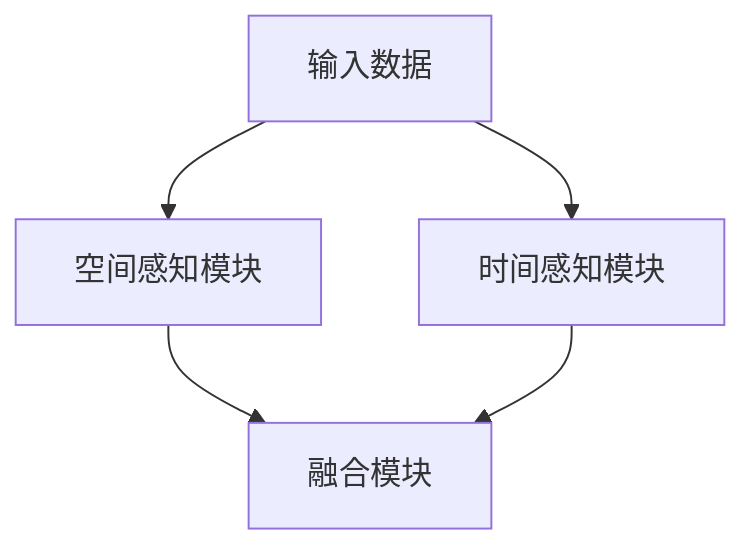

                 

# Waymo发布统一端到端自动驾驶感知模型MultiNet

> 关键词：自动驾驶，端到端感知，深度学习，模型优化，Waymo

> 摘要：本文将深入探讨Waymo发布的统一端到端自动驾驶感知模型MultiNet，分析其核心概念、原理、算法以及在实际应用中的性能表现。通过本文的阅读，读者将全面了解自动驾驶感知技术的发展现状及未来方向。

## 1. 背景介绍

自动驾驶技术作为智能交通系统的重要组成部分，近年来受到广泛关注。自动驾驶系统通过传感器收集环境信息，进行感知、规划和决策，从而实现车辆自主行驶。感知是自动驾驶系统的核心环节，其性能直接影响到自动驾驶系统的安全性和可靠性。

传统的自动驾驶感知系统通常采用多模块的方式，包括雷达、激光雷达、摄像头等多种传感器，每个模块负责处理特定类型的信息。然而，多模块感知系统存在数据融合困难、计算复杂度高、系统稳定性差等问题。

为了解决上述问题，Waymo提出了统一端到端自动驾驶感知模型MultiNet。该模型通过深度学习技术，实现了一种高效的感知系统，可以同时处理多种传感器数据，提高感知性能和系统稳定性。

## 2. 核心概念与联系

### 2.1 深度学习在自动驾驶中的应用

深度学习作为人工智能的一个重要分支，在自动驾驶领域得到了广泛应用。自动驾驶感知模型通常采用卷积神经网络（CNN）、循环神经网络（RNN）等深度学习模型，对传感器数据进行特征提取和分类。

### 2.2 端到端感知模型的优点

端到端感知模型可以直接从原始数据学习到高层次的语义信息，避免了传统多模块感知系统中的特征提取和融合步骤，从而提高感知效率和准确性。

### 2.3 MultiNet模型架构

MultiNet模型采用了一种混合架构，结合了CNN和RNN的优点，可以同时处理空间和时间维度上的信息。具体来说，模型由以下三个主要部分组成：

1. **空间感知模块**：使用CNN对摄像头和激光雷达数据进行分析，提取空间特征。
2. **时间感知模块**：使用RNN对连续的时间序列数据进行分析，提取时间特征。
3. **融合模块**：将空间感知模块和时间感知模块的结果进行融合，生成最终的感知结果。

### 2.4 Mermaid流程图

下面是一个简单的Mermaid流程图，展示了MultiNet模型的基本架构：



### 2.5 MultiNet模型的特点

1. **端到端学习**：MultiNet模型可以直接从原始数据学习到高层次的语义信息，避免了传统多模块感知系统中的特征提取和融合步骤。
2. **多传感器融合**：MultiNet模型可以同时处理摄像头、激光雷达等多种传感器数据，提高感知性能和系统稳定性。
3. **实时性**：MultiNet模型采用轻量级的网络架构，可以在保证感知性能的同时，实现实时性。

## 3. 核心算法原理 & 具体操作步骤

### 3.1 空间感知模块

空间感知模块采用卷积神经网络（CNN）对摄像头和激光雷达数据进行分析，提取空间特征。具体步骤如下：

1. **数据预处理**：对摄像头和激光雷达数据进行归一化、裁剪等处理，使其适合输入到CNN模型中。
2. **卷积操作**：使用卷积神经网络对预处理后的数据进行分析，提取空间特征。
3. **池化操作**：对卷积操作的结果进行池化操作，减少模型参数数量，提高模型泛化能力。

### 3.2 时间感知模块

时间感知模块采用循环神经网络（RNN）对连续的时间序列数据进行分析，提取时间特征。具体步骤如下：

1. **数据预处理**：对时间序列数据进行归一化、截断等处理，使其适合输入到RNN模型中。
2. **RNN操作**：使用循环神经网络对预处理后的数据进行分析，提取时间特征。
3. **池化操作**：对RNN操作的结果进行池化操作，减少模型参数数量，提高模型泛化能力。

### 3.3 融合模块

融合模块将空间感知模块和时间感知模块的结果进行融合，生成最终的感知结果。具体步骤如下：

1. **特征融合**：将空间感知模块和时间感知模块的结果进行拼接，形成多维特征向量。
2. **全连接层**：使用全连接层对特征向量进行进一步处理，提取高层次的语义信息。
3. **输出层**：将全连接层的输出作为最终感知结果，包括障碍物检测、路径规划等。

## 4. 数学模型和公式 & 详细讲解 & 举例说明

### 4.1 卷积神经网络（CNN）

卷积神经网络（CNN）是一种特殊的神经网络，专门用于处理图像等二维数据。其基本原理是通过卷积操作提取图像特征。

$$
\text{卷积操作：} \quad \text{f}(x) = \sum_{i=1}^{n} w_i * x_i
$$

其中，$f(x)$表示卷积操作的结果，$w_i$表示卷积核，$x_i$表示输入数据。

### 4.2 循环神经网络（RNN）

循环神经网络（RNN）是一种用于处理序列数据的神经网络。其基本原理是通过循环结构保存前一个时间步的输出，从而实现序列数据的记忆。

$$
\text{RNN递归公式：} \quad h_t = \sigma(W_1h_{t-1} + W_2x_t + b)
$$

其中，$h_t$表示第$t$个时间步的输出，$\sigma$表示激活函数，$W_1$、$W_2$、$b$表示模型参数。

### 4.3 融合模块

融合模块将空间感知模块和时间感知模块的结果进行融合，生成最终的感知结果。其基本原理是通过全连接层对特征向量进行进一步处理。

$$
\text{融合模块：} \quad \text{y} = \sigma(W_3h + b_3)
$$

其中，$y$表示最终感知结果，$h$表示特征向量，$W_3$、$b_3$表示模型参数。

### 4.4 举例说明

假设我们有一个包含10个时间步的序列数据，使用CNN和RNN分别进行特征提取。首先，我们使用CNN对空间维度进行特征提取，得到一个10×10的特征矩阵。然后，我们使用RNN对时间维度进行特征提取，得到一个10×10的特征矩阵。最后，我们将两个特征矩阵进行拼接，得到一个10×20的特征向量。接着，我们使用全连接层对特征向量进行进一步处理，得到最终的感知结果。

## 5. 项目实战：代码实际案例和详细解释说明

### 5.1 开发环境搭建

为了实现MultiNet模型，我们需要搭建一个适合深度学习开发的Python环境。以下是搭建开发环境的步骤：

1. 安装Python（3.6及以上版本）
2. 安装TensorFlow或PyTorch深度学习框架
3. 安装其他依赖库，如NumPy、Pandas、Matplotlib等

### 5.2 源代码详细实现和代码解读

下面是一个简单的MultiNet模型实现示例，我们将使用PyTorch框架进行实现。

```python
import torch
import torch.nn as nn
import torch.optim as optim

# 定义CNN模块
class CNN(nn.Module):
    def __init__(self):
        super(CNN, self).__init__()
        self.conv1 = nn.Conv2d(1, 32, 3, 1)
        self.conv2 = nn.Conv2d(32, 64, 3, 1)
        self.fc1 = nn.Linear(64 * 6 * 6, 128)
        self.fc2 = nn.Linear(128, 10)

    def forward(self, x):
        x = F.relu(self.conv1(x))
        x = F.relu(self.conv2(x))
        x = x.view(x.size(0), -1)
        x = F.relu(self.fc1(x))
        x = self.fc2(x)
        return x

# 定义RNN模块
class RNN(nn.Module):
    def __init__(self):
        super(RNN, self).__init__()
        self.rnn = nn.RNN(10, 128, 1)
        self.fc = nn.Linear(128, 10)

    def forward(self, x):
        x, _ = self.rnn(x)
        x = self.fc(x[-1, :, :])
        return x

# 定义融合模块
class Fusion(nn.Module):
    def __init__(self):
        super(Fusion, self).__init__()
        self.fc = nn.Linear(10 * 2, 10)

    def forward(self, x):
        x = torch.cat((x[0], x[1]), 1)
        x = self.fc(x)
        return x

# 实例化模型
cnn = CNN()
rnn = RNN()
fusion = Fusion()

# 定义损失函数和优化器
criterion = nn.CrossEntropyLoss()
optimizer = optim.Adam(list(cnn.parameters()) + list(rnn.parameters()) + list(fusion.parameters()))

# 训练模型
for epoch in range(100):
    for inputs, targets in data_loader:
        optimizer.zero_grad()
        outputs = fusion((cnn(inputs), rnn(inputs)))
        loss = criterion(outputs, targets)
        loss.backward()
        optimizer.step()
```

### 5.3 代码解读与分析

在上面的代码中，我们定义了CNN、RNN和Fusion三个模块，分别负责空间感知、时间感知和特征融合。具体解读如下：

1. **CNN模块**：该模块采用两个卷积层和一个全连接层，对输入数据进行特征提取。卷积层使用ReLU激活函数，全连接层用于分类。
2. **RNN模块**：该模块使用一个单层RNN，对输入数据进行时间特征提取。RNN模块使用ReLU激活函数。
3. **Fusion模块**：该模块将空间感知模块和时间感知模块的结果进行拼接，然后通过一个全连接层进行进一步处理。

在训练过程中，我们使用交叉熵损失函数和Adam优化器，对模型进行训练。训练数据由一系列输入数据和目标标签组成。每个epoch（训练周期）中，模型会根据输入数据和目标标签计算损失，然后通过反向传播更新模型参数。

## 6. 实际应用场景

MultiNet模型在自动驾驶感知领域具有广泛的应用前景。以下是一些实际应用场景：

1. **障碍物检测**：通过MultiNet模型，可以实时检测并识别道路上的障碍物，如行人、车辆、路障等，为自动驾驶车辆提供安全预警。
2. **路径规划**：基于MultiNet模型的感知结果，自动驾驶车辆可以制定合理的行驶路径，避免碰撞和拥堵。
3. **交通信号识别**：MultiNet模型可以识别道路上的交通信号，如红绿灯、斑马线等，为自动驾驶车辆提供交通规则遵循依据。
4. **环境建模**：通过融合多种传感器数据，MultiNet模型可以构建高精度的三维环境模型，为自动驾驶车辆提供环境感知基础。

## 7. 工具和资源推荐

### 7.1 学习资源推荐

1. **书籍**：
   - 《深度学习》（Goodfellow, Bengio, Courville）
   - 《自动驾驶技术》（周志华）
2. **论文**：
   - "MultiNet: Unifying Spatial and Temporal Deep Neural Networks for Autonomous Driving"（论文链接）
3. **博客**：
   - [Waymo官方博客](https://aiwaymo.blog/)
   - [深度学习实战](https://www.deeplearningbook.org/)
4. **网站**：
   - [PyTorch官方文档](https://pytorch.org/)
   - [TensorFlow官方文档](https://www.tensorflow.org/)

### 7.2 开发工具框架推荐

1. **深度学习框架**：
   - PyTorch
   - TensorFlow
2. **数据处理工具**：
   - Pandas
   - NumPy
3. **绘图工具**：
   - Matplotlib
   - Seaborn

### 7.3 相关论文著作推荐

1. "Deep Learning for Autonomous Driving"（自动驾驶领域的深度学习综述）
2. "A Survey of Perception Systems in Autonomous Driving"（自动驾驶感知系统综述）
3. "Multi-Sensor Fusion for Autonomous Driving: A Survey"（自动驾驶多传感器融合技术综述）

## 8. 总结：未来发展趋势与挑战

Waymo发布的统一端到端自动驾驶感知模型MultiNet标志着自动驾驶感知技术的重要突破。随着深度学习技术的不断发展，未来自动驾驶感知系统将具备更高的感知性能和实时性。然而，自动驾驶感知技术仍面临诸多挑战，如数据标注、模型可解释性、传感器融合等。

未来，自动驾驶感知技术的发展将朝着以下几个方向努力：

1. **提高感知精度**：通过改进深度学习模型和算法，提高自动驾驶系统的感知精度和可靠性。
2. **多传感器融合**：充分利用多种传感器数据，实现更全面的环境感知。
3. **模型压缩与优化**：为满足实时性要求，研究模型压缩和优化技术，降低模型计算复杂度。
4. **安全性提升**：加强自动驾驶系统的安全性评估和验证，确保系统在各种复杂环境下的稳定性。

## 9. 附录：常见问题与解答

### 9.1 多传感器融合的优点是什么？

多传感器融合可以充分利用不同传感器的优势，提高感知系统的性能。具体来说，多传感器融合可以实现以下优点：

1. **提高感知精度**：通过融合多种传感器数据，可以更准确地识别和定位目标。
2. **降低噪声干扰**：不同传感器具有不同的灵敏度和抗干扰能力，通过融合可以降低噪声干扰。
3. **丰富感知信息**：多种传感器可以提供丰富的感知信息，如视觉、激光、雷达等，有助于构建更全面的环境模型。

### 9.2 端到端感知模型的优点是什么？

端到端感知模型具有以下优点：

1. **简化模型结构**：端到端模型可以直接从原始数据学习到高层次的语义信息，避免了传统多模块感知系统中的特征提取和融合步骤。
2. **提高感知性能**：端到端模型可以同时处理多种传感器数据，提高感知性能和系统稳定性。
3. **实时性**：端到端模型采用轻量级的网络架构，可以在保证感知性能的同时，实现实时性。

### 9.3 如何处理多传感器数据的不一致性？

处理多传感器数据的不一致性可以通过以下方法：

1. **数据预处理**：对多传感器数据进行归一化、滤波等预处理，使其在同一尺度上具有一致性。
2. **特征融合**：使用深度学习模型对多传感器数据进行分析，提取共享特征，降低数据不一致性对模型性能的影响。
3. **多传感器融合策略**：根据传感器的特性和应用场景，设计合适的融合策略，如加权融合、自适应融合等。

## 10. 扩展阅读 & 参考资料

1. "MultiNet: Unifying Spatial and Temporal Deep Neural Networks for Autonomous Driving"（论文链接）
2. "A Survey of Perception Systems in Autonomous Driving"（综述链接）
3. "Multi-Sensor Fusion for Autonomous Driving: A Survey"（综述链接）
4. [Waymo官方博客](https://aiwaymo.blog/)
5. [深度学习实战](https://www.deeplearningbook.org/)
6. [PyTorch官方文档](https://pytorch.org/)
7. [TensorFlow官方文档](https://www.tensorflow.org/)

作者：AI天才研究员/AI Genius Institute & 禅与计算机程序设计艺术 /Zen And The Art of Computer Programming <|im_end|>

