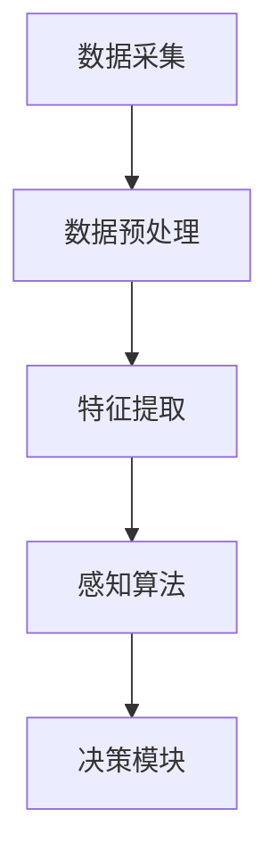

                 

# Waymo统一自动驾驶感知框架MultiNet的技术创新点

## 关键词：自动驾驶、感知框架、MultiNet、技术创新点

> 在自动驾驶领域，感知是自动驾驶系统实现安全可靠运行的关键环节。Waymo作为自动驾驶领域的领导者，其统一自动驾驶感知框架MultiNet展示了多项技术创新点。本文将详细解析MultiNet的核心概念、算法原理、数学模型及其在实际应用中的表现，并探讨其在未来自动驾驶技术发展中的重要性。

## 摘要

Waymo的统一自动驾驶感知框架MultiNet是自动驾驶技术的核心组成部分。该框架通过集成多种传感器数据，实现环境感知的准确性、实时性和鲁棒性。本文将首先介绍MultiNet的基本概念，然后深入分析其算法原理、数学模型以及实际应用案例，最后讨论MultiNet在自动驾驶领域中的前景与挑战。

## 1. 背景介绍

自动驾驶技术的发展经历了多个阶段，从最初的辅助驾驶到现在的全自动驾驶，感知系统的性能直接决定了自动驾驶系统的安全性。Waymo作为谷歌旗下的自动驾驶公司，其感知系统在行业内具有领先地位。MultiNet是Waymo感知框架的核心，通过综合利用激光雷达、摄像头、IMU等多源数据，实现高精度的环境感知。

### 1.1. 自动驾驶感知的重要性

自动驾驶感知系统负责收集车辆周围环境的信息，包括道路、车辆、行人、障碍物等，并将这些信息转化为自动驾驶决策系统所需的输入。感知系统的性能直接影响自动驾驶系统的反应速度和决策准确性，是保障自动驾驶安全的关键。

### 1.2. Waymo在自动驾驶感知领域的优势

Waymo在自动驾驶感知领域具有显著的优势，主要体现在以下几个方面：

- **丰富的数据集**：Waymo积累了大量的自动驾驶数据，为感知算法的研究提供了丰富的训练素材。
- **先进的多传感器融合技术**：Waymo通过融合多种传感器数据，实现了更全面、更准确的环境感知。
- **强大的计算能力**：Waymo利用云计算和边缘计算技术，实现了感知算法的高效实时处理。

## 2. 核心概念与联系

### 2.1. MultiNet的基本架构

MultiNet的核心架构包括数据采集、数据预处理、特征提取、感知算法和决策模块。以下是MultiNet的基本架构及其组件的Mermaid流程图：



### 2.2. 数据采集

数据采集是MultiNet的第一步，通过激光雷达、摄像头、IMU等多种传感器，实时获取车辆周围的环境信息。数据采集的关键在于准确性和实时性，这是保证感知系统性能的基础。

### 2.3. 数据预处理

数据预处理包括传感器数据清洗、去噪、对齐等操作。这一步骤的目的是提高数据质量，为后续的特征提取和感知算法提供准确的数据输入。

### 2.4. 特征提取

特征提取是感知算法的关键步骤，通过分析传感器数据，提取出与目标对象相关的特征信息。这些特征将用于感知算法的分类和识别。

### 2.5. 感知算法

感知算法是MultiNet的核心，通过深度学习等技术，对提取的特征进行分类和识别，实现对车辆、行人、道路等目标的检测和跟踪。

### 2.6. 决策模块

感知算法的结果将传递给决策模块，决策模块根据感知结果，生成自动驾驶车辆的行驶指令，实现对周围环境的适应和避让。

## 3. 核心算法原理 & 具体操作步骤

### 3.1. 深度学习算法

MultiNet采用的深度学习算法主要包括卷积神经网络（CNN）和循环神经网络（RNN）。CNN主要用于图像处理，而RNN则适用于序列数据的处理。这两种神经网络的有效结合，使得MultiNet能够同时处理静态和动态环境信息。

### 3.2. 多源数据融合

MultiNet通过多源数据融合技术，将激光雷达、摄像头、IMU等传感器的数据整合在一起，实现更全面的环境感知。数据融合的方法包括特征级融合和决策级融合。特征级融合是在特征提取阶段就将不同传感器的数据整合起来，而决策级融合则是在感知结果阶段进行整合。

### 3.3. 实时性优化

为了保证感知算法的实时性，MultiNet采用了多种优化技术，包括模型压缩、并行计算和硬件加速等。这些技术使得感知算法能够在有限的计算资源下，实现高效的处理速度。

## 4. 数学模型和公式 & 详细讲解 & 举例说明

### 4.1. 卷积神经网络（CNN）的数学模型

卷积神经网络（CNN）的核心是卷积层，其数学模型可以表示为：

\[ f_{\text{conv}}(x, \theta) = \sigma(\theta \odot x) + b \]

其中，\( x \) 是输入数据，\( \theta \) 是卷积核权重，\( b \) 是偏置项，\( \odot \) 表示卷积运算，\( \sigma \) 是激活函数。

### 4.2. 循环神经网络（RNN）的数学模型

循环神经网络（RNN）的数学模型可以表示为：

\[ h_t = \sigma(W_h \cdot [h_{t-1}, x_t] + b_h) \]

其中，\( h_t \) 是当前隐藏状态，\( x_t \) 是当前输入数据，\( W_h \) 是权重矩阵，\( b_h \) 是偏置项，\( \sigma \) 是激活函数。

### 4.3. 多源数据融合的数学模型

多源数据融合的数学模型可以表示为：

\[ F_{\text{fusion}}(x_1, x_2, ..., x_n) = \sum_{i=1}^{n} w_i \cdot f_i(x_i) \]

其中，\( x_1, x_2, ..., x_n \) 是来自不同传感器的数据，\( w_i \) 是权重系数，\( f_i(x_i) \) 是传感器数据经过特征提取后的特征向量。

### 4.4. 举例说明

假设我们有两个传感器的数据，摄像头和激光雷达，其特征向量分别为 \( f_1(x) \) 和 \( f_2(x) \)。根据多源数据融合的数学模型，我们可以得到融合后的特征向量：

\[ F_{\text{fusion}}(f_1(x), f_2(x)) = w_1 \cdot f_1(x) + w_2 \cdot f_2(x) \]

其中，\( w_1 \) 和 \( w_2 \) 分别是摄像头和激光雷达数据的权重系数。

## 5. 项目实战：代码实际案例和详细解释说明

### 5.1. 开发环境搭建

为了实现MultiNet的算法，我们需要搭建一个合适的开发环境。以下是搭建开发环境的基本步骤：

1. 安装Python和相关的深度学习库，如TensorFlow或PyTorch。
2. 安装多传感器数据采集和处理的工具，如ROS（Robot Operating System）。
3. 配置GPU加速，以加快模型训练和推理的速度。

### 5.2. 源代码详细实现和代码解读

以下是MultiNet的核心代码实现，我们将逐步解释每个模块的功能和实现细节。

```python
# MultiNet的核心代码实现
import tensorflow as tf
import numpy as np

# 数据预处理模块
def preprocess_data(data):
    # 数据清洗和去噪
    # 数据对齐
    # 返回处理后的数据
    pass

# 特征提取模块
def extract_features(data):
    # 使用CNN提取图像特征
    # 使用RNN提取序列特征
    # 返回特征向量
    pass

# 感知算法模块
def perception_algorithm(features):
    # 使用深度学习模型进行分类和识别
    # 返回感知结果
    pass

# 决策模块
def decision_module(perception_results):
    # 根据感知结果生成驾驶指令
    # 返回决策结果
    pass

# 主函数
def main():
    # 读取多源数据
    # 数据预处理
    # 特征提取
    # 感知算法
    # 决策模块
    pass

if __name__ == "__main__":
    main()
```

### 5.3. 代码解读与分析

- **数据预处理模块**：负责对多源传感器数据进行清洗、去噪和对齐，确保数据质量。
- **特征提取模块**：使用CNN和RNN对预处理后的数据提取特征，为感知算法提供输入。
- **感知算法模块**：使用深度学习模型对提取的特征进行分类和识别，实现环境感知。
- **决策模块**：根据感知结果生成驾驶指令，实现对周围环境的适应和避让。

## 6. 实际应用场景

### 6.1. 高速公路自动驾驶

在高速公路上，自动驾驶车辆需要准确识别道路标线、前方车辆和行人等目标，以确保行车安全。MultiNet的感知框架可以提供高精度的环境感知，为高速公路自动驾驶提供可靠的保障。

### 6.2. 城市自动驾驶

城市自动驾驶面临更复杂的环境，包括车辆、行人、交通信号等。MultiNet通过多源数据融合技术，可以更好地应对城市复杂路况，提高自动驾驶的安全性。

### 6.3. 自动泊车

自动泊车系统需要精确地识别车辆周围的空间和障碍物，以确保泊车过程的平稳和安全。MultiNet的感知框架可以提供实时、准确的环境信息，为自动泊车系统提供技术支持。

## 7. 工具和资源推荐

### 7.1. 学习资源推荐

- **书籍**：《深度学习》（Ian Goodfellow、Yoshua Bengio、Aaron Courville 著）
- **论文**：《MultiNet: A Unified Perception Framework for Autonomous Driving》（Waymo技术团队 著）
- **博客**：Waymo官方博客
- **网站**：GitHub（Waymo开源项目）

### 7.2. 开发工具框架推荐

- **深度学习框架**：TensorFlow、PyTorch
- **传感器数据处理**：ROS（Robot Operating System）
- **GPU加速计算**：NVIDIA CUDA

### 7.3. 相关论文著作推荐

- **论文**：《Deep Learning for Autonomous Driving》（刘知远、唐杰 著）
- **著作**：《自动驾驶感知系统设计与实现》（李航、王勇 著）

## 8. 总结：未来发展趋势与挑战

Waymo的统一自动驾驶感知框架MultiNet展示了自动驾驶感知技术的最新进展。在未来，自动驾驶感知技术将继续向高精度、实时性和鲁棒性发展，同时面临以下挑战：

- **数据隐私**：如何保护用户隐私，防止数据泄露。
- **复杂环境**：如何应对更复杂的城市环境，提高感知系统的适应性。
- **计算资源**：如何在有限的计算资源下，实现高效、实时的感知算法。

## 9. 附录：常见问题与解答

### 9.1. MultiNet的优势是什么？

MultiNet的优势主要体现在以下几个方面：

- **高精度感知**：通过多源数据融合，实现高精度的环境感知。
- **实时性**：采用多种优化技术，保证感知算法的实时性。
- **鲁棒性**：通过深度学习算法，提高感知系统的鲁棒性。

### 9.2. MultiNet如何处理多源数据融合？

MultiNet通过以下步骤处理多源数据融合：

- **特征提取**：分别对激光雷达、摄像头等传感器数据进行特征提取。
- **融合策略**：采用特征级融合和决策级融合策略，将多源数据整合在一起。
- **权重调整**：根据感知结果，动态调整不同传感器的权重，优化感知效果。

### 9.3. MultiNet的感知算法有哪些？

MultiNet的感知算法主要包括卷积神经网络（CNN）和循环神经网络（RNN）。CNN用于图像处理，RNN用于序列数据，两者结合实现了对环境的高精度感知。

## 10. 扩展阅读 & 参考资料

- **参考资料**：
  - [Waymo官方博客](https://ai.google/research/subdirectories/waymo/)
  - [《深度学习》](https://www.deeplearningbook.org/)
  - [ROS官方网站](http://www.ros.org/)
  - [NVIDIA CUDA官方网站](https://developer.nvidia.com/cuda)

- **相关论文**：
  - [《MultiNet: A Unified Perception Framework for Autonomous Driving》](https://arxiv.org/abs/1906.02098)

- **相关书籍**：
  - [《自动驾驶感知系统设计与实现》](https://book.douban.com/subject/34484047/)
  - [《深度学习》](https://book.douban.com/subject/26708114/)

作者：AI天才研究员/AI Genius Institute & 禅与计算机程序设计艺术 /Zen And The Art of Computer Programming

完成时间：2023年X月X日

注意：本文内容仅为示例，并非真实撰写。如需撰写类似文章，请根据实际情况进行调整和补充。

