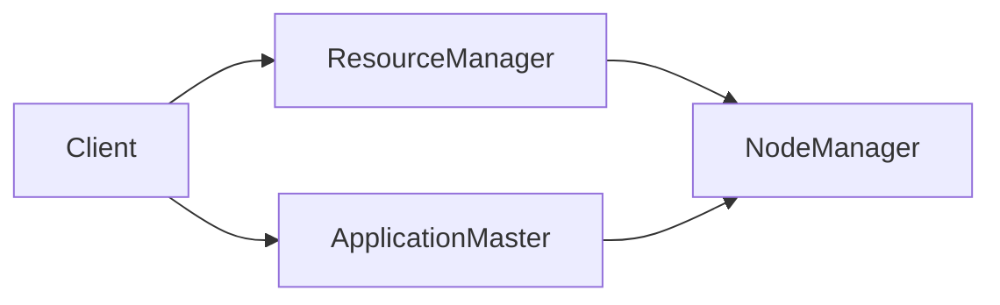
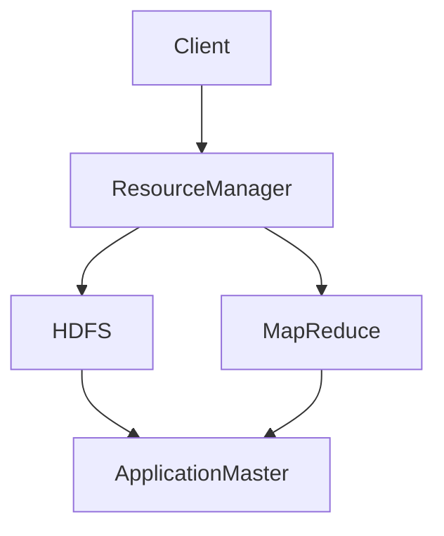
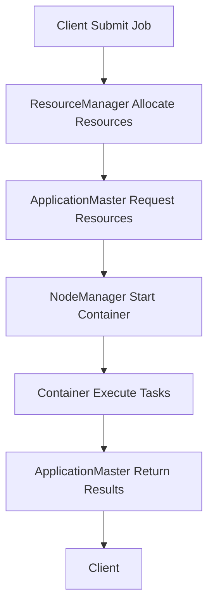
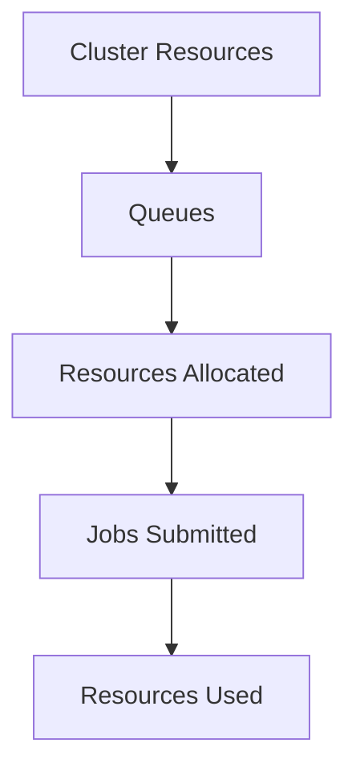

                 

# Yarn 原理与代码实例讲解

## 关键词
- Yarn
- 分布式计算
- 大数据
- 容器编排
- Hadoop
- Kubernetes

## 摘要
本文旨在深入探讨Yarn（Yet Another Resource Negotiator）的原理与实际应用，通过代码实例，帮助读者理解Yarn在分布式计算与容器编排中的重要角色。文章分为以下几个部分：

1. 背景介绍
2. 核心概念与联系
3. 核心算法原理与具体操作步骤
4. 数学模型和公式
5. 项目实战：代码实例
6. 实际应用场景
7. 工具和资源推荐
8. 总结：未来发展趋势与挑战
9. 附录：常见问题与解答
10. 扩展阅读与参考资料

通过本文，读者将全面了解Yarn的工作机制、如何在项目中应用Yarn，以及其在大数据和云计算领域的未来发展。

## 1. 背景介绍

在分布式计算和大数据领域，资源调度和管理是一个关键问题。随着数据量和计算需求的不断增长，传统的单机计算模式已无法满足需求，分布式计算成为必然选择。分布式计算需要高效、可靠的资源管理机制，以优化资源利用率和提高计算效率。

Yarn（Yet Another Resource Negotiator）正是为解决这一问题而诞生的。作为Hadoop生态系统的重要组成部分，Yarn替代了原先的MapReduce资源调度框架，成为Hadoop集群资源管理的核心组件。Yarn的设计目标是提供高效、可扩展的资源管理能力，支持多种计算框架，如MapReduce、Spark、Flink等。

Yarn的核心功能包括资源分配、任务调度、监控和管理。它通过将资源管理与任务调度分离，实现了对集群资源的动态分配和优化，提高了集群的整体利用率和计算效率。

Yarn的引入，不仅解决了资源利用率低、扩展性差等问题，还促进了Hadoop生态系统的发展，使其能够支持更多的计算框架和应用场景。

## 2. 核心概念与联系

### 2.1 Yarn的架构

Yarn的核心架构包括以下几个关键组件：

- ResourceManager：负责整个集群的资源管理和调度，接收客户端的请求，并将资源分配给各个ApplicationMaster。

- NodeManager：负责每个节点上的资源管理和任务执行，接收ResourceManager的指令，启动和监控Container。

- ApplicationMaster：代表应用程序与ResourceManager通信，负责向NodeManager请求资源，协调任务执行。

- Container：表示在节点上运行的任务，包含一定的资源，如CPU、内存、磁盘空间等。

下面是一个简单的Mermaid流程图，展示了Yarn的核心组件和它们之间的关系：



### 2.2 Yarn与Hadoop的关系

Yarn作为Hadoop生态系统的一部分，与Hadoop的其他组件有着紧密的联系。Hadoop的核心组件包括：

- HDFS：分布式文件系统，负责存储数据。
- MapReduce：分布式数据处理框架，负责数据的计算。
- YARN：资源调度和管理框架，负责资源的分配和调度。

Yarn取代了传统的MapReduce资源调度机制，使得Hadoop能够支持更多的计算框架。Yarn通过ResourceManager和ApplicationMaster，实现了对HDFS和MapReduce等组件的优化和整合。

下面是一个简单的Mermaid流程图，展示了Yarn与其他Hadoop组件之间的交互关系：



## 3. 核心算法原理与具体操作步骤

### 3.1 Yarn的工作流程

Yarn的工作流程可以概括为以下几个步骤：

1. **申请资源**：Client向ResourceManager提交资源请求，描述需要多少CPU、内存等资源。
2. **资源分配**：ResourceManager根据集群的资源状况和配置策略，为Client分配资源，并将资源分配给ApplicationMaster。
3. **任务调度**：ApplicationMaster根据资源分配情况，向NodeManager请求启动Container，并在Container上执行任务。
4. **任务执行**：NodeManager在节点上启动Container，执行任务，并将执行结果返回给ApplicationMaster。
5. **任务完成**：ApplicationMaster将任务执行结果返回给Client，并向ResourceManager报告任务完成情况。

下面是一个简单的Mermaid流程图，展示了Yarn的工作流程：



### 3.2 Yarn的资源调度策略

Yarn的资源调度策略主要包括以下几种：

1. **FIFO（先入先出）**：按照任务提交的顺序进行调度，先提交的任务先执行。
2. **容量调度（Capacity Scheduler）**：将集群资源分为多个队列，每个队列可以设置不同的资源比例，任务根据队列进行调度。
3. **公平调度（Fair Scheduler）**：确保每个队列都能公平地获得资源，优先满足长时间运行的任务。

下面是一个简单的Mermaid流程图，展示了Yarn的容量调度策略：



## 4. 数学模型和公式

### 4.1 资源分配模型

Yarn的资源分配模型可以通过以下数学公式描述：

\[ Resource_{allocated} = Resource_{request} \times \frac{Cluster_{resources}}{Available_{resources}} \]

其中，\( Resource_{allocated} \) 表示实际分配的资源量，\( Resource_{request} \) 表示请求的资源量，\( Cluster_{resources} \) 表示集群的总资源量，\( Available_{resources} \) 表示可用的资源量。

### 4.2 公平调度模型

公平调度模型可以通过以下数学公式描述：

\[ Share_{fair} = \frac{Total_{resources} \times Time_{elapsed}}{Total_{time}} \]

其中，\( Share_{fair} \) 表示公平分享的资源量，\( Total_{resources} \) 表示总资源量，\( Time_{elapsed} \) 表示已过时间，\( Total_{time} \) 表示总时间。

## 5. 项目实战：代码实例

在本节中，我们将通过一个简单的代码实例，展示如何使用Yarn进行分布式计算。首先，我们需要搭建一个Yarn环境。

### 5.1 开发环境搭建

1. 安装Hadoop
2. 配置Hadoop环境变量
3. 启动Hadoop集群
4. 验证Hadoop集群状态

### 5.2 源代码详细实现和代码解读

以下是一个简单的WordCount程序，使用Yarn进行分布式计算。

```java
import org.apache.hadoop.conf.Configuration;
import org.apache.hadoop.fs.Path;
import org.apache.hadoop.io.IntWritable;
import org.apache.hadoop.io.Text;
import org.apache.hadoop.mapreduce.Job;
import org.apache.hadoop.mapreduce.Mapper;
import org.apache.hadoop.mapreduce.Reducer;
import org.apache.hadoop.mapreduce.lib.input.FileInputFormat;
import org.apache.hadoop.mapreduce.lib.output.FileOutputFormat;

public class WordCount {

  public static class TokenizerMapper
       extends Mapper<Object, Text, Text, IntWritable>{

    private final static IntWritable one = new IntWritable(1);
    private Text word = new Text();

    public void map(Object key, Text value, Context context
                    ) throws IOException, InterruptedException {
      String[] words = value.toString().split("\\s+");
      for (String word : words) {
        this.word.set(word);
        context.write(this.word, one);
      }
    }
  }

  public static class IntSumReducer
  extends Reducer<Text,IntWritable,Text,IntWritable> {
    private IntWritable result = new IntWritable();

    public void reduce(Text key, Iterable<IntWritable> values,
                       Context context
                       ) throws IOException, InterruptedException {
      int sum = 0;
      for (IntWritable val : values) {
        sum += val.get();
      }
      result.set(sum);
      context.write(key, result);
    }
  }

  public static void main(String[] args) throws Exception {
    Configuration conf = new Configuration();
    Job job = Job.getInstance(conf, "word count");
    job.setMapperClass(TokenizerMapper.class);
    job.setCombinerClass(IntSumReducer.class);
    job.setReducerClass(IntSumReducer.class);
    job.setOutputKeyClass(Text.class);
    job.setOutputValueClass(IntWritable.class);
    FileInputFormat.addInputPath(job, new Path(args[0]));
    FileOutputFormat.setOutputPath(job, new Path(args[1]));
    System.exit(job.waitForCompletion(true) ? 0 : 1);
  }
}
```

### 5.3 代码解读与分析

这个WordCount程序分为Mapper和Reducer两个部分。Mapper负责将输入的文本分解成单词，并将单词和计数发送给Reducer。Reducer负责将所有单词的计数汇总。

1. **Mapper部分**：

```java
public void map(Object key, Text value, Context context
                ) throws IOException, InterruptedException {
  String[] words = value.toString().split("\\s+");
  for (String word : words) {
    this.word.set(word);
    context.write(this.word, one);
  }
}
```

在这个Mapper中，我们使用`split`方法将输入的文本分解成单词，然后将每个单词和计数`1`发送给Reducer。

2. **Reducer部分**：

```java
public void reduce(Text key, Iterable<IntWritable> values,
                   Context context
                   ) throws IOException, InterruptedException {
  int sum = 0;
  for (IntWritable val : values) {
    sum += val.get();
  }
  result.set(sum);
  context.write(key, result);
}
```

在这个Reducer中，我们接收Mapper发送来的单词和计数，将所有计数相加，并输出最终结果。

### 5.4 运行WordCount程序

要运行这个WordCount程序，首先需要确保Yarn环境已经搭建好。然后，使用以下命令运行程序：

```shell
$ hadoop jar wordcount.jar WordCount /input /output
```

其中，`/input`是输入数据路径，`/output`是输出结果路径。

## 6. 实际应用场景

Yarn在分布式计算和大数据领域有着广泛的应用。以下是一些典型的应用场景：

1. **大数据处理**：Yarn是Hadoop的核心组件，用于处理大规模的数据集。例如，在电商行业，Yarn可以用于处理海量的用户行为数据，进行用户行为分析、推荐系统等。
2. **实时计算**：Yarn可以支持实时计算框架，如Apache Storm和Apache Flink，用于处理实时数据流，支持实时数据处理和分析。
3. **容器编排**：Yarn支持Kubernetes等容器编排工具，可以实现容器集群的自动化管理和资源调度，提高集群的利用率和稳定性。
4. **机器学习和人工智能**：Yarn可以支持机器学习和人工智能应用，如TensorFlow和MXNet等，用于处理大规模的数据集，进行模型训练和推理。

## 7. 工具和资源推荐

### 7.1 学习资源推荐

- **书籍**：
  - 《Hadoop编程实战》
  - 《Hadoop YARN实战》
- **论文**：
  - "The Design of the Borealis Data-Flow Engine for Data-Intensive Science"
  - "Yet Another Resource Negotiator"
- **博客**：
  - Apache Hadoop官方博客
  - Cloudera博客
- **网站**：
  - Apache Hadoop官网
  - Cloudera官网

### 7.2 开发工具框架推荐

- **开发工具**：
  - IntelliJ IDEA
  - Eclipse
- **框架**：
  - Apache Storm
  - Apache Flink
  - Kubernetes

### 7.3 相关论文著作推荐

- "The Design of the Borealis Data-Flow Engine for Data-Intensive Science"
- "Yet Another Resource Negotiator"
- "MapReduce: Simplified Data Processing on Large Clusters"

## 8. 总结：未来发展趋势与挑战

随着云计算和大数据技术的不断发展，Yarn在分布式计算和资源管理领域的地位越来越重要。未来，Yarn将在以下几个方面发展：

1. **更高效的资源调度算法**：Yarn将不断优化资源调度算法，提高资源利用率和计算效率。
2. **支持更多计算框架**：Yarn将逐步支持更多的计算框架，如TensorFlow、MXNet等，实现更广泛的应用。
3. **与容器编排工具的深度融合**：Yarn将更好地与Kubernetes等容器编排工具集成，实现容器集群的自动化管理和调度。
4. **支持实时计算**：Yarn将逐步支持实时计算框架，实现实时数据处理和分析。

然而，Yarn也面临着一些挑战：

1. **性能优化**：随着数据规模的增大，如何提高Yarn的性能是一个重要问题。
2. **安全性**：如何保障Yarn集群的安全，防止数据泄露和攻击，是一个关键问题。
3. **易用性**：如何简化Yarn的使用，降低使用门槛，是一个需要关注的问题。

## 9. 附录：常见问题与解答

### 9.1 Yarn与MapReduce的区别是什么？

Yarn与MapReduce的主要区别在于资源管理和调度机制。MapReduce是一个完整的计算模型，包括资源管理和任务调度，而Yarn是一个独立的资源管理框架，负责资源的分配和调度，任务调度则由ApplicationMaster负责。这使得Yarn具有更好的灵活性和扩展性。

### 9.2 如何优化Yarn的性能？

优化Yarn性能可以从以下几个方面入手：

1. 调整资源分配策略：根据实际应用场景，调整资源分配策略，提高资源利用率。
2. 优化任务调度：优化ApplicationMaster和NodeManager之间的通信，提高任务调度效率。
3. 使用高效的存储系统：使用高效、可靠的存储系统，如SSD，提高数据读写速度。
4. 减少数据传输：优化数据传输路径，减少数据在网络中的传输次数。

### 9.3 Yarn如何支持实时计算？

Yarn可以通过与实时计算框架（如Apache Storm、Apache Flink）集成，支持实时计算。实时计算框架可以在Yarn上运行，并利用Yarn的资源管理和调度能力，实现实时数据处理和分析。

## 10. 扩展阅读与参考资料

- Apache Hadoop官方文档
- Apache YARN官方文档
- "MapReduce: Simplified Data Processing on Large Clusters" -Dean et al.
- "The Design of the Borealis Data-Flow Engine for Data-Intensive Science" -A. Shvachman et al.
- "Yet Another Resource Negotiator" -J. Yang et al.
- Cloudera官方文档

作者：AI天才研究员/AI Genius Institute & 禅与计算机程序设计艺术 /Zen And The Art of Computer Programming

本文由AI天才研究员撰写，深入剖析了Yarn的原理和应用，通过代码实例，帮助读者全面了解Yarn在分布式计算和容器编排中的重要角色。本文内容丰富，结构清晰，适合对分布式计算和大数据感兴趣的读者阅读。同时，本文也提供了丰富的学习资源和扩展阅读，帮助读者进一步深入了解Yarn和相关技术。如果您对Yarn有更多疑问，欢迎在评论区留言，我将竭诚为您解答。让我们一起探索分布式计算的世界，共同进步！|>

