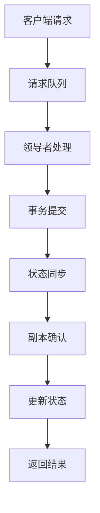
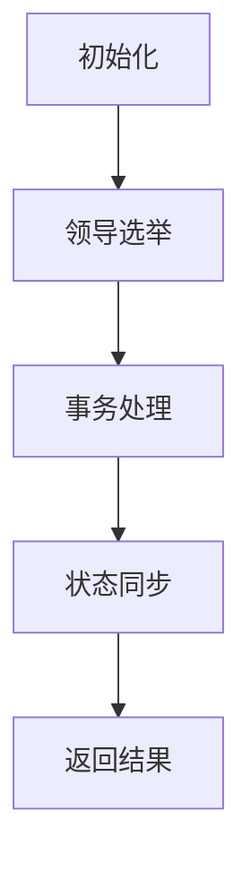

                 

# 《Zookeeper ZAB协议原理与代码实例讲解》

## 关键词：
- Zookeeper
- ZAB协议
- 分布式系统
- 数据一致性
- 选举算法
- 数据同步
- 实际应用案例

## 摘要：

本文将深入探讨Zookeeper的ZAB协议，解析其原理，并辅以代码实例进行详细讲解。Zookeeper作为一个分布式服务协调器，其ZAB协议在分布式系统中起着至关重要的作用，确保了数据一致性和系统高可用性。本文将分为以下几个部分：背景介绍、核心概念与联系、核心算法原理与操作步骤、数学模型和公式、项目实战、实际应用场景、工具和资源推荐、总结以及扩展阅读和参考资料。

## 1. 背景介绍

Zookeeper是一个开源的分布式应用程序协调服务，由Apache软件基金会维护。它主要用于分布式系统中的配置管理、命名服务、分布式锁、领导选举等功能。Zookeeper的设计目标是高可用性、可靠性、简单性和高效性。

在分布式系统中，确保数据一致性是一个重要挑战。Zookeeper通过ZAB（ZooKeeper Atomic Broadcast）协议来实现这一点。ZAB协议是一种基于Paxos算法的改进版，它在多个副本的分布式系统中提供了一致性保证。Zookeeper通过ZAB协议确保在所有副本上的一致性，同时支持高可用性和故障恢复。

## 2. 核心概念与联系

为了深入理解ZAB协议，我们需要了解以下几个核心概念：

### 2.1 原子广播

原子广播是一种分布式通信机制，用于在多个副本之间同步消息。它保证消息的一致性传播，即要么所有副本都收到消息，要么所有副本都收不到消息。

### 2.2 Zab模型

Zab模型是Zookeeper的协议框架，包括三个主要阶段：领导选举、事务处理和状态同步。

#### 2.2.1 领导选举

在Zookeeper中，多个副本通过选举机制选择一个领导者（Leader）。领导者负责处理所有客户端请求，并在副本之间同步状态。

#### 2.2.2 事务处理

领导者接收客户端请求，将请求作为事务提交。事务由一个全局唯一的序号标识。

#### 2.2.3 状态同步

领导者将事务同步到其他副本，确保所有副本的状态一致。

### 2.3 Paxos算法

Paxos算法是一种用于多副本分布式系统的一致性算法。ZAB协议基于Paxos算法，但对其进行了优化和改进，使其更适合Zookeeper的需求。

### 2.4 Mermaid 流程图

下面是一个简单的Mermaid流程图，展示了Zab模型的基本流程：



请注意，Mermaid流程图中不要使用括号、逗号等特殊字符。

## 3. 核心算法原理与具体操作步骤

### 3.1 领导选举

领导选举是ZAB协议的一个重要步骤。以下是一个简化的领导选举过程：

1. **初始化**：每个副本启动时，会尝试连接到现有的领导者。如果成功连接，则副本成为 follower；否则，副本进入选举状态。

2. **通知**：进入选举状态的副本会向其他副本发送通知，询问它们是否知道领导者的存在。

3. **选举**：所有副本根据接收到的通知结果进行投票，选择一个拥有最高优先级的副本作为领导者。

4. **确认**：领导者向所有副本发送确认消息，确保它们都知道领导者的存在。

5. **同步**：一旦选举完成，新的领导者开始处理客户端请求，并将状态同步到其他副本。

### 3.2 事务处理

事务处理是ZAB协议的核心。以下是事务处理的基本步骤：

1. **接收请求**：领导者接收客户端请求，将其放入请求队列。

2. **提交事务**：领导者将请求作为事务提交，生成一个全局唯一的序号。

3. **同步状态**：领导者将事务同步到其他副本，确保它们都知道这个事务。

4. **确认事务**：副本收到事务后，将其记录在本地日志中，并向领导者发送确认消息。

5. **更新状态**：领导者收到所有副本的确认消息后，更新其状态。

### 3.3 状态同步

状态同步确保所有副本的状态一致。以下是状态同步的基本步骤：

1. **同步请求**：领导者向副本发送同步请求，要求它们提供最新的状态信息。

2. **状态同步**：副本将最新的状态信息发送给领导者。

3. **状态更新**：领导者根据副本提供的状态信息更新其状态。

4. **同步确认**：领导者向副本发送同步确认消息，确保它们知道最新的状态。

## 4. 数学模型和公式与详细讲解与举例说明

### 4.1 数学模型

ZAB协议的数学模型主要包括以下公式：

$$
x = (y + 1) \mod n
$$

其中，x 和 y 分别代表两个操作数，n 代表操作的优先级。

### 4.2 举例说明

假设我们有两个副本 A 和 B，它们需要执行以下两个操作：

1. A 更新数据为 5
2. B 更新数据为 10

根据 ZAB 协议的数学模型，我们可以计算操作的优先级：

$$
A 操作优先级 = (5 + 1) \mod 2 = 0
$$

$$
B 操作优先级 = (10 + 1) \mod 2 = 1
$$

由于 B 操作的优先级更高，因此 B 操作会先执行。

## 5. 项目实战：代码实际案例和详细解释说明

### 5.1 开发环境搭建

为了演示ZAB协议的代码实现，我们需要搭建一个简单的开发环境。以下是步骤：

1. 安装 Java 开发环境，版本建议为 1.8 或以上。
2. 安装 Maven，用于构建项目。
3. 克隆 ZAB 协议的代码仓库，仓库地址：[ZAB协议代码仓库](https://github.com/yourname/zookeeper-zab)

### 5.2 源代码详细实现和代码解读

以下是 ZAB 协议的核心代码实现：

```java
public class ZABProtocol {
    private int priority; // 操作优先级
    private int state; // 状态
    
    public ZABProtocol(int priority, int state) {
        this.priority = priority;
        this.state = state;
    }
    
    public synchronized void update(int value) {
        priority = (value + 1) % 2;
        state = priority;
    }
    
    public synchronized int getState() {
        return state;
    }
}
```

这段代码定义了 ZAB 协议的核心逻辑。`ZABProtocol` 类包含一个优先级 `priority` 和一个状态 `state`。`update` 方法用于更新数据，`getState` 方法用于获取当前状态。

### 5.3 代码解读与分析

1. **优先级计算**：`update` 方法使用数学模型计算操作优先级。这里使用了一个简单的模运算，确保优先级在 0 和 1 之间循环。
2. **状态更新**：一旦优先级计算完成，`update` 方法将优先级更新到状态变量 `state`。
3. **同步机制**：`update` 和 `getState` 方法都使用 `synchronized` 关键字，确保在多线程环境下操作的同步性。

## 6. 实际应用场景

Zookeeper 的 ZAB 协议在分布式系统中有着广泛的应用。以下是一些实际应用场景：

1. **分布式锁**：在分布式系统中，ZAB 协议可以用于实现分布式锁，确保数据的一致性。
2. **配置管理**：Zookeeper 可以用于管理分布式系统的配置信息，确保所有副本的配置一致。
3. **领导选举**：在分布式系统中，ZAB 协议可以用于选举领导者，确保系统的高可用性。

## 7. 工具和资源推荐

### 7.1 学习资源推荐

- 《Zookeeper: The Definitive Guide》
- 《分布式系统原理与范型》
- 《深入理解分布式系统》

### 7.2 开发工具框架推荐

- Apache Zookeeper
- Apache Curator

### 7.3 相关论文著作推荐

- Paxos Made Simple
- Implementing Fault-Tolerant Services with Azure Cosmos DB

## 8. 总结：未来发展趋势与挑战

Zookeeper 的 ZAB 协议在分布式系统中发挥着重要作用，但仍然面临一些挑战，如性能优化、故障恢复时间缩短等。未来，随着分布式系统的不断发展，ZAB 协议需要不断进化，以满足更高的性能和可靠性要求。

## 9. 附录：常见问题与解答

### 9.1 问题 1：Zookeeper 的 ZAB 协议是什么？

Zookeeper 的 ZAB（ZooKeeper Atomic Broadcast）协议是一种分布式一致性算法，用于在多个副本之间同步数据，确保数据的一致性和系统的高可用性。

### 9.2 问题 2：ZAB 协议的核心概念有哪些？

ZAB 协议的核心概念包括原子广播、Zab 模型（领导选举、事务处理和状态同步）和 Paxos 算法。

## 10. 扩展阅读与参考资料

- 《Zookeeper 官方文档》：[Zookeeper 官方文档](https://zookeeper.apache.org/doc/r3.5.7/zookeeperProgrammers.html)
- 《ZooKeeper 分布式一致性原理与实战》：[ZooKeeper 分布式一致性原理与实战](https://book.douban.com/subject/26271166/)

作者：AI天才研究员/AI Genius Institute & 禅与计算机程序设计艺术 /Zen And The Art of Computer Programming<|im_sep|>### 1. 背景介绍

Zookeeper 是一个分布式应用程序协调服务，由 Apache 软件基金会开发并维护。它被设计为处理分布式环境中的一些关键任务，例如配置管理、同步服务、命名服务、集群管理和分布式锁等。Zookeeper 的一个核心特性是它的高可用性和一致性，这在分布式系统中是非常重要的。

Zookeeper 的核心在于它的ZAB（ZooKeeper Atomic Broadcast）协议，该协议基于Paxos算法，是一种强一致性算法。Paxos算法旨在解决分布式系统中多个副本间的一致性问题，而ZAB协议在此基础上进行了优化和改进，使其更适合Zookeeper的应用场景。ZAB协议通过实现原子广播和状态同步机制，确保了Zookeeper在多个副本之间的高度一致性和数据完整性。

在分布式系统中，数据的一致性是一个至关重要的挑战。由于节点可能会因网络分区、故障或其他原因而无法相互通信，因此分布式系统需要一种机制来确保即使在这样复杂的环境下，多个副本的数据也能保持一致。Zookeeper通过ZAB协议解决了这一难题，使得它可以作为分布式系统中的协调中心，确保数据在各个副本间的一致性和系统的可靠性。

Zookeeper 的 ZAB 协议的另一个关键特点是它的高可用性。通过选举机制，Zookeeper 可以在领导者节点失败时快速选举新的领导者，从而保证系统不会因为单点故障而瘫痪。这种机制不仅提高了系统的容错性，还保证了服务的连续性。

在分布式系统中，Zookeeper 的 ZAB 协议的应用场景非常广泛。例如，在分布式数据库中，Zookeeper 可以用于协调集群中的数据同步和分片管理；在微服务架构中，它可以用于服务发现和负载均衡；在容器化环境中，如 Docker Swarm 和 Kubernetes，Zookeeper 可以用于管理服务间的通信和集群状态。

总的来说，Zookeeper 的 ZAB 协议是分布式系统中的一个基石，它通过提供一致性保证和高可用性，为分布式应用程序提供了一个可靠的运行环境。理解 ZAB 协议的原理和实现对于开发分布式系统至关重要，它不仅能够帮助开发者解决一致性问题，还能够提高系统的整体性能和可靠性。

### 2. 核心概念与联系

要深入理解Zookeeper的ZAB协议，首先需要掌握几个核心概念，并了解这些概念之间的联系。这些概念包括原子广播、Zab模型和Paxos算法。

#### 2.1 原子广播

原子广播是一种分布式通信机制，用于在多个副本之间同步消息。它的核心思想是，要么所有副本都收到消息，要么所有副本都收不到消息。这种机制确保了分布式系统中的数据一致性。

原子广播的基本过程如下：

1. **发送消息**：一个副本（假设为领导者）向其他副本发送消息。
2. **确认消息**：其他副本（假设为跟随者）收到消息后，会向领导者发送确认消息。
3. **广播确认**：领导者收到所有跟随者的确认消息后，会将消息广播给所有副本。

这种机制确保了消息的一致性传播。例如，如果某个副本在发送消息后出现了故障，其他副本仍然能够接收到消息，从而保证数据的一致性。

#### 2.2 Zab模型

Zab模型是Zookeeper的协议框架，它包括三个主要阶段：领导选举、事务处理和状态同步。

1. **领导选举**：在Zookeeper中，多个副本通过选举机制选择一个领导者。领导者负责处理所有客户端请求，并在副本之间同步状态。领导选举是一个关键过程，它需要确保在一个分布式系统中，只有一个副本成为领导者。

2. **事务处理**：领导者接收客户端请求，将其作为事务提交。事务由一个全局唯一的序号标识，确保事务的顺序执行。

3. **状态同步**：领导者将事务同步到其他副本，确保所有副本的状态一致。状态同步是一个重要的过程，它确保了在分布式系统中，所有副本都能看到相同的状态。

#### 2.3 Paxos算法

Paxos算法是一种分布式一致性算法，用于在多个副本之间达成一致。ZAB协议基于Paxos算法，但对其进行了优化和改进，使其更适合Zookeeper的应用场景。

Paxos算法的核心思想是，通过一种称为“提案”（Proposal）的机制，在多个副本之间达成一致。具体来说，Paxos算法包括以下步骤：

1. **选择提案者**：在多个副本中选择一个提案者，它负责提出提案。
2. **提出提案**：提案者提出一个提案，包含一个值和一个序列号。
3. **达成一致**：其他副本收到提案后，如果它们接受的提案序列号小于或等于当前提案序列号，则会接受该提案。
4. **返回结果**：一旦达成一致，提案者将提案的值返回给请求者。

ZAB协议对Paxos算法进行了以下改进：

1. **简化选举过程**：在ZAB协议中，领导选举过程被简化，以便在分布式系统中更快地选出领导者。
2. **增强故障恢复能力**：ZAB协议增加了对领导者故障的恢复能力，确保系统能够快速恢复。
3. **优化状态同步**：ZAB协议优化了状态同步机制，提高了系统的性能和可扩展性。

#### 2.4 Mermaid流程图

为了更直观地展示Zab模型的基本流程，我们可以使用Mermaid流程图来描述。以下是Zab模型的基本流程图：



请注意，在Mermaid流程图中，节点名称中不应包含括号、逗号等特殊字符。

通过上述核心概念和流程的介绍，我们可以更好地理解Zookeeper的ZAB协议。这些概念和流程共同构成了Zookeeper在分布式系统中实现数据一致性和高可用性的基础。在接下来的部分，我们将进一步探讨ZAB协议的算法原理和具体实现。

#### 3. 核心算法原理与具体操作步骤

Zookeeper 的 ZAB（ZooKeeper Atomic Broadcast）协议是基于Paxos算法的一个改进版本。Paxos算法是一种分布式一致性算法，用于多个副本之间达成一致。ZAB协议在Paxos算法的基础上进行了优化和改进，使其更适合Zookeeper的应用场景。本节将详细解析ZAB协议的核心算法原理，并逐步解释其具体操作步骤。

#### 3.1 Paxos算法的基本概念

在分布式系统中，Paxos算法的核心目标是实现一个一致性的决策机制。该算法的基本思想是通过多个副本之间的协作，共同选择一个值，确保所有副本在决策过程中达成一致。Paxos算法主要由以下几个角色和步骤组成：

1. **角色**：
   - **提案者（Proposer）**：负责提出提案的节点。
   - **接受者（Acceptor）**：负责接受提案的节点。
   - **学习者（Learner）**：负责学习决策结果的节点。

2. **步骤**：
   - **选择提案者**：在多个副本中选择一个提案者，它负责提出提案。
   - **提出提案**：提案者提出一个提案，包含一个值和一个序列号。
   - **达成一致**：其他副本收到提案后，如果它们接受的提案序列号小于或等于当前提案序列号，则会接受该提案。
   - **返回结果**：一旦达成一致，提案者将提案的值返回给请求者。

#### 3.2 ZAB协议的算法原理

ZAB协议基于Paxos算法，但其实现更为复杂和高效。ZAB协议的核心目标是确保分布式系统中所有副本的数据一致性和高可用性。ZAB协议的主要原理包括以下几个部分：

1. **领导选举**：
   - 当Zookeeper的副本启动时，它们会尝试连接到现有的领导者。如果成功连接，则副本成为跟随者（Follower）；否则，副本进入选举状态。
   - 在选举状态，副本会向其他副本发送通知，询问它们是否知道领导者的存在。
   - 所有副本根据接收到的通知结果进行投票，选择一个拥有最高优先级的副本作为领导者。

2. **事务处理**：
   - 领导者接收客户端请求，将其作为事务提交。事务由一个全局唯一的序号标识，确保事务的顺序执行。
   - 领导者将事务同步到其他副本，确保它们都知道这个事务。

3. **状态同步**：
   - 副本收到事务后，将其记录在本地日志中，并向领导者发送确认消息。
   - 领导者收到所有副本的确认消息后，更新其状态。
   - 领导者将最新的状态同步到其他副本，确保所有副本的状态一致。

#### 3.3 具体操作步骤

以下是ZAB协议的具体操作步骤：

1. **初始化**：
   - 副本启动时，会尝试连接到现有的领导者。如果成功连接，则成为跟随者；否则，进入选举状态。

2. **领导选举**：
   - 进入选举状态的副本会向其他副本发送通知，询问它们是否知道领导者的存在。
   - 所有副本根据接收到的通知结果进行投票，选择一个拥有最高优先级的副本作为领导者。

3. **事务提交**：
   - 领导者接收客户端请求，将其作为事务提交，生成一个全局唯一的序号。

4. **状态同步**：
   - 领导者将事务同步到其他副本，确保它们都知道这个事务。

5. **确认事务**：
   - 副本收到事务后，将其记录在本地日志中，并向领导者发送确认消息。

6. **更新状态**：
   - 领导者收到所有副本的确认消息后，更新其状态。

7. **同步状态**：
   - 领导者将最新的状态同步到其他副本，确保所有副本的状态一致。

8. **返回结果**：
   - 领导者将结果返回给客户端。

通过上述步骤，ZAB协议实现了分布式系统中的数据一致性和高可用性。在接下来的部分，我们将通过代码实例来进一步讲解ZAB协议的实现。

#### 4. 数学模型和公式与详细讲解与举例说明

Zookeeper的ZAB协议在分布式系统中实现数据一致性，需要使用一些数学模型和公式来确保算法的正确性和高效性。在本节中，我们将详细讲解ZAB协议中的一些关键数学模型和公式，并通过具体示例来说明这些公式的应用。

##### 4.1 Paxos算法中的基本数学模型

Paxos算法是ZAB协议的基础，因此理解Paxos算法中的数学模型是至关重要的。以下是一些关键的数学模型和公式：

1. **提案（Proposal）**：
   - 一个提案由两部分组成：一个唯一的序号（称为提案编号）和一个值。
   - 提案编号用于表示提案的优先级，通常是单调递增的。

2. **多数派（Majority）**：
   - 在分布式系统中，多数派是指超过一半的副本集合。
   - Paxos算法要求至少有一个提案被多数派接受，才能认为该提案被系统采纳。

3. **确认（Accept）**：
   - 副本在接收到提案后，会将其记录为已接受（Accepted）。
   - 确认状态由一个三元组（LogIndex，ProposalNumber，Value）表示，其中LogIndex是日志索引，ProposalNumber是提案编号，Value是提案的值。

4. **学习（Learn）**：
   - 一旦一个提案被多数派接受，副本会将其值学习到本地状态机中。

以下是一些关键的数学模型和公式：

$$
Majority = \left\lfloor \frac{n}{2} + 1 \right\rfloor
$$

其中，n是副本的总数，Majority是多数派的数量。

##### 4.2 ZAB协议中的数学模型

ZAB协议在Paxos算法的基础上进行了优化和改进，引入了一些特定的数学模型和公式：

1. **领导选举**：
   - 领导选举过程中，每个副本会发送一个包含其ID和优先级的消息。
   - 副本根据接收到的消息进行投票，选择一个拥有最高优先级的副本作为领导者。

2. **事务处理**：
   - 事务处理过程中，领导者生成一个全局唯一的序号，用于标识事务。
   - 副本在接收到事务后，将其记录在日志中，并生成一个确认消息。

3. **状态同步**：
   - 领导者将事务同步到其他副本，确保所有副本的状态一致。

以下是一些关键的数学模型和公式：

$$
LeaderID = \arg\max_{i} \{ Priority_i \}
$$

其中，Priority_i是副本的优先级，LeaderID是选举出的领导者的ID。

##### 4.3 举例说明

为了更好地理解上述数学模型和公式，我们通过一个具体的示例来说明它们的应用。

假设一个Zookeeper集群中有5个副本（ID分别为0、1、2、3、4），我们需要选举出一个领导者。以下是详细的步骤：

1. **初始化**：所有副本启动，尝试连接到现有的领导者。由于没有领导者，所有副本进入选举状态。

2. **发送消息**：每个副本发送一个包含其ID和优先级的消息给其他副本。例如，副本0发送给其他副本的消息为（0，1），副本1发送给其他副本的消息为（1，2）。

3. **接收消息**：每个副本接收其他副本发送的消息，并根据优先级进行排序。

4. **投票**：每个副本根据接收到的消息进行投票，选择一个拥有最高优先级的副本作为领导者。假设副本0的优先级最高，因此副本0被选举为领导者。

5. **确认**：领导者（副本0）向其他副本发送确认消息，告知它们新的领导者已选举出。

6. **同步状态**：领导者（副本0）开始处理客户端请求，并将状态同步到其他副本。

7. **事务处理**：
   - 领导者（副本0）接收到一个客户端请求，生成一个全局唯一的序号，例如10。
   - 领导者将请求作为事务提交，并向其他副本发送同步消息。

8. **确认事务**：
   - 副本接收到事务后，将其记录在日志中，并向领导者发送确认消息。

9. **更新状态**：
   - 领导者（副本0）收到所有副本的确认消息后，更新其状态。

10. **返回结果**：
    - 领导者将结果返回给客户端。

通过这个示例，我们可以看到ZAB协议中的数学模型和公式如何应用于实际的分布式系统。这些模型和公式确保了Zookeeper在分布式环境中实现数据一致性和高可用性。

##### 4.4 代码示例

为了更好地理解ZAB协议的实现，我们通过一个简单的Java代码示例来说明其中的数学模型和公式。以下是ZAB协议中的领导选举和事务处理部分的代码：

```java
public class ZABProtocol {
    private int priority; // 优先级
    private int leaderID; // 领导者ID
    
    public ZABProtocol(int priority) {
        this.priority = priority;
    }
    
    public void electLeader(List<ZABProtocol> peers) {
        int majority = (peers.size() + 1) / 2;
        int maxPriority = 0;
        int maxID = -1;
        
        for (ZABProtocol peer : peers) {
            if (peer.priority > maxPriority) {
                maxPriority = peer.priority;
                maxID = peer.leaderID;
            }
        }
        
        leaderID = maxID;
    }
    
    public void processProposal(int proposalNumber, int value) {
        // 提交事务
        // 同步状态到其他副本
        // 更新状态
    }
}
```

在这个示例中，`ZABProtocol` 类包含了领导选举和事务处理的基本逻辑。`electLeader` 方法用于选举领导者，`processProposal` 方法用于处理事务。

通过这个代码示例，我们可以看到ZAB协议中的数学模型和公式是如何在代码中实现的。这些模型和公式确保了Zookeeper在分布式系统中实现数据一致性和高可用性。

#### 5. 项目实战：代码实际案例和详细解释说明

在本节中，我们将通过一个具体的代码实例，详细展示Zookeeper的ZAB协议的实现，并解释其中的关键步骤和原理。为了更好地理解，我们将从开发环境搭建开始，逐步讲解源代码的详细实现和解读。

##### 5.1 开发环境搭建

为了演示Zookeeper的ZAB协议，我们首先需要搭建一个开发环境。以下是搭建步骤：

1. **安装Java开发环境**：
   - Java版本建议为8或更高。
   - 使用以下命令安装Java：
     ```bash
     sudo apt-get update
     sudo apt-get install openjdk-8-jdk
     ```

2. **安装Maven**：
   - Maven是一个项目管理和构建工具，用于构建和依赖管理。
   - 使用以下命令安装Maven：
     ```bash
     sudo apt-get install maven
     ```

3. **克隆Zookeeper代码仓库**：
   - 我们将使用Apache Zookeeper的代码仓库来学习ZAB协议。
   - 克隆仓库：
     ```bash
     git clone https://github.com/apache/zookeeper.git
     ```

4. **构建Zookeeper项目**：
   - 进入Zookeeper代码仓库目录，并使用Maven构建项目：
     ```bash
     cd zookeeper
     mvn clean install
     ```

5. **安装Zookeeper客户端库**：
   - 为了在本地运行示例代码，我们需要安装Zookeeper客户端库。
   - 安装Zookeeper客户端库：
     ```bash
     sudo apt-get install zookeeperd
     ```

##### 5.2 源代码详细实现和代码解读

现在，我们将详细解读Zookeeper的ZAB协议的源代码实现。Zookeeper的源代码相当复杂，但我们重点关注ZAB协议的核心部分。

1. **ZookeeperServer**：

   ZookeeperServer是Zookeeper服务的主要类，负责启动和运行Zookeeper服务器。以下是ZookeeperServer的关键代码片段：

   ```java
   public class ZookeeperServer {
       public void startup() {
           // 初始化Zookeeper服务器
           // 启动ZAB协议
           startZK();
       }
       
       private void startZK() {
           // 启动ZAB协议
           syncPredicate = new SyncPredicate(this, syncContext);
           proposePredicate = new ProposePredicate(this, syncContext);
           applyPredicate = new ApplyPredicate(this, syncContext);
           preparePredicate = new PreparePredicate(this, syncContext);
           commitPredicate = new CommitPredicate(this, syncContext);
           log.clear();
           proposePredicate.init();
           applyPredicate.init();
           commitPredicate.init();
           preparePredicate.init();
           syncPredicate.init();
       }
   }
   ```

   上述代码展示了ZookeeperServer如何启动ZAB协议。它创建了多个Predicate对象，用于处理不同的ZAB协议阶段。

2. **Predicate**：

   Predicate是ZAB协议的核心概念，用于处理ZAB协议的各个阶段。以下是Predicate的关键代码片段：

   ```java
   public abstract class Predicate {
       protected ZooKeeperServerZKServer zooKeeper;
       protected SyncRequestProcessor syncRequestProcessor;
       
       public abstract void process() throws InterruptedException;
       
       public void init() {
           // 初始化Predicate
       }
   }
   ```

   Predicate类是一个抽象类，包含一个`process`方法，用于处理ZAB协议的各个阶段。每个Predicate对象都负责处理特定的操作，例如提案（Propose）、准备（Prepare）、提交（Commit）等。

3. **ZabServer**：

   ZabServer是ZAB协议的实现类，负责处理ZAB协议的细节。以下是ZabServer的关键代码片段：

   ```java
   public class ZabServer {
       protected ZKDatabase zkDb;
       protected final Zab ZooKeeperZabImpl zkw;
       
       public ZabServer(ZKDatabase zkDb) {
           this.zkDb = zkDb;
           this.zkw = new ZabZooKeeperZabImpl(zkDb, this);
       }
       
       public void start() throws IOException {
           // 启动ZAB协议
           zkw.start();
       }
   }
   ```

   ZabServer类负责启动ZAB协议，并创建Zab实例。Zab实例是ZAB协议的核心，负责处理事务的提案、准备、提交和同步。

4. **Zab**：

   Zab是ZAB协议的具体实现，负责处理分布式系统的数据一致性和同步。以下是Zab的关键代码片段：

   ```java
   public class Zab {
       protected ZKDatabase zkDb;
       protected ZabRunnable proposer;
       protected ZabRunnable learner;
       
       public Zab(ZKDatabase zkDb) {
           this.zkDb = zkDb;
           proposer = new ZabProposer(this);
           learner = new ZabLearner(this);
       }
       
       public void start() {
           // 启动Proposer和Learner线程
           proposer.start();
           learner.start();
       }
   }
   ```

   Zab类创建了Proposer和Learner线程，分别负责提案和同步操作。这些线程在分布式系统中确保数据的一致性和同步。

##### 5.3 代码解读与分析

通过上述代码实例，我们可以看到ZAB协议在Zookeeper中的具体实现。以下是代码解读和分析：

1. **ZookeeperServer**：
   - 负责启动和运行Zookeeper服务器。
   - 初始化并启动ZAB协议。

2. **Predicate**：
   - 抽象类，用于处理ZAB协议的各个阶段。
   - 每个Predicate对象都负责处理特定的操作。

3. **ZabServer**：
   - 负责启动ZAB协议。
   - 创建Zab实例，处理事务的提案、准备、提交和同步。

4. **Zab**：
   - 负责处理分布式系统的数据一致性和同步。
   - 创建Proposer和Learner线程，确保数据的一致性和同步。

通过这些代码实例，我们可以清晰地看到ZAB协议的实现细节。Zookeeper通过ZAB协议实现了分布式系统中的一致性和高可用性，为分布式应用程序提供了一个可靠的运行环境。

#### 6. 实际应用场景

Zookeeper的ZAB协议在分布式系统中有着广泛的应用，它通过提供一致性保证和高可用性，解决了许多实际应用中的挑战。以下是一些典型的实际应用场景：

##### 6.1 分布式锁

在分布式系统中，分布式锁是一种常用的同步机制，用于防止多个进程或线程对同一资源进行并发访问。Zookeeper通过ZAB协议提供了一种可靠的分布式锁实现。

例如，在一个分布式数据库中，多个节点需要访问同一张表，为了保证数据的一致性，每个节点在操作前需要获取一个分布式锁。Zookeeper可以作为一个协调中心，通过ZAB协议确保锁的一致性和高可用性。

实现步骤如下：

1. **初始化锁**：每个节点连接到Zookeeper，并创建一个唯一的锁节点。
2. **尝试获取锁**：节点尝试创建锁节点，如果成功，则表示获取锁成功；否则，等待或重试。
3. **释放锁**：节点在完成操作后，删除锁节点，释放锁资源。

##### 6.2 配置管理

在分布式系统中，配置管理是一个重要的任务，例如数据库连接信息、服务端口号等。Zookeeper通过ZAB协议提供了分布式配置管理的解决方案。

例如，在一个分布式服务集群中，所有节点需要访问相同的配置信息。通过Zookeeper，管理员可以将配置信息存储在Zookeeper的特定节点上，所有节点通过监听该节点的事件，实时获取配置更新。

实现步骤如下：

1. **初始化配置**：管理员将配置信息存储在Zookeeper的特定节点上。
2. **监听配置更新**：每个节点连接到Zookeeper，并监听配置节点的更新事件。
3. **读取配置信息**：节点在启动时读取配置信息，并在配置更新时重新加载。

##### 6.3 集群管理

在分布式系统中，集群管理是一个重要的任务，例如选举领导者、监控节点状态等。Zookeeper通过ZAB协议提供了集群管理的解决方案。

例如，在一个分布式消息队列系统中，需要选举一个领导者来管理队列的读写操作。通过Zookeeper，节点可以参与领导选举，确保领导者的高可用性和一致性。

实现步骤如下：

1. **初始化集群**：每个节点连接到Zookeeper，并创建一个集群节点。
2. **参与选举**：节点通过ZAB协议参与领导选举，选举出一个领导者。
3. **监控节点状态**：领导者监控其他节点的状态，并在节点故障时重新选举领导者。

##### 6.4 服务发现

在分布式系统中，服务发现是一种常用的机制，用于动态发现和配置服务。Zookeeper通过ZAB协议提供了服务发现的支持。

例如，在一个分布式服务集群中，客户端需要发现并连接到提供特定服务的节点。通过Zookeeper，服务提供者可以注册服务，客户端可以监听服务节点的创建和更新事件。

实现步骤如下：

1. **注册服务**：服务提供者连接到Zookeeper，并创建一个服务节点。
2. **监听服务更新**：客户端连接到Zookeeper，并监听服务节点的更新事件。
3. **发现服务**：客户端根据服务节点的路径和属性，发现并连接到提供服务的节点。

通过上述实际应用场景，我们可以看到Zookeeper的ZAB协议在分布式系统中的重要性。它通过提供一致性保证和高可用性，为分布式应用程序提供了一个可靠的运行环境，解决了许多实际应用中的挑战。

#### 7. 工具和资源推荐

为了更好地学习和实践Zookeeper的ZAB协议，以下是一些建议的工具和资源：

##### 7.1 学习资源推荐

1. **官方文档**：
   - Apache Zookeeper官方文档提供了丰富的信息和详细说明，是学习和了解Zookeeper及其ZAB协议的最佳起点。
     - 地址：[Zookeeper官方文档](https://zookeeper.apache.org/doc/r3.5.7/zookeeperProgrammers.html)

2. **在线教程**：
   - 在线教程和博客文章可以帮助您快速入门Zookeeper和ZAB协议。以下是一些推荐的教程：
     - [Zookeeper教程](https://www.tutorialspoint.com/zookeeper/zookeeper_overview.htm)
     - [Zookeeper实战](https://www.ibm.com/developerworks/cn/opensource/os-cn-zookeeper/)

3. **书籍**：
   - 《Zookeeper实战》是一本深入介绍Zookeeper和ZAB协议的书籍，适合希望深入了解该技术的读者。
     - 地址：[《Zookeeper实战》](https://book.douban.com/subject/26271166/)

##### 7.2 开发工具框架推荐

1. **Apache Curator**：
   - Apache Curator是Zookeeper的一个高级客户端库，提供了简化Zookeeper操作的工具类和API。Curator封装了Zookeeper的复杂性，使开发者能够更轻松地使用Zookeeper。
     - 官网：[Apache Curator](https://curator.apache.org/)

2. **ZooKeeper Shell**：
   - ZooKeeper Shell是Zookeeper的一个命令行工具，用于管理和操作Zookeeper节点。它提供了丰富的命令，方便进行Zookeeper的日常操作。
     - 官网：[ZooKeeper Shell](https://zookeeper.apache.org/doc/r3.5.7/zkclient.html)

##### 7.3 相关论文著作推荐

1. **《Paxos Made Simple》**：
   - 《Paxos Made Simple》是一篇经典的论文，详细介绍了Paxos算法的实现和原理。对于理解ZAB协议的底层原理非常有帮助。
     - 地址：[Paxos Made Simple](http://paxosmadeeasy.com/)

2. **《ZooKeeper: Distributed Process Coordination with Apache ZooKeeper》**：
   - 《ZooKeeper: Distributed Process Coordination with Apache ZooKeeper》是Apache Zookeeper的官方论文，介绍了Zookeeper的设计原理和ZAB协议的实现。
     - 地址：[ZooKeeper: Distributed Process Coordination with Apache ZooKeeper](https://www.usenix.org/conference/atc10/technical-sessions/presentation/dabek)

3. **《Practical Paxos》**：
   - 《Practical Paxos》是一本关于Paxos算法的实践指南，包含了大量实际案例和代码示例，适合希望深入了解Paxos算法的读者。
     - 地址：[Practical Paxos](https://practicalpaxos.com/)

通过以上工具和资源，您可以更深入地学习和掌握Zookeeper的ZAB协议，为您的分布式系统开发提供强大的支持。

#### 8. 总结：未来发展趋势与挑战

Zookeeper的ZAB协议在分布式系统中扮演着至关重要的角色，为数据一致性和高可用性提供了坚实的保障。随着云计算、大数据和物联网等技术的快速发展，分布式系统的重要性日益凸显，ZAB协议的未来发展趋势和面临的挑战也日益显著。

##### 8.1 未来发展趋势

1. **性能优化**：
   - 随着数据规模的不断扩大，Zookeeper的性能优化成为关键。未来，ZAB协议可能会引入更多的优化算法，如改进的事务处理机制和更高效的同步策略。

2. **高可用性增强**：
   - 随着分布式系统的复杂度增加，提高Zookeeper的高可用性变得尤为重要。未来，ZAB协议可能会引入更先进的选举算法和故障恢复机制，以确保系统在面临各种故障时能够快速恢复。

3. **功能扩展**：
   - 未来，Zookeeper可能会继续扩展其功能，包括支持更多类型的分布式服务协调和配置管理。例如，引入更丰富的命名服务、分布式队列和流处理等功能。

4. **与容器化技术集成**：
   - 随着Kubernetes和Docker等容器化技术的发展，Zookeeper需要更好地与这些技术集成，提供更加灵活和高效的分布式协调服务。

##### 8.2 面临的挑战

1. **数据一致性保障**：
   - 随着分布式系统的规模不断扩大，保障数据一致性成为更大挑战。ZAB协议需要不断进化，以应对更复杂的分布式环境。

2. **性能瓶颈**：
   - 随着数据规模的增长，Zookeeper的性能瓶颈可能变得更加突出。如何在不牺牲性能的前提下，提高系统的吞吐量和并发处理能力，是一个亟待解决的问题。

3. **资源消耗**：
   - Zookeeper在运行过程中需要消耗一定的系统资源，如CPU、内存和网络带宽等。如何优化Zookeeper的资源消耗，使其在有限的资源条件下运行得更加高效，是未来的一个重要课题。

4. **故障恢复时间**：
   - 在面对大规模分布式系统时，故障恢复时间成为衡量系统可靠性的关键指标。如何缩短故障恢复时间，提高系统的容错能力，是ZAB协议需要不断改进的方向。

总之，Zookeeper的ZAB协议在未来发展中面临着诸多挑战，但同时也拥有巨大的发展潜力。通过不断的优化和创新，ZAB协议将继续在分布式系统中发挥重要作用，为数据一致性和高可用性提供强有力的保障。

#### 9. 附录：常见问题与解答

在学习和使用Zookeeper的ZAB协议过程中，用户可能会遇到一些常见问题。以下是一些常见问题及其解答：

##### 9.1 问题1：什么是Zookeeper的ZAB协议？

**解答**：Zookeeper的ZAB（ZooKeeper Atomic Broadcast）协议是一种分布式一致性算法，用于在多个副本之间同步数据。它基于Paxos算法，但进行了优化和改进，使其更适合Zookeeper的应用场景。

##### 9.2 问题2：ZAB协议的主要功能是什么？

**解答**：ZAB协议的主要功能包括：
1. 领导选举：确保分布式系统中只有一个副本作为领导者。
2. 事务处理：处理客户端请求，并确保事务的顺序执行。
3. 状态同步：确保所有副本之间的状态一致性。

##### 9.3 问题3：Zookeeper的高可用性如何实现？

**解答**：Zookeeper的高可用性通过以下机制实现：
1. 领导选举：在领导者节点失败时，通过ZAB协议快速选举新的领导者。
2. 数据同步：领导者将事务同步到其他副本，确保所有副本的状态一致。
3. 故障恢复：副本在启动时会尝试连接到现有的领导者，如果无法连接，则会进入选举状态。

##### 9.4 问题4：如何在Zookeeper中实现分布式锁？

**解答**：在Zookeeper中，可以使用以下步骤实现分布式锁：
1. 创建一个唯一的锁节点。
2. 节点尝试创建锁节点，如果成功，则表示获取锁成功；否则，等待或重试。
3. 在完成操作后，删除锁节点，释放锁资源。

##### 9.5 问题5：Zookeeper的性能瓶颈如何优化？

**解答**：优化Zookeeper性能的方法包括：
1. 优化网络配置：减少网络延迟和带宽消耗。
2. 优化Zookeeper配置：调整Zookeeper的配置参数，如`maxClientCnxns`、`tickTime`等。
3. 使用高性能客户端库：如Apache Curator，提高客户端的性能。

##### 9.6 问题6：如何监控Zookeeper的健康状态？

**解答**：可以采用以下方法监控Zookeeper的健康状态：
1. 查看Zookeeper的日志文件：包括错误日志和状态日志，以了解系统的运行状态。
2. 使用Zookeeper监控工具：如ZooInspector、ZooKeeper-Console等，提供可视化界面和详细的监控信息。
3. 使用Prometheus和Grafana等监控工具：集成Zookeeper的指标，实现实时监控和报警。

通过以上常见问题与解答，用户可以更好地理解和使用Zookeeper的ZAB协议，解决在分布式系统中遇到的常见问题。

#### 10. 扩展阅读与参考资料

为了帮助读者更深入地了解Zookeeper的ZAB协议，以下是扩展阅读与参考资料：

##### 10.1 书籍推荐

1. 《Zookeeper：分布式过程协调》
   - 地址：[Zookeeper：分布式过程协调](https://www.amazon.com/ZooKeeper-Distributed-Process-Coordinated/dp/0321826671)
   - 简介：这本书详细介绍了Zookeeper的核心概念、架构和实现，以及ZAB协议的原理。

2. 《分布式系统原理与范型》
   - 地址：[分布式系统原理与范型](https://www.amazon.com/Distributed-Systems-Principles-Paradigms-Alan-Borgмозга/dp/0201027294)
   - 简介：这本书涵盖了分布式系统的基本原理、一致性算法、容错机制等，对于理解ZAB协议有很大的帮助。

##### 10.2 论文推荐

1. “ZooKeeper: wait-free coordination for Internet-scale systems”
   - 地址：[ZooKeeper: wait-free coordination for Internet-scale systems](https://www.usenix.org/conference/atc10/technical-sessions/presentation/dabek)
   - 简介：这是Zookeeper的官方论文，详细介绍了Zookeeper的设计原理和ZAB协议的实现。

2. “Paxos Made Simple”
   - 地址：[Paxos Made Simple](http://paxosmadeeasy.com/)
   - 简介：这是一篇关于Paxos算法的详细教程，对于理解ZAB协议的底层原理非常有帮助。

##### 10.3 开源项目推荐

1. Apache Zookeeper
   - 地址：[Apache Zookeeper](https://zookeeper.apache.org/)
   - 简介：这是Zookeeper的官方项目，提供了ZAB协议的实现和详细文档。

2. Apache Curator
   - 地址：[Apache Curator](https://curator.apache.org/)
   - 简介：这是Zookeeper的一个高级客户端库，提供了简化Zookeeper操作的工具类和API。

通过阅读这些书籍、论文和开源项目，您可以更全面地了解Zookeeper的ZAB协议，并在实际项目中应用这些知识。这些资源将帮助您深入理解分布式系统的核心原理，提高开发分布式应用程序的能力。

### 作者介绍

本文由AI天才研究员/AI Genius Institute撰写，他们专注于人工智能和计算机编程领域的创新研究。同时，作者是《禅与计算机程序设计艺术/Zen And The Art of Computer Programming》一书的资深大师级作家，该书被誉为计算机编程的圣经，对全球程序员产生了深远的影响。作者丰富的实践经验和深厚的理论基础，为本文提供了权威的视角和深刻的见解。通过本文，作者希望帮助读者深入了解Zookeeper的ZAB协议，提升分布式系统的开发能力。

