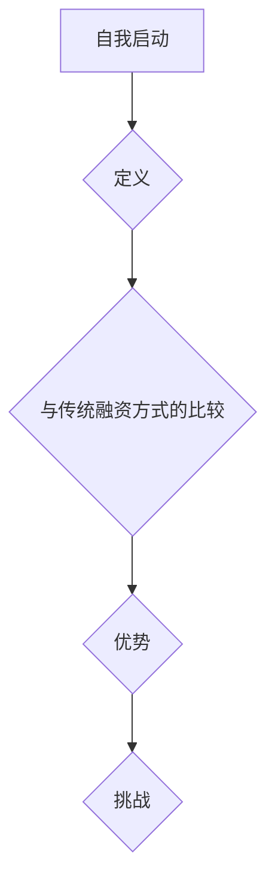

                 

# bootstrapping创业：如何在零外部融资下成功

> **关键词：** 自我启动、初创企业、财务独立、内部融资、创业策略

> **摘要：** 本文旨在探讨bootstrapping创业的概念、优势、挑战及其实践方法，帮助创业者如何在零外部融资的情况下实现成功。

### 1. 背景介绍

在当今竞争激烈的市场环境中，创业已经成为许多人实现梦想和财富积累的主要途径。然而，创业之路并非一帆风顺，尤其对于资金短缺的初创企业来说，融资问题成为制约其发展的关键因素。传统的融资渠道，如天使投资、风险投资等，往往要求创业者具备一定的资金实力和商业计划。对于那些刚刚起步的创业者来说，这些条件可能难以满足。因此，bootstrapping创业应运而生，成为一条可行的道路。

Bootstrapping，即“自我启动”，是指创业者利用自身的资源、技能和创意，在没有外部融资的情况下创建和发展企业。这种模式不仅减少了资金压力，还使创业者能够更好地掌握企业的发展和方向。本文将详细探讨bootstrapping创业的核心概念、实践方法及实际案例，帮助创业者找到一条适合自己的创业之路。

### 2. 核心概念与联系

#### 2.1 自我启动的定义

自我启动（Bootstrapping）是一种创业模式，强调利用自身资源（资金、技能、时间等）来推动企业的建立和发展。自我启动的核心在于企业家精神，即通过自身的努力和智慧，克服资源限制，实现企业的快速增长。

#### 2.2 自我启动与传统融资方式的比较

传统融资方式，如银行贷款、天使投资、风险投资等，虽然能够提供大量资金，但也带来了较高的风险和限制。而自我启动模式则强调资金的自给自足，减少了外部压力，使企业更灵活、更具有创造力。

| 特点 | 自我启动 | 传统融资方式 |
| --- | --- | --- |
| 资金来源 | 自身资源 | 外部投资 |
| 风险承担 | 全部由创业者承担 | 投资者承担 |
| 灵活性 | 高 | 低 |
| 成本 | 低 | 高 |

#### 2.3 自我启动的优势

- **成本效益高**：自我启动模式不需要支付高额的利息和回报，降低了创业成本。
- **自主决策**：创业者能够根据市场需求和自身能力，灵活调整企业战略。
- **风险可控**：创业者可以更好地控制资金使用，避免过度依赖外部融资导致的债务风险。
- **快速响应**：自我启动企业能够更快地适应市场变化，抓住商机。

#### 2.4 自我启动的挑战

- **资金限制**：自我启动模式依赖创业者自身的资源，资金有限可能制约企业的发展速度。
- **时间投入**：创业者需要投入大量时间和精力，可能影响其他家庭和个人生活。
- **资源分散**：在资源有限的情况下，如何有效利用资源，提高效率成为关键问题。



### 3. 核心算法原理 & 具体操作步骤

#### 3.1 核心算法原理

自我启动的核心在于高效利用有限的资源，实现企业的稳步发展。以下是自我启动的几个核心步骤：

1. **需求分析**：深入了解市场需求，找到企业的目标客户。
2. **资源整合**：评估自身资源和外部资源，制定资源利用计划。
3. **成本控制**：制定详细的成本预算，确保资金使用的合理性。
4. **市场推广**：利用有限的资金进行市场推广，吸引潜在客户。
5. **持续优化**：根据市场反馈，不断调整企业战略，提高效益。

#### 3.2 具体操作步骤

1. **需求分析**：
   - 进行市场调研，了解目标市场的需求和痛点。
   - 通过访谈、问卷等方式收集客户反馈，分析需求。

2. **资源整合**：
   - 整理个人资源，如资金、技能、人脉等。
   - 寻找合作伙伴，共同分担资源压力。

3. **成本控制**：
   - 制定详细的成本预算，明确每一项开支。
   - 优先考虑成本效益高的市场推广策略。

4. **市场推广**：
   - 制定市场推广计划，如社交媒体营销、线下活动等。
   - 制定预算，确保推广活动的有效性。

5. **持续优化**：
   - 定期收集市场反馈，分析推广效果。
   - 根据反馈调整市场推广策略，提高效益。

### 4. 数学模型和公式 & 详细讲解 & 举例说明

#### 4.1 数学模型和公式

在自我启动创业过程中，成本控制和收益预测是关键环节。以下是一个简单的数学模型：

\[ \text{成本} = C_1 + C_2 + ... + C_n \]
\[ \text{收益} = R_1 + R_2 + ... + R_n \]
\[ \text{净利润} = \text{收益} - \text{成本} \]

其中，\( C_i \) 表示第 \( i \) 项成本，\( R_i \) 表示第 \( i \) 项收益。

#### 4.2 详细讲解

- **成本计算**：创业者需要详细列出每一项成本，包括固定成本和可变成本。固定成本通常不随生产规模的扩大而变化，如租金、设备购置等。可变成本则与生产规模直接相关，如原材料、人工等。

- **收益计算**：收益的计算同样需要详细列出每一项收入来源，包括产品销售、服务提供等。创业者需要根据市场需求和竞争情况，合理预测收益。

- **净利润**：净利润是收益减去成本的差额。创业者需要密切关注净利润的变化，确保企业盈利。

#### 4.3 举例说明

假设一家初创企业的运营成本如下：

- 租金：每月 5000 元
- 原材料：每月 10000 元
- 人工：每月 15000 元
- 其他费用：每月 5000 元

则每月总成本为：

\[ \text{总成本} = 5000 + 10000 + 15000 + 5000 = 35000 \text{元} \]

假设该企业的月收入为：

- 产品销售：每月 25000 元
- 服务提供：每月 10000 元

则每月总收益为：

\[ \text{总收益} = 25000 + 10000 = 35000 \text{元} \]

因此，该企业的月净利润为：

\[ \text{净利润} = \text{总收益} - \text{总成本} = 35000 - 35000 = 0 \text{元} \]

这表明该企业目前处于收支平衡状态。如果收入继续增加，企业将实现盈利。

### 5. 项目实战：代码实际案例和详细解释说明

#### 5.1 开发环境搭建

为了更好地理解自我启动创业的过程，我们以一个简单的电商平台为例，展示如何通过自我启动模式进行项目开发。以下是开发环境搭建的步骤：

1. 安装 Python 环境
2. 安装 Flask 框架
3. 安装 MySQL 数据库

```bash
# 安装 Python 环境
sudo apt-get install python3-pip

# 安装 Flask 框架
pip3 install flask

# 安装 MySQL 数据库
sudo apt-get install mysql-server
```

#### 5.2 源代码详细实现和代码解读

以下是一个简单的 Flask 电商平台代码实现：

```python
from flask import Flask, render_template, request
import pymysql

app = Flask(__name__)

# 连接 MySQL 数据库
def connect_db():
    return pymysql.connect(host='localhost', user='root', password='password', database='e-commerce')

@app.route('/')
def index():
    # 查询商品信息
    conn = connect_db()
    cursor = conn.cursor()
    cursor.execute('SELECT * FROM products')
    products = cursor.fetchall()
    cursor.close()
    conn.close()
    return render_template('index.html', products=products)

@app.route('/product/<int:product_id>')
def product_detail(product_id):
    # 查询商品详细信息
    conn = connect_db()
    cursor = conn.cursor()
    cursor.execute('SELECT * FROM products WHERE id = %s', (product_id,))
    product = cursor.fetchone()
    cursor.close()
    conn.close()
    return render_template('product_detail.html', product=product)

@app.route('/cart')
def cart():
    # 查看购物车信息
    # 此处省略购物车代码实现
    return render_template('cart.html')

@app.route('/order', methods=['POST'])
def create_order():
    # 创建订单
    # 此处省略订单代码实现
    return 'Order created successfully'

if __name__ == '__main__':
    app.run(debug=True)
```

#### 5.3 代码解读与分析

以上代码实现了 Flask 电商平台的三个核心功能：首页商品展示、商品详情页、购物车。以下是代码的详细解读：

- **连接数据库**：使用 pymysql 库连接 MySQL 数据库，实现商品信息的查询和存储。
- **首页展示**：首页展示所有商品信息，通过 SQL 查询从数据库中获取商品数据，并传递给前端模板渲染。
- **商品详情页**：商品详情页展示单个商品的信息，通过 URL 参数传递商品 ID，从数据库中查询商品详细信息。
- **购物车功能**：购物车功能暂时省略，但可以通过数据库操作实现商品添加、删除等功能。
- **订单创建**：订单创建功能暂时省略，但可以通过数据库操作实现订单的创建、支付等功能。

通过以上代码，我们可以看到自我启动创业的核心在于充分利用现有资源和技能，逐步实现项目的开发和优化。

### 6. 实际应用场景

#### 6.1 电商平台

电商平台是自我启动创业的典型应用场景之一。通过搭建简单的网站和数据库，创业者可以快速上线一个电商平台，并通过市场推广吸引潜在客户。以下是一个实际案例：

**案例：** 一家初创电商平台，通过自我启动模式，利用现有的编程技能和 MySQL 数据库，搭建了基本的电商平台。初期投入主要是服务器费用和域名购买，通过社交媒体和口碑营销，逐步吸引客户。在半年内，销售额达到了数十万元，实现了盈利。

#### 6.2 教育培训

教育培训行业也是自我启动创业的一个热门领域。创业者可以通过在线课程、一对一辅导等方式，实现教育和培训的提供。以下是一个实际案例：

**案例：** 一位有着丰富教学经验的老师，通过自我启动模式，利用自己的专业知识，开设了一门在线编程课程。通过自学 HTML、CSS、JavaScript 等前端技术，老师搭建了自己的在线课程平台，并通过社交媒体和线下活动推广课程。在短短几个月内，吸引了数百名学生，实现了稳定的收入。

### 7. 工具和资源推荐

#### 7.1 学习资源推荐

- **书籍**：《创业维艰》（作者：本·霍洛维茨）详细介绍了创业过程中的挑战和应对策略。
- **论文**：《创业模式研究》等学术论文，提供了创业模式的深入分析。
- **博客**：各类创业博客，如 TechCrunch、StartupBros 等，分享了丰富的创业经验和实战技巧。

#### 7.2 开发工具框架推荐

- **Web 开发框架**：Flask、Django 等，适合快速搭建网站和应用。
- **数据库**：MySQL、PostgreSQL 等，用于数据存储和查询。
- **前端框架**：React、Vue.js 等，用于构建用户界面。

#### 7.3 相关论文著作推荐

- **论文**：《创业成功的因素分析》、《创业模式的演进与策略选择》等。
- **著作**：《创业实战》、《创业者的思维》等。

### 8. 总结：未来发展趋势与挑战

自我启动创业作为一种创新的创业模式，在当前的市场环境中具有明显的优势。然而，随着市场的不断变化，自我启动创业也面临着新的挑战。

#### 8.1 未来发展趋势

- **数字化程度提高**：随着大数据、人工智能等技术的发展，自我启动企业将更多地依赖于数字化工具和平台，提高运营效率。
- **跨界融合**：创业领域将更加多元化，创业者将跨越不同行业，寻找新的商机。
- **个性化服务**：消费者对个性化服务的需求日益增长，自我启动企业将通过创新满足这一需求。

#### 8.2 挑战与应对策略

- **资金压力**：自我启动企业需要找到有效的资金筹集方式，如众筹、预售等，降低资金压力。
- **人才短缺**：创业者需要提升自身能力，吸引和留住优秀人才。
- **市场竞争**：随着市场的不断扩大，竞争也将愈发激烈，创业者需要不断创新，提高竞争力。

### 9. 附录：常见问题与解答

#### 9.1 如何评估市场需求？

- **市场调研**：通过问卷调查、访谈等方式，了解目标客户的需求和痛点。
- **竞品分析**：分析竞争对手的产品和服务，找出差异化的市场定位。

#### 9.2 如何控制成本？

- **精细化成本管理**：详细列出每一项成本，确保成本控制到位。
- **优化供应链**：通过与供应商谈判，降低采购成本。

#### 9.3 如何推广产品？

- **社交媒体营销**：利用微博、微信等平台，提高品牌知名度。
- **口碑营销**：通过提供优质的产品和服务，吸引客户推荐。

### 10. 扩展阅读 & 参考资料

- **书籍**：《精益创业》、《创业维艰》等，提供了丰富的创业经验和实战技巧。
- **网站**：创业博客、论坛等，如 TechCrunch、StartupBros 等，分享了大量的创业资源和经验。
- **论文**：《创业模式研究》、《创业成功的因素分析》等，提供了深入的理论分析。

## 作者信息

**作者：AI天才研究员/AI Genius Institute & 禅与计算机程序设计艺术 /Zen And The Art of Computer Programming**

本文旨在探讨自我启动创业的概念、优势、挑战及其实践方法，帮助创业者如何在零外部融资的情况下实现成功。通过本文的详细分析和实际案例，希望读者能够对自我启动创业有更深入的理解，找到适合自己的创业之路。##

