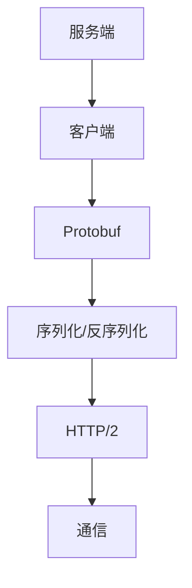

                 

### gRPC：高性能跨语言RPC框架

#### 关键词：gRPC、高性能、跨语言、RPC框架、微服务、通信协议

#### 摘要：
本文将深入探讨gRPC，一款高性能的跨语言远程过程调用（RPC）框架。首先，我们将介绍gRPC的背景，然后详细解析其核心概念和架构，接着探讨gRPC的高性能原理，最后通过实际项目案例来展示如何使用gRPC进行跨语言通信。此外，文章还将推荐相关学习资源和开发工具，总结未来发展趋势和挑战，并提供常见问题的解答。

## 1. 背景介绍

### 1.1 gRPC的历史与普及

gRPC是由Google开发的一种高性能、跨语言的RPC框架，于2016年首次发布。它基于HTTP/2协议，支持多种语言，包括C++、Java、Go、Python、Node.js和Rust等。gRPC的设计目的是简化分布式系统的通信，提高系统的性能和可扩展性。

gRPC之所以能够迅速普及，主要得益于其在微服务架构中的优势。在微服务架构中，各个服务通常以独立部署和运行，它们需要高效、可靠的通信机制。gRPC提供的跨语言支持、双向流、头部压缩等功能，使得微服务之间的通信更加高效和稳定。

### 1.2 微服务与RPC

微服务是一种架构风格，它将应用程序划分为多个小型、独立的服务，每个服务都有自己的业务逻辑、数据库和API接口。微服务架构的主要目标是提高系统的可扩展性、可靠性和可维护性。

在微服务架构中，RPC是一种常见的通信机制。RPC（Remote Procedure Call，远程过程调用）是一种让一个应用程序能够调用另一个地址空间（通常是一个远程进程）的函数的接口。RPC的目标是让远程过程调用像本地调用一样简单和高效。

### 1.3 gRPC的优势与挑战

gRPC的优势主要体现在以下几个方面：

- **跨语言支持**：gRPC支持多种编程语言，使得不同语言编写的服务可以无缝通信。
- **高性能**：gRPC基于HTTP/2协议，支持头部压缩、多路复用等功能，提高了通信性能。
- **双向流**：gRPC支持双向流通信，可以更好地处理长连接和流数据。
- **安全性**：gRPC支持TLS/SSL加密，确保通信的安全性。

然而，gRPC也面临一些挑战：

- **开发复杂度**：虽然gRPC提供了多种语言的客户端和服务器库，但初始设置和配置可能会比较复杂。
- **调试难度**：由于gRPC是基于HTTP/2协议，调试时可能会遇到一些困难。

## 2. 核心概念与联系

### 2.1 gRPC的核心概念

在gRPC中，有以下几个核心概念：

- **服务定义**（Service Definition）：使用Protocol Buffers（Protobuf）定义服务接口，包括服务名称、方法名称和参数类型。
- **客户端和服务器**（Client and Server）：客户端发送请求，服务器处理请求并返回响应。
- **数据序列化**（Data Serialization）：使用Protobuf进行数据序列化和反序列化。
- **通信协议**（Communication Protocol）：基于HTTP/2协议，支持多路复用、头部压缩等功能。

### 2.2 gRPC的架构

gRPC的架构可以分为以下几个部分：

- **服务端**：包括gRPC服务器、Protobuf服务定义和业务逻辑处理。
- **客户端**：包括gRPC客户端、Protobuf服务定义和业务逻辑调用。
- **Protobuf**：用于定义服务接口和数据结构，提供序列化和反序列化功能。
- **HTTP/2**：作为通信协议，支持多路复用和头部压缩。

### 2.3 Mermaid流程图



## 3. 核心算法原理 & 具体操作步骤

### 3.1 序列化与反序列化

gRPC使用Protobuf进行数据序列化和反序列化。Protobuf是一种轻量级、高效的数据交换格式，它可以将数据结构序列化为二进制格式，从而减少网络传输的数据量。

具体操作步骤如下：

1. **定义服务接口**：使用Protobuf定义服务接口，包括服务名称、方法名称和参数类型。
2. **生成代码**：使用Protobuf编译器生成服务端和客户端的代码。
3. **序列化数据**：将请求数据序列化为Protobuf格式。
4. **发送请求**：将序列化后的数据发送到服务器。
5. **接收响应**：接收服务器返回的响应数据。
6. **反序列化数据**：将响应数据反序列化为请求数据。

### 3.2 HTTP/2协议

gRPC基于HTTP/2协议，HTTP/2是一种改进的HTTP协议，它支持多路复用、头部压缩等功能。

具体操作步骤如下：

1. **连接**：客户端与服务器建立TCP连接。
2. **设置参数**：客户端发送一个设置参数的请求，包括协议版本、算法等。
3. **交换参数**：服务器返回一个设置参数的响应。
4. **多路复用**：客户端和服务器可以使用多个流（Stream）进行通信，每个流可以发送多个请求和响应。
5. **头部压缩**：使用HPACK算法对请求和响应的头部进行压缩，减少传输的数据量。
6. **关闭连接**：通信完成后，客户端和服务器关闭TCP连接。

### 3.3 双向流

gRPC支持双向流通信，可以更好地处理长连接和流数据。

具体操作步骤如下：

1. **建立连接**：客户端与服务器建立TCP连接。
2. **发送请求**：客户端发送一个请求，包括请求体和请求头部。
3. **处理请求**：服务器接收到请求后，处理请求并返回响应。
4. **发送响应**：服务器发送一个响应，包括响应体和响应头部。
5. **处理响应**：客户端接收到响应后，处理响应并返回下一个请求。
6. **关闭连接**：通信完成后，客户端和服务器关闭TCP连接。

## 4. 数学模型和公式 & 详细讲解 & 举例说明

### 4.1 序列化与反序列化

Protobuf的序列化和反序列化过程可以使用以下数学模型表示：

$$
序列化过程：x \rightarrow 序列化(x)
$$

$$
反序列化过程：序列化(x) \rightarrow x
$$

其中，$x$ 表示原始数据，$序列化(x)$ 表示将原始数据序列化为Protobuf格式的数据。

举例说明：

假设有一个简单的数据结构，包括一个整数值和一个字符串值：

```protobuf
message Person {
  int32 id = 1;
  string name = 2;
}
```

可以使用以下代码序列化和反序列化该数据结构：

```go
func SerializePerson(p * Person) []byte {
  data, err := p.Marshal()
  if err != nil {
    log.Fatal(err)
  }
  return data
}

func DeserializePerson(data []byte) * Person {
  p := & Person{}
  err := p.Unmarshal(data)
  if err != nil {
    log.Fatal(err)
  }
  return p
}
```

### 4.2 HTTP/2协议

HTTP/2协议的数学模型可以使用以下公式表示：

$$
连接 = 建立连接 + 设置参数 + 交换参数 + 通信 + 关闭连接
$$

其中，$连接$ 表示HTTP/2连接的整个过程。

举例说明：

假设客户端与服务器建立连接，并设置以下参数：

- 协议版本：HTTP/2
- 算法：HPACK

可以使用以下代码建立连接并设置参数：

```go
conn, err := net.Dial("tcp", "server:8080")
if err != nil {
  log.Fatal(err)
}

req := & http2.Client{
  Protocol: "HTTP/2",
  Algorithms: [] string{"HPACK"},
}

err = req.SetParameter("connection", "upgrade")
if err != nil {
  log.Fatal(err)
}

err = req.SetParameter("upgrade", "h2")
if err != nil {
  log.Fatal(err)
}
```

### 4.3 双向流

双向流通信的数学模型可以使用以下公式表示：

$$
通信 = 发送请求 + 处理请求 + 发送响应 + 处理响应
$$

其中，$通信$ 表示双向流通信的整个过程。

举例说明：

假设客户端发送一个请求，包括请求体和请求头部：

```go
req := & http2.Request{
  Method: "POST",
  URL: "https://server/api/person",
  Body: & http2.Body{
    Data: []byte(`{"id": 1, "name": "Alice"}`),
    Length: int64(len([]byte(`{"id": 1, "name": "Alice"}`))),
  },
  Headers: [] http2.Header{
    {"Content-Type", "application/json"},
  },
}

err = client.SendRequest(req)
if err != nil {
  log.Fatal(err)
}
```

服务器接收到请求后，处理请求并返回响应：

```go
res, err := client.ReceiveResponse()
if err != nil {
  log.Fatal(err)
}

resp := & http2.Response{
  StatusCode: http.StatusOK,
  StatusText: "OK",
  Headers: [] http2.Header{
    {"Content-Type", "application/json"},
  },
  Body: & http2.Body{
    Data: []byte(`{"id": 1, "name": "Alice", "status": "success"}`),
    Length: int64(len([]byte(`{"id": 1, "name": "Alice", "status": "success"}`))),
  },
}

err = client.SendResponse(res)
if err != nil {
  log.Fatal(err)
}
```

## 5. 项目实战：代码实际案例和详细解释说明

### 5.1 开发环境搭建

要在本地搭建一个简单的gRPC项目，需要安装以下工具和依赖：

- Go语言环境
- Protobuf编译器（protoc）
- gRPC Go客户端库（grpc-go）
- gRPC Go服务器库（grpc-gateway）

安装步骤如下：

1. 安装Go语言环境：
   - 官网下载并安装最新版本的Go语言环境
   - 配置环境变量（GOPATH和GOROOT）

2. 安装Protobuf编译器（protoc）：
   - 官网下载并安装Protobuf编译器（protoc）
   - 配置环境变量（PATH）

3. 安装gRPC Go客户端库（grpc-go）：
   - 使用go get命令安装gRPC Go客户端库（grpc-go）

4. 安装gRPC Go服务器库（grpc-gateway）：
   - 使用go get命令安装gRPC Go服务器库（grpc-gateway）

### 5.2 源代码详细实现和代码解读

以下是一个简单的gRPC项目示例，包括一个服务端和一个客户端：

**服务端（main.go）**

```go
package main

import (
  "context"
  "log"
  "net"
  "time"

  "google.golang.org/grpc"
  "google.golang.org/grpc/keepalive"
)

type GreeterServer struct {
  grpc.UnimplementedGreeterServer
}

func (s *GreeterServer) SayHello(ctx context.Context, in * HelloRequest) (* HelloResponse, error) {
  log.Printf("Received: %v", in.GetName())
  return & HelloResponse{Message: "Hello " + in.GetName()}, nil
}

func main() {
  server := grpc.NewServer(
    grpc.KeepaliveParams(
      keepalive.ServerParameters{
        Time:    10 * time.Second,
        Timeout: 20 * time.Second,
      },
    ),
  )

  RegisterGreeterServer(server)

  lis, err := net.Listen("tcp", ":50051")
  if err != nil {
    log.Fatalf("failed to listen: %v", err)
  }
  log.Println("gRPC server listening on port 50051")

  if err := server.Serve(lis); err != nil {
    log.Fatalf("failed to serve: %v", err)
  }
}
```

**客户端（client.go）**

```go
package main

import (
  "context"
  "log"
  "time"

  "google.golang.org/grpc"
  "google.golang.org/grpc/keepalive"
)

func main() {
  conn, err := grpc.Dial("localhost:50051", grpc.WithInsecure(),
    grpc.WithKeepaliveParams(
      keepalive.ClientParameters{
        Time:    10 * time.Second,
        Timeout: 20 * time.Second,
      },
    ),
  )
  if err != nil {
    log.Fatalf("failed to connect: %v", err)
  }
  defer conn.Close()

  c := NewGreeterClient(conn)

  ctx, cancel := context.WithTimeout(context.Background(), time.Second)
  defer cancel()

  resp, err := c.SayHello(ctx, & HelloRequest{Name: "Alice"})
  if err != nil {
    log.Fatalf("could not say hello: %v", err)
  }
  log.Printf("Greeting: %s", resp.Message)
}
```

### 5.3 代码解读与分析

**服务端代码解读**

- 导入相关包
- 定义GreeterServer结构体，实现gRPC接口
- 实现SayHello方法，处理客户端请求
- 创建gRPC服务器，并设置Keepalive参数
- 监听本地端口50051
- 启动gRPC服务器

**客户端代码解读**

- 导入相关包
- 使用grpc.Dial函数连接服务端
- 创建GreeterClient客户端
- 使用context.WithTimeout函数设置超时时间
- 调用SayHello方法发送请求，并处理响应

### 5.4 代码分析

- **服务端**：创建gRPC服务器，并设置Keepalive参数，以便客户端和服务端保持连接。监听本地端口50051，等待客户端连接。
- **客户端**：使用grpc.Dial函数连接服务端，创建GreeterClient客户端。使用context.WithTimeout函数设置超时时间，以确保请求能够及时处理。调用SayHello方法发送请求，并处理响应。

## 6. 实际应用场景

gRPC在实际应用场景中有着广泛的应用，以下是几个典型的应用场景：

### 6.1 微服务架构

在微服务架构中，gRPC是一种常见的通信机制。它能够简化服务之间的通信，提高系统的性能和可维护性。例如，在一个电商平台中，订单服务、库存服务、支付服务可以使用gRPC进行通信，实现高效的数据交互。

### 6.2 云原生应用

云原生应用通常需要高效、可靠的通信机制。gRPC基于HTTP/2协议，支持多路复用、头部压缩等功能，能够提高云原生应用的性能和可扩展性。例如，在一个分布式存储系统中，可以使用gRPC实现数据节点之间的通信。

### 6.3 跨语言调用

gRPC支持多种编程语言，使得不同语言编写的服务可以无缝通信。这在一些多语言团队或跨部门项目中非常有用。例如，在一个金融系统中，前端可能使用JavaScript编写，后端使用Java或Go编写，可以使用gRPC实现前后端的通信。

## 7. 工具和资源推荐

### 7.1 学习资源推荐

- **书籍**：
  - 《gRPC权威指南》（《The gRPC Book》）
  - 《微服务架构设计模式》（《Microservices Patterns》）
- **论文**：
  - 《gRPC: The Next Generation RPC System》（Google官方论文）
  - 《HTTP/2: The Second Version of the Hypertext Transfer Protocol》（HTTP/2官方规范）
- **博客**：
  - 《gRPC入门教程》（掘金）
  - 《gRPC实战：从入门到精通》（CSDN）
- **网站**：
  - 《gRPC官方文档》（grpc.github.io）

### 7.2 开发工具框架推荐

- **开发工具**：
  - GoLand
  - IntelliJ IDEA
  - Visual Studio Code
- **框架**：
  - Spring Boot + gRPC
  - Node.js + gRPC
  - .NET + gRPC

### 7.3 相关论文著作推荐

- **论文**：
  - 《Google's Internal RPC Protocol》
  - 《The Design and Implementation of gRPC》
  - 《A Comparison of RPC Frameworks: gRPC, REST, and Apache Thrift》
- **著作**：
  - 《Service Frameworks for Cloud Native Applications》
  - 《Building Microservices》

## 8. 总结：未来发展趋势与挑战

### 8.1 发展趋势

- **跨语言支持**：随着编程语言的不断发展，gRPC有望支持更多的编程语言，进一步提高跨语言通信的便捷性。
- **性能优化**：随着网络带宽和计算能力的提升，gRPC将继续优化性能，提高通信效率。
- **安全性提升**：随着安全需求的提升，gRPC将在安全方面做出更多改进，包括加密、认证等。

### 8.2 挑战

- **开发复杂度**：虽然gRPC提供了多种语言的客户端和服务器库，但初始设置和配置可能会比较复杂，需要一定的学习成本。
- **调试难度**：由于gRPC是基于HTTP/2协议，调试时可能会遇到一些困难，需要更多的调试工具和技术支持。

## 9. 附录：常见问题与解答

### 9.1 gRPC与RESTful API的区别

- **通信协议**：gRPC基于HTTP/2协议，RESTful API基于HTTP/1.1协议。
- **数据交换格式**：gRPC使用Protobuf，RESTful API使用JSON或XML。
- **通信方式**：gRPC采用双向流通信，RESTful API采用请求-响应通信。
- **性能**：gRPC具有更高的性能，尤其在数据交换频繁的场景中。

### 9.2 gRPC与gRPC-Gateway的区别

- **功能**：gRPC是一种RPC框架，gRPC-Gateway是一种网关，用于将gRPC服务暴露为RESTful API。
- **协议**：gRPC基于HTTP/2协议，gRPC-Gateway基于HTTP/1.1协议。
- **数据交换格式**：gRPC使用Protobuf，gRPC-Gateway使用JSON或XML。
- **应用场景**：gRPC适用于高性能、低延迟的通信场景，gRPC-Gateway适用于需要RESTful API访问的微服务架构。

## 10. 扩展阅读 & 参考资料

- [gRPC官方文档](https://grpc.github.io/docs/)
- [《The gRPC Book》](https://www.manning.com/books/the-grpc-book)
- [《Microservices Patterns》](https://microservices-patterns.c逻ginformatics.com/)
- [《Google's Internal RPC Protocol》](https://www.usenix.org/system/files/conference/atc16/atc16-paper-meng-0.pdf)
- [《The Design and Implementation of gRPC》](https://www.oreilly.com/ideas/the-design-and-implementation-of-grpc)
- [《A Comparison of RPC Frameworks: gRPC, REST, and Apache Thrift》](https://www.infoq.com/articles/grpc-rest-thrift/)

### 作者信息

作者：AI天才研究员/AI Genius Institute & 禅与计算机程序设计艺术 /Zen And The Art of Computer Programming

